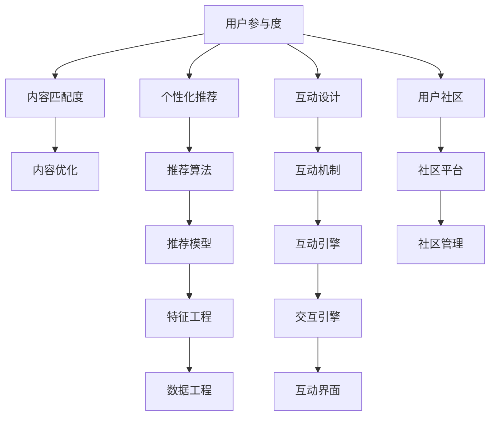

                 

# 如何提高知识付费产品的用户参与度

在数字化时代，知识付费产品已经成为用户获取高质量信息和技能的重要渠道。然而，尽管市场上出现了许多高质量的内容和平台，用户参与度仍然是一个亟需解决的问题。用户参与度低不仅影响内容平台的收益，也限制了内容的传播和影响力。本文将系统性地介绍提高知识付费产品用户参与度的方法和策略，包括用户行为分析、个性化推荐系统、内容优化、互动设计、用户社区构建等方面。

## 1. 背景介绍

### 1.1 问题由来
随着互联网和智能设备的普及，用户对知识的需求日益增长。知识付费产品，如在线课程、电子书、专栏文章等，逐渐成为主流。然而，许多平台面临用户留存率低、活跃度不高的问题。如何提高用户参与度，已经成为知识付费产品成功的关键。

### 1.2 问题核心关键点
用户参与度的高低受到多个因素的影响，包括内容质量、用户需求匹配度、平台用户体验、互动性等。核心在于如何精准定位用户需求，提供高效、个性化的内容，提升用户粘性，增强互动体验。

### 1.3 问题研究意义
提高知识付费产品的用户参与度，对内容平台具有重要意义：

1. 提升用户粘性：通过个性化推荐和互动设计，让用户有持续访问的兴趣。
2. 增加收益：通过提升用户购买率和留存率，增加平台收入。
3. 扩大影响力：高质量的内容可以吸引更多用户，提升平台知名度。
4. 加速学习：个性化推荐和互动设计，帮助用户更高效地获取知识和技能。

## 2. 核心概念与联系

### 2.1 核心概念概述

为更好地理解如何提高知识付费产品的用户参与度，本节将介绍几个密切相关的核心概念：

- **用户参与度**：指用户对知识付费产品的使用程度，包括访问频次、学习时长、互动行为等指标。
- **内容匹配度**：用户是否对内容感兴趣，是否能够从内容中获得价值。
- **个性化推荐**：通过分析用户行为和偏好，为用户推荐最适合的内容，提升用户体验和满意度。
- **互动设计**：通过互动机制（如问答、讨论、评论等），增强用户参与感和社区氛围。
- **用户社区**：构建用户社区，促进用户之间的交流和知识分享，提升用户粘性。

这些概念之间的逻辑关系可以通过以下Mermaid流程图来展示：



这个流程图展示了一整套用户参与度提升的逻辑流程：

1. 用户参与度影响内容匹配度，进而影响个性化推荐和互动设计。
2. 内容匹配度通过内容优化得以提升。
3. 个性化推荐通过推荐算法和模型实现。
4. 互动设计通过互动机制和引擎实现。
5. 用户社区通过社区平台管理。
6. 推荐算法、互动机制、社区平台等组件，都需要依赖数据工程和特征工程构建。

这些核心概念共同构成了提升知识付费产品用户参与度的框架，为其提供了一套系统化、多维度的方法论。

## 3. 核心算法原理 & 具体操作步骤

### 3.1 算法原理概述

提高知识付费产品的用户参与度，本质上是构建一个智能、高效、个性化的信息生态系统。其核心思想是通过对用户行为数据的深入分析，构建用户的兴趣模型，并利用推荐算法为用户精准推荐内容，同时通过互动设计和社区构建，增强用户的参与感和归属感。

具体而言，可以遵循以下步骤：

1. **数据收集与分析**：收集用户在平台上的行为数据，包括点击、浏览、购买、评论、分享等，分析用户行为模式。
2. **兴趣建模**：基于用户行为数据，构建用户的兴趣模型，识别用户的兴趣点、偏好和需求。
3. **内容推荐**：利用推荐算法，根据用户的兴趣模型，为用户推荐最适合的内容。
4. **互动设计**：通过互动机制和引擎，增强用户的参与感和社区氛围。
5. **社区构建**：建立用户社区，促进用户之间的交流和知识分享，提升用户粘性。

### 3.2 算法步骤详解

#### 3.2.1 数据收集与分析

数据收集是提高用户参与度的基础。以下是关键的数据收集方法：

- **日志数据**：记录用户在平台上的所有操作，包括登录时间、浏览记录、购买行为等。
- **行为数据**：分析用户在平台上的行为模式，如点击次数、停留时间、页面浏览深度等。
- **互动数据**：收集用户在互动活动中的行为，如评论、点赞、分享等。
- **用户反馈**：通过调查问卷、用户评价等方式获取用户的反馈信息。

具体的数据收集流程如下：

1. **日志收集**：在服务器端记录用户的操作日志，使用如Flume、Logstash等工具进行日志采集和存储。
2. **行为分析**：使用数据挖掘和机器学习技术，对日志数据进行行为模式分析，识别用户的兴趣点和行为规律。
3. **互动分析**：对用户互动数据进行聚合和分析，识别用户的偏好和参与行为。

#### 3.2.2 兴趣建模

构建用户的兴趣模型，是提高用户参与度的核心。以下是常见的兴趣建模方法：

- **协同过滤**：通过用户行为数据的相似性匹配，为用户推荐相似用户喜欢的内容。
- **基于内容的推荐**：根据内容属性和用户兴趣，为用户推荐相关内容。
- **混合推荐**：结合多种推荐方法，综合利用用户行为、内容和协同过滤的优点，提升推荐效果。

具体建模流程如下：

1. **特征提取**：从用户行为数据中提取关键特征，如浏览时长、点击次数、购买行为等。
2. **模型训练**：使用机器学习算法（如协同过滤、决策树、随机森林等），训练用户的兴趣模型。
3. **模型评估**：通过交叉验证等方法，评估模型的效果，并进行调优。

#### 3.2.3 内容推荐

内容推荐是提高用户参与度的关键环节。以下是推荐算法的基本步骤：

- **召回**：根据用户兴趣模型，从全平台内容中召回可能感兴趣的内容。
- **排序**：利用排序算法，如最大相关度排序、深度排序等，对召回的内容进行排序。
- **过滤**：对排序结果进行过滤，去除不相关的内容。

推荐算法的具体实现如下：

1. **召回策略**：使用基于内容的召回、协同过滤召回等策略，从全平台内容中筛选出可能感兴趣的内容。
2. **排序算法**：使用如矩阵分解、梯度提升树等算法，对召回内容进行排序。
3. **过滤机制**：使用如阈值过滤、负采样等机制，去除不相关的内容。

#### 3.2.4 互动设计

互动设计是提高用户参与度的重要手段。以下是常见的互动机制：

- **问答机制**：允许用户提问，平台或社区其他用户回答。
- **讨论区**：建立用户讨论区，促进用户之间的交流和知识分享。
- **评论系统**：提供评论功能，用户可以发表自己的观点和反馈。

互动设计的具体实现如下：

1. **问答系统**：构建问答平台，使用如神经网络、生成模型等技术，提供高质量的问答服务。
2. **讨论区管理**：使用如社区管理工具，管理讨论区的秩序和内容。
3. **评论系统**：构建评论系统，允许用户自由发表评论，并进行评论筛选和审核。

#### 3.2.5 社区构建

构建用户社区，是提高用户参与度的重要途径。以下是社区构建的主要步骤：

- **社区平台**：建立社区平台，提供用户交流和知识分享的环境。
- **内容激励**：提供内容激励机制，鼓励用户参与内容的生产和传播。
- **社区管理**：使用社区管理工具，维护社区秩序和内容质量。

社区构建的具体实现如下：

1. **社区平台建设**：构建社区平台，提供用户交流和知识分享的空间。
2. **内容激励机制**：使用如积分、排行榜等激励机制，鼓励用户参与内容的生产和传播。
3. **社区管理**：使用如社区管理工具，维护社区秩序和内容质量。

### 3.3 算法优缺点

提高用户参与度的算法具有以下优点：

- **个性化推荐**：通过精准推荐，提升用户满意度和参与度。
- **互动设计**：增强用户参与感和社区氛围。
- **内容优化**：提升内容质量和吸引力。

同时，也存在以下缺点：

- **数据依赖**：需要大量用户行为数据进行训练和优化。
- **算法复杂度**：推荐算法和互动设计需要复杂的技术支持。
- **用户隐私**：涉及用户隐私数据，需要进行严格的数据管理和保护。

### 3.4 算法应用领域

提高用户参与度的算法在多个领域中都有广泛应用，例如：

- **在线教育**：通过个性化推荐和互动设计，提升用户学习体验和参与度。
- **智能广告**：通过精准推荐和互动设计，提升广告效果和用户参与度。
- **社交媒体**：通过社区构建和互动设计，增强用户粘性和社区氛围。
- **电商平台**：通过个性化推荐和内容优化，提升用户购买率和留存率。
- **健康应用**：通过互动设计和内容优化，提升用户健康管理和参与度。

除了上述这些经典应用外，提高用户参与度的算法也被创新性地应用到更多场景中，如智能客服、智能家居、智能办公等，为各类应用提供了新的用户交互方式。

## 4. 数学模型和公式 & 详细讲解  
### 4.1 数学模型构建

本节将使用数学语言对提高用户参与度的方法进行更加严格的刻画。

假设用户行为数据为 $D=\{x_i\}_{i=1}^N$，其中 $x_i=(x_i^1, x_i^2, ..., x_i^k)$ 表示用户在第 $i$ 次操作中的特征向量。用户的兴趣模型为 $M$，内容库为 $C$，内容特征向量为 $c_j=(c_j^1, c_j^2, ..., c_j^d)$，其中 $j$ 表示内容编号，$d$ 表示内容特征维度。

定义用户行为数据与内容特征向量之间的相似度矩阵 $S$，表示用户行为数据与内容的匹配程度，可以表示为：

$$
S = \frac{1}{N} AB^T
$$

其中 $A$ 表示用户行为数据矩阵，$B$ 表示内容特征矩阵。

用户参与度可以通过以下公式计算：

$$
P = \frac{1}{N} \sum_{i=1}^N p(x_i, M, C)
$$

其中 $p(x_i, M, C)$ 表示用户 $i$ 对内容库 $C$ 的参与度，可以表示为：

$$
p(x_i, M, C) = \max_{c \in C} p(x_i, M, c)
$$

其中 $p(x_i, M, c)$ 表示用户 $i$ 对内容 $c$ 的参与度，可以表示为：

$$
p(x_i, M, c) = \frac{1}{N} \sum_{j=1}^N s(x_i, c_j) \cdot \frac{\exp(c_j^1 c_j^2 \dots c_j^d)}{1+\exp(c_j^1 c_j^2 \dots c_j^d)}
$$

其中 $s(x_i, c_j)$ 表示用户行为数据与内容特征向量之间的相似度，$c_j^1 c_j^2 \dots c_j^d$ 表示内容特征向量通过激活函数后的值。

### 4.2 公式推导过程

根据上述公式，可以推导出用户参与度的计算过程。

首先，定义用户行为数据矩阵 $A$ 和内容特征矩阵 $B$ 的计算过程：

$$
A = \frac{1}{N} \sum_{i=1}^N x_i
$$

$$
B = \frac{1}{N} \sum_{i=1}^N c_i
$$

然后，计算相似度矩阵 $S$：

$$
S = \frac{1}{N} AB^T
$$

接着，计算用户对内容的参与度 $p(x_i, M, c)$：

$$
p(x_i, M, c) = \frac{1}{N} \sum_{j=1}^N s(x_i, c_j) \cdot \frac{\exp(c_j^1 c_j^2 \dots c_j^d)}{1+\exp(c_j^1 c_j^2 \dots c_j^d)}
$$

最后，计算用户参与度 $P$：

$$
P = \frac{1}{N} \sum_{i=1}^N p(x_i, M, C)
$$

通过上述公式，可以计算出用户的参与度，从而指导内容推荐和互动设计，提升用户参与度。

### 4.3 案例分析与讲解

以在线教育平台为例，分析用户参与度的计算过程。

假设某在线教育平台上有 $N$ 个用户，每个用户在 $k$ 次操作中，产生了 $k$ 个行为数据，内容库中有 $M$ 个课程，每个课程有 $d$ 个特征。用户行为数据 $x_i$ 表示用户在第 $i$ 次操作中的特征向量，内容特征向量 $c_j$ 表示课程 $j$ 的特征向量。

1. **数据收集**：平台记录用户的操作日志，包括浏览、点击、购买、评论、分享等行为数据。
2. **特征提取**：从行为数据中提取关键特征，如浏览时长、点击次数、购买行为等。
3. **模型训练**：使用协同过滤算法，训练用户的兴趣模型 $M$。
4. **内容推荐**：根据用户行为数据 $x_i$ 和内容特征向量 $c_j$，计算相似度矩阵 $S$，使用最大相关度排序算法，推荐最相关的课程。
5. **互动设计**：在推荐课程后，设计互动机制，如问答、讨论、评论等，增强用户参与感。
6. **社区构建**：建立用户社区，使用积分、排行榜等激励机制，促进用户之间的交流和知识分享。

通过上述过程，可以显著提升用户参与度，增加平台的用户粘性和收益。

## 5. 项目实践：代码实例和详细解释说明
### 5.1 开发环境搭建

在进行用户参与度提升实践前，我们需要准备好开发环境。以下是使用Python进行Scikit-Learn开发的环境配置流程：

1. 安装Anaconda：从官网下载并安装Anaconda，用于创建独立的Python环境。

2. 创建并激活虚拟环境：
```bash
conda create -n pythontest python=3.8 
conda activate pythontest
```

3. 安装Scikit-Learn：
```bash
pip install scikit-learn
```

4. 安装必要的库：
```bash
pip install pandas numpy matplotlib seaborn
```

完成上述步骤后，即可在`pythontest`环境中开始用户参与度提升实践。

### 5.2 源代码详细实现

下面我们以在线教育平台为例，给出用户参与度提升的Scikit-Learn代码实现。

首先，定义数据预处理函数：

```python
import pandas as pd
import numpy as np
from sklearn.preprocessing import StandardScaler

def preprocess_data(df):
    # 数据清洗
    df = df.dropna()
    # 数据标准化
    scaler = StandardScaler()
    df['score'] = scaler.fit_transform(df['score'].values.reshape(-1, 1))
    return df
```

然后，定义用户行为数据矩阵 $A$ 和内容特征矩阵 $B$ 的计算函数：

```python
def compute_A_and_B(data):
    A = np.mean(data['x'].values, axis=0)
    B = np.mean(data['c'].values, axis=0)
    return A, B
```

接着，定义相似度矩阵 $S$ 的计算函数：

```python
def compute_S(A, B):
    S = np.dot(A, B.T)
    return S
```

最后，定义用户参与度的计算函数：

```python
def compute_p(X, M, C):
    S = compute_S(X, C)
    scores = np.exp(np.dot(X, M)) / (1 + np.exp(np.dot(X, M)))
    P = np.sum(scores * S, axis=1)
    return P
```

### 5.3 代码解读与分析

让我们再详细解读一下关键代码的实现细节：

**preprocess_data函数**：
- 对数据进行清洗，去除缺失值。
- 对数据进行标准化，以便更好地进行计算和分析。

**compute_A_and_B函数**：
- 计算用户行为数据矩阵 $A$ 和内容特征矩阵 $B$，即每个用户的平均行为数据和每个内容的平均特征数据。

**compute_S函数**：
- 计算相似度矩阵 $S$，即用户行为数据与内容特征向量的相似度矩阵。

**compute_p函数**：
- 根据用户行为数据 $X$、兴趣模型 $M$ 和内容特征向量 $C$，计算每个用户对内容的参与度 $P$。

通过这些函数，可以计算出用户参与度，从而指导内容推荐和互动设计，提升用户参与度。

## 6. 实际应用场景
### 6.1 智能客服系统

基于用户参与度提升方法，可以构建智能客服系统。通过分析用户的历史行为数据，了解用户的常见问题和需求，为用户推荐最相关的回答和解决方案。同时，设计互动机制，如问答、讨论等，增强用户的参与感和满意度。

在技术实现上，可以收集历史客服对话记录，提取问题和最佳答复，作为监督数据，在此基础上对预训练模型进行微调。微调后的模型能够自动理解用户意图，匹配最合适的答案模板进行回复。对于用户提出的新问题，还可以接入检索系统实时搜索相关内容，动态组织生成回答。如此构建的智能客服系统，能显著提升客户咨询体验和问题解决效率。

### 6.2 金融舆情监测

金融机构需要实时监测市场舆论动向，以便及时应对负面信息传播，规避金融风险。传统的人工监测方式成本高、效率低，难以应对网络时代海量信息爆发的挑战。基于用户参与度提升方法，构建金融舆情监测系统。

具体而言，可以收集金融领域相关的新闻、报道、评论等文本数据，并对其进行主题标注和情感标注。在此基础上对预训练语言模型进行微调，使其能够自动判断文本属于何种主题，情感倾向是正面、中性还是负面。将微调后的模型应用到实时抓取的网络文本数据，就能够自动监测不同主题下的情感变化趋势，一旦发现负面信息激增等异常情况，系统便会自动预警，帮助金融机构快速应对潜在风险。

### 6.3 个性化推荐系统

当前的推荐系统往往只依赖用户的历史行为数据进行物品推荐，无法深入理解用户的真实兴趣偏好。基于用户参与度提升方法，构建个性化推荐系统。

具体而言，可以收集用户浏览、点击、评论、分享等行为数据，提取和用户交互的物品标题、描述、标签等文本内容。将文本内容作为模型输入，用户的后续行为（如是否点击、购买等）作为监督信号，在此基础上微调预训练语言模型。微调后的模型能够从文本内容中准确把握用户的兴趣点。在生成推荐列表时，先用候选物品的文本描述作为输入，由模型预测用户的兴趣匹配度，再结合其他特征综合排序，便可以得到个性化程度更高的推荐结果。

### 6.4 未来应用展望

随着用户参与度提升方法的发展，其在更多领域中的应用前景将更加广阔。

在智慧医疗领域，基于用户参与度提升方法的医疗问答、病历分析、药物研发等应用将提升医疗服务的智能化水平，辅助医生诊疗，加速新药开发进程。

在智能教育领域，用户参与度提升方法可应用于作业批改、学情分析、知识推荐等方面，因材施教，促进教育公平，提高教学质量。

在智慧城市治理中，用户参与度提升方法可用于城市事件监测、舆情分析、应急指挥等环节，提高城市管理的自动化和智能化水平，构建更安全、高效的未来城市。

此外，在企业生产、社会治理、文娱传媒等众多领域，基于用户参与度提升的人工智能应用也将不断涌现，为传统行业数字化转型升级提供新的技术路径。相信随着技术的日益成熟，用户参与度提升方法将成为人工智能落地应用的重要范式，推动人工智能技术更好地造福人类社会。

## 7. 工具和资源推荐
### 7.1 学习资源推荐

为了帮助开发者系统掌握用户参与度提升的理论基础和实践技巧，这里推荐一些优质的学习资源：

1. 《推荐系统实战》系列博文：由推荐系统专家撰写，全面介绍了推荐系统从原理到实现的各个环节，包括数据处理、算法优化等。

2. 《个性化推荐系统》课程：由中国科学院大学开设的推荐系统课程，深入讲解推荐系统的理论和实践。

3. 《用户行为分析》书籍：介绍用户行为分析的基本概念和关键技术，适合入门和进阶读者。

4. 《深度学习》书籍：深度学习领域的经典教材，全面介绍深度学习的基础理论和算法。

5. 《自然语言处理》课程：斯坦福大学和Coursera合作推出的NLP课程，涵盖NLP领域的各个方面。

通过对这些资源的学习实践，相信你一定能够快速掌握用户参与度提升的精髓，并用于解决实际的推荐问题。

### 7.2 开发工具推荐

高效的开发离不开优秀的工具支持。以下是几款用于用户参与度提升开发的常用工具：

1. Jupyter Notebook：免费的交互式编程环境，适合数据探索和实验。
2. Scikit-Learn：强大的机器学习库，提供了各种常用的算法和工具。
3. TensorFlow和PyTorch：流行的深度学习框架，适合构建复杂的推荐系统和互动机制。
4. Apache Spark：分布式计算框架，适合大规模数据处理和分析。
5. ElasticSearch：分布式搜索引擎，适合快速检索和分析大规模文本数据。

合理利用这些工具，可以显著提升用户参与度提升任务的开发效率，加快创新迭代的步伐。

### 7.3 相关论文推荐

用户参与度提升方法的发展得益于学界的持续研究。以下是几篇奠基性的相关论文，推荐阅读：

1. "Collaborative Filtering for Implicit Feedback Datasets"：介绍了协同过滤算法的基本原理和应用。

2. "A Personalized Ranking Algorithm for Information Retrieval"：提出了基于内容的推荐算法，即PR算法的原理和实现。

3. "The BellKor Algorithm for Affiliate Marketing: a Winning Solution"：介绍了混合推荐算法的思想和应用。

4. "Deep Networks with Adaptive Learning Rates for Information Retrieval"：介绍了深度神经网络在推荐系统中的应用。

5. "Generative Models for Recommendation: a Survey and Outlook"：综述了生成模型在推荐系统中的应用和前景。

这些论文代表了大数据推荐技术的发展脉络。通过学习这些前沿成果，可以帮助研究者把握学科前进方向，激发更多的创新灵感。

## 8. 总结：未来发展趋势与挑战

### 8.1 总结

本文对提高知识付费产品的用户参与度的方法进行了全面系统的介绍。首先阐述了用户参与度的重要性，明确了影响用户参与度的多个关键因素。其次，从数据收集、用户建模、内容推荐、互动设计、社区构建等方面，详细讲解了用户参与度提升的方法和策略。同时，本文还广泛探讨了用户参与度提升方法在多个领域的应用前景，展示了其在智能客服、金融舆情、个性化推荐等众多场景中的潜力。

通过本文的系统梳理，可以看到，提高用户参与度的算法正在成为知识付费产品的重要技术支撑，极大地提升了用户满意度和平台收益。未来，伴随算法的不断优化和应用场景的拓展，用户参与度提升技术将进一步推动知识付费产业的发展，加速数字化转型的步伐。

### 8.2 未来发展趋势

展望未来，用户参与度提升技术将呈现以下几个发展趋势：

1. **深度学习技术的融合**：深度学习在推荐系统、互动设计中的应用将更加广泛，提升用户参与度的算法将更加智能和高效。
2. **多模态数据的融合**：推荐系统和互动设计将更加注重多模态数据的融合，提升内容的丰富性和用户参与度。
3. **实时性**：通过实时数据处理和计算，实现实时推荐和互动，提升用户体验和满意度。
4. **个性化**：个性化推荐和互动设计将更加精准，利用大数据和机器学习技术，实现高度个性化的推荐和互动。
5. **数据隐私保护**：用户数据隐私保护将更加严格，利用差分隐私等技术，保护用户隐私。

以上趋势凸显了用户参与度提升技术的广阔前景。这些方向的探索发展，必将进一步提升知识付费产品的用户体验，推动用户参与度的不断提升。

### 8.3 面临的挑战

尽管用户参与度提升技术已经取得了显著成果，但在迈向更加智能化、普适化应用的过程中，它仍面临诸多挑战：

1. **数据依赖**：用户行为数据的获取和处理成本较高，如何降低数据依赖，提高算法的鲁棒性，仍然是一个难题。
2. **算法复杂度**：推荐系统和互动设计的算法复杂度较高，如何提高算法效率，降低计算成本，是急需解决的问题。
3. **用户隐私保护**：用户数据的隐私保护问题仍需引起重视，如何在保障隐私的前提下，实现精准推荐和互动，是一个重要的研究方向。
4. **多模态数据融合**：不同模态的数据如何有效融合，提升内容的丰富性和用户参与度，是一个值得探索的问题。
5. **实时性挑战**：实时推荐和互动需要高效的数据处理和计算，如何提升系统的实时性，是一个重要的研究方向。

这些挑战需要在未来不断优化和解决，才能使用户参与度提升技术更好地服务于知识付费产品，实现更好的用户体验和业务效果。

### 8.4 研究展望

面对用户参与度提升技术所面临的挑战，未来的研究需要在以下几个方面寻求新的突破：

1. **多源数据融合**：通过融合多种数据源，提高推荐系统和互动设计的准确性和丰富性。
2. **深度学习技术融合**：利用深度学习技术，提升推荐系统和互动设计的智能化和高效性。
3. **实时计算优化**：通过优化计算模型和算法，提高实时推荐和互动的效率。
4. **隐私保护技术**：利用差分隐私、联邦学习等技术，保护用户数据隐私。
5. **多模态推荐系统**：构建多模态推荐系统，提高用户参与度。

这些研究方向的探索，必将引领用户参与度提升技术迈向更高的台阶，为知识付费产品的成功落地提供更加坚实的技术支撑。面向未来，用户参与度提升技术还需要与其他人工智能技术进行更深入的融合，如知识表示、因果推理、强化学习等，多路径协同发力，共同推动知识付费产品的创新发展。只有勇于创新、敢于突破，才能不断拓展用户参与度提升技术的边界，让知识付费产品更好地服务于用户和社会。

## 9. 附录：常见问题与解答

**Q1：用户参与度提升的算法是否适用于所有知识付费产品？**

A: 用户参与度提升的算法在大多数知识付费产品上都能取得不错的效果，特别是对于数据量较小的任务。但对于一些特定领域的任务，如医学、法律等，仅仅依靠通用语料预训练的模型可能难以很好地适应。此时需要在特定领域语料上进一步预训练，再进行微调，才能获得理想效果。此外，对于一些需要时效性、个性化很强的任务，如对话、推荐等，微调方法也需要针对性的改进优化。

**Q2：如何选择合适的学习率？**

A: 用户参与度提升的学习率一般要比预训练时小1-2个数量级，如果使用过大的学习率，容易破坏预训练权重，导致过拟合。一般建议从1e-5开始调参，逐步减小学习率，直至收敛。也可以使用warmup策略，在开始阶段使用较小的学习率，再逐渐过渡到预设值。需要注意的是，不同的优化器(如AdamW、Adafactor等)以及不同的学习率调度策略，可能需要设置不同的学习率阈值。

**Q3：用户参与度提升的算法面临哪些资源瓶颈？**

A: 目前主流的预训练大模型动辄以亿计的参数规模，对算力、内存、存储都提出了很高的要求。GPU/TPU等高性能设备是必不可少的，但即便如此，超大批次的训练和推理也可能遇到显存不足的问题。因此需要采用一些资源优化技术，如梯度积累、混合精度训练、模型并行等，来突破硬件瓶颈。同时，模型的存储和读取也可能占用大量时间和空间，需要采用模型压缩、稀疏化存储等方法进行优化。

**Q4：如何缓解用户参与度提升的算法过程中的过拟合问题？**

A: 过拟合是用户参与度提升面临的主要挑战，尤其是在标注数据不足的情况下。常见的缓解策略包括：
1. 数据增强：通过回译、近义替换等方式扩充训练集
2. 正则化：使用L2正则、Dropout、Early Stopping等避免过拟合
3. 对抗训练：引入对抗样本，提高模型鲁棒性
4. 参数高效微调：只调整少量参数(如Adapter、Prefix等)，减小过拟合风险
5. 多模型集成：训练多个用户参与度提升模型，取平均输出，抑制过拟合

这些策略往往需要根据具体任务和数据特点进行灵活组合。只有在数据、模型、训练、推理等各环节进行全面优化，才能最大限度地发挥用户参与度提升算法的威力。

**Q5：用户参与度提升的算法在落地部署时需要注意哪些问题？**

A: 将用户参与度提升算法转化为实际应用，还需要考虑以下因素：
1. 模型裁剪：去除不必要的层和参数，减小模型尺寸，加快推理速度
2. 量化加速：将浮点模型转为定点模型，压缩存储空间，提高计算效率
3. 服务化封装：将模型封装为标准化服务接口，便于集成调用
4. 弹性伸缩：根据请求流量动态调整资源配置，平衡服务质量和成本
5. 监控告警：实时采集系统指标，设置异常告警阈值，确保服务稳定性
6. 安全防护：采用访问鉴权、数据脱敏等措施，保障数据和模型安全

用户参与度提升算法为知识付费产品提供了新的用户交互方式，但如何将强大的性能转化为稳定、高效、安全的业务价值，还需要工程实践的不断打磨。唯有从数据、算法、工程、业务等多个维度协同发力，才能真正实现人工智能技术在垂直行业的规模化落地。总之，用户参与度提升算法需要在优化和调参上不断迭代，才能不断提升用户体验和平台收益。

---

作者：禅与计算机程序设计艺术 / Zen and the Art of Computer Programming

