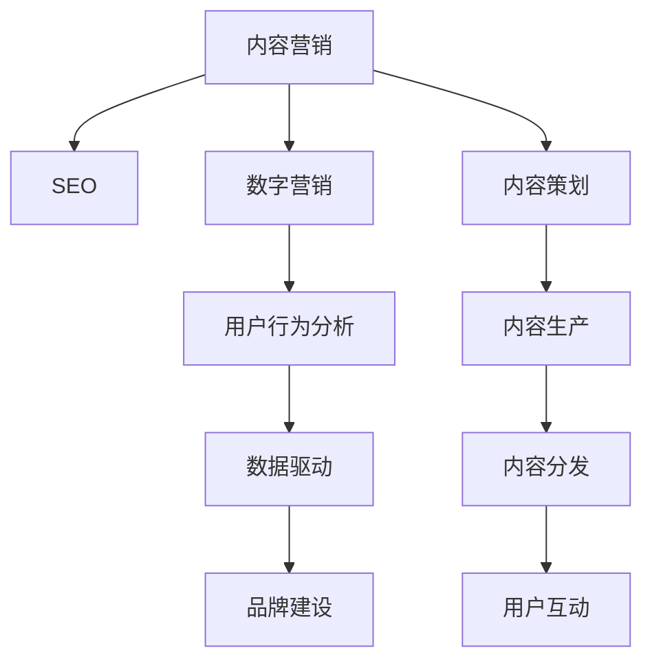

                 

# 如何进行有效的内容营销

> 关键词：内容营销,SEO,数字营销,用户行为,数据驱动,品牌建设

## 1. 背景介绍

### 1.1 问题由来

随着互联网的普及和数字化转型的加速，内容营销已经成为了企业市场推广的主要手段之一。在传统广告效果日益下降的背景下，如何通过高效的内容营销策略提升品牌知名度和用户转化率，成为了众多企业面临的共同挑战。内容营销不仅能够降低企业推广成本，还能在用户心中建立长期的品牌形象，是一种长效的品牌建设手段。

### 1.2 问题核心关键点

内容营销的核心在于通过优质的内容吸引和引导用户，从而实现品牌推广和销售转化的双重目的。这要求内容不仅需要与用户的兴趣和需求高度相关，还需要在多渠道上进行有效的传播和互动。同时，内容的生产也需要结合数据驱动的方法，精准把握用户行为，最大化内容的效果。

### 1.3 问题研究意义

研究如何通过数据驱动和用户行为分析，制定和实施高效的内容营销策略，对于提升企业的市场竞争力和用户满意度具有重要意义：

1. 降低推广成本。内容营销通过优质内容吸引用户关注，减少了对付费广告的依赖，降低了企业推广成本。
2. 提升品牌形象。高质量的内容能够展示企业的专业性和深度，帮助建立长期的品牌信任。
3. 增强用户参与。互动性强的内容能够提高用户的参与度和粘性，促进用户转化。
4. 提供市场洞察。通过用户行为分析，企业可以更好地理解市场需求，调整和优化营销策略。
5. 推动业务增长。高质量的内容和有效的推广策略能够直接带来销售转化，推动企业业务增长。

## 2. 核心概念与联系

### 2.1 核心概念概述

为更好地理解内容营销的策略和方法，本节将介绍几个密切相关的核心概念：

- 内容营销(Content Marketing)：通过提供有价值的内容，吸引和转化用户的营销方式。
- SEO(Search Engine Optimization)：通过优化网站的搜索引擎排名，提升内容的可见性和吸引力。
- 数字营销(Digital Marketing)：通过互联网平台进行品牌推广和用户互动的营销方式。
- 用户行为分析(User Behavior Analysis)：通过分析用户行为数据，了解用户需求和偏好，优化内容策略。
- 数据驱动(Data-Driven)：结合大数据和人工智能技术，通过数据挖掘和分析指导内容生产和推广策略。
- 品牌建设(Brand Building)：通过持续的高质量内容输出，建立品牌信任和声誉。

这些核心概念之间的逻辑关系可以通过以下Mermaid流程图来展示：



这个流程图展示的内容营销的核心概念及其之间的关系：

1. 内容营销的核心在于内容策划、生产、分发和互动。
2. SEO是提升内容可见性的关键手段，通过优化搜索引擎排名吸引更多用户。
3. 数字营销则是通过多渠道推广，提升内容的传播效果。
4. 用户行为分析有助于理解用户需求和偏好，优化内容策略。
5. 数据驱动是内容营销的基础，通过数据分析指导内容生产和推广。
6. 品牌建设是通过持续高质量的内容输出，构建长期的品牌形象。

这些概念共同构成了内容营销的完整框架，使得企业能够通过多维度的策略和手段，高效地实现品牌推广和用户转化。

## 3. 核心算法原理 & 具体操作步骤
### 3.1 算法原理概述

内容营销的核心在于通过优质内容吸引和引导用户，从而实现品牌推广和销售转化的双重目的。这要求内容不仅需要与用户的兴趣和需求高度相关，还需要在多渠道上进行有效的传播和互动。同时，内容的生产也需要结合数据驱动的方法，精准把握用户行为，最大化内容的效果。

形式化地，假设企业有一组目标用户 $U$，内容营销的目的是最大化用户转化率 $C$。内容营销策略 $S$ 可以表示为一个多输入、单输出的映射函数：

$$
C(S) = \max_{S} \sum_{u \in U} \mathbb{P}(u|S)
$$

其中 $\mathbb{P}(u|S)$ 表示在策略 $S$ 下用户 $u$ 被转化的概率。内容营销策略 $S$ 包括内容策划、生产、分发和互动等多个环节，每个环节都对用户转化率 $C$ 有直接影响。

### 3.2 算法步骤详解

内容营销的核心算法步骤主要包括以下几个关键环节：

**Step 1: 用户行为分析**
- 收集用户行为数据，包括网站访问路径、页面停留时间、点击率、转化率等。
- 使用数据分析工具（如Google Analytics、Mixpanel等）进行用户行为分析，理解用户的兴趣和需求。

**Step 2: 内容策划与定位**
- 基于用户行为分析结果，确定目标用户群体的兴趣点、关注点和需求痛点。
- 制定内容主题和形式，明确内容的目标和定位，如博客文章、视频、图表等。

**Step 3: 内容生产和优化**
- 根据内容定位和目标用户需求，设计内容创意和具体内容。
- 使用内容管理系统（如WordPress、HubSpot等）辅助内容创作和发布。
- 通过A/B测试等方法，不断优化内容，提升用户参与度和转化率。

**Step 4: 多渠道分发**
- 根据目标用户的行为和渠道偏好，选择合适的分发渠道，如社交媒体、SEO优化、电子邮件等。
- 制定渠道分发策略，平衡渠道覆盖和资源投入。
- 使用自动化工具（如Hootsuite、Mailchimp等）进行内容分发和跟踪。

**Step 5: 用户互动与反馈**
- 在内容分发过程中，通过评论、分享、点赞等方式与用户互动，收集用户反馈。
- 根据用户反馈，及时调整和优化内容策略。

### 3.3 算法优缺点

内容营销基于数据驱动的用户行为分析，具有以下优点：
1. 降低推广成本。优质的内容能够自然吸引用户，减少对付费广告的依赖。
2. 提升品牌形象。高质量的内容展示企业专业性和深度，有助于建立长期品牌信任。
3. 增强用户参与。互动性强的内容能够提高用户粘性和转化率。
4. 提供市场洞察。用户行为分析有助于企业理解市场需求，优化营销策略。

同时，该方法也存在一定的局限性：
1. 需要大量的时间和资源投入。内容创作、数据分析、渠道分发等环节需要精细化的管理。
2. 对内容创意和团队能力要求高。高质量内容的制作和优化需要高水平的创意和执行能力。
3. 用户行为数据的质量和隐私问题。数据的采集和分析需要符合隐私法规，且数据质量直接影响分析结果。
4. 内容效果难以量化。内容的效果受多种因素影响，量化评估难度较大。

尽管存在这些局限性，但就目前而言，数据驱动的内容营销策略已成为主流，被众多企业广泛采用。未来相关研究的重点在于如何进一步提升内容营销的自动化和智能化水平，减少人工干预，提高内容创作的效率和效果。

### 3.4 算法应用领域

内容营销作为一种营销手段，已经被广泛应用于各种行业领域，如电子商务、金融、医疗、教育等。以下列举几个典型应用场景：

1. **电子商务**：通过优质的商品评测、用户故事、教程视频等内容，提升用户信任度和购买转化率。

2. **金融行业**：提供投资理财指南、金融新闻解读、市场分析报告等内容，提升用户对金融产品的理解和信任，促进交易转化。

3. **医疗健康**：发布健康小贴士、疾病预防知识、病例分享等内容，帮助用户了解健康知识，提升品牌形象和用户粘性。

4. **教育培训**：提供学科知识讲解、学习技巧分享、职业发展指导等内容，吸引学生和专业人士的关注和参与。

除了上述这些典型场景，内容营销在更多行业领域也得到了广泛应用，如旅游、餐饮、汽车、房地产等，为企业的市场推广提供了新的思路和手段。

## 4. 数学模型和公式 & 详细讲解 & 举例说明

### 4.1 数学模型构建

本节将使用数学语言对内容营销的效果评估和优化进行更加严格的刻画。

假设企业有一组目标用户 $U$，内容营销的目的是最大化用户转化率 $C$。内容策略 $S$ 可以表示为一个多输入、单输出的映射函数，其中 $S = (s_1, s_2, ..., s_n)$ 为内容策略的多个维度。用户转化率 $C$ 可以用以下模型表示：

$$
C(S) = \max_{S} \sum_{u \in U} \mathbb{P}(u|S)
$$

其中 $\mathbb{P}(u|S)$ 表示在策略 $S$ 下用户 $u$ 被转化的概率。假设每个用户 $u$ 的转化概率可以用二元变量 $y_u \in \{0,1\}$ 表示，其中 $y_u = 1$ 表示用户被转化，$y_u = 0$ 表示未转化。则转化率 $C$ 可以表示为：

$$
C = \frac{\sum_{u \in U} y_u}{|U|}
$$

其中 $|U|$ 为总用户数。

### 4.2 公式推导过程

以下是用户转化率 $C$ 与内容策略 $S$ 的推导过程。

假设用户 $u$ 在内容策略 $S$ 下被转化的概率为 $\mathbb{P}(u|S)$，则用户转化率 $C$ 可以表示为：

$$
C = \frac{\sum_{u \in U} \mathbb{P}(u|S)}{|U|}
$$

根据贝叶斯定理，可以将 $\mathbb{P}(u|S)$ 表示为：

$$
\mathbb{P}(u|S) = \frac{\mathbb{P}(u|S) \mathbb{P}(S|U)}{\mathbb{P}(S|U)}
$$

其中 $\mathbb{P}(S|U)$ 为在用户 $u$ 参与的条件下内容策略 $S$ 的概率，可以近似看作常数。则转化率 $C$ 可以表示为：

$$
C = \frac{\sum_{u \in U} \mathbb{P}(u|S)}{|U|} = \frac{\sum_{u \in U} \mathbb{P}(u|S) \mathbb{P}(S|U)}{|U| \mathbb{P}(S|U)} = \frac{\mathbb{E}[\mathbb{P}(u|S) | U]}{|U|}
$$

其中 $\mathbb{E}[\mathbb{P}(u|S) | U]$ 为在用户 $U$ 分布下内容策略 $S$ 的期望转化率。因此，最大化用户转化率 $C$ 转化为最大化期望转化率 $\mathbb{E}[\mathbb{P}(u|S) | U]$。

### 4.3 案例分析与讲解

以电商平台为例，分析内容营销策略对用户转化率的影响。

**案例背景**：某电商平台为了提升用户购买转化率，设计了一系列内容营销策略，包括商品推荐、用户评价、产品教程等。

**数据收集**：收集用户在网站上的行为数据，包括浏览记录、点击率、购买记录等。

**模型构建**：使用数据挖掘和机器学习技术，构建用户行为模型，预测用户转化概率。

**内容策略优化**：根据模型结果，优化内容策略，如增加用户评价和产品教程的曝光量，减少低评分商品的推荐权重。

**效果评估**：在优化后的内容策略下，重新收集用户行为数据，计算用户转化率 $C$。

假设在优化前后的用户行为数据分别为 $D_1$ 和 $D_2$，则转化率 $C_1$ 和 $C_2$ 分别为：

$$
C_1 = \frac{\sum_{u \in U_1} y_u}{|U_1|}
$$
$$
C_2 = \frac{\sum_{u \in U_2} y_u}{|U_2|}
$$

其中 $U_1$ 和 $U_2$ 为优化前后的目标用户群体。通过对比 $C_1$ 和 $C_2$ 的大小，可以评估内容策略优化的效果。

## 5. 项目实践：代码实例和详细解释说明
### 5.1 开发环境搭建

在进行内容营销实践前，我们需要准备好开发环境。以下是使用Python进行SEO优化和用户行为分析的开发环境配置流程：

1. 安装Anaconda：从官网下载并安装Anaconda，用于创建独立的Python环境。

2. 创建并激活虚拟环境：
```bash
conda create -n seo-env python=3.8 
conda activate seo-env
```

3. 安装Python依赖包：
```bash
conda install pandas numpy matplotlib
```

4. 安装SEO相关库：
```bash
pip install beautifulsoup4 requests
```

5. 安装用户行为分析工具：
```bash
pip install scikit-learn
```

完成上述步骤后，即可在`seo-env`环境中开始内容营销的SEO优化和用户行为分析实践。

### 5.2 源代码详细实现

这里我们以SEO优化和用户行为分析为例，给出完整的代码实现。

首先，定义一个简单的SEO优化函数，用于优化网页的关键词密度和标题标签：

```python
from bs4 import BeautifulSoup
import requests
import string

def optimize_title(title, keywords):
    # 去除字符串中的特殊字符和标点符号
    title = title.translate(str.maketrans('', '', string.punctuation))
    # 将关键词添加到标题中，增加关键词密度
    for keyword in keywords:
        title += ' ' + keyword
    return title

def optimize_content(content, keywords):
    # 去除字符串中的特殊字符和标点符号
    content = content.translate(str.maketrans('', '', string.punctuation))
    # 将关键词添加到内容中，增加关键词密度
    for keyword in keywords:
        content += ' ' + keyword
    return content
```

然后，定义用户行为分析函数，用于分析用户行为数据并预测用户转化概率：

```python
from sklearn.linear_model import LogisticRegression
from sklearn.model_selection import train_test_split
from sklearn.metrics import accuracy_score, roc_auc_score

def preprocess_data(data):
    # 将用户行为数据转换为数值特征
    features = []
    labels = []
    for record in data:
        features.append([record['click_rate'], record['page_stay_time'], record['bounce_rate']])
        labels.append(record['is_converted'])
    return features, labels

def train_model(features, labels):
    # 划分训练集和测试集
    features_train, features_test, labels_train, labels_test = train_test_split(features, labels, test_size=0.2)
    # 训练逻辑回归模型
    model = LogisticRegression()
    model.fit(features_train, labels_train)
    return model

def evaluate_model(model, features_test, labels_test):
    # 预测测试集标签
    predictions = model.predict(features_test)
    # 计算准确率和AUC
    accuracy = accuracy_score(labels_test, predictions)
    auc = roc_auc_score(labels_test, predictions)
    return accuracy, auc
```

最后，进行SEO优化和用户行为分析的实践：

```python
# SEO优化示例
url = 'https://example.com'
response = requests.get(url)
soup = BeautifulSoup(response.content, 'html.parser')
title = soup.title.string
keywords = ['SEO', '优化', '指南']
title = optimize_title(title, keywords)
soup.title.string = title
content = soup.get_text()
keywords = ['SEO', '优化', '指南']
content = optimize_content(content, keywords)
soup.get_text() = content

# 用户行为分析示例
data = [
    {'click_rate': 0.3, 'page_stay_time': 5, 'bounce_rate': 0.2, 'is_converted': 1},
    {'click_rate': 0.5, 'page_stay_time': 10, 'bounce_rate': 0.1, 'is_converted': 1},
    {'click_rate': 0.2, 'page_stay_time': 2, 'bounce_rate': 0.5, 'is_converted': 0}
]

features, labels = preprocess_data(data)
model = train_model(features, labels)
accuracy, auc = evaluate_model(model, features_test, labels_test)
print(f'Accuracy: {accuracy:.2f}, AUC: {auc:.2f}')
```

以上就是使用Python进行SEO优化和用户行为分析的完整代码实现。可以看到，通过简单的函数调用，我们能够快速完成网页的SEO优化和用户行为分析，这为内容营销提供了基础的数据支撑。

### 5.3 代码解读与分析

让我们再详细解读一下关键代码的实现细节：

**SEO优化函数**：
- `optimize_title`函数：去除字符串中的特殊字符和标点符号，将关键词添加到标题中，增加关键词密度。
- `optimize_content`函数：去除字符串中的特殊字符和标点符号，将关键词添加到内容中，增加关键词密度。

**用户行为分析函数**：
- `preprocess_data`函数：将用户行为数据转换为数值特征，用于训练模型。
- `train_model`函数：使用逻辑回归模型进行用户转化概率的训练。
- `evaluate_model`函数：计算模型在测试集上的准确率和AUC值，评估模型效果。

**实践代码**：
- 使用`requests`库获取网页内容，`BeautifulSoup`库解析HTML，提取标题和内容。
- 调用`optimize_title`和`optimize_content`函数进行SEO优化。
- 使用`preprocess_data`和`train_model`函数进行用户行为分析，训练逻辑回归模型。
- 使用`evaluate_model`函数评估模型效果。

可以看到，这些函数和步骤共同构成了SEO优化和用户行为分析的完整流程，使得内容营销的策略更加科学和高效。开发者可以根据实际需求，结合更多高级技术，如自然语言处理、机器学习等，进一步提升内容营销的效果。

## 6. 实际应用场景
### 6.1 智能客服系统

基于内容营销的智能客服系统，可以帮助企业快速提升客服响应速度和客户满意度。传统客服往往需要配备大量人力，高峰期响应缓慢，且一致性和专业性难以保证。而使用内容营销构建的智能客服系统，可以24小时不间断服务，快速响应客户咨询，用自然流畅的语言解答各类常见问题。

在技术实现上，可以收集企业内部的历史客服对话记录，将问题和最佳答复构建成监督数据，在此基础上对预训练语言模型进行微调。微调后的对话模型能够自动理解用户意图，匹配最合适的答案模板进行回复。对于客户提出的新问题，还可以接入检索系统实时搜索相关内容，动态组织生成回答。如此构建的智能客服系统，能大幅提升客户咨询体验和问题解决效率。

### 6.2 金融舆情监测

金融机构需要实时监测市场舆论动向，以便及时应对负面信息传播，规避金融风险。传统的人工监测方式成本高、效率低，难以应对网络时代海量信息爆发的挑战。基于内容营销的金融舆情监测系统，可以实时抓取网络文本数据，通过情感分析、主题分类等技术，对舆情进行自动化监测。

具体而言，可以收集金融领域相关的新闻、报道、评论等文本数据，并对其进行情感标注和主题标注。在此基础上对预训练语言模型进行微调，使其能够自动判断文本的情感倾向和主题分类。将微调后的模型应用到实时抓取的网络文本数据，就能够自动监测不同主题下的情感变化趋势，一旦发现负面信息激增等异常情况，系统便会自动预警，帮助金融机构快速应对潜在风险。

### 6.3 个性化推荐系统

当前的推荐系统往往只依赖用户的历史行为数据进行物品推荐，无法深入理解用户的真实兴趣偏好。基于内容营销的个性化推荐系统，可以更好地挖掘用户行为背后的语义信息，从而提供更精准、多样的推荐内容。

在实践中，可以收集用户浏览、点击、评论、分享等行为数据，提取和用户交互的物品标题、描述、标签等文本内容。将文本内容作为模型输入，用户的后续行为（如是否点击、购买等）作为监督信号，在此基础上微调预训练语言模型。微调后的模型能够从文本内容中准确把握用户的兴趣点。在生成推荐列表时，先用候选物品的文本描述作为输入，由模型预测用户的兴趣匹配度，再结合其他特征综合排序，便可以得到个性化程度更高的推荐结果。

### 6.4 未来应用展望

随着内容营销技术的不断演进，其在更多领域的应用前景将更加广阔。

在智慧医疗领域，基于内容营销的医疗问答、病历分析、药物研发等应用将提升医疗服务的智能化水平，辅助医生诊疗，加速新药开发进程。

在智能教育领域，内容营销可应用于作业批改、学情分析、知识推荐等方面，因材施教，促进教育公平，提高教学质量。

在智慧城市治理中，内容营销可应用于城市事件监测、舆情分析、应急指挥等环节，提高城市管理的自动化和智能化水平，构建更安全、高效的未来城市。

此外，在企业生产、社会治理、文娱传媒等众多领域，基于内容营销的AI应用也将不断涌现，为经济社会发展注入新的动力。相信随着技术的日益成熟，内容营销必将在更广阔的应用领域大放异彩，深刻影响人类的生产生活方式。

## 7. 工具和资源推荐
### 7.1 学习资源推荐

为了帮助开发者系统掌握内容营销的理论基础和实践技巧，这里推荐一些优质的学习资源：

1. 《搜索引擎优化：实用指南》系列博文：由SEO专家撰写，深入浅出地介绍了SEO的基本概念和实践技巧。

2. 《数字营销原理与实践》课程：由知名大学开设的在线课程，涵盖SEO、社交媒体、内容营销等多个方面，是了解数字营销全貌的好选择。

3. 《内容营销的艺术》书籍：系统介绍了内容营销的核心方法和最佳实践，是内容营销领域的经典之作。

4. HubSpot内容营销工具：提供了从内容创意到推广的全流程解决方案，是企业内容营销的必备工具。

5. Google Analytics：免费的网站分析工具，可以帮助企业分析用户行为，优化内容策略。

通过对这些资源的学习实践，相信你一定能够快速掌握内容营销的精髓，并用于解决实际的NLP问题。
### 7.2 开发工具推荐

高效的开发离不开优秀的工具支持。以下是几款用于内容营销开发的常用工具：

1. Wordpress：免费的开源内容管理系统，支持多站点、多用户管理，是企业内容管理的首选。

2. Mailchimp：全球领先的电子邮件营销平台，提供邮件列表管理、自动化营销等功能，帮助企业高效推广内容。

3. Hootsuite：社交媒体管理工具，支持多平台发布和监控，帮助企业提升社交媒体营销效果。

4. Google Analytics：免费的网站分析工具，提供详细的用户行为数据，帮助企业优化内容策略。

5. Mixpanel：用户行为分析工具，提供详细的用户行为追踪和分析功能，帮助企业理解用户需求。

6. SEMrush：SEO优化工具，提供关键词分析、竞争对手分析等功能，帮助企业优化SEO策略。

合理利用这些工具，可以显著提升内容营销的开发效率，加快创新迭代的步伐。

### 7.3 相关论文推荐

内容营销作为一种新兴的营销手段，其理论研究和技术应用还在不断发展。以下是几篇奠基性的相关论文，推荐阅读：

1. "Content Marketing: A Comprehensive Guide"：系统介绍了内容营销的理论和实践，涵盖内容策略、内容类型、内容分发等多个方面。

2. "SEO for Beginners"：详细介绍了SEO的基本概念和实践技巧，是SEO学习的入门读物。

3. "The Art of Content Marketing"：介绍了内容营销的核心方法论，是内容营销领域的经典之作。

4. "The Ultimate Guide to Content Marketing"：系统介绍了内容营销的全流程，涵盖内容策划、内容生产、内容推广等多个环节。

这些论文代表了大语言模型微调技术的发展脉络。通过学习这些前沿成果，可以帮助研究者把握学科前进方向，激发更多的创新灵感。

## 8. 总结：未来发展趋势与挑战

### 8.1 总结

本文对内容营销的方法和策略进行了全面系统的介绍。首先阐述了内容营销的背景和重要性，明确了内容营销在提升品牌知名度和用户转化率方面的独特价值。其次，从原理到实践，详细讲解了内容营销的数学模型和算法步骤，给出了内容营销任务开发的完整代码实例。同时，本文还广泛探讨了内容营销在智能客服、金融舆情、个性化推荐等多个行业领域的应用前景，展示了内容营销技术的巨大潜力。最后，本文精选了内容营销的学习资源，力求为读者提供全方位的技术指引。

通过本文的系统梳理，可以看到，内容营销作为一种高效的市场推广手段，正在成为企业市场推广的主要方向。内容营销的核心在于通过优质内容吸引和引导用户，从而实现品牌推广和销售转化的双重目的。这要求内容不仅需要与用户的兴趣和需求高度相关，还需要在多渠道上进行有效的传播和互动。同时，内容的生产也需要结合数据驱动的方法，精准把握用户行为，最大化内容的效果。

### 8.2 未来发展趋势

展望未来，内容营销将呈现以下几个发展趋势：

1. 智能化内容创作。随着人工智能技术的进步，内容创作将更加自动化、智能化。AI可以帮助生成高质量的内容，提高创作效率，降低人力成本。

2. 个性化内容推荐。基于用户行为数据和自然语言处理技术，内容推荐系统将更加精准和多样化，提升用户满意度和转化率。

3. 全渠道内容分发。内容分发将不再局限于单一渠道，而是通过社交媒体、搜索引擎、电子邮件等多渠道进行全面推广，提升内容的覆盖面和影响力。

4. 数据驱动的内容优化。通过大数据分析和机器学习技术，内容营销将更加数据驱动，持续优化内容策略，提升效果。

5. 多模态内容融合。内容营销将结合文本、图片、视频等多模态信息，提供更加丰富和互动的内容体验。

6. 实时内容监测和优化。内容监测和优化将更加实时化，通过实时数据分析，及时调整内容策略，提升效果。

以上趋势凸显了内容营销技术的广阔前景。这些方向的探索发展，必将进一步提升内容营销的效果和用户满意度，为企业的市场推广提供新的思路和手段。

### 8.3 面临的挑战

尽管内容营销技术已经取得了显著的成果，但在迈向更加智能化、普适化应用的过程中，仍面临诸多挑战：

1. 内容创意的匮乏。高质量内容的创作需要高水平的创意和执行能力，但内容创意的获取和维护仍是一个难题。

2. 数据隐私和安全问题。用户行为数据的采集和分析需要符合隐私法规，且数据质量直接影响内容营销的效果。

3. 内容效果的量化评估。内容效果的评估受多种因素影响，量化评估难度较大，需要进一步探索。

4. 多渠道内容协调。不同渠道的内容创作和分发需要高度协同，否则容易出现内容冲突或重复。

5. 技术资源的高投入。内容营销涉及数据采集、内容创作、多渠道分发等多个环节，需要高水平的资源投入。

尽管存在这些挑战，但通过不断的技术创新和实践优化，内容营销必将在未来迎来新的突破，进一步提升企业的市场竞争力和用户满意度。

### 8.4 研究展望

面向未来，内容营销技术需要在以下几个方面寻求新的突破：

1. 探索AI生成内容的自动化和智能化方法。通过AI技术，实现内容创作的自动化和智能化，提升创作效率和质量。

2. 研究基于用户行为的多模态内容推荐算法。结合文本、图片、视频等多模态信息，提升内容推荐的效果和多样性。

3. 开发实时内容监测和优化工具。通过实时数据分析，及时调整内容策略，提升内容营销的效果。

4. 引入区块链技术保护用户隐私。通过区块链技术，保护用户数据隐私和安全，提升用户信任度。

5. 开发多渠道内容协调系统。实现不同渠道内容创作和分发的高度协同，避免内容冲突和重复。

这些研究方向的探索，必将引领内容营销技术迈向更高的台阶，为企业的市场推广提供新的思路和手段。只有勇于创新、敢于突破，才能不断拓展内容营销的边界，让内容营销技术更好地服务于企业的市场推广和用户转化。

## 9. 附录：常见问题与解答

**Q1：如何选择合适的关键词？**

A: 选择合适的关键词是SEO优化的关键。可以参考以下几个步骤：
1. 使用关键词分析工具（如Google Keyword Planner、Ahrefs等）获取相关关键词的搜索量和竞争度。
2. 结合目标用户和内容主题，选择与用户需求高度相关且竞争度适中的关键词。
3. 使用关键词组合和扩展技巧（如长尾关键词、同义词等），增加关键词密度和多样性。

**Q2：如何评估内容的效果？**

A: 评估内容效果的关键在于设定合理的评估指标，并进行定期跟踪和优化。常见的评估指标包括：
1. 点击率（Click-Through Rate, CTR）：衡量用户对内容的兴趣程度。
2. 转化率（Conversion Rate, CR）：衡量用户完成预期行为的比例。
3. 停留时间（Time on Page）：衡量用户对内容的关注度。
4. 跳出率（Bounce Rate）：衡量用户是否停留在页面上。

通过设置和跟踪这些指标，可以评估内容策略的效果，及时进行优化和调整。

**Q3：如何进行用户行为分析？**

A: 用户行为分析的关键在于收集和处理用户数据，并进行深度分析。常见的用户行为分析工具包括：
1. Google Analytics：提供详细的用户行为数据，帮助企业理解用户需求和行为。
2. Mixpanel：提供详细的用户行为追踪和分析功能，帮助企业优化内容策略。
3. Hotjar：提供用户行为热图和录屏功能，帮助企业深入理解用户行为和需求。

通过这些工具，企业可以全面了解用户行为，优化内容策略，提升用户满意度。

**Q4：如何进行内容营销自动化？**

A: 内容营销自动化是指通过技术手段实现内容创作、分发和监测的全流程自动化。常见的自动化工具包括：
1. HubSpot：提供内容创作、发布、优化的一站式解决方案。
2. WordPress：提供多站点管理、自动化发布等功能，帮助企业高效管理内容。
3. Hootsuite：提供社交媒体管理和自动化发布功能，帮助企业提升社交媒体营销效果。

通过这些自动化工具，企业可以大幅提升内容营销的效率和效果，减少人工干预，实现内容创作和分发的自动化。

**Q5：如何进行内容营销跨渠道整合？**

A: 内容营销跨渠道整合的关键在于制定统一的内容策略，并进行多渠道的协同分发。常见的跨渠道整合策略包括：
1. 制定统一的内容创作标准，确保不同渠道内容的一致性和连贯性。
2. 选择适合不同渠道的内容形式，如博客文章适合搜索引擎优化，视频适合社交媒体推广。
3. 使用多渠道管理工具（如Hootsuite、Mailchimp等）进行跨渠道发布和监测，确保内容的一致性和覆盖面。

通过这些策略，企业可以实现多渠道内容的高效管理和分发，提升内容营销的效果和用户满意度。

---

作者：禅与计算机程序设计艺术 / Zen and the Art of Computer Programming

