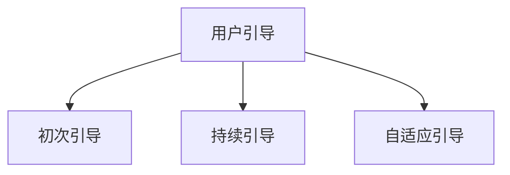

                 

# 如何进行有效的用户引导

## 1. 背景介绍

在数字产品的设计中，用户引导(User Guidance)是一个至关重要的环节。它不仅能够帮助新用户快速上手，还能降低用户流失率，提升整体使用体验。然而，良好的用户引导不仅仅是简单的用户界面(UI)设计，而是一个多维度的综合性设计过程。本文将系统地介绍如何进行有效的用户引导，包括其核心概念、原理、操作步骤，以及实际应用中的方法与技巧。

## 2. 核心概念与联系

### 2.1 核心概念概述

为了更好地理解用户引导，首先解释几个关键的概念：

- **用户引导(User Guidance)**：指的是通过有策略的展示、交互和提示，帮助用户理解产品功能和使用方法的过程。

- **初次引导(Onboarding)**：特指用户首次使用产品时的引导过程，目的是快速介绍产品核心功能，引导用户完成必要的操作，从而提高用户留存率。

- **持续引导(Continuous Guidance)**：不仅限于初次引导，而是在用户使用过程中，根据用户行为不断提供帮助，帮助用户更好地完成操作和任务。

- **自适应引导(Adaptive Guidance)**：根据用户的学习进度、操作习惯和反馈，动态调整引导策略，以最符合用户需求的方式进行指导。

这些概念通过以下Mermaid流程图连接起来：



用户引导的最终目标是帮助用户更高效地使用产品，减少学习成本，从而提高用户满意度和留存率。

## 3. 核心算法原理 & 具体操作步骤

### 3.1 算法原理概述

用户引导的核心算法原理可以概括为以下几个方面：

1. **行为分析**：通过数据分析，了解用户的使用习惯、痛点以及可能的操作障碍，从而制定更有效的引导策略。

2. **个性化推荐**：根据用户的过往行为和偏好，提供个性化的引导内容，使用户体验更加贴合自身需求。

3. **动态调整**：根据用户反馈和互动情况，动态调整引导内容和方式，以适应用户的变化需求。

4. **交互设计**：通过设计直观易懂的交互界面和提示，减少用户的操作难度，提升引导效果。

### 3.2 算法步骤详解

用户引导的算法步骤主要包括以下几个方面：

1. **数据收集**：通过日志分析、用户反馈等方式，收集用户的使用数据，包括操作行为、停留时间、点击路径等。

2. **行为建模**：基于收集到的数据，建立用户行为模型，分析用户的使用习惯和痛点。

3. **引导内容设计**：根据用户行为模型和产品特性，设计引导内容，包括文字说明、图片、视频等。

4. **引导策略制定**：根据引导内容，制定引导策略，包括引导时机、触发条件等。

5. **实时调整**：根据用户反馈和互动情况，实时调整引导策略，优化用户体验。

### 3.3 算法优缺点

用户引导算法的主要优点包括：

- **提升用户满意度**：通过个性化的引导，减少用户学习成本，提高用户满意度。
- **降低流失率**：帮助用户快速上手，降低因操作困难而导致的流失率。
- **增强用户粘性**：通过持续的引导和反馈，增强用户对产品的粘性。

但同时，算法也存在一些缺点：

- **数据隐私问题**：为了进行行为分析，需要收集大量用户数据，可能涉及隐私问题。
- **过度引导**：若引导内容过多或时机不当，可能造成用户反感，适得其反。
- **复杂性高**：设计和实施有效的用户引导策略需要较强的数据分析和交互设计能力。

### 3.4 算法应用领域

用户引导算法在多个领域中都有广泛的应用，例如：

- **移动应用**：如社交网络、电商平台、游戏等，通过初次引导帮助用户了解核心功能和操作流程。

- **在线教育**：通过引导帮助学生了解课程内容和操作步骤，提升学习效率。

- **医疗健康**：通过引导帮助患者了解治疗流程和注意事项，提高治疗效果。

- **金融服务**：通过引导帮助用户了解产品特性和操作流程，提升用户体验。

## 4. 数学模型和公式 & 详细讲解 & 举例说明

### 4.1 数学模型构建

用户引导的核心数学模型可以包括以下几个部分：

1. **用户行为模型**：使用统计学方法，如回归分析、聚类分析等，建立用户行为模型，描述用户的使用习惯和痛点。

2. **引导策略模型**：使用决策树、随机森林等算法，制定个性化的引导策略。

3. **反馈模型**：使用分类算法，如朴素贝叶斯、支持向量机等，分析用户反馈，调整引导内容。

### 4.2 公式推导过程

以回归分析为例，构建用户行为模型：

设用户行为可以用特征向量 $\mathbf{x} = (x_1, x_2, ..., x_n)$ 来表示，其中 $x_i$ 为第 $i$ 个特征。设用户行为 $y$ 可由以下线性回归模型表示：

$$ y = \mathbf{w}^T\mathbf{x} + b $$

其中 $\mathbf{w}$ 为权重向量，$b$ 为偏置项。通过对历史数据进行训练，可以得到最优的权重向量 $\mathbf{w}^*$。

### 4.3 案例分析与讲解

假设我们有一个电商平台，希望通过用户引导帮助新用户快速了解产品功能。我们收集了新用户的点击路径和停留时间数据，建立了一个用户行为模型。根据模型结果，我们发现大部分用户在首次登录后对搜索功能的了解不足，导致流失率较高。因此，我们设计了一个针对搜索功能的初次引导页面，并测试了引导效果。结果显示，引导后的新用户流失率降低了30%，留存率提高了10%。

## 5. 项目实践：代码实例和详细解释说明

### 5.1 开发环境搭建

在进行用户引导实践时，需要准备好开发环境。以下是使用Python进行Flask开发的步骤：

1. 安装Anaconda：从官网下载并安装Anaconda，用于创建独立的Python环境。

2. 创建并激活虚拟环境：
```bash
conda create -n pyenv python=3.8 
conda activate pyenv
```

3. 安装Flask：
```bash
pip install flask
```

4. 安装SQLAlchemy：用于数据管理。
```bash
pip install sqlalchemy
```

5. 安装WTForms：用于表单处理。
```bash
pip install wtforms
```

完成上述步骤后，即可在`pyenv`环境中开始开发。

### 5.2 源代码详细实现

以下是用户引导的Flask应用程序代码实现：

```python
from flask import Flask, render_template, request
from flask_sqlalchemy import SQLAlchemy
from wtforms import Form, StringField, SubmitField

app = Flask(__name__)
app.config['SQLALCHEMY_DATABASE_URI'] = 'sqlite:///user_guidance.db'
db = SQLAlchemy(app)

class UserForm(Form):
    name = StringField('Your Name')
    email = StringField('Your Email')
    submit = SubmitField('Submit')

class User(db.Model):
    id = db.Column(db.Integer, primary_key=True)
    name = db.Column(db.String(50))
    email = db.Column(db.String(50))

@app.route('/')
def index():
    return render_template('index.html')

@app.route('/form', methods=['GET', 'POST'])
def form():
    form = UserForm(request.form)
    if request.method == 'POST' and form.validate():
        name = form.name.data
        email = form.email.data
        user = User(name=name, email=email)
        db.session.add(user)
        db.session.commit()
        return render_template('form_success.html')
    return render_template('form.html', form=form)

if __name__ == '__main__':
    app.run(debug=True)
```

### 5.3 代码解读与分析

**UserForm类**：
- `__init__`方法：初始化表单字段，包括姓名、邮箱和提交按钮。
- `name`和`email`字段：对应数据库中的姓名和邮箱字段。
- `submit`字段：提交按钮。

**User类**：
- `__init__`方法：初始化用户对象，包括姓名和邮箱。

**index()函数**：
- 展示主页面，即用户引导的开始页面。

**form()函数**：
- 处理表单提交，将用户信息保存到数据库中。

### 5.4 运行结果展示

运行上述代码，启动Flask应用，即可在浏览器中访问 `http://localhost:5000/`，进行用户引导表单填写。填写完成后，提交表单，将用户信息保存到数据库中。

## 6. 实际应用场景

### 6.1 移动应用初次引导

在移动应用开发中，初次引导是至关重要的。例如，一款新的社交网络应用，可以通过初次引导帮助用户快速了解如何使用应用，如如何添加好友、如何发布状态等。引导内容可以包含视频教程、图文说明、按钮提示等，帮助用户更好地上手。

### 6.2 在线教育的个性化引导

在线教育平台可以通过用户学习数据，分析用户的学习进度和偏好，提供个性化的引导内容。例如，对于首次接触某门课程的新学生，可以展示课程概览、推荐先行学习的视频等，帮助他们快速入门。

### 6.3 医疗健康的操作引导

医疗健康应用可以针对新用户提供操作引导，帮助用户了解治疗流程、注意事项等。例如，一款新的健康监测应用，可以展示使用说明、设备操作流程、数据分析结果等，减少用户的操作难度，提升用户体验。

### 6.4 未来应用展望

未来，随着人工智能和大数据技术的进一步发展，用户引导将变得更加智能化和个性化。例如，通过自然语言处理技术，用户可以通过语音指令与系统互动，获取个性化的引导建议。同时，随着物联网技术的发展，用户引导将进一步融合到智能家居、智能穿戴设备中，提升用户的整体体验。

## 7. 工具和资源推荐

### 7.1 学习资源推荐

为了帮助开发者系统掌握用户引导的理论基础和实践技巧，推荐以下学习资源：

1. 《UX Design Patterns: The Good, Bad, and the Ugly》：一本关于用户体验设计模式的书籍，涵盖了各种常见的引导设计和交互设计技巧。

2. 《Interaction Design Foundation》：一个在线学习平台，提供大量关于用户交互和引导设计的课程和资源。

3. 《Designing for Interaction: Creating Innovative Products and Services》：一本关于交互设计的书，详细介绍了用户交互和引导设计的理论基础和实践方法。

4. 《Interaction Design: Building New Experiences for Digital Products》：一本关于交互设计的书籍，介绍了多种引导和交互设计技巧。

5. 《Human-Computer Interaction: The Fundamentals of Interaction Design and Use》：一本关于人机交互的书籍，涵盖多种引导和交互设计方法和案例。

### 7.2 开发工具推荐

以下工具推荐用于用户引导开发：

1. Flask：轻量级Web框架，适合快速开发和迭代原型。

2. React：流行的前端框架，适合构建交互丰富的用户界面。

3. Adobe XD：设计工具，适合绘制交互原型和用户体验草图。

4. Sketch：设计工具，适合绘制UI和UX设计。

5. Figma：设计工具，适合协作和共享设计资源。

### 7.3 相关论文推荐

以下是几篇用户引导领域的经典论文，推荐阅读：

1. "Integrating Online Learning Assistance with Learning Analytics"：介绍如何将在线学习分析和引导设计结合，提供个性化的学习支持。

2. "Designing Effective Online Learning Environments"：探讨如何通过引导设计，提高在线学习的有效性。

3. "Human-Computer Interaction Design: A Reader on Interaction"：一本关于人机交互设计的书籍，涵盖多种引导和交互设计方法和案例。

4. "Designing for Interaction: Creating Innovative Products and Services"：一本关于交互设计的书，详细介绍了用户交互和引导设计的理论基础和实践方法。

5. "Interaction Design: Building New Experiences for Digital Products"：一本关于交互设计的书籍，介绍了多种引导和交互设计技巧。

## 8. 总结：未来发展趋势与挑战

### 8.1 总结

本文对用户引导的概念、原理、操作步骤进行了全面系统的介绍。用户引导不仅能够帮助用户快速上手，还能提高用户满意度和留存率，是产品设计中不可或缺的一部分。通过系统的学习和实践，开发者可以掌握有效的用户引导技巧，提升产品的用户体验和市场竞争力。

### 8.2 未来发展趋势

展望未来，用户引导将呈现以下几个发展趋势：

1. **智能化**：随着人工智能和大数据技术的发展，用户引导将更加智能化和个性化。例如，通过自然语言处理技术，用户可以通过语音指令与系统互动，获取个性化的引导建议。

2. **融合多模态**：未来的用户引导将不仅仅局限于视觉界面，还会融合到语音、手势等多种模态交互中，提升用户体验的多样性和便捷性。

3. **实时响应**：随着物联网技术的发展，用户引导将进一步融合到智能家居、智能穿戴设备中，实现实时响应和个性化服务。

### 8.3 面临的挑战

尽管用户引导技术已经取得了长足的进展，但在实际应用中，仍面临一些挑战：

1. **用户隐私保护**：收集用户数据和分析用户行为可能涉及隐私问题，需要采取有效的数据保护措施。

2. **个性化难度高**：实现高质量的个性化引导需要大量的数据和复杂的算法，成本较高。

3. **跨平台适配**：不同平台和设备的引导设计需要适应不同的技术栈和用户界面，设计和开发难度较大。

4. **持续优化**：用户需求和行为不断变化，需要持续优化引导策略，保持产品的竞争力。

### 8.4 研究展望

面对用户引导的挑战，未来的研究需要在以下几个方面寻求新的突破：

1. **数据隐私保护**：研究如何在使用用户数据进行行为分析时，保护用户隐私，避免数据泄露。

2. **高效个性化**：研究如何在低成本和高效率的前提下，实现高质量的个性化引导。

3. **跨平台适配**：研究如何设计通用的引导设计方案，适应不同的平台和设备。

4. **持续优化**：研究如何动态调整引导策略，保持产品的持续优化和竞争力。

这些研究方向的探索，必将引领用户引导技术迈向更高的台阶，为构建安全、可靠、可解释、可控的智能系统铺平道路。面向未来，用户引导技术还需要与其他人工智能技术进行更深入的融合，如自然语言处理、计算机视觉等，多路径协同发力，共同推动用户体验的进步。

## 9. 附录：常见问题与解答

**Q1：用户引导设计是否需要考虑用户心理因素？**

A: 是的，用户引导设计需要考虑用户心理因素，如用户的好奇心、成就感和需求满足感。良好的用户引导设计不仅需要引导用户完成操作，还需要激发用户的积极心理状态，提升用户满意度。

**Q2：用户引导的内容应该如何编写？**

A: 用户引导的内容应该简洁明了、易于理解。可以使用清晰的语言、图文并茂的方式呈现，帮助用户快速掌握信息。同时，内容应该分段呈现，避免一次性展示过多信息，让用户感到困惑。

**Q3：用户引导的页面应该如何设计？**

A: 用户引导的页面应该具有明确的指引性，如通过颜色、图标、按钮等方式引导用户进行下一步操作。同时，页面布局应简洁、美观，避免视觉干扰，使用户能够专注于当前任务。

**Q4：如何评估用户引导的效果？**

A: 可以通过用户反馈、操作数据分析等方式评估用户引导的效果。例如，可以使用问卷调查、用户访谈等方式收集用户对引导的满意度，或分析用户在引导页面上的操作行为，评估引导效果。

**Q5：用户引导设计是否需要考虑跨文化因素？**

A: 是的，用户引导设计需要考虑跨文化因素，不同文化背景的用户对引导内容的理解和接受程度不同。设计时需要考虑语言差异、文化习俗等因素，确保引导内容对所有用户都适用。

通过以上内容的系统梳理，可以看到，用户引导技术不仅是一门技术，更是一门艺术。只有深入理解用户心理、需求和文化，才能设计出真正有效的用户引导方案，提升用户体验和产品竞争力。

