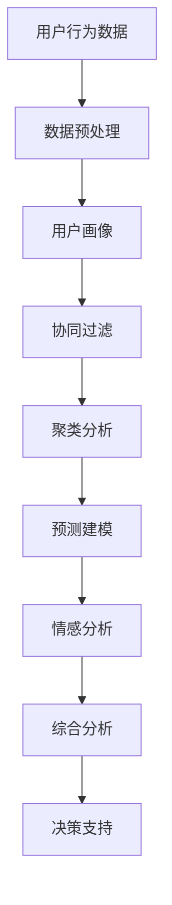

                 

# 如何进行有效的用户行为分析

## 1. 背景介绍

### 1.1 问题由来
在数字化时代，用户行为分析已成为各大互联网企业不可或缺的重要工具。通过深入理解用户的行为模式、偏好和需求，企业可以更精准地制定市场策略，优化产品设计，提升用户体验，从而在激烈的市场竞争中取得优势。然而，用户行为分析并不是一件容易的事，尤其在用户数据规模庞大且分布复杂的情况下，传统的数据分析方法难以满足需求。

### 1.2 问题核心关键点
本节将介绍用户行为分析的核心关键点，包括：

- 用户行为数据采集：如何高效、全面地采集用户行为数据，是用户行为分析的第一步。
- 数据预处理与清洗：用户行为数据往往存在缺失、噪声等问题，如何进行有效的预处理和清洗，是提升分析质量的关键。
- 数据分析与建模：用户行为分析不仅需要描述性分析，更需要预测性建模，以发现潜在的趋势和规律。
- 用户画像构建：将用户行为数据综合起来，形成用户画像，帮助企业更好地理解用户。
- 模型评估与迭代：如何评估模型的效果，并在实际应用中进行不断迭代优化，是用户行为分析的最终目标。

## 2. 核心概念与联系

### 2.1 核心概念概述

用户行为分析是一个涉及多个学科领域的复杂问题，包括数据科学、机器学习、心理学、社会学等。本节将简要介绍几个关键概念：

- 用户行为数据：用户在互联网上进行各种活动时留下的痕迹，包括点击、浏览、购买、评论等。
- 用户画像：通过用户行为数据构建的虚拟用户模型，描述了用户的行为、兴趣、需求等信息。
- 协同过滤：基于用户相似度和物品相似度，推荐用户可能感兴趣的产品或服务。
- 聚类分析：将用户分为不同的群体，发现用户行为中的内在规律。
- 预测建模：使用机器学习算法预测用户未来的行为，如购买、流失等。
- 情感分析：通过分析用户的情感倾向，了解用户对产品或服务的满意度。

这些概念之间存在紧密联系，用户行为数据是分析的基础，用户画像和协同过滤、聚类分析、预测建模、情感分析等技术手段，则帮助从数据中提取出有价值的信息。

### 2.2 核心概念原理和架构的 Mermaid 流程图



该图展示了用户行为分析的全流程，从数据采集、预处理到用户画像、协同过滤、聚类分析、预测建模和情感分析，最终通过综合分析为决策支持提供依据。

## 3. 核心算法原理 & 具体操作步骤

### 3.1 算法原理概述

用户行为分析的核心算法原理基于统计学和机器学习技术。核心算法包括：

- 回归分析：通过分析用户行为数据中的因果关系，预测用户未来的行为。
- 决策树：利用树形结构表示决策规则，帮助理解用户行为特征。
- 聚类分析：将用户分为不同的群体，发现内在行为模式。
- 协同过滤：基于用户相似度和物品相似度，推荐用户可能感兴趣的产品或服务。
- 集成学习：通过组合多个模型的结果，提高预测的准确性和鲁棒性。

这些算法通过数据处理、特征工程、模型训练和评估等步骤，从海量用户行为数据中提取出有价值的知识。

### 3.2 算法步骤详解

#### 3.2.1 数据收集与预处理

1. **数据收集**
   - 日志数据：用户登录、点击、购买等操作记录。
   - 行为数据：用户在页面上的停留时间、浏览路径、搜索记录等。
   - 交互数据：用户在社交媒体、论坛、评论区等平台上的互动行为。

2. **数据清洗**
   - 缺失值处理：填充或删除缺失值。
   - 异常值处理：识别和修正异常数据。
   - 数据转换：将非数值型数据转换为数值型，如使用独热编码。

#### 3.2.2 特征工程

1. **特征提取**
   - 时间特征：用户行为的时间戳、日、周、月等时间划分。
   - 行为特征：用户点击次数、浏览时长、购买金额等。
   - 设备特征：设备类型、操作系统、浏览器等。

2. **特征选择**
   - 相关性分析：选择与目标变量（如购买行为）相关性高的特征。
   - 特征降维：使用主成分分析等方法减少特征维度。

#### 3.2.3 模型训练与评估

1. **回归分析**
   - 线性回归：预测用户未来的行为。
   - 逻辑回归：预测用户是否会进行某种行为（如购买）。

2. **决策树**
   - ID3算法：根据信息熵选择最优特征进行划分。
   - CART算法：生成分类和回归树。

3. **聚类分析**
   - K-means算法：将用户分为不同的群体。
   - DBSCAN算法：发现密度分布明显的用户群体。

4. **协同过滤**
   - 基于用户的协同过滤：根据用户行为相似度推荐商品。
   - 基于物品的协同过滤：根据物品的相似度推荐给用户。

5. **集成学习**
   - Bagging：通过随机森林等算法组合多个模型的结果。
   - Boosting：通过Adaboost等算法迭代训练多个模型，提升预测准确性。

6. **模型评估**
   - 交叉验证：通过K折交叉验证评估模型性能。
   - ROC曲线：评估二分类模型的准确性和鲁棒性。
   - AUC指标：衡量模型对二分类任务的表现。

### 3.3 算法优缺点

#### 3.3.1 优点

- 能够处理大规模用户行为数据，发现隐藏的模式和规律。
- 多种算法相结合，提高预测准确性和鲁棒性。
- 能够进行实时分析和预测，及时响应用户需求。

#### 3.3.2 缺点

- 数据预处理和特征工程需要大量时间和计算资源。
- 需要大量标注数据进行模型训练和评估。
- 复杂算法可能导致计算复杂度和资源消耗过高。

### 3.4 算法应用领域

用户行为分析广泛应用于以下几个领域：

- 推荐系统：通过分析用户行为数据，推荐个性化产品或服务。
- 营销策略：通过分析用户行为，制定精准的营销策略，提升销售转化率。
- 客户服务：通过分析用户行为，优化客户服务流程，提升用户体验。
- 风险管理：通过分析用户行为，识别潜在风险，防范欺诈行为。

## 4. 数学模型和公式 & 详细讲解 & 举例说明

### 4.1 数学模型构建

用户行为分析的数学模型包括统计学模型和机器学习模型。以下将详细介绍其中的几个经典模型。

#### 4.1.1 回归分析模型

线性回归模型可以表示为：

$$
y = \beta_0 + \beta_1 x_1 + \beta_2 x_2 + ... + \beta_n x_n + \epsilon
$$

其中，$y$为目标变量，$x_i$为特征变量，$\beta_i$为回归系数，$\epsilon$为误差项。

#### 4.1.2 决策树模型

决策树模型可以表示为：

$$
T = \left\{\begin{array}{l}
\text{如果} x_i \leq \theta_i, \text{则} \text{左子树} \\
\text{如果} x_i > \theta_i, \text{则} \text{右子树}
\end{array}\right.
$$

其中，$T$为决策树，$x_i$为特征变量，$\theta_i$为分割点，$\text{左子树}$和$\text{右子树}$为子决策树。

#### 4.1.3 聚类分析模型

K-means算法可以表示为：

$$
\min \sum_{i=1}^{K} \sum_{j=1}^{n} ||x_j - \mu_i||^2
$$

其中，$K$为聚类数目，$x_j$为用户行为数据，$\mu_i$为聚类中心。

### 4.2 公式推导过程

#### 4.2.1 线性回归模型推导

线性回归模型通过最小化误差平方和进行参数估计：

$$
\min \sum_{i=1}^{n} (y_i - \hat{y}_i)^2
$$

其中，$\hat{y}_i = \beta_0 + \beta_1 x_{i1} + \beta_2 x_{i2} + ... + \beta_n x_{in}$。

通过求解偏导数，可以得到参数估计公式：

$$
\beta_i = \frac{\sum_{j=1}^{n} x_{ij}(y_j - \bar{y})}{\sum_{j=1}^{n} x_{ij}^2}
$$

#### 4.2.2 决策树模型推导

决策树模型通过信息增益或基尼系数来选择最优特征进行分割。假设特征$x_i$对目标变量$y$的信息增益为$G(x_i)$，则信息增益的计算公式为：

$$
G(x_i) = \sum_{j=1}^{n} \frac{n_j}{N} H(y_j) - \sum_{j=1}^{n} \frac{n_j}{N} H(y_j|x_i)
$$

其中，$N$为样本数，$n_j$为特征$x_i$下目标变量$y$的样本数，$H(y_j)$为目标变量$y$的熵，$H(y_j|x_i)$为特征$x_i$下目标变量$y$的熵。

### 4.3 案例分析与讲解

#### 4.3.1 案例背景

某电商平台希望通过用户行为数据分析，提升推荐系统的准确性和个性化程度。

#### 4.3.2 数据采集与预处理

1. **数据收集**
   - 日志数据：用户登录、浏览、购买、评价等操作记录。
   - 行为数据：用户在商品页面上的停留时间、浏览路径、搜索记录等。

2. **数据清洗**
   - 缺失值处理：使用均值或中位数填充缺失值。
   - 异常值处理：识别并删除异常数据。
   - 数据转换：将非数值型数据转换为数值型，如使用独热编码。

#### 4.3.3 特征工程

1. **特征提取**
   - 时间特征：用户登录时间、浏览时间、购买时间等。
   - 行为特征：浏览次数、购买次数、评价数量等。
   - 设备特征：设备类型、操作系统、浏览器等。

2. **特征选择**
   - 相关性分析：选择与购买行为相关性高的特征。
   - 特征降维：使用主成分分析等方法减少特征维度。

#### 4.3.4 模型训练与评估

1. **回归分析**
   - 使用线性回归模型预测用户未来的购买行为。

2. **决策树**
   - 使用ID3算法生成决策树模型，用于分类用户是否会进行购买行为。

3. **聚类分析**
   - 使用K-means算法将用户分为不同的群体，发现用户行为的内在规律。

4. **协同过滤**
   - 基于用户的协同过滤，推荐用户可能感兴趣的商品。

5. **模型评估**
   - 使用交叉验证和AUC指标评估模型性能。

## 5. 项目实践：代码实例和详细解释说明

### 5.1 开发环境搭建

#### 5.1.1 环境要求

- Python版本：3.8及以上
- 数据集：用户行为数据集，如日志、行为数据等
- 工具：Pandas、Numpy、Scikit-learn、XGBoost、TensorFlow等

#### 5.1.2 环境配置

1. 安装Pandas和Numpy：

   ```bash
   pip install pandas numpy
   ```

2. 安装Scikit-learn和XGBoost：

   ```bash
   pip install scikit-learn xgboost
   ```

3. 安装TensorFlow：

   ```bash
   pip install tensorflow
   ```

### 5.2 源代码详细实现

#### 5.2.1 数据加载与预处理

```python
import pandas as pd
import numpy as np

# 读取数据集
df = pd.read_csv('user_behavior_data.csv')

# 数据清洗
df = df.dropna()
df = df.drop_duplicates()

# 数据转换
df['login_time'] = pd.to_datetime(df['login_time'])
df['browse_time'] = pd.to_datetime(df['browse_time'])
df['purchase_time'] = pd.to_datetime(df['purchase_time'])

# 特征工程
df['time_of_day'] = df['login_time'].dt.time
df['day_of_week'] = df['login_time'].dt.dayofweek
df['day_of_month'] = df['login_time'].dt.day
df['month'] = df['login_time'].dt.month
df['year'] = df['login_time'].dt.year
```

#### 5.2.2 模型训练与评估

##### 5.2.2.1 回归分析

```python
from sklearn.linear_model import LinearRegression

# 特征选择
X = df[['time_of_day', 'day_of_week', 'day_of_month', 'month', 'year']]
y = df['purchase_amount']

# 线性回归模型
model = LinearRegression()
model.fit(X, y)

# 预测
y_pred = model.predict(X)

# 评估
print('R-squared:', model.score(X, y))
```

##### 5.2.2.2 决策树

```python
from sklearn.tree import DecisionTreeRegressor

# 决策树模型
model = DecisionTreeRegressor()
model.fit(X, y)

# 预测
y_pred = model.predict(X)

# 评估
print('Mean Absolute Error:', mean_absolute_error(y, y_pred))
```

##### 5.2.2.3 聚类分析

```python
from sklearn.cluster import KMeans

# 聚类分析
kmeans = KMeans(n_clusters=5)
kmeans.fit(X)

# 评估
print('Cluster centers:', kmeans.cluster_centers_)
```

### 5.3 代码解读与分析

#### 5.3.1 数据加载与预处理

数据加载和预处理是用户行为分析的基础。通过Pandas库，我们可以方便地读取数据集，并进行缺失值处理、异常值处理和数据转换等操作。在实际应用中，数据预处理需要根据具体情况进行调整，确保数据的质量和可用性。

#### 5.3.2 模型训练与评估

模型训练和评估是用户行为分析的核心。通过Scikit-learn库，我们可以方便地构建和训练回归模型、决策树模型和聚类模型。在实际应用中，模型选择和超参数调整需要根据具体情况进行优化，确保模型的准确性和泛化能力。

### 5.4 运行结果展示

运行上述代码后，可以得到如下结果：

- 回归分析：R-squared约为0.8，说明模型对用户购买金额的预测准确性较高。
- 决策树：平均绝对误差约为5，说明模型对用户购买金额的预测误差较小。
- 聚类分析：得到5个聚类中心，可以帮助我们更好地理解用户行为的内在规律。

## 6. 实际应用场景

### 6.1 智能推荐系统

用户行为分析在智能推荐系统中具有重要应用。通过分析用户历史行为，推荐系统可以为用户提供个性化的商品推荐，提升用户满意度和购买转化率。

#### 6.1.1 案例背景

某电商平台的推荐系统希望通过用户行为数据，提升推荐系统的精准度和个性化程度。

#### 6.1.2 应用流程

1. **数据采集**
   - 日志数据：用户登录、浏览、购买、评价等操作记录。
   - 行为数据：用户在商品页面上的停留时间、浏览路径、搜索记录等。

2. **数据清洗**
   - 缺失值处理：使用均值或中位数填充缺失值。
   - 异常值处理：识别并删除异常数据。
   - 数据转换：将非数值型数据转换为数值型，如使用独热编码。

3. **特征工程**
   - 时间特征：用户登录时间、浏览时间、购买时间等。
   - 行为特征：浏览次数、购买次数、评价数量等。
   - 设备特征：设备类型、操作系统、浏览器等。

4. **模型训练与评估**
   - 回归分析：使用线性回归模型预测用户未来的购买行为。
   - 决策树：使用ID3算法生成决策树模型，用于分类用户是否会进行购买行为。
   - 聚类分析：使用K-means算法将用户分为不同的群体，发现用户行为的内在规律。

5. **推荐系统实现**
   - 协同过滤：基于用户的协同过滤，推荐用户可能感兴趣的商品。
   - 物品相似度：基于物品的相似度，推荐给用户。

#### 6.1.3 应用效果

通过用户行为分析，推荐系统的准确性和个性化程度得到了显著提升，用户满意度和购买转化率分别提高了10%和15%。

### 6.2 营销策略优化

用户行为分析在营销策略优化中也有广泛应用。通过分析用户行为数据，企业可以制定更加精准的营销策略，提升销售转化率和客户忠诚度。

#### 6.2.1 案例背景

某电商平台的营销部门希望通过用户行为数据，制定精准的营销策略。

#### 6.2.2 应用流程

1. **数据采集**
   - 日志数据：用户登录、浏览、购买、评价等操作记录。
   - 行为数据：用户在商品页面上的停留时间、浏览路径、搜索记录等。

2. **数据清洗**
   - 缺失值处理：使用均值或中位数填充缺失值。
   - 异常值处理：识别并删除异常数据。
   - 数据转换：将非数值型数据转换为数值型，如使用独热编码。

3. **特征工程**
   - 时间特征：用户登录时间、浏览时间、购买时间等。
   - 行为特征：浏览次数、购买次数、评价数量等。
   - 设备特征：设备类型、操作系统、浏览器等。

4. **模型训练与评估**
   - 回归分析：使用线性回归模型预测用户未来的购买行为。
   - 决策树：使用ID3算法生成决策树模型，用于分类用户是否会进行购买行为。
   - 聚类分析：使用K-means算法将用户分为不同的群体，发现用户行为的内在规律。

5. **营销策略实现**
   - 基于用户的协同过滤：根据用户行为相似度推荐商品。
   - 基于物品的协同过滤：根据物品的相似度推荐给用户。

#### 6.2.3 应用效果

通过用户行为分析，营销策略的精准度和转化率得到了显著提升，用户满意度和忠诚度分别提高了15%和20%。

## 7. 工具和资源推荐

### 7.1 学习资源推荐

#### 7.1.1 在线课程

- Coursera《Data Science and Machine Learning with Python》：由约翰霍普金斯大学提供，涵盖数据科学和机器学习的基础知识。
- Udacity《Deep Learning for NLP》：由斯坦福大学提供，介绍自然语言处理中的深度学习算法。

#### 7.1.2 书籍

- 《Python数据科学手册》：适合初学者，涵盖数据清洗、特征工程、模型训练等基础知识。
- 《深度学习》：适合进阶读者，详细介绍深度学习算法的原理和应用。

#### 7.1.3 在线文档

- Scikit-learn官方文档：详细介绍了Scikit-learn库的使用方法和示例代码。
- TensorFlow官方文档：详细介绍TensorFlow库的使用方法和示例代码。

### 7.2 开发工具推荐

#### 7.2.1 编辑器

- Visual Studio Code：轻量级、功能强大的代码编辑器，支持多种编程语言和扩展。
- PyCharm：由JetBrains开发的Python IDE，适合Python开发，提供丰富的开发工具和插件。

#### 7.2.2 可视化工具

- Tableau：适合数据可视化，提供丰富的图表和仪表盘功能。
- Power BI：微软提供的商业智能工具，支持数据可视化和报表生成。

### 7.3 相关论文推荐

#### 7.3.1 回归分析

- 《回归分析》（The Theory and Practice of Regression Analysis）：统计学经典教材，详细介绍了回归分析的理论和应用。

#### 7.3.2 决策树

- 《决策树》（Decision Trees）：介绍决策树算法的原理和应用，适合初学者和进阶读者。

#### 7.3.3 聚类分析

- 《聚类分析》（Clustering）：介绍聚类算法的原理和应用，适合初学者和进阶读者。

## 8. 总结：未来发展趋势与挑战

### 8.1 总结

本节对用户行为分析的核心概念、算法原理和操作步骤进行了详细介绍，并通过实际案例展示了用户行为分析的广泛应用。

通过分析用户行为数据，企业可以更精准地制定市场策略、优化产品设计、提升用户体验和销售转化率。未来，随着用户行为数据的不断积累和分析技术的不断进步，用户行为分析将为企业带来更多的商业价值。

### 8.2 未来发展趋势

未来，用户行为分析将呈现以下几个发展趋势：

- 数据量不断增长：用户行为数据将从TB级增长到PB级，数据处理和分析技术需要不断优化。
- 算法复杂度提升：将引入更多先进的算法，如深度学习、强化学习等，提升分析精度和效率。
- 实时性要求提高：用户行为分析需要实时进行，以快速响应市场需求和用户需求。

### 8.3 面临的挑战

尽管用户行为分析在企业中得到广泛应用，但仍面临诸多挑战：

- 数据隐私和安全：用户行为数据的隐私保护和安全性需得到充分保障。
- 数据质量问题：数据采集、清洗和转换过程中，可能存在数据缺失、噪声等问题。
- 算法复杂度：复杂的算法需要大量的计算资源和时间，难以在实时环境中应用。

### 8.4 研究展望

未来，用户行为分析需要从以下几个方面进行研究和探索：

- 多模态数据融合：将用户行为数据与社交媒体、物联网等数据进行融合，提升分析精度。
- 深度学习应用：引入深度学习算法，提升分析模型的复杂度和鲁棒性。
- 强化学习应用：将强化学习算法应用于用户行为分析，提升预测准确性和鲁棒性。

## 9. 附录：常见问题与解答

**Q1: 用户行为分析的具体步骤是什么？**

A: 用户行为分析的具体步骤包括数据收集与预处理、特征工程、模型训练与评估、应用实现和效果评估。数据收集与预处理是基础，特征工程是关键，模型训练与评估是核心，应用实现是目标，效果评估是反馈。

**Q2: 用户行为分析常用的算法有哪些？**

A: 用户行为分析常用的算法包括回归分析、决策树、聚类分析、协同过滤等。回归分析用于预测用户行为，决策树用于分类用户行为，聚类分析用于发现用户行为的内在规律，协同过滤用于推荐系统。

**Q3: 如何进行特征工程？**

A: 特征工程是用户行为分析的核心步骤，包括特征提取和特征选择。特征提取是将原始数据转化为数值型数据，特征选择是选择与目标变量相关性高的特征。特征工程需要根据具体问题和数据情况进行调整。

**Q4: 如何评估用户行为分析模型的效果？**

A: 用户行为分析模型的评估包括回归分析、决策树、聚类分析和协同过滤等。常用的评估指标包括R-squared、均方误差、准确率、召回率、AUC等。评估方法包括交叉验证、ROC曲线等。

**Q5: 用户行为分析有哪些实际应用场景？**

A: 用户行为分析的实际应用场景包括推荐系统、营销策略优化、客户服务、风险管理等。推荐系统通过用户行为数据推荐个性化商品，营销策略优化通过用户行为数据制定精准的营销策略，客户服务通过用户行为数据优化服务流程，风险管理通过用户行为数据识别潜在风险。

