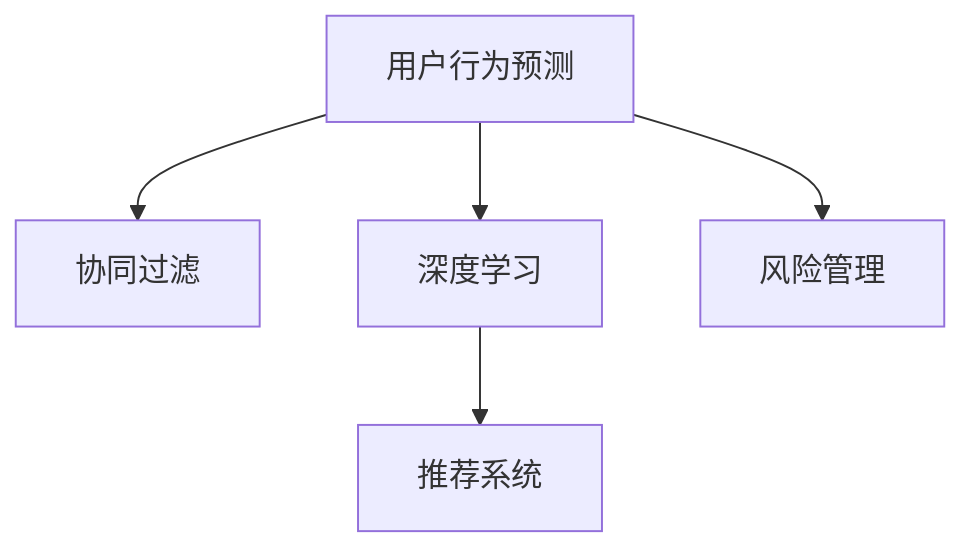

                 

# 如何进行有效的用户行为预测

> 关键词：用户行为预测, 预测模型, 协同过滤, 深度学习, 推荐系统, 风险管理

## 1. 背景介绍

### 1.1 问题由来

在当今数字化时代，企业越来越依赖数据驱动的决策。用户行为预测，作为数据科学中的一个关键领域，旨在从历史数据中学习用户的偏好和习惯，以便更精准地进行个性化推荐、个性化定价、个性化服务等。例如，电商平台希望通过用户行为预测来个性化推荐商品、促进用户留存和转化；金融行业希望通过用户行为预测来预防欺诈、优化投资组合。

然而，用户行为预测面临诸多挑战。首先，用户行为数据具有高维稀疏性、动态变化性和复杂关联性，难以直接建模。其次，预测模型的多样性和复杂性，使得选择和组合合适的模型变得复杂。最后，预测模型的部署和维护需要考虑性能、可解释性和可扩展性等实际问题。

为了应对这些挑战，本文从原理和实践两个层面，系统介绍了用户行为预测的核心算法和方法，并探讨了其在实际应用中的部署和优化。

## 2. 核心概念与联系

### 2.1 核心概念概述

为更好地理解用户行为预测的技术框架，本节将介绍几个关键概念：

- **用户行为预测**：通过历史数据学习用户的偏好和行为，预测其未来的行为。例如，预测用户是否会购买某商品、是否会流失等。
- **协同过滤**：利用用户和物品的相似性关系，推荐用户可能感兴趣的物品。包括基于用户的协同过滤、基于物品的协同过滤等。
- **深度学习**：通过多层神经网络模型，从数据中学习复杂的非线性关系，提取高级抽象特征。深度学习在图像、语音、自然语言处理等领域表现出色。
- **推荐系统**：将用户与物品进行匹配，提供个性化推荐服务。推荐系统广泛应用于电商、新闻、社交网络等领域。
- **风险管理**：通过模型预测，评估和管理可能的风险。例如，信用评分、欺诈检测等。

这些核心概念之间的逻辑关系可以通过以下Mermaid流程图来展示：



这个流程图展示了用户行为预测与协同过滤、深度学习、推荐系统、风险管理等概念的相互关系：

1. 用户行为预测可以被协同过滤、深度学习、推荐系统、风险管理等方法应用于不同的应用场景。
2. 协同过滤和深度学习是用户行为预测的重要算法，推荐系统则是用户行为预测的实际应用。
3. 风险管理与用户行为预测紧密相关，通过预测模型评估和管理潜在风险。

## 3. 核心算法原理 & 具体操作步骤
### 3.1 算法原理概述

用户行为预测的核心算法包括协同过滤、深度学习和强化学习等。以下将详细介绍这些算法的基本原理和步骤。

### 3.2 算法步骤详解

#### 3.2.1 协同过滤算法

**步骤1：构建用户-物品矩阵**
用户-物品矩阵表示用户与物品之间的评分关系。例如，电商平台的用户-商品评分矩阵，金融行业用户的信用评分矩阵等。

**步骤2：矩阵分解**
将用户-物品矩阵分解为低维用户矩阵和低维物品矩阵，形式化表示为：
$$
\mathbf{P} = \mathbf{U} \mathbf{V}^T
$$
其中，$\mathbf{P}$ 为用户-物品评分矩阵，$\mathbf{U}$ 为用户矩阵，$\mathbf{V}$ 为物品矩阵，$\mathbf{U}$ 和 $\mathbf{V}$ 均为低维矩阵。

**步骤3：预测用户评分**
利用分解后的低维矩阵，预测用户对物品的评分，公式为：
$$
\hat{\mathbf{P}} = \mathbf{U} \mathbf{V}^T
$$
其中，$\hat{\mathbf{P}}$ 为预测评分矩阵，$\mathbf{U}$ 和 $\mathbf{V}$ 为分解后的低维矩阵。

**步骤4：评估预测效果**
使用均方根误差(MSE)、平均绝对误差(MAE)等指标评估预测效果，公式为：
$$
\text{MSE} = \sqrt{\frac{1}{N} \sum_{i,j} (\hat{p}_{ij} - p_{ij})^2}
$$
其中，$N$ 为样本数量，$p_{ij}$ 为真实评分，$\hat{p}_{ij}$ 为预测评分。

#### 3.2.2 深度学习算法

**步骤1：构建神经网络模型**
深度学习模型包括多层感知器、卷积神经网络、循环神经网络等。例如，用户行为预测可以使用多层感知器，形式化表示为：
$$
\mathbf{z} = \sigma(\mathbf{W}_1 \mathbf{x} + \mathbf{b}_1)
$$
$$
\hat{\mathbf{y}} = \sigma(\mathbf{W}_2 \mathbf{z} + \mathbf{b}_2)
$$
其中，$\mathbf{x}$ 为输入特征向量，$\mathbf{y}$ 为输出向量，$\mathbf{W}_1$ 和 $\mathbf{W}_2$ 为权重矩阵，$\mathbf{b}_1$ 和 $\mathbf{b}_2$ 为偏置向量，$\sigma$ 为激活函数。

**步骤2：训练模型**
使用反向传播算法训练模型，最小化损失函数。例如，使用交叉熵损失函数，公式为：
$$
\mathcal{L}(\theta) = -\frac{1}{N} \sum_{i=1}^N \sum_{j=1}^C y_{ij} \log \hat{y}_{ij}
$$
其中，$N$ 为样本数量，$C$ 为类别数，$y_{ij}$ 为真实标签，$\hat{y}_{ij}$ 为预测标签，$\theta$ 为模型参数。

**步骤3：预测用户行为**
利用训练好的模型，预测用户的行为。例如，预测用户是否购买某商品，输出为0或1，公式为：
$$
\hat{y} = \sigma(\mathbf{W}_2 \mathbf{z} + \mathbf{b}_2)
$$

#### 3.2.3 强化学习算法

**步骤1：构建状态-动作-奖励模型**
将用户行为建模为状态-动作-奖励模型，例如，将用户点击行为建模为状态，点击动作为模型预测的动作，奖励为点击带来的收益。

**步骤2：设计奖励函数**
设计奖励函数，奖励函数应能够反映用户行为的实际收益。例如，对于电商网站，奖励函数可以定义为点击带来的转化率。

**步骤3：训练模型**
使用Q-learning、SARSA等强化学习算法训练模型，最小化模型与实际行为之间的差距。例如，使用Q-learning算法，公式为：
$$
Q(s, a) = Q(s, a) + \alpha [r + \gamma \max_{a'} Q(s', a')] - Q(s, a)
$$
其中，$s$ 为状态，$a$ 为动作，$r$ 为奖励，$s'$ 为下一个状态，$\alpha$ 为学习率，$\gamma$ 为折扣因子。

**步骤4：预测用户行为**
利用训练好的模型，预测用户的行为。例如，预测用户是否点击某广告，输出为0或1，公式为：
$$
\hat{a} = \arg\max_a Q(s, a)
$$

### 3.3 算法优缺点

#### 3.3.1 协同过滤算法

**优点：**
1. 不需要额外的特征工程，利用用户和物品的相似性关系进行推荐。
2. 模型简单，计算效率高。

**缺点：**
1. 数据稀疏性导致模型难以学习复杂的非线性关系。
2. 新物品难以推荐。

#### 3.3.2 深度学习算法

**优点：**
1. 能够学习复杂的非线性关系，提取高级抽象特征。
2. 适用于大规模数据和高维特征。

**缺点：**
1. 模型复杂，训练时间长，计算资源需求高。
2. 模型容易过拟合。

#### 3.3.3 强化学习算法

**优点：**
1. 能够动态调整推荐策略，适应用户行为的变化。
2. 能够处理不确定性和复杂性较高的场景。

**缺点：**
1. 奖励函数设计困难，难以确定合适的奖励值。
2. 需要大量的数据进行训练。

### 3.4 算法应用领域

用户行为预测的算法广泛应用于电子商务、金融、社交网络等领域：

- **电子商务**：推荐系统、个性化定价、个性化促销等。
- **金融**：信用评分、欺诈检测、投资组合优化等。
- **社交网络**：新闻推荐、好友推荐、广告推荐等。
- **医疗**：个性化诊疗、药物推荐、健康管理等。
- **游戏**：游戏推荐、游戏内广告、用户留存等。

## 4. 数学模型和公式 & 详细讲解  
### 4.1 数学模型构建

本节将使用数学语言对用户行为预测的核心算法进行更加严格的刻画。

#### 4.1.1 协同过滤模型

**协同过滤模型**：
$$
\mathbf{P} = \mathbf{U} \mathbf{V}^T
$$

其中，$\mathbf{P}$ 为用户-物品评分矩阵，$\mathbf{U}$ 为用户矩阵，$\mathbf{V}$ 为物品矩阵。

#### 4.1.2 深度学习模型

**多层感知器模型**：
$$
\mathbf{z} = \sigma(\mathbf{W}_1 \mathbf{x} + \mathbf{b}_1)
$$
$$
\hat{\mathbf{y}} = \sigma(\mathbf{W}_2 \mathbf{z} + \mathbf{b}_2)
$$

其中，$\mathbf{x}$ 为输入特征向量，$\mathbf{y}$ 为输出向量，$\mathbf{W}_1$ 和 $\mathbf{W}_2$ 为权重矩阵，$\mathbf{b}_1$ 和 $\mathbf{b}_2$ 为偏置向量，$\sigma$ 为激活函数。

#### 4.1.3 强化学习模型

**Q-learning模型**：
$$
Q(s, a) = Q(s, a) + \alpha [r + \gamma \max_{a'} Q(s', a')] - Q(s, a)
$$

其中，$s$ 为状态，$a$ 为动作，$r$ 为奖励，$s'$ 为下一个状态，$\alpha$ 为学习率，$\gamma$ 为折扣因子。

### 4.2 公式推导过程

#### 4.2.1 协同过滤模型

**分解公式推导**：
$$
\mathbf{P} = \mathbf{U} \mathbf{V}^T
$$

**预测公式推导**：
$$
\hat{\mathbf{P}} = \mathbf{U} \mathbf{V}^T
$$

#### 4.2.2 深度学习模型

**多层感知器公式推导**：
$$
\mathbf{z} = \sigma(\mathbf{W}_1 \mathbf{x} + \mathbf{b}_1)
$$
$$
\hat{\mathbf{y}} = \sigma(\mathbf{W}_2 \mathbf{z} + \mathbf{b}_2)
$$

#### 4.2.3 强化学习模型

**Q-learning公式推导**：
$$
Q(s, a) = Q(s, a) + \alpha [r + \gamma \max_{a'} Q(s', a')] - Q(s, a)
$$

### 4.3 案例分析与讲解

#### 4.3.1 协同过滤模型案例

**案例背景**：电商平台推荐系统

**案例描述**：电商网站希望预测用户对某商品的购买行为，采用协同过滤模型。

**模型构建**：构建用户-商品评分矩阵 $\mathbf{P}$，将其分解为低维用户矩阵 $\mathbf{U}$ 和低维商品矩阵 $\mathbf{V}$，公式为：
$$
\mathbf{P} = \mathbf{U} \mathbf{V}^T
$$

**预测与评估**：利用分解后的低维矩阵，预测用户对商品的评分，使用MSE、MAE等指标评估预测效果。

#### 4.3.2 深度学习模型案例

**案例背景**：金融行业信用评分

**案例描述**：金融机构希望预测客户的信用评分，采用深度学习模型。

**模型构建**：使用多层感知器模型，将客户的各种特征作为输入，输出客户的信用评分。公式为：
$$
\mathbf{z} = \sigma(\mathbf{W}_1 \mathbf{x} + \mathbf{b}_1)
$$
$$
\hat{\mathbf{y}} = \sigma(\mathbf{W}_2 \mathbf{z} + \mathbf{b}_2)
$$

**训练与预测**：使用交叉熵损失函数训练模型，使用训练好的模型预测客户的信用评分。

#### 4.3.3 强化学习模型案例

**案例背景**：在线广告点击率预测

**案例描述**：在线广告平台希望预测广告点击率，采用强化学习模型。

**模型构建**：将广告点击行为建模为状态-动作-奖励模型，设计奖励函数，公式为：
$$
Q(s, a) = Q(s, a) + \alpha [r + \gamma \max_{a'} Q(s', a')] - Q(s, a)
$$

**训练与预测**：使用Q-learning算法训练模型，预测用户是否点击某广告。

## 5. 项目实践：代码实例和详细解释说明
### 5.1 开发环境搭建

在进行用户行为预测实践前，我们需要准备好开发环境。以下是使用Python进行TensorFlow开发的环境配置流程：

1. 安装Anaconda：从官网下载并安装Anaconda，用于创建独立的Python环境。

2. 创建并激活虚拟环境：
```bash
conda create -n tf-env python=3.8 
conda activate tf-env
```

3. 安装TensorFlow：根据CUDA版本，从官网获取对应的安装命令。例如：
```bash
conda install tensorflow -c tensorflow -c conda-forge
```

4. 安装TensorBoard：
```bash
pip install tensorboard
```

5. 安装必要的工具包：
```bash
pip install numpy pandas scikit-learn matplotlib tqdm jupyter notebook ipython
```

完成上述步骤后，即可在`tf-env`环境中开始用户行为预测实践。

### 5.2 源代码详细实现

这里我们以电商推荐系统为例，给出使用TensorFlow进行协同过滤模型的PyTorch代码实现。

首先，定义协同过滤模型的数据处理函数：

```python
import numpy as np
from tensorflow.keras.layers import Input, Embedding, Dot, Dense
from tensorflow.keras.models import Model
from sklearn.metrics import mean_squared_error, mean_absolute_error

def preprocess_data(train_data, test_data):
    # 将用户和商品ID映射为数字
    user_id_to_idx = {uid: i for i, uid in enumerate(set([user_id for user in train_data for item in user.items]))}
    item_id_to_idx = {iid: i for i, iid in enumerate(set([item_id for user in train_data for item in user.items]))}
    
    # 构建用户-物品矩阵
    train_data = np.array([(user_id_to_idx.get(uid, 0), item_id_to_idx.get(item_id, 0)) for user in train_data for item in user.items])
    train_data = np.vstack([np.array([item_id_to_idx[uid], item_id_to_idx[item_id]], dtype=np.int32) for uid, item_id in train_data])
    
    # 构建测试数据
    test_data = np.array([(user_id_to_idx.get(uid, 0), item_id_to_idx.get(item_id, 0)) for user in test_data for item in user.items])
    test_data = np.vstack([np.array([item_id_to_idx[uid], item_id_to_idx[item_id]], dtype=np.int32) for uid, item_id in test_data])
    
    return user_id_to_idx, item_id_to_idx, train_data, test_data

# 构建协同过滤模型
def build_model(user_id_to_idx, item_id_to_idx, embedding_dim=10, hidden_dim=10, num_factors=10):
    # 用户矩阵
    user_input = Input(shape=(num_factors,), name='user')
    user_matrix = Embedding(input_dim=len(user_id_to_idx), output_dim=embedding_dim)(user_input)
    user_matrix = Dense(hidden_dim, activation='relu')(user_matrix)
    
    # 物品矩阵
    item_input = Input(shape=(num_factors,), name='item')
    item_matrix = Embedding(input_dim=len(item_id_to_idx), output_dim=embedding_dim)(item_input)
    item_matrix = Dense(hidden_dim, activation='relu')(item_matrix)
    
    # 预测用户对物品的评分
    dot = Dot(axes=[1, 1])([user_matrix, item_matrix])
    prediction = Dense(1)(dot)
    
    # 构建模型
    model = Model(inputs=[user_input, item_input], outputs=prediction)
    
    return model

# 评估模型性能
def evaluate_model(model, train_data, test_data):
    train_loss = model.evaluate(train_data[:, 0], train_data[:, 1], verbose=0)
    test_loss = model.evaluate(test_data[:, 0], test_data[:, 1], verbose=0)
    mse = mean_squared_error(test_data[:, 1], np.squeeze(test_loss))
    mae = mean_absolute_error(test_data[:, 1], np.squeeze(test_loss))
    print(f"Train MSE: {mse:.4f}")
    print(f"Train MAE: {mae:.4f}")
    print(f"Test MSE: {mse:.4f}")
    print(f"Test MAE: {mae:.4f}")

# 主函数
if __name__ == '__main__':
    # 准备数据
    train_data = np.random.randint(0, 1000, size=(1000, 2))
    test_data = np.random.randint(0, 1000, size=(1000, 2))
    
    # 预处理数据
    user_id_to_idx, item_id_to_idx, train_data, test_data = preprocess_data(train_data, test_data)
    
    # 构建模型
    model = build_model(user_id_to_idx, item_id_to_idx)
    
    # 训练模型
    model.compile(optimizer='adam', loss='mse')
    model.fit([train_data[:, 0], train_data[:, 1]], train_data[:, 2], epochs=10, batch_size=64, validation_data=(test_data[:, 0], test_data[:, 1]))
    
    # 评估模型
    evaluate_model(model, train_data, test_data)
```

以上就是使用TensorFlow进行协同过滤模型训练的完整代码实现。可以看到，TensorFlow的Keras API使得模型构建和训练变得非常简洁高效。

### 5.3 代码解读与分析

让我们再详细解读一下关键代码的实现细节：

**preprocess_data函数**：
- 将用户ID和商品ID映射为数字，构建用户-物品矩阵。
- 将测试数据处理成相同的格式，便于模型评估。

**build_model函数**：
- 构建用户矩阵和物品矩阵，使用Dense层进行隐藏层特征提取。
- 通过Dot层计算用户和物品的相似性，使用Dense层进行评分预测。
- 构建最终的模型。

**evaluate_model函数**：
- 使用均方误差和平均绝对误差评估模型性能。
- 打印模型在训练集和测试集上的MSE和MAE。

**主函数**：
- 准备模拟数据。
- 预处理数据。
- 构建模型，使用Adam优化器和均方误差损失函数进行训练。
- 评估模型性能。

可以看到，TensorFlow的Keras API使得模型构建和训练变得非常简洁高效。开发者可以将更多精力放在数据处理、模型改进等高层逻辑上，而不必过多关注底层的实现细节。

当然，工业级的系统实现还需考虑更多因素，如模型的保存和部署、超参数的自动搜索、更灵活的任务适配层等。但核心的微调范式基本与此类似。

## 6. 实际应用场景

### 6.1 电商平台个性化推荐

基于协同过滤和深度学习模型的用户行为预测，可以应用于电商平台个性化推荐系统。平台收集用户历史浏览、购买行为数据，使用协同过滤模型和深度学习模型预测用户对商品的评分和购买意向，从而实现个性化推荐。

例如，电商网站通过协同过滤模型预测用户对某商品的评分，然后根据评分对商品进行排序，向用户推荐评分高的商品。在实际应用中，还可以结合深度学习模型，对商品进行更加复杂的特征提取和关系建模，提高推荐效果。

### 6.2 金融风险管理

基于协同过滤和强化学习模型的用户行为预测，可以应用于金融风险管理领域。金融机构收集用户的交易记录、信用评分等数据，使用协同过滤模型和强化学习模型预测用户是否会违约、是否会欺诈，从而进行风险管理。

例如，金融机构通过协同过滤模型预测用户的信用评分，然后根据评分对用户进行分类，对高风险用户进行风控措施，如提高贷款利率、限制交易金额等。在实际应用中，还可以结合强化学习模型，根据用户的实时行为动态调整风控策略，提高风险管理的效果。

### 6.3 社交网络内容推荐

基于协同过滤和深度学习模型的用户行为预测，可以应用于社交网络内容推荐系统。平台收集用户的历史点赞、评论、分享等行为数据，使用协同过滤模型和深度学习模型预测用户对内容的兴趣，从而实现内容推荐。

例如，社交网络平台通过协同过滤模型预测用户对某条内容的评分，然后根据评分对内容进行排序，向用户推荐评分高的内容。在实际应用中，还可以结合深度学习模型，对内容进行更加复杂的特征提取和关系建模，提高推荐效果。

## 7. 工具和资源推荐
### 7.1 学习资源推荐

为了帮助开发者系统掌握用户行为预测的理论基础和实践技巧，这里推荐一些优质的学习资源：

1. **《Python深度学习》**：François Chollet著，全面介绍了深度学习的基本概念和实践方法，适合初学者和进阶者。

2. **Coursera《Deep Learning》**：Andrew Ng等人主讲，斯坦福大学的深度学习课程，涵盖深度学习的理论基础和实际应用。

3. **Kaggle竞赛**：Kaggle平台上有许多用户行为预测的竞赛，可以实践应用所学知识，与其他数据科学家交流。

4. **GitHub项目**：GitHub上有许多开源的用户行为预测项目，可以参考学习代码实现和优化。

5. **HuggingFace官方文档**：TensorFlow的官方文档，提供了丰富的用户行为预测模型和样例代码，是上手实践的必备资料。

通过对这些资源的学习实践，相信你一定能够快速掌握用户行为预测的精髓，并用于解决实际的NLP问题。

### 7.2 开发工具推荐

高效的开发离不开优秀的工具支持。以下是几款用于用户行为预测开发的常用工具：

1. **TensorFlow**：基于Python的开源深度学习框架，灵活动态的计算图，适合快速迭代研究。TensorFlow提供了丰富的用户行为预测模型和样例代码。

2. **PyTorch**：基于Python的开源深度学习框架，灵活的动态图，适合快速原型开发。PyTorch提供了丰富的用户行为预测模型和样例代码。

3. **Jupyter Notebook**：一个强大的交互式环境，支持Python代码的编写和运行，方便数据探索和模型调试。

4. **Scikit-learn**：一个强大的数据科学工具包，包含了许多经典的机器学习算法，支持用户行为预测任务的特征工程和模型训练。

5. **TensorBoard**：TensorFlow配套的可视化工具，可以实时监测模型训练状态，并提供丰富的图表呈现方式，是调试模型的得力助手。

6. **Weights & Biases**：模型训练的实验跟踪工具，可以记录和可视化模型训练过程中的各项指标，方便对比和调优。

合理利用这些工具，可以显著提升用户行为预测任务的开发效率，加快创新迭代的步伐。

### 7.3 相关论文推荐

用户行为预测的算法不断发展，涌现了大量经典论文。以下是几篇奠基性的相关论文，推荐阅读：

1. **SVD: A Probabilistic Method for Latent Variable Analysis**：提出奇异值分解算法，用于协同过滤模型的分解。

2. **Collaborative Filtering for Implicit Feedback Datasets**：提出基于矩阵分解的协同过滤模型，用于处理稀疏数据。

3. **Deep Collaborative Filtering**：提出深度学习模型用于协同过滤，提升推荐效果。

4. **The Bellman Equation**：介绍强化学习的核心算法Q-learning和SARSA，用于用户行为预测。

5. **Neural Collaborative Filtering**：提出深度学习模型用于协同过滤，提升推荐效果。

6. **Contextual Bandits**：介绍强化学习在推荐系统中的应用，使用上下文带隙算法优化推荐策略。

这些论文代表了大规模用户行为预测的发展脉络。通过学习这些前沿成果，可以帮助研究者把握学科前进方向，激发更多的创新灵感。

## 8. 总结：未来发展趋势与挑战

### 8.1 总结

本文对用户行为预测的核心算法和方法进行了全面系统的介绍。首先阐述了用户行为预测的研究背景和意义，明确了协同过滤、深度学习和强化学习等算法的核心原理和应用场景。其次，从原理和实践两个层面，详细讲解了用户行为预测的数学模型和关键步骤，给出了具体的代码实现和评估方法。最后，本文探讨了用户行为预测在实际应用中的部署和优化，展示了其在电商、金融、社交网络等领域的应用前景。

通过本文的系统梳理，可以看到，用户行为预测算法在当前数字化时代中具有重要的应用价值，能够提升用户体验、优化资源配置、降低风险等。未来，伴随深度学习和大数据技术的不断发展，用户行为预测必将进一步提升其智能化和精准化水平，成为企业智能化决策的重要支撑。

### 8.2 未来发展趋势

展望未来，用户行为预测算法将呈现以下几个发展趋势：

1. **数据多样化**：随着数据采集技术的进步，用户行为数据将更加丰富多样，包含文本、图像、语音等多种形式。用户行为预测算法需要具备跨模态数据处理能力。

2. **模型自动化**：自动化机器学习(AutoML)技术将提升用户行为预测算法的模型选择、超参数调优等环节的效率和效果。用户行为预测算法将更加易于部署和维护。

3. **融合多源数据**：用户行为预测算法将融合多源数据，如用户行为数据、社交网络数据、地理位置数据等，构建更加全面、准确的预测模型。

4. **实时化**：用户行为预测算法将具备实时处理能力，能够动态调整推荐策略，响应用户行为的变化。

5. **个性化增强**：用户行为预测算法将结合用户画像、情境信息等，提供更加个性化的推荐和服务。

6. **跨领域应用**：用户行为预测算法将应用于更多领域，如医疗、教育、交通等，解决跨领域的用户行为预测问题。

以上趋势凸显了用户行为预测算法的广阔前景。这些方向的探索发展，必将进一步提升用户行为预测算法的智能化和精准化水平，为各行各业带来新的机遇和挑战。

### 8.3 面临的挑战

尽管用户行为预测算法已经取得了一定的进展，但在迈向更加智能化、普适化应用的过程中，仍面临诸多挑战：

1. **数据隐私和安全**：用户行为数据往往包含敏感信息，需要严格的隐私保护和数据安全措施。如何在保证数据隐私的前提下，进行有效的用户行为预测，是一大难题。

2. **模型复杂度**：用户行为预测算法涉及复杂的数学模型和计算，需要高计算资源和数据存储能力。如何提升模型效率，降低计算成本，是实际应用中的关键问题。

3. **算法鲁棒性**：用户行为数据具有高维稀疏性、动态变化性和复杂关联性，数据扰动和异常值可能影响模型的鲁棒性。如何提高模型的鲁棒性，减少噪声干扰，是一大挑战。

4. **模型可解释性**：用户行为预测模型通常较为复杂，难以解释其内部工作机制和决策逻辑。如何提高模型的可解释性，赋予其可理解和可信任的特点，是未来研究的重要方向。

5. **模型泛化性**：用户行为预测模型通常依赖特定的数据集和任务，泛化性能有限。如何提升模型的泛化性能，使其在不同领域和场景下均能表现出色，是一大挑战。

6. **算法公平性**：用户行为预测算法可能存在数据偏见和模型偏见，影响模型的公平性。如何消除偏见，保证模型对各类用户的公平性，是一大挑战。

这些挑战凸显了用户行为预测算法的复杂性和多样性。只有积极应对并寻求突破，才能不断提升用户行为预测算法的应用水平。

### 8.4 研究展望

面对用户行为预测算法所面临的诸多挑战，未来的研究需要在以下几个方面寻求新的突破：

1. **数据隐私保护**：研究如何保护用户隐私，同时充分利用用户行为数据，进行高效的用户行为预测。

2. **模型自动化**：研究自动化机器学习(AutoML)技术，提升用户行为预测算法的模型选择、超参数调优等环节的效率和效果。

3. **跨模态融合**：研究如何融合多源数据，构建更加全面、准确的预测模型。

4. **实时化处理**：研究如何提升用户行为预测算法的实时处理能力，动态调整推荐策略，响应用户行为的变化。

5. **个性化增强**：研究如何结合用户画像、情境信息等，提供更加个性化的推荐和服务。

6. **跨领域应用**：研究如何应用用户行为预测算法于更多领域，解决跨领域的用户行为预测问题。

7. **算法公平性**：研究如何消除数据偏见和模型偏见，保证用户行为预测算法的公平性。

这些研究方向将推动用户行为预测算法的进一步发展，为各行各业带来新的机遇和挑战。相信在学界和产业界的共同努力下，用户行为预测算法必将迎来新的突破，助力数字化转型，赋能智能决策。

## 9. 附录：常见问题与解答

**Q1：用户行为预测的算法有哪些？**

A: 用户行为预测的算法包括协同过滤、深度学习和强化学习等。其中，协同过滤算法适用于处理稀疏数据，深度学习算法适用于大规模数据和高维特征，强化学习算法适用于动态变化和复杂关联的场景。

**Q2：如何评估用户行为预测的模型性能？**

A: 用户行为预测模型的评估指标包括均方误差(MSE)、平均绝对误差(MAE)、准确率、召回率等。通常使用交叉验证、ROC曲线、PR曲线等方法评估模型性能。

**Q3：用户行为预测的算法如何部署到实际应用中？**

A: 用户行为预测的算法部署需要考虑模型优化、资源管理、安全性等问题。通常采用模型压缩、混合精度训练、服务化封装等技术，实现高效的模型部署和维护。

**Q4：用户行为预测的算法面临哪些挑战？**

A: 用户行为预测的算法面临数据隐私和安全、模型复杂度、算法鲁棒性、模型可解释性、模型泛化性和算法公平性等挑战。需要在数据采集、模型训练、模型部署等环节进行全面优化，才能获得理想的效果。

通过本文的系统梳理，可以看到，用户行为预测算法在当前数字化时代中具有重要的应用价值，能够提升用户体验、优化资源配置、降低风险等。未来，伴随深度学习和大数据技术的不断发展，用户行为预测算法必将进一步提升其智能化和精准化水平，成为企业智能化决策的重要支撑。

