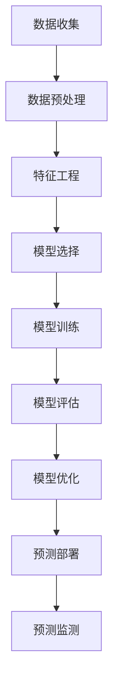

                 

# 如何进行有效的用户行为预测

> 关键词：用户行为预测,机器学习,深度学习,特征工程,多模型融合

## 1. 背景介绍

### 1.1 问题由来
在互联网时代，用户行为数据呈现出海量的、多模态的特性。如何利用这些数据预测用户的行为，已经成为各大互联网公司关注的焦点。有效、精准的用户行为预测不仅可以优化用户体验，还能够提升商业运营效率。

### 1.2 问题核心关键点
用户行为预测的核心在于构建一个准确的预测模型，该模型能够基于用户的历史数据，预测其未来的行为。具体而言，包括以下几个关键点：

- **数据获取与处理**：收集用户行为数据，并对数据进行清洗、归一化、特征工程等预处理。
- **模型选择与训练**：选择合适的预测模型（如线性回归、决策树、神经网络等），并使用用户数据进行训练。
- **模型评估与优化**：评估模型的预测效果，并根据评估结果不断调整模型参数或选择合适的模型。
- **预测部署与监测**：将训练好的模型部署到生产环境中，并进行持续的性能监测和迭代优化。

## 2. 核心概念与联系

### 2.1 核心概念概述

为了更好地理解用户行为预测的框架，我们首先介绍几个关键概念：

- **用户行为预测**：指通过机器学习算法预测用户未来行为的概率或具体行为。广泛应用于推荐系统、广告投放、风险控制等领域。
- **机器学习**：一种人工智能的分支，通过训练数据集，让算法自动学习和优化模型参数。
- **深度学习**：机器学习的一种特殊形式，使用多层神经网络模型，能够处理复杂的非线性关系。
- **特征工程**：根据预测目标，从原始数据中提取、构造、选择和转换特征，提高模型的预测能力。
- **多模型融合**：结合多个模型的预测结果，通过加权平均、投票、堆叠等方法，提升预测的稳定性和准确性。

这些概念通过一系列复杂的流程和技术手段，共同构成了用户行为预测的完整框架。

### 2.2 核心概念原理和架构的 Mermaid 流程图



该流程图展示了从数据收集到预测部署的完整流程。数据预处理和特征工程是数据质量提升的关键环节；模型选择和训练决定了预测效果；模型评估和优化确保模型性能最优；预测部署和监测保证了模型在实际应用中的稳定性和可靠性。

## 3. 核心算法原理 & 具体操作步骤

### 3.1 算法原理概述

用户行为预测的算法原理，主要基于历史数据构建的预测模型。具体来说，包括以下几个步骤：

1. **数据收集与清洗**：收集用户行为数据，并对数据进行去重、去噪、归一化等预处理。
2. **特征工程**：从原始数据中提取、构造和选择特征，如用户属性、行为频率、点击率、停留时间等。
3. **模型训练**：使用历史数据训练机器学习或深度学习模型，如线性回归、决策树、神经网络等。
4. **模型评估**：通过交叉验证、混淆矩阵等方法评估模型的预测效果，选择最优模型。
5. **模型优化**：根据评估结果调整模型参数，如学习率、正则化强度、神经网络层数等。
6. **预测部署**：将训练好的模型部署到生产环境中，实时预测用户行为。
7. **预测监测**：对预测结果进行持续监测，发现异常并进行修正。

### 3.2 算法步骤详解

#### 3.2.1 数据收集与清洗

- **数据收集**：收集用户的各类行为数据，如点击记录、购买记录、浏览记录等。可以使用日志文件、API接口、数据库等方式进行数据采集。
- **数据清洗**：去重、去噪、处理缺失值。可以使用Pandas等数据处理库进行清洗操作。
- **数据归一化**：对数据进行标准化，如归一化、标准化、对数变换等，确保模型在训练时的稳定性和收敛性。

#### 3.2.2 特征工程

特征工程是模型预测效果的关键。主要包括特征提取、特征构造、特征选择等步骤。

- **特征提取**：从原始数据中提取有意义的特征，如用户ID、设备类型、地理位置等。可以使用Pandas、NumPy等库进行提取。
- **特征构造**：通过计算和变换原始特征，构造新的特征，如用户停留时间、点击次数、访问频率等。可以使用Pandas、Scikit-learn等库进行构造。
- **特征选择**：选择对预测目标影响较大的特征，避免维度灾难。可以使用Scikit-learn、XGBoost等库进行特征选择。

#### 3.2.3 模型训练

模型训练是用户行为预测的核心步骤。主要包括以下几个步骤：

- **模型选择**：根据预测目标和数据特性，选择合适的模型，如线性回归、决策树、神经网络等。
- **训练集划分**：将数据集分为训练集和测试集，通常采用70-30的比例划分。
- **模型训练**：使用训练集对模型进行训练，优化模型参数。可以使用Scikit-learn、TensorFlow等库进行模型训练。
- **模型评估**：使用测试集对模型进行评估，计算评估指标，如准确率、召回率、F1值等。
- **模型优化**：根据评估结果，调整模型参数，如学习率、正则化强度、神经网络层数等。

#### 3.2.4 模型评估与优化

模型评估与优化是确保预测效果的关键步骤。主要包括以下几个步骤：

- **模型评估**：使用交叉验证、混淆矩阵等方法评估模型的预测效果。
- **模型选择**：选择最优模型，如基于评估结果选择最佳模型。
- **模型优化**：根据评估结果调整模型参数，如学习率、正则化强度、神经网络层数等。

#### 3.2.5 预测部署与监测

预测部署与监测是确保模型在实际应用中的稳定性和可靠性的关键步骤。主要包括以下几个步骤：

- **预测部署**：将训练好的模型部署到生产环境中，实时预测用户行为。
- **预测监测**：对预测结果进行持续监测，发现异常并进行修正。可以使用Prometheus、Grafana等工具进行监测。

### 3.3 算法优缺点

用户行为预测的算法具有以下优点：

- **预测准确性高**：通过机器学习和深度学习模型，能够准确预测用户行为。
- **适应性强**：可以根据不同的预测目标和数据特性，选择不同的模型和算法。
- **可解释性强**：通过特征工程和模型选择，可以更好地理解用户行为的内在规律。

同时，也存在以下缺点：

- **数据依赖性强**：预测模型的性能高度依赖于数据质量，数据收集和清洗的工作量较大。
- **模型复杂度高**：深度学习模型参数较多，训练复杂度较高。
- **过度拟合风险**：模型在训练集上表现良好，但在测试集或实际应用中可能会表现不佳。

### 3.4 算法应用领域

用户行为预测的算法广泛应用于多个领域，如推荐系统、广告投放、风险控制等。具体应用场景如下：

- **推荐系统**：通过预测用户对商品或服务的兴趣，提供个性化的推荐。
- **广告投放**：预测用户对广告的点击概率，优化广告投放策略。
- **风险控制**：预测用户是否存在欺诈行为，保护金融安全。
- **市场预测**：预测市场趋势和用户需求，优化产品开发和销售策略。

## 4. 数学模型和公式 & 详细讲解 & 举例说明

### 4.1 数学模型构建

用户行为预测的数学模型主要基于历史数据构建。具体来说，包括以下几个步骤：

- **目标函数**：定义预测模型需要优化的目标函数，如均方误差、交叉熵等。
- **训练数据**：准备训练数据集，包括特征和标签。
- **模型参数**：定义模型需要优化的参数，如神经网络权重、正则化系数等。
- **优化算法**：选择优化算法，如梯度下降、Adam等。

### 4.2 公式推导过程

#### 4.2.1 线性回归模型

线性回归模型是用户行为预测中最简单、最基础的模型。其数学公式为：

$$
y = \beta_0 + \beta_1x_1 + \beta_2x_2 + ... + \beta_nx_n
$$

其中，$y$ 为预测值，$\beta_0$ 为截距，$\beta_1, \beta_2, ..., \beta_n$ 为回归系数，$x_1, x_2, ..., x_n$ 为特征。

线性回归的训练目标是最小化预测值与真实值之间的平方误差，即：

$$
L = \frac{1}{2m}\sum_{i=1}^m(y_i - \hat{y}_i)^2
$$

其中，$L$ 为损失函数，$y_i$ 为真实值，$\hat{y}_i$ 为预测值，$m$ 为样本数量。

通过梯度下降等优化算法，最小化损失函数 $L$，即可得到回归系数 $\beta_0, \beta_1, \beta_2, ..., \beta_n$，进而得到预测模型。

#### 4.2.2 决策树模型

决策树模型是一种基于树形结构的分类和回归模型。其核心思想是通过划分特征空间，将数据集划分为多个子集，每个子集对应一个叶节点，最终输出预测结果。

决策树的训练目标是通过特征选择和数据划分，最大化信息增益或信息增益比，即：

$$
Gain(D) = \sum_{i=1}^n\sum_{j=1}^m|C_i \cap D_j|
$$

其中，$Gain(D)$ 为信息增益，$C_i$ 为子集，$D_j$ 为数据集。

通过递归划分特征空间，构建决策树，即可得到预测模型。

#### 4.2.3 神经网络模型

神经网络模型是一种基于多层神经元的非线性模型，广泛应用于复杂的用户行为预测。其核心思想是通过多层神经元的非线性组合，构建复杂的预测函数。

神经网络的训练目标是通过反向传播算法，最小化预测值与真实值之间的误差，即：

$$
L = \frac{1}{m}\sum_{i=1}^m(y_i - \hat{y}_i)^2
$$

其中，$L$ 为损失函数，$y_i$ 为真实值，$\hat{y}_i$ 为预测值，$m$ 为样本数量。

通过反向传播算法，最小化损失函数 $L$，即可得到神经网络的权重参数，进而得到预测模型。

### 4.3 案例分析与讲解

#### 4.3.1 电商推荐系统

电商推荐系统通过预测用户对商品或服务的兴趣，提供个性化的推荐。具体实现步骤如下：

1. **数据收集**：收集用户的点击记录、购买记录、评分记录等行为数据。
2. **数据预处理**：对数据进行清洗、归一化、特征工程等预处理。
3. **模型训练**：使用线性回归、决策树、神经网络等模型进行训练，优化模型参数。
4. **模型评估**：使用交叉验证、混淆矩阵等方法评估模型预测效果。
5. **模型优化**：根据评估结果调整模型参数，如学习率、正则化强度、神经网络层数等。
6. **预测部署**：将训练好的模型部署到推荐系统中，实时预测用户行为。
7. **预测监测**：对预测结果进行持续监测，发现异常并进行修正。

#### 4.3.2 金融欺诈检测

金融欺诈检测通过预测用户是否存在欺诈行为，保护金融安全。具体实现步骤如下：

1. **数据收集**：收集用户的交易记录、操作记录、行为记录等数据。
2. **数据预处理**：对数据进行清洗、归一化、特征工程等预处理。
3. **模型训练**：使用线性回归、决策树、神经网络等模型进行训练，优化模型参数。
4. **模型评估**：使用交叉验证、混淆矩阵等方法评估模型预测效果。
5. **模型优化**：根据评估结果调整模型参数，如学习率、正则化强度、神经网络层数等。
6. **预测部署**：将训练好的模型部署到欺诈检测系统中，实时预测用户行为。
7. **预测监测**：对预测结果进行持续监测，发现异常并进行修正。

## 5. 项目实践：代码实例和详细解释说明

### 5.1 开发环境搭建

在进行用户行为预测的项目实践前，我们需要准备好开发环境。以下是使用Python进行Scikit-learn开发的环境配置流程：

1. 安装Anaconda：从官网下载并安装Anaconda，用于创建独立的Python环境。

2. 创建并激活虚拟环境：
```bash
conda create -n predict-env python=3.8 
conda activate predict-env
```

3. 安装Scikit-learn：
```bash
conda install scikit-learn
```

4. 安装其他相关工具包：
```bash
pip install pandas numpy matplotlib scikit-learn seaborn
```

完成上述步骤后，即可在`predict-env`环境中开始项目实践。

### 5.2 源代码详细实现

下面我们以电商推荐系统为例，给出使用Scikit-learn进行用户行为预测的Python代码实现。

首先，定义数据处理函数：

```python
import pandas as pd
from sklearn.model_selection import train_test_split
from sklearn.preprocessing import StandardScaler

def load_data(path):
    data = pd.read_csv(path)
    return data

def split_data(data, test_size=0.2, random_state=42):
    train, test = train_test_split(data, test_size=test_size, random_state=random_state)
    return train, test

def scale_data(data):
    scaler = StandardScaler()
    scaled_data = scaler.fit_transform(data)
    return scaled_data

def prepare_data(data_path, test_size=0.2, random_state=42):
    data = load_data(data_path)
    train, test = split_data(data, test_size=test_size, random_state=random_state)
    train_scaled = scale_data(train.drop('label', axis=1))
    test_scaled = scale_data(test.drop('label', axis=1))
    train_labels = train['label']
    test_labels = test['label']
    return train_scaled, test_scaled, train_labels, test_labels
```

然后，定义模型训练函数：

```python
from sklearn.ensemble import RandomForestRegressor
from sklearn.metrics import mean_squared_error

def train_model(X_train, y_train, model=RandomForestRegressor):
    model.fit(X_train, y_train)
    return model

def evaluate_model(model, X_test, y_test):
    y_pred = model.predict(X_test)
    mse = mean_squared_error(y_test, y_pred)
    rmse = np.sqrt(mse)
    return rmse
```

最后，启动训练流程并在测试集上评估：

```python
from sklearn.pipeline import Pipeline

X_train, X_test, y_train, y_test = prepare_data('data.csv', test_size=0.2, random_state=42)

pipeline = Pipeline([
    ('scaler', StandardScaler()),
    ('model', RandomForestRegressor(random_state=42))
])

pipeline.fit(X_train, y_train)
rmse = evaluate_model(pipeline, X_test, y_test)

print('RMSE:', rmse)
```

以上就是使用Scikit-learn进行电商推荐系统用户行为预测的完整代码实现。可以看到，通过Scikit-learn库的封装，我们可以用相对简洁的代码完成电商推荐系统的构建和评估。

### 5.3 代码解读与分析

让我们再详细解读一下关键代码的实现细节：

**prepare_data函数**：
- `load_data`方法：读取数据文件。
- `split_data`方法：将数据集分为训练集和测试集，并打乱样本顺序。
- `scale_data`方法：对数据进行标准化处理，减少特征之间的尺度差异。
- `prepare_data`方法：将数据集加载、打乱、分割、标准化，并返回训练集、测试集、标签。

**train_model函数**：
- `train_model`方法：定义模型训练过程。首先实例化模型，然后使用训练集进行训练，返回训练好的模型。

**evaluate_model函数**：
- `evaluate_model`方法：定义模型评估过程。使用测试集进行预测，计算均方误差和均方根误差，返回评估结果。

**训练流程**：
- `prepare_data`方法：加载数据，打乱顺序，标准化处理。
- `train_model`方法：使用训练集对模型进行训练。
- `evaluate_model`方法：使用测试集评估模型性能。

可以看到，Scikit-learn库提供了丰富的机器学习算法和评估指标，使得用户行为预测的代码实现变得简洁高效。开发者可以将更多精力放在数据处理、模型改进等高层逻辑上，而不必过多关注底层的实现细节。

当然，工业级的系统实现还需考虑更多因素，如模型的保存和部署、超参数的自动搜索、更灵活的任务适配层等。但核心的预测流程基本与此类似。

## 6. 实际应用场景

### 6.1 智能推荐系统

智能推荐系统通过预测用户对商品或服务的兴趣，提供个性化的推荐。具体应用场景如下：

- **电商推荐**：根据用户的浏览记录、购买记录等行为数据，预测用户对商品的兴趣，提供个性化推荐。
- **音乐推荐**：根据用户的听歌记录、评价记录等行为数据，预测用户对音乐的喜好，提供个性化推荐。
- **视频推荐**：根据用户的观看记录、评价记录等行为数据，预测用户对视频的喜好，提供个性化推荐。

### 6.2 金融风险控制

金融风险控制通过预测用户是否存在欺诈行为，保护金融安全。具体应用场景如下：

- **信用卡欺诈检测**：根据用户的交易记录、操作记录等行为数据，预测用户是否存在信用卡欺诈行为。
- **贷款风险评估**：根据用户的贷款记录、还款记录等行为数据，预测用户是否存在贷款违约风险。
- **投资风险预警**：根据用户的投资记录、交易记录等行为数据，预测用户是否存在投资风险。

### 6.3 市场营销

市场营销通过预测用户的购买意愿，优化广告投放策略。具体应用场景如下：

- **广告点击预测**：根据用户的浏览记录、点击记录等行为数据，预测用户对广告的点击意愿，优化广告投放策略。
- **品牌偏好预测**：根据用户的购物记录、评价记录等行为数据，预测用户对品牌的偏好，优化品牌推广策略。
- **用户转化预测**：根据用户的互动记录、行为记录等行为数据，预测用户是否会完成购买，优化销售策略。

## 7. 工具和资源推荐

### 7.1 学习资源推荐

为了帮助开发者系统掌握用户行为预测的理论基础和实践技巧，这里推荐一些优质的学习资源：

1. 《Python机器学习》系列书籍：由机器学习专家编写，全面介绍了机器学习、深度学习、特征工程等基础知识，并提供了大量的实际案例。
2. Coursera《机器学习》课程：由斯坦福大学Andrew Ng教授主讲，深入浅出地介绍了机器学习的基本概念和常用算法。
3. Kaggle竞赛平台：提供了大量的数据集和比赛项目，有助于开发者在实践中提升技能。
4. scikit-learn官方文档：详细介绍了scikit-learn库的使用方法，提供了大量的代码示例和教程。
5. TensorFlow官方文档：详细介绍了TensorFlow库的使用方法，提供了大量的代码示例和教程。

通过对这些资源的学习实践，相信你一定能够快速掌握用户行为预测的精髓，并用于解决实际的商业问题。

### 7.2 开发工具推荐

高效的开发离不开优秀的工具支持。以下是几款用于用户行为预测开发的常用工具：

1. Python：广泛使用的编程语言，拥有丰富的机器学习库和数据处理库。
2. Scikit-learn：基于Python的机器学习库，提供了丰富的算法和评估指标。
3. TensorFlow：基于Python的深度学习库，支持大规模分布式计算。
4. Keras：基于Python的高层深度学习库，易于上手和调试。
5. Jupyter Notebook：交互式的Python编程环境，方便代码调试和可视化。

合理利用这些工具，可以显著提升用户行为预测的开发效率，加快创新迭代的步伐。

### 7.3 相关论文推荐

用户行为预测的研究源于学界的持续研究。以下是几篇奠基性的相关论文，推荐阅读：

1. A Survey on User Behavior Prediction Models and Their Applications（用户行为预测模型综述）：全面综述了用户行为预测的研究进展和应用场景。
2. An Overview of Social Media Mining and Statistical Learning Techniques for User Behavior Analysis（社交媒体数据挖掘与用户行为分析综述）：综述了社交媒体数据挖掘与用户行为分析的研究进展。
3. Predicting User Behavior in Recommender Systems: A Survey（推荐系统用户行为预测综述）：综述了推荐系统用户行为预测的研究进展。
4. Deep Learning for User Behavior Prediction: A Review（深度学习用户行为预测综述）：综述了深度学习在用户行为预测中的应用。
5. A Survey on Deep Learning for Recommendation Systems（深度学习推荐系统综述）：综述了深度学习在推荐系统中的应用。

这些论文代表了大规模用户行为预测的研究方向，通过学习这些前沿成果，可以帮助研究者把握学科前进方向，激发更多的创新灵感。

## 8. 总结：未来发展趋势与挑战

### 8.1 总结

本文对用户行为预测的算法原理、操作步骤和具体实现进行了详细讲解。首先阐述了用户行为预测的核心思想和关键步骤，明确了预测模型训练的基本流程。其次，通过案例分析，展示了电商推荐系统、金融风险控制等具体应用场景，探讨了用户行为预测在实际应用中的广泛应用。最后，从学习资源、开发工具、相关论文等方面，提供了详细的资源推荐，帮助开发者系统掌握用户行为预测的理论与实践。

通过本文的系统梳理，可以看到，用户行为预测的算法在电商、金融、市场营销等多个领域具有广泛的应用价值，能够显著提升商业运营效率和用户体验。未来，随着机器学习和深度学习技术的不断发展，用户行为预测的精度和效率将进一步提升，为各行各业带来更多的机遇和挑战。

### 8.2 未来发展趋势

展望未来，用户行为预测的算法将呈现以下几个发展趋势：

1. **深度学习模型的应用**：深度学习模型在用户行为预测中逐步取代传统的机器学习模型，提高预测精度和泛化能力。
2. **多模态数据融合**：将文本、图像、音频等多模态数据进行融合，提高预测模型的表现力。
3. **实时预测技术**：引入实时流数据处理技术，提高预测系统的响应速度和稳定性。
4. **个性化推荐系统**：结合用户画像和行为数据，提供更加精准的个性化推荐服务。
5. **跨领域应用拓展**：用户行为预测技术将逐步应用于更多领域，如健康医疗、公共安全等。
6. **联邦学习**：利用联邦学习技术，保护用户隐私的同时进行模型训练，提高预测精度和安全性。

这些趋势预示着用户行为预测技术的巨大发展潜力，将在更多领域带来颠覆性的变化。

### 8.3 面临的挑战

尽管用户行为预测技术已经取得了瞩目成就，但在迈向更加智能化、普适化应用的过程中，它仍面临着诸多挑战：

1. **数据隐私保护**：用户行为预测需要大量的数据支撑，如何在保护用户隐私的前提下获取数据，是一个重要挑战。
2. **数据质量提升**：数据质量直接影响预测模型的效果，如何提高数据质量，是一个重要挑战。
3. **模型复杂度控制**：深度学习模型参数较多，训练复杂度较高，如何优化模型结构，是一个重要挑战。
4. **预测稳定性提升**：预测模型在不同环境下的表现可能不一致，如何提升预测稳定性，是一个重要挑战。
5. **预测精度优化**：预测模型的精度受多种因素影响，如何提升预测精度，是一个重要挑战。
6. **模型公平性保障**：预测模型可能存在偏见，如何保障模型公平性，是一个重要挑战。

这些挑战需要研究者不断探索和解决，才能使用户行为预测技术更加成熟和实用。

### 8.4 研究展望

面对用户行为预测所面临的挑战，未来的研究需要在以下几个方面寻求新的突破：

1. **隐私保护技术**：研究如何在保护用户隐私的前提下，获取和处理用户行为数据。
2. **数据质量提升**：研究如何通过数据清洗、数据增强等技术，提高数据质量。
3. **模型结构优化**：研究如何通过模型压缩、参数共享等技术，降低模型复杂度，提高训练效率。
4. **预测稳定性提升**：研究如何通过模型融合、异常检测等技术，提升预测稳定性。
5. **预测精度优化**：研究如何通过迁移学习、少样本学习等技术，提高预测精度。
6. **模型公平性保障**：研究如何通过公平性约束、算法纠偏等技术，保障模型公平性。

这些研究方向将推动用户行为预测技术不断向前发展，为构建更加智能、高效、公平的预测系统奠定基础。

## 9. 附录：常见问题与解答

**Q1：用户行为预测是否适用于所有用户群体？**

A: 用户行为预测对用户群体没有特殊限制，适用于各个年龄段、不同兴趣、不同行为习惯的用户。但在实际应用中，需要根据具体场景和目标，选择合适的预测模型和特征工程策略。

**Q2：如何提升预测模型的准确性？**

A: 提升预测模型准确性主要从数据质量和模型优化两方面入手。具体措施包括：
1. 数据清洗：去除噪声、异常值，提高数据质量。
2. 特征工程：选择有意义的特征，构建新的特征，避免维度灾难。
3. 模型选择：选择合适的预测模型，如线性回归、决策树、神经网络等。
4. 模型优化：通过交叉验证、超参数调优等技术，优化模型参数。

**Q3：用户行为预测的预测结果如何应用？**

A: 用户行为预测的预测结果可以应用于多个场景，如个性化推荐、广告投放、风险控制等。具体应用方式包括：
1. 个性化推荐：根据预测结果，推荐个性化的商品或服务。
2. 广告投放：根据预测结果，优化广告投放策略，提高广告点击率。
3. 风险控制：根据预测结果，识别高风险用户，保护金融安全。
4. 市场营销：根据预测结果，优化市场营销策略，提高销售效率。

**Q4：如何评估预测模型的性能？**

A: 预测模型的性能评估主要通过以下几个指标：
1. 准确率：预测结果与真实结果一致的比例。
2. 召回率：真实结果中预测正确的比例。
3. F1值：准确率和召回率的调和平均数。
4. AUC-ROC曲线：根据不同的阈值，评估预测模型的性能。
5. RMSE：均方根误差，衡量预测值与真实值之间的误差。

这些指标可以综合评估模型的预测效果，帮助选择合适的模型和参数。

综上所述，用户行为预测技术在互联网时代具有广泛的应用价值，能够显著提升商业运营效率和用户体验。未来，随着机器学习和深度学习技术的不断发展，用户行为预测的精度和效率将进一步提升，为各行各业带来更多的机遇和挑战。希望本文能够为开发者提供系统的理论基础和实践指南，帮助其在实际应用中更好地应用用户行为预测技术。

