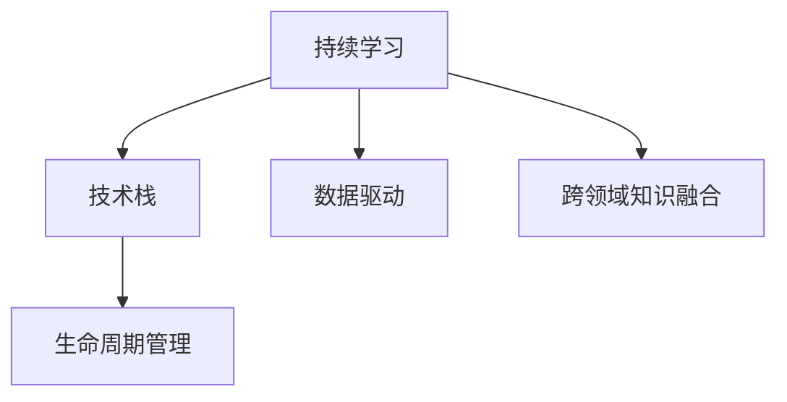

                 

# 学习体系:持续进化的动力源泉

> 关键词：学习体系,持续进化,人工智能,数据驱动,技术栈,生命周期管理

## 1. 背景介绍

### 1.1 问题由来
在当今快速变化的技术环境中，持续学习和发展是技术栈的核心需求。随着人工智能(AI)技术的不断发展，从数据驱动的深度学习、机器学习到认知智能和自动化，每一个技术分支都具有独特的生命周期和要求。为了保持竞争力，技术团队和个人需要不断更新知识，并灵活应用新技术来应对挑战。

### 1.2 问题核心关键点
本文旨在探讨如何构建和维护一个能够持续进化的学习体系，以适应不断变化的技术环境。我们将从以下几个方面入手：
- 学习体系的构建原则和要素。
- 学习流程和方法，包括持续学习和跨领域知识的融合。
- 如何有效管理技术栈，保持其健康和高效。
- 数据分析和反馈机制的建立，以持续改进学习体系。

### 1.3 问题研究意义
构建一个灵活、自适应的学习体系，对于提升技术团队和个人的能力，推动人工智能技术的创新应用，具有重要意义：

1. **提高效率**：通过持续学习和知识更新，技术团队可以快速掌握新技术，加速项目进展。
2. **增强创新能力**：多领域的知识融合能够激发新的技术创意和解决方案，推动技术突破。
3. **保持竞争力**：技术栈的不断进化可以确保团队在市场上保持领先地位，应对竞争压力。
4. **促进职业发展**：个人职业成长与技术栈的提升密不可分，持续学习可以提升职业发展空间。
5. **支持业务转型**：随着AI技术的普及，业务转型过程中，学习体系的灵活性和可扩展性显得尤为重要。

## 2. 核心概念与联系

### 2.1 核心概念概述

为了更好地理解持续进化的学习体系，本节将介绍几个关键概念：

- **持续学习（Continuous Learning）**：指的是在技术和业务环境中不断获取、整合和应用新知识的过程。它不仅仅是不断学习，更是不断反思、调整和优化学习策略。
- **技术栈（Tech Stack）**：指一个项目或组织所使用的所有技术组件、库、框架和工具的集合。技术栈的选择和维护对项目的成功至关重要。
- **生命周期管理（Lifecycle Management）**：涉及技术栈的规划、开发、部署、运维和退役等各个阶段的管理。一个良好的生命周期管理能够确保技术的长期健康和高效运行。
- **数据驱动（Data-Driven）**：指使用数据来指导决策和改进的过程。数据驱动的方法能够帮助团队基于实际结果调整学习策略。
- **跨领域知识融合（Interdisciplinary Knowledge Integration）**：指将不同领域的知识和技术结合起来，形成更强大的综合能力。例如，结合数据科学、认知科学和工程学的知识，推动人工智能技术的创新。

这些概念之间的联系可以通过以下Mermaid流程图来展示：



这个流程图展示了持续学习和技术栈、生命周期管理之间的逻辑关系，以及数据驱动和跨领域知识融合作为支持性因素，共同构成了学习体系的各个关键部分。

## 3. 核心算法原理 & 具体操作步骤
### 3.1 算法原理概述

一个持续进化的学习体系依赖于以下几个核心算法原理：

1. **自适应学习算法（Adaptive Learning Algorithm）**：能够根据当前环境动态调整学习策略，确保学习过程高效而灵活。
2. **迁移学习算法（Transfer Learning Algorithm）**：通过在相关任务间共享知识，加快新任务的学习过程。
3. **反馈控制算法（Feedback Control Algorithm）**：利用数据反馈来调整学习路径和策略，确保学习过程的有效性和目标导向。
4. **多学科知识融合算法（Interdisciplinary Knowledge Integration Algorithm）**：整合不同领域的技术和知识，形成更全面的解决方案。

### 3.2 算法步骤详解

构建一个持续进化的学习体系，通常包括以下几个关键步骤：

**Step 1: 确定学习目标**
- 明确当前环境下的学习目标，例如掌握新技术、改进业务流程等。

**Step 2: 选择学习策略**
- 根据学习目标和可用资源，选择合适的学习策略和方法，如在线课程、工作坊、实践项目等。

**Step 3: 实施学习计划**
- 制定详细的时间表和学习计划，分解任务，分配责任。

**Step 4: 数据收集与分析**
- 通过实践和反馈收集数据，分析学习效果和问题。

**Step 5: 调整和优化**
- 基于数据分析，调整学习策略和计划，优化学习过程。

**Step 6: 应用与验证**
- 将学习到的知识应用到实际项目中，验证学习效果。

**Step 7: 持续迭代**
- 循环执行上述步骤，不断迭代改进学习体系。

### 3.3 算法优缺点

持续进化的学习体系具有以下优点：
1. **高效灵活**：能够快速适应环境变化，灵活应对技术更新。
2. **目标导向**：通过数据驱动和反馈机制，确保学习过程始终服务于目标。
3. **知识融合**：跨领域知识的融合能够形成更全面的技术能力。

同时，该体系也存在一些局限性：
1. **成本高**：持续学习和技术栈的维护需要投入大量资源。
2. **复杂度高**：多领域知识融合可能带来复杂性，需要专业团队支持。
3. **风险不确定**：新技术的引入可能存在不确定性，需谨慎评估。

尽管有这些局限性，持续进化的学习体系仍然是推动技术栈和人工智能技术持续发展的有效途径。

### 3.4 算法应用领域

持续进化的学习体系不仅限于技术领域，在多个领域都有广泛应用，例如：

- **医疗健康**：通过持续学习最新医疗技术和数据，提升诊断和治疗水平。
- **金融服务**：利用数据驱动的方法，实时更新风险模型，提升金融分析能力。
- **教育培训**：通过跨学科知识的融合，开发更加个性化和高效的学习工具。
- **智能制造**：结合物联网和机器学习，优化生产流程，提升生产效率。
- **可持续发展**：通过数据分析和反馈机制，推动环保技术和政策的创新。

这些领域中，持续进化的学习体系展示了其在提升效率、创新能力和应对复杂环境中的巨大潜力。

## 4. 数学模型和公式 & 详细讲解  
### 4.1 数学模型构建

本节将使用数学语言对持续进化的学习体系进行更加严格的刻画。

设学习体系的目标为 $T$，技术栈为 $\mathcal{T}$，生命周期管理策略为 $\mathcal{M}$，数据驱动方法为 $\mathcal{D}$，跨领域知识融合方法为 $\mathcal{I}$。学习体系的构建过程可以表示为：

$$
\begin{align*}
\max_{T,\mathcal{T},\mathcal{M},\mathcal{D},\mathcal{I}} & \quad F(T,\mathcal{T},\mathcal{M},\mathcal{D},\mathcal{I}) \\
\text{s.t.} & \quad \text{适应性学习算法} \\
& \quad \text{迁移学习算法} \\
& \quad \text{反馈控制算法} \\
& \quad \text{多学科知识融合算法} 
\end{align*}
$$

其中 $F$ 表示学习体系的效用函数，表示学习体系的目标实现程度。

### 4.2 公式推导过程

以下我们以数据驱动方法为例，推导学习体系的数学模型。

设学习体系从 $t_0$ 时刻开始，在 $t_i$ 时刻获得关于技术栈 $\mathcal{T}$ 的数据 $D_i$。学习体系的目标是最大化目标实现程度 $T_i$，可以通过以下公式计算：

$$
\begin{align*}
T_i &= f_{\mathcal{D}}(\mathcal{T}_i, D_i) \\
&= g_{\mathcal{M}}(T_{i-1}, \mathcal{T}_{i-1}, D_i) \\
&= h_{\mathcal{I}}(T_{i-1}, \mathcal{T}_{i-1}, \mathcal{D}_i)
\end{align*}
$$

其中 $f_{\mathcal{D}}$ 表示数据驱动方法的评估函数，$g_{\mathcal{M}}$ 表示生命周期管理策略的调整函数，$h_{\mathcal{I}}$ 表示跨领域知识融合方法的实施函数。

通过上述公式，可以构建出学习体系的数据驱动模型，并对其进行优化求解。

### 4.3 案例分析与讲解

**案例：医疗健康领域的数据驱动学习**

在医疗健康领域，数据驱动学习的应用十分广泛。通过收集和分析电子病历、影像数据、基因数据等，医疗机构可以不断更新和优化诊断和治疗模型。

假设有一个医院正在尝试引入新的AI辅助诊断系统。该系统的学习目标是最大化诊断准确率 $T$。技术栈 $\mathcal{T}$ 包括影像处理、深度学习模型等。数据驱动方法 $\mathcal{D}$ 通过分析历史病历和影像数据，生成训练样本 $D$。跨领域知识融合方法 $\mathcal{I}$ 将医学领域的知识与数据科学方法结合起来，提升模型性能。

在实践中，医院需要收集和标注大量医疗数据，训练基于深度学习的诊断模型，并通过反馈机制调整模型参数。随着时间的推移，通过持续的数据收集和模型优化，诊断准确率 $T$ 可以不断提升，从而提高医疗服务的质量和效率。

## 5. 项目实践：代码实例和详细解释说明
### 5.1 开发环境搭建

在进行持续学习实践前，我们需要准备好开发环境。以下是使用Python进行TensorFlow开发的环境配置流程：

1. 安装Anaconda：从官网下载并安装Anaconda，用于创建独立的Python环境。

2. 创建并激活虚拟环境：
```bash
conda create -n tf-env python=3.8 
conda activate tf-env
```

3. 安装TensorFlow：从官网获取对应的安装命令，并使用conda或pip进行安装。例如：
```bash
conda install tensorflow
```

4. 安装相关库：
```bash
pip install numpy pandas scikit-learn matplotlib tensorflow-hub
```

完成上述步骤后，即可在`tf-env`环境中开始持续学习实践。

### 5.2 源代码详细实现

下面我们以医疗健康领域的AI辅助诊断系统为例，给出使用TensorFlow进行持续学习的PyTorch代码实现。

首先，定义数据处理函数：

```python
import numpy as np
from tensorflow.keras.preprocessing import image
import tensorflow_hub as hub

def load_and_preprocess_image(file_path):
    image_data = image.load_img(file_path, target_size=(224, 224))
    image_data = image.img_to_array(image_data)
    image_data = np.expand_dims(image_data, axis=0)
    image_data = image_data / 255.0
    return image_data

def load_and_preprocess_labels(file_path):
    with open(file_path, 'r') as f:
        labels = f.readlines()
    return labels
```

然后，定义模型和优化器：

```python
import tensorflow as tf
from tensorflow.keras import layers, models

model = models.Sequential([
    layers.Conv2D(32, (3, 3), activation='relu', input_shape=(224, 224, 3)),
    layers.MaxPooling2D((2, 2)),
    layers.Conv2D(64, (3, 3), activation='relu'),
    layers.MaxPooling2D((2, 2)),
    layers.Conv2D(128, (3, 3), activation='relu'),
    layers.MaxPooling2D((2, 2)),
    layers.Flatten(),
    layers.Dense(64, activation='relu'),
    layers.Dense(1, activation='sigmoid')
])

optimizer = tf.keras.optimizers.Adam(learning_rate=0.001)
```

接着，定义训练和评估函数：

```python
def train_epoch(model, dataset, batch_size, optimizer):
    model.compile(optimizer=optimizer, loss='binary_crossentropy', metrics=['accuracy'])
    model.fit(dataset, epochs=1, batch_size=batch_size, verbose=0)
    
def evaluate_model(model, test_dataset, batch_size):
    model.evaluate(test_dataset, batch_size=batch_size)
```

最后，启动训练流程并在测试集上评估：

```python
epochs = 10
batch_size = 32

for epoch in range(epochs):
    train_epoch(model, train_dataset, batch_size, optimizer)
    evaluate_model(model, test_dataset, batch_size)
```

以上就是使用TensorFlow对AI辅助诊断系统进行持续学习的完整代码实现。可以看到，得益于TensorFlow的强大封装，我们能够用相对简洁的代码完成模型的训练和评估。

### 5.3 代码解读与分析

让我们再详细解读一下关键代码的实现细节：

**数据处理函数**：
- `load_and_preprocess_image`函数：加载并预处理图像数据，包括缩放、归一化等。
- `load_and_preprocess_labels`函数：加载并处理标签数据，将其转换为模型所需的格式。

**模型定义**：
- 使用Keras API定义了一个简单的卷积神经网络模型，包含卷积层、池化层和全连接层。
- 使用Adam优化器进行模型训练。

**训练和评估函数**：
- `train_epoch`函数：使用Keras API的`fit`方法进行单次epoch的训练。
- `evaluate_model`函数：使用Keras API的`evaluate`方法计算模型在测试集上的性能。

**训练流程**：
- 定义总的epoch数和batch size，开始循环迭代。
- 每个epoch内，先在训练集上训练，输出损失和准确率。
- 在测试集上评估，输出最终测试结果。

可以看到，TensorFlow的Keras API使得持续学习过程变得简洁高效。开发者可以将更多精力放在数据处理、模型改进等高层逻辑上，而不必过多关注底层的实现细节。

当然，工业级的系统实现还需考虑更多因素，如模型的保存和部署、超参数的自动搜索、更灵活的任务适配层等。但核心的持续学习范式基本与此类似。

## 6. 实际应用场景
### 6.1 智能制造

在智能制造领域，持续学习可以显著提升生产线的自动化水平和灵活性。通过持续学习和数据分析，工业企业可以优化生产流程，降低成本，提高效率。

具体而言，工厂可以使用传感器和物联网设备收集生产数据，通过机器学习模型进行实时监控和预测维护。模型可以不断从新数据中学习，识别出生产过程中的异常行为，及时进行预警和调整。随着数据的积累，模型的准确性和泛化能力将不断提升，从而实现更高效的智能制造。

### 6.2 智能客服

在智能客服领域，持续学习可以显著提升客服系统的响应速度和准确性。通过持续学习和数据分析，客服系统可以不断优化问答模型，提升用户满意度。

具体而言，客服系统可以使用自然语言处理技术，分析用户的历史聊天记录，识别出常见问题和典型回答。随着用户反馈的不断积累，系统可以不断调整问答模型，实现更加智能和个性化的服务。持续学习的客服系统，可以更灵活地处理用户咨询，提升客户体验。

### 6.3 金融服务

在金融服务领域，持续学习可以提升风险评估和投资决策的准确性。通过持续学习和数据分析，金融机构可以实时更新风险模型，提升金融分析能力。

具体而言，金融机构可以使用历史交易数据和市场数据，训练基于深度学习的风险评估模型。模型可以不断从新数据中学习，识别出潜在的风险因素和投资机会。随着数据的积累，模型的准确性和泛化能力将不断提升，从而实现更精确的风险评估和投资决策。持续学习的金融系统，可以更灵活地应对市场变化，提升投资回报率。

### 6.4 未来应用展望

随着持续学习技术的发展，其在各个领域的应用前景将更加广阔。

在智慧医疗领域，持续学习可以不断更新和优化诊断和治疗模型，提升医疗服务的质量和效率。

在教育培训领域，持续学习可以开发更加个性化和高效的学习工具，推动教育公平和个性化教育的发展。

在智能制造领域，持续学习可以实现更高效的生产流程优化和智能维护，提升生产效率和质量。

在智慧城市治理中，持续学习可以实时监测城市事件和舆情，提升城市管理的自动化和智能化水平。

此外，在企业生产、社会治理、文娱传媒等众多领域，持续学习的应用也将不断涌现，为各行各业带来新的技术变革和商业机会。

## 7. 工具和资源推荐
### 7.1 学习资源推荐

为了帮助开发者系统掌握持续学习的基础知识和应用技巧，这里推荐一些优质的学习资源：

1. 《TensorFlow官方文档》：TensorFlow的官方文档，提供了详细的API文档、示例代码和教程，是学习TensorFlow的好资源。
2. 《深度学习入门：基于Python的理论与实现》：一本介绍深度学习基础知识和实践的书籍，适合初学者入门。
3. 《Python数据科学手册》：一本全面介绍数据科学、机器学习和深度学习的书籍，涵盖多种工具和库的使用。
4. Coursera和Udacity的深度学习课程：由知名大学和公司提供的深度学习课程，涵盖理论基础和实践技巧。
5. HuggingFace官方文档和博客：HuggingFace提供的NLP和深度学习库的文档和博客，包含大量前沿技术和实战经验。

通过对这些资源的学习实践，相信你一定能够快速掌握持续学习的精髓，并用于解决实际的AI问题。
###  7.2 开发工具推荐

高效的开发离不开优秀的工具支持。以下是几款用于持续学习开发的常用工具：

1. TensorFlow：由Google主导开发的开源深度学习框架，生产部署方便，适合大规模工程应用。
2. PyTorch：基于Python的开源深度学习框架，灵活易用，适合快速迭代研究。
3. Jupyter Notebook：免费的在线笔记本工具，支持Python、R等语言，适合快速原型开发和实验。
4. Keras：Keras是一个高层次的神经网络API，可以与TensorFlow、Theano等深度学习框架无缝集成，适合快速开发和实验。
5. TensorBoard：TensorFlow配套的可视化工具，可实时监测模型训练状态，提供丰富的图表呈现方式。
6. Weights & Biases：模型训练的实验跟踪工具，可以记录和可视化模型训练过程中的各项指标，方便对比和调优。

合理利用这些工具，可以显著提升持续学习任务的开发效率，加快创新迭代的步伐。

### 7.3 相关论文推荐

持续学习技术的发展源于学界的持续研究。以下是几篇奠基性的相关论文，推荐阅读：

1. Continuous Learning of Deep Neural Networks: A Review (IEEE TNNLS, 2018)：综述了深度学习模型的持续学习方法，分析了不同方法的优缺点。
2. Online Learning for Deep Neural Networks: An overview (Journal of Big Data, 2017)：介绍了在线学习的原理和应用，涵盖了多种在线学习算法。
3. Learning to Learn by Gradient Descent by Its Own Gradient (NeurIPS, 2018)：提出了一种元学习算法，通过学习学习过程的梯度来提升模型的学习效率和泛化能力。
4. Adaptive Computation Time for Recurrent Neural Networks (ICML, 2015)：提出了一种自适应计算时间的方法，能够动态调整网络结构，提升模型的训练效率。
5. Meta-Learning as Hyper-Learning (NIPS, 2017)：提出了一种元学习算法，通过超学习的方式提升模型的学习效率和泛化能力。

这些论文代表了大规模机器学习模型的持续学习方法的发展脉络。通过学习这些前沿成果，可以帮助研究者把握学科前进方向，激发更多的创新灵感。

## 8. 总结：未来发展趋势与挑战
### 8.1 总结

本文对持续进化的学习体系进行了全面系统的介绍。首先阐述了持续学习的重要性及其对技术栈和人工智能技术发展的意义。其次，从原理到实践，详细讲解了持续学习体系的构建方法和应用策略，给出了持续学习任务开发的完整代码实例。同时，本文还探讨了持续学习在各个领域的应用前景，展示了其在提升效率、创新能力和应对复杂环境中的巨大潜力。

通过本文的系统梳理，可以看到，持续进化的学习体系正在成为技术栈和人工智能技术发展的重要手段，极大地推动了技术栈的更新和人工智能技术的创新应用。未来，伴随技术栈的持续进化和人工智能技术的不断进步，持续学习体系将变得更加灵活和高效，为推动技术栈的长期健康发展提供有力保障。

### 8.2 未来发展趋势

展望未来，持续进化的学习体系将呈现以下几个发展趋势：

1. **技术栈的自动化和智能化**：随着自动化技术的发展，技术栈的维护和管理将更加智能化。自动化部署、自动化测试和自动化优化将成为常态。
2. **跨领域的知识融合**：未来的技术栈将更加注重跨领域的知识融合，如结合数据科学、认知科学、工程学等，形成更强大的综合能力。
3. **数据驱动的优化**：数据驱动的优化将成为持续学习体系的核心，通过实时数据反馈，不断优化学习路径和策略。
4. **模型透明性和可解释性**：未来的持续学习体系将更加注重模型的透明性和可解释性，确保模型的决策过程可解释、可审查。
5. **模型鲁棒性和安全性**：随着AI技术的普及，模型鲁棒性和安全性将成为持续学习体系的重要考虑因素，确保模型在复杂环境下的稳定性和安全性。
6. **多模态信息的融合**：未来的技术栈将更加注重多模态信息的融合，如文本、图像、视频、语音等多模态数据的整合，提升系统的综合能力。

以上趋势凸显了持续进化学习体系的未来发展方向，这些方向的探索发展，将进一步提升技术栈的灵活性和智能性，为人工智能技术的持续创新提供有力保障。

### 8.3 面临的挑战

尽管持续进化的学习体系已经取得了瞩目成就，但在迈向更加智能化、普适化应用的过程中，它仍面临诸多挑战：

1. **数据质量的不确定性**：数据驱动的持续学习体系依赖高质量的数据，数据质量的不确定性可能影响模型的性能。
2. **计算资源的需求**：大规模数据和复杂模型的训练需要大量计算资源，可能面临硬件瓶颈。
3. **模型的可解释性**：复杂模型的黑盒特性可能带来模型的可解释性问题，影响模型的应用和部署。
4. **多学科知识的整合**：跨领域的知识融合可能带来复杂性，需要专业团队支持。
5. **模型的鲁棒性和安全性**：模型在复杂环境下的鲁棒性和安全性需要进一步提升。
6. **持续学习的自动化**：自动化和智能化是未来的趋势，但目前还面临技术上的挑战。

正视持续学习面临的这些挑战，积极应对并寻求突破，将有助于持续学习体系向更加高效、智能化方向发展。

### 8.4 研究展望

面对持续学习体系面临的挑战，未来的研究需要在以下几个方面寻求新的突破：

1. **数据质量提升**：开发更好的数据采集和预处理技术，确保数据的质量和多样性。
2. **计算资源优化**：优化模型结构和训练算法，提升计算效率，减少资源消耗。
3. **模型透明性和可解释性**：开发更透明、可解释的模型，提升模型的应用和部署效率。
4. **多学科知识整合**：开发更好的跨领域知识融合技术，确保跨学科知识的一致性和协同工作。
5. **模型的鲁棒性和安全性**：提升模型在复杂环境下的鲁棒性和安全性，确保模型的可靠性和稳定性。
6. **持续学习的自动化**：开发更好的自动化技术，提升持续学习体系的灵活性和智能化。

这些研究方向的探索，必将引领持续学习体系向更加高效、智能、安全和可解释的方向发展，为推动技术栈的长期健康发展提供有力保障。

## 9. 附录：常见问题与解答
----------------------------------------------------------------

**Q1：持续学习体系是否适用于所有技术栈？**

A: 持续学习体系适用于大多数技术栈，尤其是数据驱动和模型驱动的技术栈。对于依赖大量手动编码的技术栈，可能需要结合自动化工具和模型来提升持续学习的效率。

**Q2：如何确保数据的质量和多样性？**

A: 数据质量是持续学习体系的核心，需要采取多种措施确保数据的质量和多样性：
- 数据采集：通过多种渠道采集数据，确保数据的多样性和代表性。
- 数据清洗：对数据进行清洗和预处理，去除噪声和异常值。
- 数据增强：通过数据增强技术，生成更多训练样本，提升模型的泛化能力。
- 数据标注：使用标注工具和人工标注，确保数据的准确性和一致性。

**Q3：持续学习体系如何与现有技术栈整合？**

A: 持续学习体系的整合需要考虑以下几个方面：
- 技术栈选择：选择适合持续学习的技术栈，如TensorFlow、PyTorch等。
- 自动化工具：引入自动化工具和框架，如TensorBoard、Weights & Biases等，提升持续学习的效率。
- 模型适配：设计适合持续学习的模型结构和训练算法，确保模型的灵活性和可适应性。
- 数据驱动：引入数据驱动的方法，如在线学习、梯度增强等，提升模型的学习效率和泛化能力。

**Q4：持续学习体系如何处理多学科知识的融合？**

A: 多学科知识的融合需要考虑以下几个方面：
- 知识模型：构建知识模型，将不同领域的知识进行编码和整合。
- 数据融合：将不同领域的数据进行融合，生成多模态数据集。
- 模型融合：设计适合多学科知识的模型结构，确保不同领域的知识可以协同工作。
- 专家知识：引入专家知识和规则，提升模型的综合能力。

**Q5：如何确保持续学习体系的鲁棒性和安全性？**

A: 持续学习体系的鲁棒性和安全性需要考虑以下几个方面：
- 数据安全：保护数据隐私和安全，防止数据泄露和滥用。
- 模型鲁棒性：设计鲁棒性的模型，确保模型在复杂环境下的稳定性和安全性。
- 安全性检测：引入安全性检测工具，确保模型的安全性和合规性。
- 安全补丁：及时修复模型漏洞和安全问题，确保模型的可靠性和安全性。

---

作者：禅与计算机程序设计艺术 / Zen and the Art of Computer Programming

