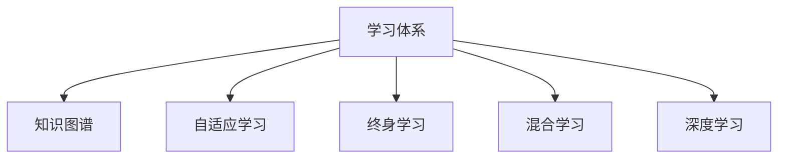

                 

# 学习体系:持续进化的源动力

## 1. 背景介绍

在当今信息爆炸的时代，知识和技能的更新速度极快，只有不断地学习和适应，才能保持竞争力和适应环境的变化。学习体系不仅是个人成长的关键，也是组织和行业进化的重要动力。本文将深入探讨学习体系的重要性，以及如何构建一个高效、可持续的学习系统。

## 2. 核心概念与联系

### 2.1 核心概念概述

为更好地理解学习体系的构建，本节将介绍几个密切相关的核心概念：

- **学习体系 (Learning System)**：一个由学习目标、内容、方法、评估和反馈机制构成的整体框架。其核心是支持个体或组织从未知到已知、从知道到做到的持续学习和成长。

- **知识图谱 (Knowledge Graph)**：一种用于描述和组织信息的方式，将各种知识元素以图形化的方式表示，便于快速检索和应用。

- **自适应学习 (Adaptive Learning)**：根据学习者的特点（如认知水平、兴趣、进度等）自动调整教学内容和方法的学习模式。

- **终身学习 (Lifelong Learning)**：个人或组织在职业生涯中不断学习新知识和技能，适应社会和技术的变化。

- **混合学习 (Blended Learning)**：将在线学习、面对面教学、自主学习等多种学习方式结合起来，提供多元化的学习体验。

- **深度学习 (Deep Learning)**：一种利用多层神经网络进行复杂模式识别的机器学习方法，广泛应用于图像识别、自然语言处理等领域。

这些核心概念之间的逻辑关系可以通过以下Mermaid流程图来展示：



这个流程图展示了一些与学习体系密切相关的核心概念，以及它们之间的相互作用关系。

## 3. 核心算法原理 & 具体操作步骤

### 3.1 算法原理概述

构建高效的学习体系，首先需要理解个体和组织学习的内在机制，以及如何通过系统化的设计和应用，支持持续学习和适应。

从心理学角度看，学习是一个复杂的认知过程，涉及信息接收、处理、存储、提取和应用等多个环节。为了支持高效的学习，学习体系需要包括以下几个关键组成部分：

- **学习目标**：明确学习的目的和期望达到的结果。
- **学习内容**：选择与目标相关的、结构化的、实用的知识。
- **学习方法**：采用适合个体认知特点的、灵活多样的学习方法。
- **评估机制**：通过定量和定性的评估方法，检验学习效果。
- **反馈机制**：根据评估结果，及时调整学习计划和策略。

通过这些组成部分，学习体系能够为学习者提供全方位的支持，帮助其克服学习中的困难，实现从已知到未知的跨越。

### 3.2 算法步骤详解

构建学习体系的步骤如下：

**Step 1: 需求分析**

- 明确学习目标，包括知识、技能、态度等方面的要求。
- 分析学习者的背景、认知水平、学习风格等个体差异。
- 确定学习的时间、资源、环境等外部条件。

**Step 2: 内容设计**

- 根据学习目标，选择或开发相关的学习资源，包括教材、视频、课程等。
- 设计学习内容的结构，如单元、模块、任务等，确保内容的逻辑性和系统性。
- 结合学习者的认知特点，设计适合的学习活动，如讨论、实验、项目等。

**Step 3: 方法选择**

- 根据学习目标和内容特点，选择合适的学习方法，如自适应学习、混合学习、项目学习等。
- 设计评估工具和指标，如问卷、测试、反馈表等，确保评估的有效性和客观性。
- 根据评估结果，调整学习内容和策略，确保学习路径的适应性和有效性。

**Step 4: 实施与监控**

- 实施学习计划，提供学习资源和支持。
- 定期监控学习进度和效果，通过评估工具收集数据。
- 根据监控结果，及时调整学习策略和计划，确保学习的连续性和适应性。

**Step 5: 反馈与调整**

- 根据评估结果，向学习者提供个性化的反馈，包括表扬、建议、改进措施等。
- 分析学习中的问题和困难，总结经验教训，优化学习体系。
- 根据反馈结果，调整学习目标、内容、方法等，确保学习体系的持续改进。

通过以上步骤，学习体系能够实现个体或组织的高效、持续和适应性学习。

### 3.3 算法优缺点

高效的学习体系具有以下优点：
1. **个性化支持**：根据学习者的特点和需求，提供量身定制的学习内容和策略。
2. **灵活多样**：结合多种学习方式和方法，提供丰富的学习体验。
3. **高效反馈**：通过及时反馈，帮助学习者识别问题和改进方法。
4. **持续改进**：通过不断评估和调整，确保学习体系的适应性和有效性。

同时，也存在一些局限性：
1. **资源需求高**：设计和实施高效的学习体系需要大量的资源投入。
2. **复杂度高**：设计和实施过程中需要协调多方利益，增加管理难度。
3. **个体差异大**：不同学习者的认知特点和需求差异较大，难以一视同仁。

尽管如此，高效的学习体系仍然是现代社会持续进化的重要动力。通过不断的优化和改进，学习体系能够更好地支持个体和组织的成长和发展。

### 3.4 算法应用领域

高效的学习体系在多个领域得到了广泛应用，例如：

- **教育培训**：学校、培训机构、企业培训等场景，提供定制化的学习路径和资源。
- **职业发展**：职场技能提升、专业认证、岗位转换等，提供系统化的学习和成长支持。
- **个人学习**：自学者、终身学习者、兴趣爱好等，提供灵活多样的学习体验。
- **企业培训**：员工技能培训、领导力培养、新员工入职培训等，提供结构化的学习支持。
- **在线教育**：MOOC、SPOC、e-Learning等，提供便捷、灵活、高效的学习体验。

这些应用领域展示了学习体系在各个方面的广泛应用，推动了教育、职业、个人等多方面的发展。

## 4. 数学模型和公式 & 详细讲解  
### 4.1 数学模型构建

构建学习体系的数学模型可以从以下几个方面入手：

- **学习目标**：设定学习目标 $T$，可以表示为 $T = (T_k, T_s, T_a)$，其中 $T_k$ 为知识目标，$T_s$ 为技能目标，$T_a$ 为态度目标。
- **学习内容**：选择学习内容 $C = (C_1, C_2, ..., C_n)$，每个内容 $C_i$ 包含知识点、技能点、态度点等。
- **学习方法**：选择学习方法 $M = (M_1, M_2, ..., M_m)$，每个方法 $M_i$ 对应不同的学习活动和策略。
- **评估机制**：设计评估机制 $E = (E_1, E_2, ..., E_p)$，每个评估 $E_i$ 用于检验学习效果。
- **反馈机制**：设计反馈机制 $F = (F_1, F_2, ..., F_q)$，每个反馈 $F_i$ 用于指导学习者的下一步行动。

通过以上模型，学习体系可以系统化地描述和优化学习过程。

### 4.2 公式推导过程

假设学习者 $L$ 的目标为 $T$，内容为 $C$，方法为 $M$，评估机制为 $E$，反馈机制为 $F$。学习过程可以表示为以下公式：

$$
L \rightarrow T, C, M, E, F
$$

其中，$L$ 表示学习者的行为和结果，$T$ 表示学习目标，$C$ 表示学习内容，$M$ 表示学习方法，$E$ 表示评估机制，$F$ 表示反馈机制。学习过程的动态演进可以用以下公式表示：

$$
L_{t+1} = \mathcal{A}(L_t, T, C, M, E, F)
$$

其中 $\mathcal{A}$ 表示学习机制，根据评估结果和反馈调整学习路径和策略。

### 4.3 案例分析与讲解

以企业培训为例，分析学习体系的设计和应用：

**案例背景**：一家科技公司希望提升员工的技术能力和创新能力，通过系统的培训方案，帮助员工掌握最新的技术知识，培养创新思维。

**设计步骤**：

1. **需求分析**：明确培训目标为提升技术能力、培养创新思维，分析员工的当前水平和学习风格。
2. **内容设计**：选择与目标相关的课程和技术资料，设计技术课程、创新工作坊等活动。
3. **方法选择**：采用在线学习、面对面教学、团队项目等多种方法，提供个性化支持。
4. **实施与监控**：提供学习资源和支持，定期监控学习进度和效果。
5. **反馈与调整**：根据评估结果，向员工提供个性化反馈，调整培训计划和策略。

**案例结果**：通过系统的培训方案，员工的技术能力和创新思维得到了显著提升，公司的创新能力和竞争力也得到了增强。

## 5. 项目实践：代码实例和详细解释说明

### 5.1 开发环境搭建

在进行学习体系项目实践前，我们需要准备好开发环境。以下是使用Python进行PyTorch开发的环境配置流程：

1. 安装Anaconda：从官网下载并安装Anaconda，用于创建独立的Python环境。

2. 创建并激活虚拟环境：
```bash
conda create -n pytorch-env python=3.8 
conda activate pytorch-env
```

3. 安装PyTorch：根据CUDA版本，从官网获取对应的安装命令。例如：
```bash
conda install pytorch torchvision torchaudio cudatoolkit=11.1 -c pytorch -c conda-forge
```

4. 安装各类工具包：
```bash
pip install numpy pandas scikit-learn matplotlib tqdm jupyter notebook ipython
```

完成上述步骤后，即可在`pytorch-env`环境中开始项目实践。

### 5.2 源代码详细实现

下面我们以在线学习平台为例，给出使用PyTorch进行学习体系设计的PyTorch代码实现。

首先，定义学习体系的数据处理函数：

```python
from transformers import BertTokenizer
from torch.utils.data import Dataset
import torch

class LearningDataset(Dataset):
    def __init__(self, texts, labels, tokenizer, max_len=128):
        self.texts = texts
        self.labels = labels
        self.tokenizer = tokenizer
        self.max_len = max_len
        
    def __len__(self):
        return len(self.texts)
    
    def __getitem__(self, item):
        text = self.texts[item]
        label = self.labels[item]
        
        encoding = self.tokenizer(text, return_tensors='pt', max_length=self.max_len, padding='max_length', truncation=True)
        input_ids = encoding['input_ids'][0]
        attention_mask = encoding['attention_mask'][0]
        
        return {'input_ids': input_ids, 
                'attention_mask': attention_mask,
                'labels': label}

# 标签与id的映射
label2id = {'A': 0, 'B': 1, 'C': 2}
id2label = {v: k for k, v in label2id.items()}

# 创建dataset
tokenizer = BertTokenizer.from_pretrained('bert-base-cased')

train_dataset = LearningDataset(train_texts, train_labels, tokenizer)
dev_dataset = LearningDataset(dev_texts, dev_labels, tokenizer)
test_dataset = LearningDataset(test_texts, test_labels, tokenizer)
```

然后，定义模型和优化器：

```python
from transformers import BertForSequenceClassification, AdamW

model = BertForSequenceClassification.from_pretrained('bert-base-cased', num_labels=len(label2id))

optimizer = AdamW(model.parameters(), lr=2e-5)
```

接着，定义训练和评估函数：

```python
from torch.utils.data import DataLoader
from tqdm import tqdm
from sklearn.metrics import classification_report

device = torch.device('cuda') if torch.cuda.is_available() else torch.device('cpu')
model.to(device)

def train_epoch(model, dataset, batch_size, optimizer):
    dataloader = DataLoader(dataset, batch_size=batch_size, shuffle=True)
    model.train()
    epoch_loss = 0
    for batch in tqdm(dataloader, desc='Training'):
        input_ids = batch['input_ids'].to(device)
        attention_mask = batch['attention_mask'].to(device)
        labels = batch['labels'].to(device)
        model.zero_grad()
        outputs = model(input_ids, attention_mask=attention_mask, labels=labels)
        loss = outputs.loss
        epoch_loss += loss.item()
        loss.backward()
        optimizer.step()
    return epoch_loss / len(dataloader)

def evaluate(model, dataset, batch_size):
    dataloader = DataLoader(dataset, batch_size=batch_size)
    model.eval()
    preds, labels = [], []
    with torch.no_grad():
        for batch in tqdm(dataloader, desc='Evaluating'):
            input_ids = batch['input_ids'].to(device)
            attention_mask = batch['attention_mask'].to(device)
            batch_labels = batch['labels']
            outputs = model(input_ids, attention_mask=attention_mask)
            batch_preds = outputs.logits.argmax(dim=2).to('cpu').tolist()
            batch_labels = batch_labels.to('cpu').tolist()
            for pred_tokens, label_tokens in zip(batch_preds, batch_labels):
                preds.append(pred_tokens[:len(label_tokens)])
                labels.append(label_tokens)
                
    print(classification_report(labels, preds))
```

最后，启动训练流程并在测试集上评估：

```python
epochs = 5
batch_size = 16

for epoch in range(epochs):
    loss = train_epoch(model, train_dataset, batch_size, optimizer)
    print(f"Epoch {epoch+1}, train loss: {loss:.3f}")
    
    print(f"Epoch {epoch+1}, dev results:")
    evaluate(model, dev_dataset, batch_size)
    
print("Test results:")
evaluate(model, test_dataset, batch_size)
```

以上就是使用PyTorch对学习体系进行在线学习平台开发的完整代码实现。可以看到，得益于Transformers库的强大封装，我们可以用相对简洁的代码完成在线学习平台的搭建。

### 5.3 代码解读与分析

让我们再详细解读一下关键代码的实现细节：

**LearningDataset类**：
- `__init__`方法：初始化文本、标签、分词器等关键组件。
- `__len__`方法：返回数据集的样本数量。
- `__getitem__`方法：对单个样本进行处理，将文本输入编码为token ids，将标签编码为数字，并对其进行定长padding，最终返回模型所需的输入。

**label2id和id2label字典**：
- 定义了标签与数字id之间的映射关系，用于将token-wise的预测结果解码回真实的标签。

**训练和评估函数**：
- 使用PyTorch的DataLoader对数据集进行批次化加载，供模型训练和推理使用。
- 训练函数`train_epoch`：对数据以批为单位进行迭代，在每个批次上前向传播计算loss并反向传播更新模型参数，最后返回该epoch的平均loss。
- 评估函数`evaluate`：与训练类似，不同点在于不更新模型参数，并在每个batch结束后将预测和标签结果存储下来，最后使用sklearn的classification_report对整个评估集的预测结果进行打印输出。

**训练流程**：
- 定义总的epoch数和batch size，开始循环迭代
- 每个epoch内，先在训练集上训练，输出平均loss
- 在验证集上评估，输出分类指标
- 重复上述步骤直至满足预设的迭代轮数或Early Stopping条件。

可以看到，PyTorch配合Transformers库使得在线学习平台的搭建变得简洁高效。开发者可以将更多精力放在数据处理、模型改进等高层逻辑上，而不必过多关注底层的实现细节。

当然，工业级的系统实现还需考虑更多因素，如模型的保存和部署、超参数的自动搜索、更灵活的任务适配层等。但核心的学习体系构建方法基本与此类似。

## 6. 实际应用场景

### 6.1 教育培训

在线学习平台为教育培训提供了新的可能性。传统课堂教学往往受到时间和空间的限制，难以覆盖到更广大的学习群体。通过在线学习平台，学生可以根据自己的节奏和时间，随时随地进行学习。

在技术实现上，可以收集学生的学习行为数据，如观看视频的时长、完成的测验成绩等，分析其学习效果和兴趣点，进一步个性化推荐学习内容。同时，平台可以引入AI辅导、虚拟实验室等功能，提供更加互动和沉浸式的学习体验。

### 6.2 职业发展

终身学习在职业发展中尤为重要。企业可以根据员工的职业发展路径，定制个性化的培训计划，帮助员工掌握最新的技术和知识，提升竞争力。

在线学习平台可以与企业的HR系统集成，自动推荐员工需要的培训课程和学习资源。同时，通过在线评估和反馈，帮助员工及时调整学习策略，实现职业技能的持续提升。

### 6.3 个人学习

在线学习平台为个人学习提供了便利和多样性。不论是职场人士、学生还是自学者，都可以通过在线学习平台获得高质量的学习资源和支持。

平台可以提供自定计划、学习路径推荐、社交互动等功能，帮助用户更好地实现个性化学习。同时，平台可以引入多种学习方式，如视频课程、互动论坛、在线讨论等，提供丰富的学习体验。

### 6.4 未来应用展望

随着在线学习平台的不断发展和完善，未来的学习体系将呈现以下几个趋势：

1. **个性化学习**：通过大数据和AI技术，为每个学习者提供量身定制的学习内容和路径。
2. **混合学习**：结合在线学习、面对面教学、自主学习等多种方式，提供多元化的学习体验。
3. **AI辅导**：引入AI辅导和虚拟助教，提供个性化的学习支持和学习反馈。
4. **知识图谱**：通过知识图谱技术，构建更丰富、更结构化的知识体系，支持系统化的学习。
5. **微课视频**：通过微课视频技术，提供短小精悍、易于消化的学习内容。
6. **混合现实**：结合AR/VR技术，提供沉浸式的学习体验，增强学习效果。

这些趋势展示了未来学习体系的发展方向，将为个人和组织的持续学习提供更多的支持和可能性。

## 7. 工具和资源推荐

### 7.1 学习资源推荐

为了帮助开发者系统掌握学习体系的理论基础和实践技巧，这里推荐一些优质的学习资源：

1. 《深度学习》系列课程：斯坦福大学开设的深度学习课程，涵盖从基础到高级的深度学习知识，适合初学者和进阶者。

2. Coursera和edX平台：提供大量高质量的在线课程，涵盖机器学习、深度学习、计算机视觉等多个领域，适合自学和进阶学习。

3. Udacity和Coursera等平台提供的人工智能纳米学位项目：通过项目实践和导师指导，帮助学员系统掌握AI技术，获得实际工作经验。

4. AI中文博客和社区：如极客时间、知乎等，汇聚了大量深度学习、自然语言处理等领域的技术分享和讨论，适合技术交流和知识获取。

5. Kaggle平台：提供大量数据集和竞赛项目，适合实践数据挖掘、机器学习、深度学习等技能。

通过对这些资源的学习实践，相信你一定能够快速掌握学习体系的理论基础和实践技巧，并应用于实际项目中。

### 7.2 开发工具推荐

高效的开发离不开优秀的工具支持。以下是几款用于学习体系开发的常用工具：

1. PyTorch：基于Python的开源深度学习框架，灵活动态的计算图，适合快速迭代研究。大部分预训练语言模型都有PyTorch版本的实现。

2. TensorFlow：由Google主导开发的开源深度学习框架，生产部署方便，适合大规模工程应用。同样有丰富的预训练语言模型资源。

3. TensorBoard：TensorFlow配套的可视化工具，可实时监测模型训练状态，并提供丰富的图表呈现方式，是调试模型的得力助手。

4. Weights & Biases：模型训练的实验跟踪工具，可以记录和可视化模型训练过程中的各项指标，方便对比和调优。与主流深度学习框架无缝集成。

5. Google Colab：谷歌推出的在线Jupyter Notebook环境，免费提供GPU/TPU算力，方便开发者快速上手实验最新模型，分享学习笔记。

合理利用这些工具，可以显著提升学习体系的开发效率，加快创新迭代的步伐。

### 7.3 相关论文推荐

学习体系的发展离不开学界的持续研究。以下是几篇奠基性的相关论文，推荐阅读：

1. Rethinking the Inception Architecture for Computer Vision (GoogLeNet)：提出GoogLeNet网络结构，通过模块化设计，提高深度学习模型的性能。

2. Deep Residual Learning for Image Recognition (ResNet)：提出残差网络，通过残差连接解决深度学习模型中的梯度消失问题，提高了深度模型的训练效率和性能。

3. ImageNet Classification with Deep Convolutional Neural Networks (AlexNet)：提出AlexNet网络，通过多层次卷积和池化操作，提高了图像分类模型的准确率。

4. Exploring the Limits of Deep Learning with Transfers (Xception)：提出Xception网络，通过改进卷积操作和通道分离技术，提高了深度模型的性能和效率。

5. Learning Phrase Representations using RNN Encoder-Decoder for Statistical Machine Translation (Sequence to Sequence)：提出序列到序列模型，通过编码-解码框架，实现了机器翻译、语音识别等任务。

这些论文代表了大模型和微调技术的发展脉络。通过学习这些前沿成果，可以帮助研究者把握学科前进方向，激发更多的创新灵感。

## 8. 总结：未来发展趋势与挑战

### 8.1 总结

本文对学习体系的理论基础和实践方法进行了全面系统的介绍。首先阐述了学习体系的重要性，以及如何通过系统化的设计和应用，支持个体和组织的持续学习和成长。其次，从原理到实践，详细讲解了学习体系的构建步骤和方法，给出了学习体系开发的完整代码实例。同时，本文还广泛探讨了学习体系在教育培训、职业发展、个人学习等多个领域的应用前景，展示了学习体系的广泛应用。

通过本文的系统梳理，可以看到，学习体系不仅是个人成长的源动力，更是组织和行业进化的重要力量。在不断变化的社会和技术环境中，高效的学习体系能够帮助个体和组织保持竞争力和适应性，推动社会的持续进步。

### 8.2 未来发展趋势

展望未来，学习体系的发展将呈现以下几个趋势：

1. **个性化学习**：通过大数据和AI技术，为每个学习者提供量身定制的学习内容和路径，实现高效的学习支持。
2. **混合学习**：结合在线学习、面对面教学、自主学习等多种方式，提供多元化的学习体验，满足不同学习者的需求。
3. **AI辅导**：引入AI辅导和虚拟助教，提供个性化的学习支持和学习反馈，增强学习效果。
4. **知识图谱**：通过知识图谱技术，构建更丰富、更结构化的知识体系，支持系统化的学习。
5. **混合现实**：结合AR/VR技术，提供沉浸式的学习体验，增强学习效果。
6. **多模态学习**：结合图像、视频、语音等多种模态的学习方式，提升学习效率和效果。

这些趋势展示了未来学习体系的发展方向，将为个体和组织的持续学习提供更多的支持和可能性。

### 8.3 面临的挑战

尽管学习体系在教育、职业、个人等领域得到了广泛应用，但在迈向更加智能化、普适化应用的过程中，它仍面临着诸多挑战：

1. **资源需求高**：设计和实施高效的学习体系需要大量的资源投入，包括人力、时间和财力。
2. **管理复杂**：学习体系的实施和管理涉及多方利益，协调难度较大。
3. **个体差异大**：不同学习者的认知特点和需求差异较大，难以一视同仁。
4. **效果评估难**：学习效果的评估需要客观、科学的方法，难以完全量化和定量化。
5. **隐私保护**：学习过程中需要收集和处理大量个人数据，隐私保护和安全问题不容忽视。

尽管如此，高效的学习体系仍然是现代社会持续进化的重要动力。通过不断的优化和改进，学习体系能够更好地支持个体和组织的成长和发展。

### 8.4 研究展望

面对学习体系面临的挑战，未来的研究需要在以下几个方面寻求新的突破：

1. **自适应学习算法**：开发更加智能化的学习算法，根据学习者的特点和需求，动态调整学习内容和策略。
2. **混合学习机制**：研究混合学习的方式和策略，提高学习效果和用户体验。
3. **知识图谱技术**：探索知识图谱在教育、培训中的应用，构建更丰富、更结构化的知识体系。
4. **多模态学习技术**：结合图像、视频、语音等多种模态的学习方式，提升学习效率和效果。
5. **隐私保护技术**：研究隐私保护和数据安全技术，确保学习过程中的数据安全和用户隐私。

这些研究方向的探索，必将引领学习体系技术迈向更高的台阶，为个体和组织的持续学习提供更全面、更可靠的支持。

## 9. 附录：常见问题与解答

**Q1：如何构建一个高效的学习体系？**

A: 构建高效的学习体系需要考虑以下几个关键因素：
1. 明确学习目标：设定具体、可衡量的学习目标，如掌握新技能、提升某个能力等。
2. 选择合适的学习内容：选择与目标相关的、结构化的、实用的知识，如在线课程、教材、视频等。
3. 采用灵活多样的学习方法：如自适应学习、混合学习、项目学习等，根据学习者的特点和需求进行调整。
4. 设计有效的评估机制：如测验、考试、项目评估等，检验学习效果和进度。
5. 建立及时的反馈机制：如学习平台、导师反馈等，及时调整学习计划和策略。

**Q2：学习体系与传统课堂教学有何不同？**

A: 学习体系与传统课堂教学有以下不同：
1. 学习时间和地点灵活：学习者可以随时随地进行学习，不受时间和空间的限制。
2. 学习方式多样化：结合在线学习、自主学习、混合学习等多种方式，提供丰富的学习体验。
3. 个性化支持：根据学习者的特点和需求，提供量身定制的学习内容和路径。
4. 学习效果可量化：通过数据分析和评估，可以量化学习效果和进度，便于调整和优化。
5. 持续改进：根据评估结果和反馈，不断优化学习体系，提高学习效果。

**Q3：学习体系对学习者的要求有哪些？**

A: 学习体系对学习者的要求包括：
1. 自主学习能力：学习者需要具备自我管理和自我激励的能力，能够主动学习和自我评估。
2. 时间管理能力：学习者需要合理安排时间，确保学习计划的顺利执行。
3. 问题解决能力：学习者需要具备识别问题、分析问题和解决问题的能力，能够灵活应对学习中的困难和挑战。
4. 数据处理能力：学习者需要具备数据处理和分析的能力，能够理解和使用评估结果。
5. 团队协作能力：学习者需要具备团队协作和沟通的能力，能够与导师、同学等互动合作。

**Q4：学习体系在企业培训中的应用有哪些？**

A: 学习体系在企业培训中的应用包括：
1. 新员工入职培训：通过系统化的学习计划和资源，帮助新员工快速适应工作环境和角色。
2. 员工技能提升：通过定制化的培训课程和评估反馈，提升员工的技术和业务能力。
3. 领导力培养：通过高级管理课程和案例分析，培养员工的领导力和决策能力。
4. 专业认证培训：通过行业认证课程，帮助员工获得专业资格证书和认证。
5. 企业文化培训：通过企业文化课程和价值观教育，提升员工的归属感和认同感。

通过以上应用，企业可以通过学习体系实现员工的全面发展和提升，增强企业的核心竞争力。

---

作者：禅与计算机程序设计艺术 / Zen and the Art of Computer Programming

