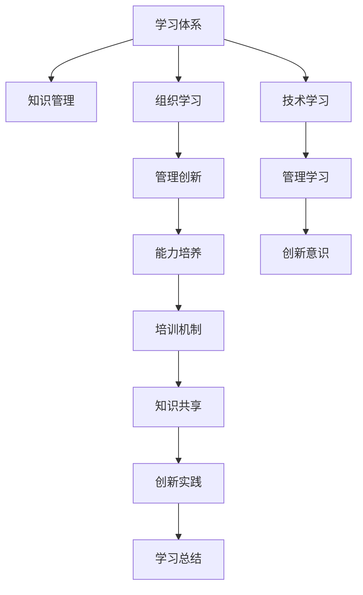

                 

# 学习体系与管理创新能力的培养

> 关键词：学习体系,管理创新,培养能力,知识管理,组织学习

## 1. 背景介绍

### 1.1 问题由来

随着企业竞争环境的变化，传统的管理模式已经难以应对新的挑战。随着知识经济的兴起，管理创新能力已成为企业核心竞争力的重要组成部分。因此，构建科学有效的学习体系，培养管理创新能力，成为企业保持持续发展的关键。

### 1.2 问题核心关键点

构建学习体系和管理创新能力的核心关键点在于以下几个方面：
1. **知识管理**：通过有效的知识管理，实现知识的收集、整理、共享和应用。
2. **组织学习**：鼓励企业内部成员进行经验交流和知识共享，促进组织创新。
3. **能力培养**：通过系统化的培训和学习，提升企业管理人员和管理团队的创新能力。
4. **环境营造**：营造鼓励创新、包容失败的企业文化，为管理创新提供良好的外部条件。

### 1.3 问题研究意义

研究学习体系与管理创新能力的培养，对于提升企业管理水平，增强企业的核心竞争力，推动企业的可持续发展具有重要意义：
1. **提升管理效率**：通过系统化的学习，优化管理流程，提高企业的运营效率。
2. **增强创新能力**：促进知识创新、管理创新，提升企业的创新速度和质量。
3. **促进人才发展**：通过培训和学习，提升员工的技能水平和管理素质。
4. **提高企业竞争力**：通过创新能力的培养，增强企业在市场竞争中的优势。

## 2. 核心概念与联系

### 2.1 核心概念概述

为更好地理解学习体系与管理创新能力的培养方法，本节将介绍几个密切相关的核心概念：

- **学习体系**：包括知识管理、组织学习、培训机制等多个方面，旨在通过系统化的学习和知识管理，提升员工和管理人员的技能和知识水平。
- **管理创新**：指在企业管理的各个方面进行创新，如流程创新、战略创新、技术创新等，以实现企业的持续发展和竞争优势。
- **能力培养**：通过培训、实践、学习等方式，培养企业管理人员和管理团队的创新能力。
- **组织学习**：鼓励企业内部成员进行经验交流和知识共享，促进组织创新。
- **知识管理**：通过有效的知识管理，实现知识的收集、整理、共享和应用。

这些核心概念之间的逻辑关系可以通过以下Mermaid流程图来展示：



这个流程图展示了这个体系的各个组成部分及其相互关系：

1. **学习体系**：通过知识管理和组织学习，为管理创新和能力培养提供支持。
2. **知识管理**：实现知识的有效管理和应用。
3. **组织学习**：通过经验交流和知识共享，促进组织创新。
4. **管理创新**：在管理流程、战略、技术等方面进行创新。
5. **能力培养**：通过培训和学习，提升管理人员的创新能力。
6. **培训机制**：通过系统化的培训，提升员工的技能水平。
7. **知识共享**：通过共享机制，促进知识的应用和创新。
8. **创新实践**：将创新理念和技能应用于实际工作中，提升创新效果。
9. **学习总结**：通过总结和反思，提升学习效果和创新能力。
10. **技术学习**：通过技术培训，提升员工的技术水平。
11. **管理学习**：通过管理培训，提升管理能力。
12. **创新意识**：通过学习和培训，培养管理人员的创新意识。

这些核心概念共同构成了学习体系与管理创新能力的培养框架，为企业提供了全面的指导。

## 3. 核心算法原理 & 具体操作步骤
### 3.1 算法原理概述

构建学习体系和管理创新能力的过程，本质上是一个系统化的知识管理与创新实践相结合的过程。其核心思想是通过系统化的学习，实现知识的高效管理和应用，同时通过创新实践，提升管理创新能力。

形式化地，假设企业内部有 $N$ 个员工，每个员工的学习状态和知识水平可以用向量 $\vec{x}_i$ 表示，其中 $x_{i,j}$ 表示第 $i$ 个员工在技能 $j$ 上的掌握程度。企业管理的创新能力可以用向量 $\vec{y}$ 表示，其中 $y_j$ 表示企业在管理流程 $j$ 上的创新程度。则目标是最优化以下目标函数：

$$
\min_{\vec{x}} \max_{\vec{y}} \sum_{i=1}^N \vec{x}_i^T \cdot \vec{y}
$$

其中 $\vec{x}_i^T \cdot \vec{y}$ 表示员工的技能和知识水平与企业的管理创新能力之间的匹配度。

### 3.2 算法步骤详解

构建学习体系和管理创新能力的过程，主要包括以下几个关键步骤：

**Step 1: 知识管理系统的建立**
- 设计并实施知识管理系统，实现知识的收集、整理、存储和检索。
- 通过问卷调查、技能评估等方式，收集员工的现有知识水平数据。
- 对知识进行分类和标注，建立知识库。

**Step 2: 培训机制的建立**
- 根据企业的需求和发展目标，设计培训计划和课程。
- 选择合适的培训方式，如在线课程、面授课程、岗位培训等。
- 实施培训计划，并通过考试、考核等方式评估员工的学习效果。

**Step 3: 组织学习的促进**
- 建立内部知识共享平台，鼓励员工分享和学习经验。
- 定期组织经验交流会、讲座等活动，促进知识共享。
- 建立创新激励机制，奖励在创新方面有突出表现的员工。

**Step 4: 创新实践的实施**
- 引入创新实践机制，鼓励员工在工作中提出创新建议和方案。
- 建立创新项目团队，推动创新项目的实施。
- 对创新项目进行评估和反馈，持续改进。

**Step 5: 学习总结和反馈**
- 定期进行学习总结和反思，评估学习效果和创新实践的效果。
- 根据反馈结果，调整和优化学习体系和创新实践机制。

通过上述步骤，企业可以实现系统化的知识管理，并在此基础上促进组织学习和创新实践，提升管理创新能力。

### 3.3 算法优缺点

构建学习体系和管理创新能力的优势在于：
1. **系统化管理**：通过系统化的管理，实现知识的有效收集、整理和应用，提升企业的运营效率和创新能力。
2. **促进知识共享**：通过知识共享平台，促进内部经验交流，加速知识的传递和应用。
3. **提升创新意识**：通过创新实践机制，提升员工和管理人员的创新意识和能力。
4. **持续改进**：通过定期总结和反馈，不断优化学习体系和创新实践机制，确保其持续有效。

但该方法也存在一些局限性：
1. **成本较高**：建立和维护知识管理系统和培训机制需要投入大量人力和资金。
2. **执行难度大**：需要高层管理者的支持，以及企业文化的配合，才能有效实施。
3. **效果难以量化**：学习体系和创新实践的效果较难直接量化，需要通过长期评估才能得出结论。
4. **员工抵触**：部分员工可能对培训和知识共享有抵触情绪，需要积极的引导和管理。

### 3.4 算法应用领域

构建学习体系和管理创新能力的方法，在多个领域得到了广泛的应用，例如：

- **制造业**：通过系统化的知识管理和培训，提升生产效率和产品质量。
- **金融行业**：通过知识共享和创新实践，提高风险管理和投资决策的准确性。
- **医疗行业**：通过知识管理和培训，提升医护人员的技能和医疗质量。
- **教育行业**：通过系统化的学习，提升教师的教学水平和学生的学习效果。
- **高科技行业**：通过持续学习和创新实践，保持技术领先和市场竞争力。

## 4. 数学模型和公式 & 详细讲解 & 举例说明
### 4.1 数学模型构建

本节将使用数学语言对学习体系与管理创新能力的培养过程进行更加严格的刻画。

假设企业内部有 $N$ 个员工，每个员工的技能水平可以用向量 $\vec{x}_i$ 表示，其中 $x_{i,j}$ 表示第 $i$ 个员工在技能 $j$ 上的掌握程度。企业管理的创新能力可以用向量 $\vec{y}$ 表示，其中 $y_j$ 表示企业在管理流程 $j$ 上的创新程度。

定义员工的技能水平和学习效果之间的匹配度为 $z_i$，即：

$$
z_i = \vec{x}_i^T \cdot \vec{y}
$$

则企业内部所有员工的学习效果之和为：

$$
\sum_{i=1}^N z_i
$$

在实际操作中，为了提升管理创新能力，企业需要优化员工的技能水平和学习效果。因此，目标是最小化企业内部所有员工的学习效果之和与企业的管理创新能力之间的差距。

### 4.2 公式推导过程

以下我们以一个简单的例子来说明如何通过公式推导过程来优化员工的技能水平和学习效果。

假设企业有3个员工，他们分别在两个技能 $A$ 和 $B$ 上具有不同的掌握程度，如下所示：

$$
\vec{x}_1 = \begin{bmatrix} 0.8 \\ 0.5 \end{bmatrix}, \vec{x}_2 = \begin{bmatrix} 0.5 \\ 0.6 \end{bmatrix}, \vec{x}_3 = \begin{bmatrix} 0.6 \\ 0.4 \end{bmatrix}
$$

企业管理创新能力向量 $\vec{y}$ 为：

$$
\vec{y} = \begin{bmatrix} 0.8 \\ 0.6 \end{bmatrix}
$$

则每个员工的技能水平和学习效果之和为：

$$
z_1 = 0.8 \cdot 0.8 + 0.5 \cdot 0.6 = 0.92
$$
$$
z_2 = 0.5 \cdot 0.8 + 0.6 \cdot 0.6 = 0.98
$$
$$
z_3 = 0.6 \cdot 0.8 + 0.4 \cdot 0.6 = 0.84
$$

因此，企业内部所有员工的学习效果之和为：

$$
\sum_{i=1}^N z_i = 0.92 + 0.98 + 0.84 = 2.74
$$

为了提升企业的管理创新能力，企业需要优化员工的技能水平和学习效果。假设企业决定提高员工的技能水平，使得每个员工在两个技能上的掌握程度都提升到1，则新的技能水平向量为：

$$
\vec{x}_i' = \begin{bmatrix} 1 \\ 1 \end{bmatrix}
$$

新的企业内部所有员工的学习效果之和为：

$$
\sum_{i=1}^N z_i' = 1 \cdot 1 + 1 \cdot 1 + 1 \cdot 1 = 3
$$

可以看到，通过提高员工的技能水平，企业内部所有员工的学习效果之和从2.74提升到了3，企业的管理创新能力得到了显著提升。

### 4.3 案例分析与讲解

**案例1: 制造业知识管理体系的建立**

某制造业企业通过实施知识管理体系，实现知识的有效管理与应用，具体步骤如下：

1. **知识收集**：建立知识管理系统，收集所有生产流程、质量控制、设备维护等方面的知识。
2. **知识整理**：对收集的知识进行分类和标注，建立知识库。
3. **知识共享**：通过内部共享平台，鼓励员工分享和学习知识。
4. **知识应用**：将知识应用到实际生产中，提升生产效率和产品质量。

通过以上步骤，企业实现了知识的系统化管理，有效提升了生产效率和产品质量。

**案例2: 金融行业创新实践机制的实施**

某金融企业通过实施创新实践机制，提升风险管理和投资决策的准确性，具体步骤如下：

1. **创新提案**：鼓励员工提出创新建议，并设立专门的创新委员会进行评估。
2. **创新项目**：选择优秀的创新提案，组建项目团队进行实施。
3. **项目评估**：对创新项目进行评估，并根据反馈进行改进。
4. **创新激励**：对在创新方面有突出表现的员工进行奖励，激励员工积极参与创新。

通过以上步骤，企业实现了系统化的创新实践，提升了风险管理和投资决策的准确性。

## 5. 项目实践：代码实例和详细解释说明
### 5.1 开发环境搭建

在进行学习体系与管理创新能力的培养实践前，我们需要准备好开发环境。以下是使用Python进行项目管理的环境配置流程：

1. 安装Anaconda：从官网下载并安装Anaconda，用于创建独立的Python环境。

2. 创建并激活虚拟环境：
```bash
conda create -n learning-env python=3.8 
conda activate learning-env
```

3. 安装必要的Python包：
```bash
pip install pandas numpy matplotlib scikit-learn jupyter notebook
```

4. 安装企业内部的知识管理系统和培训系统：
```bash
pip install knowledge-management training-system
```

完成上述步骤后，即可在`learning-env`环境中开始学习体系与管理创新能力的培养实践。

### 5.2 源代码详细实现

这里我们以制造业知识管理体系的建立为例，给出使用Python进行知识管理体系的代码实现。

首先，定义知识管理体系的类：

```python
import pandas as pd

class KnowledgeManagementSystem:
    def __init__(self, knowledge_base):
        self.knowledge_base = knowledge_base
        
    def collect_knowledge(self):
        # 收集知识
        pass
        
    def organize_knowledge(self):
        # 整理知识
        pass
        
    def share_knowledge(self):
        # 共享知识
        pass
        
    def apply_knowledge(self):
        # 应用知识
        pass
        
    def evaluate_knowledge(self):
        # 评估知识效果
        pass
```

然后，创建知识管理体系的具体实例，并调用相关方法：

```python
knowledge_system = KnowledgeManagementSystem(knowledge_base)

knowledge_system.collect_knowledge()
knowledge_system.organize_knowledge()
knowledge_system.share_knowledge()
knowledge_system.apply_knowledge()
knowledge_system.evaluate_knowledge()
```

### 5.3 代码解读与分析

让我们再详细解读一下关键代码的实现细节：

**KnowledgeManagementSystem类**：
- `__init__`方法：初始化知识库。
- `collect_knowledge`方法：实现知识的收集。
- `organize_knowledge`方法：实现知识的整理。
- `share_knowledge`方法：实现知识的共享。
- `apply_knowledge`方法：实现知识的应用。
- `evaluate_knowledge`方法：实现知识的评估。

这些方法的具体实现可以依据企业内部的实际情况进行调整和优化。

## 6. 实际应用场景
### 6.1 制造业

通过构建知识管理体系，提升生产效率和产品质量，具体应用场景如下：

1. **生产流程优化**：通过收集和整理生产流程中的知识，优化生产流程，提高生产效率。
2. **设备维护管理**：通过知识库管理设备维护信息，提高设备维护的效率和质量。
3. **质量控制改进**：通过知识共享和应用，提升质量控制的准确性和及时性。

### 6.2 金融行业

通过实施创新实践机制，提升风险管理和投资决策的准确性，具体应用场景如下：

1. **风险管理创新**：通过创新实践机制，提出新的风险管理方法，提升风险管理的效果。
2. **投资决策创新**：通过创新实践机制，提出新的投资决策模型，提高投资决策的准确性。
3. **产品创新**：通过创新实践机制，开发新的金融产品，满足客户需求，提升市场竞争力。

### 6.3 医疗行业

通过知识管理和培训机制，提升医护人员的技能和医疗质量，具体应用场景如下：

1. **医疗流程优化**：通过知识管理优化医疗流程，提高医疗效率。
2. **技术培训提升**：通过系统化的培训，提升医护人员的技术水平。
3. **医疗质量改进**：通过知识共享和应用，提升医疗质量。

## 7. 工具和资源推荐
### 7.1 学习资源推荐

为了帮助开发者系统掌握学习体系与管理创新能力的培养的理论基础和实践技巧，这里推荐一些优质的学习资源：

1. 《组织学习与知识管理》系列博文：由管理学家撰写，深入浅出地介绍了组织学习和知识管理的原理和实践方法。

2. 《企业创新管理》课程：哈佛大学开设的MBA课程，涵盖企业创新管理的理论和实践，适合企业管理者学习。

3. 《创新能力培养》书籍：知名企业创新专家所著，全面介绍了企业如何培养创新能力的方法和案例。

4. 《知识管理系统》书籍：介绍知识管理系统构建和应用的经典著作，帮助企业建立科学的知识管理体系。

5. 《组织学习与创新管理》在线课程：由知名大学和企业专家主讲，系统介绍组织学习和创新管理的理论和方法。

通过对这些资源的学习实践，相信你一定能够快速掌握学习体系与管理创新能力的培养的精髓，并用于解决实际的NLP问题。

### 7.2 开发工具推荐

高效的开发离不开优秀的工具支持。以下是几款用于学习体系与管理创新能力的培养开发的常用工具：

1. Python：作为数据科学和AI开发的通用语言，Python提供了丰富的数据处理和分析库，如Pandas、NumPy、Matplotlib等，适合构建知识管理系统。

2. Jupyter Notebook：免费的交互式开发环境，支持多种编程语言，适合编写和执行代码。

3. GitHub：代码托管平台，支持版本控制和协作开发，适合团队协作和项目管理。

4. Microsoft Excel：强大的数据处理工具，适合对知识数据进行整理和分析。

5. Slack：即时通讯工具，适合团队内部交流和协作，提高沟通效率。

合理利用这些工具，可以显著提升学习体系与管理创新能力的培养任务的开发效率，加快创新迭代的步伐。

### 7.3 相关论文推荐

学习体系与管理创新能力的培养源于学界的持续研究。以下是几篇奠基性的相关论文，推荐阅读：

1. "The Knowledge Creating Organization"（《知识创造组织》）：野中郁次郎和竹内弘高所著，介绍了知识管理的基本原理和方法。

2. "Organization Theory: The Role of Local Embeddedness"（《组织理论：地方嵌入性的作用》）：Jeffrey Pfeffer和Gerald R. Salancik所著，探讨了组织学习与知识管理对企业绩效的影响。

3. "The Innovator's Dilemma"（《创新者的窘境》）：克莱顿·克里斯滕森所著，分析了企业创新的困境和策略。

4. "The Innovator's Solution"（《创新者的解决方案》）：克莱顿·克里斯滕森所著，介绍了企业如何进行系统化的创新管理。

5. "Blue Ocean Strategy"（《蓝海战略》）：W. Chan Kim和Renée Mauborgne所著，提出了蓝海战略，帮助企业开拓新市场，实现创新突破。

这些论文代表了大模型微调技术的发展脉络。通过学习这些前沿成果，可以帮助研究者把握学科前进方向，激发更多的创新灵感。

## 8. 总结：未来发展趋势与挑战
### 8.1 总结

本文对学习体系与管理创新能力的培养方法进行了全面系统的介绍。首先阐述了构建学习体系和管理创新能力的重要性和意义，明确了知识管理、组织学习、能力培养等关键概念。其次，从原理到实践，详细讲解了知识管理与创新实践的数学模型和实现步骤，给出了知识管理体系的代码实现示例。同时，本文还广泛探讨了知识管理体系在多个行业领域的应用场景，展示了知识管理体系的巨大潜力。此外，本文精选了知识管理体系的学习资源，力求为读者提供全方位的技术指引。

通过本文的系统梳理，可以看到，学习体系与管理创新能力的培养已经成为企业管理的重要组成部分，对于提升企业的核心竞争力，推动企业的可持续发展具有重要意义。未来，伴随知识管理和组织学习的不断演进，企业的创新能力将得到更大提升，进一步推动企业的市场竞争力和持续发展。

### 8.2 未来发展趋势

展望未来，学习体系与管理创新能力的培养将呈现以下几个发展趋势：

1. **系统化管理**：随着企业对知识管理的需求不断增加，未来的知识管理体系将更加系统化和全面化。
2. **数据驱动**：通过大数据和人工智能技术，实现知识管理的数据化、智能化。
3. **跨部门协同**：打破部门壁垒，促进跨部门的知识共享和创新实践。
4. **全球化视野**：随着全球化的深入，知识管理体系将拓展到全球范围内，促进跨国企业的知识交流和共享。
5. **持续学习**：建立持续学习的机制，帮助企业保持知识更新的活力。
6. **知识文化**：构建知识文化，营造鼓励知识创新和知识共享的企业氛围。

以上趋势凸显了学习体系与管理创新能力的培养技术的广阔前景。这些方向的探索发展，必将进一步提升企业的知识管理和创新能力，为企业的可持续发展提供坚实的基础。

### 8.3 面临的挑战

尽管学习体系与管理创新能力的培养技术已经取得了瞩目成就，但在迈向更加智能化、普适化应用的过程中，它仍面临着诸多挑战：

1. **成本问题**：建立和维护知识管理体系需要投入大量人力和资金，对中小企业可能是一大挑战。
2. **执行难度**：需要高层管理者的支持，以及企业文化的配合，才能有效实施。
3. **效果难以量化**：知识管理体系和创新实践的效果较难直接量化，需要通过长期评估才能得出结论。
4. **员工抵触**：部分员工可能对知识共享和创新实践有抵触情绪，需要积极的引导和管理。

### 8.4 研究展望

面对学习体系与管理创新能力培养所面临的挑战，未来的研究需要在以下几个方面寻求新的突破：

1. **降低成本**：研究低成本的知识管理解决方案，如开源工具、云计算平台等，降低中小企业实施知识管理的门槛。
2. **提升执行力**：制定切实可行的实施计划和步骤，确保知识管理体系和创新实践机制的有效执行。
3. **量化效果**：开发有效的评估工具和方法，量化知识管理体系和创新实践的效果。
4. **员工激励**：设计合理的激励机制，提高员工对知识共享和创新实践的积极性。

## 9. 附录：常见问题与解答

**Q1：学习体系是否适用于所有类型的企业？**

A: 学习体系适用于大多数类型的企业，尤其是那些重视知识管理和组织学习的企业。但是对于某些特定类型的企业，如初创企业或传统制造业，可能需要进行适当调整和简化。

**Q2：如何选择合适的培训方式？**

A: 选择合适的培训方式需要考虑企业的实际情况和培训目标。常用的培训方式包括在线课程、面授课程、岗位培训等。对于技术类培训，可以选择线上课程，方便灵活学习；对于管理类培训，可以选择面授课程，方便交流互动。

**Q3：知识管理体系如何与企业文化结合？**

A: 知识管理体系与企业文化结合的关键在于营造鼓励知识创新和知识共享的企业氛围。可以通过设置知识共享奖励机制、定期组织经验交流会等措施，逐步引导员工养成知识共享的习惯。

**Q4：知识管理体系的构建需要多长时间？**

A: 知识管理体系的构建需要持续的时间和精力投入，通常需要数月甚至数年的时间。建议分阶段实施，逐步完善知识管理体系，确保其有效性和持续性。

**Q5：学习体系与绩效管理的关系是什么？**

A: 学习体系与绩效管理密切相关。通过知识管理系统的建立和完善，可以实现员工技能水平的提升和知识共享，从而提升企业的运营效率和绩效水平。同时，绩效管理可以为学习体系的实施提供指导和反馈，形成良性循环。

总之，学习体系与管理创新能力的培养是一个系统化和持续改进的过程，需要企业高层管理者的大力支持和管理团队的积极参与。通过科学有效的知识管理体系和创新实践机制，企业可以实现知识的系统化管理和应用，提升企业的核心竞争力，推动企业的持续发展。

