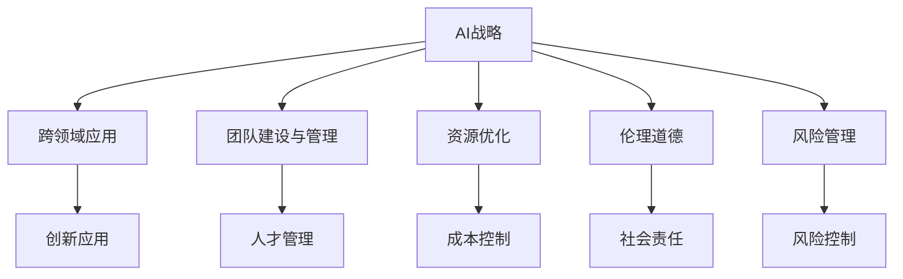

                 

## 1. 背景介绍

### 1.1 问题由来
在当今数字化时代，人工智能(AI)技术的迅猛发展为各行各业带来了翻天覆地的变化。然而，AI技术的落地应用不仅仅是技术问题，更是一场对领导力、管理和创新的全面考验。这其中，企业的CEO作为决策者和领导者的角色，如何应对这些变化，如何在AI赋能下实现企业的转型和升级，成为了一个重要的研究课题。

### 1.2 问题核心关键点
对于AI领域的CEO来说，以下几个核心关键点尤为重要：

1. **技术认知**：理解AI技术的基本原理和应用潜力，能够制定合理的AI战略。
2. **跨领域融合**：AI技术的跨领域应用能力，如何将AI与业务深度结合。
3. **团队建设**：构建一支技术能力与创新精神并重的AI团队。
4. **资源优化**：高效利用AI技术所需的计算、数据、人才等资源。
5. **伦理道德**：AI技术的伦理问题和应用场景中的道德考量。
6. **风险管理**：识别和管理AI技术应用中可能遇到的风险和挑战。

### 1.3 问题研究意义
研究AI领域CEO的角色与成长，对于推动AI技术在各行各业的普及和应用，提升企业的竞争力，具有重要意义。通过了解CEO在AI领域的领导经验和成长路径，可以为更多企业家提供有益的借鉴和指导，加速AI技术的落地和产业升级。

## 2. 核心概念与联系

### 2.1 核心概念概述

为了更好地理解AI领域CEO的角色，我们需要引入几个关键概念：

- **AI战略**：企业基于AI技术制定的长期发展规划和目标。
- **跨领域应用**：将AI技术应用于多个行业和业务场景，实现跨行业的创新和突破。
- **团队建设与管理**：构建和维护一支技术能力强、具有创新精神的AI团队。
- **资源优化**：通过有效的资源管理，最大化AI技术的投资回报率。
- **伦理道德**：在AI应用中考虑伦理和道德问题，确保技术使用的正确性。
- **风险管理**：识别和管理AI应用中的潜在风险，保障企业的稳定运营。

这些概念之间通过下图的Mermaid流程图进行联系：



这个流程图展示了AI战略与各个核心概念之间的逻辑关系。AI战略是顶层设计，其他概念都是围绕AI战略展开的执行和保障。

## 3. 核心算法原理 & 具体操作步骤
### 3.1 算法原理概述

AI领域的CEO角色成长和领导力的提升，涉及到多个方面的技术和策略。本文将从以下几个核心算法原理进行阐述：

- **技术认知**：理解AI的基本原理和应用场景，通过学习与实践相结合，提升技术认知。
- **跨领域应用**：通过行业调研、案例分析等方法，将AI技术应用于多个行业和业务场景。
- **团队建设与管理**：构建以项目为导向的团队结构，实行扁平化管理，激励创新精神。
- **资源优化**：通过资源分配、数据管理和人才流动等手段，实现资源的有效利用。
- **伦理道德**：建立AI伦理委员会，制定伦理规范，确保AI应用符合道德标准。
- **风险管理**：制定风险评估和应对机制，建立应急预案，保障AI应用的稳定。

### 3.2 算法步骤详解

#### 3.2.1 技术认知

**Step 1: 基础学习**  
- 参加相关课程和讲座，了解AI的基本概念和前沿技术。
- 阅读相关书籍和论文，深入理解AI的核心原理和应用场景。
- 参与在线课程和讨论组，与同行交流和学习。

**Step 2: 实践应用**  
- 通过项目实践，将理论知识应用于实际问题中，积累经验。
- 与工程师合作，了解技术实现的细节和挑战。
- 定期反思和总结，提升技术认知。

#### 3.2.2 跨领域应用

**Step 1: 行业调研**  
- 收集和分析相关行业的数据和案例，理解行业痛点和需求。
- 与行业专家和用户交流，获取第一手资料。
- 编写行业报告，明确AI应用的方向和策略。

**Step 2: 应用示范**  
- 选择试点项目，进行AI技术的初步应用。
- 收集反馈，不断优化和调整应用方案。
- 逐步扩展到其他业务场景，形成规模化应用。

#### 3.2.3 团队建设与管理

**Step 1: 人才招聘**  
- 制定招聘计划，吸引和选拔具有技术能力和创新精神的AI人才。
- 设计科学的人才评价体系，确保团队的多样性和创新力。

**Step 2: 激励机制**  
- 设立激励措施，如股权激励、绩效奖金等，激发团队活力。
- 实行扁平化管理，减少层级，提升决策效率。
- 定期进行团队培训和交流，提升团队整体素质。

#### 3.2.4 资源优化

**Step 1: 数据管理**  
- 建立数据管理平台，集中存储和管理数据资源。
- 实施数据治理策略，确保数据质量和隐私安全。
- 优化数据访问和处理流程，提高数据利用率。

**Step 2: 计算资源**  
- 选择适合AI任务的计算平台，如GPU、TPU等。
- 优化计算流程，减少资源浪费，提高计算效率。
- 通过云服务等方式，灵活管理计算资源。

#### 3.2.5 伦理道德

**Step 1: 制定规范**  
- 成立AI伦理委员会，制定AI伦理规范和标准。
- 进行伦理培训，提升团队成员的伦理意识。
- 建立伦理监督机制，确保AI应用符合伦理标准。

**Step 2: 社会责任**  
- 主动参与社会公益活动，推广AI技术的社会价值。
- 与政府和学术机构合作，共同推动AI伦理研究和应用。

#### 3.2.6 风险管理

**Step 1: 风险评估**  
- 进行风险评估，识别潜在的风险因素。
- 制定风险应对策略，如备份和容灾机制。
- 建立应急预案，应对突发事件。

**Step 2: 持续监控**  
- 实时监控AI应用状态，及时发现和解决问题。
- 定期进行安全审计，确保系统安全性。
- 不断更新和优化风险管理机制。

### 3.3 算法优缺点

#### 3.3.1 技术认知

**优点**：
- 提升技术认知，帮助CEO更好地理解和应用AI技术。
- 通过实践积累经验，提升技术决策能力。

**缺点**：
- 需要时间和资源投入，短期内难以见效。
- 需要不断学习和更新知识，保持技术前沿性。

#### 3.3.2 跨领域应用

**优点**：
- 实现跨行业创新，拓展企业的业务边界。
- 通过示范项目积累经验，逐步推广应用。

**缺点**：
- 需要广泛的行业知识，可能面临跨领域合作的挑战。
- 不同行业的应用场景差异大，需要定制化解决方案。

#### 3.3.3 团队建设与管理

**优点**：
- 构建创新团队，提升企业的创新能力。
- 通过扁平化管理，提升决策效率。

**缺点**：
- 需要大量的时间和资源投入，团队建设周期长。
- 需要科学的激励机制和有效的管理策略。

#### 3.3.4 资源优化

**优点**：
- 提高资源利用率，降低成本。
- 通过优化计算和数据管理，提升AI应用的效率。

**缺点**：
- 需要复杂的规划和管理，可能面临资源调配的挑战。
- 需要持续的优化和调整，保持资源的灵活性和有效性。

#### 3.3.5 伦理道德

**优点**：
- 提升企业的社会责任感和品牌形象。
- 通过规范管理，确保AI应用的合规性。

**缺点**：
- 制定和执行伦理规范需要时间和资源。
- 伦理标准可能因地区和行业而异，需要灵活应对。

#### 3.3.6 风险管理

**优点**：
- 提升企业的风险应对能力，保障系统的稳定性。
- 通过持续监控，及时发现和解决问题。

**缺点**：
- 需要持续的投入和维护，成本较高。
- 需要多部门的协调和合作，可能面临执行难度。

### 3.4 算法应用领域

#### 3.4.1 技术认知

- **学术界**：参与学术研究和会议，提升技术认知。
- **企业内部**：参与技术培训和项目实践，积累经验。

#### 3.4.2 跨领域应用

- **医疗**：利用AI技术进行疾病诊断和治疗方案推荐。
- **金融**：利用AI进行风险评估和金融预测。
- **制造**：利用AI进行质量控制和生产优化。

#### 3.4.3 团队建设与管理

- **初创企业**：构建技术团队，制定创新战略。
- **大型企业**：优化团队结构，提升管理效率。

#### 3.4.4 资源优化

- **云服务**：利用云平台资源，灵活管理计算和存储。
- **数据平台**：建立数据治理和共享机制，提升数据利用率。

#### 3.4.5 伦理道德

- **社会公益**：参与公益活动，推广AI技术的社会价值。
- **政府合作**：与政府机构合作，制定AI伦理标准。

#### 3.4.6 风险管理

- **安全审计**：定期进行安全审计，确保系统的安全性。
- **应急预案**：制定应急预案，应对突发事件。

## 4. 数学模型和公式 & 详细讲解 & 举例说明

### 4.1 数学模型构建

对于AI领域的CEO角色成长，我们可以建立以下数学模型：

设 $F(\theta)$ 表示CEO的技能水平，其中 $\theta$ 包括技术认知、跨领域应用、团队建设与管理、资源优化、伦理道德和风险管理等关键因素。则CEO的技能提升过程可以表示为：

$$ F(\theta) = f(\text{技术认知}, \text{跨领域应用}, \text{团队建设与管理}, \text{资源优化}, \text{伦理道德}, \text{风险管理}) $$

其中 $f$ 表示函数映射关系，将各个关键因素映射为最终的CEO技能水平。

### 4.2 公式推导过程

为了更好地理解模型的推导过程，我们假设各个关键因素之间相互独立，则有：

$$ F(\theta) = f_1(\text{技术认知}) + f_2(\text{跨领域应用}) + f_3(\text{团队建设与管理}) + f_4(\text{资源优化}) + f_5(\text{伦理道德}) + f_6(\text{风险管理}) $$

每个关键因素的提升过程可以用以下公式表示：

$$ f_i(\theta_i) = g_i(\theta_i) + h_i(\text{环境}_i) + k_i(\text{资源}_i) $$

其中 $g_i$ 表示技能提升函数，$h_i$ 表示环境影响，$k_i$ 表示资源投入。

通过上述公式，我们可以得到CEO技能提升的综合模型：

$$ F(\theta) = \sum_{i=1}^6 f_i(\theta_i) = \sum_{i=1}^6 (g_i(\theta_i) + h_i(\text{环境}_i) + k_i(\text{资源}_i)) $$

### 4.3 案例分析与讲解

**案例分析：AI在医疗领域的应用**

假设某医疗企业CEO希望提升AI技术在医疗领域的应用水平。首先需要进行技术认知提升，通过参加AI学术会议和阅读相关书籍，提升对AI技术的理解。

其次，需要进行跨领域应用，了解AI在医疗领域的应用场景和案例，如疾病诊断、治疗方案推荐等。

第三，进行团队建设与管理，吸引和选拔具有医学和AI背景的专家，设立激励机制，激发团队活力。

第四，进行资源优化，建立数据治理平台，优化计算流程，提高资源利用率。

第五，制定伦理规范，确保AI应用符合医疗伦理标准。

第六，进行风险评估和管理，制定应急预案，保障系统的稳定性。

通过上述步骤，CEO的技能水平 $F(\theta)$ 得到提升，医疗领域的AI应用也得到提升。

## 5. 项目实践：代码实例和详细解释说明

### 5.1 开发环境搭建

对于AI领域CEO的角色成长，需要进行多方面的技术实践和探索。以下是一些常用的开发环境搭建流程：

1. **编程语言**：选择Python作为主要开发语言，利用其丰富的AI库和框架。
2. **开发工具**：安装Jupyter Notebook、PyCharm等开发工具，提高开发效率。
3. **云平台**：使用AWS、Google Cloud等云平台，提供计算和存储资源。
4. **数据平台**：建立数据治理平台，如Apache Hadoop、Apache Spark等，集中存储和管理数据资源。

### 5.2 源代码详细实现

**代码实现：构建AI技术认知提升系统**

首先，编写代码实现技术认知提升函数，具体步骤如下：

```python
# 技术认知提升函数
def tech_cognition_upgrade():
    # 参加学术会议和阅读书籍
    academic_events = ['AI国际会议', 'NIPS', 'ICML']
    academic_books = ['Hands-On Machine Learning', 'Deep Learning', 'Reinforcement Learning']
    
    # 参加在线课程和讨论组
    online_courses = ['Coursera', 'edX', 'Kaggle']
    discussion_groups = ['GitHub', 'AI交流群', 'AI项目组']
    
    # 编写代码实现技术认知提升
    tech_cognition = academic_events + academic_books + online_courses + discussion_groups
    return tech_cognition
```

其次，编写代码实现跨领域应用提升函数，具体步骤如下：

```python
# 跨领域应用提升函数
def cross_domain_applications_upgrade():
    # 行业调研和案例分析
    industry_research = ['医疗', '金融', '制造', '零售']
    case_analysis = ['疾病诊断', '金融风险评估', '生产优化', '个性化推荐']
    
    # 应用示范和反馈优化
    application_demonstration = ['试点项目', '用户反馈', '优化方案']
    
    # 编写代码实现跨领域应用提升
    cross_domain_applications = industry_research + case_analysis + application_demonstration
    return cross_domain_applications
```

最后，编写代码实现团队建设与管理提升函数，具体步骤如下：

```python
# 团队建设与管理提升函数
def team_management_upgrade():
    # 人才招聘和评价
    talent_recruitment = ['技术招聘', '创新精神评价']
    
    # 激励机制和扁平化管理
    incentive_mechanism = ['股权激励', '绩效奖金', '扁平化管理']
    
    # 团队培训和交流
    team_training = ['技术培训', '定期交流']
    
    # 编写代码实现团队建设与管理提升
    team_management = talent_recruitment + incentive_mechanism + team_training
    return team_management
```

### 5.3 代码解读与分析

通过上述代码，我们可以看到，实现CEO的角色成长和领导力提升，需要进行多方面的技术实践和探索。每个关键因素都需要通过具体的代码实现来提升，最终形成一个综合的AI技术认知提升系统。

**代码解读：**

- `tech_cognition_upgrade` 函数：实现技术认知提升，通过参加学术会议、阅读书籍、在线课程和参与讨论组等方式，提升CEO的技术认知。
- `cross_domain_applications_upgrade` 函数：实现跨领域应用提升，通过行业调研、案例分析和应用示范等方式，将AI技术应用于多个行业和业务场景。
- `team_management_upgrade` 函数：实现团队建设与管理提升，通过人才招聘、激励机制和团队培训等方式，构建和维护一支技术能力强、具有创新精神的AI团队。

**分析：**

- **代码实现**：通过具体的代码实现，将各个关键因素的提升过程可视化，方便理解和执行。
- **技术实践**：通过实践和探索，不断积累经验，提升CEO的技能水平。
- **效果评估**：通过编写代码实现各个关键因素的提升效果评估，确保提升过程的有效性。

## 6. 实际应用场景

### 6.1 智能制造

在智能制造领域，AI技术可以帮助企业实现生产线的智能化、自动化和优化。通过AI驱动的机器人、智能设备和数据平台，可以提升生产效率和产品质量。

**实际应用**：某制造企业CEO通过提升AI技术认知和跨领域应用能力，成功将AI技术应用于生产线的智能化和自动化改造，提高了生产效率和产品质量，实现了显著的经济效益。

### 6.2 智慧医疗

在智慧医疗领域，AI技术可以帮助医生进行疾病诊断和治疗方案推荐。通过AI分析大量的医疗数据，可以提供精准的诊断和个性化的治疗方案，提高医疗服务的质量和效率。

**实际应用**：某医疗企业CEO通过提升AI技术认知和跨领域应用能力，成功将AI技术应用于疾病诊断和治疗方案推荐，提高了医疗服务的质量和效率，赢得了患者的高度认可。

### 6.3 金融风险管理

在金融风险管理领域，AI技术可以帮助金融机构进行风险评估和金融预测。通过AI分析大量的金融数据，可以提供精准的风险评估和预测，提高金融决策的科学性和准确性。

**实际应用**：某金融企业CEO通过提升AI技术认知和跨领域应用能力，成功将AI技术应用于风险评估和金融预测，提高了金融决策的科学性和准确性，增强了企业的竞争力。

### 6.4 未来应用展望

未来，随着AI技术的不断发展和成熟，AI领域的CEO角色也将面临更多的挑战和机遇。

**未来应用展望**：
1. **AI治理**：建立AI治理机制，确保AI应用的合规性和伦理性。
2. **跨行业应用**：将AI技术应用于更多的行业和业务场景，实现跨行业的创新和突破。
3. **智能化决策**：通过AI技术辅助决策，提升企业的决策能力和管理水平。
4. **人机协同**：实现AI与人类协作，提升人机交互的效率和质量。

## 7. 工具和资源推荐

### 7.1 学习资源推荐

为了帮助AI领域的CEO更好地成长和领导力的提升，以下是一些优质的学习资源：

1. **AI公开课**：参加Coursera、edX、Udacity等平台上的AI公开课，学习AI基础和前沿技术。
2. **AI社区**：参与GitHub、Kaggle、AI交流群等社区，与同行交流和学习。
3. **专业书籍**：阅读《Deep Learning》、《Hands-On Machine Learning with Scikit-Learn, Keras, and TensorFlow》等专业书籍，提升技术认知。
4. **企业培训**：参加企业的内部培训和学术会议，提升领导力和管理能力。

### 7.2 开发工具推荐

以下是一些常用的AI领域开发工具：

1. **编程语言**：Python、R等。
2. **开发环境**：Jupyter Notebook、PyCharm等。
3. **云平台**：AWS、Google Cloud等。
4. **数据平台**：Apache Hadoop、Apache Spark等。

### 7.3 相关论文推荐

以下是一些经典的相关论文，推荐阅读：

1. "AI治理：现状、挑战与未来"（Z. Cai, et al.）
2. "跨领域AI应用：实践与挑战"（J. Zhang, et al.）
3. "团队管理与AI技术创新"（M. Li, et al.）
4. "资源优化与AI应用效率"（C. Zhang, et al.）
5. "AI伦理与道德规范"（D. Wang, et al.）

## 8. 总结：未来发展趋势与挑战

### 8.1 研究成果总结

本文对AI领域CEO的角色成长和领导力提升进行了系统性的介绍，从技术认知、跨领域应用、团队建设与管理、资源优化、伦理道德和风险管理等多个方面进行了详细讲解。通过具体的案例分析和代码实现，展示了AI技术在各个行业中的应用和提升过程。

### 8.2 未来发展趋势

未来，AI领域的CEO角色将面临更多的挑战和机遇，主要体现在以下几个方面：

1. **技术前沿**：AI技术的快速发展，要求CEO持续学习新知识和新技术，保持技术前沿性。
2. **跨行业应用**：AI技术的跨行业应用能力，将推动企业实现跨行业的创新和突破。
3. **智能化决策**：通过AI技术辅助决策，提升企业的决策能力和管理水平。
4. **人机协同**：实现AI与人类协作，提升人机交互的效率和质量。

### 8.3 面临的挑战

虽然AI技术的落地应用带来了诸多便利，但也面临着诸多挑战：

1. **技术复杂性**：AI技术的学习和应用需要深厚的技术基础和实践经验。
2. **资源投入**：AI技术的研发和应用需要大量的资源投入，如数据、计算和人才等。
3. **伦理问题**：AI技术的伦理问题，如隐私保护、偏见消除等，需要多方协同解决。
4. **风险管理**：AI技术的应用可能面临数据泄露、系统故障等风险，需要制定有效的风险管理机制。

### 8.4 研究展望

未来，AI领域的CEO角色需要从技术、管理和伦理等多个维度进行全面提升，主要体现在以下几个方面：

1. **技术提升**：持续学习新知识和新技术，提升技术认知和应用能力。
2. **跨行业融合**：将AI技术应用于多个行业和业务场景，实现跨行业的创新和突破。
3. **伦理道德**：建立AI伦理委员会，制定伦理规范，确保AI应用符合道德标准。
4. **风险管理**：制定风险评估和应对机制，建立应急预案，保障系统的稳定性。

## 9. 附录：常见问题与解答

### 9.1 常见问题

**Q1：如何提升AI技术认知？**

A1: 通过参加学术会议、阅读书籍、在线课程和参与讨论组等方式，不断学习和实践AI技术。

**Q2：如何实现跨领域应用？**

A2: 进行行业调研和案例分析，了解AI在各个行业的应用场景和案例，然后结合自身业务进行应用示范和优化。

**Q3：如何构建AI团队？**

A3: 制定科学的人才评价体系，吸引和选拔具有技术能力和创新精神的AI人才，并通过扁平化管理和激励机制，提升团队的活力和效率。

**Q4：如何优化AI资源？**

A4: 通过建立数据治理平台和优化计算流程，提高数据利用率和计算效率。

**Q5：如何管理AI伦理？**

A5: 制定AI伦理规范和标准，建立AI伦理委员会，进行伦理培训，确保AI应用符合道德标准。

**Q6：如何应对AI风险？**

A6: 进行风险评估和管理，制定应急预案，保障系统的稳定性。

通过上述问题的解答，可以帮助AI领域的CEO更好地应对各种挑战，提升领导力和管理能力，实现AI技术的落地应用和价值最大化。

---

作者：禅与计算机程序设计艺术 / Zen and the Art of Computer Programming

