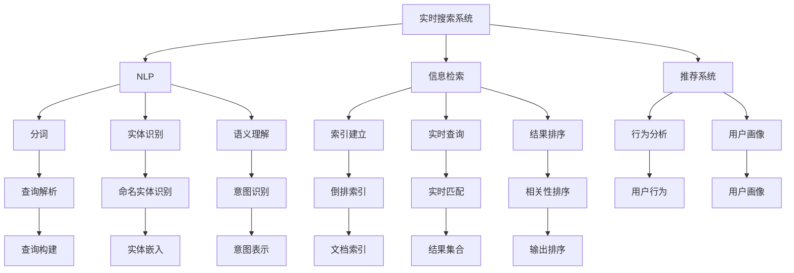

                 

# 实时搜索：AI的即时响应

> 关键词：实时搜索, AI即时响应, 自然语言处理(NLP), 推荐系统, 信息检索, 即时响应系统

## 1. 背景介绍

### 1.1 问题由来
随着互联网和移动设备的普及，信息检索已成为用户获取知识、解决问题的重要方式。然而，传统的搜索引擎如谷歌、百度等，虽然能够提供丰富的搜索结果，但响应时间相对较慢，无法满足用户在实时场景下的即时需求。尤其是当用户需要快速获取某条信息或解决某个问题时，实时搜索系统显得尤为重要。

实时搜索系统通常采用自然语言处理（Natural Language Processing, NLP）技术，以语义理解为基础，能够即时响应用户输入，提供相关搜索结果或直接回答问题。相较于传统的基于关键词匹配的搜索引擎，实时搜索系统更能理解用户真实需求，并提供更精准、更即时的搜索结果。

### 1.2 问题核心关键点
实时搜索系统的关键点在于快速理解用户意图，并即时提供准确的信息。其核心技术包括：

- 自然语言处理：通过对用户输入进行分词、实体识别、语义理解等处理，将非结构化文本转化为结构化信息。
- 信息检索：基于已建立的索引，在瞬间检索出最相关的文档，并根据相似度排序。
- 推荐算法：针对用户行为和偏好，动态推荐相关内容。
- 即时响应：通过高并发的架构设计，实现实时响应。

## 2. 核心概念与联系

### 2.1 核心概念概述

为更好地理解实时搜索系统的原理和架构，本节将介绍几个密切相关的核心概念：

- 实时搜索系统(Real-time Search System)：一种能够即时响应用户输入，提供相关搜索结果或直接回答问题的人工智能系统。
- 自然语言处理(NLP)：利用计算机科学和人工智能技术，实现自然语言的理解、生成和处理，是实时搜索系统的重要组成部分。
- 信息检索(Information Retrieval, IR)：通过建立索引、检索匹配等手段，快速定位用户所需信息的过程。
- 推荐系统(Recommender System)：根据用户的历史行为和偏好，动态推荐相关内容，提升用户体验。
- 即时响应(Immediate Response)：通过高并发的架构设计，实现快速响应，满足用户实时需求。
- 分布式系统(Distributed System)：实时搜索系统通常采用分布式架构，将搜索、索引、计算等功能模块分布到多台服务器上，提升系统的扩展性和处理能力。
- 搜索引擎(Elastic Search)：一种高度可扩展的分布式全文搜索引擎，是构建实时搜索系统的重要工具。

这些核心概念之间的逻辑关系可以通过以下Mermaid流程图来展示：



这个流程图展示了一系列核心概念及其之间的关系：

1. 实时搜索系统通过NLP技术理解用户输入，经过分词、实体识别、语义理解等步骤，将用户查询转化为结构化信息。
2. 信息检索模块建立索引，并在用户查询时实时匹配，找到最相关的文档。
3. 推荐系统根据用户历史行为和偏好，动态推荐相关内容，进一步丰富搜索结果。
4. 分布式架构设计保证系统高并发和高扩展性。
5. 搜索引擎作为重要的技术工具，提供全文索引和快速查询能力。

这些概念共同构成了实时搜索系统的基本框架，使其能够高效地响应用户需求，提供精准的搜索结果。

## 3. 核心算法原理 & 具体操作步骤
### 3.1 算法原理概述

实时搜索系统的主要算法原理包括以下几个关键点：

- **自然语言处理（NLP）**：通过分词、实体识别、命名实体识别、词性标注、依存句法分析等技术，将用户输入的自然语言文本转化为结构化表示。
- **信息检索（IR）**：利用倒排索引、BM25算法、TF-IDF等方法，快速定位到相关文档，并根据相似度排序。
- **推荐算法**：基于协同过滤、基于内容的推荐、深度学习推荐模型（如DNN、RNN、Transformer等），根据用户历史行为和偏好，动态推荐相关内容。
- **即时响应（Immediate Response）**：通过高并发的架构设计，实现快速响应，如异步消息队列、微服务架构、负载均衡等技术。

### 3.2 算法步骤详解

以下是实时搜索系统的主要算法步骤详解：

**Step 1: 用户输入处理**
- 用户输入自然语言查询，实时搜索系统接收到查询请求。
- 将用户输入文本进行分词、实体识别、命名实体识别等预处理，转化为结构化表示。

**Step 2: 信息检索**
- 根据用户查询结构化表示，在倒排索引中查找相关的文档。
- 利用BM25、TF-IDF等算法，计算文档与查询的相似度。
- 选择相似度最高的文档，返回给用户。

**Step 3: 推荐系统**
- 根据用户的历史行为和偏好，使用协同过滤、基于内容的推荐等方法，动态推荐相关内容。
- 如果用户有浏览记录或购买记录，可以进一步利用深度学习模型预测用户可能感兴趣的内容。

**Step 4: 即时响应**
- 将检索到的文档和推荐内容进行整合，生成最终搜索结果。
- 使用高并发的架构设计，确保系统能够快速响应用户请求。

### 3.3 算法优缺点

实时搜索系统的优点包括：
- 即时响应：能够快速响应用户查询，满足实时需求。
- 精准度较高：基于语义理解和信息检索，能够提供更精准的搜索结果。
- 个性化推荐：根据用户历史行为和偏好，提供个性化推荐，提升用户体验。
- 高扩展性：采用分布式架构，易于扩展，支持高并发和大规模数据处理。

缺点则包括：
- 对NLP技术的依赖性高：实时搜索系统需要高度依赖自然语言处理技术，处理难度较大。
- 对数据量和质量要求高：需要建立高质量的倒排索引，处理大量数据。
- 推荐算法复杂度高：推荐系统需要复杂的算法支持，尤其是深度学习模型。
- 处理速度要求高：需要高并发的架构设计，保证快速响应。

### 3.4 算法应用领域

实时搜索系统广泛应用于多个领域，如电商、社交网络、新闻媒体、金融等。以下是几个典型应用场景：

- **电商推荐**：电商平台利用实时搜索系统推荐用户可能感兴趣的商品。通过分析用户浏览记录、购买记录等行为数据，实时生成个性化推荐结果。
- **新闻媒体**：新闻媒体利用实时搜索系统展示用户可能感兴趣的新闻内容。通过分析用户的阅读历史和点击行为，实时调整推荐内容，提升用户粘性。
- **金融交易**：金融交易平台利用实时搜索系统推荐最新的财经新闻和交易数据。通过分析用户的操作记录和交易数据，实时调整推荐内容，辅助用户决策。
- **社交网络**：社交网络利用实时搜索系统推荐用户可能感兴趣的内容。通过分析用户的朋友关系、点赞记录等社交行为，实时调整推荐内容，增强用户互动。

## 4. 数学模型和公式 & 详细讲解 & 举例说明

### 4.1 数学模型构建

以下是一个简化的实时搜索系统的数学模型构建。假设用户输入一个查询$q$，实时搜索系统的目标是根据查询$q$，从文档集合$D$中找到相关文档$d_i$，并返回给用户。

设文档$d_i$的文本表示为$T_i$，查询$q$的表示为$Q$。假设$T_i$和$Q$都是词向量，则查询$d_i$与$q$的相关度可以通过相似度计算公式得到：

$$
similarity(q, d_i) = \frac{Q \cdot T_i}{||Q|| \cdot ||T_i||}
$$

其中$Q \cdot T_i$为查询向量和文档向量的点积，$||Q||$和$||T_i||$分别为查询向量和文档向量的模长。

根据上述相似度公式，对于文档集合$D$中的所有文档$d_i$，可以计算出与查询$q$的相关度$similarity(q, d_i)$，并根据相关度对文档进行排序。

### 4.2 公式推导过程

将上述公式进一步推导，可以得到文档$d_i$在查询$q$下的排名$rank_i$：

$$
rank_i = \frac{Q \cdot T_i}{||Q|| \cdot ||T_i||}
$$

其中，$||Q||$和$||T_i||$分别为查询向量和文档向量的模长。

为了计算$Q \cdot T_i$，通常需要将查询$q$和文档$d_i$转化为向量表示，可以使用基于TF-IDF、词袋模型等方法将文本转化为向量。对于深度学习模型，可以使用Word2Vec、GloVe、BERT等预训练模型对文本进行编码。

### 4.3 案例分析与讲解

假设我们有一个电商平台的实时搜索系统，需要对用户输入的查询进行快速响应。用户输入查询$q$为“洗衣机”，系统需要从商品库中找到相关的商品$d_i$。查询$q$和商品$d_i$的文本表示分别为：

$$
Q = \text{[向量表示的“洗衣机”]}
$$
$$
T_i = \text{[向量表示的商品描述]}
$$

假设查询$q$和商品$d_i$的向量表示分别为$Q$和$T_i$，则它们之间的相似度可以表示为：

$$
similarity(q, d_i) = \frac{Q \cdot T_i}{||Q|| \cdot ||T_i||}
$$

通过计算所有商品$d_i$与查询$q$的相似度，并按照相似度排序，即可得到相关商品$d_i$。

## 5. 项目实践：代码实例和详细解释说明

### 5.1 开发环境搭建

在进行实时搜索系统开发前，我们需要准备好开发环境。以下是使用Python进行Flask开发的环境配置流程：

1. 安装Anaconda：从官网下载并安装Anaconda，用于创建独立的Python环境。

2. 创建并激活虚拟环境：
```bash
conda create -n search-env python=3.8 
conda activate search-env
```

3. 安装Flask：从官网获取Flask库，安装Flask框架及其依赖库：
```bash
pip install flask
pip install Flask-WTF
pip install BeautifulSoup4
```

4. 安装各类工具包：
```bash
pip install numpy pandas scikit-learn matplotlib tqdm jupyter notebook ipython
```

完成上述步骤后，即可在`search-env`环境中开始实时搜索系统的开发。

### 5.2 源代码详细实现

以下是使用Flask框架搭建的简单实时搜索系统的代码实现。假设我们已经建立了一个商品库，包含商品ID和商品描述，并使用TF-IDF方法将商品描述转化为向量表示。

```python
from flask import Flask, request, jsonify
from sklearn.feature_extraction.text import TfidfVectorizer
import numpy as np

app = Flask(__name__)

# 商品库，包含商品ID和商品描述
product_db = {
    1: "柔软轻薄，亲肤透气",
    2: "大容量，静音节能",
    3: "多功能，洗涤干净"
}

# 使用TF-IDF方法将商品描述转化为向量表示
tfidf = TfidfVectorizer()
tfidf.fit_transform([list(product_db.values())])

# 定义搜索函数
def search(query):
    # 查询向量表示
    query_vec = tfidf.transform([query])

    # 计算相似度
    similarity_scores = np.dot(query_vec, tfidf.transform(list(product_db.values())))

    # 按照相似度排序
    sorted_indices = np.argsort(similarity_scores, axis=0)[::-1]

    # 返回结果
    results = [(product_id, product_db[product_id]) for product_id in sorted_indices]
    return results

# 定义API接口
@app.route('/search', methods=['POST'])
def search_api():
    query = request.json.get('query')
    results = search(query)
    return jsonify(results)

if __name__ == '__main__':
    app.run(debug=True)
```

### 5.3 代码解读与分析

让我们再详细解读一下关键代码的实现细节：

**Flask框架**：
- 使用Flask框架搭建一个简单的Web服务，监听端口5000。
- 定义搜索函数`search`，接受用户查询，返回匹配商品ID和描述的列表。
- 定义API接口`search_api`，接收用户查询，调用`search`函数，返回JSON格式的结果。

**商品库**：
- 定义一个商品库`product_db`，包含商品ID和商品描述。
- 使用TF-IDF方法将商品描述转化为向量表示，方便后续相似度计算。

**搜索函数`search`**：
- 接受用户查询，将其转化为向量表示。
- 计算查询向量与商品描述向量之间的相似度，并按照相似度排序。
- 返回排序后的商品ID和描述列表。

可以看到，Flask框架使得实时搜索系统的开发变得简洁高效。开发者可以将更多精力放在搜索算法和数据处理等核心逻辑上，而不必过多关注底层的实现细节。

当然，工业级的系统实现还需考虑更多因素，如商品库的动态更新、搜索结果的缓存、并发处理等。但核心的搜索范式基本与此类似。

## 6. 实际应用场景
### 6.1 智能客服系统

智能客服系统利用实时搜索技术，可以实时响应用户的咨询请求，快速定位到相关的解决方案，提高客服效率。

在技术实现上，可以收集用户的历史对话记录，建立倒排索引，并利用实时搜索技术进行查询匹配。在匹配结果中，选择最相关的回答模板进行回复。对于新问题，可以接入检索系统实时搜索相关内容，动态生成回答。如此构建的智能客服系统，能够大幅提升客户咨询体验和问题解决效率。

### 6.2 新闻媒体

新闻媒体利用实时搜索技术，可以实时展示用户可能感兴趣的新闻内容。通过分析用户的阅读历史和点击行为，动态调整推荐内容，提升用户粘性。

在技术实现上，可以建立新闻库，使用TF-IDF等方法将新闻内容转化为向量表示，并建立倒排索引。根据用户的行为数据，动态生成推荐结果，显示在新闻页面上。用户可以通过点击相关新闻标题，获取详细阅读内容。

### 6.3 电子商务

电子商务平台利用实时搜索技术，可以推荐用户可能感兴趣的商品。通过分析用户浏览记录、购买记录等行为数据，实时生成个性化推荐结果。

在技术实现上，可以建立商品库，使用TF-IDF等方法将商品描述转化为向量表示，并建立倒排索引。根据用户的浏览记录和购买记录，动态生成推荐结果，显示在商品页面上。用户可以通过点击相关商品链接，获取商品详细信息。

### 6.4 金融交易

金融交易平台利用实时搜索技术，可以推荐最新的财经新闻和交易数据。通过分析用户的操作记录和交易数据，实时调整推荐内容，辅助用户决策。

在技术实现上，可以建立财经库，使用TF-IDF等方法将财经新闻和数据转化为向量表示，并建立倒排索引。根据用户的交易记录和操作记录，动态生成推荐结果，显示在交易页面上。用户可以通过点击相关链接，获取详细信息。

## 7. 工具和资源推荐
### 7.1 学习资源推荐

为了帮助开发者系统掌握实时搜索系统的原理和实践，这里推荐一些优质的学习资源：

1. 《深度学习实战：Python应用案例解析》：由多位深度学习专家编写，涵盖深度学习基础知识和实战案例，适合初学者和进阶者。
2. 《Python Web开发实战》：讲解如何使用Flask框架搭建Web服务，适合Web开发入门和进阶学习。
3. 《信息检索原理与实践》：讲解信息检索的原理和算法，适合深入学习信息检索技术的读者。
4. 《推荐系统实践》：讲解推荐系统的基础和算法，适合推荐系统开发和实践的读者。
5. 《深度学习与推荐系统》：讲解深度学习在推荐系统中的应用，适合推荐系统开发和实践的读者。

通过对这些资源的学习实践，相信你一定能够快速掌握实时搜索系统的精髓，并用于解决实际的搜索问题。

### 7.2 开发工具推荐

高效的开发离不开优秀的工具支持。以下是几款用于实时搜索系统开发的常用工具：

1. Flask：基于Python的开源Web框架，灵活的路由和模板系统，适合快速迭代研究。
2. TensorFlow：由Google主导开发的开源深度学习框架，生产部署方便，适合大规模工程应用。
3. PyTorch：基于Python的开源深度学习框架，灵活动态的计算图，适合快速迭代研究。
4. Elasticsearch：分布式全文搜索引擎，支持高效的全文检索和扩展性强的架构设计，是实时搜索系统的重要工具。
5. Kibana：Elasticsearch的数据可视化工具，方便用户监控和调试实时搜索系统。

合理利用这些工具，可以显著提升实时搜索系统的开发效率，加快创新迭代的步伐。

### 7.3 相关论文推荐

实时搜索系统的发展源于学界的持续研究。以下是几篇奠基性的相关论文，推荐阅读：

1. BM25：BM25算法是信息检索中的经典算法，利用加权逆文档频率，提升检索准确率。
2. TF-IDF：TF-IDF算法是信息检索中的基础算法，计算文档与查询的相似度，是TF-IDF向量化方法的基础。
3. RNN推荐系统：基于循环神经网络的推荐系统，能够处理序列数据，适合时间序列数据的推荐。
4. Transformer推荐系统：基于Transformer的推荐系统，能够处理高维稀疏数据，适合大规模推荐场景。
5. LSTM推荐系统：基于长短期记忆网络的推荐系统，能够捕捉长期依赖关系，适合时间序列数据的推荐。

这些论文代表了大语言模型微调技术的发展脉络。通过学习这些前沿成果，可以帮助研究者把握学科前进方向，激发更多的创新灵感。

## 8. 总结：未来发展趋势与挑战
### 8.1 总结

本文对实时搜索系统的核心算法原理和具体操作步骤进行了全面系统的介绍。首先阐述了实时搜索系统的研究背景和意义，明确了其在NLP领域的核心价值。其次，从原理到实践，详细讲解了实时搜索系统的算法步骤和代码实现。同时，本文还广泛探讨了实时搜索系统在智能客服、新闻媒体、电子商务、金融交易等众多领域的应用前景，展示了实时搜索系统的巨大潜力。此外，本文精选了实时搜索系统的各类学习资源，力求为读者提供全方位的技术指引。

通过本文的系统梳理，可以看到，实时搜索系统作为NLP领域的重要应用，其技术基础不断成熟，应用场景日益丰富。未来，伴随搜索算法和推荐算法的持续演进，实时搜索系统将更深入地融入各行各业，成为数字化转型中的关键技术。

### 8.2 未来发展趋势

展望未来，实时搜索系统将呈现以下几个发展趋势：

1. 智能化的搜索范式：随着深度学习、自然语言理解技术的进步，未来的实时搜索系统将更智能地理解用户查询，并提供更精准的搜索结果。
2. 个性化的推荐系统：通过更复杂、更智能的推荐算法，实时搜索系统将能够更准确地推荐相关内容，提升用户体验。
3. 实时数据处理：实时搜索系统将能够处理更多的实时数据，如实时评论、实时新闻等，提供更及时的搜索结果。
4. 多模态搜索：未来实时搜索系统将支持更多模态数据的处理，如图像、视频、语音等，提升信息检索的广度和深度。
5. 多语言支持：实时搜索系统将支持更多语言的搜索，帮助用户获取更广泛的信息。
6. 分布式架构：未来的实时搜索系统将采用更高效的分布式架构，支持更高的并发和更强的扩展性。

以上趋势凸显了实时搜索系统的广阔前景。这些方向的探索发展，必将进一步提升实时搜索系统的性能和应用范围，为人类认知智能的进化带来深远影响。

### 8.3 面临的挑战

尽管实时搜索系统已经取得了瞩目成就，但在迈向更加智能化、普适化应用的过程中，它仍面临着诸多挑战：

1. 搜索效率瓶颈：随着数据量的增加，实时搜索系统的效率将面临瓶颈。需要进一步优化算法，提高处理速度。
2. 数据质量和多样性：实时搜索系统对数据质量和多样性有很高的要求。需要更多的高质量数据和多样的数据来源。
3. 用户隐私保护：实时搜索系统需要处理大量的用户数据，如何保护用户隐私和数据安全，是一个重要问题。
4. 计算资源需求：实时搜索系统需要强大的计算资源支持，如何平衡资源需求和处理效率，是一个重要问题。
5. 系统鲁棒性：实时搜索系统需要具备较高的鲁棒性，能够应对异常情况和恶意攻击。
6. 系统可扩展性：未来的实时搜索系统需要具备高度的可扩展性，能够适应不断变化的需求。

正视实时搜索系统面临的这些挑战，积极应对并寻求突破，将是大语言模型微调走向成熟的必由之路。相信随着学界和产业界的共同努力，这些挑战终将一一被克服，实时搜索系统必将在构建人机协同的智能时代中扮演越来越重要的角色。

### 8.4 研究展望

面对实时搜索系统所面临的种种挑战，未来的研究需要在以下几个方面寻求新的突破：

1. 探索更高效的搜索算法：进一步优化TF-IDF、BM25等经典算法，提升搜索效率。
2. 研究多模态数据融合：将文本、图像、视频、语音等多模态数据融合，提升信息检索的全面性和深度。
3. 引入强化学习技术：引入强化学习技术，提升推荐系统的智能化和效果。
4. 引入深度学习技术：利用深度学习技术，提升搜索和推荐的效果。
5. 引入用户行为分析：利用用户行为分析，提升推荐系统的个性化和精准度。
6. 引入交互式搜索技术：利用交互式搜索技术，提升用户搜索体验。

这些研究方向的应用，必将引领实时搜索系统向更高效、更智能、更普适的方向发展，为NLP技术带来新的突破。

## 9. 附录：常见问题与解答

**Q1: 实时搜索系统的核心算法是什么？**

A: 实时搜索系统的核心算法包括自然语言处理（NLP）、信息检索（IR）、推荐算法等。

- **自然语言处理（NLP）**：利用分词、实体识别、命名实体识别、词性标注、依存句法分析等技术，将用户输入的自然语言文本转化为结构化表示。
- **信息检索（IR）**：利用倒排索引、BM25算法、TF-IDF等方法，快速定位到相关文档，并根据相似度排序。
- **推荐算法**：基于协同过滤、基于内容的推荐、深度学习推荐模型（如DNN、RNN、Transformer等），根据用户历史行为和偏好，动态推荐相关内容。

**Q2: 实时搜索系统的构建需要哪些关键步骤？**

A: 实时搜索系统的构建需要以下关键步骤：

1. 用户输入处理：将用户输入的自然语言文本转化为结构化表示。
2. 信息检索：在倒排索引中查找相关的文档，并根据相似度排序。
3. 推荐系统：根据用户历史行为和偏好，动态推荐相关内容。
4. 即时响应：使用高并发的架构设计，确保系统能够快速响应用户请求。

**Q3: 实时搜索系统的应用场景有哪些？**

A: 实时搜索系统的应用场景包括：

1. 智能客服系统：实时响应用户咨询请求，快速定位到相关解决方案。
2. 新闻媒体：实时展示用户可能感兴趣的新闻内容，提升用户粘性。
3. 电子商务：实时推荐用户可能感兴趣的商品，提升用户购买转化率。
4. 金融交易：实时推荐最新的财经新闻和交易数据，辅助用户决策。
5. 医疗健康：实时查询疾病相关信息，辅助医生诊断。
6. 教育培训：实时搜索学习资源和课程，提升学习效果。

**Q4: 实时搜索系统的优点有哪些？**

A: 实时搜索系统的优点包括：

1. 即时响应：能够快速响应用户查询，满足实时需求。
2. 精准度较高：基于语义理解和信息检索，能够提供更精准的搜索结果。
3. 个性化推荐：根据用户历史行为和偏好，提供个性化推荐，提升用户体验。
4. 高扩展性：采用分布式架构，易于扩展，支持高并发和大规模数据处理。

**Q5: 实时搜索系统的缺点有哪些？**

A: 实时搜索系统的缺点包括：

1. 对NLP技术的依赖性高：实时搜索系统需要高度依赖自然语言处理技术，处理难度较大。
2. 对数据量和质量要求高：需要建立高质量的倒排索引，处理大量数据。
3. 推荐算法复杂度高：推荐系统需要复杂的算法支持，尤其是深度学习模型。
4. 处理速度要求高：需要高并发的架构设计，保证快速响应。

**Q6: 实时搜索系统的发展趋势有哪些？**

A: 实时搜索系统的发展趋势包括：

1. 智能化的搜索范式：随着深度学习、自然语言理解技术的进步，未来的实时搜索系统将更智能地理解用户查询，并提供更精准的搜索结果。
2. 个性化的推荐系统：通过更复杂、更智能的推荐算法，实时搜索系统将能够更准确地推荐相关内容，提升用户体验。
3. 实时数据处理：实时搜索系统将能够处理更多的实时数据，如实时评论、实时新闻等，提供更及时的搜索结果。
4. 多模态搜索：未来实时搜索系统将支持更多模态数据的处理，如图像、视频、语音等，提升信息检索的广度和深度。
5. 多语言支持：实时搜索系统将支持更多语言的搜索，帮助用户获取更广泛的信息。
6. 分布式架构：未来的实时搜索系统将采用更高效的分布式架构，支持更高的并发和更强的扩展性。

**Q7: 实时搜索系统的挑战有哪些？**

A: 实时搜索系统面临的挑战包括：

1. 搜索效率瓶颈：随着数据量的增加，实时搜索系统的效率将面临瓶颈。需要进一步优化算法，提高处理速度。
2. 数据质量和多样性：实时搜索系统对数据质量和多样性有很高的要求。需要更多的高质量数据和多样的数据来源。
3. 用户隐私保护：实时搜索系统需要处理大量的用户数据，如何保护用户隐私和数据安全，是一个重要问题。
4. 计算资源需求：实时搜索系统需要强大的计算资源支持，如何平衡资源需求和处理效率，是一个重要问题。
5. 系统鲁棒性：实时搜索系统需要具备较高的鲁棒性，能够应对异常情况和恶意攻击。
6. 系统可扩展性：未来的实时搜索系统需要具备高度的可扩展性，能够适应不断变化的需求。

这些挑战将推动实时搜索系统的不断进步，但同时也需要学界和产业界的共同努力，才能克服这些难题，实现实时搜索系统的广泛应用。

---

作者：禅与计算机程序设计艺术 / Zen and the Art of Computer Programming

