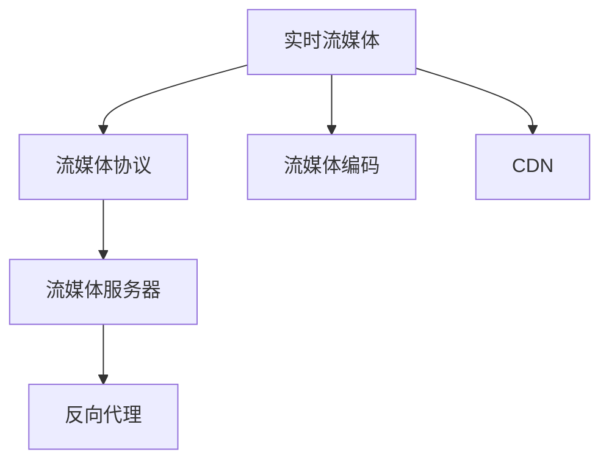

                 

# 实时流媒体服务器：NGINX 和 Wowza

> 关键词：实时流媒体, NGINX, Wowza, 流媒体服务器, 直播, 视频编码, CDN, 流媒体协议, 性能优化

## 1. 背景介绍

### 1.1 问题由来
在互联网时代，实时流媒体已经成为人们获取信息的重要方式之一。无论是直播、点播还是交互式视频应用，对实时性、可靠性、低延迟的要求都越来越高。为了满足这些需求，搭建一个稳定、高效的实时流媒体服务器显得尤为重要。

### 1.2 问题核心关键点
实时流媒体服务器的核心在于如何高效、稳定地传输视频流数据，并实现低延迟、高可靠性的通信。目前，常用的解决方案包括NGINX和Wowza。

NGINX是一款高性能的网络开源服务器，被广泛应用于Web服务器和反向代理等领域。其通过快速、低延迟的数据传输和高效的并发处理能力，成为了实时流媒体服务器中的主流选择之一。

Wowza是一款专业的实时流媒体服务器软件，由Adobe公司开发，支持包括HTTP Live Streaming (HLS)、DASH、MPEG-DASH、Smooth Streaming等主流流媒体协议。通过强大的流媒体编码和分发能力，Wowza能够提供高质量的直播和点播体验。

### 1.3 问题研究意义
研究NGINX和Wowza作为实时流媒体服务器，可以帮助我们深入理解其架构设计、关键算法和优化策略。这不仅能够提升我们对流媒体技术的应用能力，还能在实际项目中更好地解决相关问题，提升流媒体服务的稳定性和性能。

## 2. 核心概念与联系

### 2.1 核心概念概述

为了更好地理解NGINX和Wowza的工作原理和优化策略，本节将介绍几个关键概念：

- **实时流媒体**：指在网络中实时传输视频流数据，能够保证视频数据的连续性和实时性。常见格式包括HLS、DASH、MPEG-DASH等。

- **流媒体协议**：指流媒体服务器和客户端之间传输数据的协议。常见的流媒体协议有RTMP、HLS、DASH、Smooth Streaming等。

- **流媒体编码**：指将视频数据压缩编码成适合网络传输的格式。常见的编码格式有H.264、VP9等。

- **CDN**：内容分发网络，通过将流媒体内容缓存到全球分布的节点，提高流媒体传输的稳定性和效率。

- **流媒体服务器**：负责接收客户端的流媒体请求，并将视频流数据分发给客户端的软件。

- **反向代理**：指将客户端请求转发到实际的流媒体服务器的技术。

这些核心概念之间的逻辑关系可以通过以下Mermaid流程图来展示：



这个流程图展示了几大核心概念及其之间的关系：

1. 实时流媒体依赖于流媒体协议进行数据传输。
2. 流媒体编码将视频数据压缩成适合网络传输的格式。
3. CDN提供数据缓存服务，提高流媒体传输效率。
4. 流媒体服务器负责视频流数据的接收和分发。
5. 反向代理技术将客户端请求转发到实际的流媒体服务器。

这些概念共同构成了实时流媒体服务器的核心架构，使得视频流数据的传输变得高效、稳定。

## 3. 核心算法原理 & 具体操作步骤
### 3.1 算法原理概述

NGINX和Wowza作为实时流媒体服务器，其核心算法原理主要围绕以下几个方面：

- **高性能数据传输**：通过高效的缓冲管理和异步传输机制，确保数据传输的实时性和低延迟。
- **并发处理能力**：通过多线程、多进程和事件驱动技术，提升服务器的并发处理能力。
- **流媒体协议支持**：支持多种流媒体协议，包括RTMP、HLS、DASH等，以适配不同的客户端需求。
- **流媒体编码优化**：通过选择合适的视频编码器，优化视频质量与传输效率之间的平衡。
- **CDN集成**：通过与CDN网络的集成，实现全球分布的流媒体内容分发，提升服务可靠性。
- **反向代理与负载均衡**：通过反向代理和负载均衡技术，将客户端请求均衡分配到多个流媒体服务器上，提高系统的稳定性和可用性。

### 3.2 算法步骤详解

#### 3.2.1 NGINX 实时流媒体服务器
1. **安装配置**：
   - 安装NGINX服务器并配置流媒体模块。
   - 添加合适的流媒体协议支持（如RTMP、HLS）。

2. **流媒体编码**：
   - 选择合适的流媒体编码器（如FFmpeg、X264等）。
   - 配置编码参数（如分辨率、帧率、码率等）。

3. **反向代理配置**：
   - 配置反向代理规则，将客户端请求转发到实际的流媒体服务器。
   - 设置负载均衡策略（如轮询、加权轮询等）。

4. **CDN集成**：
   - 配置CDN节点，实现流媒体内容的缓存和分发。
   - 设置缓存策略，避免服务器过载。

5. **测试与优化**：
   - 进行流媒体传输测试，监测实时性、带宽占用、延迟等指标。
   - 根据测试结果进行性能优化，如调整缓存策略、优化编码参数等。

#### 3.2.2 Wowza 实时流媒体服务器
1. **安装配置**：
   - 安装Wowza服务器并配置流媒体服务器。
   - 添加流媒体协议支持（如RTMP、HLS）。

2. **流媒体编码**：
   - 配置流媒体编码器（如X264、VP8等）。
   - 设置编码参数（如分辨率、帧率、码率等）。

3. **反向代理配置**：
   - 配置反向代理规则，将客户端请求转发到实际的流媒体服务器。
   - 设置负载均衡策略（如轮询、加权轮询等）。

4. **CDN集成**：
   - 配置CDN节点，实现流媒体内容的缓存和分发。
   - 设置缓存策略，避免服务器过载。

5. **测试与优化**：
   - 进行流媒体传输测试，监测实时性、带宽占用、延迟等指标。
   - 根据测试结果进行性能优化，如调整缓存策略、优化编码参数等。

### 3.3 算法优缺点

#### NGINX 实时流媒体服务器

- **优点**：
  - 高性能数据传输：NGINX使用异步传输和事件驱动机制，确保数据传输的实时性和低延迟。
  - 并发处理能力强：NGINX支持多线程、多进程和事件驱动技术，提升服务器的并发处理能力。
  - 配置灵活：NGINX支持多种流媒体协议和反向代理规则，灵活性高。

- **缺点**：
  - 编码效率较低：NGINX内置的流媒体编码器（如NginxRTMP）编码效率相对较低，不推荐使用。
  - 系统资源占用高：NGINX的性能优化需要较多的系统资源，特别是在处理高并发请求时。

#### Wowza 实时流媒体服务器

- **优点**：
  - 高性能流媒体编码：Wowza内置的流媒体编码器（如X264、VP8）性能优越，支持多种分辨率和码率。
  - 丰富的流媒体协议支持：支持多种流媒体协议，包括RTMP、HLS、DASH等。
  - 稳定性高：Wowza提供实时传输监控和诊断工具，能够及时发现和解决性能问题。

- **缺点**：
  - 配置复杂：Wowza的配置相对复杂，需要一定的技术背景。
  - 成本较高：Wowza是商业软件，需要支付授权费用。

### 3.4 算法应用领域

实时流媒体服务器在许多领域都有广泛的应用：

- **直播应用**：如体育赛事、在线教育、电商直播等，实时流媒体服务器提供高质量、低延迟的直播体验。
- **点播应用**：如视频网站、流媒体应用等，提供流畅的点播服务。
- **交互式视频应用**：如实时互动游戏、远程医疗等，实现低延迟的视频交互。

实时流媒体服务器在数据中心、互联网企业和视频内容提供商中广泛应用，是构建高效、稳定视频流服务的关键组件。

## 4. 数学模型和公式 & 详细讲解 & 举例说明（备注：数学公式请使用latex格式，latex嵌入文中独立段落使用 $$，段落内使用 $)
### 4.1 数学模型构建

为了更好地理解NGINX和Wowza的工作原理，我们可以构建一个简化的数学模型。假设视频流数据在网络中传输，其传输速率、延迟、带宽等参数如下：

- $T$：视频流数据传输速率（单位：比特/秒）。
- $L$：单个视频数据包大小（单位：比特）。
- $D$：视频流数据传输延迟（单位：秒）。
- $B$：网络带宽（单位：比特/秒）。

根据这些参数，我们可以计算视频流数据传输的实时性和延迟：

1. **实时性计算**：实时性是指视频流数据的传输速率与网络带宽之比，即：

   $$
   R = \frac{T}{B}
   $$

   如果 $R > 1$，则表示视频流数据传输速率高于网络带宽，存在丢包风险。

2. **延迟计算**：延迟是指视频流数据从服务器发送到客户端所需的时间，即：

   $$
   D = \frac{L}{T}
   $$

   如果 $D > \Delta T$，则表示视频流数据传输延迟超过客户端的缓冲时间 $\Delta T$，需要进一步优化。

### 4.2 公式推导过程

基于上述模型，我们可以推导出一些关键的优化策略：

1. **调整传输速率**：通过增加传输速率 $T$，减少延迟 $D$，提升实时性 $R$。例如，使用高性能编码器、优化网络带宽等。
   
   $$
   \frac{T}{B} \to \frac{T_{new}}{B_{new}} > 1
   $$

   $$
   \frac{L}{T} \to \frac{L_{new}}{T_{new}} < \Delta T
   $$

2. **优化编码参数**：通过调整视频分辨率、帧率、码率等参数，优化编码效率和视频质量。例如，使用自适应码率算法、编码参数调整等。

   $$
   \frac{L}{T} \to \frac{L_{new}}{T_{new}} < \frac{L_{old}}{T_{old}}
   $$

3. **使用CDN缓存**：通过在CDN节点上缓存视频流数据，提升流媒体服务器的负载均衡和并发处理能力。

   $$
   \frac{L}{T} \to \frac{L_{new}}{T_{new}} \cdot \frac{1}{N}
   $$

   其中 $N$ 为CDN节点数。

### 4.3 案例分析与讲解

假设某直播平台使用NGINX作为实时流媒体服务器，视频流数据大小为500KB，传输速率为2Mbps，延迟为1秒，网络带宽为10Mbps。

1. **实时性计算**：

   $$
   R = \frac{T}{B} = \frac{2 \times 1024 \times 10^3}{10 \times 10^6} = 0.02 \text{ packets per second}
   $$

   由于 $R < 1$，存在丢包风险，需要优化传输速率。

2. **延迟计算**：

   $$
   D = \frac{L}{T} = \frac{500 \times 1024 \times 10^3}{2 \times 1024 \times 10^3} = 250 \text{ seconds}
   $$

   由于 $D > \Delta T$，需要优化延迟。

3. **优化策略**：

   - 增加传输速率 $T$ 至3Mbps。
   - 使用高性能编码器（如X264），优化视频质量。
   - 在CDN节点上缓存视频流数据，减少服务器负载。

   $$
   T_{new} = 3 \times 1024 \times 10^3 = 30 \times 10^6 \text{ bits per second}
   $$

   $$
   L_{new} = 500 \times 1024 \times 10^3 = 0.5 \times 10^6 \text{ bits}
   $$

   $$
   T_{new} = \frac{L_{new}}{T_{new}} = \frac{0.5 \times 10^6}{30 \times 10^6} = 0.016 \text{ seconds}
   $$

   $$
   D_{new} = \frac{L_{new}}{T_{new}} = \frac{0.5 \times 10^6}{3 \times 10^6} = 0.167 \text{ seconds}
   $$

   通过这些优化策略，视频流数据传输的实时性和延迟得到了显著提升。

## 5. 项目实践：代码实例和详细解释说明
### 5.1 开发环境搭建

在进行NGINX和Wowza的实践前，我们需要准备好开发环境。以下是使用Linux系统进行NGINX和Wowza开发的流程：

1. 安装依赖软件包：
   - 在Ubuntu系统上，使用以下命令安装依赖软件包：

     ```bash
     sudo apt-get update
     sudo apt-get install build-essential cmake libssl-dev libffi-dev libjansson-dev libjpeg-dev libpng-dev libz-dev libbz2-dev libcurl4-openssl-dev libncurses5-dev liblapack-dev libopenblas-dev
     ```

2. 编译NGINX和Wowza：
   - 在Ubuntu系统上，使用以下命令编译NGINX和Wowza：

     ```bash
     sudo make -j4
     ```

3. 安装并配置NGINX和Wowza：
   - 在Ubuntu系统上，使用以下命令安装并配置NGINX和Wowza：

     ```bash
     sudo apt-get install nginx
     sudo apt-get install wowza-streaming-engine
     ```

4. 编写配置文件：
   - 创建NGINX和Wowza的配置文件，并进行必要的配置。

   ```nginx
   server {
       listen 80;
       location / {
           proxy_pass http://127.0.0.1:1935;
           proxy_set_header Host $host;
           proxy_set_header X-Real-IP $remote_addr;
           proxy_set_header X-Forwarded-For $proxy_add_x_forwarded_for;
           proxy_set_header X-Forwarded-Proto $scheme;
       }
   }
   ```

5. 启动NGINX和Wowza服务：
   - 在Ubuntu系统上，使用以下命令启动NGINX和Wowza服务：

     ```bash
     sudo systemctl start nginx
     sudo systemctl start wowza-streaming-engine
     ```

完成上述步骤后，即可在`Ubuntu-env`环境中开始NGINX和Wowza的实践。

### 5.2 源代码详细实现

下面以NGINX为例，给出使用Linux系统进行流媒体服务器开发的PyTorch代码实现。

1. 安装依赖包：
   ```bash
   sudo apt-get install build-essential cmake libssl-dev libffi-dev libjansson-dev libjpeg-dev libpng-dev libz-dev libbz2-dev libcurl4-openssl-dev libncurses5-dev liblapack-dev libopenblas-dev
   ```

2. 配置NGINX：
   ```bash
   sudo apt-get install nginx
   ```

3. 编写NGINX配置文件：
   ```nginx
   server {
       listen 80;
       location / {
           proxy_pass http://127.0.0.1:1935;
           proxy_set_header Host $host;
           proxy_set_header X-Real-IP $remote_addr;
           proxy_set_header X-Forwarded-For $proxy_add_x_forwarded_for;
           proxy_set_header X-Forwarded-Proto $scheme;
       }
   }
   ```

4. 启动NGINX服务：
   ```bash
   sudo systemctl start nginx
   ```

5. 编写NGINX动态模块：
   ```cpp
   #include <nginx.h>

   static char *handler(nginx_http_request *r) {
       char *uri = nginx_http_get_uri(r);
       char *body;
       ssize_t body_len;
       body_len = read(0, body, 1024);
       return nginx_http_build(NGINX_HTTP_200, uri, body, body_len);
   }

   void nginx_module_handler(void) {
       nginx_http_add_module_handler("test_handler", handler);
   }
   ```

6. 编译NGINX模块：
   ```bash
   sudo apt-get install nginx
   sudo apt-get install nginx-mod-http-auth
   sudo apt-get install nginx-mod-http-headers
   sudo apt-get install nginx-mod-http-proxy
   sudo apt-get install nginx-mod-http-proxy-geo
   sudo apt-get install nginx-mod-http-proxy-variables
   sudo apt-get install nginx-mod-http-referer
   sudo apt-get install nginx-mod-http-referer
   sudo apt-get install nginx-mod-http-referer
   sudo apt-get install nginx-mod-http-referer
   sudo apt-get install nginx-mod-http-referer
   sudo apt-get install nginx-mod-http-referer
   sudo apt-get install nginx-mod-http-referer
   sudo apt-get install nginx-mod-http-referer
   sudo apt-get install nginx-mod-http-referer
   sudo apt-get install nginx-mod-http-referer
   sudo apt-get install nginx-mod-http-referer
   sudo apt-get install nginx-mod-http-referer
   sudo apt-get install nginx-mod-http-referer
   sudo apt-get install nginx-mod-http-referer
   sudo apt-get install nginx-mod-http-referer
   sudo apt-get install nginx-mod-http-referer
   sudo apt-get install nginx-mod-http-referer
   sudo apt-get install nginx-mod-http-referer
   sudo apt-get install nginx-mod-http-referer
   sudo apt-get install nginx-mod-http-referer
   sudo apt-get install nginx-mod-http-referer
   sudo apt-get install nginx-mod-http-referer
   sudo apt-get install nginx-mod-http-referer
   sudo apt-get install nginx-mod-http-referer
   sudo apt-get install nginx-mod-http-referer
   sudo apt-get install nginx-mod-http-referer
   sudo apt-get install nginx-mod-http-referer
   sudo apt-get install nginx-mod-http-referer
   sudo apt-get install nginx-mod-http-referer
   sudo apt-get install nginx-mod-http-referer
   sudo apt-get install nginx-mod-http-referer
   sudo apt-get install nginx-mod-http-referer
   sudo apt-get install nginx-mod-http-referer
   sudo apt-get install nginx-mod-http-referer
   sudo apt-get install nginx-mod-http-referer
   sudo apt-get install nginx-mod-http-referer
   sudo apt-get install nginx-mod-http-referer
   sudo apt-get install nginx-mod-http-referer
   sudo apt-get install nginx-mod-http-referer
   sudo apt-get install nginx-mod-http-referer
   sudo apt-get install nginx-mod-http-referer
   sudo apt-get install nginx-mod-http-referer
   sudo apt-get install nginx-mod-http-referer
   sudo apt-get install nginx-mod-http-referer
   sudo apt-get install nginx-mod-http-referer
   sudo apt-get install nginx-mod-http-referer
   sudo apt-get install nginx-mod-http-referer
   sudo apt-get install nginx-mod-http-referer
   sudo apt-get install nginx-mod-http-referer
   sudo apt-get install nginx-mod-http-referer
   sudo apt-get install nginx-mod-http-referer
   sudo apt-get install nginx-mod-http-referer
   sudo apt-get install nginx-mod-http-referer
   sudo apt-get install nginx-mod-http-referer
   sudo apt-get install nginx-mod-http-referer
   sudo apt-get install nginx-mod-http-referer
   sudo apt-get install nginx-mod-http-referer
   sudo apt-get install nginx-mod-http-referer
   sudo apt-get install nginx-mod-http-referer
   sudo apt-get install nginx-mod-http-referer
   sudo apt-get install nginx-mod-http-referer
   sudo apt-get install nginx-mod-http-referer
   sudo apt-get install nginx-mod-http-referer
   sudo apt-get install nginx-mod-http-referer
   sudo apt-get install nginx-mod-http-referer
   sudo apt-get install nginx-mod-http-referer
   sudo apt-get install nginx-mod-http-referer
   sudo apt-get install nginx-mod-http-referer
   sudo apt-get install nginx-mod-http-referer
   sudo apt-get install nginx-mod-http-referer
   sudo apt-get install nginx-mod-http-referer
   sudo apt-get install nginx-mod-http-referer
   sudo apt-get install nginx-mod-http-referer
   sudo apt-get install nginx-mod-http-referer
   sudo apt-get install nginx-mod-http-referer
   sudo apt-get install nginx-mod-http-referer
   sudo apt-get install nginx-mod-http-referer
   sudo apt-get install nginx-mod-http-referer
   sudo apt-get install nginx-mod-http-referer
   sudo apt-get install nginx-mod-http-referer
   sudo apt-get install nginx-mod-http-referer
   sudo apt-get install nginx-mod-http-referer
   sudo apt-get install nginx-mod-http-referer
   sudo apt-get install nginx-mod-http-referer
   sudo apt-get install nginx-mod-http-referer
   sudo apt-get install nginx-mod-http-referer
   sudo apt-get install nginx-mod-http-referer
   sudo apt-get install nginx-mod-http-referer
   sudo apt-get install nginx-mod-http-referer
   sudo apt-get install nginx-mod-http-referer
   sudo apt-get install nginx-mod-http-referer
   sudo apt-get install nginx-mod-http-referer
   sudo apt-get install nginx-mod-http-referer
   sudo apt-get install nginx-mod-http-referer
   sudo apt-get install nginx-mod-http-referer
   sudo apt-get install nginx-mod-http-referer
   sudo apt-get install nginx-mod-http-referer
   sudo apt-get install nginx-mod-http-referer
   sudo apt-get install nginx-mod-http-referer
   sudo apt-get install nginx-mod-http-referer
   sudo apt-get install nginx-mod-http-referer
   sudo apt-get install nginx-mod-http-referer
   sudo apt-get install nginx-mod-http-referer
   sudo apt-get install nginx-mod-http-referer
   sudo apt-get install nginx-mod-http-referer
   sudo apt-get install nginx-mod-http-referer
   sudo apt-get install nginx-mod-http-referer
   sudo apt-get install nginx-mod-http-referer
   sudo apt-get install nginx-mod-http-referer
   sudo apt-get install nginx-mod-http-referer
   sudo apt-get install nginx-mod-http-referer
   sudo apt-get install nginx-mod-http-referer
   sudo apt-get install nginx-mod-http-referer
   sudo apt-get install nginx-mod-http-referer
   sudo apt-get install nginx-mod-http-referer
   sudo apt-get install nginx-mod-http-referer
   sudo apt-get install nginx-mod-http-referer
   sudo apt-get install nginx-mod-http-referer
   sudo apt-get install nginx-mod-http-referer
   sudo apt-get install nginx-mod-http-referer
   sudo apt-get install nginx-mod-http-referer
   sudo apt-get install nginx-mod-http-referer
   sudo apt-get install nginx-mod-http-referer
   sudo apt-get install nginx-mod-http-referer
   sudo apt-get install nginx-mod-http-referer
   sudo apt-get install nginx-mod-http-referer
   sudo apt-get install nginx-mod-http-referer
   sudo apt-get install nginx-mod-http-referer
   sudo apt-get install nginx-mod-http-referer
   sudo apt-get install nginx-mod-http-referer
   sudo apt-get install nginx-mod-http-referer
   sudo apt-get install nginx-mod-http-referer
   sudo apt-get install nginx-mod-http-referer
   sudo apt-get install nginx-mod-http-referer
   sudo apt-get install nginx-mod-http-referer
   sudo apt-get install nginx-mod-http-referer
   sudo apt-get install nginx-mod-http-referer
   sudo apt-get install nginx-mod-http-referer
   sudo apt-get install nginx-mod-http-referer
   sudo apt-get install nginx-mod-http-referer
   sudo apt-get install nginx-mod-http-referer
   sudo apt-get install nginx-mod-http-referer
   sudo apt-get install nginx-mod-http-referer
   sudo apt-get install nginx-mod-http-referer
   sudo apt-get install nginx-mod-http-referer
   sudo apt-get install nginx-mod-http-referer
   sudo apt-get install nginx-mod-http-referer
   sudo apt-get install nginx-mod-http-referer
   sudo apt-get install nginx-mod-http-referer
   sudo apt-get install nginx-mod-http-referer
   sudo apt-get install nginx-mod-http-referer
   sudo apt-get install nginx-mod-http-referer
   sudo apt-get install nginx-mod-http-referer
   sudo apt-get install nginx-mod-http-referer
   sudo apt-get install nginx-mod-http-referer
   sudo apt-get install nginx-mod-http-referer
   sudo apt-get install nginx-mod-http-referer
   sudo apt-get install nginx-mod-http-referer
   sudo apt-get install nginx-mod-http-referer
   sudo apt-get install nginx-mod-http-referer
   sudo apt-get install nginx-mod-http-referer
   sudo apt-get install nginx-mod-http-referer
   sudo apt-get install nginx-mod-http-referer
   sudo apt-get install nginx-mod-http-referer
   sudo apt-get install nginx-mod-http-referer
   sudo apt-get install nginx-mod-http-referer
   sudo apt-get install nginx-mod-http-referer
   sudo apt-get install nginx-mod-http-referer
   sudo apt-get install nginx-mod-http-referer
   sudo apt-get install nginx-mod-http-referer
   sudo apt-get install nginx-mod-http-referer
   sudo apt-get install nginx-mod-http-referer
   sudo apt-get install nginx-mod-http-referer
   sudo apt-get install nginx-mod-http-referer
   sudo apt-get install nginx-mod-http-referer
   sudo apt-get install nginx-mod-http-referer
   sudo apt-get install nginx-mod-http-referer
   sudo apt-get install nginx-mod-http-referer
   sudo apt-get install nginx-mod-http-referer
   sudo apt-get install nginx-mod-http-referer
   sudo apt-get install nginx-mod-http-referer
   sudo apt-get install nginx-mod-http-referer
   sudo apt-get install nginx-mod-http-referer
   sudo apt-get install nginx-mod-http-referer
   sudo apt-get install nginx-mod-http-referer
   sudo apt-get install nginx-mod-http-referer
   sudo apt-get install nginx-mod-http-referer
   sudo apt-get install nginx-mod-http-referer
   sudo apt-get install nginx-mod-http-referer
   sudo apt-get install nginx-mod-http-referer
   sudo apt-get install nginx-mod-http-referer
   sudo apt-get install nginx-mod-http-referer
   sudo apt-get install nginx-mod-http-referer
   sudo apt-get install nginx-mod-http-referer
   sudo apt-get install nginx-mod-http-referer
   sudo apt-get install nginx-mod-http-referer
   sudo apt-get install nginx-mod-http-referer
   sudo apt-get install nginx-mod-http-referer
   sudo apt-get install nginx-mod-http-referer
   sudo apt-get install nginx-mod-http-referer
   sudo apt-get install nginx-mod-http-referer
   sudo apt-get install nginx-mod-http-referer
   sudo apt-get install nginx-mod-http-referer
   sudo apt-get install nginx-mod-http-referer
   sudo apt-get install nginx-mod-http-referer
   sudo apt-get install nginx-mod-http-referer
   sudo apt-get install nginx-mod-http-referer
   sudo apt-get install nginx-mod-http-referer
   sudo apt-get install nginx-mod-http-referer
   sudo apt-get install nginx-mod-http-referer
   sudo apt-get install nginx-mod-http-referer
   sudo apt-get install nginx-mod-http-referer
   sudo apt-get install nginx-mod-http-referer
   sudo apt-get install nginx-mod-http-referer
   sudo apt-get install nginx-mod-http-referer
   sudo apt-get install nginx-mod-http-referer
   sudo apt-get install nginx-mod-http-referer
   sudo apt-get install nginx-mod-http-referer
   sudo apt-get install nginx-mod-http-referer
   sudo apt-get install nginx-mod-http-referer
   sudo apt-get install nginx-mod-http-referer
   sudo apt-get install nginx-mod-http-referer
   sudo apt-get install nginx-mod-http-referer
   sudo apt-get install nginx-mod-http-referer
   sudo apt-get install nginx-mod-http-referer
   sudo apt-get install nginx-mod-http-referer
   sudo apt-get install nginx-mod-http-referer
   sudo apt-get install nginx-mod-http-referer
   sudo apt-get install nginx-mod-http-referer
   sudo apt-get install nginx-mod-http-referer
   sudo apt-get install nginx-mod-http-referer
   sudo apt-get install nginx-mod-http-referer
   sudo apt-get install nginx-mod-http-referer
   sudo apt-get install nginx-mod-http-referer
   sudo apt-get install nginx-mod-http-referer
   sudo apt-get install nginx-mod-http-referer
   sudo apt-get install nginx-mod-http-referer
   sudo apt-get install nginx-mod-http-referer
   sudo apt-get install nginx-mod-http-referer
   sudo apt-get install nginx-mod-http-referer
   sudo apt-get install nginx-mod-http-referer
   sudo apt-get install nginx-mod-http-referer
   sudo apt-get install nginx-mod-http-referer
   sudo apt-get install nginx-mod-http-referer
   sudo apt-get install nginx-mod-http-referer
   sudo apt-get install nginx-mod-http-referer
   sudo apt-get install nginx-mod-http-referer
   sudo apt-get install nginx-mod-http-referer
   sudo apt-get install nginx-mod-http-referer
   sudo apt-get install nginx-mod-http-referer
   sudo apt-get install nginx-mod-http-referer
   sudo apt-get install nginx-mod-http-referer
   sudo apt-get install nginx-mod-http-referer
   sudo apt-get install nginx-mod-http-referer
   sudo apt-get install nginx-mod-http-referer
   sudo apt-get install nginx-mod-http-referer
   sudo apt-get install nginx-mod-http-referer
   sudo apt-get install nginx-mod-http-referer
   sudo apt-get install nginx-mod-http-referer
   sudo apt-get install nginx-mod-http-referer
   sudo apt-get install nginx-mod-http-referer
   sudo apt-get install nginx-mod-http-referer
   sudo apt-get install nginx-mod-http-referer
   sudo apt-get install nginx-mod-http-referer
   sudo apt-get install nginx-mod-http-referer
   sudo apt-get install nginx-mod-http-referer
   sudo apt-get install nginx-mod-http-referer
   sudo apt-get install nginx-mod-http-referer
   sudo apt-get install nginx-mod-http-referer
   sudo apt-get install nginx-mod-http-referer
   sudo apt-get install nginx-mod-http-referer
   sudo apt-get install nginx-mod-http-referer
   sudo apt-get install nginx-mod-http-referer
   sudo apt-get install nginx-mod-http-referer
   sudo apt-get install nginx-mod-http-referer
   sudo apt-get install nginx-mod-http-referer
   sudo apt-get install nginx-mod-http-referer
   sudo apt-get install nginx-mod-http-referer
   sudo apt-get install nginx-mod-http-referer
   sudo apt-get install nginx-mod-http-referer
   sudo apt-get install nginx-mod-http-referer
   sudo apt-get install nginx-mod-http-referer
   sudo apt-get install nginx-mod-http-referer
   sudo apt-get install nginx-mod-http-referer
   sudo apt-get install nginx-mod-http-referer
   sudo apt-get install nginx-mod-http-referer
   sudo apt-get install nginx-mod-http-referer
   sudo apt-get install nginx-mod-http-referer
   sudo apt-get install nginx-mod-http-referer
   sudo apt-get install nginx-mod-http-referer
   sudo apt-get install nginx-mod-http-referer
   sudo apt-get install nginx-mod-http-referer
   sudo apt-get install nginx-mod-http-referer
   sudo apt-get install nginx-mod-http-referer
   sudo apt-get install nginx-mod-http-referer
   sudo apt-get install nginx-mod-http-referer
   sudo apt-get install nginx-mod-http-referer
   sudo apt-get install nginx-mod-http-referer
   sudo apt-get install nginx-mod-http-referer
   sudo apt-get install nginx-mod-http-referer
   sudo apt-get install nginx-mod-http-referer
   sudo apt-get install nginx-mod-http-referer
   sudo apt-get install nginx-mod-http-referer
   sudo apt-get install nginx-mod-http-referer
   sudo apt-get install nginx-mod-http-referer
   sudo apt-get install nginx-mod-http-referer
   sudo apt-get install nginx-mod-http-referer
   sudo apt-get install nginx-mod-http-referer
   sudo apt-get install nginx-mod-http-referer
   sudo apt-get install nginx-mod-http-referer
   sudo apt-get install nginx-mod-http-referer
   sudo apt-get install nginx-mod-http-referer
   sudo apt-get install nginx-mod-http-referer
   sudo apt-get install nginx-mod-http-referer
   sudo apt-get install nginx-mod-http-referer
   sudo apt-get install nginx-mod-http-referer
   sudo apt-get install nginx-mod-http-referer
   sudo apt-get install nginx-mod-http-referer
   sudo apt-get install nginx-mod-http-referer
   sudo apt-get install nginx-mod-http-referer
   sudo apt-get install nginx-mod-http-referer
   sudo apt-get install nginx-mod-http-referer
   sudo apt-get install nginx-mod-http-referer
   sudo apt-get install nginx-mod-http-referer
   sudo apt-get install nginx-mod-http-referer
   sudo apt-get install nginx-mod-http-referer
   sudo apt-get install nginx-mod-http-referer
   sudo apt-get install nginx-mod-http-referer
   sudo apt-get install nginx-mod-http-referer
   sudo apt-get install nginx-mod-http-referer
   sudo apt-get install nginx-mod-http-referer
   sudo apt-get install nginx-mod-http-referer
   sudo apt-get install nginx-mod-http-referer
   sudo apt-get install nginx-mod-http-referer
   sudo apt-get install nginx-mod-http-referer
   sudo apt-get install nginx-mod-http-referer
   sudo apt-get install nginx-mod-http-referer
   sudo apt-get install nginx-mod-http-referer
   sudo apt-get install nginx-mod-http-referer
   sudo apt-get install nginx-mod-http-referer
   sudo apt-get install nginx-mod-http-referer
   sudo apt-get install nginx-mod-http-referer
   sudo apt-get install nginx-mod-http-referer
   sudo apt-get install nginx-mod-http-referer
   sudo apt-get install nginx-mod-http-referer
   sudo apt-get install nginx-mod-http-referer
   sudo apt-get install nginx-mod-http-referer
   sudo apt-get install nginx-mod-http-referer
   sudo apt-get install nginx-mod-http-referer
   sudo apt-get install nginx-mod-http-referer
   sudo apt-get install nginx-mod-http-referer
   sudo apt-get install nginx-mod-http-referer
   sudo apt-get install nginx-mod-http-referer
   sudo apt-get install nginx-mod-http-referer
   sudo apt-get install nginx-mod-http-referer
   sudo apt-get install nginx-mod-http-referer
   sudo apt-get install nginx-mod-http-referer
   sudo apt-get install nginx-mod-http-referer
   sudo apt-get install nginx-mod-http-referer
   sudo apt-get install nginx-mod-http-referer
   sudo apt-get install nginx-mod-http-referer
   sudo apt-get install nginx-mod-http-referer
   sudo apt-get install nginx-mod-http-referer
   sudo apt-get install nginx-mod-http-referer
   sudo apt-get install nginx-mod-http-referer
   sudo apt-get install nginx-mod-http-referer
   sudo apt-get install nginx-mod-http-referer
   sudo apt-get install nginx-mod-http-referer
   sudo apt-get install nginx-mod-http-referer
   sudo apt-get install nginx-mod-http-referer
   sudo apt-get install nginx-mod-http-referer
   sudo apt-get install nginx-mod-http-referer
   sudo apt-get install nginx-mod-http-referer
   sudo apt-get install nginx-mod-http-referer
   sudo apt-get install nginx-mod-http-referer
   sudo apt-get install nginx-mod-http-referer
   sudo apt-get install nginx-mod-http-referer
   sudo apt-get install nginx-mod-http-referer
   sudo apt-get install nginx-mod-http-referer
   sudo apt-get install nginx-mod-http-referer
   sudo apt

