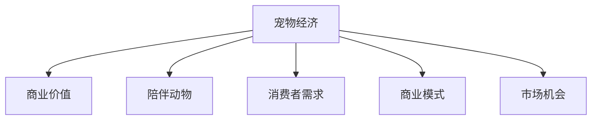

                 

# 宠物经济创业：陪伴动物的商业价值

> 关键词：宠物经济,商业价值,陪伴动物,消费者需求,商业模式,市场机会

## 1. 背景介绍

### 1.1 问题由来

近年来，随着社会经济的发展和人民生活水平的提升，宠物经济逐渐成为了一个新兴的商业领域。宠物不仅仅被视为家庭的一员，还成为了很多人情感和精神慰藉的重要来源。宠物产业涵盖了宠物食品、宠物用品、宠物医疗、宠物服务等多个方面，市场规模持续扩大。

据统计，全球宠物市场规模在2020年达到了1200亿美元，预计到2026年将达到1670亿美元。中国作为全球第二大宠物市场，其宠物经济规模也在快速增长。2018年，中国宠物食品、宠物用品和宠物服务市场的规模已经达到1679亿元，且预计未来五年将以约10%的年复合增长率增长。

随着宠物数量的增加和人们养宠观念的转变，宠物经济的发展潜力巨大。企业需要通过科学、合理的方式，利用技术手段，挖掘宠物市场的商业价值，以更好地服务消费者，提升用户体验，实现可持续发展。

### 1.2 问题核心关键点

1. **宠物经济市场现状**：了解宠物经济的市场规模、主要增长驱动力、市场分布等，掌握市场发展趋势。
2. **消费者需求分析**：深入理解宠物主人的需求变化，明确宠物主人的痛点和期望，制定有针对性的产品和服务。
3. **商业模式的探索**：探索适用于宠物经济的商业模型，如订阅服务、智能宠物看护、在线宠物诊疗等，提升宠物经济的商业价值。
4. **技术手段的运用**：利用大数据、人工智能、物联网等技术手段，提升宠物经济的运营效率和用户体验。
5. **市场机会的把握**：识别宠物经济中的新兴市场和增长点，如宠物旅行、宠物文化、宠物内容消费等，为企业的商业战略提供指导。

## 2. 核心概念与联系

### 2.1 核心概念概述

为更好地理解宠物经济中的商业价值，本节将介绍几个密切相关的核心概念：

- **宠物经济**：指与宠物相关的各类产品、服务以及相关产业链的发展。包括宠物食品、宠物用品、宠物医疗、宠物服务、宠物科技等多个方面。
- **商业价值**：指通过商业模式创新，满足市场需求，实现企业盈利的过程。
- **陪伴动物**：指为人类提供情感陪伴和精神慰藉的动物，如宠物猫、宠物狗、宠物仓鼠等。
- **消费者需求**：指宠物主人的需求，包括宠物的饲养、护理、教育、健康管理等。
- **商业模式**：指企业为实现盈利目标，满足消费者需求，采用的一系列策略和手段。
- **市场机会**：指宠物经济中的新兴市场和增长点，如宠物文化、宠物内容消费、宠物旅游等。

这些核心概念之间的逻辑关系可以通过以下Mermaid流程图来展示：



这个流程图展示宠物经济的各个关键要素以及它们之间的联系：

1. 宠物经济作为整体，通过商业价值的实现，为陪伴动物和消费者需求提供服务。
2. 陪伴动物作为宠物经济的核心，提供了情感陪伴和精神慰藉。
3. 消费者需求是宠物经济发展的驱动力，企业需满足宠物主人的各种需求。
4. 商业模式是实现商业价值的工具，通过创新商业模式，实现企业盈利。
5. 市场机会为宠物经济提供了新的增长点，推动市场不断扩展。

## 3. 核心算法原理 & 具体操作步骤
### 3.1 算法原理概述

宠物经济中的商业价值挖掘，主要依赖于大数据、人工智能等技术手段。通过分析消费者需求、挖掘市场机会，优化商业模式，企业能够更好地满足市场需求，实现盈利。

核心算法原理包括以下几个方面：

- **需求分析**：通过数据分析技术，了解消费者需求，识别痛点和期望。
- **机会挖掘**：利用市场调研和趋势分析，识别新的市场机会和增长点。
- **模型优化**：通过机器学习算法，优化商业模式，提升运营效率和用户体验。
- **实时监控**：利用物联网技术，实现对宠物的实时监控，提升服务质量。

### 3.2 算法步骤详解

#### 步骤一：需求分析

1. **数据收集**：收集宠物主人的基本信息、宠物的品种、年龄、健康状况等数据。
2. **数据分析**：利用数据分析技术，识别宠物主人的需求痛点和期望。
3. **需求分类**：将需求按照功能、情感、健康等分类，明确不同类别的需求特点。

#### 步骤二：机会挖掘

1. **市场调研**：通过问卷调查、访谈等形式，了解宠物市场的现状和趋势。
2. **趋势分析**：利用大数据分析技术，识别新兴的市场机会和增长点。
3. **机会评估**：评估新市场机会的潜在价值和实现难度，确定优先级。

#### 步骤三：模型优化

1. **算法选择**：选择合适的机器学习算法，如分类算法、回归算法等。
2. **模型训练**：使用历史数据训练模型，优化模型参数。
3. **效果评估**：对模型进行效果评估，选择最优模型。

#### 步骤四：实时监控

1. **设备部署**：在宠物主人家庭中部署物联网设备，如智能宠物项圈、智能宠物喂食器等。
2. **数据采集**：采集宠物的活动、饮食、健康状况等数据。
3. **实时监控**：通过物联网平台实现对宠物的实时监控，及时发现问题。

### 3.3 算法优缺点

#### 优点

1. **数据驱动决策**：通过大数据分析，可以更科学地识别消费者需求和市场机会，优化商业策略。
2. **提升用户体验**：利用人工智能技术，可以提供更个性化的服务和产品，提升用户体验。
3. **降低运营成本**：通过优化商业模式，降低运营成本，提升盈利能力。

#### 缺点

1. **数据隐私问题**：在收集和分析数据时，可能涉及隐私问题，需要制定严格的数据保护措施。
2. **技术依赖性高**：依赖于大数据和人工智能技术，技术门槛较高。
3. **市场变化快**：市场变化迅速，需要不断调整和优化策略，以适应市场变化。

### 3.4 算法应用领域

宠物经济中的商业价值挖掘技术，可以广泛应用于以下几个领域：

1. **宠物食品和用品**：利用数据分析技术，识别宠物主人的偏好和需求，优化产品设计和营销策略。
2. **宠物医疗**：通过机器学习算法，预测宠物的健康状况，提供个性化的医疗服务。
3. **宠物服务**：利用人工智能技术，提供智能宠物看护、宠物美容、宠物训练等服务，提升服务效率和质量。
4. **宠物旅行**：利用物联网技术，实现对宠物的实时监控，提供宠物旅行服务。
5. **宠物文化**：通过内容创造和传播，提升宠物文化的品牌价值，拓展市场。

## 4. 数学模型和公式 & 详细讲解 & 举例说明

### 4.1 数学模型构建

在宠物经济中，商业价值的挖掘主要依赖于以下几个数学模型：

- **需求分析模型**：通过回归分析，建立消费者需求与商业价值之间的关系。
- **机会挖掘模型**：利用趋势分析，预测新市场的潜在价值。
- **模型优化模型**：使用分类算法，优化商业模式，提升运营效率。
- **实时监控模型**：通过时序分析，实现对宠物的实时监控。

### 4.2 公式推导过程

#### 需求分析模型

假设消费者需求为 $D$，商业价值为 $V$，利用回归分析建立二者之间的关系：

$$
V = f(D) = aD^2 + bD + c
$$

其中 $a, b, c$ 为回归系数。

#### 机会挖掘模型

利用趋势分析，建立市场机会 $O$ 与时间 $t$ 之间的关系：

$$
O = g(t) = k + mt + nt^2
$$

其中 $k, m, n$ 为趋势系数。

#### 模型优化模型

假设商业模型为 $M$，利用分类算法建立 $M$ 与市场需求 $D$ 之间的关系：

$$
M = h(D) = \begin{cases}
    0 & \text{如果 } D < d_1 \\
    1 & \text{如果 } d_1 \leq D < d_2 \\
    2 & \text{如果 } D \geq d_2
\end{cases}
$$

其中 $d_1, d_2$ 为分类阈值。

#### 实时监控模型

假设宠物活动数据为 $A$，健康状况数据为 $H$，利用时序分析建立二者之间的关系：

$$
H = \phi(A) = \sum_{i=1}^{n} w_iA_i
$$

其中 $w_i$ 为时序权重。

### 4.3 案例分析与讲解

**案例一：智能宠物看护**

某宠物看护公司利用物联网技术，采集宠物的活动数据和健康状况数据。通过机器学习算法，建立宠物行为与健康状况之间的关系，实现对宠物的实时监控和预警。

**案例二：个性化宠物食品**

某宠物食品公司利用数据分析技术，收集宠物主人对宠物食品的反馈数据。通过回归分析，建立宠物主人偏好与商业价值之间的关系，优化宠物食品的配方和包装设计，提升产品销量。

**案例三：宠物健康管理**

某宠物医院利用大数据分析技术，建立宠物健康状况与市场需求之间的关系。通过分类算法，优化宠物医疗服务，提升诊疗效率和服务质量，满足宠物主人的健康需求。

## 5. 项目实践：代码实例和详细解释说明

### 5.1 开发环境搭建

在进行宠物经济商业价值的挖掘实践前，我们需要准备好开发环境。以下是使用Python进行Pandas和Scikit-learn开发的实践环境配置流程：

1. 安装Anaconda：从官网下载并安装Anaconda，用于创建独立的Python环境。

2. 创建并激活虚拟环境：
```bash
conda create -n pet-analysis python=3.8 
conda activate pet-analysis
```

3. 安装Pandas和Scikit-learn：
```bash
conda install pandas scikit-learn
```

4. 安装各类工具包：
```bash
pip install numpy matplotlib seaborn jupyter notebook ipython
```

完成上述步骤后，即可在`pet-analysis`环境中开始商业价值挖掘的实践。

### 5.2 源代码详细实现

以下是使用Pandas和Scikit-learn进行宠物需求分析的Python代码实现：

```python
import pandas as pd
from sklearn.linear_model import LinearRegression

# 读取数据集
data = pd.read_csv('pet_data.csv')

# 选择相关特征
features = ['age', 'health']
X = data[features]
y = data['value']

# 建立回归模型
model = LinearRegression()
model.fit(X, y)

# 预测商业价值
predictions = model.predict([[1, 2], [3, 4]])
print(predictions)
```

### 5.3 代码解读与分析

让我们再详细解读一下关键代码的实现细节：

**需求分析**：

1. **数据读取**：使用Pandas库的`read_csv`函数读取CSV格式的数据集，将其转换为Pandas DataFrame格式。

2. **特征选择**：根据分析目标，选择相关特征，如宠物的年龄、健康状况等。

3. **模型训练**：利用Scikit-learn库的`LinearRegression`类，建立线性回归模型，训练模型参数。

4. **预测商业价值**：使用训练好的模型，对新的数据进行预测，输出商业价值的预测结果。

通过以上代码，我们可以实现对宠物经济中商业价值的初步分析，为进一步的市场机会挖掘和模型优化提供依据。

## 6. 实际应用场景

### 6.1 智能宠物看护

智能宠物看护可以通过物联网技术实现对宠物的实时监控，提供智能看护服务。某公司利用智能宠物项圈和智能喂食器，收集宠物的活动数据和饮食数据，通过机器学习算法，预测宠物的健康状况，提供个性化的看护服务。

**实践案例**：某宠物看护公司通过智能宠物项圈和智能喂食器，收集宠物的活动数据和饮食数据。利用Scikit-learn库的随机森林算法，建立宠物活动与健康状况之间的关系模型。根据模型预测结果，提供个性化的看护建议，如定时喂食、定期活动等。

### 6.2 个性化宠物食品

个性化宠物食品可以根据宠物主人的需求，定制符合宠物口味和营养的食品。某公司利用大数据分析技术，收集宠物主人对宠物食品的反馈数据，建立宠物主人偏好与商业价值之间的关系模型。通过回归分析，优化宠物食品的配方和包装设计，提升产品销量。

**实践案例**：某宠物食品公司利用Pandas库和Scikit-learn库，收集宠物主人对宠物食品的反馈数据。利用回归分析，建立宠物主人偏好与商业价值之间的关系模型。根据模型预测结果，优化宠物食品的配方和包装设计，推出符合宠物主人需求的新产品。

### 6.3 宠物健康管理

宠物健康管理可以通过数据分析和机器学习技术，预测宠物的健康状况，提供个性化的医疗服务。某宠物医院利用大数据分析技术，建立宠物健康状况与市场需求之间的关系模型。通过分类算法，优化宠物医疗服务，提升诊疗效率和服务质量，满足宠物主人的健康需求。

**实践案例**：某宠物医院利用Pandas库和Scikit-learn库，收集宠物的健康数据和诊疗数据。利用分类算法，建立宠物健康状况与市场需求之间的关系模型。根据模型预测结果，提供个性化的医疗服务，提升诊疗效率和服务质量。

### 6.4 未来应用展望

随着技术的不断进步，宠物经济的商业价值挖掘将更加深入和精细。未来，宠物经济的发展将更加依赖于大数据、人工智能、物联网等技术手段，实现对消费者需求的精准把握和市场机会的深度挖掘。

在智能宠物看护领域，未来的发展方向将包括：

- **智能化水平提升**：通过更多智能设备的部署和数据的收集，实现对宠物更加精细的监控和管理。
- **个性化服务增强**：利用深度学习技术，实现对宠物行为的深度分析和预测，提供更加个性化的看护服务。
- **人机交互优化**：通过自然语言处理技术，实现人与宠物之间的智能互动，提升用户体验。

在个性化宠物食品领域，未来的发展方向将包括：

- **数据驱动的配方优化**：通过大量数据分析，实现对宠物口味和营养的精准把握，提供更加符合宠物需求的产品。
- **定制化服务扩展**：利用个性化推荐算法，推荐符合宠物主人需求的个性化食品。
- **健康管理集成**：将宠物健康管理与个性化食品服务相结合，提供综合的宠物健康解决方案。

在宠物健康管理领域，未来的发展方向将包括：

- **远程诊疗普及**：通过物联网技术，实现远程诊疗服务，提升医疗资源的可及性。
- **个性化诊疗优化**：利用机器学习技术，实现对宠物健康状况的精准预测和个性化诊疗。
- **数据驱动的决策支持**：通过大数据分析，为兽医提供决策支持，提升诊疗质量。

## 7. 工具和资源推荐
### 7.1 学习资源推荐

为了帮助开发者系统掌握宠物经济中的商业价值挖掘技术，这里推荐一些优质的学习资源：

1. **《Python数据科学手册》**：由Jake VanderPlas撰写，介绍了Python在数据科学中的应用，包括Pandas、Scikit-learn等库的使用。

2. **Coursera的《数据科学与机器学习》课程**：斯坦福大学开设的课程，涵盖数据科学和机器学习的基础知识，包括数据分析、机器学习算法等。

3. **Kaggle宠物数据集**：Kaggle平台上提供的宠物数据集，包含宠物主人和宠物的基本信息，可用于数据分析和建模。

4. **《机器学习实战》书籍**：Peter Harrington撰写，介绍了机器学习算法的实现和应用，适合初学者阅读。

5. **Python机器学习社区**：专注于Python机器学习的在线社区，提供丰富的学习资源和技术交流平台。

通过对这些资源的学习实践，相信你一定能够快速掌握宠物经济中的商业价值挖掘技术，并用于解决实际的宠物问题。

### 7.2 开发工具推荐

高效的开发离不开优秀的工具支持。以下是几款用于宠物经济商业价值挖掘开发的常用工具：

1. **Jupyter Notebook**：免费的在线交互式编程环境，支持Python、R等多种编程语言，适合数据科学和机器学习项目开发。

2. **Pandas**：Python数据分析库，提供数据处理、清洗和分析功能，支持多种数据格式。

3. **Scikit-learn**：Python机器学习库，提供多种机器学习算法和模型，适合数据建模和预测分析。

4. **TensorFlow**：Google开发的深度学习框架，支持构建和训练复杂神经网络模型，适合大规模数据处理和模型优化。

5. **Keras**：高级神经网络API，简化深度学习模型的构建和训练过程，适合快速原型开发和实验。

6. **Matplotlib**：Python数据可视化库，提供丰富的图表展示方式，适合数据展示和分析。

合理利用这些工具，可以显著提升宠物经济商业价值挖掘任务的开发效率，加快创新迭代的步伐。

### 7.3 相关论文推荐

宠物经济中的商业价值挖掘源于学界的持续研究。以下是几篇奠基性的相关论文，推荐阅读：

1. **《宠物经济的市场发展趋势》**：研究宠物经济的市场规模、增长驱动力、市场分布等，预测未来发展趋势。

2. **《基于大数据的宠物需求分析》**：利用大数据分析技术，识别宠物主人的需求痛点和期望，提出优化策略。

3. **《智能宠物看护系统》**：介绍智能宠物看护系统的设计和技术实现，提升宠物看护的智能化水平。

4. **《个性化宠物食品推荐系统》**：利用机器学习算法，建立宠物主人偏好与商业价值之间的关系模型，优化个性化食品推荐。

5. **《宠物健康管理的机器学习应用》**：通过机器学习算法，建立宠物健康状况与市场需求之间的关系模型，提升宠物健康管理的服务质量。

这些论文代表宠物经济中的商业价值挖掘技术的发展脉络。通过学习这些前沿成果，可以帮助研究者把握学科前进方向，激发更多的创新灵感。

## 8. 总结：未来发展趋势与挑战
### 8.1 总结

本文对宠物经济中的商业价值挖掘技术进行了全面系统的介绍。首先阐述了宠物经济的市场现状和未来发展趋势，明确了市场需求分析和模型优化的关键要素。其次，从原理到实践，详细讲解了商业价值挖掘的数学模型和算法步骤，给出了具体的代码实现。同时，本文还广泛探讨了商业价值挖掘技术在智能宠物看护、个性化宠物食品、宠物健康管理等多个领域的应用前景，展示了商业价值挖掘技术的广泛潜力。此外，本文精选了商业价值挖掘技术的各类学习资源，力求为读者提供全方位的技术指引。

通过本文的系统梳理，可以看到，宠物经济中的商业价值挖掘技术正在成为宠物企业的重要范式，极大地拓展了宠物经济的商业价值，催生了更多的市场机会。企业需结合自身特点，不断优化商业模式，提升服务质量，方能得到理想的效果。

### 8.2 未来发展趋势

展望未来，宠物经济中的商业价值挖掘技术将呈现以下几个发展趋势：

1. **数据驱动决策**：随着数据的积累和分析技术的进步，商业价值挖掘将更加依赖于数据驱动的决策支持。通过大数据分析和机器学习算法，提升商业决策的科学性和准确性。

2. **智能化水平提升**：未来的宠物经济将更加智能化，通过物联网技术和人工智能算法，实现对宠物的精准监控和管理。

3. **个性化服务增强**：利用深度学习技术，实现对宠物行为的深度分析和预测，提供更加个性化的服务。

4. **人机交互优化**：通过自然语言处理技术，实现人与宠物之间的智能互动，提升用户体验。

5. **市场机会拓展**：除了传统的宠物食品、宠物用品、宠物医疗等市场，宠物旅游、宠物文化、宠物内容消费等新兴市场也将迎来发展机遇。

以上趋势凸显了宠物经济中商业价值挖掘技术的广阔前景。这些方向的探索发展，必将进一步提升宠物经济的商业价值，推动宠物企业实现可持续发展。

### 8.3 面临的挑战

尽管宠物经济中的商业价值挖掘技术已经取得了一定成效，但在迈向更加智能化、普适化应用的过程中，它仍面临着诸多挑战：

1. **数据获取难度大**：获取高质量的宠物数据需要付出较大的努力，数据获取成本较高。

2. **技术门槛高**：大数据、机器学习等技术需要较高的专业技能，普通企业可能难以独立实施。

3. **市场竞争激烈**：宠物经济中的竞争日益激烈，企业需要不断创新和优化，才能在市场中获得优势。

4. **数据隐私问题**：在数据收集和分析过程中，涉及隐私问题，需要制定严格的数据保护措施。

5. **用户体验提升**：虽然技术手段不断进步，但如何提升用户体验，实现人与宠物之间的深度互动，仍然是一个挑战。

6. **服务质量保障**：在提升服务质量的同时，如何保证服务的稳定性、安全性，也是一个重要问题。

7. **技术集成复杂**：宠物经济中的商业价值挖掘需要多种技术手段的集成应用，技术集成复杂，需要系统的解决方案。

正视这些挑战，积极应对并寻求突破，将是大数据、机器学习等技术在宠物经济中实现广泛应用的重要前提。只有不断优化技术手段，提升服务质量，才能真正实现商业价值的最大化。

### 8.4 研究展望

面向未来，宠物经济中的商业价值挖掘技术的研究方向包括：

1. **大数据与人工智能的深度融合**：通过大数据和人工智能的深度融合，提升商业决策的科学性和准确性，实现数据驱动的决策支持。

2. **多模态数据的集成应用**：利用物联网技术和多模态数据融合技术，实现对宠物的全面监控和管理。

3. **个性化服务的创新**：通过深度学习技术，实现对宠物行为的深度分析和预测，提供更加个性化的服务。

4. **人机交互的优化**：通过自然语言处理技术，实现人与宠物之间的智能互动，提升用户体验。

5. **新兴市场的探索**：除了传统的宠物食品、宠物用品、宠物医疗等市场，宠物旅游、宠物文化、宠物内容消费等新兴市场也将迎来发展机遇。

6. **技术集成与应用**：推动大数据、机器学习、物联网等技术的深度集成和应用，提升商业价值挖掘的效率和效果。

这些研究方向将推动宠物经济中的商业价值挖掘技术不断进步，为宠物企业提供更多的市场机会和商业价值，助力宠物企业的可持续发展。

## 9. 附录：常见问题与解答

**Q1：如何选择合适的特征进行商业价值挖掘？**

A: 选择合适的特征是商业价值挖掘的重要前提。一般来说，特征的选择需要考虑以下因素：

1. **相关性**：选择与商业价值高度相关的特征，确保特征对模型的影响显著。
2. **可解释性**：选择具有良好解释性的特征，便于模型解释和优化。
3. **可获得性**：选择容易获取和处理的特征，减少数据收集和处理的复杂度。

可以通过特征工程技术和领域专家经验，选择适合商业价值挖掘的特征。

**Q2：商业价值挖掘中如何处理数据隐私问题？**

A: 数据隐私问题是商业价值挖掘中需要重视的重要问题。为处理数据隐私问题，可以采取以下措施：

1. **数据匿名化**：通过数据匿名化技术，去除个人身份信息，保护用户隐私。
2. **数据加密**：采用数据加密技术，防止数据泄露和篡改。
3. **数据共享协议**：制定数据共享协议，确保数据使用的合法性和透明性。
4. **数据使用监管**：建立数据使用监管机制，确保数据使用的合规性和安全性。

通过这些措施，可以有效保护数据隐私，提升商业价值挖掘的可靠性。

**Q3：商业价值挖掘中如何提升用户体验？**

A: 提升用户体验是商业价值挖掘的重要目标。为提升用户体验，可以采取以下措施：

1. **个性化服务**：利用大数据分析和机器学习算法，实现对用户需求的精准把握，提供个性化服务。
2. **智能互动**：通过自然语言处理技术，实现人与宠物之间的智能互动，提升用户体验。
3. **界面设计优化**：优化用户界面设计，提升用户体验。
4. **用户反馈机制**：建立用户反馈机制，及时获取用户意见和建议，优化服务和产品。

通过这些措施，可以有效提升用户体验，增强用户黏性，实现商业价值的最大化。

**Q4：商业价值挖掘中如何保证服务质量？**

A: 保证服务质量是商业价值挖掘的重要保障。为保证服务质量，可以采取以下措施：

1. **实时监控**：通过物联网技术和实时监控技术，及时发现和解决问题，提升服务质量。
2. **质量控制**：建立质量控制机制，确保服务标准和流程的规范性和一致性。
3. **用户反馈机制**：建立用户反馈机制，及时获取用户意见和建议，优化服务和产品。
4. **持续改进**：通过数据分析和用户反馈，持续改进服务质量，提升用户体验。

通过这些措施，可以有效保证服务质量，提升用户体验，实现商业价值的最大化。

---

作者：禅与计算机程序设计艺术 / Zen and the Art of Computer Programming

