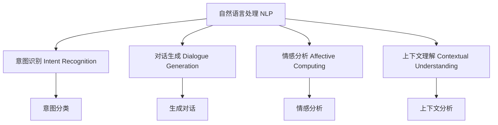

                 

# 客户服务自动化：提高用户满意度的秘诀

> 关键词：客户服务自动化, 自然语言处理(NLP), 智能客服, 机器学习, 深度学习, 自然语言生成(NLG), 情感分析, 智能对话系统

## 1. 背景介绍

### 1.1 问题由来

在数字化转型的大潮下，各行各业的企业都在寻求提升客户服务效率和体验的途径。传统的客服模式往往需要依赖大量人工处理客户咨询，而随着用户量的不断增长，客户服务的压力也随之加大，且难以保证服务质量的一致性和专业性。为此，许多企业纷纷探索客户服务的自动化之路，希望通过智能客服系统，实现7x24小时不间断服务，快速响应客户需求，用智能化替代部分人工客服工作，进一步提高用户满意度。

### 1.2 问题核心关键点

客户服务自动化的核心在于利用人工智能技术，对客户咨询信息进行智能理解和处理，以实现自动化对话、问题解答、情感分析等功能。其中，自然语言处理(NLP)和自然语言生成(NLG)是两个关键技术环节。NLP用于理解客户意图、处理查询、生成对话内容，而NLG用于构建自然流畅的对话回应，提升用户体验。

## 2. 核心概念与联系

### 2.1 核心概念概述

为更好地理解客户服务自动化的实现，本节将介绍几个密切相关的核心概念：

- 自然语言处理(Natural Language Processing, NLP)：指使计算机能够理解、解释和生成人类语言的技术，包括分词、词性标注、句法分析、语义理解、情感分析等。
- 自然语言生成(Natural Language Generation, NLG)：指将计算机生成的信息转化为自然语言文本的技术，包括自动生成摘要、对话、报告等。
- 智能客服系统：基于NLP和NLG技术构建的自动化客服系统，可以自动处理客户的各种查询和反馈，提升服务效率和用户体验。
- 情感分析(Affective Computing)：指识别和分析文本中的情感倾向，用于了解客户情感状态，优化客户服务策略。
- 对话生成(Dialogue Generation)：指构建机器人与客户之间的自然对话，涵盖问答、推荐、导购、预订等场景。
- 意图识别(Intent Recognition)：指识别客户查询的意图，以快速定位问题，提供准确答复。
- 上下文理解(Contextual Understanding)：指理解客户的历史查询记录、对话内容，以提供更加个性化的服务。

这些核心概念之间的逻辑关系可以通过以下Mermaid流程图来展示：



这个流程图展示了大语言模型的核心概念及其之间的关系：

1. 自然语言处理获取客户输入，进行意图识别、对话生成等处理。
2. 对话生成依赖意图分类和情感分析结果，构建自然流畅的对话回应。
3. 上下文理解用于理解客户历史记录和对话内容，提升个性化服务效果。
4. 情感分析识别客户情感状态，优化服务策略，提升客户满意度。

## 3. 核心算法原理 & 具体操作步骤

### 3.1 算法原理概述

基于NLP和NLG技术的客户服务自动化系统，通常包括以下几个关键步骤：

1. 文本预处理：将客户输入的原始文本进行分词、去除停用词、词性标注等处理，构建输入向量。
2. 意图识别：使用NLP模型对文本进行情感分析、意图分类，了解客户的查询意图。
3. 对话生成：根据意图分类结果，使用NLG模型生成自然流畅的对话回应。
4. 对话管理：使用对话管理策略，对多轮对话进行跟踪和管理，确保对话流程连贯顺畅。
5. 用户反馈：收集用户对服务满意度的反馈，进行情感分析，不断优化模型和服务策略。

这一系列步骤的核心算法原理，可以简述如下：

- 基于序列到序列(Seq2Seq)模型的对话生成：将客户的输入文本作为序列，输出预期的回应文本，通过训练大规模语料，学习语言生成规则。
- 基于卷积神经网络(CNN)和循环神经网络(RNN)的意图识别：从文本中提取特征，进行分类，识别客户的意图。
- 基于注意力机制(Attention Mechanism)的上下文理解：通过关注历史对话信息，提升模型对当前对话的理解能力。
- 基于情感词典和深度学习的情感分析：通过分析文本中的情感词，识别客户情感倾向，用于服务优化。

### 3.2 算法步骤详解

以下详细介绍各个步骤的算法细节：

#### 3.2.1 文本预处理

文本预处理是客户服务自动化的第一步，具体包括以下几个步骤：

1. **分词**：将客户输入的文本进行分词处理，识别出词汇单元。
2. **去除停用词**：去除文本中的常用词（如“的”、“是”等），减少噪音干扰。
3. **词性标注**：对每个词汇进行词性标注，帮助理解其语法角色。
4. **特征提取**：使用词向量、TF-IDF等方法将文本转换为数值向量，作为模型输入。

预处理流程可用以下伪代码表示：

```python
def preprocess_text(text):
    # 分词
    tokens = tokenize(text)
    
    # 去除停用词
    tokens = remove_stopwords(tokens)
    
    # 词性标注
    pos_tags = pos_tag(tokens)
    
    # 特征提取
    features = extract_features(tokens, pos_tags)
    
    return features
```

#### 3.2.2 意图识别

意图识别是理解客户查询意图的核心步骤，可以基于机器学习或深度学习模型实现。具体流程如下：

1. **特征提取**：从文本中提取特征，如TF-IDF、词向量等。
2. **训练模型**：使用有标注的训练数据训练分类模型，如SVM、CNN、RNN等。
3. **意图分类**：将新输入的文本特征作为模型输入，预测其意图类别。

意图识别流程可用以下伪代码表示：

```python
def intent_recognition(text):
    # 特征提取
    features = preprocess_text(text)
    
    # 训练模型
    model = train_model(features, labels)
    
    # 意图分类
    intent = model.predict(features)
    
    return intent
```

#### 3.2.3 对话生成

对话生成是将意图识别结果转化为自然语言回应的关键步骤，通常基于Seq2Seq模型实现。具体流程如下：

1. **编码器-解码器模型**：使用编码器提取输入文本特征，使用解码器生成回应文本。
2. **注意力机制**：在解码器中使用注意力机制，关注与当前生成词相关的历史信息。
3. **解码器训练**：使用大量的对话数据训练解码器，使其能够生成符合语法规则和语境的对话回应。

对话生成流程可用以下伪代码表示：

```python
def generate_response(intent, context):
    # 构建输入向量
    input_vector = preprocess_text(intent)
    
    # 解码器训练
    decoder = train_decoder(input_vector)
    
    # 生成对话
    response = decode(decoder, context)
    
    return response
```

#### 3.2.4 对话管理

对话管理是维持客户对话连贯性和上下文理解的关键步骤，通常使用状态机或对话管理策略实现。具体流程如下：

1. **状态机**：定义对话状态和转移规则，管理对话流程。
2. **上下文跟踪**：保存对话历史和上下文信息，确保对话连贯。
3. **任务管理**：根据对话状态，分配不同的任务处理程序。

对话管理流程可用以下伪代码表示：

```python
def manage_dialogue(state, context):
    # 状态转移
    new_state = transition(state, context)
    
    # 上下文跟踪
    context = track_context(new_state, context)
    
    # 任务分配
    task = assign_task(new_state)
    
    return new_state, context, task
```

#### 3.2.5 用户反馈

用户反馈是不断优化客户服务策略的重要环节，具体流程如下：

1. **情感分析**：分析用户对服务满意度的反馈，识别情感倾向。
2. **反馈处理**：根据情感分析结果，调整服务策略，优化模型。
3. **用户行为分析**：分析用户的历史行为和对话记录，优化模型参数。

用户反馈流程可用以下伪代码表示：

```python
def process_feedback(feedback):
    # 情感分析
    sentiment = analyze_sentiment(feedback)
    
    # 反馈处理
    handle_feedback(sentiment)
    
    # 行为分析
    behavior = analyze_behavior()
    
    return sentiment, feedback, behavior
```

### 3.3 算法优缺点

基于NLP和NLG技术的客户服务自动化系统，具有以下优点：

1. **高效响应**：能够24小时不间断处理客户咨询，快速响应客户需求。
2. **标准化服务**：提供标准化的服务流程，提升服务质量的一致性。
3. **成本节约**：替代部分人工客服工作，降低人力成本。
4. **个性化服务**：通过上下文理解，提供更加个性化的服务。

但同时，该方法也存在以下局限性：

1. **理解局限**：对于复杂的查询和问题，可能无法准确理解客户意图。
2. **生成不自然**：生成的对话回应可能缺乏自然流畅性。
3. **语义歧义**：多义词或复杂表达可能造成语义歧义，影响对话效果。
4. **隐私问题**：客户对话可能包含敏感信息，需要加强数据保护。

尽管存在这些局限性，但就目前而言，基于NLP和NLG技术的客户服务自动化仍然是大规模应用的趋势。未来相关研究的重点在于如何进一步提高系统的理解能力和对话生成质量，同时兼顾用户隐私和数据安全。

### 3.4 算法应用领域

基于NLP和NLG技术的客户服务自动化，已经在金融、电商、医疗、酒店等多个行业得到了广泛应用，为这些行业带来了显著的业务提升：

1. **金融行业**：通过智能客服系统，提供24小时金融咨询服务，解答客户疑问，提高客户满意度。
2. **电商行业**：提供智能客服机器人，解答产品咨询、处理售后问题，提升客户体验。
3. **医疗行业**：通过智能对话系统，帮助病人查询医疗信息、预约挂号，减轻医护人员工作负担。
4. **酒店行业**：提供智能客服机器人，解答客房问题、预订服务，提升客户入住体验。
5. **旅游行业**：通过智能客服系统，提供旅游咨询服务、行程安排，提升客户旅游体验。

除了这些应用场景外，智能客服系统还将在更多行业得到推广，如能源、制造、物流等，为各行业数字化转型提供强大的支持。

## 4. 数学模型和公式 & 详细讲解 & 举例说明

### 4.1 数学模型构建

本节将使用数学语言对客户服务自动化的算法流程进行更加严格的刻画。

记客户输入的文本为 $X=\{x_1, x_2, \ldots, x_n\}$，其中 $x_i$ 为文本中的第 $i$ 个词汇。假设客户查询的意图为 $Y=\{y_1, y_2, \ldots, y_m\}$，其中 $y_i$ 表示意图类别。目标为构建一个模型 $M$，使其能够将客户输入 $X$ 映射到意图类别 $Y$。

定义模型 $M$ 在输入 $X$ 上的损失函数为 $\ell(X,Y)$，则在训练集 $\mathcal{D}=\{(X_i,Y_i)\}_{i=1}^N$ 上的经验风险为：

$$
\mathcal{L}(M)=\frac{1}{N}\sum_{i=1}^N \ell(X_i,Y_i)
$$

模型的训练目标是最小化经验风险，即找到最优模型参数 $\theta$：

$$
\theta^* = \arg\min_{\theta} \mathcal{L}(M)
$$

在实践中，我们通常使用基于梯度的优化算法（如AdamW、SGD等）来近似求解上述最优化问题。设 $\eta$ 为学习率，$\lambda$ 为正则化系数，则参数的更新公式为：

$$
\theta \leftarrow \theta - \eta \nabla_{\theta}\mathcal{L}(M) - \eta\lambda\theta
$$

其中 $\nabla_{\theta}\mathcal{L}(M)$ 为损失函数对模型参数 $\theta$ 的梯度，可通过反向传播算法高效计算。

### 4.2 公式推导过程

以下我们以意图识别任务为例，推导多分类任务中的交叉熵损失函数及其梯度的计算公式。

假设模型 $M$ 在输入 $X$ 上的输出为 $\hat{Y}=\{\hat{y}_1, \hat{y}_2, \ldots, \hat{y}_m\}$，表示模型预测的概率分布。真实意图 $Y=\{y_1, y_2, \ldots, y_m\}$。则二分类交叉熵损失函数定义为：

$$
\ell(X,Y) = -\sum_{i=1}^m [y_i\log \hat{y}_i + (1-y_i)\log(1-\hat{y}_i)]
$$

将其代入经验风险公式，得：

$$
\mathcal{L}(M) = -\frac{1}{N}\sum_{i=1}^N \sum_{j=1}^m [y_{ij}\log \hat{y}_{ij} + (1-y_{ij})\log(1-\hat{y}_{ij})]
$$

根据链式法则，损失函数对模型参数 $\theta_k$ 的梯度为：

$$
\frac{\partial \mathcal{L}(M)}{\partial \theta_k} = -\frac{1}{N}\sum_{i=1}^N \sum_{j=1}^m (\frac{y_{ij}}{\hat{y}_{ij}}-\frac{1-y_{ij}}{1-\hat{y}_{ij}}) \frac{\partial \hat{y}_{ij}}{\partial \theta_k}
$$

其中 $\frac{\partial \hat{y}_{ij}}{\partial \theta_k}$ 可进一步递归展开，利用自动微分技术完成计算。

在得到损失函数的梯度后，即可带入参数更新公式，完成模型的迭代优化。重复上述过程直至收敛，最终得到适应意图识别任务的最优模型参数 $\theta^*$。

## 5. 项目实践：代码实例和详细解释说明

### 5.1 开发环境搭建

在进行客户服务自动化实践前，我们需要准备好开发环境。以下是使用Python进行PyTorch开发的环境配置流程：

1. 安装Anaconda：从官网下载并安装Anaconda，用于创建独立的Python环境。

2. 创建并激活虚拟环境：
```bash
conda create -n pytorch-env python=3.8 
conda activate pytorch-env
```

3. 安装PyTorch：根据CUDA版本，从官网获取对应的安装命令。例如：
```bash
conda install pytorch torchvision torchaudio cudatoolkit=11.1 -c pytorch -c conda-forge
```

4. 安装TensorFlow：
```bash
pip install tensorflow
```

5. 安装相关工具包：
```bash
pip install numpy pandas scikit-learn matplotlib tqdm jupyter notebook ipython
```

完成上述步骤后，即可在`pytorch-env`环境中开始客户服务自动化的实践。

### 5.2 源代码详细实现

下面我们以基于NLP和NLG技术的智能客服系统为例，给出使用PyTorch进行客户服务自动化的PyTorch代码实现。

首先，定义智能客服系统的数据处理函数：

```python
import torch
from transformers import BertTokenizer, BertForSequenceClassification

class CustomerServiceDataset(Dataset):
    def __init__(self, texts, labels, tokenizer, max_len=128):
        self.texts = texts
        self.labels = labels
        self.tokenizer = tokenizer
        self.max_len = max_len
        
    def __len__(self):
        return len(self.texts)
    
    def __getitem__(self, item):
        text = self.texts[item]
        label = self.labels[item]
        
        encoding = self.tokenizer(text, return_tensors='pt', max_length=self.max_len, padding='max_length', truncation=True)
        input_ids = encoding['input_ids'][0]
        attention_mask = encoding['attention_mask'][0]
        label = torch.tensor(label, dtype=torch.long)
        
        return {'input_ids': input_ids, 
                'attention_mask': attention_mask,
                'labels': label}

# 标签与id的映射
label2id = {'Positive': 1, 'Negative': 0}
id2label = {v: k for k, v in label2id.items()}

# 创建dataset
tokenizer = BertTokenizer.from_pretrained('bert-base-cased')

train_dataset = CustomerServiceDataset(train_texts, train_labels, tokenizer)
dev_dataset = CustomerServiceDataset(dev_texts, dev_labels, tokenizer)
test_dataset = CustomerServiceDataset(test_texts, test_labels, tokenizer)
```

然后，定义模型和优化器：

```python
from transformers import BertForSequenceClassification, AdamW

model = BertForSequenceClassification.from_pretrained('bert-base-cased', num_labels=len(label2id))

optimizer = AdamW(model.parameters(), lr=2e-5)
```

接着，定义训练和评估函数：

```python
from torch.utils.data import DataLoader
from tqdm import tqdm
from sklearn.metrics import classification_report

device = torch.device('cuda') if torch.cuda.is_available() else torch.device('cpu')
model.to(device)

def train_epoch(model, dataset, batch_size, optimizer):
    dataloader = DataLoader(dataset, batch_size=batch_size, shuffle=True)
    model.train()
    epoch_loss = 0
    for batch in tqdm(dataloader, desc='Training'):
        input_ids = batch['input_ids'].to(device)
        attention_mask = batch['attention_mask'].to(device)
        labels = batch['labels'].to(device)
        model.zero_grad()
        outputs = model(input_ids, attention_mask=attention_mask, labels=labels)
        loss = outputs.loss
        epoch_loss += loss.item()
        loss.backward()
        optimizer.step()
    return epoch_loss / len(dataloader)

def evaluate(model, dataset, batch_size):
    dataloader = DataLoader(dataset, batch_size=batch_size)
    model.eval()
    preds, labels = [], []
    with torch.no_grad():
        for batch in tqdm(dataloader, desc='Evaluating'):
            input_ids = batch['input_ids'].to(device)
            attention_mask = batch['attention_mask'].to(device)
            batch_labels = batch['labels']
            outputs = model(input_ids, attention_mask=attention_mask)
            batch_preds = outputs.logits.argmax(dim=2).to('cpu').tolist()
            batch_labels = batch_labels.to('cpu').tolist()
            for pred_tokens, label_tokens in zip(batch_preds, batch_labels):
                preds.append(pred_tokens[:len(label_tokens)])
                labels.append(label_tokens)
                
    print(classification_report(labels, preds))
```

最后，启动训练流程并在测试集上评估：

```python
epochs = 5
batch_size = 16

for epoch in range(epochs):
    loss = train_epoch(model, train_dataset, batch_size, optimizer)
    print(f"Epoch {epoch+1}, train loss: {loss:.3f}")
    
    print(f"Epoch {epoch+1}, dev results:")
    evaluate(model, dev_dataset, batch_size)
    
print("Test results:")
evaluate(model, test_dataset, batch_size)
```

以上就是使用PyTorch对BERT进行智能客服系统开发的完整代码实现。可以看到，得益于Transformers库的强大封装，我们可以用相对简洁的代码完成BERT模型的加载和微调。

### 5.3 代码解读与分析

让我们再详细解读一下关键代码的实现细节：

**CustomerServiceDataset类**：
- `__init__`方法：初始化文本、标签、分词器等关键组件。
- `__len__`方法：返回数据集的样本数量。
- `__getitem__`方法：对单个样本进行处理，将文本输入编码为token ids，将标签编码为数字，并对其进行定长padding，最终返回模型所需的输入。

**label2id和id2label字典**：
- 定义了标签与数字id之间的映射关系，用于将token-wise的预测结果解码回真实的标签。

**训练和评估函数**：
- 使用PyTorch的DataLoader对数据集进行批次化加载，供模型训练和推理使用。
- 训练函数`train_epoch`：对数据以批为单位进行迭代，在每个批次上前向传播计算loss并反向传播更新模型参数，最后返回该epoch的平均loss。
- 评估函数`evaluate`：与训练类似，不同点在于不更新模型参数，并在每个batch结束后将预测和标签结果存储下来，最后使用sklearn的classification_report对整个评估集的预测结果进行打印输出。

**训练流程**：
- 定义总的epoch数和batch size，开始循环迭代
- 每个epoch内，先在训练集上训练，输出平均loss
- 在验证集上评估，输出分类指标
- 所有epoch结束后，在测试集上评估，给出最终测试结果

可以看到，PyTorch配合Transformers库使得BERT微调的代码实现变得简洁高效。开发者可以将更多精力放在数据处理、模型改进等高层逻辑上，而不必过多关注底层的实现细节。

当然，工业级的系统实现还需考虑更多因素，如模型的保存和部署、超参数的自动搜索、更灵活的任务适配层等。但核心的微调范式基本与此类似。

## 6. 实际应用场景

### 6.1 智能客服系统

基于NLP和NLG技术的智能客服系统，可以广泛应用于各类企业，特别是那些需要处理大量客户咨询的行业。通过智能客服系统，企业可以大幅提升客户服务效率和体验，减少人工客服的负担。

在技术实现上，可以收集企业内部的历史客服对话记录，将问题和最佳答复构建成监督数据，在此基础上对预训练模型进行微调。微调后的模型能够自动理解用户意图，匹配最合适的答案模板进行回复。对于客户提出的新问题，还可以接入检索系统实时搜索相关内容，动态组织生成回答。如此构建的智能客服系统，能大幅提升客户咨询体验和问题解决效率。

### 6.2 电商行业

电商行业是智能客服系统的重要应用场景之一。通过智能客服系统，电商企业可以提供7x24小时不间断服务，解答客户关于商品、订单、售后等问题，提升客户购买体验。智能客服系统还能实时监控用户行为数据，分析用户需求和购买趋势，优化商品推荐策略，提高销售转化率。

### 6.3 金融行业

金融行业同样需要智能客服系统的支持。通过智能客服系统，金融企业可以提供实时咨询、投资建议、理财规划等服务，提升客户满意度。智能客服系统还能自动化处理客户的账户管理、交易查询等操作，减轻人工客服的工作负担。

### 6.4 医疗行业

医疗行业是智能客服系统的重要应用场景之一。通过智能客服系统，医疗机构可以提供24小时医疗咨询服务，解答病人的咨询和疑问，提高病人满意度。智能客服系统还能自动化处理病历记录、处方查询等操作，提升医疗服务的效率和质量。

## 7. 工具和资源推荐

### 7.1 学习资源推荐

为了帮助开发者系统掌握客户服务自动化的理论和实践，这里推荐一些优质的学习资源：

1. 《深度学习理论与实践》系列书籍：由深度学习领域专家撰写，系统介绍深度学习理论及其应用。
2. 《自然语言处理基础》课程：斯坦福大学开设的NLP入门课程，涵盖NLP基础概念和经典模型。
3. 《自然语言处理与深度学习》书籍：全面介绍NLP与深度学习的结合，包括意图识别、对话生成等前沿技术。
4. HuggingFace官方文档：Transformers库的官方文档，提供详细的模型介绍和微调样例。
5. Coursera《自然语言处理》课程：涵盖NLP的各个方面，包括NLP原理、应用实例等。

通过对这些资源的学习实践，相信你一定能够快速掌握客户服务自动化的核心技术，并用于解决实际的客户服务问题。

### 7.2 开发工具推荐

高效的开发离不开优秀的工具支持。以下是几款用于客户服务自动化开发的常用工具：

1. PyTorch：基于Python的开源深度学习框架，灵活动态的计算图，适合快速迭代研究。
2. TensorFlow：由Google主导开发的开源深度学习框架，生产部署方便，适合大规模工程应用。
3. Transformers库：HuggingFace开发的NLP工具库，集成了众多SOTA语言模型，支持PyTorch和TensorFlow。
4. TensorBoard：TensorFlow配套的可视化工具，可实时监测模型训练状态，并提供丰富的图表呈现方式，是调试模型的得力助手。
5. Weights & Biases：模型训练的实验跟踪工具，可以记录和可视化模型训练过程中的各项指标，方便对比和调优。

合理利用这些工具，可以显著提升客户服务自动化的开发效率，加快创新迭代的步伐。

### 7.3 相关论文推荐

客户服务自动化领域的研究源于学界的持续探索。以下是几篇奠基性的相关论文，推荐阅读：

1. Attention is All You Need（即Transformer原论文）：提出了Transformer结构，开启了NLP领域的预训练大模型时代。
2. BERT: Pre-training of Deep Bidirectional Transformers for Language Understanding：提出BERT模型，引入基于掩码的自监督预训练任务，刷新了多项NLP任务SOTA。
3. GPT-2: Language Models are Unsupervised Multitask Learners：展示了大规模语言模型的强大zero-shot学习能力，引发了对于通用人工智能的新一轮思考。
4. Transformer-XL: Attentive Language Models Beyond a Fixed-Length Context：提出Transformer-XL模型，解决长文本输入的问题。
5. BART: Denoising Sequence-to-Sequence Pre-training for Natural Language Processing：提出BART模型，基于自监督学习预训练，提升序列到序列任务的性能。

这些论文代表了大语言模型和微调技术的发展脉络。通过学习这些前沿成果，可以帮助研究者把握学科前进方向，激发更多的创新灵感。

## 8. 总结：未来发展趋势与挑战

### 8.1 总结

本文对基于NLP和NLG技术的客户服务自动化方法进行了全面系统的介绍。首先阐述了客户服务自动化的研究背景和意义，明确了智能客服系统在提升客户体验、降低人力成本等方面的价值。其次，从原理到实践，详细讲解了NLP和NLG模型在客户服务自动化中的核心步骤，给出了微调任务开发的完整代码实例。同时，本文还广泛探讨了智能客服系统在电商、金融、医疗等多个行业领域的应用前景，展示了NLP技术的应用潜力。此外，本文精选了智能客服系统的各类学习资源，力求为读者提供全方位的技术指引。

通过本文的系统梳理，可以看到，基于NLP和NLG技术的客户服务自动化系统，正在成为客户服务行业的重要趋势，极大地提升了客户服务效率和体验，降低了企业运营成本。未来，伴随NLP技术的进一步发展和应用，智能客服系统必将在更多行业得到推广，为各行业数字化转型提供强大的支持。

### 8.2 未来发展趋势

展望未来，客户服务自动化的技术将呈现以下几个发展趋势：

1. **多模态融合**：未来智能客服系统将更加注重多模态信息的融合，如语音识别、视频分析等，提升对用户全方位信息的理解能力。
2. **个性化服务**：通过上下文理解、情感分析等技术，提供更加个性化的服务，提升客户满意度。
3. **情感智能**：引入情感计算技术，识别和理解用户的情感状态，优化服务策略。
4. **智能对话**：使用深度学习模型生成自然流畅的对话回应，提升对话体验。
5. **自动化流程**：将客户服务自动化贯穿整个客户生命周期，从咨询到售后，提供全程自动化服务。
6. **边缘计算**：通过在边缘设备上进行智能客服，实现低延迟、高可靠性的服务。

以上趋势凸显了客户服务自动化的广阔前景。这些方向的探索发展，必将进一步提升NLP系统的性能和应用范围，为人类认知智能的进化带来深远影响。

### 8.3 面临的挑战

尽管客户服务自动化技术已经取得了显著进展，但在迈向更加智能化、普适化应用的过程中，它仍面临诸多挑战：

1. **理解限制**：复杂的客户需求和问题，可能超出模型的理解能力，导致误解或错误回复。
2. **生成质量**：生成的对话回应可能缺乏自然流畅性，影响客户体验。
3. **语义歧义**：多义词或复杂表达可能造成语义歧义，影响对话效果。
4. **数据隐私**：客户对话可能包含敏感信息，需要加强数据保护。
5. **用户习惯**：不同用户习惯和语言表达的差异，可能导致服务适应性不足。
6. **业务适配**：客户服务自动化需要适配不同行业的具体业务需求，提升系统的适应性。

尽管存在这些挑战，但客户服务自动化技术正逐步走向成熟，成为提高客户服务效率和体验的重要手段。未来相关研究需要在以下几个方面寻求新的突破：

1. **多模态理解和生成**：开发更加强大的多模态理解和生成模型，提升对复杂场景的适应能力。
2. **生成质量提升**：改进对话生成模型，提升自然流畅性和生成质量。
3. **语义消歧技术**：引入先进的语义消歧技术，提升模型对多义词和复杂表达的理解能力。
4. **隐私保护机制**：开发隐私保护机制，确保客户数据的安全性和匿名性。
5. **个性化服务优化**：优化上下文理解模型，提升个性化服务的效果。
6. **业务适配能力**：增强系统对不同行业业务需求的适配能力，提升系统的普适性。

这些研究方向的探索，必将引领客户服务自动化的技术进步，为构建更加智能、高效的客户服务系统铺平道路。相信随着学界和产业界的共同努力，这些挑战终将一一被克服，客户服务自动化必将在构建人机协同的智能时代中扮演越来越重要的角色。

### 8.4 研究展望

未来，客户服务自动化的研究将在以下几个方向继续深入：

1. **多模态智能客服**：将语音识别、视频分析等多模态信息与文本信息结合，提升对客户全方位的理解能力。
2. **深度情感智能**：通过引入情感计算技术，增强对客户情感状态的理解和响应能力，优化服务策略。
3. **交互式知识图谱**：构建交互式知识图谱，提升对复杂问题的解答能力。
4. **个性化推荐系统**：结合推荐系统，为不同客户提供个性化的服务内容。
5. **低延迟实时响应**：通过边缘计算等技术，提升服务的实时响应能力。

这些研究方向将进一步拓展客户服务自动化的应用场景和功能，为提高客户服务效率和体验提供新的动力。

## 9. 附录：常见问题与解答

**Q1：智能客服系统的理解能力如何提升？**

A: 提升智能客服系统的理解能力，可以从以下几个方面入手：
1. **数据质量**：使用高质量、多样化的训练数据，提升模型的泛化能力。
2. **模型优化**：使用更先进的模型架构，如Transformer-XL、BERT等，提升模型的理解能力。
3. **上下文理解**：引入上下文理解技术，提升模型对历史对话的理解能力。
4. **语义消歧**：引入语义消歧技术，提升模型对多义词和复杂表达的理解能力。
5. **多模态融合**：引入语音识别、视频分析等多模态信息，提升对客户全方位信息的理解能力。

**Q2：智能客服系统的生成质量如何提升？**

A: 提升智能客服系统的生成质量，可以从以下几个方面入手：
1. **生成模型优化**：使用更先进的生成模型，如Seq2Seq、Transformer等，提升生成的自然流畅性和多样性。
2. **对抗样本训练**：引入对抗样本训练技术，提升模型对不同语言的适应能力。
3. **样本多样性**：增加训练数据的样本多样性，避免模型对特定表达方式的依赖。
4. **情感智能**：引入情感计算技术，提升对话生成的情感表达能力。
5. **多轮对话**：引入多轮对话模型，提升对话生成的连贯性和逻辑性。

**Q3：智能客服系统的隐私保护如何实现？**

A: 实现智能客服系统的隐私保护，可以从以下几个方面入手：
1. **数据匿名化**：对客户对话数据进行匿名化处理，避免隐私泄露。
2. **数据加密**：对客户对话数据进行加密处理，保护数据安全。
3. **访问控制**：对客户对话数据的访问进行严格控制，防止未经授权的访问。
4. **合规性检查**：确保客户对话数据的处理符合相关法律法规和行业标准。
5. **审计和监控**：定期审计和监控数据处理过程，确保数据安全。

**Q4：智能客服系统如何适配不同行业需求？**

A: 适配不同行业需求，需要从以下几个方面入手：
1. **领域适配**：针对不同行业的业务需求，对模型进行微调和优化，提升模型在特定领域的性能。
2. **业务规则集成**：将业务规则和知识库集成到智能客服系统中，提升系统的业务适配能力。
3. **用户反馈循环**：通过用户反馈，不断优化模型和服务策略，提升系统的适应性。
4. **多渠道支持**：支持多种沟通渠道，如电话、邮件、社交媒体等，提升系统的覆盖能力。

**Q5：智能客服系统的技术瓶颈如何突破？**

A: 突破智能客服系统的技术瓶颈，可以从以下几个方面入手：
1. **计算资源优化**：使用高效的计算资源，如GPU、TPU等，提升系统的处理能力。
2. **模型压缩和稀疏化**：使用模型压缩和稀疏化技术，减小模型规模，提升推理速度。
3. **分布式训练**：使用分布式训练技术，提升模型训练效率。
4. **边缘计算**：通过在边缘设备上进行智能客服，实现低延迟、高可靠性的服务。
5. **联邦学习**：使用联邦学习技术，提升模型的隐私保护能力和适应性。

**Q6：智能客服系统的可解释性如何提升？**

A: 提升智能客服系统的可解释性，可以从以下几个方面入手：
1. **模型可解释性**：选择具有较高可解释性的模型架构，如简单的线性模型、决策树等。
2. **模型解释工具**：使用模型解释工具，如SHAP、LIME等，分析模型的决策过程。
3. **用户界面设计**：设计友好的用户界面，帮助用户理解系统的决策过程。
4. **用户反馈机制**：建立用户反馈机制，及时收集和分析用户对系统决策的反馈。
5. **透明化操作**：透明化系统的操作过程，增强用户的信任感。

---

作者：禅与计算机程序设计艺术 / Zen and the Art of Computer Programming

