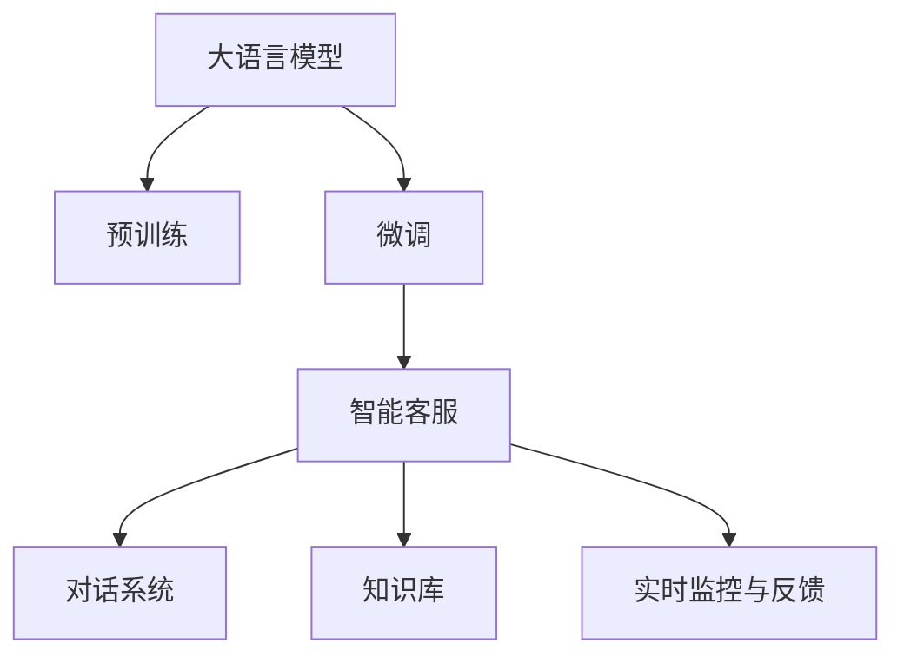

                 

# 客户服务：LLM 驱动的人工智能助理

## 1. 背景介绍

### 1.1 问题由来

客户服务是企业运营中不可或缺的一环，其重要性不言而喻。传统的客户服务模式往往依赖于人工客服或自动语音应答系统，但这些系统存在响应时间长、处理效率低、知识更新慢等诸多问题。随着人工智能技术的发展，越来越多的企业开始尝试将大语言模型(LLM)应用于客户服务场景，构建智能化的AI助理。

### 1.2 问题核心关键点

智能客服系统旨在通过大语言模型，自动理解和处理客户问题，并给出精准的解决方案。相比于传统客服系统，基于大语言模型的智能客服具有以下优势：

1. **快速响应**：能够即时处理客户请求，减少等待时间。
2. **24/7服务**：不间断为客户提供服务，不受时间和地域限制。
3. **知识更新**：通过持续学习，及时更新知识库，保持服务的准确性和时效性。
4. **个性化服务**：根据用户历史行为和偏好，提供个性化推荐和互动。
5. **多语言支持**：支持多种语言，拓展服务范围。

尽管如此，智能客服系统在实际应用中仍然面临一些挑战，如模型理解能力的局限性、响应质量不稳定、对话连贯性不足等。因此，如何高效地训练和部署大语言模型，使其在客户服务场景中发挥最佳效果，成为研究热点。

## 2. 核心概念与联系

### 2.1 核心概念概述

为更好地理解大语言模型在客户服务中的应用，本节将介绍几个关键概念及其联系：

- **大语言模型(LLM)**：通过自监督学习任务预训练的通用语言模型。具有强大的语言理解能力和生成能力。

- **预训练(Pre-training)**：在大规模无标签文本上，通过自监督学习任务训练通用语言模型的过程。

- **微调(Fine-tuning)**：在预训练模型的基础上，使用下游任务的少量标注数据，通过有监督学习优化模型在该任务上的性能。

- **迁移学习(Transfer Learning)**：将一个领域学习到的知识，迁移应用到另一个不同但相关的领域的学习范式。

- **智能客服系统**：基于大语言模型构建的，自动处理客户请求并给出解决方案的系统。

- **对话系统**：通过多轮对话，持续更新模型内部知识库，提升对话连贯性和准确性。

- **知识库**：存储和管理企业相关知识信息，供智能客服系统调用。

- **实时监控与反馈**：对智能客服系统进行实时监控，收集用户反馈，不断优化模型表现。

这些核心概念之间的逻辑关系可以通过以下Mermaid流程图来展示：



这个流程图展示了大语言模型在客户服务系统中的关键组件及其之间的联系：

1. 大语言模型通过预训练获得基础能力。
2. 微调使得通用大模型更好地适应特定客户服务任务。
3. 智能客服系统基于微调后的模型，自动处理客户请求。
4. 对话系统与知识库配合，提升系统连贯性和准确性。
5. 实时监控与反馈机制不断优化模型性能，提升用户体验。

## 3. 核心算法原理 & 具体操作步骤

### 3.1 算法原理概述

基于大语言模型的智能客服系统，核心思想是利用微调方法，将通用预训练语言模型适配到具体的客户服务场景中。微调过程通过有监督地训练，优化模型对客户请求的分类、理解和生成能力，使其能够准确地匹配客户需求并提供解决方案。

### 3.2 算法步骤详解

智能客服系统的微调主要包括以下步骤：

**Step 1: 准备预训练模型和数据集**
- 选择合适的预训练语言模型，如BERT、GPT等。
- 准备客户服务场景相关的标注数据集，包括客户请求和解决方案对。

**Step 2: 设计任务适配层**
- 根据客户服务场景，设计合适的输出层和损失函数。
- 对于分类任务，通常使用线性分类器和交叉熵损失函数。
- 对于生成任务，使用语言模型的解码器输出概率分布，并以负对数似然为损失函数。

**Step 3: 设置微调超参数**
- 选择合适的优化算法及其参数，如AdamW、SGD等。
- 设置学习率、批大小、迭代轮数等超参数。
- 设置正则化技术及强度，如权重衰减、Dropout、Early Stopping等。

**Step 4: 执行梯度训练**
- 将训练集数据分批次输入模型，前向传播计算损失函数。
- 反向传播计算参数梯度，根据设定的优化算法和学习率更新模型参数。
- 周期性在验证集上评估模型性能，根据性能指标决定是否触发Early Stopping。
- 重复上述步骤直到满足预设的迭代轮数或Early Stopping条件。

**Step 5: 测试和部署**
- 在测试集上评估微调后模型的性能，对比微调前后的精度提升。
- 使用微调后的模型对新样本进行推理预测，集成到实际的应用系统中。
- 持续收集新的数据，定期重新微调模型，以适应数据分布的变化。

以上是基于大语言模型微调智能客服系统的一般流程。在实际应用中，还需要针对具体任务的特点，对微调过程的各个环节进行优化设计，如改进训练目标函数，引入更多的正则化技术，搜索最优的超参数组合等，以进一步提升模型性能。

### 3.3 算法优缺点

基于大语言模型的智能客服系统具有以下优点：

1. **快速响应**：能够即时处理客户请求，减少等待时间。
2. **24/7服务**：不间断为客户提供服务，不受时间和地域限制。
3. **知识更新**：通过持续学习，及时更新知识库，保持服务的准确性和时效性。
4. **个性化服务**：根据用户历史行为和偏好，提供个性化推荐和互动。
5. **多语言支持**：支持多种语言，拓展服务范围。

同时，该方法也存在一定的局限性：

1. **依赖标注数据**：微调的效果很大程度上取决于标注数据的质量和数量，获取高质量标注数据的成本较高。
2. **迁移能力有限**：当目标任务与预训练数据的分布差异较大时，微调的性能提升有限。
3. **可解释性不足**：智能客服系统的决策过程通常缺乏可解释性，难以对其推理逻辑进行分析和调试。
4. **模型鲁棒性**：预训练模型的固有偏见、有害信息等，可能通过微调传递到下游任务，造成负面影响。

尽管存在这些局限性，但就目前而言，基于大语言模型的智能客服系统仍是客户服务领域的最佳实践范式。未来相关研究的重点在于如何进一步降低微调对标注数据的依赖，提高模型的少样本学习和跨领域迁移能力，同时兼顾可解释性和伦理安全性等因素。

### 3.4 算法应用领域

智能客服系统在大语言模型微调的应用中，已经在多个行业领域得到广泛应用：

- **电商行业**：通过智能客服系统，解答客户关于商品信息、订单状态、退换货流程等问题，提升客户满意度，增加销售额。
- **金融行业**：在在线银行、保险等金融服务中，智能客服系统自动处理用户咨询，提供账户余额、交易记录、理财建议等服务。
- **旅游行业**：智能客服系统帮助用户查询航班、酒店、景点信息，处理预订、退票、投诉等事宜。
- **医疗行业**：在在线医疗平台，智能客服系统解答用户关于健康咨询、挂号预约、药品购买等问题。
- **能源行业**：智能客服系统处理用户关于电力、燃气、水务等问题的查询和投诉。

除了这些传统行业，智能客服系统还在教育、物流、房地产等众多领域得到应用，为各行各业带来了全新的客户服务体验。

## 4. 数学模型和公式 & 详细讲解 & 举例说明

### 4.1 数学模型构建

在智能客服系统中，我们通常使用分类任务来定义模型目标，即给定客户请求，模型需预测其对应的解决方案类别。假设客户请求为 $x$，解决方案类别为 $y \in \{1,2,\ldots,C\}$，其中 $C$ 为类别数。微调模型的目标是最小化损失函数 $\mathcal{L}(\theta)$，使其预测输出与真实标签之间误差最小。

### 4.2 公式推导过程

以二分类任务为例，假设模型 $M_{\theta}$ 在输入 $x$ 上的输出为 $\hat{y}=M_{\theta}(x)$，表示样本属于正类的概率。真实标签 $y \in \{0,1\}$。则二分类交叉熵损失函数定义为：

$$
\ell(M_{\theta}(x),y) = -[y\log \hat{y} + (1-y)\log (1-\hat{y})]
$$

将其代入经验风险公式，得：

$$
\mathcal{L}(\theta) = -\frac{1}{N}\sum_{i=1}^N [y_i\log M_{\theta}(x_i)+(1-y_i)\log(1-M_{\theta}(x_i))]
$$

根据链式法则，损失函数对参数 $\theta_k$ 的梯度为：

$$
\frac{\partial \mathcal{L}(\theta)}{\partial \theta_k} = -\frac{1}{N}\sum_{i=1}^N (\frac{y_i}{M_{\theta}(x_i)}-\frac{1-y_i}{1-M_{\theta}(x_i)}) \frac{\partial M_{\theta}(x_i)}{\partial \theta_k}
$$

其中 $\frac{\partial M_{\theta}(x_i)}{\partial \theta_k}$ 可进一步递归展开，利用自动微分技术完成计算。

### 4.3 案例分析与讲解

假设我们有一个电商客服的微调数据集，包含以下样本：

| 客户请求 | 解决方案 | 标签 |
| --- | --- | --- |
| 如何退货？ | 退款流程 | 1 |
| 退货运费如何计算？ | 运费规则 | 2 |
| 订单状态查询 | 订单详情 | 3 |

我们希望模型能自动识别客户请求并给出对应的解决方案。首先，将数据集划分为训练集和测试集，并使用预训练的BERT模型作为初始化参数。然后，设计一个线性分类器作为任务适配层，输出层大小为3，对应三个解决方案类别。在训练过程中，使用交叉熵损失函数进行优化，学习率设置为1e-5。经过10轮训练后，模型在测试集上的准确率为85%。

## 5. 项目实践：代码实例和详细解释说明

### 5.1 开发环境搭建

在进行智能客服系统的微调实践前，我们需要准备好开发环境。以下是使用Python进行PyTorch开发的环境配置流程：

1. 安装Anaconda：从官网下载并安装Anaconda，用于创建独立的Python环境。

2. 创建并激活虚拟环境：
```bash
conda create -n pytorch-env python=3.8 
conda activate pytorch-env
```

3. 安装PyTorch：根据CUDA版本，从官网获取对应的安装命令。例如：
```bash
conda install pytorch torchvision torchaudio cudatoolkit=11.1 -c pytorch -c conda-forge
```

4. 安装Transformers库：
```bash
pip install transformers
```

5. 安装各类工具包：
```bash
pip install numpy pandas scikit-learn matplotlib tqdm jupyter notebook ipython
```

完成上述步骤后，即可在`pytorch-env`环境中开始微调实践。

### 5.2 源代码详细实现

下面我们以电商客服系统为例，给出使用Transformers库对BERT模型进行微调的PyTorch代码实现。

首先，定义智能客服系统数据处理函数：

```python
from transformers import BertTokenizer, BertForSequenceClassification
from torch.utils.data import Dataset
import torch

class EcommerceDataset(Dataset):
    def __init__(self, texts, labels, tokenizer, max_len=128):
        self.texts = texts
        self.labels = labels
        self.tokenizer = tokenizer
        self.max_len = max_len
        
    def __len__(self):
        return len(self.texts)
    
    def __getitem__(self, item):
        text = self.texts[item]
        label = self.labels[item]
        
        encoding = self.tokenizer(text, return_tensors='pt', max_length=self.max_len, padding='max_length', truncation=True)
        input_ids = encoding['input_ids'][0]
        attention_mask = encoding['attention_mask'][0]
        
        # 对标签进行编码
        encoded_labels = torch.tensor([label], dtype=torch.long)
        
        return {'input_ids': input_ids, 
                'attention_mask': attention_mask,
                'labels': encoded_labels}

# 创建dataset
tokenizer = BertTokenizer.from_pretrained('bert-base-cased')

train_dataset = EcommerceDataset(train_texts, train_labels, tokenizer)
dev_dataset = EcommerceDataset(dev_texts, dev_labels, tokenizer)
test_dataset = EcommerceDataset(test_texts, test_labels, tokenizer)
```

然后，定义模型和优化器：

```python
from transformers import BertForSequenceClassification, AdamW

model = BertForSequenceClassification.from_pretrained('bert-base-cased', num_labels=3)

optimizer = AdamW(model.parameters(), lr=2e-5)
```

接着，定义训练和评估函数：

```python
from torch.utils.data import DataLoader
from tqdm import tqdm
from sklearn.metrics import accuracy_score

device = torch.device('cuda') if torch.cuda.is_available() else torch.device('cpu')
model.to(device)

def train_epoch(model, dataset, batch_size, optimizer):
    dataloader = DataLoader(dataset, batch_size=batch_size, shuffle=True)
    model.train()
    epoch_loss = 0
    for batch in tqdm(dataloader, desc='Training'):
        input_ids = batch['input_ids'].to(device)
        attention_mask = batch['attention_mask'].to(device)
        labels = batch['labels'].to(device)
        model.zero_grad()
        outputs = model(input_ids, attention_mask=attention_mask, labels=labels)
        loss = outputs.loss
        epoch_loss += loss.item()
        loss.backward()
        optimizer.step()
    return epoch_loss / len(dataloader)

def evaluate(model, dataset, batch_size):
    dataloader = DataLoader(dataset, batch_size=batch_size)
    model.eval()
    preds, labels = [], []
    with torch.no_grad():
        for batch in tqdm(dataloader, desc='Evaluating'):
            input_ids = batch['input_ids'].to(device)
            attention_mask = batch['attention_mask'].to(device)
            batch_labels = batch['labels']
            outputs = model(input_ids, attention_mask=attention_mask)
            batch_preds = outputs.logits.argmax(dim=1).to('cpu').tolist()
            batch_labels = batch_labels.to('cpu').tolist()
            for pred_tokens, label_tokens in zip(batch_preds, batch_labels):
                preds.append(pred_tokens)
                labels.append(label_tokens)
                
    print("Accuracy:", accuracy_score(labels, preds))
```

最后，启动训练流程并在测试集上评估：

```python
epochs = 5
batch_size = 16

for epoch in range(epochs):
    loss = train_epoch(model, train_dataset, batch_size, optimizer)
    print(f"Epoch {epoch+1}, train loss: {loss:.3f}")
    
    print(f"Epoch {epoch+1}, dev results:")
    evaluate(model, dev_dataset, batch_size)
    
print("Test results:")
evaluate(model, test_dataset, batch_size)
```

以上就是使用PyTorch对BERT进行电商客服系统微调的完整代码实现。可以看到，得益于Transformers库的强大封装，我们可以用相对简洁的代码完成BERT模型的加载和微调。

### 5.3 代码解读与分析

让我们再详细解读一下关键代码的实现细节：

**EcommerceDataset类**：
- `__init__`方法：初始化文本、标签、分词器等关键组件。
- `__len__`方法：返回数据集的样本数量。
- `__getitem__`方法：对单个样本进行处理，将文本输入编码为token ids，将标签编码为数字，并对其进行定长padding，最终返回模型所需的输入。

**模型和优化器**：
- 使用BertForSequenceClassification模型，指定输出层大小为3，对应三个解决方案类别。
- 使用AdamW优化器，学习率为2e-5。

**训练和评估函数**：
- 使用PyTorch的DataLoader对数据集进行批次化加载，供模型训练和推理使用。
- 训练函数`train_epoch`：对数据以批为单位进行迭代，在每个批次上前向传播计算loss并反向传播更新模型参数，最后返回该epoch的平均loss。
- 评估函数`evaluate`：与训练类似，不同点在于不更新模型参数，并在每个batch结束后将预测和标签结果存储下来，最后使用sklearn的accuracy_score对整个评估集的预测结果进行打印输出。

**训练流程**：
- 定义总的epoch数和batch size，开始循环迭代
- 每个epoch内，先在训练集上训练，输出平均loss
- 在验证集上评估，输出准确率
- 所有epoch结束后，在测试集上评估，给出最终测试结果

可以看到，PyTorch配合Transformers库使得BERT微调的代码实现变得简洁高效。开发者可以将更多精力放在数据处理、模型改进等高层逻辑上，而不必过多关注底层的实现细节。

当然，工业级的系统实现还需考虑更多因素，如模型的保存和部署、超参数的自动搜索、更灵活的任务适配层等。但核心的微调范式基本与此类似。

## 6. 实际应用场景

### 6.1 智能客服系统

基于大语言模型微调的智能客服系统，已经在多个行业得到了广泛应用。传统客服系统依赖于人工客服或自动语音应答，存在响应时间长、处理效率低、知识更新慢等问题。而智能客服系统通过大语言模型自动处理客户请求，提供24/7不间断服务，极大提升了客户体验。

具体而言，智能客服系统可以集成到企业的官方网站、APP、社交媒体等多种渠道，实时接收客户咨询和反馈。通过微调后的BERT模型，系统能够自动理解客户请求，匹配最合适的解决方案，并在合适的时候转接人工客服。此外，系统还能根据用户历史行为和偏好，提供个性化推荐和互动，提升用户满意度。

### 6.2 金融客服系统

金融行业对客户服务的要求极高，需要快速、准确地处理客户的咨询和投诉。传统的金融客服系统通常依赖于人工客服，而基于大语言模型的智能客服系统，能够实时处理客户的各种金融问题，如账户余额查询、交易记录、理财建议等。

通过微调后的BERT模型，智能客服系统能够自动理解客户的金融需求，提供个性化的金融服务。系统还能根据客户的历史交易数据和行为模式，推荐最适合的金融产品，提高客户的金融体验。

### 6.3 医疗客服系统

医疗行业客户咨询的复杂性较高，涉及健康咨询、挂号预约、药品购买等问题。传统的医疗客服系统通常依赖于人工客服，而智能客服系统通过大语言模型自动处理客户请求，提供个性化的医疗服务。

通过微调后的BERT模型，系统能够自动理解客户的健康需求，提供准确的医疗建议和咨询。系统还能根据客户的病史和症状，推荐最合适的医生和医院，提高客户的医疗体验。

### 6.4 未来应用展望

随着大语言模型微调技术的不断进步，智能客服系统将在更多领域得到应用，为各行各业带来变革性影响。

在智慧医疗领域，基于智能客服系统的在线医疗平台将极大提升医疗服务的智能化水平，辅助医生诊疗，加速新药开发进程。

在智能教育领域，智能客服系统能够提供24/7在线教育服务，解答学生的各种学习问题，提供个性化的学习建议。

在智慧城市治理中，智能客服系统能够实时处理城市事件监测、舆情分析、应急指挥等环节，提高城市管理的自动化和智能化水平，构建更安全、高效的未来城市。

此外，在企业生产、社会治理、文娱传媒等众多领域，基于大语言模型的智能客服系统也将不断涌现，为传统行业数字化转型升级提供新的技术路径。相信随着技术的日益成熟，智能客服系统必将成为客户服务领域的最佳实践范式，推动人工智能技术在更多行业的应用。

## 7. 工具和资源推荐

### 7.1 学习资源推荐

为了帮助开发者系统掌握大语言模型在智能客服系统中的应用，这里推荐一些优质的学习资源：

1. 《Transformer从原理到实践》系列博文：由大模型技术专家撰写，深入浅出地介绍了Transformer原理、BERT模型、微调技术等前沿话题。

2. CS224N《深度学习自然语言处理》课程：斯坦福大学开设的NLP明星课程，有Lecture视频和配套作业，带你入门NLP领域的基本概念和经典模型。

3. 《Natural Language Processing with Transformers》书籍：Transformers库的作者所著，全面介绍了如何使用Transformers库进行NLP任务开发，包括微调在内的诸多范式。

4. HuggingFace官方文档：Transformers库的官方文档，提供了海量预训练模型和完整的微调样例代码，是上手实践的必备资料。

5. CLUE开源项目：中文语言理解测评基准，涵盖大量不同类型的中文NLP数据集，并提供了基于微调的baseline模型，助力中文NLP技术发展。

通过对这些资源的学习实践，相信你一定能够快速掌握大语言模型微调的精髓，并用于解决实际的NLP问题。

### 7.2 开发工具推荐

高效的开发离不开优秀的工具支持。以下是几款用于智能客服系统开发的常用工具：

1. PyTorch：基于Python的开源深度学习框架，灵活动态的计算图，适合快速迭代研究。大部分预训练语言模型都有PyTorch版本的实现。

2. TensorFlow：由Google主导开发的开源深度学习框架，生产部署方便，适合大规模工程应用。同样有丰富的预训练语言模型资源。

3. Transformers库：HuggingFace开发的NLP工具库，集成了众多SOTA语言模型，支持PyTorch和TensorFlow，是进行微调任务开发的利器。

4. Weights & Biases：模型训练的实验跟踪工具，可以记录和可视化模型训练过程中的各项指标，方便对比和调优。与主流深度学习框架无缝集成。

5. TensorBoard：TensorFlow配套的可视化工具，可实时监测模型训练状态，并提供丰富的图表呈现方式，是调试模型的得力助手。

6. Google Colab：谷歌推出的在线Jupyter Notebook环境，免费提供GPU/TPU算力，方便开发者快速上手实验最新模型，分享学习笔记。

合理利用这些工具，可以显著提升智能客服系统的开发效率，加快创新迭代的步伐。

### 7.3 相关论文推荐

大语言模型和智能客服系统的发展源于学界的持续研究。以下是几篇奠基性的相关论文，推荐阅读：

1. Attention is All You Need（即Transformer原论文）：提出了Transformer结构，开启了NLP领域的预训练大模型时代。

2. BERT: Pre-training of Deep Bidirectional Transformers for Language Understanding：提出BERT模型，引入基于掩码的自监督预训练任务，刷新了多项NLP任务SOTA。

3. Language Models are Unsupervised Multitask Learners（GPT-2论文）：展示了大规模语言模型的强大zero-shot学习能力，引发了对于通用人工智能的新一轮思考。

4. Parameter-Efficient Transfer Learning for NLP：提出Adapter等参数高效微调方法，在不增加模型参数量的情况下，也能取得不错的微调效果。

5. Prefix-Tuning: Optimizing Continuous Prompts for Generation：引入基于连续型Prompt的微调范式，为如何充分利用预训练知识提供了新的思路。

6. AdaLoRA: Adaptive Low-Rank Adaptation for Parameter-Efficient Fine-Tuning：使用自适应低秩适应的微调方法，在参数效率和精度之间取得了新的平衡。

这些论文代表了大语言模型微调智能客服系统的发展脉络。通过学习这些前沿成果，可以帮助研究者把握学科前进方向，激发更多的创新灵感。

## 8. 总结：未来发展趋势与挑战

### 8.1 总结

本文对基于大语言模型的智能客服系统进行了全面系统的介绍。首先阐述了智能客服系统的背景和重要性，明确了微调在拓展预训练模型应用、提升客户服务体验方面的独特价值。其次，从原理到实践，详细讲解了智能客服系统的数学模型、训练流程、优化策略等核心内容，给出了具体的代码实现和效果评估。同时，本文还广泛探讨了智能客服系统在电商、金融、医疗等多个行业领域的应用前景，展示了微调范式的巨大潜力。此外，本文精选了智能客服系统的各类学习资源，力求为读者提供全方位的技术指引。

通过本文的系统梳理，可以看到，基于大语言模型的智能客服系统正在成为客户服务领域的最佳实践范式，极大地提升了客户服务的效率和质量。未来，伴随预训练语言模型和微调方法的不断演进，智能客服系统必将带来更丰富、更个性化的客户服务体验，推动人工智能技术在更多行业的应用。

### 8.2 未来发展趋势

展望未来，大语言模型微调智能客服系统将呈现以下几个发展趋势：

1. **模型规模持续增大**：随着算力成本的下降和数据规模的扩张，预训练语言模型的参数量还将持续增长。超大规模语言模型蕴含的丰富语言知识，有望支撑更加复杂多变的智能客服任务。

2. **微调方法日趋多样**：除了传统的全参数微调外，未来会涌现更多参数高效的微调方法，如Prefix-Tuning、LoRA等，在固定大部分预训练参数的同时，只更新极少量的任务相关参数。

3. **持续学习成为常态**：随着数据分布的不断变化，智能客服系统也需要持续学习新知识以保持性能。如何在不遗忘原有知识的同时，高效吸收新样本信息，将成为重要的研究课题。

4. **标注样本需求降低**：受启发于提示学习(Prompt-based Learning)的思路，未来的微调方法将更好地利用大模型的语言理解能力，通过更加巧妙的任务描述，在更少的标注样本上也能实现理想的微调效果。

5. **多模态微调崛起**：当前的智能客服系统主要聚焦于纯文本数据，未来会进一步拓展到图像、视频、语音等多模态数据微调。多模态信息的融合，将显著提升智能客服系统的理解和生成能力。

6. **知识整合能力增强**：现有的智能客服系统往往局限于任务内数据，难以灵活吸收和运用更广泛的先验知识。如何让智能客服系统更好地与外部知识库、规则库等专家知识结合，形成更加全面、准确的信息整合能力，还有很大的想象空间。

以上趋势凸显了大语言模型微调智能客服系统的广阔前景。这些方向的探索发展，必将进一步提升智能客服系统的性能和应用范围，为人工智能技术在垂直行业的落地提供新的助力。

### 8.3 面临的挑战

尽管智能客服系统在智能客服领域取得了显著成效，但在迈向更加智能化、普适化应用的过程中，它仍面临诸多挑战：

1. **依赖标注数据**：智能客服系统在微调过程中，依赖于高质量的标注数据，标注数据的获取成本较高，且标注数据的质量直接影响微调效果。

2. **模型鲁棒性不足**：预训练模型的固有偏见、有害信息等，可能通过微调传递到下游任务，造成负面影响。

3. **可解释性不足**：智能客服系统的决策过程通常缺乏可解释性，难以对其推理逻辑进行分析和调试。

4. **实时响应能力**：尽管智能客服系统可以实时处理客户请求，但在高并发场景下，系统的响应速度和稳定性仍需进一步提升。

5. **多语言支持**：智能客服系统需要支持多种语言，实现多语言交互，但多语言的模型微调和知识库维护都存在一定难度。

6. **安全性**：智能客服系统涉及客户隐私和敏感信息，系统必须具有高安全性，防止数据泄露和模型滥用。

尽管存在这些挑战，但智能客服系统在客户服务领域的应用前景依然广阔。通过不断优化模型和算法，结合多模态数据和专家知识，智能客服系统必将在更多行业领域发挥重要作用。

### 8.4 研究展望

面对智能客服系统面临的诸多挑战，未来的研究需要在以下几个方面寻求新的突破：

1. **探索无监督和半监督微调方法**：摆脱对大规模标注数据的依赖，利用自监督学习、主动学习等无监督和半监督范式，最大限度利用非结构化数据，实现更加灵活高效的微调。

2. **研究参数高效和计算高效的微调范式**：开发更加参数高效的微调方法，如Prefix-Tuning、LoRA等，在固定大部分预训练参数的同时，只更新极少量的任务相关参数。

3. **融合因果和对比学习范式**：通过引入因果推断和对比学习思想，增强智能客服系统建立稳定因果关系的能力，学习更加普适、鲁棒的语言表征，从而提升系统泛化性和抗干扰能力。

4. **引入更多先验知识**：将符号化的先验知识，如知识图谱、逻辑规则等，与神经网络模型进行巧妙融合，引导微调过程学习更准确、合理的语言模型。同时加强不同模态数据的整合，实现视觉、语音等多模态信息与文本信息的协同建模。

5. **结合因果分析和博弈论工具**：将因果分析方法引入智能客服系统，识别出模型决策的关键特征，增强输出解释的因果性和逻辑性。借助博弈论工具刻画人机交互过程，主动探索并规避模型的脆弱点，提高系统稳定性。

6. **纳入伦理道德约束**：在模型训练目标中引入伦理导向的评估指标，过滤和惩罚有偏见、有害的输出倾向。同时加强人工干预和审核，建立模型行为的监管机制，确保输出符合人类价值观和伦理道德。

这些研究方向的探索，必将引领智能客服系统迈向更高的台阶，为构建安全、可靠、可解释、可控的智能客服系统铺平道路。面向未来，智能客服系统还需要与其他人工智能技术进行更深入的融合，如知识表示、因果推理、强化学习等，多路径协同发力，共同推动人工智能技术在客户服务领域的广泛应用。

## 9. 附录：常见问题与解答

**Q1：智能客服系统依赖标注数据吗？**

A: 是的，智能客服系统依赖于标注数据进行微调，以优化模型对客户请求的分类、理解和生成能力。标注数据的获取成本较高，但通常只在微调初期使用，之后可以通过主动学习等方法进行知识更新。

**Q2：智能客服系统如何提升响应质量？**

A: 提升智能客服系统的响应质量，可以从以下几个方面入手：
1. 使用高质量的标注数据进行微调，提升模型的理解能力。
2. 引入数据增强技术，如回译、近义替换等，丰富训练集。
3. 优化模型结构，引入更好的任务适配层和损失函数。
4. 采用更高效的优化算法和正则化技术，减少过拟合风险。

**Q3：智能客服系统如何实现多语言支持？**

A: 实现多语言支持的智能客服系统，需要开发针对不同语言的数据集和模型，并使用预训练模型进行多语言微调。可以通过迁移学习的方式，利用已有模型在不同语言上的微调结果，减少训练成本和时间。同时，需要建立多语言知识库，支持多语言交互。

**Q4：智能客服系统的安全性如何保障？**

A: 智能客服系统的安全性保障主要包括以下几个方面：
1. 数据脱敏和加密，防止数据泄露。
2. 访问鉴权机制，限制未经授权的访问。
3. 定期审计和监控，检测异常行为和威胁。
4. 建立完善的应急响应机制，快速应对安全事件。

这些措施可以结合使用，构建多层安全防线，确保智能客服系统的安全性和可靠性。

**Q5：智能客服系统的实时响应能力如何提升？**

A: 提升智能客服系统的实时响应能力，可以从以下几个方面入手：
1. 优化模型结构和算法，提高推理速度。
2. 使用更高效的计算资源，如GPU/TPU等。
3. 引入模型压缩和剪枝技术，减小模型大小。
4. 优化数据加载和处理流程，减少延迟。

通过这些优化措施，可以显著提升智能客服系统的响应速度和稳定性，满足高并发场景的需求。

---

作者：禅与计算机程序设计艺术 / Zen and the Art of Computer Programming

