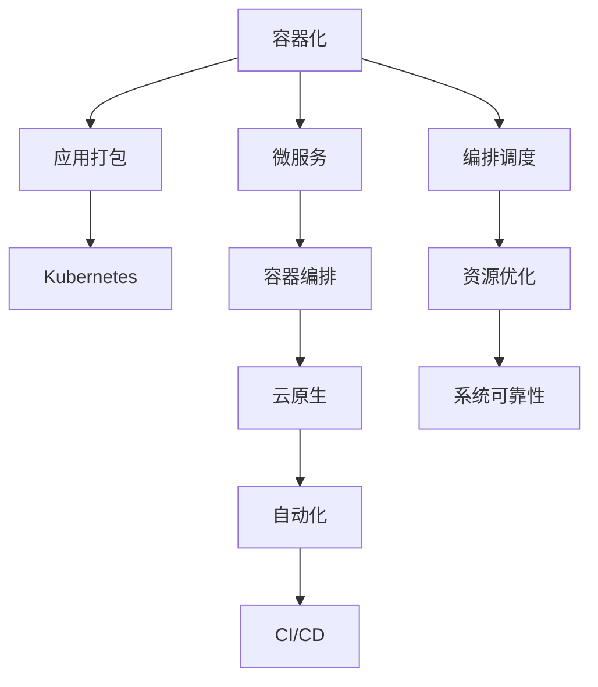

                 

# 容器化和 Kubernetes：管理应用程序部署

> 关键词：容器化, Kubernetes, Docker, 部署管理, 微服务, 云原生, 自动化, 编排调度

## 1. 背景介绍

### 1.1 问题由来
在过去的几十年中，软件开发和部署的方式经历了巨大的变革。早期的应用程序通常作为单一的可执行文件或库运行，直接部署在服务器上。随着软件复杂性的增加和规模的扩大，这种简单直白的部署方式逐渐难以满足需求。现代企业级应用程序通常由多个组件构成，这些组件需要跨越多个服务器和环境协同工作，才能正常运行。

对于这种复杂的分布式系统，传统部署方式存在诸多问题：

- **部署困难**：手动部署多个组件，容易出错，且耗时费力。
- **运维成本高**：由于部署和管理多个独立服务，运维成本显著增加。
- **系统扩展困难**：在需要扩展系统容量时，难以快速响应和调整。
- **资源利用率低**：在服务器上运行独立的服务，可能导致资源浪费。

面对这些问题，软件开发社区提出了“容器化”的概念，通过将应用程序及其依赖打包在一个容器内，实现应用程序的快速、可移植、高效部署和运维。随后，Kubernetes作为容器化应用的编排和管理平台，进一步完善了这一生态系统，大幅提升了应用部署和运维的效率和可靠性。

### 1.2 问题核心关键点
容器化和 Kubernetes 的核心在于：

- **容器化**：通过将应用程序及其依赖打包在容器内，实现应用程序的可移植性和高效运行。
- **Kubernetes**：一个开源的容器编排系统，通过定义应用配置文件和编排规则，实现应用的自动化部署、扩展、监控和管理。
- **微服务**：将应用程序拆分为多个独立的服务单元，每个服务单元可以独立部署、扩展和管理，提升系统的可维护性和可扩展性。
- **云原生**：基于容器化和 Kubernetes 构建的云原生应用程序，具有可移植性、弹性伸缩、自动化、持续集成/持续部署(CI/CD)等特性。
- **编排调度**：Kubernetes 通过定义和编排应用的资源请求、亲和性、反亲和性等调度策略，优化资源利用率，提升系统的可靠性和可用性。

这些核心概念之间的逻辑关系可以通过以下Mermaid流程图来展示：



这个流程图展示了几大核心概念及其之间的关系：

1. 容器化是应用部署的基础，通过将应用程序及其依赖打包在容器中，实现快速、可移植部署。
2. Kubernetes是容器化应用的管理和编排平台，通过定义应用配置文件和编排规则，实现自动化的部署和扩展。
3. 微服务将应用拆分为独立的服务单元，提升系统的可维护性和可扩展性。
4. 云原生基于容器化和 Kubernetes 构建的应用，具备可移植性、弹性伸缩、自动化、CI/CD 等特性。
5. 编排调度是 Kubernetes 的核心功能，通过定义资源请求、亲和性、反亲和性等调度策略，优化资源利用率，提升系统可靠性。

## 2. 核心概念与联系

### 2.1 核心概念概述

为更好地理解容器化和 Kubernetes 的核心概念，本节将介绍几个密切相关的核心概念：

- **容器化**：通过将应用程序及其依赖打包在容器内，实现应用程序的可移植性和高效运行。容器化是微服务架构的重要支撑，能够确保不同环境下的应用程序一致性。
- **Docker**：一个开源的容器化平台，支持多种操作系统和应用程序的打包、运行和分发。Docker 提供了统一的容器运行时和标准，简化了容器化过程。
- **Kubernetes**：一个开源的容器编排系统，通过定义应用配置文件和编排规则，实现应用的自动化部署、扩展、监控和管理。Kubernetes 支持多种平台和架构，是云原生应用的标准。
- **微服务**：将应用程序拆分为多个独立的服务单元，每个服务单元可以独立部署、扩展和管理，提升系统的可维护性和可扩展性。微服务架构是现代软件开发的重要趋势。
- **云原生**：基于容器化和 Kubernetes 构建的应用，具备可移植性、弹性伸缩、自动化、持续集成/持续部署(CI/CD)等特性。云原生是现代软件架构和部署的最佳实践。
- **编排调度**：Kubernetes 通过定义和编排应用的资源请求、亲和性、反亲和性等调度策略，优化资源利用率，提升系统的可靠性和可用性。

这些核心概念之间的逻辑关系可以通过以下Mermaid流程图来展示：


这个流程图展示了几大核心概念及其之间的关系：

1. 容器化是应用部署的基础，通过将应用程序及其依赖打包在容器中，实现快速、可移植部署。
2. Kubernetes是容器化应用的管理和编排平台，通过定义应用配置文件和编排规则，实现自动化的部署和扩展。
3. 微服务将应用拆分为独立的服务单元，提升系统的可维护性和可扩展性。
4. 云原生基于容器化和 Kubernetes 构建的应用，具备可移植性、弹性伸缩、自动化、CI/CD 等特性。
5. 编排调度是 Kubernetes 的核心功能，通过定义资源请求、亲和性、反亲和性等调度策略，优化资源利用率，提升系统可靠性。

## 3. 核心算法原理 & 具体操作步骤
### 3.1 算法原理概述

容器化和 Kubernetes 的核心算法原理主要体现在两个方面：容器化的实现和 Kubernetes 的编排调度。

#### 3.1.1 容器化实现

容器化通过将应用程序及其依赖打包在一个容器中，实现应用程序的可移植性和高效运行。容器的核心是命名空间和隔离机制，通过命名空间隔离容器与宿主机和其它容器的资源，确保容器内部运行环境的稳定性和可控性。容器内部的应用程序及其依赖，可以通过统一的标准和容器运行时进行管理和部署，简化应用程序的部署和维护。

#### 3.1.2 Kubernetes 编排调度

Kubernetes 通过定义和编排应用的资源请求、亲和性、反亲和性等调度策略，优化资源利用率，提升系统的可靠性和可用性。Kubernetes 的核心调度算法包括以下几个步骤：

1. **节点选择**：根据应用的资源请求和可用节点的资源情况，选择最合适的节点进行部署。
2. **Pod 分配**：将应用程序打包为多个 Pod，每个 Pod 包含一个或多个容器。根据 Pod 的资源请求和节点资源情况，选择最优的节点进行部署。
3. **任务调度**：在选定的节点上，启动 Pod 内部的容器，进行任务的实际运行。
4. **负载均衡**：通过定义亲和性和反亲和性策略，将相关的 Pod 分配到同一节点或不同节点，优化资源利用率。
5. **自动化管理**：通过定义自动伸缩、自动重启、自动扩展等规则，确保系统的稳定性和可用性。

### 3.2 算法步骤详解

#### 3.2.1 容器化实现步骤

1. **应用程序打包**：
   - 使用 Dockerfile 定义容器构建流程，列出所需依赖、构建步骤、环境配置等。
   - 通过 `docker build` 命令构建容器镜像，生成 Docker 镜像文件。

2. **容器部署**：
   - 使用 `docker run` 命令启动容器，指定镜像文件、运行参数等。
   - 容器内的应用程序及其依赖，通过统一的容器运行时进行管理和部署。

3. **容器编排**：
   - 使用 Kubernetes 的 Deployment 或 StatefulSet 等资源定义容器编排规则。
   - 通过 `kubectl apply` 命令将编排规则应用到 Kubernetes 集群。

#### 3.2.2 Kubernetes 编排调度步骤

1. **资源定义**：
   - 使用 Kubernetes 的 Deployment、DaemonSet、StatefulSet 等资源定义应用程序的编排规则。
   - 定义容器的资源请求和限制，确保容器的稳定运行和资源利用率。

2. **节点选择**：
   - 根据容器的资源请求和可用节点的资源情况，选择最合适的节点进行部署。
   - 使用 Kubernetes 的节点标签、节点资源、亲和性、反亲和性等策略，优化节点选择。

3. **Pod 分配**：
   - 将应用程序打包为多个 Pod，每个 Pod 包含一个或多个容器。
   - 根据 Pod 的资源请求和节点资源情况，选择最优的节点进行部署。

4. **任务调度**：
   - 在选定的节点上，启动 Pod 内部的容器，进行任务的实际运行。
   - 使用 Kubernetes 的副本控制、滚动更新、自动重启等规则，确保容器的稳定性和可用性。

5. **负载均衡**：
   - 通过定义亲和性和反亲和性策略，将相关的 Pod 分配到同一节点或不同节点，优化资源利用率。
   - 使用 Kubernetes 的服务和服务负载均衡策略，实现服务的负载均衡和流量调度。

### 3.3 算法优缺点

容器化和 Kubernetes 的核心算法原理具有以下优点：

- **可移植性**：通过容器化，应用程序及其依赖可以跨平台、跨环境部署，确保应用程序的一致性和稳定性。
- **高效性**：容器化简化了应用程序的部署和维护，提高了系统资源利用率和运行效率。
- **自动化**：Kubernetes 提供了自动化管理机制，通过定义编排规则和调度策略，确保系统的稳定性和可用性。
- **可扩展性**：Kubernetes 支持水平和垂直扩展，可以快速响应系统容量变化，满足业务需求。

同时，该算法原理也存在一定的局限性：

- **复杂性**：容器化和 Kubernetes 的部署和运维相对复杂，需要一定的技术储备和经验积累。
- **资源消耗**：容器化和 Kubernetes 的部署和运维需要一定的计算和存储资源，对系统资源有一定消耗。
- **学习曲线陡峭**：由于容器化和 Kubernetes 的部署和运维涉及多个概念和技术，需要一定的学习成本。

尽管存在这些局限性，但就目前而言，容器化和 Kubernetes 的算法原理仍是应用部署的最佳实践，广泛应用在企业级应用程序的构建和运维中。

### 3.4 算法应用领域

容器化和 Kubernetes 的核心算法原理在多个领域得到了广泛应用，包括但不限于：

- **云计算**：云原生应用的标准平台，提供自动化部署、扩展、监控和管理。
- **大数据**：通过容器化和 Kubernetes 的自动化和可扩展性，支持大数据的处理和分析。
- **微服务架构**：通过容器化和 Kubernetes 的微服务拆分和编排，提升系统的可维护性和可扩展性。
- **移动应用**：通过容器化和 Kubernetes 的自动化和可移植性，支持移动应用的构建和部署。
- **物联网**：通过容器化和 Kubernetes 的自动化和可扩展性，支持物联网设备的统一管理和调度。
- **游戏开发**：通过容器化和 Kubernetes 的自动化和可移植性，支持游戏服务的构建和部署。

这些核心算法原理的应用，极大地提升了应用程序的构建、部署和运维效率，推动了云计算和软件开发的现代化进程。

## 4. 数学模型和公式 & 详细讲解 & 举例说明

### 4.1 数学模型构建

容器化和 Kubernetes 的数学模型主要体现在资源管理和调度优化方面。

假设一个 Kubernetes 集群包含 $n$ 个节点，每个节点运行 $m$ 个容器，每个容器需要的 CPU 资源为 $c_i$，内存资源为 $m_i$。则集群的总资源限制为：

$$
\begin{aligned}
\text{CPU 总限制} &= \sum_{i=1}^{m} c_i \\
\text{内存总限制} &= \sum_{i=1}^{m} m_i 
\end{aligned}
$$

其中 $c_i$ 和 $m_i$ 分别表示容器 $i$ 的 CPU 和内存资源请求。

假设 Kubernetes 集群当前可用的 CPU 和内存资源分别为 $C_{\text{avail}}$ 和 $M_{\text{avail}}$。则容器在节点上的分配应满足以下约束条件：

$$
\begin{aligned}
c_i &\leq C_{\text{avail}} \\
m_i &\leq M_{\text{avail}}
\end{aligned}
$$

同时，为了优化资源利用率，可以使用亲和性和反亲和性策略，确保相同应用的容器在相同节点上运行，或不同节点上运行，以达到资源最优配置。

### 4.2 公式推导过程

以下我们以 CPU 资源为例，推导 Kubernetes 的资源请求和限制的数学模型。

假设集群中有一个节点 $N$，运行一个容器 $C$，容器 $C$ 的 CPU 资源请求为 $c$，集群当前的 CPU 资源总限制为 $C_{\text{avail}}$，节点 $N$ 当前可用的 CPU 资源为 $C_{N,\text{avail}}$。则节点 $N$ 上的 CPU 资源分配应满足以下约束条件：

$$
c \leq C_{N,\text{avail}} \leq C_{\text{avail}}
$$

假设容器 $C$ 的 CPU 资源限制为 $c_{\text{limit}}$，则容器的 CPU 资源使用情况应满足以下约束条件：

$$
0 \leq c \leq c_{\text{limit}}
$$

结合上述约束条件，Kubernetes 的 CPU 资源分配模型可表示为：

$$
\begin{aligned}
\min_{c} &\quad c \\
\text{s.t.} &\quad c \leq C_{N,\text{avail}} \\
&\quad C_{N,\text{avail}} \leq C_{\text{avail}} \\
&\quad 0 \leq c \leq c_{\text{limit}}
\end{aligned}
$$

通过求解上述线性规划问题，Kubernetes 可以自动计算出每个容器的最优 CPU 资源分配，确保容器的稳定运行和资源利用率。

### 4.3 案例分析与讲解

以下我们以一个简单的 Kubernetes 集群为例，分析资源请求和限制的计算过程。

假设一个 Kubernetes 集群包含两个节点 $N_1$ 和 $N_2$，每个节点运行一个容器 $C_1$ 和 $C_2$。容器 $C_1$ 和 $C_2$ 的 CPU 资源请求分别为 $c_1=1$ 和 $c_2=0.5$，集群当前的 CPU 资源总限制为 $C_{\text{avail}}=2$，节点 $N_1$ 和 $N_2$ 当前可用的 CPU 资源分别为 $C_{N_1,\text{avail}}=1.5$ 和 $C_{N_2,\text{avail}}=0.5$。

首先，节点 $N_1$ 上的容器 $C_1$ 的 CPU 资源分配应满足以下约束条件：

$$
c_1 \leq C_{N_1,\text{avail}} \leq C_{\text{avail}}
$$

由于 $c_1=1$，$C_{N_1,\text{avail}}=1.5$，且 $C_{\text{avail}}=2$，则容器 $C_1$ 可以完全运行在节点 $N_1$ 上，不会超出节点和集群的 CPU 资源限制。

其次，节点 $N_2$ 上的容器 $C_2$ 的 CPU 资源分配应满足以下约束条件：

$$
c_2 \leq C_{N_2,\text{avail}} \leq C_{\text{avail}}
$$

由于 $c_2=0.5$，$C_{N_2,\text{avail}}=0.5$，且 $C_{\text{avail}}=2$，则容器 $C_2$ 可以完全运行在节点 $N_2$ 上，不会超出节点和集群的 CPU 资源限制。

最后，根据容器 $C_1$ 和 $C_2$ 的 CPU 资源请求和限制，Kubernetes 可以计算出每个容器的最优 CPU 资源分配，确保容器的稳定运行和资源利用率。

通过上述案例分析，可以看到，Kubernetes 通过数学模型和算法，自动计算容器的最优资源分配，确保系统的稳定性和可用性。

## 5. 项目实践：代码实例和详细解释说明

### 5.1 开发环境搭建

在进行容器化和 Kubernetes 的实践前，我们需要准备好开发环境。以下是使用 Docker 和 Kubernetes 搭建开发环境的流程：

1. **安装 Docker**：从官网下载并安装 Docker，用于构建和运行容器镜像。
2. **安装 Kubernetes**：选择适合的 Kubernetes 发行版，如 Minikube、Rancher 等，进行安装和配置。
3. **安装 Helm**：使用 Helm 包管理器，方便管理 Kubernetes 应用和资源。
4. **安装其他工具**：安装 Git、IDE、Shell 等开发工具，用于代码管理和测试。

完成上述步骤后，即可在搭建好的开发环境中进行容器化和 Kubernetes 的实践。

### 5.2 源代码详细实现

这里我们以一个简单的 Kubernetes 应用为例，展示其部署和运行过程。

首先，定义应用程序的 Dockerfile：

```dockerfile
# 定义应用程序的构建环境
FROM python:3.7-slim
WORKDIR /app
COPY requirements.txt requirements.txt
RUN pip install -r requirements.txt

# 应用程序的源代码
COPY . .

# 应用程序的入口文件
CMD ["python", "app.py"]
```

其次，使用 `docker build` 命令构建容器镜像：

```bash
docker build -t my-app .
```

然后，在 Kubernetes 集群上部署应用。使用 Helm 管理工具，创建应用的 Helm Chart：

```yaml
apiVersion: v1
app:
  name: my-app
  image:
    repository: my-registry/my-app
    tag: v1.0.0
  resources:
    limits:
      cpu: 1
      memory: 512Mi
    requests:
      cpu: 0.5
      memory: 256Mi
```

使用 `kubectl apply` 命令将 Helm Chart 应用到 Kubernetes 集群：

```bash
kubectl apply -f my-app-chart.yaml
```

最后，通过 `kubectl` 命令查看应用的运行状态：

```bash
kubectl get pods
```

以上是使用 Docker 和 Kubernetes 进行简单应用部署的完整代码实现。可以看到，使用 Helm 管理工具简化了应用的部署和维护过程，大大提升了工作效率。

### 5.3 代码解读与分析

让我们再详细解读一下关键代码的实现细节：

**Dockerfile**：
- 使用 Python 3.7-slim 作为基础镜像。
- 设置工作目录为 `/app`。
- 从 `requirements.txt` 文件中安装依赖包。
- 将应用程序源代码复制到容器中。
- 设置应用程序的入口文件为 `app.py`。

**Helm Chart**：
- 定义应用程序的标签和版本。
- 使用容器镜像仓库和标签信息。
- 定义容器的资源请求和限制。

**kubectl apply** 命令：
- 将 Helm Chart 应用到 Kubernetes 集群，创建相应的 Pod、Service 等资源。

**kubectl get pods** 命令：
- 查看集群中的 Pod 运行状态，确保应用程序的正常运行。

通过上述代码实现，可以看到，Docker 和 Kubernetes 的实践过程简洁高效，通过简单的配置文件和命令，即可实现应用程序的自动化部署和运维。

## 6. 实际应用场景
### 6.1 云计算

云计算是容器化和 Kubernetes 应用的主要场景之一。云平台提供标准的容器化和 Kubernetes 部署环境，支持自动化和可扩展的应用管理。企业可以在云平台上快速部署和扩展应用程序，减少基础设施和运维成本，提升业务响应速度。

在云平台上，Kubernetes 提供了自动化的容器编排和管理机制，支持多租户、高可用性、弹性伸缩等特性，满足企业级应用程序的复杂需求。例如，通过 Kubernetes 的自动伸缩规则，云平台可以根据实际负载自动调整容器数量，确保系统的稳定性和资源利用率。

### 6.2 大数据

大数据处理和分析是容器化和 Kubernetes 的另一个重要应用场景。大数据系统通常由多个组件构成，包括数据采集、存储、处理、分析等环节，每个组件都可以通过容器化进行独立部署和管理。

在容器化的大数据系统中，Kubernetes 提供了自动化和可扩展的资源管理机制，支持跨节点、跨环境的容器部署和调度。例如，通过 Kubernetes 的服务和服务负载均衡策略，大数据系统可以实现高可用性和弹性伸缩，满足业务需求的变化。

### 6.3 微服务架构

微服务架构是现代软件开发的重要趋势，通过将应用程序拆分为多个独立的服务单元，提升系统的可维护性和可扩展性。容器化和 Kubernetes 是微服务架构的核心支撑，通过容器化和 Kubernetes 的微服务拆分和编排，实现微服务的自动化部署、扩展和运维。

在微服务架构中，Kubernetes 提供了自动化和可扩展的微服务管理机制，支持跨节点、跨环境的微服务部署和调度。例如，通过 Kubernetes 的自动伸缩规则，微服务系统可以根据实际负载自动调整服务数量，确保系统的稳定性和可用性。

### 6.4 未来应用展望

随着容器化和 Kubernetes 技术的不断演进，未来将会有更多的应用场景得到广泛应用，为各行各业带来变革性影响。

在智慧医疗领域，基于容器化和 Kubernetes 的微服务架构，可以构建智能医疗系统，提升医疗服务的智能化水平，辅助医生诊疗，加速新药开发进程。

在智能教育领域，微服务架构可以应用于作业批改、学情分析、知识推荐等方面，因材施教，促进教育公平，提高教学质量。

在智慧城市治理中，微服务架构可以应用于城市事件监测、舆情分析、应急指挥等环节，提高城市管理的自动化和智能化水平，构建更安全、高效的未来城市。

此外，在企业生产、社会治理、文娱传媒等众多领域，容器化和 Kubernetes 的应用也将不断涌现，为传统行业数字化转型升级提供新的技术路径。相信随着技术的日益成熟，容器化和 Kubernetes 必将在构建人机协同的智能时代中扮演越来越重要的角色。

## 7. 工具和资源推荐
### 7.1 学习资源推荐

为了帮助开发者系统掌握容器化和 Kubernetes 的核心技术，这里推荐一些优质的学习资源：

1. **《Kubernetes权威指南》**：一本详细介绍 Kubernetes 的书籍，涵盖 Kubernetes 的核心概念、设计原则、部署实践等，是学习 Kubernetes 的必备资料。
2. **Kubernetes 官方文档**：Kubernetes 的官方文档提供了完整的 Kubernetes 安装、配置、使用指南，是学习 Kubernetes 的重要参考资料。
3. **Docker 官方文档**：Docker 的官方文档提供了完整的 Docker 安装、使用、开发指南，是学习 Docker 的重要参考资料。
4. **《Docker 实战》**：一本详细介绍 Docker 的书籍，涵盖 Docker 的核心概念、实践技巧、开发实践等，是学习 Docker 的必备资料。
5. **《微服务设计与架构》**：一本详细介绍微服务架构的书籍，涵盖微服务架构的核心概念、设计原则、实践技巧等，是学习微服务架构的重要参考资料。
6. **Kubernetes 实战课程**：Coursera 等平台提供的 Kubernetes 实战课程，通过实际项目案例，深入浅出地介绍 Kubernetes 的部署和运维实践。

通过对这些资源的学习实践，相信你一定能够快速掌握容器化和 Kubernetes 的核心技术，并用于解决实际的工程问题。

### 7.2 开发工具推荐

高效的开发离不开优秀的工具支持。以下是几款用于容器化和 Kubernetes 开发的常用工具：

1. **Docker**：一个开源的容器化平台，支持多种操作系统和应用程序的打包、运行和分发。Docker 提供了统一的容器运行时和标准，简化了容器化过程。
2. **Kubernetes**：一个开源的容器编排系统，通过定义应用配置文件和编排规则，实现应用的自动化部署、扩展、监控和管理。Kubernetes 支持多种平台和架构，是云原生应用的标准。
3. **Helm**：一个 Kubernetes 的包管理器，支持 Helm Chart 的应用管理和资源配置，简化 Kubernetes 的应用部署和运维。
4. **Prometheus**：一个开源的监控系统，支持容器化和 Kubernetes 的监控和报警机制，帮助系统管理者及时发现和解决运行问题。
5. **Fluentd**：一个开源的日志系统，支持容器化和 Kubernetes 的日志收集和处理，确保系统的可靠性和可维护性。
6. **Knative**：一个开源的容器编排系统，支持 Kubernetes 的自动化和可扩展性，支持无服务器架构和事件驱动编程模型。

合理利用这些工具，可以显著提升容器化和 Kubernetes 的开发效率，加快创新迭代的步伐。

### 7.3 相关论文推荐

容器化和 Kubernetes 技术的演进源于学界的持续研究。以下是几篇奠基性的相关论文，推荐阅读：

1. **《Docker: The Union of Unified Logging, Networking, and Process Isolation》**：Docker 的创始人 Benoîf Lange 和 Younes Makrii 在 OSDI 2013 上发表的论文，介绍 Docker 容器的设计思想和实现原理。
2. **《Kubernetes: Beyond Open Source》**：Google 的 Michael McClean 在 Google I/O 2015 上发布的演讲，详细介绍 Kubernetes 的架构设计和应用实践。
3. **《Microservices: A Three-Tier Design Pattern》**：Jay Ponnappa 和 Anant Narayanaswamy 在 O’Reilly 上发表的论文，介绍微服务架构的核心概念和设计原则。
4. **《Cloud-Native Computing Foundation》**：由多个组织共同发起的云原生计算基金会，致力于推动云原生架构和技术的普及和标准化。
5. **《Pod and Services: the Simplest Backend in Kubernetes》**：Kubernetes 的创始人 Brendan Burns 和 Bruce Adams 在 KubeCon 2016 上发布的演讲，详细介绍 Pod 和 Service 的设计思想和实现原理。
6. **《Cloud-Native Microservices at Scale》**：Kubernetes 的开发者 Mikearn Swihart 在 KubeCon 2019 上发布的演讲，详细介绍 Kubernetes 在微服务架构中的应用实践。

这些论文代表了大容器化和 Kubernetes 技术的演进脉络。通过学习这些前沿成果，可以帮助研究者把握技术前进方向，激发更多的创新灵感。

## 8. 总结：未来发展趋势与挑战

### 8.1 总结

本文对容器化和 Kubernetes 的核心技术进行了全面系统的介绍。首先阐述了容器化和 Kubernetes 的应用背景和核心概念，明确了容器化和 Kubernetes 在现代软件开发和部署中的重要地位。其次，从原理到实践，详细讲解了容器化和 Kubernetes 的数学模型和关键步骤，给出了容器化和 Kubernetes 的完整代码实例。同时，本文还广泛探讨了容器化和 Kubernetes 在云计算、大数据、微服务架构等多个领域的应用前景，展示了容器化和 Kubernetes 技术的广泛适用性和强大威力。此外，本文精选了容器化和 Kubernetes 的学习资源，力求为读者提供全方位的技术指引。

通过本文的系统梳理，可以看到，容器化和 Kubernetes 的核心技术正在成为现代软件开发和部署的最佳实践，极大地提升了应用程序的构建、部署和运维效率，推动了云计算和软件开发的现代化进程。未来，伴随容器化和 Kubernetes 技术的不断演进，相信其必将在更多领域得到广泛应用，为各行各业带来变革性影响。

### 8.2 未来发展趋势

展望未来，容器化和 Kubernetes 技术将呈现以下几个发展趋势：

1. **Kubernetes 的普及**：随着容器化和 Kubernetes 技术的不断普及，越来越多的企业将采用 Kubernetes 进行应用程序的部署和运维，推动 Kubernetes 技术的进一步成熟和完善。
2. **云原生架构的普及**：基于容器化和 Kubernetes 构建的云原生架构，将逐渐成为企业级应用程序的标准，推动云原生应用的进一步发展。
3. **微服务架构的普及**：微服务架构将继续流行，成为现代软件开发的重要趋势。容器化和 Kubernetes 是微服务架构的核心支撑，将为微服务架构提供更高效、更可靠的部署和运维机制。
4. **自动化和可扩展性**：容器化和 Kubernetes 将继续提升自动化和可扩展性，支持更复杂的应用场景和更高的业务需求。
5. **边缘计算的普及**：随着边缘计算的兴起，容器化和 Kubernetes 将逐渐支持边缘计算场景，支持在本地设备上部署和运行容器化应用。
6. **开源社区的壮大**：开源社区将继续推动容器化和 Kubernetes 技术的发展，提供更丰富、更灵活的解决方案，推动容器化和 Kubernetes 技术的普及和应用。

以上趋势凸显了容器化和 Kubernetes 技术的广阔前景。这些方向的探索发展，必将进一步提升容器化和 Kubernetes 的性能和应用范围，为软件开发和部署带来新的机遇和挑战。

### 8.3 面临的挑战

尽管容器化和 Kubernetes 技术已经取得了显著的进展，但在迈向更加智能化、普适化应用的过程中，它仍面临诸多挑战：

1. **学习成本**：容器化和 Kubernetes 的部署和运维涉及多个概念和技术，需要一定的学习成本。
2. **资源消耗**：容器化和 Kubernetes 的部署和运维需要一定的计算和存储资源，对系统资源有一定消耗。
3. **兼容性问题**：不同版本的容器化和 Kubernetes 可能存在兼容性问题，需要维护和管理。
4. **安全性问题**：容器化和 Kubernetes 的部署和运维涉及多个环节，安全风险不容忽视。
5. **维护成本**：容器化和 Kubernetes 的部署和运维需要持续维护和更新，增加了维护成本。
6. **容器镜像管理**：容器镜像的管理和分发需要一定的技术和资源支持，增加了容器化部署的复杂性。

尽管存在这些挑战，但容器化和 Kubernetes 技术的演进方向明确，业界对容器化和 Kubernetes 技术的投入不断增加，相信这些问题终将逐步解决。容器化和 Kubernetes 必将在构建人机协同的智能时代中扮演越来越重要的角色。

### 8.4 研究展望

面对容器化和 Kubernetes 技术所面临的挑战，未来的研究需要在以下几个方面寻求新的突破：

1. **容器镜像的优化**：开发更高效的容器镜像压缩和存储技术，减少容器镜像的大小和传输时间，提升容器化部署的效率。
2. **自动化和可扩展性**：开发更智能的容器编排和调度算法，支持更复杂的应用场景和更高的业务需求。
3. **安全性**：开发更安全的容器化和 Kubernetes 部署和运维机制，确保系统的可靠性和安全性。
4. **边缘计算的支持**：开发支持边缘计算的容器化和 Kubernetes 技术，支持在本地设备上部署和运行容器化应用。
5. **开源社区的壮大**：继续推动容器化和 Kubernetes 技术的发展，提供更丰富、更灵活的解决方案，推动容器化和 Kubernetes 技术的普及和应用。

这些研究方向的探索，必将引领容器化和 Kubernetes 技术的不断演进，为构建安全、可靠、可扩展的云原生应用铺平道路。面向未来，容器化和 Kubernetes 技术还需要与其他人工智能技术进行更深入的融合，如知识表示、因果推理、强化学习等，多路径协同发力，共同推动容器化和 Kubernetes 技术的进步。

## 9. 附录：常见问题与解答

**Q1：容器化对应用程序有什么好处？**

A: 容器化对应用程序有以下好处：
1. 可移植性：容器化将应用程序及其依赖打包在一个容器中，确保在不同环境中的一致性和稳定性。
2. 高效性：容器化简化了应用程序的部署和维护，提高了系统资源利用率和运行效率。
3. 自动化：容器化和 Kubernetes 提供了自动化管理机制，支持应用的自动化部署、扩展、监控和管理。
4. 可扩展性：容器化和 Kubernetes 支持应用的弹性伸缩，可以快速响应系统容量变化，满足业务需求。

**Q2：Kubernetes 的编排调度算法有哪些？**

A: Kubernetes 的编排调度算法包括以下几个关键步骤：
1. 节点选择：根据应用的资源请求和可用节点的资源情况，选择最合适的节点进行部署。
2. Pod 分配：将应用程序打包为多个 Pod，每个 Pod 包含一个或多个容器。根据 Pod 的资源请求和节点资源情况，选择最优的节点进行部署。
3. 任务调度：在选定的节点上，启动 Pod 内部的容器，进行任务的实际运行。
4. 负载均衡：通过定义亲和性和反亲和性策略，将相关的 Pod 分配到同一节点或不同节点，优化资源利用率。
5. 自动化管理：通过定义自动伸缩、自动重启、自动扩展等规则，确保系统的稳定性和可用性。

Kubernetes 的调度算法核心在于资源优化和系统可靠性，通过定义资源请求、亲和性、反亲和性等调度策略，优化资源利用率，提升系统的可靠性和可用性。

**Q3：Kubernetes 的资源请求和限制是什么？**

A: Kubernetes 的资源请求和限制通过定义 Pod 的资源请求和限制来实现。资源请求和限制包括 CPU 和内存资源，具体如下：
1. 资源请求：Pod 需要获取的最小资源量，确保 Pod 能够正常运行。
2. 资源限制：Pod 能够使用的最大资源量，防止 Pod 过度消耗资源，导致系统不稳定。

例如，Pod 的 CPU 资源请求为 1，资源限制为 2，表示 Pod 需要至少 1 个 CPU 资源才能正常运行，但 CPU 资源的使用不能超过 2 个。

通过定义资源请求和限制，Kubernetes 可以自动计算容器的最优资源分配，确保容器的稳定运行和资源利用率。

**Q4：什么是容器镜像？**

A: 容器镜像是一个包含了应用程序及其依赖的文件包，支持快速部署和运行。容器镜像通常包含应用程序的源代码、编译依赖、运行环境、配置文件等，是一个完整的系统镜像。

通过使用容器镜像，应用程序的部署和运维变得简洁高效，可以避免在多个环境中手动安装和配置应用的复杂过程。容器镜像支持跨平台、跨环境的部署，确保应用程序的一致性和稳定性。

**Q5：什么是 Helm？**

A: Helm 是一个 Kubernetes 的包管理器，用于管理和部署 Kubernetes 应用和资源。Helm 通过定义 Helm Chart，提供了一种统一的打包、部署和管理机制，简化了 Kubernetes 的部署和运维过程。

Helm Chart 是一个包含 Kubernetes 资源配置的模板文件，可以包含 Pod、Service、Deployment、ConfigMap、Secret 等多种资源定义。通过 Helm 工具，可以快速构建、部署和升级 Helm Chart，实现 Kubernetes 应用的自动化管理。

---

作者：禅与计算机程序设计艺术 / Zen and the Art of Computer Programming

