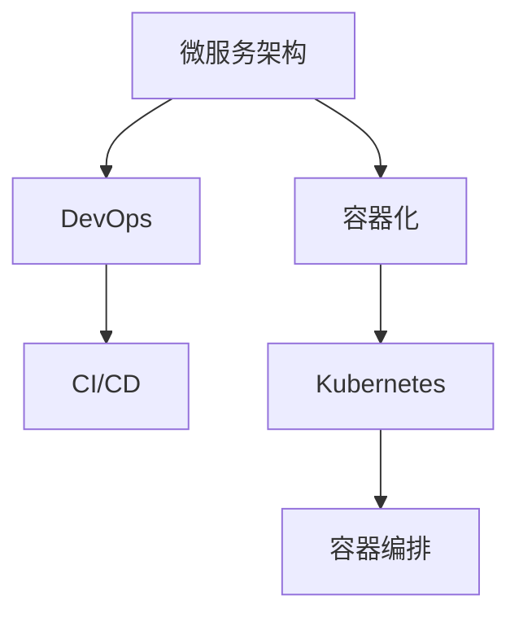

                 

# 容器化微服务：简化部署和扩展

> 关键词：容器化,微服务,DevOps,CI/CD,容器编排

## 1. 背景介绍

随着互联网应用的快速迭代和用户需求的多样化，传统的单体架构已无法适应复杂的业务场景。为了提升系统的可扩展性和可维护性，微服务架构应运而生。然而，微服务的部署和管理又带来了新的挑战，如版本管理、资源调度和跨节点通信等问题。为了解决这些问题，容器化技术应运而生，为微服务的自动化管理和快速扩展提供了新的解决方案。本文将系统地介绍容器化微服务，探讨其原理、步骤和应用，为开发者提供一份全面的技术指南。

## 2. 核心概念与联系

### 2.1 核心概念概述

为更好地理解容器化微服务，本节将介绍几个密切相关的核心概念：

- **微服务架构(Microservices Architecture)**：将应用程序拆分为多个小型、独立的服务，每个服务负责特定功能，可以独立部署和扩展。微服务架构能提升系统的灵活性和扩展性。

- **容器化(Containerization)**：将应用程序及其依赖打包到一个独立的、可移植的运行时环境中，称为容器。容器化能提升应用的跨平台部署能力和资源利用效率。

- **Docker**：一种流行的容器化解决方案，提供了一个统一的容器运行时环境，能够封装、分发、运行应用。Docker极大地简化了容器化流程。

- **Kubernetes(K8s)**：一个开源的容器编排系统，能够自动部署、扩展和管理容器化应用，支持跨集群资源管理。Kubernetes成为微服务架构的主要支撑平台。

- **DevOps**：一种软件开发和运维的集成方法论，强调自动化、持续集成(CI)、持续部署(CD)和持续监控，提升开发和运维效率。

- **CI/CD**：持续集成和持续部署的简称，是指通过自动化工具链，实现代码的自动化构建、测试和部署。CI/CD是DevOps的核心实践。

- **容器编排**：通过编排工具管理容器的生命周期，包括创建、启动、更新和销毁等操作。容器编排工具能够自动化地处理容器间的通信、资源调度等问题。

这些核心概念之间的逻辑关系可以通过以下Mermaid流程图来展示：



这个流程图展示了几大核心概念之间的联系：

1. 微服务架构通过拆分应用功能，提升了系统的灵活性和扩展性。
2. 容器化通过将应用及其依赖封装在容器中，实现了应用的跨平台部署和资源利用效率。
3. DevOps和CI/CD通过自动化工具链，提升了开发和运维的效率。
4. Kubernetes和容器编排通过自动化管理容器，进一步简化了微服务的部署和扩展。

这些概念共同构成了容器化微服务的技术框架，使得微服务架构能够更好地适应复杂业务场景，提升开发和运维效率。

## 3. 核心算法原理 & 具体操作步骤

### 3.1 算法原理概述

容器化微服务的核心原理是将微服务及其依赖打包到容器中，通过容器编排系统统一管理和调度。其核心思想是：

1. **封装**：将应用程序及其依赖打包到一个独立的运行时环境，即容器。容器化能保证应用在任意环境下的一致性。
2. **抽象**：通过容器编排系统，抽象出应用的运行环境，自动化管理容器的生命周期。
3. **隔离**：通过容器技术，实现应用之间的隔离，避免相互干扰。

容器化微服务的关键步骤如下：

1. 将微服务及其依赖打包到Docker容器中。
2. 使用Kubernetes等容器编排系统管理容器的部署和扩展。
3. 通过CI/CD流水线自动化构建、测试和部署容器化应用。
4. 通过DevOps工具链实现应用监控、日志收集和告警等功能。

### 3.2 算法步骤详解

以下是容器化微服务的详细操作步骤：

**Step 1: 容器化开发环境搭建**

1. 安装Docker：从官网下载并安装Docker，确保能够正常运行。
2. 安装Docker Compose：Docker Compose是Docker生态中重要的工具，用于编排多个Docker容器。
3. 安装Kubernetes：从官网下载并安装Kubernetes，确保能够正常运行。
4. 安装Kubectl：Kubectl是Kubernetes的命令行工具，用于管理Kubernetes集群。

**Step 2: 编写Dockerfile和Docker Compose文件**

1. 编写Dockerfile文件：Dockerfile是一个文本文件，用于定义容器的构建过程。
2. 编写Docker Compose文件：Docker Compose文件用于编排多个Docker容器，定义它们之间的依赖关系。

**Step 3: 构建和运行容器**

1. 构建容器镜像：在本地构建Docker镜像。
2. 运行容器：启动Docker容器，并访问容器内部的应用。

**Step 4: 使用Kubernetes编排容器**

1. 部署Kubernetes集群：在本地或云平台上部署Kubernetes集群。
2. 编写Kubernetes配置文件：定义KubernetesPod、Service等资源对象。
3. 启动Kubernetes容器：使用kubectl命令行工具启动Kubernetes容器，并监控其运行状态。

**Step 5: 集成CI/CD流程**

1. 安装CI/CD工具：安装Jenkins、GitLab CI等CI/CD工具。
2. 配置CI/CD流水线：定义自动化构建、测试和部署的步骤。
3. 自动化容器构建和部署：通过CI/CD工具自动化容器构建、测试和部署流程。

**Step 6: 实现DevOps自动化**

1. 配置DevOps工具：安装Slack、PagerDuty等DevOps工具。
2. 集成日志和监控：集成日志收集和监控工具，实时监控容器化应用的运行状态。
3. 实现告警机制：配置告警规则，一旦应用出现异常，及时通知相关人员。

### 3.3 算法优缺点

容器化微服务具有以下优点：

1. **简化部署**：容器化封装了应用的依赖关系，能够跨平台部署。
2. **提高效率**：自动化容器编排和管理，提升了应用部署和扩展的效率。
3. **资源利用**：容器化提升了应用资源的利用率，避免了资源的浪费。
4. **增强可维护性**：应用拆分为多个服务，提升了系统的可维护性。

同时，容器化微服务也存在一些缺点：

1. **复杂性**：容器化微服务的架构复杂性较高，需要团队具备丰富的容器化经验。
2. **学习成本**：容器化微服务的概念和工具较多，需要时间成本进行学习和掌握。
3. **运维挑战**：容器编排和管理需要专业运维人员，运维成本较高。

尽管存在这些缺点，但就目前而言，容器化微服务已成为应用开发的主流范式。未来相关研究的重点在于如何进一步降低容器化微服务的复杂性，提升其易用性和可维护性，同时兼顾高效部署和快速扩展。

### 3.4 算法应用领域

容器化微服务已经在金融、电商、社交媒体、游戏等多个领域得到了广泛的应用，成为构建复杂应用系统的重要手段。

- **金融行业**：通过微服务架构提升系统的灵活性和可扩展性，支持高频交易和实时计算。
- **电商行业**：通过微服务架构和容器化技术，提升电商平台的稳定性和可扩展性，支持海量订单处理和快速扩展。
- **社交媒体**：通过微服务架构和容器化技术，支持社交媒体平台的多媒体处理和快速扩展。
- **游戏行业**：通过微服务架构和容器化技术，提升游戏服务的稳定性和可扩展性，支持游戏的高并发和大规模部署。

除了这些行业外，容器化微服务也被创新性地应用到更多场景中，如智能合约、物联网、智能制造等，为各行各业带来了新的技术突破。

## 4. 数学模型和公式 & 详细讲解 & 举例说明

### 4.1 数学模型构建

本节将使用数学语言对容器化微服务过程进行更加严格的刻画。

假设一个微服务架构包含N个微服务，每个微服务都可以打包为一个Docker容器。容器化微服务的数学模型可以描述为：

$$
\begin{aligned}
M &= \{M_1, M_2, \dots, M_N\} \\
M_i &= \{C_i, S_i\}, \quad \forall i \in [1, N] \\
C_i &= C_{i_0} + C_{i_1} + \dots + C_{i_k} \\
S_i &= S_{i_0} + S_{i_1} + \dots + S_{i_k}
\end{aligned}
$$

其中 $M$ 为微服务集合，$M_i$ 为第 $i$ 个微服务，包含容器 $C_i$ 和依赖服务 $S_i$。容器 $C_i$ 和依赖服务 $S_i$ 都可以是多个容器的组合。

### 4.2 公式推导过程

以下我们以容器编排为例，推导Kubernetes的Pod和Service配置文件。

Pod是Kubernetes中最小的部署单元，包含一个或多个容器。Pod的配置文件可以描述为：

```yaml
apiVersion: v1
kind: Pod
metadata:
  name: db
  labels:
    hello: world
spec:
  containers:
    - name: mysql
      image: mysql:5.7
      ports:
        - containerPort: 3306
      env:
        - name: MYSQL_ROOT_PASSWORD
          value: "123456"
```

Service是Kubernetes中用于网络访问的抽象，可以定义容器之间的访问规则。Service的配置文件可以描述为：

```yaml
apiVersion: v1
kind: Service
metadata:
  name: db
spec:
  selector:
    hello: world
  ports:
    - protocol: TCP
      port: 3306
      targetPort: 3306
```

将上述两个配置文件合并，即可定义一个包含Pod和Service的Kubernetes集群。这个集群包含了名为 db 的MySQL数据库服务，通过环境变量设置MySQL的root密码，并通过Service对外暴露端口3306。

### 4.3 案例分析与讲解

以下是一个简单的案例，展示如何使用Docker和Kubernetes实现容器化微服务。

**案例描述**：假设有一个Web应用，包含一个MySQL数据库和一个前端服务。通过容器化和Kubernetes实现Web应用的自动化部署和扩展。

**步骤**：

1. 编写Dockerfile文件，定义Web应用和MySQL数据库的构建过程。
2. 编写Docker Compose文件，定义Web应用和MySQL数据库的依赖关系。
3. 构建Docker镜像，并启动Docker容器。
4. 编写Kubernetes配置文件，定义Pod和Service的配置。
5. 启动Kubernetes集群，并部署Pod和Service。
6. 配置CI/CD流水线，自动化容器构建和部署。
7. 配置DevOps工具，实现日志和监控。

以下是一个示例代码，展示Docker Compose和Kubernetes配置文件：

**Docker Compose文件**：

```yaml
version: '3'
services:
  web:
    build: .
    ports:
      - "8080:8080"
    depends_on:
      - db
  db:
    image: mysql:5.7
    environment:
      MYSQL_ROOT_PASSWORD: "123456"
```

**Kubernetes配置文件**：

```yaml
apiVersion: v1
kind: Service
metadata:
  name: db
spec:
  selector:
    hello: world
  ports:
    - protocol: TCP
      port: 3306
      targetPort: 3306
```

**示例代码解释**：

- `Docker Compose`文件定义了两个服务：`web`和`db`。`web`服务通过 `build` 指令构建Docker镜像，并通过 `ports` 指令暴露8080端口。`db`服务使用 `image` 指令指定MySQL镜像，并通过 `environment` 指令设置MySQL的root密码。
- `Kubernetes`配置文件定义了一个名为 `db` 的服务，通过 `selector` 指令选择 `hello: world` 的Pod，并通过 `ports` 指令暴露3306端口。

通过上述配置，Docker和Kubernetes能自动部署和管理Web应用和MySQL数据库，实现了容器化微服务的自动化管理。

## 5. 项目实践：代码实例和详细解释说明

### 5.1 开发环境搭建

在进行容器化微服务实践前，我们需要准备好开发环境。以下是使用Linux和Docker进行Kubernetes开发的环境配置流程：

1. 安装Docker：从官网下载并安装Docker，确保能够正常运行。
2. 安装Kubernetes：从官网下载并安装Kubernetes，确保能够正常运行。
3. 安装kubectl：Kubectl是Kubernetes的命令行工具，用于管理Kubernetes集群。
4. 配置kubectl：通过 `kubectl config` 命令配置kubectl与Kubernetes集群的连接。

完成上述步骤后，即可在本地环境中开始容器化微服务实践。

### 5.2 源代码详细实现

下面我们以Web应用和MySQL数据库的容器化微服务为例，给出使用Docker和Kubernetes进行容器编排的Python代码实现。

首先，编写Dockerfile文件：

```dockerfile
# 定义Python 3.8镜像
FROM python:3.8-slim

# 安装依赖
RUN apt-get update && apt-get install -y \
    build-essential \
    libpq-dev \
    libffi-dev \
    libssl-dev \
    libjpeg-dev \
    libpng-dev \
    zlib1g-dev \
    unzip \
    && apt-get clean \
    && rm -rf /var/lib/apt/lists/*

# 安装依赖包
COPY requirements.txt /app/
RUN pip install --no-cache-dir -r requirements.txt

# 构建应用
WORKDIR /app
COPY . /app

# 定义启动脚本
COPY start.sh /app/

# 启动应用
CMD ["sh", "start.sh"]
```

然后，编写Docker Compose文件：

```yaml
version: '3'
services:
  web:
    build: .
    ports:
      - "8080:8080"
    depends_on:
      - db
  db:
    image: mysql:5.7
    environment:
      MYSQL_ROOT_PASSWORD: "123456"
```

接下来，编写Kubernetes配置文件：

```yaml
apiVersion: v1
kind: Service
metadata:
  name: db
spec:
  selector:
    hello: world
  ports:
    - protocol: TCP
      port: 3306
      targetPort: 3306
```

最后，启动Docker容器和Kubernetes集群：

```bash
# 构建Docker镜像
docker build -t web .

# 启动Docker容器
docker run -d --name web -p 8080:8080 web

# 启动Kubernetes集群
kubectl apply -f db.yaml
kubectl apply -f compose.yaml

# 测试应用
curl http://localhost:8080
```

以上就是使用Docker和Kubernetes进行容器化微服务的完整代码实现。可以看到，通过简单的Dockerfile和Docker Compose文件，以及Kubernetes配置文件，我们就实现了Web应用和MySQL数据库的自动化部署和扩展。

### 5.3 代码解读与分析

让我们再详细解读一下关键代码的实现细节：

**Dockerfile文件**：
- 从Python 3.8镜像开始构建，安装必要的依赖包。
- 复制应用代码和依赖包，并定义启动脚本。
- 定义应用启动命令。

**Docker Compose文件**：
- 定义两个服务：`web`和`db`。
- `web`服务通过 `build` 指令构建Docker镜像，并通过 `ports` 指令暴露8080端口。
- `db`服务使用 `image` 指令指定MySQL镜像，并通过 `environment` 指令设置MySQL的root密码。

**Kubernetes配置文件**：
- 定义一个名为 `db` 的服务，通过 `selector` 指令选择 `hello: world` 的Pod，并通过 `ports` 指令暴露3306端口。

这些配置文件清晰地展示了容器化微服务的自动化部署过程，使得Web应用和MySQL数据库能够无缝集成并协同工作。

## 6. 实际应用场景

### 6.1 金融行业

在金融行业，微服务架构和容器化技术被广泛应用于高频交易、实时计算和风险控制等场景。通过容器化微服务，金融企业能够快速部署和扩展应用，提升系统的稳定性和可靠性。

具体应用场景包括：

- **高频交易系统**：通过微服务架构和容器化技术，支持高并发和大规模的交易处理。
- **实时计算系统**：通过微服务架构和容器化技术，支持实时数据处理和分析。
- **风险控制系统**：通过微服务架构和容器化技术，支持复杂的风险评估和控制。

通过容器化微服务，金融企业能够实现应用的快速迭代和扩展，提升系统的稳定性和可靠性，更好地应对业务需求的变化。

### 6.2 电商行业

在电商行业，微服务架构和容器化技术被广泛应用于订单处理、库存管理和支付结算等场景。通过容器化微服务，电商企业能够提升系统的可扩展性和稳定性，支持大规模的业务扩展。

具体应用场景包括：

- **订单处理系统**：通过微服务架构和容器化技术，支持高并发的订单处理和配送管理。
- **库存管理系统**：通过微服务架构和容器化技术，支持库存信息的实时管理和监控。
- **支付结算系统**：通过微服务架构和容器化技术，支持复杂的支付结算和风控控制。

通过容器化微服务，电商企业能够实现应用的快速迭代和扩展，提升系统的可扩展性和稳定性，更好地应对业务需求的变化。

### 6.3 社交媒体

在社交媒体行业，微服务架构和容器化技术被广泛应用于用户管理、内容发布和社交互动等场景。通过容器化微服务，社交媒体平台能够提升系统的稳定性和可扩展性，支持多样化的业务需求。

具体应用场景包括：

- **用户管理系统**：通过微服务架构和容器化技术，支持大规模用户管理和身份验证。
- **内容发布系统**：通过微服务架构和容器化技术，支持多样化的内容发布和审核。
- **社交互动系统**：通过微服务架构和容器化技术，支持复杂的社交互动和数据处理。

通过容器化微服务，社交媒体平台能够实现应用的快速迭代和扩展，提升系统的稳定性和可扩展性，更好地应对业务需求的变化。

### 6.4 游戏行业

在游戏行业，微服务架构和容器化技术被广泛应用于游戏服务、排行榜和社交互动等场景。通过容器化微服务，游戏企业能够提升系统的稳定性和可扩展性，支持高并发和大规模的游戏服务。

具体应用场景包括：

- **游戏服务系统**：通过微服务架构和容器化技术，支持高并发的游戏服务和大规模的业务扩展。
- **排行榜系统**：通过微服务架构和容器化技术，支持复杂的排行榜数据处理和展示。
- **社交互动系统**：通过微服务架构和容器化技术，支持复杂的社交互动和数据处理。

通过容器化微服务，游戏企业能够实现应用的快速迭代和扩展，提升系统的稳定性和可扩展性，更好地应对业务需求的变化。

## 7. 工具和资源推荐

### 7.1 学习资源推荐

为了帮助开发者系统掌握容器化微服务的理论基础和实践技巧，这里推荐一些优质的学习资源：

1. **《Docker实战》（中文）**：该书详细介绍了Docker的安装、配置和实战应用，适合初学者入门。
2. **《Kubernetes权威指南》**：该书是Kubernetes领域的经典之作，详细介绍了Kubernetes的安装、配置和管理。
3. **《微服务架构实战》**：该书介绍了微服务架构的设计原则和实现方法，适合微服务架构开发人员。
4. **《DevOps实践指南》**：该书介绍了DevOps的概念、工具和实践，适合DevOps工程师。
5. **Kubernetes官方文档**：Kubernetes的官方文档详细介绍了Kubernetes的安装、配置和管理，适合开发和运维人员。

通过对这些资源的学习实践，相信你一定能够快速掌握容器化微服务的精髓，并用于解决实际的业务问题。

### 7.2 开发工具推荐

高效的开发离不开优秀的工具支持。以下是几款用于容器化微服务开发的常用工具：

1. **Docker**：Docker是容器化技术的核心，提供了统一的容器运行时环境，支持容器打包、分发和运行。
2. **Kubernetes**：Kubernetes是容器编排系统的代表，提供了自动化部署、扩展和管理容器化应用的能力。
3. **Jenkins**：Jenkins是常用的CI/CD工具，支持自动化构建、测试和部署。
4. **GitLab CI/CD**：GitLab CI/CD是GitLab集成的CI/CD工具，支持自动化构建、测试和部署。
5. **kubectl**：kubectl是Kubernetes的命令行工具，用于管理Kubernetes集群。
6. **Slack**：Slack是常用的团队协作工具，支持消息、频道和集成等功能。

合理利用这些工具，可以显著提升容器化微服务的开发效率，加快创新迭代的步伐。

### 7.3 相关论文推荐

容器化微服务的研究涉及多个领域，以下是几篇奠基性的相关论文，推荐阅读：

1. **《A Distributed Cloud-native Messaging System》**：该论文介绍了分布式消息系统的设计思想和实现方法，是微服务架构的重要组成部分。
2. **《Kubernetes: An Open Platform for Distributed Systems》**：该论文是Kubernetes的源论文，详细介绍了Kubernetes的设计理念和实现方法。
3. **《Microservices Architecture: Principles and Practice》**：该论文是微服务架构的经典之作，详细介绍了微服务架构的设计原则和实现方法。
4. **《DevOps Handbook》**：该书是DevOps领域的经典之作，详细介绍了DevOps的概念、工具和实践。
5. **《CI/CD: The DevOps Practice That Revolutionized Software Delivery》**：该论文介绍了CI/CD的概念、工具和实践，是DevOps的重要组成部分。

这些论文代表了大规模微服务系统的研究脉络，为容器化微服务的深入研究提供了宝贵的参考。

## 8. 总结：未来发展趋势与挑战

### 8.1 总结

本文对容器化微服务进行了全面系统的介绍。首先阐述了微服务架构和容器化技术的研究背景和意义，明确了容器化微服务在提升系统可扩展性和可维护性方面的独特价值。其次，从原理到实践，详细讲解了容器化微服务的数学模型和关键步骤，给出了容器化微服务任务开发的完整代码实例。同时，本文还广泛探讨了容器化微服务在金融、电商、社交媒体等多个行业领域的应用前景，展示了容器化微服务的巨大潜力。

通过本文的系统梳理，可以看到，容器化微服务已成为微服务架构的重要支撑，极大地提升了系统的可扩展性和可维护性，支持了复杂业务场景的应用部署和扩展。未来，伴随容器化微服务技术的发展，微服务架构将更加灵活高效，应用系统的开发和运维也将更加便捷和自动化。

### 8.2 未来发展趋势

展望未来，容器化微服务技术将呈现以下几个发展趋势：

1. **微服务容器化**：微服务架构将更加深入地集成到容器化技术中，实现全流程的自动化管理。
2. **云原生技术**：容器化微服务将更加深入地与云原生技术融合，实现应用的无缝部署和扩展。
3. **服务网格(Servicemesh)**：服务网格技术将进一步提升微服务之间的通信效率和可靠性。
4. **DevOps自动化**：DevOps工具将更加智能化，实现自动化构建、测试和部署的全面覆盖。
5. **开源生态**：容器化微服务将更加广泛地应用于开源社区，形成更多的开源工具和组件。

这些趋势将推动容器化微服务技术进一步发展和应用，提升应用系统的开发效率和运维能力。

### 8.3 面临的挑战

尽管容器化微服务技术已经取得了瞩目成就，但在迈向更加智能化、普适化应用的过程中，它仍面临着诸多挑战：

1. **学习成本**：容器化微服务的概念和工具较多，需要时间成本进行学习和掌握。
2. **运维复杂性**：容器化微服务的运维复杂性较高，需要专业的运维人员进行管理。
3. **资源优化**：容器化微服务需要高效的管理资源，避免资源浪费和过度占用。
4. **安全性**：容器化微服务的安全性保障需要更多的投入和管理。

尽管存在这些挑战，但通过不断的技术演进和实践积累，容器化微服务必将在未来的应用中发挥更大的作用，推动应用系统的持续优化和升级。

### 8.4 研究展望

面向未来，容器化微服务技术还需要在以下几个方面进行研究：

1. **容器化微服务的多租户支持**：如何实现容器化微服务的稳定性和隔离性，支持多租户的共存和互不影响。
2. **容器编排的自动化和智能化**：如何实现容器编排的自动化和智能化，提升应用的部署和扩展效率。
3. **微服务架构的演进与升级**：如何实现微服务架构的演进与升级，支持应用的持续扩展和迭代。
4. **DevOps的持续优化**：如何实现DevOps的持续优化，提升应用的开发和运维效率。

这些研究方向的探索，必将引领容器化微服务技术迈向更高的台阶，为应用系统的开发和运维提供更高效、更可靠、更智能的解决方案。

## 9. 附录：常见问题与解答

**Q1: 容器化微服务是否适用于所有应用场景？**

A: 容器化微服务在大多数应用场景中都具有显著的优势，特别是在处理高并发、高扩展性的应用时。然而，对于一些需要大量实时通信和低延迟交互的应用，如实时视频流传输，容器化微服务可能不是最佳选择。

**Q2: 容器化微服务是否能够降低运维成本？**

A: 容器化微服务通过自动化管理容器，大大降低了手动运维的工作量，减少了人为错误的发生。然而，容器化微服务的自动化运维也需要投入大量资源进行管理和维护。

**Q3: 容器化微服务是否适用于大规模的分布式系统？**

A: 容器化微服务能够很好地支持大规模分布式系统的部署和管理，能够快速扩展和收缩资源。然而，需要考虑到集群管理和负载均衡的复杂性，避免单点故障和性能瓶颈。

**Q4: 容器化微服务是否适用于所有的开发团队？**

A: 容器化微服务需要团队具备一定的容器化经验和技术能力，对于技术栈单一的团队可能存在一定的学习成本。然而，通过培训和实践，大多数开发团队都可以掌握容器化微服务的核心思想和实现方法。

这些问题的解答展示了容器化微服务的应用场景、优势和局限性，帮助开发者全面理解容器化微服务的价值和挑战。通过本文的系统介绍和实践指导，相信你一定能够更好地理解和应用容器化微服务，提升应用系统的开发效率和运维能力。

---

作者：禅与计算机程序设计艺术 / Zen and the Art of Computer Programming

