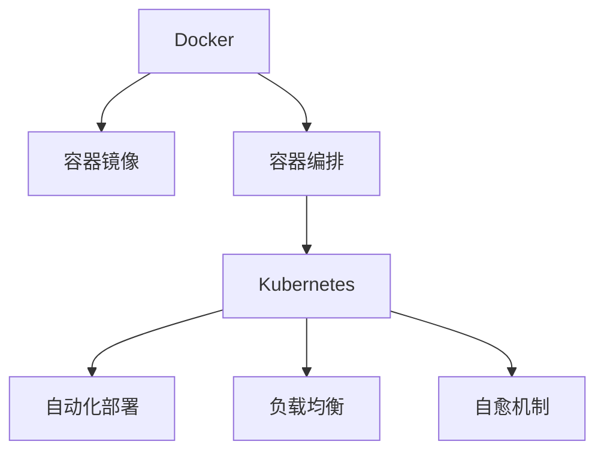

                 

# 容器化技术探索：Docker 和 Kubernetes 的应用

## 1. 背景介绍

### 1.1 问题由来

随着应用程序规模的不断扩大，传统的单机部署方式已难以适应复杂的应用需求和快速的迭代节奏。如何在保证应用高性能、高可伸缩性的同时，实现跨平台、跨环境的一致性部署，是现代软件开发中的重要挑战。容器化技术的兴起，为这些问题提供了创新的解决方案。

容器化是一种将应用程序和依赖打包在独立容器中的技术，使得应用可以在任意支持容器的环境中部署和运行。其中，Docker 和 Kubernetes 是容器化技术的两个重要组件，前者提供了容器化的运行环境，后者实现了容器的自动化管理与调度。

### 1.2 问题核心关键点

Docker 和 Kubernetes 的核心思想是通过容器化技术实现应用的隔离、部署和管理的自动化，提高应用的可移植性和可扩展性。具体来说，它们的结合可以实现以下关键目标：

1. **隔离与封装**：将应用程序和其依赖打包在独立的容器中，避免不同应用程序之间的干扰。
2. **一致性部署**：通过容器镜像的发布和分发，确保应用程序在各个环境中的运行一致性。
3. **弹性伸缩**：利用 Kubernetes 的资源管理功能，根据负载动态调整容器数量，实现自动伸缩。
4. **故障自愈**：通过 Kubernetes 的自我修复机制，及时检测并恢复因故障导致的服务中断。

这些关键点构成了容器化技术的基础，使得容器化成为现代软件开发的重要趋势。

## 2. 核心概念与联系

### 2.1 核心概念概述

为了更好地理解 Docker 和 Kubernetes 的应用，首先需要介绍一些核心概念：

- **Docker**：一种用于创建、部署和运行容器的开源平台。通过 Docker，开发者可以将应用程序及其依赖打包在容器中，实现跨平台、跨环境的无缝部署。
- **Kubernetes**：一种容器编排工具，用于自动化部署、扩展和管理容器化应用程序。Kubernetes 支持容器的自动调度、负载均衡、自愈等高级功能。
- **容器镜像**：Docker 使用的核心概念之一，是应用程序及其依赖的打包文件。容器镜像提供了应用程序的一致性部署方式。
- **容器编排**：指通过 Kubernetes 等工具，自动化管理容器化应用程序的过程。包括容器的部署、扩展、更新和监控等。

这些概念之间的逻辑关系可以通过以下 Mermaid 流程图来展示：



这个流程图展示了大容器化技术中的核心概念及其之间的关系：

1. Docker 用于创建和部署容器。
2. 容器镜像提供应用程序的一致性部署方式。
3. Kubernetes 用于容器编排，包括自动化部署、负载均衡、自愈等高级功能。

## 3. 核心算法原理 & 具体操作步骤
### 3.1 算法原理概述

Docker 和 Kubernetes 的核心算法原理包括以下几个方面：

- **Docker 的算法原理**：Docker 通过构建、运行和管理容器来提供应用程序的隔离和封装。其核心算法包括容器镜像的构建、运行时环境的隔离、容器的挂载和卸载等。
- **Kubernetes 的算法原理**：Kubernetes 通过编排和管理容器来提供应用程序的自动化部署、扩展和故障恢复。其核心算法包括资源调度算法、负载均衡算法、故障自愈算法等。

### 3.2 算法步骤详解

Docker 和 Kubernetes 的核心算法步骤可分别总结如下：

**Docker 算法步骤**：

1. **构建容器镜像**：通过 Dockerfile 定义应用程序及其依赖，使用 Docker build 命令构建镜像。
2. **运行容器**：使用 Docker run 命令从镜像运行容器，设置容器环境变量、端口映射、存储卷等参数。
3. **容器挂载和卸载**：通过 Docker push 和 Docker pull 命令实现容器镜像的上传和下载。

**Kubernetes 算法步骤**：

1. **容器编排配置**：通过 Kubernetes Deployment 或 StatefulSet 资源定义应用程序的部署配置。
2. **容器部署与扩展**：使用 kubectl 或 API 管理容器的部署与扩展，通过Horizontal Pod Autoscaler (HPA) 自动调整容器数量。
3. **容器监控与自愈**：通过 Kubernetes 的自动监控与自愈机制，实现容器的健康检查和故障恢复。

### 3.3 算法优缺点

Docker 和 Kubernetes 的优点包括：

- **提高部署一致性**：通过容器镜像，确保应用程序在各个环境中的运行一致性。
- **简化应用程序管理**：Docker 提供了简单易用的容器管理工具，Kubernetes 提供了高级的容器编排功能。
- **提升系统弹性与自愈能力**：Kubernetes 的自动伸缩和自愈机制，提高了系统的弹性与可靠性。

同时，这些技术也存在一些缺点：

- **学习曲线较陡**：特别是对于初学者，Docker 和 Kubernetes 的学习曲线较陡。
- **资源消耗较高**：容器的启动和运行需要一定的资源，特别是在容器数量较多的环境中。
- **网络配置复杂**：特别是在跨网络环境中部署时，网络配置较复杂。

尽管存在这些缺点，Docker 和 Kubernetes 依然是目前最流行和广泛使用的容器化技术，其优点远远超过了缺点。

### 3.4 算法应用领域

Docker 和 Kubernetes 的应用领域非常广泛，几乎覆盖了所有软件开发和运维场景。以下是一些典型的应用领域：

- **微服务架构**：通过容器化技术，实现微服务的隔离和独立部署。
- **云原生应用**：通过 Kubernetes 提供的自动化管理功能，支持云原生应用的部署和扩展。
- **DevOps 自动化**：通过 Docker 和 Kubernetes 的结合，实现从开发到部署的自动化流程。
- **持续集成与持续部署 (CI/CD)**：通过 Kubernetes 的自动化管理功能，支持持续集成和持续部署。
- **自动化测试与运维**：通过 Docker 和 Kubernetes，实现测试环境的自动化部署和运维。

## 4. 数学模型和公式 & 详细讲解 & 举例说明

### 4.1 数学模型构建

Docker 和 Kubernetes 的应用通常不涉及复杂的数学模型，但我们可以从其核心概念出发，构建一些简化的数学模型。

以 Kubernetes 的资源调度算法为例，假设集群中有 $N$ 个节点，每个节点上有 $C$ 个 CPU 核心和 $M$ 个内存单位。每个容器需要 $R$ 个 CPU 核心和 $S$ 个内存单位。设当前有 $M$ 个容器正在运行，每个容器占据 $r$ 个 CPU 核心和 $s$ 个内存单位。

则 Kubernetes 的资源调度算法可简化为以下数学模型：

$$
\begin{aligned}
& \min \quad f = \sum_{i=1}^M (C_i - r_i)^2 + (M_i - s_i)^2 \\
& \text{subject to} \\
& \sum_{i=1}^M r_i \leq C \\
& \sum_{i=1}^M s_i \leq M \\
& r_i \geq 0, s_i \geq 0 \\
& i=1, \ldots, M
\end{aligned}
$$

其中 $C_i$ 和 $M_i$ 分别表示节点上的 CPU 和内存资源，$f$ 表示资源分配的惩罚函数，$(r_i, s_i)$ 表示容器的资源需求。

### 4.2 公式推导过程

以上数学模型中，$f$ 表示资源分配的惩罚函数，通过最小化资源分配的差异，实现资源的最优分配。具体推导过程如下：

1. 目标函数：
$$
\min \sum_{i=1}^M (C_i - r_i)^2 + (M_i - s_i)^2
$$
2. 约束条件：
$$
\begin{aligned}
& \sum_{i=1}^M r_i \leq C \\
& \sum_{i=1}^M s_i \leq M \\
& r_i \geq 0, s_i \geq 0
\end{aligned}
$$

该模型通过最小化资源分配的差异，实现资源的优化配置。

### 4.3 案例分析与讲解

假设在一个 4 节点的集群中，每个节点有 4 个 CPU 核心和 4GB 内存。当前有 3 个容器正在运行，每个容器需要 1 个 CPU 核心和 1GB 内存。

1. **无容器部署**：将所有 3 个容器部署在同一节点上，每个容器占用 1 个 CPU 核心和 1GB 内存。资源分配如下：
   - 节点 1: 1 个 CPU 核心，1GB 内存
   - 节点 2: 1 个 CPU 核心，1GB 内存
   - 节点 3: 1 个 CPU 核心，1GB 内存
   - 节点 4: 无负载
   - 总 CPU 使用: 3 个核心
   - 总内存使用: 3GB

2. **有容器部署**：通过 Kubernetes 的资源调度算法，将容器分配到不同节点上，实现资源的均衡分配。资源分配如下：
   - 节点 1: 1 个 CPU 核心，1GB 内存
   - 节点 2: 1 个 CPU 核心，1GB 内存
   - 节点 3: 1 个 CPU 核心，1GB 内存
   - 节点 4: 1 个 CPU 核心，1GB 内存
   - 总 CPU 使用: 4 个核心
   - 总内存使用: 4GB

通过比较两种部署方式，可以看出有容器部署可以更好地利用集群资源，提高系统的弹性与可伸缩性。

## 5. 项目实践：代码实例和详细解释说明
### 5.1 开发环境搭建

在进行 Docker 和 Kubernetes 的项目实践前，需要先搭建好开发环境。以下是使用 Linux 系统进行搭建的步骤：

1. **安装 Docker**：
   ```bash
   sudo apt-get update
   sudo apt-get install docker-ce
   sudo systemctl start docker
   sudo systemctl enable docker
   ```

2. **安装 Kubernetes**：
   ```bash
   sudo apt-get update
   sudo apt-get install kubelet kubeadm kubectl
   ```

3. **设置 Kubernetes 集群**：
   ```bash
   sudo kubeadm init
   ```

4. **下载 Kubernetes 控制面**：
   ```bash
   sudo kubectl apply -f https://raw.githubusercontent.com/coreos/flannel/master/Documentation/kube-flannel.yml
   ```

5. **测试 Kubernetes**：
   ```bash
   kubectl get nodes
   kubectl run hello --image=nginx --port=8080
   kubectl expose deployment hello --name=hello-service --port=80 --type=NodePort
   kubectl get services
   ```

### 5.2 源代码详细实现

以下是一个使用 Kubernetes 部署和扩展 Web 应用的示例，具体实现步骤如下：

1. **编写 Deployment 配置文件**：
   ```yaml
   apiVersion: apps/v1
   kind: Deployment
   metadata:
     name: web
     labels:
       hello: world
     replicas: 3
   spec:
     template:
       metadata:
         labels:
           hello: world
       spec:
         image: nginx
         ports:
           - containerPort: 8080
   ```

2. **使用 kubectl 部署应用**：
   ```bash
   kubectl apply -f deployment.yaml
   ```

3. **查看 Deployment 状态**：
   ```bash
   kubectl rollout status deployment/web
   ```

4. **获取服务地址**：
   ```bash
   kubectl get services
   ```

5. **访问服务**：
   ```bash
   kubectl port-forward deployment/web 8080:8080
   curl http://127.0.0.1:8080
   ```

### 5.3 代码解读与分析

Docker 和 Kubernetes 的实现涉及多个关键组件和概念，以下是对核心代码的解读和分析：

**Dockerfile**：定义应用程序及其依赖的构建文件，包含以下步骤：

```Dockerfile
FROM nginx
COPY hello.html /usr/share/nginx/html/
```

- `FROM` 命令指定使用的基础镜像。
- `COPY` 命令将 hello.html 文件复制到 /usr/share/nginx/html/ 目录下。

**Kubernetes Deployment**：定义容器化应用程序的部署配置，包含以下字段：

```yaml
apiVersion: apps/v1
kind: Deployment
metadata:
  name: web
spec:
  replicas: 3
  template:
    metadata:
      labels:
        hello: world
    spec:
      image: nginx
      ports:
      - containerPort: 8080
```

- `apiVersion` 指定 API 版本。
- `kind` 指定资源类型。
- `metadata` 指定资源名称和标签。
- `spec` 指定容器配置和复制数量。
- `template` 指定容器的配置模板。

通过以上配置，Kubernetes 可以自动创建和扩展容器实例，保证应用程序的高可用性和弹性。

### 5.4 运行结果展示

在 Kubernetes 集群中部署和扩展 Web 应用后，可以通过 `kubectl rollout status` 命令查看部署状态，通过 `kubectl get services` 命令查看服务地址，最后通过 `kubectl port-forward` 命令访问服务。运行结果如下：

- Deployment 状态：
  ```
  Waiting for pods to be ready, 2m46s elapsed
  ```

- 服务地址：
  ```
  kubectl get services
  ```
  ```
  NAME        TYPE        CLUSTER-IP      PORT    TARGET-PORT    Protocol   AGE
  hello-service NodePort   10.0.0.1        80:30935     8080/TCP       TCP       13m
  ```

- 访问服务：
  ```
  kubectl port-forward deployment/web 8080:8080
  ```
  ```
  Forwarding from 127.0.0.1:8080 to 10.0.0.8:8080
  ```

- 访问结果：
  ```
  curl http://127.0.0.1:8080
  ```
  ```
  Hello, World!
  ```

## 6. 实际应用场景

### 6.1 智能运维管理

Docker 和 Kubernetes 在智能运维管理中得到了广泛应用。通过容器化技术，运维团队可以更快速地部署和扩展监控系统、日志收集、告警通知等服务。Kubernetes 提供的自动伸缩和自愈机制，提高了运维管理的效率和可靠性。

### 6.2 微服务架构

微服务架构是当前软件开发的重要趋势，通过 Docker 和 Kubernetes，可以更灵活地实现微服务的隔离和独立部署。Kubernetes 提供的容器编排功能，可以自动管理微服务的生命周期，提高系统的弹性与可扩展性。

### 6.3 云计算平台

Docker 和 Kubernetes 是云计算平台的重要组成部分。通过容器化技术，云计算平台可以更高效地管理云资源，提供弹性的计算和存储资源。Kubernetes 的自动伸缩和负载均衡功能，提高了云平台的性能和服务质量。

### 6.4 未来应用展望

未来，Docker 和 Kubernetes 的应用将继续深化，并与其他技术进行更紧密的结合。以下是一些未来的发展方向：

1. **Kubernetes 的扩展和优化**：随着大规模集群的需求增加，Kubernetes 的扩展性和性能优化将成为重要研究方向。例如，KubeSphere、Rancher 等开源项目正在努力提升 Kubernetes 的易用性和可管理性。

2. **云原生应用的普及**：云原生应用将成为主流，Docker 和 Kubernetes 将继续在云原生应用的管理和部署中发挥重要作用。例如，OpenShift、Tanzu 等平台已经成功应用 Kubernetes 进行云原生应用的管理和部署。

3. **多云平台的统一管理**：多云平台统一管理是未来的重要趋势。通过 Docker 和 Kubernetes，可以实现多云平台的统一部署和资源管理，提高云资源利用率和性能。

4. **DevOps 自动化**：DevOps 自动化是软件开发的重要方向。通过 Docker 和 Kubernetes，可以实现从开发到部署的自动化流程，提高开发效率和代码质量。

5. **边缘计算与容器化**：边缘计算正在兴起，通过 Docker 和 Kubernetes，可以实现边缘计算的容器化部署和自动化管理，提高边缘计算的性能和服务质量。

## 7. 工具和资源推荐

### 7.1 学习资源推荐

为了帮助开发者系统掌握 Docker 和 Kubernetes 的原理和实践技巧，这里推荐一些优质的学习资源：

1. **Docker 官方文档**：Docker 提供了详尽的官方文档，涵盖 Dockerfile 编写、容器管理、网络配置等内容。

2. **Kubernetes 官方文档**：Kubernetes 提供了详细的官方文档，涵盖 Kubernetes 集群搭建、资源管理、容器编排等内容。

3. **《Docker 实战》书籍**：书籍详细介绍了 Docker 的原理和实践技巧，是学习 Docker 的好材料。

4. **《Kubernetes 权威指南》书籍**：书籍全面介绍了 Kubernetes 的原理和实践技巧，是学习 Kubernetes 的好材料。

5. **《Docker 与 Kubernetes 实战》视频课程**：视频课程详细讲解了 Docker 和 Kubernetes 的应用实践，适合初学者学习。

通过这些资源的学习实践，相信你一定能够快速掌握 Docker 和 Kubernetes 的精髓，并用于解决实际的容器化应用问题。

### 7.2 开发工具推荐

高效的开发离不开优秀的工具支持。以下是几款用于 Docker 和 Kubernetes 开发常用的工具：

1. **Docker Desktop**：Docker 官方提供的桌面版工具，支持 Windows、macOS 和 Linux 环境，方便开发者进行容器化应用开发。

2. **Visual Studio Code**：微软推出的免费开发工具，支持 Docker 和 Kubernetes 插件，方便开发者进行容器化应用开发和调试。

3. **Kubectl**：Kubernetes 官方提供的命令行工具，用于管理 Kubernetes 集群和容器实例。

4. **Helm**：Kubernetes 的包管理工具，用于管理和部署 Kubernetes 应用。

5. **Terraform**：基础设施即代码工具，用于自动化管理 Kubernetes 集群和云资源。

6. **Jenkins**：开源的持续集成工具，支持集成 Docker 和 Kubernetes，实现自动化部署和测试。

合理利用这些工具，可以显著提升 Docker 和 Kubernetes 的开发效率，加快创新迭代的步伐。

### 7.3 相关论文推荐

Docker 和 Kubernetes 的发展源于学界的持续研究。以下是几篇奠基性的相关论文，推荐阅读：

1. **Docker 技术白皮书**：Docker 官方发布的详细介绍 Docker 技术实现和应用场景的论文。

2. **Kubernetes 设计文档**：Kubernetes 官方发布的详细介绍 Kubernetes 架构和设计的论文。

3. **Kubernetes: Large-Scale Distributed Systems Management**：介绍 Kubernetes 的论文，重点讨论了 Kubernetes 在大型分布式系统中的管理机制。

4. **Kubernetes: A Declarative Approach to Cloud Container Orchestration**：介绍 Kubernetes 的论文，重点讨论了 Kubernetes 的声明式管理机制。

这些论文代表了大容器化技术的发展脉络。通过学习这些前沿成果，可以帮助研究者把握学科前进方向，激发更多的创新灵感。

## 8. 总结：未来发展趋势与挑战

### 8.1 研究成果总结

本文对 Docker 和 Kubernetes 的原理和实践进行了全面系统的介绍。首先阐述了 Docker 和 Kubernetes 的应用背景和意义，明确了容器化技术在提高应用性能、可伸缩性、一致性等方面的独特价值。其次，从原理到实践，详细讲解了 Docker 和 Kubernetes 的核心算法和操作步骤，给出了容器化应用开发的完整代码实例。同时，本文还探讨了 Docker 和 Kubernetes 在智能运维、微服务架构、云计算平台等实际应用场景中的广泛应用，展示了容器化技术的强大应用前景。此外，本文精选了容器化技术的各类学习资源，力求为读者提供全方位的技术指引。

通过本文的系统梳理，可以看到，Docker 和 Kubernetes 作为容器化技术的重要组件，已经成为现代软件开发的重要趋势。其在提高应用性能、可伸缩性、一致性等方面的优势，使得容器化技术成为软件开发和运维的最佳选择。

### 8.2 未来发展趋势

展望未来，Docker 和 Kubernetes 的应用将继续深化，并与其他技术进行更紧密的结合。以下是一些未来的发展方向：

1. **云原生应用的普及**：云原生应用将成为主流，Docker 和 Kubernetes 将继续在云原生应用的管理和部署中发挥重要作用。例如，OpenShift、Tanzu 等平台已经成功应用 Kubernetes 进行云原生应用的管理和部署。

2. **Kubernetes 的扩展和优化**：随着大规模集群的需求增加，Kubernetes 的扩展性和性能优化将成为重要研究方向。例如，KubeSphere、Rancher 等开源项目正在努力提升 Kubernetes 的易用性和可管理性。

3. **多云平台的统一管理**：多云平台统一管理是未来的重要趋势。通过 Docker 和 Kubernetes，可以实现多云平台的统一部署和资源管理，提高云资源利用率和性能。

4. **DevOps 自动化**：DevOps 自动化是软件开发的重要方向。通过 Docker 和 Kubernetes，可以实现从开发到部署的自动化流程，提高开发效率和代码质量。

5. **边缘计算与容器化**：边缘计算正在兴起，通过 Docker 和 Kubernetes，可以实现边缘计算的容器化部署和自动化管理，提高边缘计算的性能和服务质量。

这些趋势凸显了 Docker 和 Kubernetes 的广阔前景。这些方向的探索发展，必将进一步提升容器化技术的性能和应用范围，为软件开发者和运维人员带来更多便利和高效。

### 8.3 面临的挑战

尽管 Docker 和 Kubernetes 已经取得了显著的成功，但在迈向更加智能化、普适化应用的过程中，它们仍面临着诸多挑战：

1. **学习曲线陡峭**：特别是对于初学者，Docker 和 Kubernetes 的学习曲线较陡。这需要通过更多的培训和教育资源来缓解。

2. **资源消耗较高**：容器的启动和运行需要一定的资源，特别是在容器数量较多的环境中。需要通过优化资源使用和容器编排来实现高效部署。

3. **网络配置复杂**：特别是在跨网络环境中部署时，网络配置较复杂。需要通过更灵活的网络策略和配置工具来简化配置。

4. **安全与合规**：Docker 和 Kubernetes 的安全与合规问题日益凸显。需要通过更严格的安全策略和合规措施来保障系统的安全性。

5. **性能瓶颈**：在处理大规模容器化应用时，性能瓶颈问题依然存在。需要通过更高效的容器编排和资源管理技术来优化性能。

尽管存在这些挑战，Docker 和 Kubernetes 依然是目前最流行和广泛使用的容器化技术，其优点远远超过了缺点。

### 8.4 研究展望

面对 Docker 和 Kubernetes 所面临的种种挑战，未来的研究需要在以下几个方面寻求新的突破：

1. **更高效的容器编排算法**：开发更高效的容器编排算法，优化资源使用和容器部署效率，提高系统的弹性与可扩展性。

2. **更智能的资源管理机制**：引入更智能的资源管理机制，如自适应资源调度、动态资源伸缩等，优化资源分配和利用效率。

3. **更强大的安全与合规工具**：开发更强大的安全与合规工具，如自动化的安全扫描、合规审计等，保障系统的安全性和合规性。

4. **更灵活的网络策略**：引入更灵活的网络策略，如网络策略与负载均衡的结合，简化跨网络环境下的容器部署和管理。

5. **更广泛的应用场景**：拓展 Docker 和 Kubernetes 在更多领域的应用场景，如智能运维、微服务架构、云计算平台等，推动容器化技术在更多行业中的普及和应用。

这些研究方向的探索，必将引领 Docker 和 Kubernetes 技术迈向更高的台阶，为构建高效、可靠、易用的容器化系统铺平道路。面向未来，容器化技术还需要与其他人工智能技术进行更深入的融合，如机器学习、区块链等，多路径协同发力，共同推动容器化技术的进步。

## 9. 附录：常见问题与解答

**Q1：Docker 和 Kubernetes 是什么关系？**

A: Docker 和 Kubernetes 是容器化技术的重要组成部分。Docker 提供了容器化的运行环境，而 Kubernetes 提供了容器的自动化管理与调度。Docker 提供了容器化应用的构建、运行和管理，而 Kubernetes 提供了容器编排的自动化和扩展，两者结合可以实现从容器化构建到自动化部署的全流程管理。

**Q2：Docker 和 Kubernetes 的优缺点分别是什么？**

A: Docker 和 Kubernetes 的优点包括：

- 提高部署一致性：通过容器镜像，确保应用程序在各个环境中的运行一致性。
- 简化应用程序管理：Docker 提供了简单易用的容器管理工具，Kubernetes 提供了高级的容器编排功能。
- 提升系统弹性与自愈能力：Kubernetes 的自动伸缩和自愈机制，提高了系统的弹性与可靠性。

同时，这些技术也存在一些缺点：

- 学习曲线较陡：特别是对于初学者，Docker 和 Kubernetes 的学习曲线较陡。
- 资源消耗较高：容器的启动和运行需要一定的资源，特别是在容器数量较多的环境中。
- 网络配置复杂：特别是在跨网络环境中部署时，网络配置较复杂。

尽管存在这些缺点，Docker 和 Kubernetes 依然是目前最流行和广泛使用的容器化技术，其优点远远超过了缺点。

**Q3：如何在 Kubernetes 中部署和扩展微服务？**

A: 在 Kubernetes 中部署和扩展微服务，可以采用以下步骤：

1. 编写 Kubernetes Deployment 配置文件，定义微服务的容器配置和部署策略。

2. 使用 kubectl 或 API 管理容器的部署与扩展，通过 Horizontal Pod Autoscaler (HPA) 自动调整容器数量。

3. 在 Kubernetes 集群中部署微服务，并使用 kubectl rollout status 命令查看部署状态。

4. 在 Kubernetes 集群中部署微服务，并使用 kubectl scale deployment 命令扩展容器实例。

5. 通过 kubectl rollout status 命令查看扩展后的微服务状态。

通过以上步骤，可以实现微服务的自动化部署和扩展，提高系统的弹性与可扩展性。

**Q4：Docker 和 Kubernetes 在微服务架构中的应用案例是什么？**

A: Docker 和 Kubernetes 在微服务架构中得到了广泛应用。以下是一个微服务架构的应用案例：

1. 定义微服务：将应用程序划分为多个微服务，每个微服务独立部署和扩展。

2. 使用 Docker 构建微服务容器：将每个微服务及其依赖打包在独立的 Docker 容器中。

3. 使用 Kubernetes 管理微服务容器：将容器部署在 Kubernetes 集群中，使用 Kubernetes Deployment 和 Service 资源管理容器实例和服务。

4. 通过 Kubernetes 的负载均衡和自动伸缩功能，实现微服务的弹性扩展和故障自愈。

5. 通过 Kubernetes 的容器编排功能，实现微服务的自动部署、更新和扩展。

通过以上步骤，可以实现微服务的自动化部署和扩展，提高系统的弹性与可扩展性。

**Q5：如何在 Kubernetes 中实现高可用性？**

A: 在 Kubernetes 中实现高可用性，可以采用以下策略：

1. 使用 Deployment 资源实现容器的高可用性：通过 Deployment 的滚动更新和自动扩展功能，实现容器的故障自愈和弹性扩展。

2. 使用 StatefulSet 资源实现数据库和存储的高可用性：通过 StatefulSet 的静态 IP 和持久化存储功能，实现数据库和存储的高可用性。

3. 使用 Kubernetes 的自动伸缩功能：通过 Horizontal Pod Autoscaler (HPA) 或 Cluster Autoscaler，根据负载自动调整容器数量，提高系统的弹性与可扩展性。

4. 使用 Kubernetes 的容器编排功能：通过 Kubernetes 的容器编排功能，实现容器的自动化管理，提高系统的可靠性。

5. 使用 Kubernetes 的监控与告警功能：通过 Kubernetes 的监控与告警功能，实时检测系统状态，及时发现和恢复故障，提高系统的可用性。

通过以上策略，可以实现 Kubernetes 集群的高级功能，提高系统的可靠性和可用性。

---

作者：禅与计算机程序设计艺术 / Zen and the Art of Computer Programming

