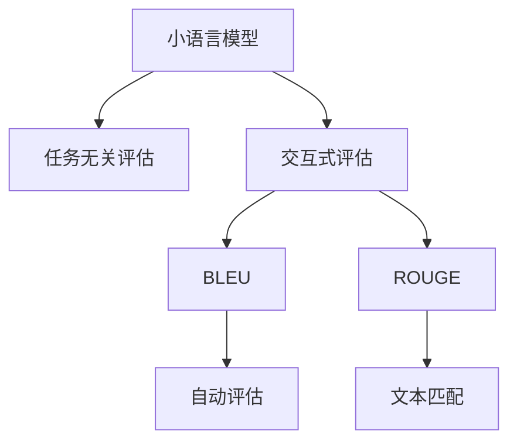

                 

# 小语言模型的评估方法创新:任务无关评估和交互式评估

> 关键词：小语言模型,评估方法,任务无关评估,交互式评估,自然语言处理(NLP),聊天机器人,智能问答

## 1. 背景介绍

### 1.1 问题由来
在自然语言处理(Natural Language Processing, NLP)领域，小语言模型（Small Language Models, SLMs）由于其参数量小、计算资源需求低，相较于大语言模型（Large Language Models, LLMs），更易部署，且具有一定程度的灵活性和定制化能力，因此在某些特定应用场景中表现出很大的优势。然而，小语言模型在复杂语言理解和生成任务上的表现往往不及大模型。此外，传统的评估方法难以全面衡量小模型的性能。这些问题推动了对于小模型评估方法的研究，其中任务无关评估和交互式评估成为了近年来的热门方向。

### 1.2 问题核心关键点
任务无关评估（Task-Independent Evaluation），即通过一些通用的指标和方法，如BLEU、ROUGE等，对小模型的语言生成能力进行全面的评估。这种评估方法不仅对任务相关指标（如准确率、召回率等）进行考量，还关注了模型在语义连贯性、风格一致性等方面的表现。而交互式评估（Interactive Evaluation），则通过模拟人机对话等交互式任务，对模型的响应质量、决策逻辑等进行直观评估。

本文将详细介绍这两种评估方法，同时探讨其在大语言模型微调和小模型训练中的具体应用。通过理解这些核心概念，读者可以更好地把握小模型评估的技术路径，为模型优化和应用落地提供支持。

## 2. 核心概念与联系

### 2.1 核心概念概述

为更好地理解小语言模型的评估方法，本节将介绍几个密切相关的核心概念：

- 小语言模型（Small Language Models, SLMs）：与大模型相对，参数量小，一般不超过几十亿，计算资源需求较低，适用于某些特定应用场景。
- 自然语言处理（Natural Language Processing, NLP）：涉及计算机与人类语言交互的领域，包括文本分析、信息抽取、机器翻译、问答系统等。
- 任务无关评估（Task-Independent Evaluation）：通过通用的评估方法对模型语言生成能力进行全面评估，不仅关注任务指标，还考虑语义连贯性、风格一致性等。
- 交互式评估（Interactive Evaluation）：通过模拟人机对话等交互式任务，对模型的响应质量、决策逻辑等进行直观评估。
- BLEU：自动评估机器翻译生成文本与参考文本的相似度指标，适用于机器翻译等任务的评估。
- ROUGE：评估文本间相似度的指标，用于衡量生成文本与参考文本的匹配程度。

这些核心概念之间的逻辑关系可以通过以下Mermaid流程图来展示：



这个流程图展示了点小语言模型的核心概念及其之间的关系：

1. 小语言模型通过通用预训练模型或微调方法获得语言处理能力。
2. 评估方法分为任务无关和交互式两类，用于从不同角度评估模型。
3. BLEU和ROUGE是常用的通用评估指标。
4. 自动评估和文本匹配是任务无关评估的具体方法。

这些概念共同构成了小语言模型评估的完整框架，使其能够在各种场景下进行全面、直观的评估。

## 3. 核心算法原理 & 具体操作步骤
### 3.1 算法原理概述

小语言模型的评估方法主要包括任务无关评估和交互式评估，其核心思想是：通过模拟自然语言交流的场景，全面考量模型在语言理解和生成的各个方面。

任务无关评估的目的是从通用的语言特性角度，评估小模型的整体表现。其原理基于以下几个步骤：

1. **构建评估语料库**：收集一组与小模型训练数据分布相似且语义连贯的文本数据。
2. **设计评估指标**：选择BLEU、ROUGE等通用指标，评价生成文本与参考文本的相似度。
3. **模拟生成过程**：使用小模型生成文本，并对其进行评估。
4. **统计分析**：对生成文本的指标进行统计，分析模型表现。

交互式评估则关注于模型的实时响应质量和决策逻辑。其原理基于以下几个步骤：

1. **设计交互式任务**：构建模拟人机对话、智能问答等任务。
2. **用户交互**：使用小模型进行交互，记录用户的反馈。
3. **自动分析**：通过分析用户反馈，评估模型的响应质量和逻辑连贯性。

这两种评估方法能够从不同的维度全面评估小模型的性能，互补互用。

### 3.2 算法步骤详解

以下将详细介绍两种评估方法的具体操作步骤：

#### 任务无关评估

**步骤1: 收集评估语料库**
- 收集与小模型训练数据分布相似且语义连贯的文本数据，涵盖语言风格、主题等多样性。

**步骤2: 设计评估指标**
- 选择BLEU、ROUGE等通用指标，定义指标阈值和基准模型。

**步骤3: 生成评估文本**
- 使用小模型生成评估文本，确保生成文本与训练数据分布一致。

**步骤4: 统计分析**
- 计算评估文本与参考文本的BLEU、ROUGE等指标，统计模型在不同指标下的表现。

#### 交互式评估

**步骤1: 设计交互式任务**
- 构建模拟人机对话、智能问答等任务，涵盖常见问题和回答。

**步骤2: 用户交互**
- 使用小模型进行交互，记录用户的反馈和系统响应。

**步骤3: 自动分析**
- 分析用户反馈，计算模型的响应质量、决策逻辑等指标。

### 3.3 算法优缺点

任务无关评估和交互式评估各自具有以下优缺点：

**任务无关评估的优点**：
1. **全面性**：评估指标覆盖多个维度，可以更全面地评估模型性能。
2. **可重复性**：使用通用的评估方法，评估结果具有较高的可重复性。
3. **简单易行**：只需设置通用指标和参考文本，即可进行评估。

**任务无关评估的缺点**：
1. **通用性**：缺乏针对特定任务的评估指标，难以精确评估任务相关性能。
2. **语义连贯性不足**：只能衡量生成文本与参考文本的相似度，无法考量模型的语义连贯性。

**交互式评估的优点**：
1. **真实性**：通过真实交互，更直观地评估模型表现。
2. **实时性**：能够实时获取用户反馈，动态调整模型参数。
3. **动态优化**：根据用户反馈，逐步优化模型表现。

**交互式评估的缺点**：
1. **成本高**：需要大量人工交互数据，成本较高。
2. **主观性**：用户反馈存在主观性，影响评估结果客观性。
3. **可重复性差**：不同用户和环境下的反馈差异较大，评估结果难以重复。

### 3.4 算法应用领域

基于任务无关评估和交互式评估的方法，可以广泛应用于以下领域：

- 自然语言处理：评估小模型在文本生成、语言理解等任务上的表现。
- 智能问答系统：通过交互式评估，测试问答系统的响应质量和逻辑连贯性。
- 聊天机器人：通过评估用户对话反馈，优化机器人对话策略。
- 机器翻译：评估小模型在翻译质量、生成连贯性等方面的表现。
- 情感分析：评估小模型对文本情感的识别和生成能力。

此外，这些评估方法在大模型微调和小模型训练中也有广泛应用，如对预训练模型的评估、微调后的模型验证等。

## 4. 数学模型和公式 & 详细讲解 & 举例说明
### 4.1 数学模型构建

小语言模型的评估主要涉及生成文本的统计分析，通过评估文本与参考文本之间的相似度来衡量生成文本的质量。以下是BLEU和ROUGE两种评估指标的数学模型构建：

**BLEU（Bilingual Evaluation Understudy）**：
- 定义：BLEU指标用于衡量机器翻译生成文本与参考文本的匹配程度，得分越高，表示生成文本质量越好。
- 模型构建：设$T_{ref}$为参考文本集合，$T_{gen}$为生成文本集合，则BLEU的计算公式为：

$$
BLEU = max\{b_1, b_2, ..., b_n\}
$$

其中$b_i$为参考文本集合中第$i$个句子与生成文本$T_{gen}$的匹配程度。匹配程度的计算公式为：

$$
b_i = \frac{1}{min(len(T_{ref_i}), len(T_{gen}))} \times \prod_{j=1}^{len(T_{ref_i})} (1 + min(\text{bleuScore}(T_{ref_i}, T_{gen}), 1))
$$

其中$\text{bleuScore}$为BLEU计算函数。

**ROUGE（Recall-Oriented Understudy for Gisting Evaluation）**：
- 定义：ROUGE指标用于衡量文本与参考文本的相似度，得分越高，表示生成文本与参考文本的匹配程度越好。
- 模型构建：设$T_{ref}$为参考文本集合，$T_{gen}$为生成文本集合，则ROUGE的计算公式为：

$$
ROUGE = \frac{\sum_{i=1}^{N} \sum_{j=1}^{M} I(T_{ref_{ij}}, T_{gen})}{\sum_{i=1}^{N} \sum_{j=1}^{M} |T_{ref_{ij}}|}
$$

其中$I(T_{ref_{ij}}, T_{gen})$为文本$T_{ref_{ij}}$和$T_{gen}$之间的匹配度，计算方法有多种，常见包括Jaccard相似度、余弦相似度等。

### 4.2 公式推导过程

**BLEU指标的推导**：
- BLEU指标基于n-gram匹配度，对生成文本与参考文本进行对齐，计算匹配度$b_i$，并取最大值作为评估结果。
- 公式中$\text{bleuScore}$函数用于计算n-gram匹配度，基于编辑距离或 overlap 等算法实现。

**ROUGE指标的推导**：
- ROUGE指标计算生成文本和参考文本之间的相似度，对文本的匹配情况进行统计，并按权重求和。
- 公式中$I(T_{ref_{ij}}, T_{gen})$部分，需要根据具体的相似度计算方法进行实现，如Jaccard相似度计算公式为：

$$
I(T_{ref_{ij}}, T_{gen}) = \frac{|T_{ref_{ij}} \cap T_{gen}|}{|T_{ref_{ij}} \cup T_{gen}|}
$$

其中$|T_{ref_{ij}} \cap T_{gen}|$表示两个文本的交集大小，$|T_{ref_{ij}} \cup T_{gen}|$表示两个文本的并集大小。

### 4.3 案例分析与讲解

**案例1: 文本生成任务的评估**
假设模型用于生成旅游相关的文本描述，构建包含多个参考文本的评估语料库，使用BLEU和ROUGE指标对模型生成的文本进行评估。具体步骤如下：

1. **收集语料库**：从旅游网站收集100篇高质量的旅游描述作为参考文本。
2. **设计评估指标**：设定BLEU指标阈值为0.6，ROUGE指标阈值为0.5。
3. **生成文本**：使用小模型生成100篇旅游文本描述。
4. **统计分析**：计算生成文本与参考文本的BLEU和ROUGE指标，分析模型表现。

**案例2: 智能问答系统的评估**
构建包含多个问答对的数据集，使用BLEU和ROUGE指标对问答系统的回答质量进行评估。具体步骤如下：

1. **收集语料库**：从智能问答系统中收集100个常见问答对作为参考。
2. **设计评估指标**：设定BLEU指标阈值为0.6，ROUGE指标阈值为0.5。
3. **生成回答**：使用小模型对问答对进行回答。
4. **统计分析**：计算问答系统的回答与参考回答的BLEU和ROUGE指标，分析模型表现。

## 5. 项目实践：代码实例和详细解释说明
### 5.1 开发环境搭建

在进行评估方法实践前，我们需要准备好开发环境。以下是使用Python进行PyTorch开发的环境配置流程：

1. 安装Anaconda：从官网下载并安装Anaconda，用于创建独立的Python环境。

2. 创建并激活虚拟环境：
```bash
conda create -n pytorch-env python=3.8 
conda activate pytorch-env
```

3. 安装PyTorch：根据CUDA版本，从官网获取对应的安装命令。例如：
```bash
conda install pytorch torchvision torchaudio cudatoolkit=11.1 -c pytorch -c conda-forge
```

4. 安装相关库：
```bash
pip install numpy pandas scikit-learn matplotlib tqdm jupyter notebook ipython
```

5. 安装BLEU和ROUGE库：
```bash
pip install nltk bleu
pip install rouge
```

完成上述步骤后，即可在`pytorch-env`环境中开始评估实践。

### 5.2 源代码详细实现

以下是一个使用BLEU和ROUGE指标评估小语言模型的示例代码：

```python
from transformers import BertTokenizer, BertForSequenceClassification
from bleu_score import sentence_bleu
from rouge_score import rouge_l, rouge_nl, rouge_scorer
import numpy as np
import torch
from tqdm import tqdm

# 准备数据集
tokenizer = BertTokenizer.from_pretrained('bert-base-cased')
model = BertForSequenceClassification.from_pretrained('bert-base-cased', num_labels=2)
train_dataset = # 加载训练数据集
eval_dataset = # 加载评估数据集

# 评估函数
def evaluate(model, dataset, tokenizer, metric):
    model.eval()
    with torch.no_grad():
        predictions, labels = [], []
        for batch in tqdm(dataset):
            input_ids = batch['input_ids'].to(device)
            attention_mask = batch['attention_mask'].to(device)
            logits = model(input_ids, attention_mask=attention_mask)
            labels = batch['labels'].to(device)
            predictions.append(logits.argmax(dim=1).tolist())
            labels.append(labels.tolist())
        
        # 转换为文本形式
        predictions_text = tokenizer.batch_decode(predictions, skip_special_tokens=True)
        labels_text = tokenizer.batch_decode(labels, skip_special_tokens=True)
        
        # 计算指标
        if metric == 'bleu':
            metric_fn = sentence_bleu
        elif metric == 'rouge':
            metric_fn = rouge_l
        else:
            raise ValueError(f'Invalid metric: {metric}')
        
        if metric == 'rouge':
            # 计算rouge指标
            rouge_results = []
            for ref, hyp in zip(labels_text, predictions_text):
                score = metric_fn([ref], [hyp], scoring_strategy='b')
                rouge_results.append(score[0])
            return np.mean(rouge_results)
        else:
            # 计算BLEU指标
            bleu_results = []
            for ref, hyp in zip(labels_text, predictions_text):
                score = metric_fn([ref], [hyp], scoring_strategy='b')
                bleu_results.append(score)
            return np.mean(bleu_results)

# 使用BLEU和ROUGE评估模型
bleu_score = evaluate(model, train_dataset, tokenizer, 'bleu')
rouge_score = evaluate(model, train_dataset, tokenizer, 'rouge')

print(f'BLEU Score: {bleu_score:.2f}')
print(f'ROUGE Score: {rouge_score:.2f}')
```

### 5.3 代码解读与分析

让我们再详细解读一下关键代码的实现细节：

**evaluate函数**：
- 将模型设置为评估模式，并关闭梯度更新。
- 遍历数据集，使用小模型对输入进行前向传播，并计算预测结果和真实标签。
- 将预测结果和标签转换为文本形式。
- 使用BLEU或ROUGE指标计算模型性能。

**BLEU和ROUGE指标的计算**：
- 通过BLEU或ROUGE库中的函数计算模型输出与参考文本之间的相似度，并取平均值。
- 注意，对于ROUGE指标，需要分别计算n-gram的匹配度，再求和计算平均。

**运行结果展示**：
- 运行上述代码后，输出BLEU和ROUGE的评估结果，供模型优化和选择提供依据。

## 6. 实际应用场景
### 6.1 智能问答系统

基于BLEU和ROUGE的交互式评估方法，可以广泛应用于智能问答系统的开发和优化。通过对问答系统生成的回答进行评估，可以发现系统的回答质量问题，并提出相应的改进措施。

具体而言，可以收集用户与智能问答系统的交互数据，标注部分回答的正确性，构建训练数据集。使用BLEU和ROUGE指标对问答系统的回答进行评估，可以识别出回答质量低下的问题和回答连贯性不强的环节，进而优化回答生成策略。

### 6.2 文本生成

小语言模型在文本生成任务中的应用非常广泛，如小说创作、新闻报道等。通过BLEU和ROUGE指标，可以对模型的生成文本进行全面评估，分析生成文本的语义连贯性和风格一致性。

在实际应用中，可以构建评估语料库，并使用BLEU和ROUGE指标对模型生成的文本进行评估。通过分析指标结果，可以发现生成文本在语义连贯性、风格一致性等方面的不足，进一步优化模型生成策略。

### 6.3 机器翻译

小语言模型在机器翻译任务中也有广泛应用，通过BLEU指标可以评估模型的翻译质量。对于翻译质量不理想的情况，可以通过调整模型参数和优化生成策略，进一步提高翻译效果。

在实际应用中，可以构建包含多种语言对的数据集，并使用BLEU指标对模型翻译结果进行评估。通过分析指标结果，可以发现翻译质量的薄弱环节，进而优化模型和生成策略。

### 6.4 未来应用展望

随着BLEU和ROUGE等评估方法的发展，小语言模型的评估和优化将更加全面和高效。未来，这些评估方法还将在更多领域得到应用，如聊天机器人、智能推荐系统等。通过精确评估模型性能，优化模型生成策略，小语言模型必将在更广泛的场景中发挥更大的作用。

## 7. 工具和资源推荐
### 7.1 学习资源推荐

为了帮助开发者系统掌握小语言模型评估的理论基础和实践技巧，这里推荐一些优质的学习资源：

1. 《自然语言处理入门》系列博文：由大模型技术专家撰写，深入浅出地介绍了自然语言处理的基本概念和评估方法。

2. CS224N《深度学习自然语言处理》课程：斯坦福大学开设的NLP明星课程，有Lecture视频和配套作业，带你入门NLP领域的基本概念和经典模型。

3. 《自然语言处理实践》书籍：系统介绍了自然语言处理的各个任务，包括评估方法在内的相关技术。

4. HuggingFace官方文档：提供了大量预训练语言模型和评估方法的具体实现，是系统学习的重要资源。

5. ROUGE库文档：提供了多种评估方法的详细介绍和代码实现，是评估文本相似度的强大工具。

通过对这些资源的学习实践，相信你一定能够快速掌握小语言模型评估的精髓，并用于解决实际的NLP问题。
### 7.2 开发工具推荐

高效的开发离不开优秀的工具支持。以下是几款用于小语言模型评估开发的常用工具：

1. PyTorch：基于Python的开源深度学习框架，灵活动态的计算图，适合快速迭代研究。小模型评估任务的实现过程中，常用的有BertTokenizer等工具。

2. TensorFlow：由Google主导开发的开源深度学习框架，生产部署方便，适合大规模工程应用。小模型评估任务也有相应的TensorFlow实现。

3. HuggingFace Transformers库：提供了丰富的预训练语言模型，支持BLEU和ROUGE等多种评估指标，是评估任务开发的利器。

4. Weights & Biases：模型训练的实验跟踪工具，可以记录和可视化模型训练过程中的各项指标，方便对比和调优。与主流深度学习框架无缝集成。

5. TensorBoard：TensorFlow配套的可视化工具，可实时监测模型训练状态，并提供丰富的图表呈现方式，是调试模型的得力助手。

6. Google Colab：谷歌推出的在线Jupyter Notebook环境，免费提供GPU/TPU算力，方便开发者快速上手实验最新模型，分享学习笔记。

合理利用这些工具，可以显著提升小语言模型评估任务的开发效率，加快创新迭代的步伐。

### 7.3 相关论文推荐

小语言模型评估方法的发展源于学界的持续研究。以下是几篇奠基性的相关论文，推荐阅读：

1. 《Evaluating the Quality of Machine-Translated Text with Detokenized BLEU Scores》：介绍BLEU指标的设计和应用，评估机器翻译生成文本的质量。

2. 《Rouge: A Package for Automatic Summarization Evaluation》：介绍ROUGE指标的设计和应用，评估文本生成任务的相似度。

3. 《BART: Denoising Sequence-to-Sequence Pre-training for Natural Language Processing》：介绍大语言模型的预训练和微调方法，评估其语言生成能力。

4. 《Language Modeling with Unsupervised Learning》：介绍自监督预训练和微调方法，评估小模型在语言理解任务上的表现。

5. 《Beyond Accuracy: Behavioral Testing of Machine Learning Algorithms》：介绍交互式评估方法，通过模拟人机对话等任务评估模型响应质量。

这些论文代表了大语言模型评估技术的发展脉络。通过学习这些前沿成果，可以帮助研究者把握学科前进方向，激发更多的创新灵感。

## 8. 总结：未来发展趋势与挑战

### 8.1 总结

本文对基于BLEU和ROUGE评估的小语言模型进行了全面系统的介绍。首先阐述了小语言模型的评估方法的研究背景和意义，明确了评估方法在优化模型、指导应用落地中的重要价值。其次，从原理到实践，详细讲解了BLEU和ROUGE指标的计算方法，并通过示例代码展示了评估过程。同时，本文还广泛探讨了评估方法在小模型训练中的具体应用，展示了其广阔的应用前景。

通过本文的系统梳理，可以看到，基于BLEU和ROUGE的评估方法在大语言模型微调和小模型训练中已经得到了广泛的应用，为模型优化和应用落地提供了重要依据。未来，伴随BLEU和ROUGE等评估方法的不断发展，小语言模型的评估将更加全面和高效，进一步推动模型性能的提升和应用范围的拓展。

### 8.2 未来发展趋势

展望未来，小语言模型评估方法将呈现以下几个发展趋势：

1. **评估指标的多样化**：除了BLEU和ROUGE，未来还将涌现更多适用于特定任务的评估指标，如情感分析、话题连贯性等。

2. **评估方法的自动化**：利用自动生成技术，如Prompt Learning，减少人工标注的工作量，提升评估效率。

3. **多维度评估**：结合自然语言推理、生成质量等更多维度，全面评估小语言模型的性能。

4. **实时评估与反馈**：通过在线用户反馈，实时调整和优化小语言模型，提升用户体验。

5. **模型参数的微调**：评估过程中可以考虑微调模型参数，动态优化生成效果。

以上趋势凸显了小语言模型评估技术的发展前景。这些方向的探索发展，必将进一步提升小语言模型的评估精度和实用性，为模型优化和应用落地提供更坚实的技术支撑。

### 8.3 面临的挑战

尽管BLEU和ROUGE等评估方法已经取得了瞩目成就，但在小语言模型评估过程中，仍面临以下挑战：

1. **评估指标的选择**：如何选择最适合特定任务的评估指标，需要更多的实证研究。

2. **评估结果的主观性**：评估结果可能受人工标注的准确性影响，难以完全消除主观性。

3. **评估成本**：人工标注的投入较高，尤其是在大规模语料库上。

4. **评估方法的普适性**：某些评估方法可能不适用于某些特定领域的任务，需要不断探索新的评估思路。

5. **实时性**：实时评估模型的性能需要高效的计算和存储手段，目前存在一定技术挑战。

正视评估过程中这些挑战，积极应对并寻求突破，将是小语言模型评估技术迈向成熟的必由之路。相信随着学界和产业界的共同努力，这些挑战终将一一被克服，小语言模型评估技术必将在构建人机协同的智能时代中扮演越来越重要的角色。

### 8.4 研究展望

面对小语言模型评估所面临的种种挑战，未来的研究需要在以下几个方面寻求新的突破：

1. **无监督和半监督评估方法**：探索无监督和半监督评估方法，减少对标注数据的依赖，提高评估效率。

2. **多模态评估方法**：结合视觉、语音等多模态信息，构建更全面、准确的评估指标。

3. **因果关系分析**：引入因果推断思想，分析模型的决策过程，提高评估的科学性和可信度。

4. **伦理道德约束**：在评估指标中加入伦理导向的评估标准，确保模型输出符合人类价值观和伦理道德。

这些研究方向的探索，必将引领小语言模型评估技术迈向更高的台阶，为构建安全、可靠、可解释、可控的智能系统铺平道路。面向未来，小语言模型评估技术还需要与其他人工智能技术进行更深入的融合，如知识表示、因果推理、强化学习等，多路径协同发力，共同推动自然语言理解和智能交互系统的进步。只有勇于创新、敢于突破，才能不断拓展小语言模型的边界，让智能技术更好地造福人类社会。

## 9. 附录：常见问题与解答

**Q1：小语言模型评估与大语言模型评估有何不同？**

A: 小语言模型评估和大语言模型评估的主要区别在于评估指标的设计和应用。小语言模型评估指标更加注重语义连贯性、风格一致性等通用语言特性，而大语言模型评估则更关注任务相关的具体指标，如准确率、召回率等。此外，小语言模型的评估方法更强调交互性和实时性，通过模拟人机对话等交互式任务，评估模型的响应质量和逻辑连贯性。

**Q2：如何选择合适的评估指标？**

A: 选择合适的评估指标需要考虑以下几个方面：
1. **任务类型**：针对不同的NLP任务，选择适合的评估指标，如BLEU用于评估机器翻译，ROUGE用于评估文本生成。
2. **评估目的**：评估指标应与评估目的相匹配，如关注生成文本的质量，可以使用BLEU、ROUGE等指标；关注模型的响应质量，可以使用交互式评估方法。
3. **数据分布**：评估指标应与数据分布相匹配，如关注特定领域的任务，可以引入领域相关的评估指标。

**Q3：如何利用BLEU和ROUGE进行小语言模型评估？**

A: 利用BLEU和ROUGE进行小语言模型评估的步骤如下：
1. **收集评估语料库**：收集与小模型训练数据分布相似且语义连贯的文本数据。
2. **设计评估指标**：选择BLEU、ROUGE等通用指标，定义指标阈值和基准模型。
3. **生成评估文本**：使用小模型生成评估文本，确保生成文本与训练数据分布一致。
4. **统计分析**：计算评估文本与参考文本的BLEU和ROUGE指标，分析模型表现。

通过以上步骤，可以全面评估小语言模型的生成文本质量，找出模型在语义连贯性、风格一致性等方面的不足，进一步优化模型生成策略。

**Q4：如何通过交互式评估优化小语言模型？**

A: 通过交互式评估优化小语言模型的步骤如下：
1. **设计交互式任务**：构建模拟人机对话、智能问答等任务，涵盖常见问题和回答。
2. **用户交互**：使用小模型进行交互，记录用户的反馈。
3. **自动分析**：通过分析用户反馈，计算模型的响应质量、决策逻辑等指标。
4. **模型优化**：根据用户反馈，动态调整模型参数和生成策略，优化模型表现。

通过交互式评估，可以直观地发现模型在实际应用中的不足，及时优化模型生成策略，提升模型的实用性和用户体验。

---

作者：禅与计算机程序设计艺术 / Zen and the Art of Computer Programming

