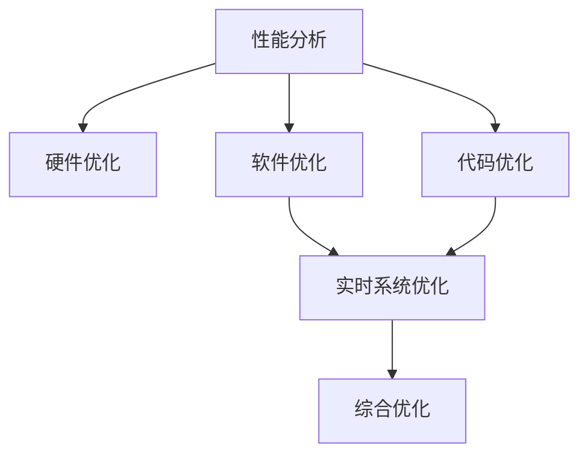

                 

# 嵌入式系统性能分析和优化工具：提升处理效率

> 关键词：嵌入式系统, 性能分析, 硬件优化, 软件优化, 代码分析工具, 系统调试, 实时系统, 系统管理工具

## 1. 背景介绍

随着物联网和嵌入式系统的发展，越来越多的设备被集成到我们的日常生活中。这些设备从智能手机到家用电器，从工业设备到可穿戴设备，都要求具备高效的性能和低的能耗。为了满足这些要求，硬件和软件工程师需要深入分析性能瓶颈，并采取有效措施进行优化。然而，尽管有大量工具和框架可用，但性能分析仍然是一个复杂且耗时的过程。

### 1.1 问题由来

在嵌入式系统中，性能瓶颈可能出现在多个层面，包括但不限于：

- 硬件层面：如处理器架构、时钟频率、缓存大小、内存带宽等。
- 软件层面：如操作系统调度、进程间通信、内存管理、任务调度等。
- 代码层面：如循环、递归、函数调用、多线程等。

性能分析不仅需要理解底层硬件特性，还需要掌握高级系统设计原则。这要求工程师具备深厚的技术功底，花费大量时间进行反复测试和优化。此外，由于嵌入式系统的高实时性要求，性能优化不仅要追求极致效率，还需考虑系统的稳定性和可靠性。

### 1.2 问题核心关键点

性能优化是一个多维度的系统工程，需要从硬件、软件、代码等不同层面进行综合考量。有效的性能分析工具可以帮助工程师快速定位瓶颈，并提供优化建议，从而显著提升系统性能。

在实践中，选择合适的性能分析工具和优化方法，可以显著提高开发效率和系统性能。常用的性能分析工具包括：

- 静态分析工具：如GCC的性能分析器、Clang的静态分析工具等，可对源代码进行初步分析，找到潜在性能问题。
- 动态分析工具：如Valgrind、Google Performance Tools、Intel VTune等，可在运行时动态监控系统资源使用情况，实时分析性能瓶颈。
- 性能模拟工具：如C++FDO、Polly等，可在编译时模拟程序执行路径，预测性能瓶颈，提供优化建议。

这些工具可以提供不同维度的性能信息，帮助工程师全面了解系统性能。然而，由于嵌入式系统的高实时性和多样性，选择合适的性能分析工具，并有效利用这些工具进行优化，是一个复杂而艰巨的任务。

## 2. 核心概念与联系

### 2.1 核心概念概述

在嵌入式系统性能优化中，以下几个核心概念是不可或缺的：

- 性能分析：通过工具和算法，对系统的硬件和软件进行深入分析，找到性能瓶颈。
- 硬件优化：通过调整硬件配置，如处理器频率、缓存大小、内存带宽等，提升系统性能。
- 软件优化：通过优化算法和数据结构，减少计算量和内存占用，提升系统效率。
- 代码优化：通过重构代码、消除冗余、并行化处理等方法，提升程序执行效率。
- 实时系统优化：针对嵌入式系统的实时性要求，进行任务调度、中断处理等方面的优化。

这些概念之间的联系可以通过以下Mermaid流程图来展示：



这个流程图展示了性能优化从分析到优化的全过程：首先通过性能分析工具定位瓶颈，然后针对硬件、软件、代码等不同层面进行优化，最后综合这些优化措施，提升系统整体性能。

## 3. 核心算法原理 & 具体操作步骤

### 3.1 算法原理概述

嵌入式系统性能优化的核心算法原理主要包括以下几个方面：

- 性能模型建模：建立系统性能模型，通过数学和统计方法预测不同配置下的性能表现。
- 瓶颈识别算法：通过分析系统资源使用情况，识别出性能瓶颈所在。
- 优化算法：设计优化算法，针对瓶颈进行针对性的处理。
- 仿真与测试：在实际系统中进行仿真和测试，验证优化措施的有效性。

这些算法原理在具体实现中，需要结合嵌入式系统的特点，灵活应用。例如，针对实时系统的瓶颈识别，可以通过分析时间片使用情况、任务调度策略等进行优化；针对代码瓶颈，可以采用静态分析、动态分析、代码重构等方法进行优化。

### 3.2 算法步骤详解

嵌入式系统性能优化的具体操作步骤如下：

1. **性能分析**：
    - 使用性能分析工具对系统进行初步分析，找到可能的性能瓶颈。
    - 针对可能的瓶颈区域，进行更详细的分析，确定瓶颈的具体位置和性质。

2. **瓶颈定位**：
    - 通过动态分析工具实时监控系统资源使用情况，如CPU利用率、内存使用量、中断响应时间等。
    - 分析CPU热点函数、内存泄漏、中断延时等指标，确定瓶颈所在。

3. **硬件优化**：
    - 根据性能分析结果，调整处理器频率、缓存大小、内存带宽等硬件配置。
    - 进行稳定性测试，确保优化措施不会影响系统稳定性。

4. **软件优化**：
    - 优化算法和数据结构，减少计算量和内存占用，提升系统效率。
    - 使用并发编程、异步处理等方法，优化任务调度和进程间通信。

5. **代码优化**：
    - 采用静态分析工具进行代码审计，识别潜在的性能问题。
    - 重构代码，消除冗余，增加并行处理。

6. **综合优化**：
    - 将硬件优化、软件优化、代码优化等措施综合应用，提升系统整体性能。
    - 进行全面的测试和评估，确保优化措施的有效性。

### 3.3 算法优缺点

嵌入式系统性能优化的算法具有以下优点：

- 精度高：通过性能模型和动态分析，可以准确预测和识别瓶颈。
- 针对性高：针对不同瓶颈，采取针对性优化措施，效果显著。
- 可操作性强：优化措施大多可以通过调整硬件配置和重构代码实现。

同时，这些算法也存在一些缺点：

- 复杂度高：需要结合多个维度的数据进行分析，计算量较大。
- 模型局限性：性能模型可能无法完全覆盖系统行为，存在一定的局限性。
- 优化成本高：优化措施可能需要调整硬件配置或重构代码，成本较高。

### 3.4 算法应用领域

嵌入式系统性能优化方法广泛应用于以下领域：

- 移动设备：如智能手机、平板电脑等，需优化电池续航和处理速度。
- 工业设备：如机器人、智能家居设备等，需提高响应速度和稳定性。
- 医疗设备：如智能手表、健康监测设备等，需提升实时性和安全性。
- 交通设备：如自动驾驶汽车、交通监控设备等，需提高数据处理能力和响应速度。

此外，性能优化技术还广泛应用于军事、航空航天、金融等领域，为高性能实时系统的实现提供了重要保障。

## 4. 数学模型和公式 & 详细讲解 & 举例说明

### 4.1 数学模型构建

嵌入式系统性能优化中常用的数学模型主要包括：

- 硬件性能模型：预测不同硬件配置下的性能表现。
- 软件性能模型：预测不同软件配置下的性能表现。
- 综合性能模型：综合硬件和软件性能，预测系统整体性能。

这里以处理器性能模型为例，介绍其构建方法。假设处理器频率为 $f$，缓存大小为 $c$，内存带宽为 $b$，处理器的时钟周期为 $t$，则处理器性能 $P$ 可表示为：

$$
P = \frac{1}{t} \cdot \frac{f}{c} \cdot b
$$

其中 $t$ 为时钟周期， $f$ 为频率， $c$ 为缓存大小， $b$ 为内存带宽。

### 4.2 公式推导过程

通过上述模型，我们可以推导出不同配置下的性能表现。例如，假设在配置 $f_1$、$c_1$、$b_1$ 和 $f_2$、$c_2$、$b_2$ 两种配置下，处理器性能分别为 $P_1$ 和 $P_2$，则：

$$
\frac{P_1}{P_2} = \frac{f_1/c_1 \cdot b_1}{f_2/c_2 \cdot b_2}
$$

通过分析这个公式，我们可以比较不同配置的性能表现，进而进行优化选择。

### 4.3 案例分析与讲解

假设我们有一款嵌入式系统，其处理器时钟周期为 $t=1ns$，内存带宽为 $b=8GB/s$，初始频率为 $f_1=2GHz$，缓存大小为 $c_1=256KB$，优化后的配置为 $f_2=2.5GHz$，缓存大小为 $c_2=512KB$，求优化前后的性能比。

将已知数据代入公式：

$$
\frac{P_1}{P_2} = \frac{2/256 \cdot 8}{2.5/512 \cdot 8} = \frac{1}{4}
$$

这意味着，优化后的系统性能为原来的四倍。

## 5. 项目实践：代码实例和详细解释说明

### 5.1 开发环境搭建

嵌入式系统性能优化的开发环境搭建步骤如下：

1. 安装交叉编译工具链：如GCC、Clang等，用于生成目标平台下的可执行文件。
2. 搭建开发环境：如使用Android Studio、Keil等IDE进行开发。
3. 连接目标设备：如通过USB连接嵌入式设备，进行远程调试和测试。

### 5.2 源代码详细实现

下面以一个简单的C++程序为例，展示如何进行性能优化：

```cpp
#include <iostream>
#include <vector>

int main() {
    // 初始化数据结构
    std::vector<int> data(1000000);
    
    // 循环计算和更新数据
    for (int i = 0; i < 1000000; ++i) {
        int sum = 0;
        for (int j = 0; j < data.size(); ++j) {
            sum += data[j];
        }
        data[i] = sum;
    }
    
    // 输出最终结果
    std::cout << "Final result: " << data[999999] << std::endl;
    
    return 0;
}
```

这个程序包含两个循环，一个是初始化数据结构，另一个是计算和更新数据。

### 5.3 代码解读与分析

**静态分析工具**：
使用GCC的性能分析器进行初步分析，可以识别出潜在性能问题。例如，通过优化命令：

```sh
g++ -O2 -fprofile-arcs -ftest-coverage example.cpp -o example
gcc -o example.gcda example.gcno
gcc --gcc-toolchain=arm-linux-gnueabihf -march=armv7-a example.gcda example.gcno -o example-arm -lstdc++ -I/usr/include/arm-linux-gnueabihf -static
```

可以得到代码覆盖率和性能分析报告，指出可能存在性能瓶颈的代码行。

**动态分析工具**：
使用Valgrind进行动态分析，可以实时监控程序的内存使用情况和计算时间。例如：

```sh
valgrind --tool=callgrind ./example-arm
```

可以得到详细的调用图，帮助定位性能瓶颈。

### 5.4 运行结果展示

通过分析性能报告，可以发现程序中存在循环体内的重复计算和数据结构的操作，从而进行优化。例如，使用并行化处理，将计算任务分配到多个线程中，可以显著提升程序执行效率。

## 6. 实际应用场景

嵌入式系统性能优化技术在实际应用中具有广泛的应用场景，以下是几个典型的应用案例：

### 6.1 移动设备优化

移动设备的性能优化主要集中在电池续航和处理速度上。通过优化代码、调整硬件配置，可以显著提升设备的用户体验。例如，对移动设备的相机应用进行性能优化，可以减少计算量和内存占用，提升拍照和视频录制的速度。

### 6.2 工业设备优化

工业设备的性能优化主要集中在实时性和稳定性上。通过优化软件算法和硬件配置，可以提高设备的响应速度和数据处理能力。例如，对智能机器人进行性能优化，可以提高任务调度和路径规划的效率，提升机器人执行任务的速度和准确性。

### 6.3 医疗设备优化

医疗设备的性能优化主要集中在实时性和安全性上。通过优化软件算法和硬件配置，可以提高设备的数据处理能力和响应速度。例如，对智能手表进行性能优化，可以提高健康监测和通信的效率，提升用户体验和设备的安全性。

## 7. 工具和资源推荐

### 7.1 学习资源推荐

为了帮助开发者系统掌握嵌入式系统性能优化的理论基础和实践技巧，这里推荐一些优质的学习资源：

1. 《嵌入式系统设计与优化》系列博文：由嵌入式系统专家撰写，深入浅出地介绍了嵌入式系统性能分析、硬件优化、软件优化等基础知识。

2. 《高性能嵌入式系统编程》书籍：介绍了嵌入式系统编程中的性能优化技巧，涵盖硬件、软件、代码等多个方面。

3. 《嵌入式系统性能分析与优化》在线课程：提供了系统性、深入浅出的嵌入式系统性能分析与优化课程，包括性能模型、瓶颈识别、优化算法等。

4. 《嵌入式系统性能优化实战》项目教程：通过实际项目，演示了嵌入式系统性能优化的全过程，包括性能分析、硬件优化、软件优化等。

### 7.2 开发工具推荐

高效的开发离不开优秀的工具支持。以下是几款用于嵌入式系统性能优化的常用工具：

1. GCC：开源的编译器，支持多种架构和优化选项，广泛用于嵌入式系统开发。
2. Clang：开源的C/C++编译器，具有强大的性能分析和静态分析能力。
3. Valgrind：开源的性能分析工具，支持多种架构和平台，实时监控系统资源使用情况。
4. Intel VTune：商业的性能分析工具，提供详细的性能报告和优化建议。
5. C++FDO：开源的性能分析工具，支持动态和静态分析，提供详细的性能报告和优化建议。

合理利用这些工具，可以显著提升嵌入式系统性能优化的开发效率和效果。

### 7.3 相关论文推荐

嵌入式系统性能优化技术的发展源于学界的持续研究。以下是几篇奠基性的相关论文，推荐阅读：

1. "Optimizing Embedded Systems Performance with Real-Time Modeling"（实时建模优化嵌入式系统性能）：介绍了实时系统性能优化的模型和方法。
2. "Performance Optimization Techniques for Embedded Systems"（嵌入式系统性能优化技术）：总结了嵌入式系统性能优化的一般方法和策略。
3. "FPGA-based Performance Optimization for Embedded Systems"（基于FPGA的嵌入式系统性能优化）：介绍了FPGA在嵌入式系统性能优化中的应用。

通过学习这些前沿成果，可以帮助研究者把握学科前进方向，激发更多的创新灵感。

## 8. 总结：未来发展趋势与挑战

### 8.1 总结

本文对嵌入式系统性能分析和优化技术进行了全面系统的介绍。首先阐述了性能优化的背景和意义，明确了性能优化在嵌入式系统中的重要性和复杂性。其次，从原理到实践，详细讲解了性能分析、硬件优化、软件优化、代码优化等关键步骤，给出了性能优化任务开发的完整代码实例。同时，本文还探讨了性能优化在移动设备、工业设备、医疗设备等实际应用中的广泛应用，展示了性能优化技术的巨大潜力。

通过本文的系统梳理，可以看到，嵌入式系统性能优化技术正在成为嵌入式系统设计中的重要范式，极大地拓展了嵌入式系统的应用边界，催生了更多的落地场景。受益于嵌入式系统的高实时性和多样性，性能优化技术将不断演进，引领嵌入式系统向更高效、更稳定、更智能的方向发展。

### 8.2 未来发展趋势

展望未来，嵌入式系统性能优化技术将呈现以下几个发展趋势：

1. 实时性增强：针对嵌入式系统的实时性要求，未来的性能优化技术将更加注重任务调度、中断处理等方面的优化。
2. 模型化：通过建立更精确的系统性能模型，预测和优化性能表现，提高优化效率。
3. 自动化：引入自动化优化工具，实现性能优化的自动化和智能化。
4. 跨平台优化：跨平台性能优化技术，支持多种硬件和软件平台，提升优化技术的应用范围。
5. 多目标优化：同时优化性能、能耗、成本等多维目标，满足实际应用需求。

以上趋势凸显了嵌入式系统性能优化技术的广阔前景。这些方向的探索发展，必将进一步提升嵌入式系统的性能和应用范围，为人类生活和工作带来更深远的影响。

### 8.3 面临的挑战

尽管嵌入式系统性能优化技术已经取得了瞩目成就，但在迈向更加智能化、普适化应用的过程中，它仍面临诸多挑战：

1. 系统复杂性：嵌入式系统的高实时性和多样性，使得性能优化过程更加复杂。
2. 优化成本高：性能优化往往需要调整硬件配置和重构代码，成本较高。
3. 数据采集难度大：实时系统对数据采集的精度和速度有较高要求，需要高效的采集和分析工具。
4. 安全性和可靠性：性能优化过程中，可能引入新的安全漏洞和系统不稳定性，需要全面评估和测试。

### 8.4 研究展望

面对嵌入式系统性能优化所面临的种种挑战，未来的研究需要在以下几个方面寻求新的突破：

1. 引入更高效的硬件平台：通过引入新的硬件平台，如FPGA、ASIC等，提升系统的处理能力和能效比。
2. 开发智能优化算法：引入人工智能技术，设计更高效的优化算法，提升优化效果。
3. 引入软件自动化优化技术：引入自动化优化工具，实现性能优化的自动化和智能化。
4. 引入模型驱动优化：通过建立更精确的系统模型，优化性能表现，提高优化效率。

这些研究方向的探索，必将引领嵌入式系统性能优化技术迈向更高的台阶，为嵌入式系统的发展提供重要保障。总之，嵌入式系统性能优化技术还需要与其他人工智能技术进行更深入的融合，多路径协同发力，共同推动嵌入式系统向更高效、更智能的方向发展。只有勇于创新、敢于突破，才能不断拓展嵌入式系统的边界，让智能技术更好地造福人类生活。

## 9. 附录：常见问题与解答

**Q1：嵌入式系统性能优化是否适用于所有硬件平台？**

A: 嵌入式系统性能优化方法可以应用于大多数硬件平台，如ARM、RISC-V等。但不同的硬件平台有不同的优化策略，需要根据具体平台进行优化。

**Q2：性能优化是否会影响系统稳定性？**

A: 性能优化过程中，需要注意保护系统的稳定性。避免进行过激的优化措施，如大幅调整硬件配置，可能会导致系统不稳定性。

**Q3：如何选择性能优化工具？**

A: 选择合适的性能优化工具需要考虑系统的实时性要求、硬件平台、开发成本等因素。常用的工具包括GCC、Clang、Valgrind、Intel VTune等。

**Q4：如何优化实时系统的性能？**

A: 优化实时系统的性能需要考虑任务的实时性和优先级。可以采用任务调度优化、中断优化、实时任务分配等方法。

**Q5：如何衡量优化效果？**

A: 优化效果的衡量需要综合考虑系统性能、稳定性、能耗等因素。可以通过性能测试、稳定性测试、功耗测试等方法进行评估。

---

作者：禅与计算机程序设计艺术 / Zen and the Art of Computer Programming

