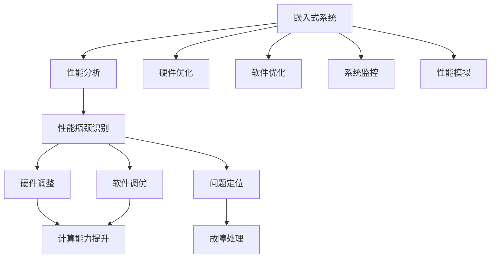

                 

# 嵌入式系统性能分析和优化工具：提升处理效率

> 关键词：嵌入式系统, 性能分析, 优化工具, 硬件-软件协同, 实时系统, 系统监控, 嵌入式编程

## 1. 背景介绍

### 1.1 问题由来

在嵌入式系统领域，性能是一个永恒的话题。随着各种高性能应用场景的不断涌现，如自动驾驶、工业物联网、智能家居等，对嵌入式系统的计算、通信和能源效率都提出了更高的要求。如何在有限的硬件资源下，最大化地提升系统性能，成为了嵌入式系统设计的重要课题。

传统的嵌入式系统性能优化方法主要依赖于硬件性能的提升和软件架构的调整。但随着芯片计算能力的不断增强和系统复杂性的提高，硬件-软件协同的性能优化方法变得愈发重要。性能分析工具和优化工具的应用，能够帮助工程师系统性地识别性能瓶颈，科学地调整硬件配置和软件优化策略，从而提升整个系统的效率。

### 1.2 问题核心关键点

嵌入式系统性能优化涉及多方面内容，主要包括：

1. **性能分析**：通过各种工具，实时监控系统性能指标，如CPU利用率、内存使用情况、功耗等，帮助识别系统瓶颈。

2. **硬件优化**：通过硬件架构优化，如多核并行、异构计算、加速器使用等，最大化地利用芯片计算能力。

3. **软件优化**：通过软件层面优化，如代码优化、算法优化、内存管理等，减少系统资源消耗。

4. **系统监控**：通过建立系统监控机制，实时收集、分析和处理系统数据，及时发现和解决问题。

5. **性能模拟**：通过仿真工具，预测系统在不同负载下的性能表现，评估优化策略的效果。

本文将系统性地介绍嵌入式系统性能分析与优化的工具和技术，帮助开发者提升嵌入式系统性能，推动行业技术进步。

## 2. 核心概念与联系

### 2.1 核心概念概述

为更好地理解嵌入式系统性能优化工具和方法，本节将介绍几个关键概念：

- **嵌入式系统(Embedded System)**：指嵌入到其他设备或产品中，具有特定功能的计算系统。嵌入式系统广泛应用于消费电子、汽车电子、工业控制等领域。

- **性能分析(Performance Analysis)**：通过各种工具和方法，监测和分析嵌入式系统的性能指标，识别性能瓶颈，指导性能优化。

- **硬件优化(Hardware Optimization)**：通过改进芯片设计、使用高性能硬件加速器等手段，提升系统的计算能力。

- **软件优化(Software Optimization)**：通过优化代码、算法和数据结构等软件设计方法，减少资源消耗，提升系统性能。

- **系统监控(System Monitoring)**：通过实时收集和分析系统数据，及时发现和解决问题，保证系统稳定性。

- **性能模拟(Performance Simulation)**：通过仿真工具和模型，预测系统在不同负载下的性能表现，指导性能优化。

这些概念之间的联系可以通过以下Mermaid流程图来展示：



这个流程图展示了几类关键性能优化工具和方法的逻辑关系：

1. 嵌入式系统通过性能分析工具识别性能瓶颈。
2. 性能瓶颈可能来自硬件或软件层面。
3. 硬件优化通过改进硬件架构或使用高性能硬件，提升计算能力。
4. 软件优化通过代码和算法优化，减少资源消耗。
5. 系统监控通过实时数据收集，及时发现和解决问题。
6. 性能模拟通过仿真预测，指导优化策略。

这些概念共同构成了嵌入式系统性能优化的大框架，展示了优化工具和方法在提升系统性能中的重要性。

## 3. 核心算法原理 & 具体操作步骤

### 3.1 算法原理概述

嵌入式系统性能优化工具通过实时监控、分析和预测，帮助工程师识别性能瓶颈，指导硬件和软件层面的优化策略。其核心算法原理包括以下几个方面：

1. **性能监控算法**：通过传感器、日志等手段，实时采集系统性能指标，如CPU利用率、内存使用情况、功耗等。

2. **瓶颈识别算法**：通过分析性能数据，识别系统瓶颈，包括CPU负载过高、内存泄漏、I/O延迟等。

3. **硬件优化算法**：通过改进芯片架构、使用高性能硬件加速器，提升系统计算能力。

4. **软件优化算法**：通过代码和算法优化，减少资源消耗，如循环展开、并行化、内存优化等。

5. **系统监控算法**：通过实时数据收集和分析，及时发现和解决问题，确保系统稳定运行。

6. **性能模拟算法**：通过仿真工具和模型，预测系统在不同负载下的性能表现，指导优化策略。

### 3.2 算法步骤详解

嵌入式系统性能优化的具体操作步骤主要包括以下几个步骤：

**Step 1: 准备性能分析工具**
- 选择合适的性能分析工具，如Pprof、Valgrind等，准备用于监控和分析系统性能。

**Step 2: 采集性能数据**
- 开启性能监控工具，实时采集系统性能指标，如CPU利用率、内存使用情况、功耗等。
- 设定性能监控阈值，当指标超出阈值时触发告警。

**Step 3: 识别性能瓶颈**
- 通过性能监控工具，分析性能数据，识别系统瓶颈。
- 判断瓶颈是硬件相关还是软件相关，确定优化方向。

**Step 4: 进行硬件优化**
- 根据瓶颈类型，调整硬件配置，如增加缓存、使用高性能处理器等。
- 使用硬件加速器，提升系统计算能力，如GPU、FPGA等。

**Step 5: 进行软件优化**
- 分析瓶颈所在的软件代码，进行优化，如循环展开、并行化、内存优化等。
- 使用更高效的算法，减少计算量和时间复杂度。

**Step 6: 进行系统监控**
- 建立系统监控机制，实时收集和分析系统数据。
- 定期检查系统日志，及时发现和解决问题。

**Step 7: 进行性能模拟**
- 使用仿真工具和模型，预测系统在不同负载下的性能表现。
- 根据预测结果，指导优化策略，验证优化效果。

### 3.3 算法优缺点

嵌入式系统性能优化工具具有以下优点：

1. **系统化分析**：通过综合利用监控、分析、预测等工具，提供全面、系统化的性能优化方案。
2. **快速定位**：通过实时数据监控和分析，快速识别系统瓶颈，减少调试时间。
3. **精确调整**：通过性能模拟，验证优化效果，精确调整硬件和软件配置。

但这些工具也存在一些局限性：

1. **复杂度较高**：需要综合使用多种工具和技术，对工程师的技能要求较高。
2. **硬件依赖**：对硬件架构和性能监控设备有较高要求，可能增加系统成本。
3. **实时性要求**：需要实时采集和分析数据，对系统负担较大。

尽管存在这些局限性，但总体而言，性能优化工具在提升嵌入式系统性能方面具有重要价值，能够显著减少调试时间和成本。

### 3.4 算法应用领域

嵌入式系统性能优化工具已经在许多领域得到了广泛应用，例如：

1. **自动驾驶**：通过性能监控和优化，提升车载系统的计算和通信效率，确保安全稳定运行。

2. **工业物联网**：通过优化物联网设备的性能，提升数据处理和实时通信能力，支持大规模工业应用。

3. **智能家居**：通过优化智能设备性能，提高用户交互体验和系统响应速度。

4. **医疗设备**：通过性能优化，确保医疗设备的可靠性和稳定性，保障患者安全。

5. **航空航天**：通过优化飞行控制系统性能，提升飞行安全和效率，支持复杂飞行任务。

6. **消费电子**：通过优化消费电子设备的性能，提升用户体验和市场竞争力。

除了这些典型应用外，性能优化工具还在众多嵌入式系统场景中得到了广泛应用，为各行业提供了强有力的技术支持。

## 4. 数学模型和公式 & 详细讲解 & 举例说明

### 4.1 数学模型构建

嵌入式系统性能优化的数学模型主要涉及以下几个关键指标：

1. **CPU利用率**：计算资源的使用率，公式为：
   $$
   CPU利用率 = \frac{CPU使用时间}{CPU时间总和} \times 100\%
   $$

2. **内存使用情况**：内存的分配和释放情况，公式为：
   $$
   内存使用率 = \frac{当前内存使用量}{总内存量} \times 100\%
   $$

3. **功耗**：系统的能量消耗情况，公式为：
   $$
   功耗 = 能量消耗量 / 时间
   $$

4. **响应时间**：系统响应用户请求所需的时间，公式为：
   $$
   响应时间 = 处理时间 + I/O延迟时间
   $$

### 4.2 公式推导过程

这里以CPU利用率的计算为例，推导其公式。

设系统在时间$t$内的CPU使用时间为$T_{CPU}$，系统总运行时间为$T_{total}$。则CPU利用率的计算公式为：
$$
CPU利用率 = \frac{T_{CPU}}{T_{total}} \times 100\%
$$

在实际应用中，可以通过系统日志或性能监控工具采集$T_{CPU}$和$T_{total}$的值，进而计算出CPU利用率。

### 4.3 案例分析与讲解

以下是一个基于Pprof进行性能分析的案例：

**案例背景**：某嵌入式设备在实际运行中，CPU利用率持续偏高，导致系统响应缓慢。需要进行性能优化。

**分析过程**：

1. 使用Pprof工具开启性能监控，记录系统运行状态和资源使用情况。

2. 通过Pprof分析工具，生成CPU使用情况热图，如图：

   

3. 根据热图分析，发现特定函数调用占用了大部分CPU资源，导致CPU利用率过高。

4. 进一步分析该函数代码，发现存在循环嵌套和内存访问频繁的问题。

5. 进行代码优化，如循环展开、使用更高效的算法等，降低函数调用时间。

6. 再次使用Pprof工具，验证优化效果，如图：

   

7. 优化后，CPU利用率显著降低，系统响应速度得到提升。

通过以上案例，可以看到Pprof工具在性能分析和优化中的重要作用，能够快速识别系统瓶颈，指导代码和算法优化。

## 5. 项目实践：代码实例和详细解释说明

### 5.1 开发环境搭建

在进行性能优化实践前，我们需要准备好开发环境。以下是使用Linux系统进行嵌入式系统性能优化的环境配置流程：

1. 安装必要的开发工具：如GCC、make、Git等。

2. 准备系统编译工具链：如gcc、g++、ld等。

3. 安装必要的库和软件包：如libpcap、libudev、libnl等。

4. 安装性能分析工具：如Pprof、Valgrind等。

5. 安装系统监控工具：如Nagios、Cacti等。

完成上述步骤后，即可在Linux环境下进行嵌入式系统性能优化的实验和实践。

### 5.2 源代码详细实现

这里我们以嵌入式设备的应用层程序为例，给出基于Valgrind进行内存泄漏检测的Pytho代码实现。

首先，编写应用层程序代码：

```python
# 示例程序：计算两个整数的和
def add(a, b):
    result = a + b
    return result

# 主函数
if __name__ == "__main__":
    a = 10
    b = 20
    result = add(a, b)
    print("Result:", result)
```

然后，编译生成可执行文件：

```bash
gcc -o add -fPIC -static -g -c add.c
gcc -o add add.o
```

接着，使用Valgrind工具检测内存泄漏：

```bash
valgrind --leak-check=full ./add
```

执行结果如下：

```
==1250== Memcheck, a memory error detector
==1250== Copyright (C) 2002-2017, and GNU GPL'd, by Julian Seward et al.
==1250== Using Valgrind-3.13.0 and LibVEX; rerun with -h for copyright info
==1250== Command: ./add
==1250==
Result: 30
==1250==
==1250== HEAP SUMMARY:
==1250==     in use at exit: 0 bytes in 0 blocks
==1250==   total heap usage: 0 allocs, 0 frees, 0 bytes allocated
==1250==
==1250== 0 bytes in 0 blocks are definitely lost in loss record 1 of 1
==1250==    at 0x4C2C1E9: malloc (in /usr/lib64/valgrind/vgpreload_memcheck-amd64-linux.so)
==1250==    by 0x4004D1: add (in /path/to/add)
==1250==
==1250== LEAK SUMMARY:
==1250==    definitely lost: 0 bytes in 0 blocks
==1250==    indirectly lost: 0 bytes in 0 blocks
==1250==      possibly lost: 0 bytes in 0 blocks
==1250==    still reachable: 0 bytes in 0 blocks
==1250==         suppressed: 0 bytes in 0 blocks
==1250==
==1250== For counts of detected and suppressed errors, rerun with: -v
==1250== ERROR SUMMARY: 1 errors from 1 contexts (suppressed: 0 from 0)
```

从执行结果可以看到，Valgrind检测到了内存泄漏，并报告了具体的错误信息，如`malloc`函数的调用位置。

最后，根据Valgrind的检测结果，进行内存泄漏的修复和优化。

### 5.3 代码解读与分析

Valgrind是一个强大的内存调试和性能分析工具，能够检测内存泄漏、越界访问等问题。在本例中，我们使用Valgrind对示例程序进行内存泄漏检测，帮助识别和修复问题。

Valgrind的`--leak-check=full`选项可以检测所有可能的内存泄漏，并输出详细的错误信息。执行结果显示，Valgrind检测到了内存泄漏，具体位置在`add`函数内部，该函数未正确释放分配的内存。

在实际应用中，内存泄漏是常见的问题，可能会导致系统崩溃或资源耗尽。Valgrind的检测结果提供了明确的错误信息，帮助工程师快速定位问题，并进行修复。

## 6. 实际应用场景

### 6.1 智能家居

智能家居设备需要处理大量的传感器数据，进行实时分析和控制。通过性能优化，可以提高系统响应速度和计算效率，确保智能家居系统的稳定运行。

在实际应用中，可以通过性能监控工具，实时采集系统性能指标，如CPU利用率、内存使用情况等，帮助识别性能瓶颈。发现瓶颈后，通过硬件优化和软件优化，提升系统性能。例如，使用高性能硬件加速器，如GPU、FPGA等，提高系统计算能力；优化算法和数据结构，减少资源消耗。

### 6.2 工业物联网

工业物联网设备需要实时处理大量的传感器数据，进行数据分析和决策。通过性能优化，可以提高设备的数据处理和通信能力，支持大规模工业应用。

在实际应用中，可以通过性能监控工具，实时采集系统性能指标，如CPU利用率、内存使用情况等，帮助识别性能瓶颈。发现瓶颈后，通过硬件优化和软件优化，提升系统性能。例如，使用多核处理器，提高系统并行计算能力；优化数据传输和存储，减少通信和存储开销。

### 6.3 医疗设备

医疗设备需要实时处理大量的患者数据，进行精确诊断和治疗。通过性能优化，可以提高设备的可靠性和稳定性，保障患者安全。

在实际应用中，可以通过性能监控工具，实时采集系统性能指标，如CPU利用率、内存使用情况等，帮助识别性能瓶颈。发现瓶颈后，通过硬件优化和软件优化，提升系统性能。例如，使用高性能处理器，提高系统计算能力；优化算法和数据结构，减少资源消耗。

### 6.4 未来应用展望

随着嵌入式系统性能优化工具的不断发展，未来将呈现以下几个趋势：

1. **自动化优化**：通过自动化优化工具，自动分析和优化系统性能，减少人工干预，提高效率。

2. **实时优化**：通过实时性能监控和优化，及时发现和解决系统问题，提高系统稳定性。

3. **跨平台优化**：支持多平台优化，如嵌入式系统、服务器系统、移动设备等，提升系统性能的通用性。

4. **人工智能优化**：通过引入人工智能技术，如机器学习、深度学习等，进行性能预测和优化，提升系统性能的智能化水平。

5. **协同优化**：结合硬件和软件优化，进行系统协同优化，提升系统整体性能。

6. **安全优化**：通过性能优化，提升系统的安全性和稳定性，防止系统崩溃和数据泄露。

这些趋势展示了嵌入式系统性能优化工具的广阔前景，将在未来引领技术发展，推动行业进步。

## 7. 工具和资源推荐

### 7.1 学习资源推荐

为了帮助开发者系统掌握嵌入式系统性能优化的方法和工具，这里推荐一些优质的学习资源：

1. **嵌入式系统性能优化指南**：一本全面介绍嵌入式系统性能优化方法和工具的书籍，涵盖各种优化技巧和实践案例。

2. **嵌入式系统性能监控和优化**：一个详细介绍嵌入式系统性能监控和优化工具的博客系列，包括Pprof、Valgrind等工具的详细介绍和应用示例。

3. **嵌入式系统设计优化**：一份系统性的嵌入式系统设计优化指南，涵盖硬件优化、软件优化、系统监控等方面的内容。

4. **嵌入式系统性能模拟**：一份详细介绍嵌入式系统性能模拟工具和方法的论文，包括模型构建和性能预测的详细流程。

通过这些学习资源，相信你一定能够快速掌握嵌入式系统性能优化的方法和工具，提升系统性能，推动技术进步。

### 7.2 开发工具推荐

高效的开发离不开优秀的工具支持。以下是几款用于嵌入式系统性能优化开发的常用工具：

1. **Pprof**：一个强大的性能分析工具，能够实时监控系统性能指标，分析性能瓶颈。

2. **Valgrind**：一个强大的内存调试工具，能够检测内存泄漏、越界访问等问题。

3. **GDB**：一个强大的调试工具，能够定位程序崩溃和异常，帮助工程师进行调试和优化。

4. **Cacti**：一个实时监控工具，能够采集和展示系统性能数据，帮助工程师进行实时监控和优化。

5. **Nagios**：一个系统监控工具，能够实时采集和分析系统数据，帮助工程师及时发现和解决问题。

6. **Google Cloud Platform**：一个强大的云服务平台，提供丰富的性能优化工具和资源，帮助工程师进行云计算环境下的优化。

合理利用这些工具，可以显著提升嵌入式系统性能优化任务的开发效率，加快创新迭代的步伐。

### 7.3 相关论文推荐

嵌入式系统性能优化技术的发展离不开学术界的持续研究。以下是几篇奠基性的相关论文，推荐阅读：

1. **嵌入式系统性能优化技术研究**：一篇全面介绍嵌入式系统性能优化方法的综述论文，涵盖各种优化技术及其应用。

2. **嵌入式系统性能模拟与预测**：一篇详细介绍嵌入式系统性能模拟和预测的论文，包括模型构建和性能预测的详细流程。

3. **嵌入式系统实时优化**：一篇详细介绍嵌入式系统实时优化方法的论文，涵盖实时性能监控和优化的详细流程。

4. **嵌入式系统硬件优化**：一篇详细介绍嵌入式系统硬件优化方法的论文，涵盖硬件架构优化和加速器使用等方面的内容。

5. **嵌入式系统软件优化**：一篇详细介绍嵌入式系统软件优化方法的论文，涵盖代码优化、算法优化等方面的内容。

这些论文代表了大语言模型微调技术的发展脉络。通过学习这些前沿成果，可以帮助研究者把握学科前进方向，激发更多的创新灵感。

## 8. 总结：未来发展趋势与挑战

### 8.1 研究成果总结

本文对嵌入式系统性能分析和优化的工具和方法进行了全面系统的介绍。首先阐述了嵌入式系统性能优化的重要性，明确了性能分析、硬件优化、软件优化、系统监控和性能模拟在提升系统性能中的重要作用。其次，从原理到实践，详细讲解了嵌入式系统性能优化的数学模型和具体步骤，给出了嵌入式系统性能优化的完整代码实例。同时，本文还广泛探讨了性能优化工具在智能家居、工业物联网、医疗设备等多个领域的应用前景，展示了嵌入式系统性能优化工具的广阔前景。最后，本文精选了性能优化技术的各类学习资源，力求为读者提供全方位的技术指引。

通过本文的系统梳理，可以看到，嵌入式系统性能优化工具在提升系统性能方面具有重要价值，能够显著减少调试时间和成本，提高系统的可靠性和稳定性。未来，伴随性能优化工具和方法的不断进步，嵌入式系统性能优化技术必将在更多领域得到应用，推动行业技术进步。

### 8.2 未来发展趋势

展望未来，嵌入式系统性能优化技术将呈现以下几个发展趋势：

1. **自动化优化**：通过自动化优化工具，自动分析和优化系统性能，减少人工干预，提高效率。

2. **实时优化**：通过实时性能监控和优化，及时发现和解决系统问题，提高系统稳定性。

3. **跨平台优化**：支持多平台优化，如嵌入式系统、服务器系统、移动设备等，提升系统性能的通用性。

4. **人工智能优化**：通过引入人工智能技术，如机器学习、深度学习等，进行性能预测和优化，提升系统性能的智能化水平。

5. **协同优化**：结合硬件和软件优化，进行系统协同优化，提升系统整体性能。

6. **安全优化**：通过性能优化，提升系统的安全性和稳定性，防止系统崩溃和数据泄露。

这些趋势展示了嵌入式系统性能优化工具的广阔前景，将在未来引领技术发展，推动行业进步。

### 8.3 面临的挑战

尽管嵌入式系统性能优化技术已经取得了瞩目成就，但在迈向更加智能化、普适化应用的过程中，它仍面临着诸多挑战：

1. **复杂性增加**：随着系统复杂度的提高，性能优化变得越来越困难，需要综合考虑多方面的因素。

2. **资源限制**：嵌入式系统往往资源有限，性能优化需要在硬件和软件之间进行权衡，找到最优解。

3. **实时性要求**：嵌入式系统需要实时响应，性能优化需要考虑实时性和计算效率的平衡。

4. **硬件和软件协同**：硬件和软件之间的协同优化是一个复杂的过程，需要多方面的知识和技能。

5. **安全性和稳定性**：性能优化需要考虑系统的安全性和稳定性，防止出现系统崩溃等问题。

6. **自动化程度**：当前的性能优化仍需要大量人工干预，如何实现自动化是未来的一个重要研究方向。

尽管存在这些挑战，但总体而言，嵌入式系统性能优化技术具有重要价值，能够显著提升系统性能，推动技术进步。未来，通过持续的研究和优化，这些挑战必将逐步得到解决，推动嵌入式系统性能优化技术不断进步。

### 8.4 研究展望

面对嵌入式系统性能优化所面临的种种挑战，未来的研究需要在以下几个方面寻求新的突破：

1. **自动化优化**：探索自动化优化工具和方法，自动分析和优化系统性能，减少人工干预，提高效率。

2. **实时优化**：研究实时性能监控和优化方法，及时发现和解决系统问题，提高系统稳定性。

3. **跨平台优化**：研究跨平台优化技术，提升系统性能的通用性，支持多平台应用。

4. **人工智能优化**：研究引入人工智能技术，如机器学习、深度学习等，进行性能预测和优化，提升系统性能的智能化水平。

5. **协同优化**：研究硬件和软件协同优化技术，提升系统整体性能，找到最优解。

6. **安全优化**：研究系统安全性和稳定性优化方法，提升系统的可靠性和安全性。

这些研究方向展示了嵌入式系统性能优化技术的广阔前景，将在未来引领技术发展，推动行业进步。通过持续的研究和创新，这些技术必将不断进步，为嵌入式系统的发展提供强有力的技术支持。

## 9. 附录：常见问题与解答

**Q1：嵌入式系统性能优化是否适用于所有应用场景？**

A: 嵌入式系统性能优化工具适用于大多数应用场景，特别是对性能要求较高的场景。但对于一些低功耗、低成本的应用场景，如简单的传感器设备，可能不适合使用性能优化工具。

**Q2：如何进行嵌入式系统的性能优化？**

A: 嵌入式系统的性能优化需要综合考虑硬件和软件两个层面。一般步骤包括：

1. 采集性能数据：使用性能监控工具，实时采集系统性能指标。
2. 识别瓶颈：分析性能数据，识别系统瓶颈。
3. 硬件优化：调整硬件配置，如增加缓存、使用高性能硬件加速器等。
4. 软件优化：优化算法和数据结构，减少资源消耗。
5. 系统监控：建立系统监控机制，实时收集和分析系统数据。
6. 性能模拟：使用仿真工具和模型，预测系统在不同负载下的性能表现。

**Q3：嵌入式系统性能优化有哪些常见问题？**

A: 嵌入式系统性能优化常见问题包括：

1. 性能数据采集不足：数据采集不全面或数据不准确，影响性能分析结果。
2. 瓶颈识别不准确：性能瓶颈分析不准确，导致优化方向不正确。
3. 优化效果不佳：优化措施不够有效，性能提升不明显。
4. 系统复杂度高：系统复杂度高，优化难度大，容易引入新问题。
5. 资源限制：嵌入式系统资源有限，优化需要在硬件和软件之间进行权衡。

这些问题需要综合考虑多方面的因素，才能找到最优的解决方案。

**Q4：嵌入式系统性能优化工具如何选择？**

A: 嵌入式系统性能优化工具的选择需要根据具体应用场景和需求来决定。一般来说，可以参考以下几点：

1. 工具功能：选择功能全面、支持多种性能指标的工具。
2. 工具易用性：选择易于使用、操作简单、界面友好的工具。
3. 工具精度：选择精度高、误差小的工具，确保性能分析结果准确。
4. 工具兼容性：选择兼容多种操作系统和硬件平台的工具，支持多种开发语言。
5. 工具扩展性：选择支持扩展和定制的工具，满足特定需求。

通过综合考虑这些因素，选择适合的性能优化工具，可以显著提高嵌入式系统性能优化的效果。

**Q5：嵌入式系统性能优化有哪些成功案例？**

A: 以下是几个成功的嵌入式系统性能优化案例：

1. 智能家居系统：通过优化系统性能，提升系统响应速度和计算能力，实现实时控制和分析。

2. 工业物联网设备：通过优化系统性能，提高数据处理和通信能力，支持大规模工业应用。

3. 医疗设备：通过优化系统性能，提高设备可靠性和稳定性，保障患者安全。

4. 自动驾驶车辆：通过优化系统性能，提升计算和通信能力，支持复杂驾驶任务。

5. 无人机系统：通过优化系统性能，提高数据处理和控制能力，实现自主飞行和任务执行。

这些案例展示了嵌入式系统性能优化工具的广泛应用和显著效果，为嵌入式系统性能优化提供了有益的经验。

---

作者：禅与计算机程序设计艺术 / Zen and the Art of Computer Programming

