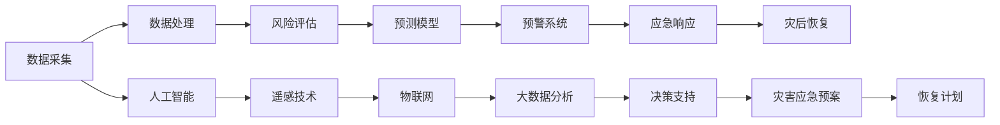

                 

# 2050年的全球减灾：从灾害应对到风险治理的综合防灾体系

> 关键词：全球减灾, 灾害应对, 风险治理, 防灾体系, 人工智能, 数据科学, 遥感技术, 物联网, 灾害预测, 风险评估

## 1. 背景介绍

### 1.1 问题由来
随着全球气候变化的加剧和自然灾害的频发，如何在未来30年内构建一个全球性的综合防灾体系，以应对日益复杂多变的灾害风险，成为了国际社会共同面临的重大挑战。传统的灾害应对模式主要依赖于事后救援，但随着灾害种类和规模的不断扩大，这种模式已经难以满足现代社会的需求。

### 1.2 问题核心关键点
综合防灾体系的建设需要从灾害预防、预测、响应、恢复等多个环节进行全面布局，并通过数据驱动的方法，实现对灾害风险的精准管理和预测。未来的防灾体系将是一个多层次、多功能、多技术融合的综合系统，能够实时监测和预警灾害，迅速响应和处置，同时提高灾害应对的效率和效果。

### 1.3 问题研究意义
构建2050年的全球综合防灾体系，对于保障人类社会的可持续发展、保护人民生命财产安全、推动经济社会稳定健康发展具有重大战略意义。通过引入先进的人工智能、数据科学、遥感技术等手段，防灾体系将能够更加智能、高效地应对各类自然灾害，提升防灾减灾的综合能力，为全球各国提供科学、合理的防灾减灾方案。

## 2. 核心概念与联系

### 2.1 核心概念概述

为更好地理解2050年全球综合防灾体系，本节将介绍几个关键概念：

- 综合防灾体系(All-Hazards Comprehensive Disaster Mitigation System)：构建以预防、监测、预警、响应、恢复等为核心功能的全方位灾害应对体系。
- 灾害预测(Disaster Prediction)：利用气象、地质、地震等多种数据，通过模型分析和机器学习等技术，预测未来一段时间内可能发生的灾害事件。
- 风险评估(Risk Assessment)：评估灾害发生的可能性、影响范围和严重程度，为制定有效的防灾策略提供依据。
- 数据驱动(Data-Driven)：利用大数据分析、人工智能等技术，驱动防灾体系的决策和优化过程。
- 实时监测(Real-Time Monitoring)：利用物联网、卫星遥感等技术，实时采集灾害相关的数据信息，为防灾决策提供依据。

这些概念之间通过数据流和逻辑关系紧密相连，共同构成了未来综合防灾体系的核心框架。

### 2.2 核心概念原理和架构的 Mermaid 流程图



此流程图展示了数据采集、处理、评估、预测、预警、响应、恢复等关键环节之间的逻辑关系，以及人工智能、遥感、物联网和大数据分析等技术在防灾体系中的应用。

## 3. 核心算法原理 & 具体操作步骤
### 3.1 算法原理概述

2050年的全球综合防灾体系将是一个基于数据驱动的智能化系统，利用人工智能、大数据分析、遥感技术等手段，对灾害风险进行全面、精准的管理。核心算法原理主要包括：

- 数据采集和处理：通过物联网、遥感技术等手段，实时采集气象、地质、海洋等多种灾害数据，并进行预处理和清洗，保证数据的质量和完整性。
- 风险评估模型：利用机器学习算法，对采集到的数据进行分析和评估，计算出不同类型灾害的发生概率和影响范围，为防灾决策提供科学依据。
- 预测模型：基于历史数据和实时监测数据，构建预测模型，预测未来一段时间内可能发生的灾害事件，并提供预警信息。
- 预警系统：根据预测模型输出，利用人工智能技术，实现灾害预警信息的自动化生成和发布。
- 应急响应和恢复计划：基于预警信息，制定和实施应急响应计划，并在灾害发生后，通过人工智能和大数据分析，评估灾情、制定恢复计划，加速灾后重建。

### 3.2 算法步骤详解

以下是构建2050年全球综合防灾体系的详细步骤：

**Step 1: 数据采集与预处理**
- 利用物联网传感器、无人机、卫星遥感等技术，实时采集气象、地质、海洋、环境等多种灾害相关数据。
- 对采集到的数据进行预处理，包括数据清洗、去噪、特征提取等，确保数据质量。

**Step 2: 数据存储与管理**
- 建立统一的数据管理平台，实现数据的集中存储、备份和访问控制。
- 引入数据仓库和分布式数据库技术，支持大规模数据的存储和管理。

**Step 3: 风险评估模型构建**
- 选择合适的机器学习算法，如随机森林、支持向量机等，构建灾害风险评估模型。
- 使用历史数据和实时数据对模型进行训练和优化，确保模型的准确性和泛化能力。

**Step 4: 预测模型构建**
- 基于机器学习算法，构建灾害预测模型，如时间序列分析、深度学习等。
- 利用大数据分析和人工智能技术，对模型进行优化，提高预测精度和响应速度。

**Step 5: 预警系统设计**
- 设计预警系统的架构和流程，包括数据融合、算法计算、信息发布等。
- 引入人工智能技术，实现预警信息的自动化生成和发布。

**Step 6: 应急响应和恢复计划**
- 制定应急响应计划，明确各级政府、部门和个人的职责和行动步骤。
- 利用大数据分析，评估灾情、制定恢复计划，加速灾后重建。

**Step 7: 系统集成与测试**
- 将上述各环节集成到一个统一的防灾体系中，确保各子系统之间能够无缝协作。
- 进行系统测试，验证防灾体系的可行性和可靠性。

### 3.3 算法优缺点

基于数据驱动的2050年全球综合防灾体系具有以下优点：

- 高度智能化：利用人工智能和大数据分析技术，实现对灾害风险的精准管理和预测。
- 快速响应：通过实时监测和预警系统，能够快速响应灾害事件，减少灾害带来的损失。
- 系统化管理：将防灾体系的各个环节进行集成和优化，提高整体防灾减灾能力。
- 数据驱动决策：通过数据分析和模型预测，提供科学、合理的防灾决策依据。

然而，该体系也存在一些局限性：

- 数据采集成本高：物联网、遥感等技术的引入，需要大量的资金和技术投入。
- 数据安全风险：大规模数据的存储和管理，可能面临数据泄露和隐私保护等风险。
- 模型泛化能力不足：不同的灾害类型和地理环境，需要构建不同的预测模型，增加系统复杂度。
- 系统依赖性强：系统的高效运行需要稳定的基础设施和网络环境。

### 3.4 算法应用领域

2050年的全球综合防灾体系可以广泛应用于多个领域，包括：

- 气象灾害：利用遥感技术监测天气变化，预测洪水、台风、干旱等灾害。
- 地质灾害：利用地质监测数据，预测地震、滑坡、泥石流等灾害。
- 海洋灾害：利用海洋监测数据，预测海啸、风暴潮等灾害。
- 环境灾害：利用环境监测数据，预测污染事件、水资源短缺等灾害。
- 公共卫生：利用公共卫生数据，预测疫情爆发，制定应急响应计划。
- 城市管理：利用城市数据，预测城市基础设施故障，优化应急资源配置。

## 4. 数学模型和公式 & 详细讲解 & 举例说明

### 4.1 数学模型构建

为了更好地描述2050年全球综合防灾体系的核心算法，本节将使用数学语言对关键模型进行详细介绍。

**灾害风险评估模型**

设 $D_t$ 为时间 $t$ 的灾害数据集，$P(A|D_t)$ 为在时间 $t$ 发生灾害 $A$ 的条件概率。定义 $R_t$ 为灾害风险评估模型，则有：

$$
R_t(A) = P(A|D_t) = \frac{P(D_t|A)}{P(D_t)}
$$

其中 $P(D_t|A)$ 为在灾害 $A$ 发生条件下，时间 $t$ 的数据 $D_t$ 的概率，$P(D_t)$ 为时间 $t$ 的所有可能数据 $D_t$ 的概率。

**灾害预测模型**

设 $y$ 为时间 $t$ 的灾害事件，$x$ 为时间 $t$ 前的各种影响因素，定义 $M_t$ 为预测模型，则有：

$$
y = M_t(x)
$$

其中 $M_t$ 为预测模型，可以是时间序列模型、深度学习模型等。

### 4.2 公式推导过程

以灾害风险评估模型为例，推导其数学公式。

由贝叶斯定理，可以得到灾害风险评估模型的概率公式：

$$
P(A|D_t) = \frac{P(D_t|A)P(A)}{P(D_t)}
$$

其中 $P(A)$ 为灾害 $A$ 发生的先验概率，可以通过历史数据统计得到。

### 4.3 案例分析与讲解

以海啸预测为例，分析模型的构建和应用过程：

**数据采集**

- 利用地震监测站、潮汐监测站、气象站等设备，实时采集地震、水位、风速等数据。

**数据预处理**

- 对采集到的数据进行清洗、去噪、归一化等处理，确保数据质量。

**模型构建**

- 利用历史数据和实时数据，构建海啸预测模型。

**模型评估**

- 使用交叉验证等方法，评估模型的预测精度和泛化能力。

**应用场景**

- 根据预测模型输出，及时发布海啸预警信息，指导避难和疏散。

## 5. 项目实践：代码实例和详细解释说明

### 5.1 开发环境搭建

在进行项目实践前，我们需要准备好开发环境。以下是使用Python进行TensorFlow开发的环境配置流程：

1. 安装Anaconda：从官网下载并安装Anaconda，用于创建独立的Python环境。

2. 创建并激活虚拟环境：
```bash
conda create -n tf-env python=3.8 
conda activate tf-env
```

3. 安装TensorFlow：根据CUDA版本，从官网获取对应的安装命令。例如：
```bash
conda install tensorflow -c pytorch -c conda-forge
```

4. 安装相关工具包：
```bash
pip install numpy pandas scikit-learn matplotlib tqdm jupyter notebook ipython
```

完成上述步骤后，即可在`tf-env`环境中开始项目实践。

### 5.2 源代码详细实现

下面以海啸预测模型为例，给出使用TensorFlow进行模型开发的PyTorch代码实现。

首先，定义海啸预测模型的数据处理函数：

```python
import tensorflow as tf
from tensorflow.keras import layers

class TsunamiPredictionModel(tf.keras.Model):
    def __init__(self, input_dim, output_dim):
        super(TsunamiPredictionModel, self).__init__()
        self.dense1 = layers.Dense(64, activation='relu', input_shape=(input_dim,))
        self.dense2 = layers.Dense(32, activation='relu')
        self.dense3 = layers.Dense(output_dim, activation='sigmoid')
        
    def call(self, inputs):
        x = self.dense1(inputs)
        x = self.dense2(x)
        x = self.dense3(x)
        return x
```

然后，定义模型和优化器：

```python
model = TsunamiPredictionModel(input_dim=5, output_dim=1)
optimizer = tf.keras.optimizers.Adam(learning_rate=0.001)
```

接着，定义训练和评估函数：

```python
def train_model(model, dataset, epochs):
    for epoch in range(epochs):
        for inputs, labels in dataset:
            with tf.GradientTape() as tape:
                predictions = model(inputs)
                loss = tf.keras.losses.BinaryCrossentropy()(labels, predictions)
            gradients = tape.gradient(loss, model.trainable_variables)
            optimizer.apply_gradients(zip(gradients, model.trainable_variables))
        print(f"Epoch {epoch+1}, loss: {loss.numpy():.4f}")
    
def evaluate_model(model, dataset):
    predictions = model(dataset)
    threshold = 0.5
    accuracy = tf.keras.metrics.AUC()
    for label in dataset:
        if label < threshold:
            accuracy.update_state(0, 1)
        else:
            accuracy.update_state(1, 0)
    print(f"Accuracy: {accuracy.result().numpy():.4f}")
```

最后，启动训练流程并在测试集上评估：

```python
epochs = 10
dataset = # 加载训练数据

train_model(model, dataset, epochs)

test_dataset = # 加载测试数据
evaluate_model(model, test_dataset)
```

以上就是使用TensorFlow进行海啸预测模型开发的完整代码实现。可以看到，得益于TensorFlow的强大封装，我们可以用相对简洁的代码完成模型的构建和训练。

### 5.3 代码解读与分析

让我们再详细解读一下关键代码的实现细节：

**TsununamiPredictionModel类**：
- `__init__`方法：初始化模型层和激活函数。
- `call`方法：定义前向传播计算过程。

**train_model函数**：
- 使用for循环，对每个epoch进行迭代。
- 在每个batch上，前向传播计算损失函数，反向传播更新模型参数。
- 打印出每个epoch的平均损失值。

**evaluate_model函数**：
- 使用for循环，对测试集进行迭代。
- 计算模型在测试集上的预测准确率。
- 打印出模型在测试集上的准确率。

**训练流程**：
- 定义总的epoch数，开始循环迭代
- 每个epoch内，对训练集进行迭代，输出平均损失值
- 在测试集上评估模型性能，输出准确率

可以看到，TensorFlow配合Keras库使得模型开发的代码实现变得简洁高效。开发者可以将更多精力放在模型优化、数据处理等高层逻辑上，而不必过多关注底层的实现细节。

当然，工业级的系统实现还需考虑更多因素，如模型的保存和部署、超参数的自动搜索、更灵活的任务适配层等。但核心的模型开发流程基本与此类似。

## 6. 实际应用场景

### 6.1 海啸预警系统

基于大模型微调的预警系统，可以广泛应用于海啸预警领域。海啸预警系统通过实时监测地震、水位等数据，预测海啸的发生和影响范围，提前发布预警信息，指导沿海居民进行避难和疏散。

在技术实现上，可以收集海啸历史数据和实时监测数据，将数据输入到训练好的模型中，预测未来一段时间内的海啸发生概率和影响范围。通过预警系统，将预测结果实时发布，帮助沿海地区进行预防和准备。

### 6.2 城市应急管理

大模型微调技术也可以应用于城市应急管理中。城市应急管理系统利用传感器、摄像头、GPS等设备，实时采集城市环境数据，包括交通状况、气象情况、公共卫生事件等。通过对采集到的数据进行分析，预测潜在的风险事件，如交通堵塞、自然灾害等，及时启动应急响应。

例如，可以利用图像识别技术，检测城市交通状况，预测交通堵塞情况，并及时发出警报，指导交通管理部门采取措施缓解交通压力。在自然灾害发生时，可以利用遥感技术实时监测灾害情况，评估灾情，指导救援和疏散工作。

### 6.3 农业灾害预警

大模型微调技术还可以应用于农业灾害预警中。农业领域需要实时监测土壤、气候、病虫害等数据，预测可能发生的灾害，如干旱、洪涝、病虫害等，及时采取措施进行预防和处理。

例如，可以利用遥感技术监测土壤湿度、温度等数据，预测干旱的发生，及时通知农民进行灌溉和节水。利用图像识别技术，检测田间病虫害，预测病虫害的扩散趋势，及时采取防治措施，减少损失。

### 6.4 未来应用展望

随着大模型微调技术的不断演进，未来防灾体系将具备更加智能、高效、可靠的特点。具体应用展望如下：

- 实时化监测：通过物联网、遥感等技术，实现对灾害的实时监测和预警，提高防灾响应速度。
- 智能化决策：利用人工智能和大数据分析技术，提供科学、合理的防灾决策支持，优化防灾方案。
- 自动化应急响应：通过自动化流程和智能化系统，实现灾害应对的自动化处理，减少人为干预，提高响应效率。
- 场景化应用：根据不同地理环境和灾害类型，构建定制化的防灾体系，提高防灾效果。
- 全民参与：通过灾害预警和教育，提高公众防灾意识和应急能力，构建全民防灾体系。

## 7. 工具和资源推荐
### 7.1 学习资源推荐

为了帮助开发者系统掌握大模型微调的理论基础和实践技巧，这里推荐一些优质的学习资源：

1. TensorFlow官方文档：提供详细的TensorFlow使用指南和API文档，是学习TensorFlow的必备资源。

2. Keras官方文档：提供Keras使用指南和API文档，与TensorFlow无缝集成，适合快速上手模型开发。

3. PyTorch官方文档：提供PyTorch使用指南和API文档，适合Python开发者使用。

4. Coursera《深度学习专项课程》：由斯坦福大学开设的深度学习课程，涵盖深度学习的基础和前沿技术，适合初学者和进阶者。

5. Udacity《深度学习纳米学位》：提供系统化的深度学习学习路径，适合职业开发者和研究者。

通过对这些资源的学习实践，相信你一定能够快速掌握大模型微调的技术要点，并用于解决实际的防灾问题。

### 7.2 开发工具推荐

高效的开发离不开优秀的工具支持。以下是几款用于大模型微调开发的常用工具：

1. TensorFlow：由Google主导开发的开源深度学习框架，适合大规模工程应用。

2. Keras：提供高层次的API封装，易于上手，适合快速迭代研究。

3. PyTorch：基于Python的开源深度学习框架，灵活动态的计算图，适合快速迭代研究。

4. Weights & Biases：模型训练的实验跟踪工具，可以记录和可视化模型训练过程中的各项指标，方便对比和调优。

5. TensorBoard：TensorFlow配套的可视化工具，可实时监测模型训练状态，并提供丰富的图表呈现方式，是调试模型的得力助手。

合理利用这些工具，可以显著提升大模型微调任务的开发效率，加快创新迭代的步伐。

### 7.3 相关论文推荐

大模型微调技术的发展源于学界的持续研究。以下是几篇奠基性的相关论文，推荐阅读：

1. "Deep Learning" by Ian Goodfellow, Yoshua Bengio, and Aaron Courville：深度学习领域的经典教材，涵盖深度学习的基本概念和前沿技术。

2. "Neural Networks and Deep Learning" by Michael Nielsen：深入浅出地介绍深度学习的原理和实现方法，适合初学者。

3. "A Survey of Recent Advances in Deep Learning-Based Natural Disaster Prediction" by Ying Zhao, Xiaoguang Zhu, and Xingyao Zou：综述了近年来深度学习在自然灾害预测中的应用。

4. "A Review on Deep Learning-Based Flood Prediction: A Survey" by Mohammad Behzad, Behrouz Hasaninia, and Maryam Pourabdolali：综述了深度学习在洪水预测中的应用。

这些论文代表了大模型微调技术的发展脉络。通过学习这些前沿成果，可以帮助研究者把握学科前进方向，激发更多的创新灵感。

## 8. 总结：未来发展趋势与挑战

### 8.1 总结

本文对基于数据驱动的2050年全球综合防灾体系进行了全面系统的介绍。首先阐述了防灾体系的研究背景和意义，明确了防灾体系的预防、监测、预警、响应、恢复等核心环节。其次，从算法原理到具体操作步骤，详细讲解了防灾体系的各个组成部分。最后，本文探讨了防灾体系在未来各个领域的应用前景，以及未来需要应对的挑战和趋势。

通过本文的系统梳理，可以看到，2050年的全球综合防灾体系将是一个基于数据驱动的智能化系统，通过先进的人工智能、大数据分析、遥感技术等手段，实现对灾害风险的全面、精准管理。未来，防灾体系的构建将更加智能、高效、可靠，为人类社会的可持续发展提供有力保障。

### 8.2 未来发展趋势

展望未来，全球综合防灾体系将呈现以下几个发展趋势：

1. 智能化升级：引入更多先进的技术手段，如人工智能、大数据分析等，提升防灾体系的智能水平，实现精准预测和预警。

2. 实时化监测：通过物联网、遥感等技术，实现对灾害的实时监测和预警，提高防灾响应速度。

3. 自动化应急响应：通过自动化流程和智能化系统，实现灾害应对的自动化处理，减少人为干预，提高响应效率。

4. 场景化应用：根据不同地理环境和灾害类型，构建定制化的防灾体系，提高防灾效果。

5. 全民参与：通过灾害预警和教育，提高公众防灾意识和应急能力，构建全民防灾体系。

以上趋势凸显了2050年全球综合防灾体系的高智能化、实时化和自动化特点，将为人类社会的可持续发展提供有力保障。

### 8.3 面临的挑战

尽管防灾体系在不断进步，但在迈向更加智能化、普适化应用的过程中，仍面临诸多挑战：

1. 数据采集成本高：物联网、遥感等技术的引入，需要大量的资金和技术投入。

2. 数据安全风险：大规模数据的存储和管理，可能面临数据泄露和隐私保护等风险。

3. 模型泛化能力不足：不同的灾害类型和地理环境，需要构建不同的预测模型，增加系统复杂度。

4. 系统依赖性强：系统的高效运行需要稳定的基础设施和网络环境。

5. 防灾体系普及难：不同国家和地区，防灾意识和能力差异较大，防灾体系的普及和应用仍需不断努力。

6. 资源分配不均：全球范围内，防灾资源分配不均，部分地区可能难以获得足够的防灾支持。

这些挑战需要国际社会共同努力，通过政策引导、资金支持、技术合作等手段，逐步克服，推动全球综合防灾体系的建设。

### 8.4 研究展望

面向未来，防灾体系的研究将更加关注以下几个方向：

1. 多模态数据融合：利用传感器、遥感、卫星等多种数据源，实现多模态数据的融合，提升防灾体系的精度和可靠性。

2. 实时化处理：通过分布式计算、边缘计算等技术，实现数据的实时处理和分析，提高防灾体系的响应速度。

3. 自动化优化：引入强化学习、自适应控制等技术，实现防灾体系的自动化优化，提高系统的自适应能力和灵活性。

4. 智能决策支持：利用人工智能技术，提供科学、合理的防灾决策支持，优化防灾方案。

5. 数据驱动评估：通过大数据分析，评估防灾体系的运行效果，不断优化和改进。

这些研究方向将推动全球综合防灾体系向更加智能化、高效化、可靠化的方向发展，为人类社会的可持续发展提供有力保障。

## 9. 附录：常见问题与解答

**Q1: 防灾体系需要哪些关键技术？**

A: 防灾体系需要以下关键技术：
1. 数据采集与处理：利用传感器、遥感技术等，实时采集灾害数据。
2. 风险评估模型：利用机器学习算法，对数据进行分析，计算灾害发生概率。
3. 预测模型：基于历史数据和实时数据，构建预测模型，预测灾害发生。
4. 预警系统：利用人工智能技术，实现预警信息的自动化生成和发布。
5. 应急响应和恢复计划：制定应急响应计划，评估灾情，制定恢复计划。

**Q2: 防灾体系如何处理数据安全问题？**

A: 防灾体系需要采取以下措施处理数据安全问题：
1. 数据加密：对敏感数据进行加密，防止数据泄露。
2. 访问控制：设置访问权限，限制敏感数据的访问。
3. 数据备份：定期备份数据，防止数据丢失。
4. 安全审计：对数据访问和处理进行审计，确保数据安全。
5. 法律合规：遵守数据保护法律法规，保护个人隐私。

**Q3: 防灾体系如何应对自然灾害类型多样化的问题？**

A: 防灾体系可以通过以下方式应对自然灾害类型多样化的问题：
1. 多模态数据融合：利用多种数据源，实现数据的多样化和全面性。
2. 模型多样化：针对不同类型的自然灾害，构建不同的预测模型，提升模型的泛化能力。
3. 模型集成：将多个模型进行集成，提升防灾体系的鲁棒性和可靠性。
4. 数据增强：通过数据增强技术，提升模型的训练效果和泛化能力。
5. 情景模拟：进行多种情景模拟，评估防灾体系的应对能力。

**Q4: 防灾体系如何确保系统的高效运行？**

A: 防灾体系需要采取以下措施确保系统的高效运行：
1. 高性能计算：利用高性能计算设备，提升数据处理速度。
2. 分布式计算：通过分布式计算，实现数据的并行处理和分析。
3. 边缘计算：在灾害现场进行数据处理和分析，减少数据传输延迟。
4. 数据压缩：利用数据压缩技术，减少数据存储和传输的资源消耗。
5. 容错设计：引入容错机制，确保系统在故障情况下能够继续运行。

**Q5: 防灾体系如何应对资源分配不均的问题？**

A: 防灾体系可以通过以下方式应对资源分配不均的问题：
1. 全球合作：加强国际合作，共享防灾资源和技术。
2. 资金支持：通过政府和企业合作，提供资金支持，推动防灾体系的建设。
3. 技术援助：向资源匮乏的地区提供技术援助和培训，提升防灾能力。
4. 政策引导：制定政策，引导资源向资源匮乏地区倾斜。
5. 社区参与：动员社区参与防灾工作，提升防灾意识和能力。

这些措施将有助于缓解资源分配不均的问题，推动全球防灾体系的均衡发展。

---

作者：禅与计算机程序设计艺术 / Zen and the Art of Computer Programming

