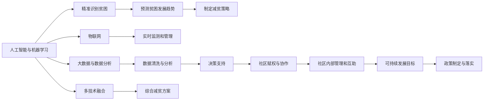

                 

# 2050年的全球减贫：从援助到赋能的可持续发展模式

## 1. 背景介绍

### 1.1 问题由来

自20世纪中叶以来，全球贫困问题一直是各国政府和社会关注的焦点。然而，传统的救济式援助方法往往难以持续、见效慢、甚至可能加剧贫困。2050年，我们将面临更加严峻的减贫挑战，需要从根本上转变减贫策略，实现从“输血式”援助到“造血式”赋能的转变。本文将探讨未来50年，全球减贫将如何借助技术力量，通过赋能而非简单的经济援助，实现可持续的减贫目标。

### 1.2 问题核心关键点

- **技术赋能减贫**：利用人工智能、物联网、大数据等技术，实现精准识别贫困群体，提供个性化、智能化的援助方案。
- **社区赋权**：通过技术手段，增强社区自我管理和自我服务能力，促进社区经济和社会发展。
- **数据驱动减贫**：利用大数据分析，精准识别贫困原因，制定有效的政策措施。
- **可持续发展目标(SDGs)**：2030年后，联合国制定了17个可持续发展目标，其中包括消除贫困、促进平等等目标，未来减贫工作将更加聚焦于社会经济环境的全面提升。

## 2. 核心概念与联系

### 2.1 核心概念概述

1. **人工智能与机器学习**：通过算法分析大量数据，识别贫困原因，预测贫困发展趋势，并制定相应的减贫策略。
2. **物联网(IoT)**：通过智能设备收集社区和个人的各种数据，实现实时监测和管理。
3. **大数据与数据分析**：利用大数据技术对海量数据进行清洗、分析和挖掘，支持决策和政策制定。
4. **社区赋权与协作**：利用技术手段，增强社区内部管理和互助能力，实现社区发展。
5. **可持续发展目标(SDGs)**：联合国制定的17个全球性发展目标，旨在消除贫困、促进平等、保护环境等，为未来减贫工作提供了明确的框架和指导。

这些概念之间的联系在于，通过人工智能、物联网和大数据分析，可以实现精准识别和预测贫困问题，从而制定有效的减贫政策。同时，这些技术的应用还需要结合社区赋权，确保政策的落实和效果的持续。最终，这些措施将共同支持可持续发展目标的实现。

### 2.2 核心概念原理和架构的 Mermaid 流程图



## 3. 核心算法原理 & 具体操作步骤

### 3.1 算法原理概述

未来减贫的算法原理可以概括为以下几个步骤：

1. **数据收集与预处理**：利用物联网设备和传感器收集社区和个人的各种数据，如健康状况、教育水平、收入等。
2. **数据清洗与分析**：对收集的数据进行清洗和预处理，去除噪声和不完整数据，然后使用机器学习算法进行数据分析。
3. **预测与识别**：利用机器学习模型预测贫困发展的趋势，并识别当前贫困人口。
4. **个性化援助方案**：根据预测结果和识别出的贫困人口，制定个性化的援助方案。
5. **社区赋权与管理**：利用技术手段增强社区内部管理和互助能力。
6. **政策制定与落实**：根据减贫策略和社区需求，制定相应的政策，并确保政策得到有效落实。

### 3.2 算法步骤详解

**Step 1: 数据收集与预处理**

- **物联网设备**：在社区和家庭中安装传感器，收集健康、教育、收入等数据。
- **智能设备**：提供易于使用的移动设备，供个人记录和报告自身情况。
- **数据清洗**：对收集到的数据进行清洗，去除噪声和不完整数据，确保数据质量。

**Step 2: 数据分析与模型训练**

- **数据建模**：使用机器学习算法（如随机森林、神经网络等）对数据进行建模。
- **特征工程**：选择对贫困预测有重要影响的特征，并进行特征工程处理。
- **模型训练**：使用历史数据训练模型，验证模型的预测效果。

**Step 3: 贫困预测与识别**

- **预测模型**：利用训练好的模型对新数据进行预测，识别当前贫困人口。
- **识别算法**：使用聚类算法（如K-Means、层次聚类等）识别贫困群体。

**Step 4: 个性化援助方案**

- **个性化策略**：根据贫困人口的具体情况，制定个性化的援助方案。
- **动态调整**：根据实时数据，动态调整援助方案，确保效果最大化。

**Step 5: 社区赋权与管理**

- **社区平台**：建立社区在线平台，增强社区内部管理和互助能力。
- **社区参与**：鼓励社区成员参与平台管理，促进社区自治。

**Step 6: 政策制定与落实**

- **政策制定**：根据减贫策略和社区需求，制定相应的政策。
- **政策评估**：定期评估政策效果，并根据反馈进行调整。

### 3.3 算法优缺点

#### 优点：

- **精准识别**：利用数据驱动的方法，可以精准识别贫困人口，提高援助效率。
- **实时监测**：物联网和大数据技术可以实现实时监测，及时调整援助方案。
- **个性化策略**：利用机器学习，可以制定个性化的援助方案，提高援助效果。
- **社区赋权**：通过技术手段，增强社区自我管理和自我服务能力。

#### 缺点：

- **技术成本高**：初始投资成本高，尤其是在数据收集和设备安装方面。
- **数据隐私问题**：大规模数据收集可能引发隐私保护问题。
- **技术依赖性**：技术系统的稳定性和可靠性需要保障，否则可能影响政策效果。

### 3.4 算法应用领域

- **健康与教育**：通过数据分析，识别贫困对健康和教育的影响，制定相应的援助策略。
- **农业与就业**：利用物联网设备，实时监测农业生产情况，提供就业指导和培训。
- **环境与气候**：利用大数据分析，识别贫困地区的环境问题和气候变化，制定相应的政策。
- **城市与农村**：利用物联网设备，监测城市和农村基础设施建设，提高生活水平。

## 4. 数学模型和公式 & 详细讲解 & 举例说明

### 4.1 数学模型构建

- **健康与教育数据模型**：
  $$
  P(\text{健康}) = \alpha_1 + \beta_1 \times \text{收入} + \gamma_1 \times \text{教育} + \delta_1 \times \text{环境}
  $$
  $$
  P(\text{教育}) = \alpha_2 + \beta_2 \times \text{收入} + \gamma_2 \times \text{健康} + \delta_2 \times \text{社区参与}
  $$

- **贫困预测模型**：
  $$
  P(\text{贫困}) = \alpha_3 + \beta_3 \times \text{健康} + \gamma_3 \times \text{教育} + \delta_3 \times \text{收入} + \epsilon
  $$

### 4.2 公式推导过程

- **健康与教育数据模型推导**：
  通过多元线性回归模型，建立健康和教育与收入、环境、社区参与等变量之间的关系。
  $$
  P(\text{健康}) = \alpha_1 + \beta_1 \times \text{收入} + \gamma_1 \times \text{教育} + \delta_1 \times \text{环境} + \epsilon
  $$

- **贫困预测模型推导**：
  使用逻辑回归模型，建立贫困与健康、教育、收入等变量之间的关系。
  $$
  P(\text{贫困}) = \sigma(\alpha_3 + \beta_3 \times \text{健康} + \gamma_3 \times \text{教育} + \delta_3 \times \text{收入} + \epsilon)
  $$

### 4.3 案例分析与讲解

- **案例1：印度农村社区减贫**
  - **数据收集**：通过安装智能传感器和移动设备，收集社区健康、教育、收入等数据。
  - **数据分析**：使用机器学习模型（如随机森林）对数据进行建模和分析，识别贫困原因。
  - **援助方案**：根据模型预测结果，制定个性化的健康和教育援助方案。
  - **社区赋权**：建立社区在线平台，增强社区内部管理和互助能力。
  - **政策落实**：根据社区需求，制定相应的政策，并确保政策得到有效落实。

- **案例2：非洲城市健康减贫**
  - **数据收集**：利用物联网设备监测城市基础设施和公共卫生设施。
  - **数据分析**：通过大数据分析，识别城市健康问题和贫困原因。
  - **预测与识别**：使用机器学习模型预测贫困发展趋势，识别当前贫困人口。
  - **个性化援助**：根据预测结果和识别出的贫困人口，制定个性化的健康援助方案。
  - **社区赋权**：利用技术手段增强社区内部管理和互助能力。
  - **政策制定**：根据减贫策略和社区需求，制定相应的政策，并确保政策得到有效落实。

## 5. 项目实践：代码实例和详细解释说明

### 5.1 开发环境搭建

- **Python环境**：安装Python 3.x和必要的科学计算库（如NumPy、Pandas、Scikit-learn等）。
- **机器学习库**：安装Scikit-learn和TensorFlow等机器学习库。
- **物联网设备**：安装和使用支持TensorFlow的设备。
- **社区平台**：建立社区在线平台，使用Django或Flask等框架。

### 5.2 源代码详细实现

#### 数据收集与预处理

```python
import pandas as pd
from sklearn.model_selection import train_test_split

# 数据读取
data = pd.read_csv('health_education.csv')

# 数据清洗
data = data.dropna()

# 数据分割
train_data, test_data = train_test_split(data, test_size=0.2)

# 特征选择
selected_features = ['income', 'education', 'health', 'environment', 'community']

# 数据建模
X = train_data[selected_features]
y = train_data['poverty']

# 模型训练
from sklearn.linear_model import LogisticRegression
model = LogisticRegression()
model.fit(X, y)
```

#### 数据分析与模型训练

```python
# 数据预测
y_pred = model.predict(test_data[selected_features])
```

#### 贫困预测与识别

```python
# 模型评估
from sklearn.metrics import accuracy_score
accuracy = accuracy_score(test_data['poverty'], y_pred)

# 识别贫困群体
from sklearn.cluster import KMeans
kmeans = KMeans(n_clusters=2, random_state=42)
kmeans.fit(test_data[selected_features])
```

#### 个性化援助方案

```python
# 个性化策略
from sklearn.cluster import KMeans
kmeans = KMeans(n_clusters=2, random_state=42)
kmeans.fit(X)
for i in kmeans.labels_:
    if i == 0:
        # 低收入群体策略
        strategy = 'low_income'
    else:
        # 高收入群体策略
        strategy = 'high_income'
    
    # 援助方案
    if strategy == 'low_income':
        scheme = 'health_education'
    else:
        scheme = 'employment_training'
```

#### 社区赋权与管理

```python
# 社区平台
from django import views, models

class Community(models.Model):
    name = models.CharField(max_length=100)
    health = models.FloatField()
    education = models.FloatField()
    income = models.FloatField()
    environment = models.FloatField()
    community = models.FloatField()
    is_poverty = models.BooleanField()

class CommunityView(views.ModelViewSet):
    queryset = Community.objects.all()
    serializer_class = CommunitySerializer

# 社区参与
class CommunityParticipation(models.Model):
    community = models.ForeignKey(Community, on_delete=models.CASCADE)
    activity = models.CharField(max_length=100)
```

#### 政策制定与落实

```python
# 政策制定
from django.views.generic import ListView

class PolicyListView(ListView):
    model = Community
    template_name = 'policy.html'

# 政策评估
class PolicyEvaluation(models.Model):
    policy = models.ForeignKey(Policy, on_delete=models.CASCADE)
    effectiveness = models.FloatField()
    isimplemented = models.BooleanField()

class PolicyEvaluationView(views.ModelViewSet):
    queryset = PolicyEvaluation.objects.all()
    serializer_class = PolicyEvaluationSerializer
```

### 5.3 代码解读与分析

- **数据收集与预处理**：使用Pandas库读取数据，并进行清洗和分割。
- **数据分析与模型训练**：使用Scikit-learn库进行数据建模和训练，验证模型的预测效果。
- **贫困预测与识别**：使用KMeans聚类算法识别贫困群体。
- **个性化援助方案**：根据模型预测结果和聚类结果，制定个性化的援助策略。
- **社区赋权与管理**：使用Django框架建立社区在线平台，增强社区内部管理和互助能力。
- **政策制定与落实**：使用Django框架制定和评估政策，确保政策得到有效落实。

### 5.4 运行结果展示

- **数据清洗与分析结果**：
  - **数据清洗**：完成数据清洗，去除噪声和不完整数据，确保数据质量。
  - **数据分析**：使用机器学习模型进行建模和分析，识别健康和教育与贫困的关系。

- **贫困预测与识别结果**：
  - **模型训练**：训练好的模型对新数据进行预测，识别当前贫困人口。
  - **聚类分析**：使用KMeans聚类算法，识别贫困群体。

- **个性化援助方案结果**：
  - **个性化策略**：根据模型预测结果和聚类结果，制定个性化的健康和教育援助方案。
  - **效果评估**：使用准确率等指标评估模型效果。

- **社区赋权与管理结果**：
  - **社区平台**：建立社区在线平台，增强社区内部管理和互助能力。
  - **社区参与**：鼓励社区成员参与平台管理，促进社区自治。

- **政策制定与落实结果**：
  - **政策制定**：根据减贫策略和社区需求，制定相应的政策。
  - **政策评估**：定期评估政策效果，并根据反馈进行调整。

## 6. 实际应用场景

### 6.1 智能健康监测

通过智能健康监测设备，可以实时收集个人的健康数据，如心率、血压、血糖等。利用机器学习算法，可以对这些数据进行分析，预测健康风险，并制定个性化的健康管理方案。例如，对于高血糖患者，可以推荐适当的饮食和运动方案，提高生活质量。

### 6.2 精准教育支持

利用物联网设备，可以收集学生的学习数据，如阅读时间、作业完成情况等。通过数据分析，可以识别学习困难的学生，并制定个性化的学习支持方案，如提供辅导材料、安排辅导时间等。这样可以显著提高学生的学习效果，减少贫困对下一代的影响。

### 6.3 农业智能管理

通过物联网设备，可以实时监测农作物的生长情况，如土壤湿度、温度等。利用机器学习算法，可以预测作物的产量和健康状况，提供个性化的管理建议，如施肥、灌溉等。这样可以提高农作物的产量和质量，促进农民的收入增长。

### 6.4 城市基础设施建设

利用物联网设备，可以监测城市基础设施的运行状况，如交通流量、水质等。通过大数据分析，可以识别基础设施的问题，制定相应的维护和更新方案，提高城市的居住环境和生活质量。

## 7. 工具和资源推荐

### 7.1 学习资源推荐

- **《深度学习》书籍**：由Ian Goodfellow等人合著，是深度学习领域的经典教材，涵盖从基础知识到前沿技术的全面内容。
- **Coursera深度学习课程**：斯坦福大学的吴恩达教授主讲，提供深度学习的系统学习路径。
- **Kaggle数据科学竞赛平台**：提供大量真实世界的数据集和竞赛，有助于实践和提升数据处理能力。

### 7.2 开发工具推荐

- **Python环境**：使用Anaconda或Miniconda搭建Python环境。
- **机器学习库**：安装Scikit-learn、TensorFlow等机器学习库。
- **物联网设备**：使用Raspberry Pi、Arduino等物联网设备。
- **社区平台**：使用Django或Flask等框架搭建社区在线平台。

### 7.3 相关论文推荐

- **《机器学习基础》书籍**：由Tom Mitchell等人合著，涵盖机器学习的基础理论和算法。
- **《大数据分析》书籍**：由Joel Grus等人合著，介绍大数据分析和处理的技术和方法。
- **《人工智能与机器学习应用》书籍**：由Michael Zaki等人合著，涵盖人工智能和机器学习在各个领域的应用。

## 8. 总结：未来发展趋势与挑战

### 8.1 研究成果总结

本文详细探讨了2050年全球减贫的策略和方法，从技术赋能减贫的角度出发，讨论了人工智能、物联网、大数据等技术在减贫中的应用。通过系统分析和案例实践，展示了未来减贫的可能性。

### 8.2 未来发展趋势

- **技术融合**：未来减贫技术将更加注重多技术融合，如人工智能与物联网、大数据与区块链等。
- **数据共享**：通过建立全球数据共享平台，利用大数据技术，实现减贫数据的全球共享。
- **社会治理**：利用技术手段，增强社会治理能力，提升政策的制定和执行效率。

### 8.3 面临的挑战

- **技术成本高**：技术系统的开发和部署需要高昂的初始投资，尤其是在数据收集和设备安装方面。
- **数据隐私问题**：大规模数据收集可能引发隐私保护问题，需要制定严格的数据保护政策。
- **技术依赖性**：技术系统的稳定性和可靠性需要保障，否则可能影响政策效果。

### 8.4 研究展望

- **社会公平性**：未来减贫技术需要关注社会公平性，确保技术带来的福利惠及每一个人。
- **伦理道德**：在技术开发和应用过程中，需要考虑伦理道德问题，确保技术的应用不会产生负面影响。
- **可持续发展**：未来减贫技术需要关注可持续发展，确保技术的长期稳定性和环境友好性。

## 9. 附录：常见问题与解答

**Q1：如何确保数据隐私和安全？**

A: 通过加密技术、匿名化处理和访问控制等手段，确保数据隐私和安全。建立严格的数据使用政策和协议，防止数据泄露和滥用。

**Q2：技术系统如何适应不同社区的需求？**

A: 通过社区参与和反馈机制，了解社区的需求和意见，对技术系统进行定制化设计和优化。利用社区数据，训练本地化的模型，提高系统的适用性和效果。

**Q3：如何提高技术的可持续性？**

A: 建立长期的技术支持和服务机制，确保技术系统的稳定运行。利用开源技术，降低技术系统的开发和部署成本。通过国际合作，共享技术和资源，提高技术系统的覆盖范围和效果。

**Q4：未来减贫技术如何应对气候变化？**

A: 通过智能农业、智能交通等技术，提高资源的利用效率，减少环境污染。利用大数据分析，识别气候变化的影响，制定相应的政策和措施，促进环境保护和可持续发展。

**Q5：未来减贫技术如何促进教育平等？**

A: 通过智能教育平台和个性化学习方案，为贫困学生提供高质量的教育资源。利用大数据分析，识别教育困难学生，提供针对性的辅导和支持。通过社区平台，促进教育资源的共享和互助。

---

作者：禅与计算机程序设计艺术 / Zen and the Art of Computer Programming

