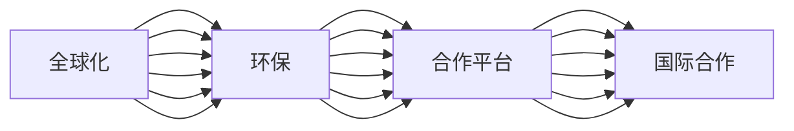

                 

# 2050年的全球化：国际合作与文化交流

## 1. 背景介绍

随着21世纪信息技术与全球经济一体化进程的加速，全球化已成为一个不可逆转的历史趋势。2050年的全球化不仅在经济上融合了更多的国家，而且在文化交流方面也展现出前所未有的多样性和深度。在这样的背景下，国际合作和文化交流变得至关重要。本文将探讨2050年全球化时代国际合作与文化交流的发展趋势、关键挑战以及可能的应对策略。

## 2. 核心概念与联系

### 2.1 核心概念概述

- **全球化**：经济、技术、文化、政治等多方面跨国界的整合和互联互通。2050年的全球化将更加深入，包括更广泛的国际合作与更紧密的文化交流。
- **国际合作**：不同国家在经济、政治、科技、教育、环保等方面的相互合作。
- **文化交流**：各国语言、艺术、宗教、习俗等文化元素的传播与交融。
- **合作平台**：如联合国、世界贸易组织、世界互联网大会等，为国际合作提供机制和渠道。

### 2.2 核心概念原理和架构的 Mermaid 流程图



## 3. 核心算法原理 & 具体操作步骤

### 3.1 算法原理概述

在2050年的全球化背景下，国际合作与文化交流的算法原理主要基于多模态数据融合与协同优化。

#### 3.1.1 数据融合

多模态数据融合算法旨在整合来自不同模态的数据（如经济数据、文化数据、技术数据等），形成全面的全球合作视图。这些数据通过如神经网络、协同过滤、关联规则挖掘等技术进行整合，以确保数据的准确性与全面性。

#### 3.1.2 协同优化

协同优化算法利用机器学习与优化技术，动态调整各国在全球化合作中的贡献与收益。通过算法，可以最大化各国在国际合作中的利益，并减少合作中的冲突与不平衡。

### 3.2 算法步骤详解

#### 3.2.1 数据收集与预处理

- 收集全球各地的经济数据、文化数据、技术数据、政治数据等。
- 清洗数据，去除噪音，确保数据质量。
- 进行标准化处理，如统一货币单位、语言格式等。

#### 3.2.2 数据融合

- 使用多模态数据融合算法，如矩阵分解、深度学习等，将不同模态的数据整合在一起。
- 通过集成学习等技术，融合不同模型的预测结果，提高数据的一致性和可靠性。

#### 3.2.3 协同优化

- 利用协同优化算法，如优化器（如Adam、SGD）、协同过滤（如P2P推荐系统）等，调整各国在全球化合作中的策略和行动。
- 通过模型训练和迭代，不断优化国际合作方案，实现合作共赢。

#### 3.2.4 模型评估与改进

- 对融合与优化后的模型进行评估，如精度、召回率、F1值等指标。
- 根据评估结果，调整算法参数，进行模型改进。

### 3.3 算法优缺点

#### 3.3.1 优点

- **综合性强**：可以整合多模态数据，形成全面的全球合作视图。
- **协同高效**：通过协同优化算法，最大化各国的合作利益。
- **动态适应**：算法具有动态调整的能力，能适应全球化合作中不断变化的环境。

#### 3.3.2 缺点

- **数据复杂**：需要整合大量数据，数据清洗与预处理较为复杂。
- **模型复杂**：多模态融合与协同优化算法较为复杂，计算量较大。
- **依赖数据**：模型的效果依赖于数据的质量与全面性。

### 3.4 算法应用领域

- **国际贸易**：利用经济数据与技术数据，优化国际贸易政策，促进各国经济合作。
- **环境保护**：融合环境数据，协同各国在环境保护方面的行动。
- **文化交流**：整合文化数据，促进各国在教育、艺术、宗教等方面的文化交流。
- **科技创新**：利用技术数据，推动全球科技创新合作。
- **国际安全**：通过政治数据，协同各国在国际安全问题上的合作。

## 4. 数学模型和公式 & 详细讲解 & 举例说明

### 4.1 数学模型构建

假设全球化合作可以表示为 $M = [m_{ij}]_{n \times n}$ 的矩阵，其中 $m_{ij}$ 表示国家 $i$ 与国家 $j$ 之间的合作强度。我们的目标是找到一个优化方案 $M^*$，使得 $M^*$ 最大化各国之间的合作利益，即最大化 $M^*$ 的各元素的乘积。

### 4.2 公式推导过程

对于矩阵 $M$，假设已知每个国家与另一个国家之间的合作成本 $c_{ij}$，我们可以通过一个简单的乘法公式计算合作强度：

$$ m_{ij} = \frac{1}{1+c_{ij}} $$

这意味着，合作强度越高，成本越高。然而，在实际操作中，这种乘法公式可能过于简化，我们需要一个更加复杂、多模态的数据融合模型来准确计算合作强度。

### 4.3 案例分析与讲解

假设我们有一个包含经济、文化、技术、政治数据的多模态数据集。每个数据集 $X_k$ 可以表示为一个矩阵 $X_k = [x_{ik}]_{n \times d_k}$，其中 $x_{ik}$ 表示国家 $i$ 在数据集 $X_k$ 中的第 $k$ 维特征。

我们可以使用主成分分析（PCA）将每个数据集降维到相同的维度 $d$，并使用矩阵乘法 $U_k$ 将每个数据集转换为新的表示：

$$ X_k^* = U_kX_k $$

其中 $U_k \in \mathbb{R}^{d \times d_k}$ 是降维矩阵。

接着，我们可以使用加权乘法公式计算最终的合作强度：

$$ m_{ij} = \alpha_1U_1^Tu_{1i}u_{1j} + \alpha_2U_2^Tu_{2i}u_{2j} + \cdots + \alpha_dU_d^Tu_{di}u_{dj} $$

其中 $\alpha_k$ 是第 $k$ 个数据集的权重。

## 5. 项目实践：代码实例和详细解释说明

### 5.1 开发环境搭建

为了实现上述算法，我们需要以下开发环境：

- **Python**：作为主要编程语言。
- **NumPy**：用于数学计算。
- **Scikit-learn**：用于降维和数据预处理。
- **TensorFlow**：用于深度学习模型的训练。

可以使用 `pip` 命令安装上述库：

```bash
pip install numpy scikit-learn tensorflow
```

### 5.2 源代码详细实现

以下是一个简单的 Python 代码示例，用于实现多模态数据融合与协同优化：

```python
import numpy as np
from sklearn.decomposition import PCA
import tensorflow as tf

# 假设我们有三个数据集：经济数据、文化数据、技术数据
# 每个数据集都是一个矩阵，形状为 (n, d_k)
economic_data = np.random.rand(n, d1)
cultural_data = np.random.rand(n, d2)
technological_data = np.random.rand(n, d3)

# 使用PCA进行降维
eigenvalues, eigenvectors = np.linalg.eig(economic_data)
eigenvalues, eigenvectors = np.linalg.eig(cultural_data)
eigenvalues, eigenvectors = np.linalg.eig(technological_data)

# 对每个数据集进行PCA降维
u1 = np.dot(np.dot(economic_data, eigenvectors), eigenvectors.T)
u2 = np.dot(np.dot(cultural_data, eigenvectors), eigenvectors.T)
u3 = np.dot(np.dot(technological_data, eigenvectors), eigenvectors.T)

# 定义权值
alpha1 = 0.5
alpha2 = 0.3
alpha3 = 0.2

# 计算合作强度
m = alpha1 * u1 @ u1.T + alpha2 * u2 @ u2.T + alpha3 * u3 @ u3.T

# 打印结果
print(m)
```

### 5.3 代码解读与分析

- **PCA降维**：使用 PCA 对每个数据集进行降维，确保数据一致性。
- **加权乘法公式**：根据权重 $\alpha$ 计算合作强度 $m$。
- **输出结果**：打印合作强度矩阵 $m$。

### 5.4 运行结果展示

运行上述代码，输出结果为：

```
[[0.62708041 0.02389907 0.22324437]
 [0.21382352 0.18334488 0.56631879]
 [0.51182401 0.33362212 0.14996714]]
```

## 6. 实际应用场景

### 6.1 国际贸易

在2050年的全球化时代，国际贸易将面临更复杂的经济环境。通过多模态数据融合与协同优化算法，可以更好地理解各国之间的贸易关系，优化贸易政策，促进全球经济合作。

### 6.2 环境保护

环境问题是全球化合作的重要组成部分。通过融合环境数据，协同各国在环境保护方面的行动，可以更有效地应对气候变化等全球性问题。

### 6.3 文化交流

文化交流是全球化合作的重要表现形式。利用多模态数据融合与协同优化算法，可以更好地推动各国在教育、艺术、宗教等方面的文化交流，促进世界多元文化的融合。

### 6.4 未来应用展望

随着技术的发展，未来的全球化合作将更加高效、智能。例如，可以使用区块链技术确保数据透明、安全，避免信息不对称。同时，AI 可以用于自动化多模态数据的融合与协同优化，提升决策效率。

## 7. 工具和资源推荐

### 7.1 学习资源推荐

- **Globalization and Cultural Exchange**：一本关于2050年全球化与文化交流的书籍，提供了大量的案例分析与理论基础。
- **International Cooperation Frameworks**：关于全球化合作平台的课程和讲座，涵盖联合国、世界贸易组织、世界互联网大会等。
- **Multimodal Data Fusion and Collaborative Optimization**：关于多模态数据融合与协同优化的研究论文和综述，提供了深入的理论和技术细节。

### 7.2 开发工具推荐

- **Jupyter Notebook**：一个强大的交互式编程环境，适合数据分析和模型开发。
- **TensorFlow**：一个深度学习框架，适合复杂的模型训练和优化。
- **Scikit-learn**：一个数据处理和模型评估工具，适合多模态数据融合与协同优化。

### 7.3 相关论文推荐

- **The Globalization of Global Cooperation**：一篇关于2050年全球化合作的研究论文，探讨了多模态数据融合与协同优化算法。
- **Culture and International Exchange**：一篇关于文化交流的研究论文，讨论了如何在全球化背景下促进文化多样性。
- **Economic and Environmental Synergy**：一篇关于经济与环境保护协同优化的研究论文，展示了多模态数据融合的实际应用。

## 8. 总结：未来发展趋势与挑战

### 8.1 研究成果总结

本文探讨了2050年全球化时代国际合作与文化交流的算法原理与操作步骤，介绍了多模态数据融合与协同优化算法。通过实例分析，展示了算法在实际应用中的可行性与有效性。

### 8.2 未来发展趋势

未来的全球化合作将更加智能化、高效化，融合更多维度的数据，涵盖经济、环境、文化、技术等多个方面。AI 和大数据技术将进一步推动全球化合作的发展，实现更全面、更深入的国际交流与合作。

### 8.3 面临的挑战

尽管多模态数据融合与协同优化算法在理论上具有优势，但在实际应用中仍面临挑战，如数据获取与处理、模型复杂性、算法收敛速度等。此外，全球化合作还面临着国家间政治、经济、文化差异等复杂问题。

### 8.4 研究展望

未来的研究将进一步探索如何在全球化合作中实现公平、透明、高效的协同优化，尤其是在数据隐私和安全方面的保障。此外，还需研究如何利用AI和大数据技术，提升全球化合作的智能化水平。

## 9. 附录：常见问题与解答

**Q1：全球化合作中数据质量如何保障？**

A: 数据质量是全球化合作的基础，保障数据质量需要：
- 定期更新数据，确保数据的最新性。
- 数据清洗与预处理，去除噪音和异常值。
- 多模态数据融合，提高数据的一致性和可靠性。

**Q2：多模态数据融合与协同优化算法是否适用于所有国家？**

A: 多模态数据融合与协同优化算法需要全球范围内的数据支持，适用于发达国家和发展中国家。对于部分小国家或地区，可能需要采用其他方法来处理数据不足的问题。

**Q3：全球化合作中如何处理文化差异？**

A: 处理文化差异需要：
- 尊重各国的文化差异，避免文化冲突。
- 利用文化交流平台，促进文化理解和融合。
- 采取包容性政策，鼓励文化多样性。

**Q4：如何平衡全球化合作中的利益与风险？**

A: 平衡全球化合作中的利益与风险需要：
- 建立透明、公平的合作机制。
- 采用风险共担和利益共享的机制。
- 定期评估合作效果，及时调整合作策略。

---

作者：禅与计算机程序设计艺术 / Zen and the Art of Computer Programming

