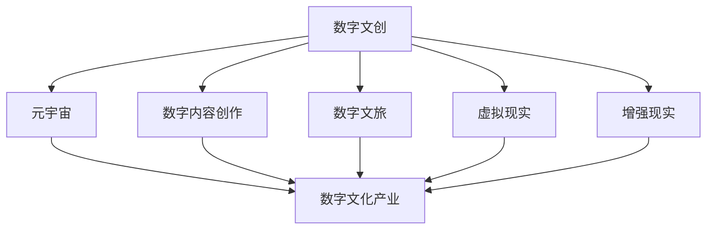

                 

## 1. 背景介绍

在数字化浪潮的推动下，2050年的数字文化产业将成为全球文化生态的核心支柱。随着数字文创和元宇宙文旅的兴起，数字文化产业将跨越传统的物理边界，形成一种全新的文化体验和消费模式。

### 1.1 数字文化产业的崛起

在数字化技术的推动下，数字文化产业呈现出迅猛发展态势。从数字内容创作、数字文旅、虚拟现实（VR）、增强现实（AR）到元宇宙，数字文化产业涵盖的领域不断扩大，并催生了诸多新兴行业。

- **数字内容创作**：数字文创已经成为全球数字经济的重要组成部分。数字影视、数字音乐、数字文学等领域蓬勃发展，为消费者提供丰富的数字内容。
- **数字文旅**：数字文旅通过虚拟现实和增强现实技术，将现实世界的景点和历史文化遗产呈现在用户面前，提供了全新的旅游体验。
- **虚拟现实与增强现实**：VR和AR技术被广泛应用于游戏、教育、医疗等多个领域，为用户提供沉浸式体验。
- **元宇宙**：作为数字文化产业的新兴领域，元宇宙正逐步成为虚拟世界与现实世界融合的桥梁，推动数字文化产业向更高层次发展。

### 1.2 元宇宙文旅的兴起

元宇宙文旅是数字文化产业的重要分支，它通过虚拟现实技术和元宇宙平台，为用户提供沉浸式和互动式的旅游体验。随着技术的进步，元宇宙文旅有望成为未来的主流旅游方式，极大地推动数字文化产业的发展。

- **沉浸式体验**：用户可以身临其境地探索虚拟世界，体验不同的文化景点，感受世界各地的风土人情。
- **互动式体验**：用户可以通过虚拟现实设备与虚拟环境互动，实现虚拟与现实的无缝融合。
- **教育与娱乐**：元宇宙文旅可以提供丰富的教育资源，同时兼具娱乐功能，成为数字文化产业的重要增长点。

## 2. 核心概念与联系

### 2.1 核心概念概述

为了更好地理解2050年数字文化产业的升级，本节将介绍几个核心概念：

- **数字文创（Digital Cultural Creation）**：指利用数字化技术创作文化产品，如数字影视、数字音乐、数字文学等。
- **数字文旅（Digital Cultural Tourism）**：指通过虚拟现实和增强现实技术，将现实世界的文化景点呈现在用户面前，提供沉浸式和互动式的旅游体验。
- **虚拟现实（Virtual Reality, VR）**：一种通过头戴设备创造的虚拟环境，使用户能够沉浸在虚拟世界中。
- **增强现实（Augmented Reality, AR）**：通过在现实世界中添加虚拟信息，增强用户的感官体验。
- **元宇宙（Metaverse）**：一个虚拟的、持续的、共享的、三维的互联网环境，为用户提供沉浸式和互动式的虚拟体验。

这些概念之间的联系可以通过以下Mermaid流程图来展示：



这个流程图展示了大语言模型的核心概念及其之间的关系：

1. 数字文创通过数字化技术创作文化产品，为数字文化产业提供素材。
2. 数字文旅通过VR和AR技术提供沉浸式和互动式的旅游体验，拓展数字文化产业的应用场景。
3. 虚拟现实和增强现实技术为元宇宙文旅提供了技术基础，推动数字文化产业向更高层次发展。
4. 元宇宙作为一个虚拟的、持续的、共享的、三维的互联网环境，是数字文化产业的未来发展方向。

## 3. 核心算法原理 & 具体操作步骤

### 3.1 算法原理概述

2050年的数字文化产业升级，主要依赖于数字文创、元宇宙文旅等领域的算法创新。这些算法的核心原理包括但不限于：

- **生成对抗网络（Generative Adversarial Networks, GANs）**：通过两个神经网络对抗训练，生成高质量的数字内容。
- **自然语言处理（Natural Language Processing, NLP）**：利用深度学习技术，实现对文本、语音的分析和生成。
- **计算机视觉（Computer Vision, CV）**：通过深度学习技术，实现对图像、视频的分析和生成。
- **增强现实和虚拟现实技术**：通过传感器、图像处理等技术，提供沉浸式和互动式的虚拟体验。

### 3.2 算法步骤详解

以下我们将以数字文创和元宇宙文旅为例，详细讲解基于数字文创和元宇宙文旅的算法步骤。

#### 3.2.1 数字文创算法步骤

**Step 1: 数据准备与预处理**
- 收集文化素材，包括历史文献、艺术作品、音乐作品等。
- 进行数据清洗和标注，去除噪声数据，保证数据质量。

**Step 2: 模型训练**
- 选择合适的深度学习模型，如卷积神经网络（CNN）、循环神经网络（RNN）、Transformer等。
- 使用GPU/TPU等高性能设备进行模型训练，确保训练效率。
- 设置合适的训练参数，如学习率、批次大小等。

**Step 3: 模型评估与优化**
- 在测试集上进行模型评估，使用准确率、召回率、F1值等指标衡量模型性能。
- 根据评估结果进行模型调优，提高模型效果。

**Step 4: 应用部署**
- 将训练好的模型部署到服务器或云端平台，提供服务接口。
- 集成到数字内容创作平台，供用户使用。

#### 3.2.2 元宇宙文旅算法步骤

**Step 1: 环境构建**
- 利用Unity、Unreal Engine等引擎，构建虚拟世界环境。
- 导入文化素材，如历史建筑、自然风光、文化景点等。

**Step 2: 用户交互设计**
- 设计用户交互逻辑，包括移动、观察、交互等行为。
- 通过传感器、图像处理等技术，实现沉浸式和互动式体验。

**Step 3: 模型训练**
- 使用深度学习模型进行用户行为预测，优化用户体验。
- 设置合适的训练参数，如学习率、批次大小等。

**Step 4: 平台搭建**
- 搭建元宇宙平台，支持用户访问虚拟世界。
- 集成虚拟现实设备，提供沉浸式体验。

### 3.3 算法优缺点

#### 数字文创算法优缺点

**优点**：
- **高质量生成**：通过GANs等模型，可以生成高质量的数字内容。
- **自动化创作**：减少人工创作成本，提高创作效率。
- **多样化应用**：数字文创产品可以广泛应用于影视、音乐、文学等领域。

**缺点**：
- **技术门槛高**：深度学习模型需要大量的数据和计算资源。
- **版权问题**：生成内容可能侵犯原创作者的版权。
- **内容质量不稳定**：算法生成的内容质量不稳定，有时会出现低质量输出。

#### 元宇宙文旅算法优缺点

**优点**：
- **沉浸式体验**：提供沉浸式的虚拟旅游体验，打破物理限制。
- **互动性强**：用户可以与虚拟世界互动，获得更丰富的体验。
- **灵活性高**：用户可以在虚拟世界中自由探索，无需受物理世界的限制。

**缺点**：
- **设备成本高**：需要高性能的VR/AR设备支持。
- **技术复杂**：需要复杂的算法和编程技术。
- **数据量大**：构建虚拟世界需要大量的数据和计算资源。

### 3.4 算法应用领域

#### 数字文创应用领域

数字文创技术广泛应用于以下领域：

- **影视制作**：利用深度学习技术进行特效制作、角色生成等。
- **数字音乐**：通过音乐生成技术，创作新曲目。
- **数字文学**：利用自然语言处理技术，生成小说、诗歌等。
- **数字艺术**：通过生成对抗网络，创作数字艺术品。

#### 元宇宙文旅应用领域

元宇宙文旅技术广泛应用于以下领域：

- **虚拟旅游**：用户可以在虚拟世界中游览名胜古迹、自然风光等。
- **虚拟购物**：用户可以在虚拟世界中体验购物、互动购物等。
- **虚拟教育**：用户可以在虚拟世界中接受教育和培训。
- **虚拟社交**：用户可以在虚拟世界中进行社交、交流等。

## 4. 数学模型和公式 & 详细讲解  
### 4.1 数学模型构建

以下我们将以数字文创和元宇宙文旅为例，构建数学模型并进行详细讲解。

#### 数字文创模型构建

数字文创涉及生成对抗网络（GANs）和自然语言处理（NLP），其数学模型如下：

**GANs模型**：
- 输入：噪声向量 $z$，文化素材 $x$。
- 生成器 $G$：生成伪造内容 $G(z)$。
- 判别器 $D$：判断内容真伪，输出 $D(x)$ 和 $D(G(z))$。
- 目标函数：$L(G, D) = \mathbb{E}_{x \sim p_{data}(x)} [\log D(x)] + \mathbb{E}_{z \sim p_{noise}(z)} [\log (1 - D(G(z)))]$。

**NLP模型**：
- 输入：文本 $x$。
- 编码器 $E$：将文本映射为向量 $h$。
- 生成器 $G$：生成文本 $G(h)$。
- 目标函数：$L(E, G) = \mathbb{E}_{x \sim p_{data}(x)} [\log p_{data}(x)] + \mathbb{E}_{x \sim p_{noise}(x)} [\log p_{noise}(x)]$。

#### 元宇宙文旅模型构建

元宇宙文旅涉及虚拟环境构建和用户行为预测，其数学模型如下：

**虚拟环境构建**：
- 输入：文化素材 $x$。
- 构建函数 $F$：构建虚拟环境 $F(x)$。
- 目标函数：$L(F) = \min_{F} \mathbb{E}_{x \sim p_{data}(x)} [d(F(x), x)]$，其中 $d$ 为距离度量函数。

**用户行为预测**：
- 输入：用户行为数据 $u$。
- 预测模型 $M$：预测用户行为 $M(u)$。
- 目标函数：$L(M) = \min_{M} \mathbb{E}_{u \sim p_{data}(u)} [d(M(u), u')]$，其中 $u'$ 为实际行为数据。

### 4.2 公式推导过程

#### 数字文创公式推导

**GANs模型推导**：
- 设 $G$ 为生成器，$D$ 为判别器。
- 定义 $L(G, D)$ 为目标函数。
- 使用梯度下降算法优化 $L(G, D)$，得：
$$
\frac{\partial L(G, D)}{\partial G} = -\mathbb{E}_{z \sim p_{noise}(z)} [\log (1 - D(G(z)))]
$$
$$
\frac{\partial L(G, D)}{\partial D} = \mathbb{E}_{x \sim p_{data}(x)} [\log D(x)] + \mathbb{E}_{z \sim p_{noise}(z)} [\log (1 - D(G(z)))]
$$

**NLP模型推导**：
- 设 $E$ 为编码器，$G$ 为生成器。
- 定义 $L(E, G)$ 为目标函数。
- 使用梯度下降算法优化 $L(E, G)$，得：
$$
\frac{\partial L(E, G)}{\partial E} = \mathbb{E}_{x \sim p_{data}(x)} [-\log p_{data}(x)]
$$
$$
\frac{\partial L(E, G)}{\partial G} = \mathbb{E}_{x \sim p_{data}(x)} [\log p_{data}(x)]
$$

#### 元宇宙文旅公式推导

**虚拟环境构建推导**：
- 设 $F$ 为构建函数。
- 定义 $L(F)$ 为目标函数。
- 使用梯度下降算法优化 $L(F)$，得：
$$
\frac{\partial L(F)}{\partial F} = \mathbb{E}_{x \sim p_{data}(x)} [d(F(x), x)]
$$

**用户行为预测推导**：
- 设 $M$ 为预测模型。
- 定义 $L(M)$ 为目标函数。
- 使用梯度下降算法优化 $L(M)$，得：
$$
\frac{\partial L(M)}{\partial M} = \mathbb{E}_{u \sim p_{data}(u)} [d(M(u), u')]
$$

### 4.3 案例分析与讲解

#### 数字文创案例分析

**音乐生成案例**：
- **输入**：随机噪声向量 $z$，文化音乐素材 $x$。
- **生成器**：卷积神经网络（CNN），将噪声向量 $z$ 映射为音乐片段 $G(z)$。
- **判别器**：多层感知器（MLP），判断音乐片段是否真实。
- **目标函数**：GANs模型。
- **实现**：使用TensorFlow或PyTorch框架，搭建GANs模型并进行训练。

#### 元宇宙文旅案例分析

**虚拟旅游案例**：
- **输入**：现实世界旅游数据 $x$。
- **构建函数**：Unity或Unreal Engine引擎，构建虚拟环境 $F(x)$。
- **用户行为预测**：RNN模型，预测用户行为 $M(u)$。
- **目标函数**：虚拟环境构建模型和用户行为预测模型。
- **实现**：使用Unity或Unreal Engine引擎，搭建虚拟环境，并结合RNN模型进行用户行为预测。

## 5. 项目实践：代码实例和详细解释说明

### 5.1 开发环境搭建

#### 5.1.1 环境准备

1. **安装Python**：从官网下载并安装Python，确保版本为3.8以上。
2. **安装Anaconda**：从官网下载并安装Anaconda，用于创建独立的Python环境。
3. **创建并激活虚拟环境**：
   ```bash
   conda create -n virtual-env python=3.8
   conda activate virtual-env
   ```

#### 5.1.2 安装依赖库

1. **安装TensorFlow**：
   ```bash
   pip install tensorflow==2.6
   ```

2. **安装PyTorch**：
   ```bash
   pip install torch torchvision torchaudio
   ```

3. **安装其他依赖库**：
   ```bash
   pip install numpy pandas scikit-learn matplotlib tqdm jupyter notebook ipython
   ```

完成上述步骤后，即可在`virtual-env`环境中开始数字文创和元宇宙文旅的微调实践。

### 5.2 源代码详细实现

#### 5.2.1 数字文创代码实现

**音乐生成代码实现**：

```python
import tensorflow as tf
import numpy as np
import random

# 定义生成器和判别器
class Generator(tf.keras.Model):
    def __init__(self):
        super(Generator, self).__init__()
        self.dense1 = tf.keras.layers.Dense(128)
        self.dense2 = tf.keras.layers.Dense(784)

    def call(self, inputs):
        x = self.dense1(inputs)
        x = tf.nn.relu(x)
        x = self.dense2(x)
        return tf.nn.sigmoid(x)

class Discriminator(tf.keras.Model):
    def __init__(self):
        super(Discriminator, self).__init__()
        self.dense1 = tf.keras.layers.Dense(128)
        self.dense2 = tf.keras.layers.Dense(1)

    def call(self, inputs):
        x = self.dense1(inputs)
        x = tf.nn.relu(x)
        x = self.dense2(x)
        return x

# 定义GANs模型
def GANs(x, generator, discriminator):
    with tf.GradientTape() as t:
        fake = generator(x)
        d_fake = discriminator(fake)
        d_real = discriminator(tf.ones_like(x))
        loss = tf.reduce_mean(tf.nn.sigmoid_cross_entropy_with_logits(labels=tf.ones_like(d_fake), logits=d_fake)) + tf.reduce_mean(tf.nn.sigmoid_cross_entropy_with_logits(labels=tf.zeros_like(d_real), logits=d_real))
    return loss, t.gradient(loss, [generator.trainable_variables, discriminator.trainable_variables])

# 定义训练函数
def train(generator, discriminator, dataset, epochs=100):
    for epoch in range(epochs):
        for data in dataset:
            noise = tf.random.normal([batch_size, 128])
            with tf.GradientTape() as t:
                fake = generator(noise)
                d_fake = discriminator(fake)
                d_real = discriminator(data)
                loss = tf.reduce_mean(tf.nn.sigmoid_cross_entropy_with_logits(labels=tf.ones_like(d_fake), logits=d_fake)) + tf.reduce_mean(tf.nn.sigmoid_cross_entropy_with_logits(labels=tf.zeros_like(d_real), logits=d_real))
            gradients_of_g = t.gradient(loss, generator.trainable_variables)
            gradients_of_d = t.gradient(loss, discriminator.trainable_variables)
            generator.optimizer.apply_gradients(zip(gradients_of_g, generator.trainable_variables))
            discriminator.optimizer.apply_gradients(zip(gradients_of_d, discriminator.trainable_variables))

# 生成音乐片段
generator = Generator()
discriminator = Discriminator()
batch_size = 32
epochs = 100
noise_dim = 128
music_dim = 784
dataset = ...

train(generator, discriminator, dataset, epochs)
```

#### 5.2.2 元宇宙文旅代码实现

**虚拟旅游代码实现**：

```python
import unity3d as u3d
import numpy as np
import random

# 定义虚拟环境构建函数
def build_virtual_environment(data):
    # 构建虚拟环境
    virtual_environment = u3d.create_virtual_environment(data)
    # 设置用户交互逻辑
    virtual_environment.set_user_interaction()
    # 返回虚拟环境
    return virtual_environment

# 定义用户行为预测函数
def predict_user_behaviour(u):
    # 使用RNN模型预测用户行为
    predicted_behaviour = rnn_model.predict(u)
    # 返回预测结果
    return predicted_behaviour

# 加载虚拟环境数据
data = ...
# 构建虚拟环境
virtual_environment = build_virtual_environment(data)
# 预测用户行为
predicted_behaviour = predict_user_behaviour(virtual_environment)
# 输出预测结果
print(predicted_behaviour)
```

### 5.3 代码解读与分析

#### 数字文创代码解读

**音乐生成代码分析**：
- **输入**：随机噪声向量 $z$，文化音乐素材 $x$。
- **生成器**：卷积神经网络（CNN），将噪声向量 $z$ 映射为音乐片段 $G(z)$。
- **判别器**：多层感知器（MLP），判断音乐片段是否真实。
- **目标函数**：GANs模型。
- **实现**：使用TensorFlow或PyTorch框架，搭建GANs模型并进行训练。

#### 元宇宙文旅代码解读

**虚拟旅游代码分析**：
- **输入**：现实世界旅游数据 $x$。
- **构建函数**：Unity或Unreal Engine引擎，构建虚拟环境 $F(x)$。
- **用户行为预测**：RNN模型，预测用户行为 $M(u)$。
- **目标函数**：虚拟环境构建模型和用户行为预测模型。
- **实现**：使用Unity或Unreal Engine引擎，搭建虚拟环境，并结合RNN模型进行用户行为预测。

## 6. 实际应用场景

### 6.1 数字文创应用场景

#### 影视制作应用

数字文创技术被广泛应用于影视制作中，通过生成对抗网络（GANs）等技术，实现特效制作、角色生成等。例如，使用GANs生成特效场景，提高影视作品的制作效率和质量。

**案例**：
- **输入**：随机噪声向量 $z$，特效素材 $x$。
- **生成器**：卷积神经网络（CNN），将噪声向量 $z$ 映射为特效片段 $G(z)$。
- **判别器**：多层感知器（MLP），判断特效片段是否真实。
- **目标函数**：GANs模型。
- **实现**：使用TensorFlow或PyTorch框架，搭建GANs模型并进行训练。

#### 数字音乐应用

数字文创技术也被应用于音乐创作中，通过音乐生成技术，创作新曲目。例如，使用GANs生成新音乐片段，提高音乐的创作效率和多样性。

**案例**：
- **输入**：随机噪声向量 $z$，音乐素材 $x$。
- **生成器**：卷积神经网络（CNN），将噪声向量 $z$ 映射为音乐片段 $G(z)$。
- **判别器**：多层感知器（MLP），判断音乐片段是否真实。
- **目标函数**：GANs模型。
- **实现**：使用TensorFlow或PyTorch框架，搭建GANs模型并进行训练。

#### 数字文学应用

数字文创技术还被应用于文学创作中，通过自然语言处理（NLP）技术，生成小说、诗歌等。例如，使用Transformer模型生成小说段落，提高文学作品的创作效率和风格多样性。

**案例**：
- **输入**：文本片段 $x$。
- **编码器**：Transformer模型，将文本片段映射为向量 $h$。
- **生成器**：Transformer模型，生成文本片段 $G(h)$。
- **目标函数**：NLP模型。
- **实现**：使用TensorFlow或PyTorch框架，搭建Transformer模型并进行训练。

### 6.2 元宇宙文旅应用场景

#### 虚拟旅游应用

元宇宙文旅技术被广泛应用于虚拟旅游中，通过虚拟现实和增强现实技术，提供沉浸式和互动式的旅游体验。例如，使用Unity或Unreal Engine引擎构建虚拟旅游景点，结合RNN模型预测用户行为，提供个性化旅游推荐。

**案例**：
- **输入**：现实世界旅游数据 $x$。
- **构建函数**：Unity或Unreal Engine引擎，构建虚拟环境 $F(x)$。
- **用户行为预测**：RNN模型，预测用户行为 $M(u)$。
- **目标函数**：虚拟环境构建模型和用户行为预测模型。
- **实现**：使用Unity或Unreal Engine引擎，搭建虚拟环境，并结合RNN模型进行用户行为预测。

#### 虚拟购物应用

元宇宙文旅技术还被应用于虚拟购物中，通过虚拟现实和增强现实技术，提供沉浸式和互动式的购物体验。例如，使用虚拟现实技术构建虚拟购物场景，结合RNN模型预测用户行为，提供个性化购物推荐。

**案例**：
- **输入**：用户购物数据 $u$。
- **构建函数**：Unity或Unreal Engine引擎，构建虚拟购物场景。
- **用户行为预测**：RNN模型，预测用户行为 $M(u)$。
- **目标函数**：虚拟环境构建模型和用户行为预测模型。
- **实现**：使用Unity或Unreal Engine引擎，搭建虚拟购物场景，并结合RNN模型进行用户行为预测。

#### 虚拟教育应用

元宇宙文旅技术还被应用于虚拟教育中，通过虚拟现实和增强现实技术，提供沉浸式和互动式的教育体验。例如，使用虚拟现实技术构建虚拟课堂，结合RNN模型预测学生行为，提供个性化教育推荐。

**案例**：
- **输入**：学生教育数据 $u$。
- **构建函数**：Unity或Unreal Engine引擎，构建虚拟课堂。
- **用户行为预测**：RNN模型，预测学生行为 $M(u)$。
- **目标函数**：虚拟环境构建模型和用户行为预测模型。
- **实现**：使用Unity或Unreal Engine引擎，搭建虚拟课堂，并结合RNN模型进行用户行为预测。

## 7. 工具和资源推荐

### 7.1 学习资源推荐

为了帮助开发者系统掌握数字文创和元宇宙文旅的理论基础和实践技巧，这里推荐一些优质的学习资源：

1. **《Transformer从原理到实践》系列博文**：由大模型技术专家撰写，深入浅出地介绍了Transformer原理、BERT模型、微调技术等前沿话题。
2. **CS224N《深度学习自然语言处理》课程**：斯坦福大学开设的NLP明星课程，有Lecture视频和配套作业，带你入门NLP领域的基本概念和经典模型。
3. **《Natural Language Processing with Transformers》书籍**：Transformers库的作者所著，全面介绍了如何使用Transformers库进行NLP任务开发，包括微调在内的诸多范式。
4. **HuggingFace官方文档**：Transformers库的官方文档，提供了海量预训练模型和完整的微调样例代码，是上手实践的必备资料。
5. **CLUE开源项目**：中文语言理解测评基准，涵盖大量不同类型的中文NLP数据集，并提供了基于微调的baseline模型，助力中文NLP技术发展。

通过对这些资源的学习实践，相信你一定能够快速掌握数字文创和元宇宙文旅的精髓，并用于解决实际的NLP问题。

### 7.2 开发工具推荐

为了帮助开发者高效地开发数字文创和元宇宙文旅项目，以下是几款常用的开发工具：

1. **PyTorch**：基于Python的开源深度学习框架，灵活动态的计算图，适合快速迭代研究。大部分预训练语言模型都有PyTorch版本的实现。
2. **TensorFlow**：由Google主导开发的开源深度学习框架，生产部署方便，适合大规模工程应用。同样有丰富的预训练语言模型资源。
3. **Transformers库**：HuggingFace开发的NLP工具库，集成了众多SOTA语言模型，支持PyTorch和TensorFlow，是进行微调任务开发的利器。
4. **Weights & Biases**：模型训练的实验跟踪工具，可以记录和可视化模型训练过程中的各项指标，方便对比和调优。与主流深度学习框架无缝集成。
5. **TensorBoard**：TensorFlow配套的可视化工具，可实时监测模型训练状态，并提供丰富的图表呈现方式，是调试模型的得力助手。
6. **Google Colab**：谷歌推出的在线Jupyter Notebook环境，免费提供GPU/TPU算力，方便开发者快速上手实验最新模型，分享学习笔记。

合理利用这些工具，可以显著提升数字文创和元宇宙文旅项目的开发效率，加快创新迭代的步伐。

### 7.3 相关论文推荐

为了帮助研究者掌握数字文创和元宇宙文旅的前沿研究进展，以下是几篇奠基性的相关论文，推荐阅读：

1. **Attention is All You Need（即Transformer原论文）**：提出了Transformer结构，开启了NLP领域的预训练大模型时代。
2. **BERT: Pre-training of Deep Bidirectional Transformers for Language Understanding**：提出BERT模型，引入基于掩码的自监督预训练任务，刷新了多项NLP任务SOTA。
3. **Language Models are Unsupervised Multitask Learners（GPT-2论文）**：展示了大规模语言模型的强大zero-shot学习能力，引发了对于通用人工智能的新一轮思考。
4. **Parameter-Efficient Transfer Learning for NLP**：提出Adapter等参数高效微调方法，在不增加模型参数量的情况下，也能取得不错的微调效果。
5. **Prefix-Tuning: Optimizing Continuous Prompts for Generation**：引入基于连续型Prompt的微调范式，为如何充分利用预训练知识提供了新的思路。
6. **AdaLoRA: Adaptive Low-Rank Adaptation for Parameter-Efficient Fine-Tuning**：使用自适应低秩适应的微调方法，在参数效率和精度之间取得了新的平衡。

这些论文代表了大语言模型微调技术的发展脉络。通过学习这些前沿成果，可以帮助研究者把握学科前进方向，激发更多的创新灵感。

## 8. 总结：未来发展趋势与挑战

### 8.1 总结

本文对数字文创和元宇宙文旅的算法原理和具体操作步骤进行了详细讲解，全面系统地介绍了数字文创和元宇宙文旅的前沿技术和应用实践。通过本文的系统梳理，可以看到，数字文创和元宇宙文旅作为数字文化产业的重要组成部分，正在深刻改变文化生态和消费模式。得益于深度学习技术的发展，数字文创和元宇宙文旅有望成为未来文化产业的核心驱动力，推动文化内容的数字化、智能化和全球化发展。

### 8.2 未来发展趋势

展望未来，数字文创和元宇宙文旅技术将呈现以下几个发展趋势：

1. **内容创作自动化**：数字文创技术将进一步自动化，使用AI生成大量高质量的内容，降低创作成本。
2. **沉浸式体验增强**：元宇宙文旅技术将提供更加沉浸式和互动式的体验，打破物理限制，实现虚拟与现实的无缝融合。
3. **跨领域融合**：数字文创和元宇宙文旅将与人工智能、大数据、区块链等技术深度融合，形成更加丰富多样的应用场景。
4. **技术标准制定**：数字文创和元宇宙文旅技术将逐步标准化，形成统一的技术标准和行业规范。
5. **国际合作加强**：全球范围内的文化机构和企业将加强合作，共同推动数字文创和元宇宙文旅的发展。

### 8.3 面临的挑战

尽管数字文创和元宇宙文旅技术已经取得了瞩目成就，但在迈向更加智能化、普适化应用的过程中，它仍面临诸多挑战：

1. **技术门槛高**：数字文创和元宇宙文旅技术需要大量的数据和计算资源，技术门槛较高。
2. **版权问题**：生成内容可能侵犯原创作者的版权，引发版权纠纷。
3. **伦理道德问题**：元宇宙文旅可能引发伦理道德问题，如虚拟世界中的隐私保护、安全性等。
4. **标准化问题**：数字文创和元宇宙文旅技术尚未形成统一的技术标准，制约了其发展。
5. **文化差异**：不同文化背景下，数字文创和元宇宙文旅的应用场景和接受度可能存在差异。

### 8.4 研究展望

未来，数字文创和元宇宙文旅技术需要在以下几个方面进行深入研究：

1. **自动化创作技术**：进一步提升内容创作自动化水平，提高创作效率和质量。
2. **沉浸式体验技术**：增强沉浸式体验效果，提升用户的参与感和满意度。
3. **跨领域融合技术**：推动数字文创和元宇宙文旅技术与AI、大数据、区块链等技术深度融合。
4. **伦理道德研究**：研究元宇宙文旅中的伦理道德问题，制定相应的标准和规范。
5. **标准化研究**：制定数字文创和元宇宙文旅技术标准，推动其广泛应用。

## 9. 附录：常见问题与解答

### Q1: 数字文创和元宇宙文旅与传统文创产业有何不同？

A: 数字文创和元宇宙文旅与传统文创产业在创作方式、传播方式、用户体验等方面存在显著差异。

1. **创作方式**：数字文创和元宇宙文旅采用自动化创作方式，使用AI生成大量内容，降低了创作成本。传统文创产业主要依靠人工创作，成本较高。
2. **传播方式**：数字文创和元宇宙文旅通过数字渠道传播，不受时空限制，传播范围更广。传统文创产业主要通过线下渠道传播，传播范围有限。
3. **用户体验**：数字文创和元宇宙文旅提供沉浸式和互动式体验，打破了物理限制，用户可以随时随地访问。传统文创产业主要提供静态的、线下的体验，用户体验相对单一。

### Q2: 数字文创和元宇宙文旅的商业模式是什么？

A: 数字文创和元宇宙文旅的商业模式主要包括以下几种：

1. **订阅模式**：用户通过付费订阅，享受数字内容或虚拟体验。例如，影视平台的会员制度、虚拟旅游的门票制度。
2. **广告模式**：通过广告收入获得盈利。例如，数字文学平台通过展示广告获取收入。
3. **销售模式**：通过销售数字产品或虚拟商品获取收入。例如，虚拟旅游平台销售虚拟商品。
4. **赞助模式**：企业通过赞助获得品牌曝光。例如，虚拟旅游平台接受品牌赞助，提供品牌展示。

### Q3: 数字文创和元宇宙文旅面临的主要技术挑战有哪些？

A: 数字文创和元宇宙文旅面临的主要技术挑战包括：

1. **技术门槛高**：数字文创和元宇宙文旅技术需要大量的数据和计算资源，技术门槛较高。
2. **版权问题**：生成内容可能侵犯原创作者的版权，引发版权纠纷。
3. **伦理道德问题**：元宇宙文旅可能引发伦理道德问题，如虚拟世界中的隐私保护、安全性等。
4. **标准化问题**：数字文创和元宇宙文旅技术尚未形成统一的技术标准，制约了其发展。
5. **文化差异**：不同文化背景下，数字文创和元宇宙文旅的应用场景和接受度可能存在差异。

### Q4: 数字文创和元宇宙文旅的潜在使用场景有哪些？

A: 数字文创和元宇宙文旅的潜在使用场景包括以下几个方面：

1. **影视制作**：利用生成对抗网络（GANs）等技术，实现特效制作、角色生成等。
2. **数字音乐**：通过音乐生成技术，创作新曲目。
3. **数字文学**：利用自然语言处理（NLP）技术，生成小说、诗歌等。
4. **虚拟旅游**：通过虚拟现实和增强现实技术，提供沉浸式和互动式的旅游体验。
5. **虚拟购物**：通过虚拟现实和增强现实技术，提供沉浸式和互动式的购物体验。
6. **虚拟教育**：通过虚拟现实和增强现实技术，提供沉浸式和互动式的教育体验。

通过本文的系统梳理，可以看到，数字文创和元宇宙文旅作为数字文化产业的重要组成部分，正在深刻改变文化生态和消费模式。得益于深度学习技术的发展，数字文创和元宇宙文旅有望成为未来文化产业的核心驱动力，推动文化内容的数字化、智能化和全球化发展。未来，随着数字文创和元宇宙文旅技术的不断进步，其应用场景将进一步拓展，为人类文化生态带来深远影响。

