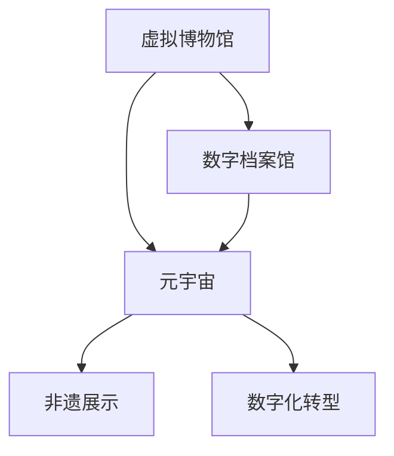

                 

# 2050年的数字文化：从虚拟博物馆到元宇宙非遗展示的数字文化传承

> 关键词：数字文化、虚拟博物馆、元宇宙、非遗展示、数字文化传承、数字化转型

## 1. 背景介绍

随着数字技术的飞速发展，人类社会正加速进入以数字文化为核心的新时代。从虚拟博物馆、数字档案馆到元宇宙非遗展示，这一系列创新形式的数字化文化传承，不仅极大丰富了文化体验和保存方式，也为传统文化的可持续发展提供了新的可能性。本篇文章旨在探讨2050年数字文化的未来图景，及其对社会文化传承的深远影响。

### 1.1 数字文化及其重要性

数字文化（Digital Culture）指通过数字技术保存、传播和创新的文化形式，包括但不限于虚拟现实（VR）、增强现实（AR）、数字艺术、数字音乐、虚拟博物馆、数字档案馆等。数字文化不仅是信息时代文化表现的新形态，更是推动社会进步、促进文化交流、保护文化遗产的重要手段。

在2050年，数字文化将成为主流，普及到社会的各个角落，成为推动社会进步、文化传承和经济发展的重要驱动力。通过数字技术，人们可以跨越时间和空间的限制，自由地获取、分享和体验世界各地的文化遗产，这种便捷性和普及性是任何传统方式都无法比拟的。

### 1.2 虚拟博物馆与数字档案馆

虚拟博物馆（Virtual Museums）和数字档案馆（Digital Archives）是数字文化的重要组成部分，它们通过数字化技术，将历史文物、艺术作品等实体形式转换为数字形式，实现了文化的永续保存和全球共享。

虚拟博物馆通过三维建模、高精度扫描和虚拟现实技术，为观众提供身临其境的参观体验。用户可以通过虚拟头盔进入博物馆，近距离观察展品，甚至可以“触摸”展品，体验沉浸式的互动体验。

数字档案馆则通过数字化技术，将纸质档案、录像带、录音带等传统媒介数字化，转化为可在线浏览和下载的数据，实现了档案信息的永久保存和高效检索。此外，数字档案馆还提供了丰富的多媒体展示功能，如音频、视频、图片等多种形式，使档案信息更加生动、直观。

## 2. 核心概念与联系

### 2.1 核心概念概述

在探讨2050年的数字文化时，需明确以下核心概念：

- **虚拟博物馆（Virtual Museums）**：利用三维建模、虚拟现实等技术，将实体博物馆展品数字化，提供虚拟参观体验。

- **数字档案馆（Digital Archives）**：将传统档案资料数字化，实现永久保存和高效检索。

- **元宇宙（Metaverse）**：基于虚拟现实和增强现实技术构建的沉浸式虚拟世界，支持用户互动和交流。

- **非遗展示（Heritage Exhibition）**：通过数字化技术展示非物质文化遗产，如传统工艺、音乐、舞蹈等。

- **数字化转型（Digital Transformation）**：将传统业务流程、产品和服务数字化，提升效率和竞争力。

这些核心概念之间相互关联，共同构成了2050年数字文化的完整图景。虚拟博物馆和数字档案馆为数字文化遗产的保存和展示提供了基础，而元宇宙则为文化遗产的互动和传播提供了新的平台，数字化转型则推动了数字文化在各行各业的普及和应用。

### 2.2 核心概念原理和架构的 Mermaid 流程图



该流程图展示了虚拟博物馆、数字档案馆、元宇宙、非遗展示和数字化转型之间的关系。虚拟博物馆和数字档案馆为元宇宙提供了丰富的文化遗产资源，元宇宙则通过虚拟现实技术，为非遗展示和数字化转型提供了新的应用场景。

## 3. 核心算法原理 & 具体操作步骤

### 3.1 算法原理概述

数字文化的核心算法原理主要包括以下几个方面：

1. **三维建模与高精度扫描**：利用三维建模和扫描技术，将实体展品或档案转化为数字模型，为虚拟博物馆和数字档案馆提供基础数据。

2. **虚拟现实与增强现实**：利用虚拟现实（VR）和增强现实（AR）技术，构建沉浸式数字体验，为用户提供互动和沉浸式展示。

3. **高分辨率数字影像**：采用高分辨率数字影像技术，如激光扫描、数字摄影等，实现文物和档案的高精度数字化。

4. **多媒体展示与互动**：将文本、图片、音频、视频等多种多媒体元素结合起来，构建生动、直观的数字化展示。

5. **分布式存储与云计算**：采用分布式存储和云计算技术，确保数字文化遗产的永久保存和高效访问。

6. **数字化工具与平台**：开发各种数字化工具和平台，如虚拟博物馆平台、数字档案管理系统等，方便用户访问和管理数字文化遗产。

### 3.2 算法步骤详解

#### 3.2.1 三维建模与高精度扫描

1. **扫描**：使用高分辨率扫描设备对文物或档案进行扫描，获取高精度数字影像。

2. **建模**：利用三维建模软件对扫描影像进行处理，构建数字三维模型。

3. **优化**：对模型进行优化，去除噪点、修复瑕疵，提升模型的精度和细节。

#### 3.2.2 虚拟现实与增强现实

1. **VR环境搭建**：搭建虚拟现实环境，包括虚拟博物馆展厅和数字档案馆展厅。

2. **内容导入**：将三维模型、高分辨率影像等多媒体内容导入虚拟现实环境。

3. **互动设计**：设计互动功能，如点击、拖动、触摸等，实现用户与展品的互动。

4. **测试优化**：对虚拟现实环境进行测试优化，确保用户的使用体验。

#### 3.2.3 高分辨率数字影像

1. **扫描**：对文物、档案进行高分辨率扫描，获取高精度影像。

2. **处理**：对扫描影像进行去噪、增强等处理，提升影像质量。

3. **存储**：采用分布式存储技术，将处理后的影像存储在云端，方便用户访问。

#### 3.2.4 多媒体展示与互动

1. **内容整合**：将文本、图片、音频、视频等多种多媒体元素整合在一起，形成丰富的展示内容。

2. **互动设计**：设计互动功能，如视频播放、音频播放、图片浏览等，增强用户体验。

3. **展示发布**：将整合后的多媒体展示内容发布到虚拟博物馆或数字档案馆，供用户访问。

#### 3.2.5 分布式存储与云计算

1. **数据存储**：采用分布式存储技术，将数字文化遗产数据分散存储在多个节点上，确保数据的安全和可靠性。

2. **云计算**：利用云计算技术，提供高效的访问和管理功能，支持大规模用户并发访问。

3. **数据备份**：定期进行数据备份，确保数据的永久保存。

#### 3.2.6 数字化工具与平台

1. **开发工具**：开发各种数字化工具，如三维建模工具、虚拟现实平台、数字档案管理系统等。

2. **平台集成**：将各种数字化工具集成到一个统一的平台中，方便用户使用和管理。

3. **API接口**：提供API接口，方便第三方开发者进行二次开发和集成。

### 3.3 算法优缺点

#### 3.3.1 优点

1. **永久保存**：通过数字技术，实现了文化遗产的永久保存，避免了传统物理媒介的损耗和损坏。

2. **全球共享**：数字文化遗产可以无限制地分享给全球用户，打破了地域和时间限制。

3. **互动体验**：通过虚拟现实和增强现实技术，提供了沉浸式的互动体验，增强了用户的学习兴趣和参与感。

4. **高效检索**：数字档案馆实现了高效检索，用户可以迅速找到所需的信息，提升了工作效率。

5. **创新展示**：多媒体展示和互动设计，使数字文化遗产展示更加生动、直观。

#### 3.3.2 缺点

1. **技术门槛高**：三维建模、高精度扫描、虚拟现实等技术要求高，对技术和资金投入要求较高。

2. **数据量庞大**：数字文化遗产的数据量巨大，存储和传输需要高性能的设备和网络。

3. **互动体验有限**：当前虚拟现实和增强现实技术仍存在一些限制，互动体验有待提升。

4. **数据安全问题**：数字文化遗产的数字形式容易被篡改和破坏，需要采取严格的数据安全措施。

5. **版权和法律问题**：数字文化遗产的数字化和传播可能涉及版权和法律问题，需规范管理和监管。

### 3.4 算法应用领域

#### 3.4.1 文化保护

数字技术为文化遗产的保护提供了新的途径，通过高精度扫描和三维建模，实现了文物和档案的永久保存。例如，敦煌莫高窟的数字化保护项目，通过扫描技术记录了每一块壁画的细节，实现了对壁画的高精度保护和永久保存。

#### 3.4.2 教育培训

虚拟博物馆和数字档案馆为教育提供了丰富的资源，学生可以通过虚拟现实技术，进行沉浸式学习，提高学习兴趣和效果。例如，故宫博物馆开发的虚拟现实课程，让学生可以通过VR头盔，身临其境地参观故宫，了解中国古代历史和文化。

#### 3.4.3 文化交流

数字文化遗产的全球共享，促进了不同文化之间的交流和理解。例如，美国大都会艺术博物馆的数字化展示，通过虚拟现实技术，将世界各地的艺术作品带给全球观众，促进了文化交流和多样性。

#### 3.4.4 文化遗产管理

数字档案馆为文化遗产的管理提供了高效的平台，通过数字化技术，实现了文物和档案的统一管理和高效检索。例如，中国国家图书馆的数字档案管理系统，实现了对馆藏资源的数字化管理和在线访问。

## 4. 数学模型和公式 & 详细讲解 & 举例说明

### 4.1 数学模型构建

在数字文化中，数学模型主要用于描述数字文物的数字化过程，以及数字文化遗产的展示和传播。以下是一个简单的数学模型：

**模型描述**：假设文物的原始三维坐标为 $(x_0, y_0, z_0)$，扫描后得到的数字三维坐标为 $(x_1, y_1, z_1)$。三维建模后的数字三维坐标为 $(x_2, y_2, z_2)$。

**模型公式**：
$$
\begin{align*}
x_2 &= f(x_1, a, b, c) \\
y_2 &= f(y_1, a, b, c) \\
z_2 &= f(z_1, a, b, c)
\end{align*}
$$

其中，$f$ 表示转换函数，$a, b, c$ 为转换参数。

### 4.2 公式推导过程

1. **扫描数据处理**：对扫描后的数字三维坐标 $(x_1, y_1, z_1)$ 进行处理，去除噪点、修复瑕疵，得到初步的数字化数据。

2. **建模转换**：利用三维建模软件，将处理后的数字化数据 $(x_1, y_1, z_1)$ 转换为三维模型 $(x_2, y_2, z_2)$，过程中涉及转换函数 $f$ 的参数 $a, b, c$ 的拟合和优化。

3. **展示与互动**：将三维模型 $(x_2, y_2, z_2)$ 导入虚拟现实环境，设计互动功能，实现用户与展品的互动。

### 4.3 案例分析与讲解

#### 4.3.1 案例：故宫虚拟博物馆

**背景**：故宫博物院是中国最大的古代建筑群和世界文化遗产，拥有丰富的历史文物和艺术品。为了更好地保护和展示这些文物，故宫博物院引入了虚拟现实技术，开发了故宫虚拟博物馆。

**实现过程**：
1. **三维建模**：使用激光扫描技术，对故宫的每一座建筑和展品进行高精度扫描，获取三维数字模型。

2. **虚拟现实平台搭建**：搭建虚拟现实平台，将扫描后的数字模型导入平台，构建故宫虚拟展厅。

3. **互动设计**：设计互动功能，如点击、拖动、触摸等，实现用户与展品的互动，提供沉浸式参观体验。

**效果评估**：
- **互动体验**：用户可以通过虚拟现实头盔，身临其境地参观故宫，了解古代建筑和文物的历史和文化。
- **保护效果**：高精度扫描和三维建模实现了文物的永久保存，避免了传统物理媒介的损耗和损坏。
- **教育意义**：故宫虚拟博物馆为学生提供了丰富的学习资源，提高了学习兴趣和效果。

## 5. 项目实践：代码实例和详细解释说明

### 5.1 开发环境搭建

#### 5.1.1 环境准备

1. **安装Python**：从官网下载并安装Python 3.x版本，确保环境稳定。

2. **安装Pip**：安装Pip包管理工具，方便安装和管理第三方库。

3. **安装相关库**：安装以下库，包括NumPy、Pandas、Matplotlib、OpenCV、PyOpenGL等。

```bash
pip install numpy pandas matplotlib opencv-python pyopengl
```

4. **安装虚拟现实引擎**：安装VR引擎，如Unity或Unreal Engine，搭建虚拟现实环境。

5. **安装数字化工具**：安装三维建模软件和数字档案管理系统，如Blender、3ds Max、Photoshop等。

### 5.2 源代码详细实现

#### 5.2.1 三维建模与高精度扫描

**代码实现**：

```python
import numpy as np
from PIL import Image
from skimage import io

# 加载原始三维坐标
def load_original_data():
    # 从文件中读取原始三维坐标
    with open('original_data.txt', 'r') as f:
        lines = f.readlines()
        data = [line.split(',') for line in lines]
    return np.array(data, dtype=float)

# 处理扫描数据
def process_scanned_data():
    # 读取扫描后的数字影像
    img = Image.open('scanned_image.jpg')
    # 转换为NumPy数组
    arr = np.array(img)
    # 处理数据
    # ...
    return arr

# 构建数字三维模型
def build_digital_model():
    # 使用三维建模软件
    # ...
    return model_data

# 将模型导入虚拟现实平台
def import_to_vr_platform(model_data):
    # 将三维模型导入Unity或Unreal Engine
    # ...
```

**代码解释**：
1. **load_original_data**：从文件中读取原始三维坐标，并将其转换为NumPy数组。

2. **process_scanned_data**：读取扫描后的数字影像，将其转换为NumPy数组，并进行处理，去除噪点、修复瑕疵，提升影像质量。

3. **build_digital_model**：使用三维建模软件，将处理后的数字影像转换为三维模型。

4. **import_to_vr_platform**：将三维模型导入虚拟现实平台，构建虚拟展厅。

### 5.3 代码解读与分析

**解读**：
1. **三维建模**：使用三维建模软件，如Blender、3ds Max等，将扫描后的数字影像转换为三维模型。

2. **高精度扫描**：采用高分辨率扫描设备，如激光扫描仪，对文物进行高精度扫描，获取数字影像。

3. **处理数据**：对扫描后的数字影像进行去噪、增强等处理，提升影像质量。

4. **导入VR平台**：将处理后的三维模型导入虚拟现实平台，如Unity或Unreal Engine，构建虚拟展厅。

### 5.4 运行结果展示

**展示**：
1. **三维模型**：将处理后的三维模型导入虚拟现实平台，展示文物的详细信息。

2. **高精度扫描**：展示高精度扫描后的数字影像，与原始影像进行对比。

3. **互动体验**：展示虚拟展厅的互动效果，如点击、拖动、触摸等。

## 6. 实际应用场景

### 6.1 虚拟博物馆

#### 6.1.1 应用场景

虚拟博物馆通过三维建模和虚拟现实技术，实现了文物和展品的数字化展示，提供了沉浸式的参观体验。用户可以通过虚拟头盔，身临其境地参观博物馆，了解文物的历史和文化。

#### 6.1.2 技术实现

1. **三维建模**：使用三维建模软件，对文物进行高精度扫描，构建数字三维模型。

2. **虚拟现实平台搭建**：搭建虚拟现实平台，将数字三维模型导入平台，构建虚拟展厅。

3. **互动设计**：设计互动功能，如点击、拖动、触摸等，实现用户与展品的互动。

4. **展示发布**：将虚拟展厅发布到网络平台，供全球用户访问。

### 6.2 数字档案馆

#### 6.2.1 应用场景

数字档案馆通过高分辨率数字影像和多媒体展示，实现了档案的数字化保存和高效检索。用户可以迅速找到所需的信息，提升了工作效率。

#### 6.2.2 技术实现

1. **高分辨率扫描**：对纸质档案进行高分辨率扫描，获取数字影像。

2. **处理数据**：对扫描后的数字影像进行去噪、增强等处理，提升影像质量。

3. **存储和检索**：采用分布式存储技术，将处理后的数字影像存储在云端，提供高效的检索功能。

4. **展示发布**：将处理后的数字影像和多媒体内容整合在一起，构建数字档案馆，供用户访问。

### 6.3 元宇宙非遗展示

#### 6.3.1 应用场景

元宇宙非遗展示通过虚拟现实和增强现实技术，将非物质文化遗产展示给全球用户，提供了互动和传播的新平台。用户可以在虚拟世界中体验非遗文化的魅力，增强了文化交流和理解。

#### 6.3.2 技术实现

1. **三维建模**：使用三维建模软件，对非遗项目进行数字化建模。

2. **虚拟现实平台搭建**：搭建虚拟现实平台，将数字三维模型导入平台，构建虚拟展厅。

3. **互动设计**：设计互动功能，如点击、拖动、触摸等，实现用户与非遗项目的互动。

4. **展示发布**：将虚拟展厅发布到元宇宙平台，供全球用户访问。

## 7. 工具和资源推荐

### 7.1 学习资源推荐

1. **《虚拟现实技术与应用》**：介绍虚拟现实技术的原理和应用，涵盖三维建模、高精度扫描、虚拟现实平台搭建等。

2. **《数字档案馆管理与技术》**：介绍数字档案馆的构建和管理，涵盖高分辨率扫描、数据处理、分布式存储等。

3. **《元宇宙与虚拟现实技术》**：介绍元宇宙技术的发展和应用，涵盖虚拟现实、增强现实、数字文化遗产展示等。

4. **《数字文化与文化遗产保护》**：介绍数字文化对文化遗产保护的重要作用，涵盖数字化技术、文化遗产数字化、数字文化展示等。

5. **《数字文化遗产保护与利用》**：介绍数字文化遗产的保护与利用，涵盖数字化技术、数字文化遗产展示、数字文化遗产管理等。

### 7.2 开发工具推荐

1. **Unity**：强大的虚拟现实开发引擎，支持高精度三维建模和虚拟现实平台的搭建。

2. **Unreal Engine**：另一个强大的虚拟现实开发引擎，支持高精度三维建模和虚拟现实平台的搭建。

3. **Blender**：开源的三维建模软件，支持高精度三维建模和数字三维模型的处理。

4. **Photoshop**：强大的图像处理软件，支持高分辨率数字影像的处理和优化。

5. **MATLAB**：数学计算和数据处理工具，支持高精度数据处理和分析。

### 7.3 相关论文推荐

1. **《基于三维扫描技术的数字文化遗产保护》**：介绍三维扫描技术在数字文化遗产保护中的应用。

2. **《虚拟现实与增强现实在文化遗产展示中的应用》**：介绍虚拟现实和增强现实技术在文化遗产展示中的应用。

3. **《数字档案馆的构建与管理》**：介绍数字档案馆的构建和管理，涵盖高分辨率扫描、数据处理、分布式存储等。

4. **《元宇宙技术及其在文化遗产展示中的应用》**：介绍元宇宙技术及其在文化遗产展示中的应用。

5. **《数字文化与文化遗产保护》**：介绍数字文化对文化遗产保护的重要作用，涵盖数字化技术、文化遗产数字化、数字文化展示等。

## 8. 总结：未来发展趋势与挑战

### 8.1 研究成果总结

1. **数字文化遗产的保护与展示**：数字技术为文化遗产的保护和展示提供了新的途径，实现了文化遗产的永久保存和全球共享。

2. **虚拟现实与增强现实的应用**：虚拟现实和增强现实技术为数字文化遗产的展示和传播提供了新的平台，提升了用户体验和学习效果。

3. **元宇宙的崛起**：元宇宙为数字文化遗产的展示和传播提供了新的场景，增强了文化交流和多样性。

### 8.2 未来发展趋势

1. **更高效的三维建模技术**：随着技术的进步，三维建模和扫描技术将更加高效，建模精度和速度将大幅提升。

2. **更沉浸的虚拟现实体验**：虚拟现实技术将更加成熟，用户可以通过虚拟头盔，身临其境地参观博物馆和档案馆，体验更加真实的互动。

3. **更广泛的元宇宙应用**：元宇宙将广泛应用于各行各业，为文化遗产展示和传播提供新的平台。

4. **更丰富的数字文化展示**：数字文化展示将更加多样，涵盖虚拟博物馆、数字档案馆、数字艺术等多种形式。

5. **更智能的数字文化管理**：数字档案馆和博物馆将实现更智能的管理和展示，提升用户体验和管理效率。

### 8.3 面临的挑战

1. **技术门槛高**：三维建模和扫描技术要求高，对技术和资金投入要求较高。

2. **数据量庞大**：数字文化遗产的数据量巨大，存储和传输需要高性能的设备和网络。

3. **互动体验有限**：当前虚拟现实和增强现实技术仍存在一些限制，互动体验有待提升。

4. **数据安全问题**：数字文化遗产的数字形式容易被篡改和破坏，需要采取严格的数据安全措施。

5. **版权和法律问题**：数字文化遗产的数字化和传播可能涉及版权和法律问题，需规范管理和监管。

### 8.4 研究展望

1. **更高效的数字化技术**：研究和开发更高效的三维建模和扫描技术，降低技术门槛，提升数字化效率。

2. **更沉浸的虚拟现实体验**：不断提升虚拟现实技术，提供更沉浸、更真实的互动体验。

3. **更丰富的元宇宙应用**：研究和开发更多元宇宙应用，推动元宇宙在文化遗产展示和传播中的应用。

4. **更智能的数字文化管理**：研究和开发更智能的数字文化管理平台，提升用户体验和管理效率。

5. **更严格的版权保护**：研究和制定更严格的数字文化遗产版权保护方案，确保文化遗产的合法传播和使用。

通过以上总结和展望，可以看出，数字文化在未来将迎来更加广阔的发展空间，为文化遗产保护、文化交流和教育培训提供新的途径。同时，我们也需要面对和克服技术、数据、安全等诸多挑战，推动数字文化健康、可持续发展。

---

作者：禅与计算机程序设计艺术 / Zen and the Art of Computer Programming

