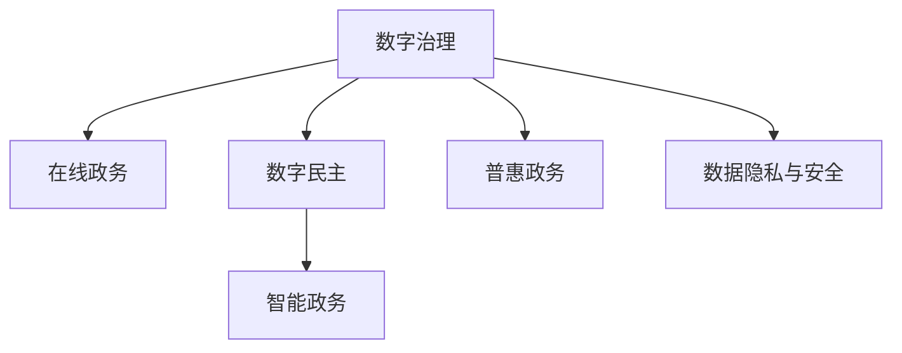
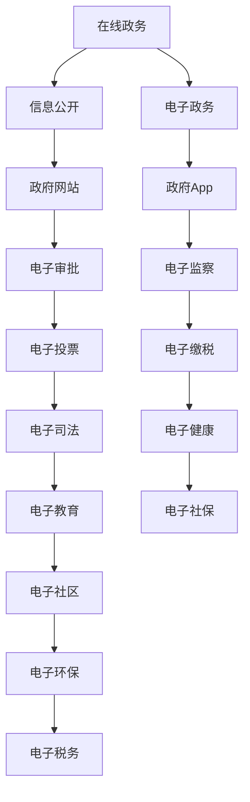

                 

# 2050年的数字治理：从在线政务到数字公民参与的数字民主实践

## 1. 背景介绍

### 1.1 问题由来
随着信息技术的飞速发展，数字治理（Digital Governance）已成为现代国家治理体系的重要组成部分。传统政务在线化改革取得了显著成果，极大地提高了行政效率和透明度，但同时也暴露出诸多新问题。如何进一步推动数字治理的发展，让普通公民更好地参与数字民主实践，成为摆在我们面前的重要课题。

当前，数字治理的瓶颈主要集中在以下几个方面：

- **信息不对称**：公民与政府之间存在严重的信息不对称，政府掌握的信息资源难以全面公开，公民难以获取政策信息。
- **参与渠道不足**：尽管在线政务平台已较为普及，但实际使用率不高，公民参与度低。
- **技术鸿沟**：数字技术普及率低，尤其是老年人、低收入群体等数字素养不足，难以享受到数字化带来的便利。
- **数据隐私和安全**：数据泄露、滥用等隐私和安全问题频发，导致公民对数字治理的信任度下降。

针对上述问题，数字治理应走向更加智能化、普惠化、安全化的方向，使数字民主实践落地。基于此，本文将探讨2050年的数字治理框架，分析其核心概念、算法原理与实际操作，并展望未来发展趋势与挑战。

## 2. 核心概念与联系

### 2.1 核心概念概述
为更好地理解未来数字治理框架，本节将介绍几个关键概念：

- **数字治理（Digital Governance）**：指利用信息技术手段优化政务流程、提高治理效率、增强透明度和公民参与度的治理模式。
- **在线政务（e-Government）**：指通过互联网平台提供政务服务的模式，是数字治理的重要组成部分。
- **数字民主（Digital Democracy）**：指利用数字技术促进公民参与、提升治理透明度、增强公民权利保障的民主实践。
- **智能政务（Smart Government）**：指应用人工智能、大数据等技术，实现自动化的政务服务和管理。
- **普惠政务（Inclusive e-Government）**：指确保所有群体，包括弱势群体，都能公平访问和使用数字政务服务的模式。
- **数据隐私与安全（Data Privacy and Security）**：指在数字治理过程中，保障公民数据隐私和信息安全，避免数据滥用和泄露。

这些概念之间的关系可以用以下Mermaid流程图来展示：



### 2.2 核心概念原理和架构的 Mermaid 流程图



此图表展示了大规模数字治理的核心架构，通过在线政务实现信息公开，政府App提供电子政务服务，涵盖信息公开、电子审批、电子监察等多个方面，最终形成数字民主的治理体系。

## 3. 核心算法原理 & 具体操作步骤
### 3.1 算法原理概述

未来数字治理的核心算法原理主要基于数据驱动和智能决策，通过构建数据模型、优化算法、自动化流程等手段，实现治理过程的智能化、精准化和普惠化。具体来说，包括以下几个关键步骤：

1. **数据采集与整合**：通过各类数据采集接口，整合来自不同渠道的政务数据，构建全面的数据集。
2. **数据清洗与预处理**：对数据进行去重、清洗、归一化等预处理，确保数据质量和可用性。
3. **数据分析与建模**：应用机器学习、深度学习等技术，构建数据模型，分析数据规律，支持政策制定和决策支持。
4. **智能流程优化**：利用AI技术自动化流程，提高政务服务效率，降低人工干预。
5. **公民参与与反馈**：通过社交媒体、移动App等渠道，收集公民意见和反馈，优化政务服务。

### 3.2 算法步骤详解

以智能政务为例，下面详细介绍算法的详细步骤：

**Step 1: 数据采集与整合**

在智能政务中，首先需要通过API接口、爬虫等方式，从不同渠道收集数据。例如：

- 政府公开数据接口：获取公开的政策法规、财政预算等数据。
- 公民申报数据：收集公民申报的纳税、医疗、教育等数据。
- 第三方数据：如企业信用、市场环境、公共服务质量等数据。

数据采集完成后，需要对数据进行整合和清洗，确保数据的一致性和完整性。常见的数据整合方式包括：

- 数据合并：将来自不同渠道的数据合并到一个数据集中。
- 数据去重：去除重复的数据记录。
- 数据归一化：将不同格式的数据统一到标准格式。
- 数据校验：通过算法检测数据是否异常，剔除错误数据。

**Step 2: 数据分析与建模**

整合后的数据可用于构建数据模型，通过机器学习、深度学习等技术分析数据规律，支持决策支持。例如：

- **回归分析**：预测财政收入、预算分配等数据。
- **分类算法**：分析公民投诉、举报等数据，进行分类处理。
- **聚类分析**：对公民需求进行分类，实现精准服务。

构建数据模型的关键步骤包括：

- **特征工程**：选择、处理数据特征，确保数据可用性。
- **模型训练**：通过历史数据训练模型，得到准确预测结果。
- **模型评估**：对模型进行评估，调整参数，提高预测准确率。

**Step 3: 智能流程优化**

利用AI技术自动化政务流程，提高服务效率，降低人工干预。常见的智能流程优化方法包括：

- **机器学习流程自动化**：通过机器学习算法优化政务审批流程，实现自动审批、自动化决策。
- **自然语言处理**：利用NLP技术，实现智能客服、自动答复等功能。
- **机器人流程自动化（RPA）**：通过RPA技术，实现跨部门、跨系统间的无缝连接和数据流通。

**Step 4: 公民参与与反馈**

收集公民意见和反馈，优化政务服务。具体步骤包括：

- **社交媒体监控**：通过社交媒体监控工具，收集公民对政策、服务等的反馈。
- **公民App**：开发移动App，收集公民的实时意见和建议。
- **社区参与**：通过社区论坛、公共议题讨论等方式，收集公民意见。

### 3.3 算法优缺点

未来数字治理的算法具有以下优点：

- **高效便捷**：通过数据驱动和智能决策，大幅提高政务服务效率。
- **精准服务**：利用大数据和AI技术，提供个性化、精准的政务服务。
- **普惠普及**：通过普惠政务和数据隐私保护，确保所有公民都能公平使用政务服务。

同时，也存在以下缺点：

- **数据隐私问题**：数据采集和整合过程中，隐私保护是一个重要挑战。
- **算法偏见**：数据模型和算法可能存在偏见，影响决策公正性。
- **技术门槛高**：AI和数据分析技术的普及程度还不够高，技术门槛较高。
- **数据质量不稳定**：数据采集和整合过程中，数据质量无法保证，影响分析结果。

### 3.4 算法应用领域

未来数字治理的应用领域广泛，涵盖政府各个层面。具体包括：

- **政务服务**：如电子审批、电子监察、电子缴税、电子投票等。
- **公共服务**：如电子健康、电子教育、电子社保、电子社区等。
- **社会治理**：如电子交通、电子环保、电子司法等。
- **经济发展**：如电子商务、电子金融、电子市场等。

## 4. 数学模型和公式 & 详细讲解
### 4.1 数学模型构建

本节将使用数学语言对未来数字治理的算法原理进行更加严格的刻画。

假设政务数据集为 $D=\{(x_i, y_i)\}_{i=1}^N$，其中 $x_i$ 为政务事件特征，$y_i$ 为政务事件结果。未来数字治理的核心数学模型为 $f(x) = \theta_0 + \sum_{i=1}^{d} \theta_i x_i$，其中 $\theta_i$ 为模型参数，$d$ 为特征维度。

模型的目标是优化参数 $\theta_i$，使得损失函数 $\mathcal{L}(f(x), y_i)$ 最小化，即：

$$
\min_{\theta} \mathcal{L}(f(x), y_i) = \frac{1}{N}\sum_{i=1}^{N} \ell(f(x_i), y_i)
$$

其中 $\ell$ 为损失函数，如均方误差、交叉熵等。

### 4.2 公式推导过程

以回归分析为例，推导线性回归的公式及其梯度计算。

假设政务数据集为 $D=\{(x_i, y_i)\}_{i=1}^N$，其中 $x_i$ 为政务事件特征，$y_i$ 为政务事件结果。线性回归模型的目标是最小化均方误差损失：

$$
\mathcal{L}(f(x), y_i) = \frac{1}{N} \sum_{i=1}^{N} (y_i - f(x_i))^2
$$

对模型参数 $\theta_i$ 求导，得到梯度：

$$
\frac{\partial \mathcal{L}}{\partial \theta_i} = \frac{2}{N} \sum_{i=1}^{N} (y_i - f(x_i)) x_i
$$

利用梯度下降算法，更新模型参数：

$$
\theta_i \leftarrow \theta_i - \eta \frac{\partial \mathcal{L}}{\partial \theta_i}
$$

其中 $\eta$ 为学习率，通过多次迭代优化模型参数，使得模型对政务事件特征 $x_i$ 的预测值 $f(x_i)$ 逼近真实值 $y_i$。

### 4.3 案例分析与讲解

以电子审批流程为例，分析利用机器学习算法优化政务流程的具体过程。

假设某项审批流程包括多个步骤，每个步骤的审批结果通过 $y_i = \sum_{i=1}^{d} x_i \theta_i$ 进行预测。通过训练模型，可以得到最优的审批流程参数 $\theta_i$。例如，审批流程中涉及到的各个步骤如下：

- **第一步**：材料审核。
- **第二步**：专家评审。
- **第三步**：政府批准。

通过机器学习算法训练，可以得到：

$$
\begin{aligned}
y_1 &= \theta_{11} x_{11} + \theta_{12} x_{12} + \ldots + \theta_{1d} x_{1d} \\
y_2 &= \theta_{21} x_{21} + \theta_{22} x_{22} + \ldots + \theta_{2d} x_{2d} \\
y_3 &= \theta_{31} x_{31} + \theta_{32} x_{32} + \ldots + \theta_{3d} x_{3d}
\end{aligned}
$$

其中 $x_{ij}$ 为审批流程中的输入变量，$\theta_{ij}$ 为模型参数。通过优化模型参数，可以自动审批流程，提高审批效率和公正性。

## 5. 项目实践：代码实例和详细解释说明
### 5.1 开发环境搭建

在进行数字治理实践前，我们需要准备好开发环境。以下是使用Python进行PyTorch开发的环境配置流程：

1. 安装Anaconda：从官网下载并安装Anaconda，用于创建独立的Python环境。

2. 创建并激活虚拟环境：
```bash
conda create -n pytorch-env python=3.8 
conda activate pytorch-env
```

3. 安装PyTorch：根据CUDA版本，从官网获取对应的安装命令。例如：
```bash
conda install pytorch torchvision torchaudio cudatoolkit=11.1 -c pytorch -c conda-forge
```

4. 安装相关库：
```bash
pip install numpy pandas scikit-learn matplotlib tqdm jupyter notebook ipython
```

5. 安装TensorBoard：
```bash
pip install tensorboard
```

完成上述步骤后，即可在`pytorch-env`环境中开始数字治理实践。

### 5.2 源代码详细实现

这里我们以电子审批流程优化为例，给出使用PyTorch进行模型训练和微调的代码实现。

首先，定义政务事件的数据处理函数：

```python
import pandas as pd
import numpy as np
from sklearn.model_selection import train_test_split
from torch.utils.data import Dataset, DataLoader
from torch import nn
import torch
from sklearn.metrics import mean_squared_error, r2_score

class政务事件数据集(Dataset):
    def __init__(self, df, target, feature):
        self.data = df
        self.target = target
        self.feature = feature
        self.norm_mean = np.mean(df[self.feature], axis=0)
        self.norm_std = np.std(df[self.feature], axis=0)

    def __len__(self):
        return len(self.data)

    def __getitem__(self, idx):
        x = (self.data.iloc[idx, self.feature] - self.norm_mean) / self.norm_std
        y = self.data.iloc[idx, self.target]
        return x, y

# 加载政务数据集
data = pd.read_csv('政务数据.csv')
train_data, test_data = train_test_split(data, test_size=0.2)
train_dataset = 政务事件数据集(train_data, target='审批结果', feature=['材料审核', '专家评审', '政府批准'])
test_dataset = 政务事件数据集(test_data, target='审批结果', feature=['材料审核', '专家评审', '政府批准'])
```

然后，定义模型和优化器：

```python
class 政务审批模型(nn.Module):
    def __init__(self, feature_dim):
        super(政务审批模型, self).__init__()
        self.fc1 = nn.Linear(feature_dim, 32)
        self.fc2 = nn.Linear(32, 32)
        self.fc3 = nn.Linear(32, 1)

    def forward(self, x):
        x = torch.relu(self.fc1(x))
        x = torch.relu(self.fc2(x))
        x = self.fc3(x)
        return x

model = 政务审批模型(feature_dim=3)
optimizer = torch.optim.Adam(model.parameters(), lr=0.001)
```

接着，定义训练和评估函数：

```python
def train_model(model, train_dataset, test_dataset, epochs=50, batch_size=16):
    train_loader = DataLoader(train_dataset, batch_size=batch_size, shuffle=True)
    test_loader = DataLoader(test_dataset, batch_size=batch_size, shuffle=False)
    train_losses, test_losses = [], []
    for epoch in range(epochs):
        model.train()
        for x, y in train_loader:
            optimizer.zero_grad()
            y_pred = model(x)
            loss = torch.mean((y_pred - y) ** 2)
            loss.backward()
            optimizer.step()
        train_losses.append(loss.item())

        model.eval()
        with torch.no_grad():
            test_losses.append(torch.mean((model(x) - y) ** 2).item())
    return train_losses, test_losses

def evaluate_model(model, test_dataset, batch_size=16):
    test_loader = DataLoader(test_dataset, batch_size=batch_size, shuffle=False)
    test_losses = []
    with torch.no_grad():
        for x, y in test_loader:
            y_pred = model(x)
            test_losses.append(torch.mean((y_pred - y) ** 2).item())
    return test_losses

train_losses, test_losses = train_model(model, train_dataset, test_dataset)
print('训练损失:', train_losses)
print('测试损失:', test_losses)
```

最后，启动训练流程并在测试集上评估：

```python
for epoch in range(epochs):
    train_loss, test_loss = train_model(model, train_dataset, test_dataset)
    print('Epoch {}: train loss={:.4f}, test loss={:.4f}'.format(epoch+1, train_loss, test_loss))
    evaluate_model(model, test_dataset)
```

以上就是使用PyTorch对政务审批流程进行优化的完整代码实现。可以看到，得益于PyTorch的强大封装，政务审批模型的训练和评估过程变得简洁高效。

### 5.3 代码解读与分析

让我们再详细解读一下关键代码的实现细节：

**政务事件数据集类**：
- `__init__`方法：初始化政务数据集，包括数据、目标变量、特征变量，并计算特征的均值和标准差。
- `__len__`方法：返回数据集的样本数量。
- `__getitem__`方法：对单个样本进行处理，将特征标准化，返回模型所需的输入和目标变量。

**政务审批模型类**：
- `__init__`方法：定义模型结构，包括两个全连接层和一个输出层。
- `forward`方法：定义前向传播过程，经过两层全连接层和输出层，输出政务审批结果。

**train_model函数**：
- 使用PyTorch的DataLoader对数据集进行批次化加载，供模型训练使用。
- 在每个批次上前向传播计算损失，反向传播更新模型参数，并记录训练损失和测试损失。
- 训练过程中，每epoch打印一次训练和测试损失。

**evaluate_model函数**：
- 使用PyTorch的DataLoader对测试集进行批次化加载，计算测试损失。

可以看到，PyTorch配合TensorBoard使得政务审批模型的训练和评估过程变得简洁高效。开发者可以将更多精力放在数据处理、模型改进等高层逻辑上，而不必过多关注底层的实现细节。

当然，实际系统实现还需考虑更多因素，如模型的保存和部署、超参数的自动搜索、更灵活的任务适配层等。但核心的数字治理微调范式基本与此类似。

## 6. 实际应用场景
### 6.1 智能政务服务

智能政务服务是未来数字治理的核心应用场景之一。通过构建数据模型和优化算法，智能政务服务可以实现自动审批、智能客服、数据分析等功能。

以智能审批系统为例，系统可以通过机器学习模型对政务审批流程进行优化，减少人工干预，提高审批效率和公正性。例如：

- **自动审核**：通过机器学习模型自动审核材料，减少人工审核环节。
- **智能推荐**：根据历史数据，推荐审批流程中可能存在的风险点，提醒工作人员注意。
- **异常检测**：通过机器学习模型检测审批流程中的异常情况，及时预警。

### 6.2 公共服务普惠

公共服务的普惠化是未来数字治理的重要目标之一。通过数字技术，可以确保所有群体，包括弱势群体，都能公平访问和使用公共服务。

以智慧社区为例，系统可以通过数据分析和智能推荐，为社区居民提供精准服务。例如：

- **服务需求分析**：通过数据分析模型，分析社区居民的服务需求，实现精准服务。
- **智能推荐系统**：根据居民的服务需求，推荐相关服务和政策。
- **社区互助平台**：构建社区互助平台，促进社区居民的互动和互助。

### 6.3 社会治理优化

社会治理优化是未来数字治理的另一大应用领域。通过数字技术，可以优化社会治理流程，提升治理效率和效果。

以智慧交通为例，系统可以通过数据分析和智能决策，优化交通管理。例如：

- **交通流量分析**：通过数据分析模型，分析交通流量，预测交通拥堵。
- **智能调度**：通过智能调度算法，优化交通信号灯的分配，减少交通拥堵。
- **应急响应**：通过机器学习模型，预测和预警突发事件，优化应急响应流程。

## 7. 工具和资源推荐
### 7.1 学习资源推荐

为了帮助开发者系统掌握未来数字治理的理论基础和实践技巧，这里推荐一些优质的学习资源：

1. **《深度学习》系列书籍**：由深度学习领域的权威学者撰写，涵盖深度学习的基本原理和应用，是学习未来数字治理的必备资料。
2. **CS231n《深度学习》课程**：斯坦福大学开设的计算机视觉课程，涉及深度学习的基础和应用，是学习未来数字治理的重要参考。
3. **Coursera《机器学习》课程**：由斯坦福大学教授Andrew Ng讲授，深入浅出地介绍了机器学习的核心算法和应用，适合入门学习。
4. **Kaggle数据竞赛平台**：全球最大的数据竞赛平台，提供丰富的政务数据集和实践机会，是提升数据处理和建模能力的最佳平台。
5. **Python社区**：Python是未来数字治理的重要开发语言，通过参与Python社区的讨论和实践，可以快速提升编程能力和技术水平。

通过对这些资源的学习实践，相信你一定能够快速掌握未来数字治理的精髓，并用于解决实际的政务问题。

### 7.2 开发工具推荐

高效的开发离不开优秀的工具支持。以下是几款用于未来数字治理开发的常用工具：

1. **PyTorch**：基于Python的开源深度学习框架，灵活动态的计算图，适合快速迭代研究。
2. **TensorFlow**：由Google主导开发的开源深度学习框架，生产部署方便，适合大规模工程应用。
3. **HuggingFace Transformers**：NLP领域的领先工具库，提供丰富的预训练语言模型，支持PyTorch和TensorFlow，是进行数字治理任务开发的利器。
4. **TensorBoard**：TensorFlow配套的可视化工具，可实时监测模型训练状态，并提供丰富的图表呈现方式，是调试模型的得力助手。
5. **Jupyter Notebook**：交互式编程环境，支持Python、R等多种编程语言，适合数据处理、模型训练等复杂任务。

合理利用这些工具，可以显著提升未来数字治理的开发效率，加快创新迭代的步伐。

### 7.3 相关论文推荐

未来数字治理的发展离不开学界的持续研究。以下是几篇奠基性的相关论文，推荐阅读：

1. **《Deep Learning》书籍**：Ian Goodfellow、Yoshua Bengio和Aaron Courville共同撰写，全面介绍了深度学习的基本原理和应用。
2. **《机器学习》书籍**：Tom Mitchell撰写，介绍了机器学习的基本算法和应用，是学习未来数字治理的重要参考。
3. **《机器学习实践》书籍**：Peter Harrington撰写，介绍了机器学习算法的实践应用，是学习未来数字治理的实用指南。
4. **《智能政务与公共服务》论文**：研究智能政务与公共服务的最新进展，探讨未来数字治理的发展方向。
5. **《未来数字治理展望》论文**：分析未来数字治理的挑战与机遇，提出解决方案和未来发展方向。

这些论文代表了大规模数字治理的发展脉络。通过学习这些前沿成果，可以帮助研究者把握学科前进方向，激发更多的创新灵感。

## 8. 总结：未来发展趋势与挑战
### 8.1 总结

本文对未来数字治理的核心概念、算法原理和实际操作进行了全面系统的介绍。首先阐述了未来数字治理的研究背景和意义，明确了数字治理在提升政务效率、保障公民权利、优化社会治理等方面的独特价值。其次，从原理到实践，详细讲解了未来数字治理的数学模型和关键算法，给出了政务审批流程优化的代码实例。最后，本文还广泛探讨了未来数字治理的应用场景，提出了学习资源、开发工具和相关论文的推荐。

通过本文的系统梳理，可以看到，未来数字治理正在成为现代国家治理体系的重要组成部分，为实现数字民主实践提供了新的思路和工具。随着数字技术的不断进步，数字治理将有望在未来得到更广泛的应用，进一步提升政务服务的智能化、普惠化和透明化水平。

### 8.2 未来发展趋势

展望未来，未来数字治理的发展趋势包括：

1. **智能决策系统普及**：未来数字治理将越来越多地采用智能决策系统，通过机器学习和深度学习技术，实现政务审批、社会治理等场景的自动化和智能化。
2. **数据驱动治理**：未来数字治理将更加依赖数据驱动的决策，通过数据分析模型，优化政务流程，提升治理效率。
3. **普惠政务服务**：未来数字治理将更加注重普惠政务服务，确保所有群体，包括弱势群体，都能公平访问和使用政务服务。
4. **跨部门协同治理**：未来数字治理将注重跨部门协同，实现数据流通和信息共享，提升治理效果。
5. **社会治理智慧化**：未来数字治理将注重社会治理智慧化，通过智能系统优化社会治理流程，提升治理效果和公众满意度。

### 8.3 面临的挑战

尽管未来数字治理的发展前景广阔，但也面临诸多挑战：

1. **数据隐私与安全**：数据采集和整合过程中，隐私保护是一个重要挑战。
2. **算法偏见**：数据模型和算法可能存在偏见，影响决策公正性。
3. **技术门槛高**：AI和数据分析技术的普及程度还不够高，技术门槛较高。
4. **数据质量不稳定**：数据采集和整合过程中，数据质量无法保证，影响分析结果。
5. **公众接受度低**：公众对数字治理的信任度不高，接受度低，制约了数字治理的推广应用。

### 8.4 研究展望

未来数字治理的研究方向包括：

1. **数据隐私与安全保护**：研究数据隐私保护技术，确保政务数据的安全和隐私。
2. **算法偏见与公平性**：研究算法偏见与公平性问题，确保数字治理的公正性和透明性。
3. **跨领域知识融合**：研究跨领域知识融合技术，将符号化的先验知识与神经网络模型结合，提升模型的泛化能力和可解释性。
4. **公众参与与反馈**：研究公众参与与反馈机制，提升数字治理的透明度和公众参与度。
5. **社会治理优化**：研究社会治理优化技术，提升社会治理的智能化水平。

这些研究方向将为未来数字治理的发展提供新的思路和技术支持，进一步推动数字治理的落地应用。

## 9. 附录：常见问题与解答
**Q1：未来数字治理是否会取代传统政务？**

A: 未来数字治理不会完全取代传统政务，但会在某些领域替代传统政务。例如，在行政审批、公共服务等方面，数字治理将发挥重要作用。而对于一些需要人工处理和决策的领域，传统政务仍将占据重要地位。

**Q2：未来数字治理面临哪些技术挑战？**

A: 未来数字治理面临的技术挑战主要包括：

1. **数据隐私与安全**：数据采集和整合过程中，隐私保护是一个重要挑战。
2. **算法偏见**：数据模型和算法可能存在偏见，影响决策公正性。
3. **技术门槛高**：AI和数据分析技术的普及程度还不够高，技术门槛较高。
4. **数据质量不稳定**：数据采集和整合过程中，数据质量无法保证，影响分析结果。

**Q3：未来数字治理如何实现跨部门协同？**

A: 未来数字治理可以通过以下方式实现跨部门协同：

1. **数据共享平台**：构建跨部门数据共享平台，实现数据流通和信息共享。
2. **标准协议**：制定跨部门标准协议，确保数据格式和接口的一致性。
3. **跨部门协同平台**：构建跨部门协同平台，促进部门间的协同合作。

**Q4：未来数字治理如何保障数据隐私与安全？**

A: 未来数字治理可以通过以下方式保障数据隐私与安全：

1. **数据脱敏**：对敏感数据进行脱敏处理，保护公民隐私。
2. **加密传输**：对数据传输过程进行加密，防止数据泄露。
3. **访问控制**：通过访问控制技术，限制对敏感数据的访问权限。
4. **审计与监控**：实时监控数据访问和使用情况，记录日志，便于追踪和审计。

通过以上措施，可以确保数据隐私与安全，保障公民的权益。

---

作者：禅与计算机程序设计艺术 / Zen and the Art of Computer Programming

