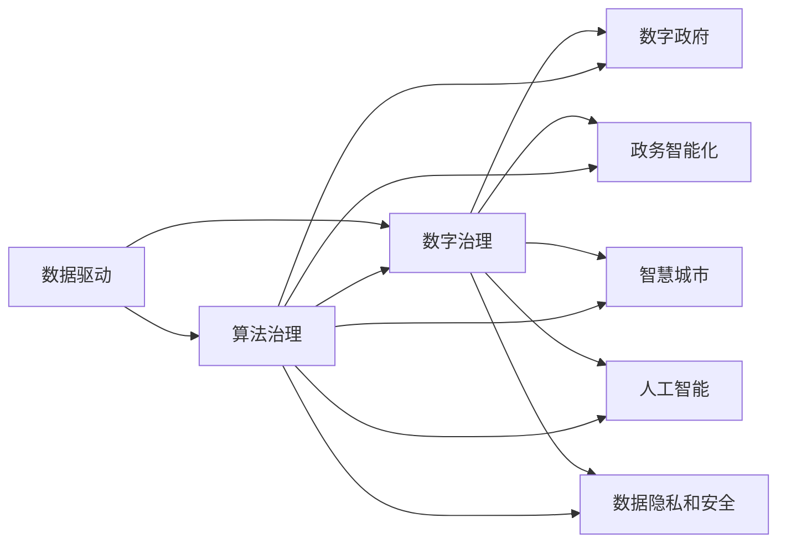

                 

# 2050年的数字治理：从数字政府到算法治理的政务智能化

> 关键词：数字治理, 数字政府, 算法治理, 政务智能化, 数据驱动, 人工智能, 社会治理, 智慧城市

## 1. 背景介绍

### 1.1 问题由来

随着信息技术的发展和社会的进步，数字治理已成为现代政府管理和公共服务的重要手段。从早期的数字政府建设到现在的智慧城市规划，数字治理不断推动着政府部门的数据化、智能化转型。在数字化、信息化、智能化的浪潮下，政府的工作方式、服务方式都发生了深刻变化。

然而，尽管数字治理在效率、透明度、服务质量等方面取得了显著成效，但同时我们也面临着新的挑战和问题。例如，数据隐私和安全问题、算法偏见问题、数字鸿沟问题、系统可信性问题等。这些问题不仅影响到数字治理的效果，也对社会的公平、公正、透明产生了重要影响。

### 1.2 问题核心关键点

数字治理的核心在于通过数据、技术、算法等手段，实现政府部门的高效管理、精准决策和优质服务。然而，要想在2050年实现更为广泛、深入、智能化的政务智能化，就必须进一步提升数据驱动、人工智能、算法治理等方面的能力。

未来的数字治理将不仅依赖于数字技术的应用，更离不开算法、数据、法律、伦理等综合因素的协同作用。因此，从数字政府到算法治理，将是未来政务智能化的重要方向。

## 2. 核心概念与联系

### 2.1 核心概念概述

- **数字治理**：指通过数字技术手段，实现政府管理的现代化、智能化、高效化。数字治理包括数字政府、智慧城市、电子政务等多个方面，旨在提升政府服务的效率和质量。

- **数字政府**：指利用信息技术手段，实现政府工作的数字化、智能化、透明化。数字政府的核心在于政府信息的公开、数据资源的整合、服务的在线化。

- **算法治理**：指通过算法手段，实现政府决策和管理的科学化、精确化、可解释化。算法治理强调算法的透明性、公平性、可解释性，以及算法的伦理考量。

- **政务智能化**：指通过数据驱动、人工智能、算法治理等手段，实现政务管理的智能化、个性化、高效化。政务智能化不仅关注技术的应用，更关注技术对社会的公平、公正、透明的影响。

- **数据驱动**：指以数据为基础，通过数据挖掘、分析、应用，实现政府决策和管理的精准化、科学化、智能化。数据驱动强调数据的质量、隐私、安全，以及数据资源的有效利用。

- **人工智能**：指通过机器学习、深度学习等技术，实现智能化的计算和决策。人工智能的核心在于模型的训练、优化、应用，以及算法的公平性、透明性、可解释性。

- **智慧城市**：指通过信息技术手段，实现城市管理的智能化、高效化、人本化。智慧城市关注城市交通、环保、安全、服务等多个方面，实现城市资源的优化配置和高效利用。

- **数据隐私和安全**：指在数字治理过程中，保障数据隐私、数据安全的重要性。数据隐私和安全问题不仅影响到政府管理的透明性和可信性，也对个人隐私权利产生了重要影响。

### 2.2 核心概念原理和架构的 Mermaid 流程图



## 3. 核心算法原理 & 具体操作步骤

### 3.1 算法原理概述

算法治理在数字治理中扮演着至关重要的角色。通过算法手段，可以实现政府决策和管理的科学化、精确化、可解释化。算法的公平性、透明性、可解释性，以及对数据隐私和安全的保护，是实现算法治理的关键。

算法治理的核心在于对算法的设计、训练、应用、评估的全过程进行监控和管理，确保算法的合理性、公平性、透明性，以及对数据隐私和安全的保护。

### 3.2 算法步骤详解

1. **数据收集与预处理**：
    - 收集政府部门、公共服务相关的数据，包括人口、财务、公共服务记录等。
    - 对数据进行清洗、标注、整合，形成高质量的数据集。

2. **算法设计**：
    - 根据任务需求，选择合适的算法模型，如分类、回归、聚类、生成等。
    - 设计算法的结构、参数、超参数，并进行模型选择和评估。

3. **算法训练与优化**：
    - 使用训练数据对模型进行训练，优化模型的参数和超参数。
    - 使用验证数据对模型进行评估和调整，防止过拟合。

4. **算法应用与部署**：
    - 将训练好的模型部署到实际应用中，实现数据的智能分析和决策。
    - 监控算法的运行状态，确保算法的稳定性和准确性。

5. **算法评估与反馈**：
    - 使用测试数据对模型进行评估，评估模型的性能和泛化能力。
    - 收集用户反馈，不断改进算法模型。

### 3.3 算法优缺点

- **优点**：
  - 科学化决策：通过算法手段，实现政府决策的科学化、精准化、高效化。
  - 透明性提升：通过算法的透明性，实现政府决策过程的公开、透明。
  - 公平性保障：通过算法的公平性、可解释性，保障政府决策的公正、公平。
  - 可信性增强：通过算法的稳定性和准确性，增强政府决策的可信性。

- **缺点**：
  - 算法偏见：算法模型可能存在偏见，需要对其进行公平性审查。
  - 算法透明性不足：复杂算法难以解释，可能影响政府的决策透明度。
  - 数据隐私问题：算法模型需要大量数据，可能涉及到数据隐私和安全问题。

### 3.4 算法应用领域

算法治理在数字治理中的应用广泛，涉及多个领域：

- **政府决策**：通过算法手段，实现政府决策的科学化、精准化。
- **公共服务**：通过算法手段，实现公共服务的智能化、高效化。
- **社会治理**：通过算法手段，实现社会治理的精准化、透明化。
- **智慧城市**：通过算法手段，实现智慧城市的智能化、高效化。

## 4. 数学模型和公式 & 详细讲解 & 举例说明

### 4.1 数学模型构建

算法治理的核心在于对算法的设计、训练、应用的全过程进行监控和管理。数学模型是算法治理的基础，通过数学模型可以实现算法的优化、评估和应用。

常见的数学模型包括：
- 分类模型：如决策树、支持向量机、神经网络等。
- 回归模型：如线性回归、逻辑回归、神经网络等。
- 聚类模型：如K-means、层次聚类等。
- 生成模型：如隐马尔可夫模型、生成对抗网络等。

### 4.2 公式推导过程

以决策树分类模型为例，推导其数学模型和算法流程：

1. **决策树构建**：
   - 将数据集分为训练集和测试集，使用训练集构建决策树。
   - 选择最佳的划分属性，计算信息增益或基尼指数。
   - 递归构建决策树，直到满足停止条件。

2. **决策树预测**：
   - 使用决策树对测试集进行预测，计算预测结果与真实标签的误差。
   - 使用交叉验证等方法评估模型的性能和泛化能力。

### 4.3 案例分析与讲解

假设某城市需要预测居民的收入水平，可以使用决策树模型进行预测。具体步骤如下：

1. **数据收集与预处理**：
   - 收集居民的收入、年龄、性别、职业等数据，并进行清洗和标注。
   - 将数据集分为训练集和测试集，使用训练集构建决策树。

2. **决策树构建**：
   - 选择最佳的划分属性，计算信息增益或基尼指数。
   - 递归构建决策树，直到满足停止条件。

3. **决策树预测**：
   - 使用决策树对测试集进行预测，计算预测结果与真实标签的误差。
   - 使用交叉验证等方法评估模型的性能和泛化能力。

4. **算法应用与部署**：
   - 将训练好的决策树模型部署到实际应用中，实现收入预测。
   - 监控模型的运行状态，确保模型的稳定性和准确性。

5. **算法评估与反馈**：
   - 使用测试数据对模型进行评估，评估模型的性能和泛化能力。
   - 收集用户反馈，不断改进算法模型。

## 5. 项目实践：代码实例和详细解释说明

### 5.1 开发环境搭建

在进行算法治理的实践前，我们需要准备好开发环境。以下是使用Python进行Scikit-Learn开发的开发环境配置流程：

1. 安装Anaconda：从官网下载并安装Anaconda，用于创建独立的Python环境。

2. 创建并激活虚拟环境：
```bash
conda create -n sklearn-env python=3.8 
conda activate sklearn-env
```

3. 安装Scikit-Learn：
```bash
conda install scikit-learn
```

4. 安装各类工具包：
```bash
pip install numpy pandas scikit-learn matplotlib tqdm jupyter notebook ipython
```

完成上述步骤后，即可在`sklearn-env`环境中开始算法治理的实践。

### 5.2 源代码详细实现

下面我们以决策树分类模型为例，给出使用Scikit-Learn进行算法治理的Python代码实现。

```python
from sklearn.datasets import load_iris
from sklearn.tree import DecisionTreeClassifier
from sklearn.model_selection import train_test_split
from sklearn.metrics import accuracy_score
from sklearn.model_selection import cross_val_score

# 加载数据集
iris = load_iris()
X = iris.data
y = iris.target

# 划分训练集和测试集
X_train, X_test, y_train, y_test = train_test_split(X, y, test_size=0.3, random_state=42)

# 构建决策树模型
clf = DecisionTreeClassifier()
clf.fit(X_train, y_train)

# 预测测试集
y_pred = clf.predict(X_test)

# 评估模型
print("模型准确率：", accuracy_score(y_test, y_pred))
print("交叉验证评分：", cross_val_score(clf, X, y, cv=5).mean())
```

以上就是使用Scikit-Learn构建决策树分类模型的完整代码实现。可以看到，Scikit-Learn提供了丰富的机器学习算法和工具，使得算法治理的开发变得相对简单高效。

### 5.3 代码解读与分析

让我们再详细解读一下关键代码的实现细节：

**load_iris函数**：
- 加载Iris数据集，包含三种类别的鸢尾花数据。

**train_test_split函数**：
- 将数据集分为训练集和测试集，保持70%的数据用于训练，30%的数据用于测试。

**DecisionTreeClassifier类**：
- 定义决策树分类模型，并进行训练。

**predict函数**：
- 使用训练好的模型对测试集进行预测。

**accuracy_score函数**：
- 计算模型预测结果与真实标签的准确率。

**cross_val_score函数**：
- 使用交叉验证方法评估模型的性能和泛化能力，返回5折交叉验证的平均评分。

**训练流程**：
- 加载数据集
- 划分训练集和测试集
- 构建决策树模型
- 预测测试集
- 评估模型

可以看到，Scikit-Learn提供了丰富的机器学习算法和工具，使得算法治理的开发变得相对简单高效。开发者可以将更多精力放在数据处理、模型改进等高层逻辑上，而不必过多关注底层的实现细节。

当然，工业级的系统实现还需考虑更多因素，如模型的保存和部署、超参数的自动搜索、更灵活的任务适配层等。但核心的算法治理流程基本与此类似。

## 6. 实际应用场景

### 6.1 社会治理中的算法治理

在社会治理中，算法治理可以应用于多个领域，如公共安全、环境保护、灾害预警等。通过算法手段，可以实现社会治理的精准化、透明化、高效化。

例如，在公共安全领域，可以通过算法手段，实现对社会治安、犯罪行为的预测和分析。具体而言，可以收集社会治安、犯罪行为的各类数据，构建犯罪预测模型，实现对未来的犯罪趋势预测。此外，还可以构建应急响应模型，对突发事件进行实时监测和预警。

在环境保护领域，可以通过算法手段，实现对环境污染、自然灾害的预测和分析。具体而言，可以收集环境污染、自然灾害的各类数据，构建环境预测模型，实现对未来的环境变化趋势预测。此外，还可以构建灾害预警模型，对突发自然灾害进行实时监测和预警。

### 6.2 智慧城市中的算法治理

在智慧城市中，算法治理可以应用于多个领域，如交通管理、能源管理、公共服务等。通过算法手段，可以实现智慧城市的智能化、高效化、人本化。

例如，在交通管理领域，可以通过算法手段，实现对交通拥堵、事故预测的预测和分析。具体而言，可以收集交通流量、天气、事故等数据，构建交通预测模型，实现对未来的交通流量、事故风险的预测。此外，还可以构建交通管理模型，对突发交通事件进行实时监测和处理。

在能源管理领域，可以通过算法手段，实现对能源消耗、供需预测的预测和分析。具体而言，可以收集能源消耗、供需数据，构建能源预测模型，实现对未来的能源消耗、供需变化的预测。此外，还可以构建能源管理模型，对能源消耗进行实时监测和优化。

在公共服务领域，可以通过算法手段，实现对公共服务的精准化、高效化。具体而言，可以收集公共服务的各类数据，构建公共服务预测模型，实现对未来的公共服务需求、资源配置的预测。此外，还可以构建公共服务管理模型，对公共服务进行实时监测和优化。

### 6.3 未来应用展望

随着算法治理技术的发展，未来的政务智能化将更加全面、深入、智能。我们可以预见，以下趋势将成为未来政务智能化的重要方向：

1. **多模态数据融合**：未来政务智能化将不仅依赖于文本数据，还将融合视频、图像、声音等多模态数据，实现更全面的数据分析和决策。
2. **实时数据分析**：未来政务智能化将实现实时数据采集和分析，实现对突发事件的快速响应和处理。
3. **深度学习应用**：未来政务智能化将广泛应用深度学习技术，实现更精准、智能的决策和预测。
4. **透明性和公平性**：未来政务智能化将更加注重算法的透明性和公平性，保障政府决策的公开、公正、公平。
5. **数据隐私和安全**：未来政务智能化将更加注重数据隐私和安全性，保障政府数据的安全和合规。

## 7. 工具和资源推荐

### 7.1 学习资源推荐

为了帮助开发者系统掌握算法治理的理论基础和实践技巧，这里推荐一些优质的学习资源：

1. 《算法治理基础》系列博文：由算法治理技术专家撰写，深入浅出地介绍了算法治理的理论基础和实践技巧。

2. 《深度学习与算法治理》课程：斯坦福大学开设的机器学习课程，涵盖算法治理的基本概念和经典模型。

3. 《算法治理实战》书籍：算法治理领域的权威著作，全面介绍了算法治理的最新研究进展和实践方法。

4. 《算法治理伦理》论文：深入探讨算法治理中的伦理问题，如算法偏见、数据隐私、公平性等，为算法治理提供伦理保障。

5. Kaggle数据科学竞赛：通过参与数据科学竞赛，可以实际应用算法治理技术，积累实战经验。

通过对这些资源的学习实践，相信你一定能够快速掌握算法治理的精髓，并用于解决实际的政务智能化问题。

### 7.2 开发工具推荐

高效的开发离不开优秀的工具支持。以下是几款用于算法治理开发的常用工具：

1. Python：基于Python的开源编程语言，生态丰富，适合算法治理的开发。

2. Scikit-Learn：基于Python的机器学习库，提供了丰富的算法模型和工具，适合算法治理的开发。

3. TensorFlow：由Google主导开发的深度学习框架，适合大规模模型训练和部署。

4. Weights & Biases：模型训练的实验跟踪工具，可以记录和可视化模型训练过程中的各项指标，方便对比和调优。

5. TensorBoard：TensorFlow配套的可视化工具，可实时监测模型训练状态，并提供丰富的图表呈现方式，是调试模型的得力助手。

6. Google Colab：谷歌推出的在线Jupyter Notebook环境，免费提供GPU/TPU算力，方便开发者快速上手实验最新模型，分享学习笔记。

合理利用这些工具，可以显著提升算法治理的开发效率，加快创新迭代的步伐。

### 7.3 相关论文推荐

算法治理的发展源于学界的持续研究。以下是几篇奠基性的相关论文，推荐阅读：

1. "Algorithmic Fairness through Preemptive Counterfactual Correction"：提出通过预制反事实修正算法，实现算法的公平性。

2. "The Fairness of Algorithmic Predictions and Decisions"：探讨算法治理中的公平性问题，提出公平性审查和改进的策略。

3. "Towards Explainable AI"：提出通过可解释性算法，实现算法的透明性和可解释性。

4. "Ensuring Privacy in Algorithmic Decision Making"：探讨算法治理中的隐私保护问题，提出隐私保护和数据安全策略。

5. "Algorithmic Governance: A Survey of Recent Advances"：综述算法治理的最新研究进展，为算法治理提供理论和方法指导。

这些论文代表了大语言模型微调技术的发展脉络。通过学习这些前沿成果，可以帮助研究者把握学科前进方向，激发更多的创新灵感。

## 8. 总结：未来发展趋势与挑战

### 8.1 总结

本文对算法治理的理论基础和实践技巧进行了全面系统的介绍。首先阐述了算法治理在数字治理中的重要作用，明确了算法治理在实现政务智能化中的核心地位。其次，从原理到实践，详细讲解了算法治理的数学模型、算法步骤和案例分析，给出了算法治理任务开发的完整代码实例。同时，本文还广泛探讨了算法治理在政务智能化中的多个应用场景，展示了算法治理的广泛应用前景。此外，本文精选了算法治理的各类学习资源，力求为读者提供全方位的技术指引。

通过本文的系统梳理，可以看到，算法治理在数字治理中的应用前景广阔，必将成为未来政务智能化的重要手段。然而，在算法治理的实施过程中，也面临着诸多挑战，如算法偏见、数据隐私、公平性等。未来的研究需要在这些方面寻求新的突破，以实现更全面、公正、透明的政务智能化。

### 8.2 未来发展趋势

展望未来，算法治理的发展将呈现以下几个趋势：

1. **多模态数据融合**：未来算法治理将广泛应用多模态数据，实现更全面、精准的数据分析。

2. **实时数据分析**：未来算法治理将实现实时数据采集和分析，实现对突发事件的快速响应和处理。

3. **深度学习应用**：未来算法治理将广泛应用深度学习技术，实现更精准、智能的决策和预测。

4. **透明性和公平性**：未来算法治理将更加注重算法的透明性和公平性，保障政府决策的公开、公正、公平。

5. **数据隐私和安全**：未来算法治理将更加注重数据隐私和安全性，保障政府数据的安全和合规。

### 8.3 面临的挑战

尽管算法治理在数字治理中的应用前景广阔，但在实施过程中，也面临着诸多挑战：

1. **算法偏见**：算法模型可能存在偏见，需要对其进行公平性审查。

2. **数据隐私**：算法治理需要大量数据，可能涉及到数据隐私和安全问题。

3. **透明性不足**：复杂算法难以解释，可能影响政府的决策透明度。

4. **数据质量**：数据质量问题可能影响算法的性能和泛化能力。

5. **可解释性不足**：复杂算法难以解释，可能影响算法的透明性和公平性。

### 8.4 研究展望

面对算法治理的挑战，未来的研究需要在以下几个方面寻求新的突破：

1. **公平性审查**：通过公平性审查技术，消除算法偏见，保障算法的公平性。

2. **数据隐私保护**：通过数据隐私保护技术，保障数据的安全和合规。

3. **算法透明性**：通过算法透明性技术，实现算法的可解释性和透明性。

4. **数据质量提升**：通过数据质量提升技术，提高数据的质量和可靠性。

5. **多模态数据融合**：通过多模态数据融合技术，实现更全面、精准的数据分析。

这些研究方向将推动算法治理技术的不断进步，为政务智能化提供更全面、透明、公正、安全的保障。通过不断的技术创新和应用实践，算法治理必将在数字治理中发挥更大的作用，推动社会的公平、公正、透明。

## 9. 附录：常见问题与解答

**Q1：算法治理是否适用于所有政务智能化场景？**

A: 算法治理在许多政务智能化场景中都有广泛的应用，特别是在数据驱动、智能决策等领域。然而，对于某些特定场景，如高风险领域（如医疗、司法等），可能需要更多的伦理、法律等综合手段进行辅助。因此，算法治理需要根据具体场景进行综合应用。

**Q2：如何缓解算法治理中的数据隐私问题？**

A: 缓解算法治理中的数据隐私问题，主要从以下几个方面入手：
1. 数据匿名化：对数据进行匿名化处理，保护个人隐私。
2. 数据脱敏：对数据进行脱敏处理，防止敏感信息泄露。
3. 数据加密：对数据进行加密处理，保障数据安全。
4. 差分隐私：通过差分隐私技术，保障数据隐私的同时，实现数据分析和决策。

这些措施可以在数据采集、存储、处理等各个环节进行，保障数据隐私和安全。

**Q3：如何提升算法治理的透明性和可解释性？**

A: 提升算法治理的透明性和可解释性，主要从以下几个方面入手：
1. 可解释模型：使用可解释性强的模型，如决策树、线性回归等，提高算法的透明性。
2. 模型解释工具：使用模型解释工具，如LIME、SHAP等，对模型进行解释和分析。
3. 模型文档：编写详细的模型文档，说明算法的原理、参数、超参数等，提高算法的透明性。
4. 用户反馈：收集用户反馈，不断改进算法模型，提高算法的透明性和可解释性。

这些措施可以在算法设计、模型训练、模型应用等各个环节进行，保障算法的透明性和可解释性。

**Q4：如何缓解算法治理中的算法偏见问题？**

A: 缓解算法治理中的算法偏见问题，主要从以下几个方面入手：
1. 公平性审查：通过公平性审查技术，对算法进行公平性评估和改进。
2. 数据平衡：确保训练数据集的平衡性，防止模型偏向某些群体。
3. 算法优化：通过优化算法模型，消除模型中的偏见。
4. 数据预处理：对数据进行预处理，消除数据中的偏见。
5. 公平性约束：在算法设计中引入公平性约束，保障算法的公平性。

这些措施可以在算法设计、数据处理、模型训练等各个环节进行，保障算法的公平性和透明性。

通过这些常见问题的解答，相信你能够更好地理解算法治理的理论基础和实践技巧，为政务智能化提供更加全面、透明、公正、安全的保障。

---

作者：禅与计算机程序设计艺术 / Zen and the Art of Computer Programming

