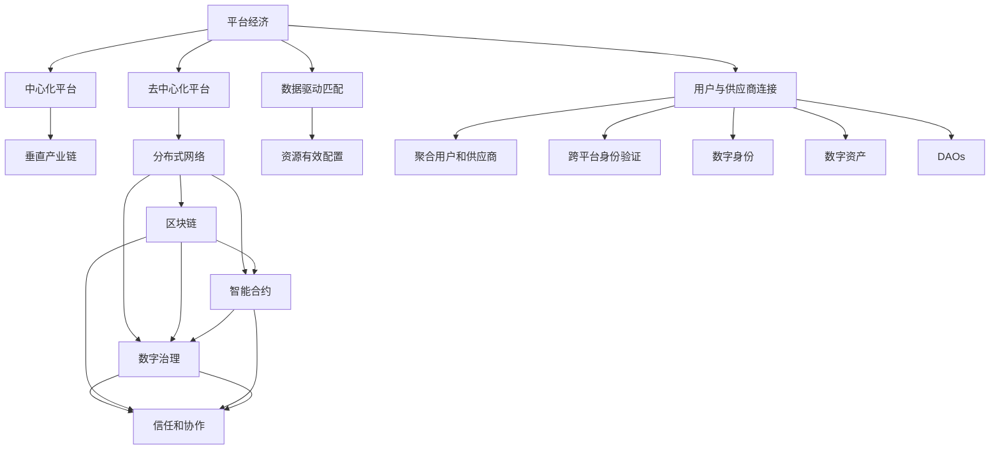

                 

# 2050年的数字经济：从平台经济到元宇宙经济的数字经济形态演进

## 1. 背景介绍

### 1.1 问题由来
随着数字技术不断革新和应用场景的不断拓展，数字经济正在经历着从平台经济向元宇宙经济的历史性演进。这一过程中，生产关系、市场规则、竞争格局乃至社会治理都将发生深刻变革。

从平台经济时代，到元宇宙时代，数字经济的本质是一种虚拟化的经济形态，它不仅改变了传统的生产方式和消费模式，也为经济全球化和经济发展注入了新的动力。平台经济时代，数据成为关键生产要素，信息不对称的减少使得交易成本降低、效率提升。而元宇宙经济时代，数字身份和虚拟资产将重新定义人与人的关系，数字经济正从流通领域向生产领域拓展，展现出更广泛、更深层次的变革。

### 1.2 问题核心关键点
本研究聚焦于数字经济从平台经济向元宇宙经济演进的核心驱动力、关键要素、演进路径以及可能带来的挑战与机遇。我们认为，数字经济的未来形态将不再局限于传统的虚拟市场，而是向更深层次的数字基础设施、数字治理体系以及数字社会建设方向发展。

## 2. 核心概念与联系

### 2.1 核心概念概述

- **平台经济（Platform Economy）**：以互联网平台为中介，连接供给与需求，通过数据驱动的匹配机制，实现资源的有效配置。平台经济打破了传统产业链的垂直结构，通过聚合用户和供应商，形成市场力量。

- **元宇宙经济（Metaverse Economy）**：基于区块链、虚拟现实（VR）、增强现实（AR）等技术，构建一个高度虚拟化的经济系统。元宇宙经济中的“虚拟资产”和“数字身份”将成为新一轮经济活动的重要组成部分。

- **数字身份（Digital Identity）**：用户在虚拟世界中的唯一标识符，用于证明其在该环境中的身份和行为。数字身份将促进跨平台、跨组织的身份验证，提升信任和协作效率。

- **数字资产（Digital Assets）**：在元宇宙中创造、存储和交易的各种数字化资产，如虚拟土地、数字艺术品等。数字资产将为元宇宙提供经济活动的基础，驱动元宇宙经济的发展。

- **去中心化自治组织（DAOs）**：在区块链上由智能合约和其持有人管理的自治组织。DAOs为元宇宙经济中的决策和治理提供了新的方式。

这些核心概念之间的逻辑关系可以通过以下Mermaid流程图来展示：



这个流程图展示了几类关键概念的相互关系：

1. 平台经济通过数据驱动的匹配机制，连接供给与需求。
2. 平台经济包括中心化平台和去中心化平台，前者形成垂直产业链，后者基于分布式网络。
3. 平台经济连接用户和供应商，实现资源的有效配置。
4. 数字身份和数字资产是平台经济中的重要元素。
5. DAOs为元宇宙经济中的自治决策和治理提供了新的方式。

## 3. 核心算法原理 & 具体操作步骤

### 3.1 算法原理概述

从平台经济向元宇宙经济的演进，核心驱动力在于技术的不断进步和应用场景的不断扩展。这种演进涉及数据处理、智能合约、虚拟现实等多方面的技术突破。

1. **数据处理技术**：包括数据存储、数据处理和数据共享等方面。大数据分析、机器学习等技术为平台经济提供了数据驱动的决策支持。
   
2. **智能合约**：基于区块链技术的智能合约，为元宇宙经济中的交易和治理提供了自动化、透明化的机制。

3. **虚拟现实（VR）与增强现实（AR）**：通过VR和AR技术，构建高度沉浸式的数字体验，为元宇宙经济创造了新的场景和应用。

4. **边缘计算**：随着物联网设备的普及，边缘计算技术使得数据处理更加分散化，提升了数据处理效率和安全性。

5. **云计算与分布式计算**：云计算和分布式计算技术为大规模数据处理和分布式协作提供了支撑。

### 3.2 算法步骤详解

1. **数据收集与预处理**：
   - 从平台经济中，通过API接口、用户生成内容等方式收集数据。
   - 对数据进行清洗、标注和标准化处理，以提高数据质量。

2. **智能合约设计**：
   - 设计智能合约，定义交易规则、资产管理、治理机制等。
   - 部署智能合约到区块链网络中，确保合约的透明性和不可篡改性。

3. **虚拟场景构建**：
   - 利用VR和AR技术，构建虚拟空间和场景。
   - 开发虚拟资产和交互界面，提供沉浸式体验。

4. **去中心化自治组织（DAOs）管理**：
   - 设计DAOs的治理结构和规则，确保治理的透明性和公平性。
   - 通过智能合约实现DAOs的决策和执行。

5. **数字身份管理**：
   - 实现跨平台身份验证和授权，确保数字身份的安全性。
   - 管理数字身份在虚拟空间中的行为和信誉。

6. **数字资产管理**：
   - 设计数字资产的发行、交易和存储机制。
   - 确保数字资产的可靠性和安全性，防止欺诈和滥用。

### 3.3 算法优缺点

#### 优点：
- **去中心化与自治**：平台经济中数据和资源的集中控制，而在元宇宙经济中，通过智能合约和DAOs，实现去中心化和自治化，提高了系统的透明度和信任度。
- **沉浸式体验**：VR和AR技术提供了高度沉浸式的体验，提升了用户的参与感和粘性。
- **高效协同**：边缘计算和分布式计算技术提高了数据处理和资源配置的效率，提升了系统的响应速度和稳定性。

#### 缺点：
- **技术门槛高**：元宇宙经济涉及多项前沿技术，如区块链、VR/AR、云计算等，开发和部署的复杂度高。
- **安全性挑战**：虚拟空间中的数据和资产可能面临更高的安全风险，需要加强安全防护措施。
- **隐私保护**：虚拟空间中的数据收集和使用可能侵犯用户隐私，需要加强隐私保护和合规管理。

### 3.4 算法应用领域

1. **金融**：
   - 基于智能合约的金融交易和服务，如DeFi（去中心化金融）平台、虚拟银行等。
   - 利用区块链技术进行资产管理和交易，降低交易成本，提升效率。

2. **娱乐**：
   - 通过VR/AR技术，提供沉浸式的游戏、电影和音乐体验。
   - 开发虚拟现实社交平台，增强用户互动和参与感。

3. **教育**：
   - 利用虚拟现实和增强现实技术，提供沉浸式学习体验。
   - 通过DAOs和智能合约，构建开放、协作的教育平台。

4. **医疗**：
   - 通过VR技术，提供虚拟健康检查和远程医疗服务。
   - 利用智能合约和区块链技术，实现医疗数据的透明和共享。

5. **城市管理**：
   - 通过元宇宙技术，构建虚拟城市，提升城市管理和公共服务水平。
   - 利用分布式计算和边缘计算，提高城市治理的效率和响应速度。

## 4. 数学模型和公式 & 详细讲解 & 举例说明

### 4.1 数学模型构建

在数字经济的演进过程中，涉及多个领域的技术模型和算法。以下以区块链网络中的智能合约和DAOs为例，构建数学模型。

1. **智能合约模型**：
   - 智能合约通常由事件触发器、状态转换规则和操作函数组成。
   - 事件触发器用于检测特定条件，状态转换规则定义合同状态的变化，操作函数用于执行合同操作。

2. **DAOs模型**：
   - DAOs由智能合约和持有人组成，持有人通过智能合约进行投票和决策。
   - 智能合约定义投票规则、权力和责任，持有人通过投票表达意见。

### 4.2 公式推导过程

1. **智能合约的触发函数**：
   - 假设智能合约中的事件触发函数为 $f(x)$，其中 $x$ 为触发条件，如特定日期、特定事件等。
   - 触发函数可以表示为：$f(x) = \begin{cases} 1, & x 满足触发条件 \\ 0, & x 不满足触发条件 \end{cases}$

2. **智能合约的状态转换规则**：
   - 假设智能合约的状态转换规则为 $g(x,y)$，其中 $x$ 为当前状态，$y$ 为触发事件。
   - 状态转换规则可以表示为：$g(x,y) = \begin{cases} x_1, & g(x,y) 满足转换规则 \\ x, & 否则 \end{cases}$

3. **DAOs的投票机制**：
   - 假设DAOs的投票机制为 $v(x,y,z)$，其中 $x$ 为当前投票状态，$y$ 为投票人，$z$ 为投票结果。
   - 投票机制可以表示为：$v(x,y,z) = \begin{cases} z, & y 投票同意 \\ x, & 否则 \end{cases}$

### 4.3 案例分析与讲解

以DeFi平台为例，分析智能合约和DAOs在其中的应用：

1. **智能合约的应用**：
   - DeFi平台上的借贷合同、抵押合同等，通过智能合约自动执行，确保合同条款的透明性和不可篡改性。
   - 触发函数可以设置为特定借款期限、还款期限等条件，状态转换规则可以定义借款、还款等操作。

2. **DAOs的应用**：
   - DeFi平台上的治理决策，通过DAOs进行，确保决策的透明性和公正性。
   - 持有人可以通过投票决定是否调整合同条款、增加或减少抵押品要求等。

## 5. 项目实践：代码实例和详细解释说明

### 5.1 开发环境搭建

1. **安装区块链平台**：
   - 安装以太坊测试网络，如Ganache或Localhost。
   - 安装相关开发工具，如Remix IDE、Truffle等。

2. **安装智能合约开发框架**：
   - 安装Solidity开发环境，如Solidity IDE、MetaMask等。
   - 安装智能合约测试框架，如Truffle、Mocha等。

3. **安装DAOs管理工具**：
   - 安装DAOs管理工具，如DAO.js、DAO America等。

### 5.2 源代码详细实现

以下是一个简单的智能合约示例，用于描述借款合同的自动执行过程：

```solidity
// SPDX-License-Identifier: MIT
pragma solidity ^0.8.0;

contract LoanContract {
    uint256 public loanAmount;
    uint256 public interestRate;
    uint256 public loanDuration;

    event LoanEvent(uint256 indexed loanId, address indexed owner, uint256 amount, uint256 rate, uint256 duration);

    constructor(uint256 _loanAmount, uint256 _interestRate, uint256 _loanDuration) public {
        loanAmount = _loanAmount;
        interestRate = _interestRate;
        loanDuration = _loanDuration;
    }

    function lend(address _receiver, uint256 _amount) public payable returns (uint256 amountPaid) {
        require(_amount > 0);
        require(msg.value >= _amount);

        uint256 rate = interestRate * loanDuration / 10000;

        uint256 amountPaid = msg.value;
        uint256 interestPaid = rate * _amount;

        emit LoanEvent(0, _receiver, _amount, rate, loanDuration);

        return amountPaid;
    }

    function repay(uint256 _amount) public payable returns (uint256 amountRemaining) {
        require(_amount > 0);
        require(msg.value >= _amount);

        uint256 amountRemaining = loanAmount - _amount;
        uint256 rate = interestRate * loanDuration / 10000;

        uint256 interestPaid = rate * _amount;
        uint256 amountPaid = _amount - interestPaid;

        emit LoanEvent(0, msg.sender, _amount, rate, loanDuration);

        return amountRemaining;
    }

    function closeContract() public {
        require(loanAmount == 0);

        emit LoanEvent(0, msg.sender, 0, 0, 0);
    }
}
```

### 5.3 代码解读与分析

1. **智能合约的结构**：
   - `contract` 关键字定义了智能合约的名称和版本。
   - `uint256` 类型用于定义整数变量，`event` 关键字用于定义事件。
   - `constructor` 函数用于初始化智能合约的参数。
   - `lend` 和 `repay` 函数用于执行借贷操作。
   - `closeContract` 函数用于关闭合同。

2. **触发函数的实现**：
   - `event` 事件用于记录贷款合同的执行情况，通过 `emit` 关键字触发事件，记录贷款金额、利率、持续时间等信息。

### 5.4 运行结果展示

1. **启动智能合约测试**：
   - 在Remix IDE中编译智能合约，并将合同部署到测试网络。
   - 在MetaMask中设置测试网络，并将智能合约地址复制到合约调用接口中。

2. **测试借贷操作**：
   - 通过 `lend` 函数模拟贷款操作，验证贷款金额、利息和还款过程的执行情况。
   - 通过 `repay` 函数模拟还款操作，验证还款金额和利息的计算。

## 6. 实际应用场景

### 6.1 智能合约在金融中的应用

智能合约在金融领域有着广泛的应用，如DeFi平台、智能投顾、智能保险等。

1. **DeFi平台**：
   - 基于智能合约的借贷、抵押、交易所等金融服务，通过自动化执行确保合同条款的透明性和公正性。
   - 通过DAOs进行治理，确保平台的决策透明和高效。

2. **智能投顾**：
   - 利用智能合约进行投资组合管理，根据市场数据自动调整投资策略。
   - 通过DAOs进行投资策略的投票和决策。

3. **智能保险**：
   - 基于智能合约的保险理赔和赔付，通过自动化执行确保理赔的透明性和公正性。
   - 通过DAOs进行理赔标准的制定和调整。

### 6.2 虚拟现实（VR）和增强现实（AR）在娱乐中的应用

VR和AR技术在娱乐领域有着广泛的应用，如虚拟游戏、虚拟旅游、虚拟演唱会等。

1. **虚拟游戏**：
   - 通过VR和AR技术提供沉浸式游戏体验，增强玩家的互动和参与感。
   - 利用智能合约管理游戏中的虚拟资产，如虚拟货币、虚拟土地等。

2. **虚拟旅游**：
   - 利用VR和AR技术提供虚拟旅游体验，让游客足不出户即可体验全球各地的美景。
   - 通过DAOs管理虚拟旅游的资源和规则，确保旅游体验的公平性和透明性。

3. **虚拟演唱会**：
   - 通过VR和AR技术提供虚拟演唱会体验，增强观众的参与感和沉浸感。
   - 利用智能合约管理演唱会门票和虚拟资产，确保活动的公正性和透明性。

### 6.3 教育中的DAOs应用

DAOs在教育领域也有着广泛的应用，如开放教育平台、在线教育机构等。

1. **开放教育平台**：
   - 通过DAOs进行教育资源的共享和分配，确保资源的公平性和透明性。
   - 利用智能合约管理教育资源的使用和交易，确保交易的公正性和透明性。

2. **在线教育机构**：
   - 利用DAOs进行教育机构的治理和管理，确保决策的透明性和公正性。
   - 通过智能合约管理课程和资源，确保教学质量和公平性。

## 7. 工具和资源推荐

### 7.1 学习资源推荐

1. **《区块链技术与应用》**：介绍区块链技术的基本原理和应用场景，适合初学者入门。
2. **《智能合约编程指南》**：详细介绍智能合约的开发和部署过程，适合有一定编程基础的读者。
3. **《DAOs设计与治理》**：探讨DAOs的设计和治理模型，适合DAOs开发者和治理者。
4. **《元宇宙：虚拟世界的经济与社会》**：深入探讨元宇宙的构建和经济模型，适合研究者和技术从业者。
5. **《Web3.0开发实战》**：通过实例讲解Web3.0技术的开发和应用，适合开发者实践。

### 7.2 开发工具推荐

1. **Remix IDE**：智能合约开发环境，支持Solidity语言的编写和编译。
2. **MetaMask**：以太坊钱包，支持智能合约的调用和交互。
3. **DAO.js**：DAOs管理工具，支持DAOs的创建和管理。
4. **DAO America**：DAOs管理平台，支持DAOs的投票和决策。
5. **Solidity IDE**：支持Solidity语言的开发和调试。

### 7.3 相关论文推荐

1. **《区块链智能合约安全性》**：探讨智能合约的安全性问题，提出改进措施。
2. **《DAOs设计原则与实践》**：总结DAOs的设计原则和最佳实践，提供实际应用建议。
3. **《元宇宙中的数字身份与隐私保护》**：探讨元宇宙中数字身份和隐私保护问题，提出解决方案。
4. **《区块链与去中心化自治组织》**：探讨区块链和DAOs之间的关系和未来发展方向。

## 8. 总结：未来发展趋势与挑战

### 8.1 总结

本文系统探讨了数字经济从平台经济向元宇宙经济的演进过程，介绍了关键概念和算法原理，给出了实际应用场景和代码实例。通过系统梳理，我们可以看到，数字经济的发展将带来生产关系的深刻变革，促进经济全球化和创新驱动发展。

### 8.2 未来发展趋势

1. **去中心化和自治化**：随着区块链和智能合约技术的不断发展，去中心化和自治化将成为数字经济的重要趋势。DAOs将进一步普及，提升系统的透明性和公正性。

2. **虚拟现实与增强现实**：VR和AR技术的不断进步，将带来更加沉浸式和互动式的数字体验，推动元宇宙经济的发展。

3. **数据与隐私保护**：随着数据在数字经济中的作用越来越重要，数据安全和隐私保护将受到越来越多的重视。区块链和智能合约技术将为数据安全提供新的解决方案。

4. **人工智能与自动化**：人工智能和自动化技术的应用，将提升数字经济的效率和质量，推动产业升级和转型。

5. **元宇宙与数字身份**：元宇宙和数字身份的发展，将重新定义人与人的关系，推动数字经济向更深层次发展。

### 8.3 面临的挑战

1. **技术门槛高**：元宇宙经济涉及多项前沿技术，开发和部署的复杂度高，需要大量的研发投入和技术积累。

2. **安全性问题**：虚拟空间中的数据和资产可能面临更高的安全风险，需要加强安全防护措施。

3. **隐私保护**：虚拟空间中的数据收集和使用可能侵犯用户隐私，需要加强隐私保护和合规管理。

4. **标准化问题**：不同平台和技术之间的标准化问题，阻碍了数字经济的互联互通。

5. **法规和治理**：数字经济的快速发展和应用，需要制定相应的法规和治理机制，确保其健康有序发展。

### 8.4 研究展望

未来，数字经济将继续向元宇宙经济演进，将带来更广泛、更深层次的变革。我们可以从以下几个方向进行研究：

1. **去中心化和自治化的深化**：进一步优化DAOs的设计和实现，提升系统的透明性和公正性。

2. **虚拟现实与增强现实的普及**：进一步推动VR和AR技术的普及和应用，提供更加沉浸式和互动式的数字体验。

3. **数据与隐私保护的加强**：加强数据安全和隐私保护，确保数字经济的健康发展。

4. **人工智能与自动化的融合**：将人工智能和自动化技术应用于数字经济，提升系统的效率和质量。

5. **元宇宙与数字身份的发展**：推动元宇宙和数字身份的发展，重新定义人与人的关系。

总之，数字经济从平台经济向元宇宙经济的演进，将带来深刻的社会变革和经济发展新机遇。我们需要积极应对挑战，把握未来发展趋势，推动数字经济的持续创新和发展。

## 9. 附录：常见问题与解答

**Q1：什么是智能合约？**

A: 智能合约是基于区块链技术的自动化合约，通过代码实现合同条款的自动执行和监控，确保合约的透明性和不可篡改性。

**Q2：什么是DAOs？**

A: DAOs是去中心化自治组织，由智能合约和持有人组成，通过智能合约进行决策和执行，确保治理的透明性和公正性。

**Q3：智能合约和DAOs如何协同工作？**

A: 智能合约定义了DAOs的规则和操作，持有人通过智能合约进行投票和决策，决策结果由智能合约自动执行。

**Q4：数字身份和数字资产在元宇宙中的应用是什么？**

A: 数字身份用于验证用户在虚拟世界中的身份和行为，数字资产是虚拟世界中的货币和资源，用于经济活动和交互。

**Q5：未来数字经济将面临哪些挑战？**

A: 技术门槛高、安全性问题、隐私保护、标准化问题、法规和治理等都是未来数字经济面临的主要挑战。

总之，数字经济从平台经济向元宇宙经济的演进，将带来深刻的社会变革和经济发展新机遇。我们需要积极应对挑战，把握未来发展趋势，推动数字经济的持续创新和发展。

---

作者：禅与计算机程序设计艺术 / Zen and the Art of Computer Programming

