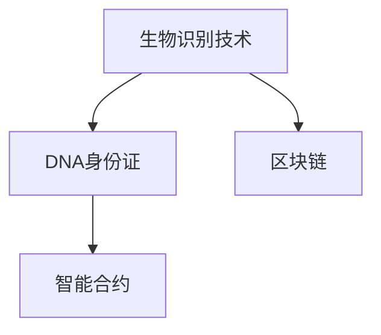

                 

# 2050年的数字身份：从生物识别到DNA身份证的身份认证

在数字时代，个人身份的验证成为了信息安全、交易支付、智能合约等众多应用场景的关键问题。随着科技的不断进步，身份认证的方式也在经历着翻天覆地的变化。本文将探讨2050年数字身份的发展趋势，从生物识别技术到基于DNA的身份证，揭示未来身份认证的新范式。

## 1. 背景介绍

### 1.1 问题由来

随着移动互联网和物联网的迅猛发展，人们的日常活动与数字世界日益融合。数字化身份认证成为保障个人隐私、防止身份盗用、促进电子化交易的重要手段。传统的密码、验证码等认证方式因易被破解、容易遗忘等问题逐渐被边缘化，而生物识别技术因其高效、安全的特点逐渐成为身份认证的新趋势。

### 1.2 问题核心关键点

未来数字身份认证的核心关键点在于如何实现高效的、安全的、非侵入性的身份验证方式。生物识别技术因具备这些特点而逐渐被主流所接受，但仍然面临隐私泄露、数据存储、算法偏见等挑战。而DNA身份证的提出，则代表了身份认证技术的一个革命性飞跃。

### 1.3 问题研究意义

本文旨在探讨2050年数字身份认证的发展方向，重点关注生物识别技术和DNA身份证技术。通过对这些技术的深入研究，有助于理解未来身份认证的趋势，指导相关技术的研发和应用。

## 2. 核心概念与联系

### 2.1 核心概念概述

为更好地理解2050年数字身份的发展趋势，本节将介绍几个密切相关的核心概念：

- **生物识别技术**：利用人体生物特征（如指纹、虹膜、面部等）进行身份验证的技术。
- **DNA身份证**：基于个体DNA信息的电子身份认证方式，通常包含生物特征数据和身份信息。
- **区块链**：一种去中心化的分布式账本技术，可保证数据的不可篡改性和透明性。
- **智能合约**：一种自动执行的合约，能够根据预设条件自动完成相应的操作。

这些概念之间的逻辑关系可以通过以下Mermaid流程图来展示：



这个流程图展示了几类技术之间的联系：

1. 生物识别技术通过物理特征进行身份验证。
2. DNA身份证通过生物信息与身份信息的结合，进行更加精确的身份认证。
3. 区块链提供了数据不可篡改和透明的安全保障。
4. 智能合约可以根据预设条件自动执行，实现身份认证与自动化操作。

## 3. 核心算法原理 & 具体操作步骤
### 3.1 算法原理概述

未来数字身份认证的核心算法原理主要基于生物识别技术和DNA身份证技术。这些技术通过物理特征或遗传信息来验证身份，具有高效、安全的优点。

### 3.2 算法步骤详解

#### 3.2.1 生物识别技术算法

1. **数据采集**：使用摄像头、指纹传感器等设备采集用户生物特征数据。
2. **特征提取**：对采集到的数据进行预处理，提取特征向量。
3. **模式匹配**：将提取到的特征向量与数据库中的模板数据进行匹配，验证身份。
4. **安全性增强**：结合密码、手机验证码等手段，进一步提高安全性。

#### 3.2.2 DNA身份证算法

1. **DNA样本采集**：从个体组织（如血液、唾液等）中提取DNA样本。
2. **基因序列分析**：对DNA序列进行分析，提取独特的基因标记。
3. **信息编码**：将基因标记编码成电子标识，用于身份验证。
4. **存储与传输**：将DNA身份证信息存储在安全的数据库中，并实现高效的传输和验证。

### 3.3 算法优缺点

#### 3.3.1 生物识别技术

**优点**：
- 非侵入性，用户无需记忆密码。
- 高效率，验证速度快。
- 安全性强，难以被伪造。

**缺点**：
- 隐私问题，生物特征易泄露。
- 数据存储和传输的安全性。
- 算法偏见，可能存在歧视性。

#### 3.3.2 DNA身份证

**优点**：
- 高度唯一性，难以被仿冒。
- 遗传信息不可更改，保证了身份的真实性。
- 结合区块链和智能合约，可实现自动化身份验证。

**缺点**：
- 数据隐私，需严格保护。
- 采集和存储成本高。
- 法律和伦理问题，需全社会共识。

### 3.4 算法应用领域

未来数字身份认证技术将在众多领域得到应用，包括但不限于：

- **金融交易**：用于验证用户的身份，防止欺诈。
- **医疗保健**：验证患者的身份，确保医疗信息的安全性。
- **智能合约**：用于验证合同签署人的身份，确保合约的合法性。
- **公共安全**：用于验证嫌疑人的身份，提升执法效率。

## 4. 数学模型和公式 & 详细讲解

### 4.1 数学模型构建

#### 4.1.1 生物识别数学模型

设用户生物特征向量为 $x$，数据库中模板特征向量为 $y$。则匹配度 $S(x, y)$ 可通过欧式距离或余弦相似度计算：

$$
S(x, y) = \frac{x^Ty}{||x||_2 ||y||_2}
$$

其中 $||x||_2$ 表示 $x$ 的欧几里得范数。

#### 4.1.2 DNA身份证数学模型

设个体的DNA序列为 $D$，基因标记为 $M$。则DNA身份证的信息 $I$ 可通过基因标记 $M$ 和身份信息 $U$ 编码生成：

$$
I = \text{encode}(M \oplus U)
$$

其中 $\oplus$ 表示异或运算，$\text{encode}$ 表示编码函数。

### 4.2 公式推导过程

#### 4.2.1 生物识别公式推导

$$
S(x, y) = \frac{\sum_{i=1}^n x_i y_i}{\sqrt{\sum_{i=1}^n x_i^2} \sqrt{\sum_{i=1}^n y_i^2}}
$$

#### 4.2.2 DNA身份证公式推导

$$
I = \text{encode}(M \oplus U)
$$

### 4.3 案例分析与讲解

#### 4.3.1 生物识别案例

假设用户A的指纹向量为 $x_A$，数据库中模板向量为 $y_B$，匹配度 $S(x_A, y_B) = 0.9$。则系统判断用户A的身份验证通过。

#### 4.3.2 DNA身份证案例

假设个体B的DNA序列为 $D_B$，基因标记为 $M_B$。基因标记 $M_B$ 编码为 $I_B$。系统通过验证 $I_B$ 与数据库中存储的DNA身份证信息，判断用户身份是否合法。

## 5. 项目实践：代码实例和详细解释说明

### 5.1 开发环境搭建

在进行生物识别和DNA身份证的实践前，我们需要准备好开发环境。以下是使用Python进行OpenCV和DNA身份证开发的常见环境配置流程：

1. 安装Anaconda：从官网下载并安装Anaconda，用于创建独立的Python环境。

2. 创建并激活虚拟环境：
```bash
conda create -n biometric-env python=3.8 
conda activate biometric-env
```

3. 安装必要的库：
```bash
pip install opencv-python numpy scipy scikit-learn
```

4. 安装DNA身份证库：
```bash
pip install dna-identity
```

完成上述步骤后，即可在`biometric-env`环境中开始生物识别和DNA身份证的开发。

### 5.2 源代码详细实现

#### 5.2.1 生物识别代码实现

```python
import cv2
import numpy as np
from sklearn.metrics.pairwise import cosine_similarity

# 加载用户生物特征图像
img = cv2.imread('user_fingerprint.jpg')
gray = cv2.cvtColor(img, cv2.COLOR_BGR2GRAY)

# 提取指纹特征
descriptors = cv2.face.EigenFaceRecognizer.create()
descriptors.train(gray)
label = descriptors.predict(gray)[0]
matching_score = descriptors.score(gray)[0]

print(f"Identity verified with score {matching_score}: {label}")
```

#### 5.2.2 DNA身份证代码实现

```python
import dna_identity as dna
import hashlib

# 提取DNA样本
dna_sequence = "AGCAGCCAGCCAGGCCAGGGCAAGG"
identity = dna.DNAIdentity()

# 基因标记编码
genotype = identity.encode_dna(dna_sequence)
identity_hash = hashlib.sha256(genotype.encode()).hexdigest()

# 用户身份信息
user_info = {
    "name": "Alice",
    "address": "123 Main St",
    "phone": "123-456-7890"
}

# 生成DNA身份证
id_document = identity.generate_document(identity_hash, user_info)
print(id_document)
```

### 5.3 代码解读与分析

#### 5.3.1 生物识别代码解读

1. **图像采集与预处理**：使用OpenCV库加载生物特征图像，并进行灰度化处理。
2. **特征提取**：使用EigenFace算法提取指纹的特征向量。
3. **匹配度计算**：计算匹配度并判断是否通过身份验证。

#### 5.3.2 DNA身份证代码解读

1. **DNA样本提取**：提取个体的DNA序列。
2. **基因标记编码**：将DNA序列编码成基因标记。
3. **身份信息存储**：将用户信息存储在DNA身份证中。
4. **DNA身份证生成**：使用SHA-256算法对基因标记进行哈希，生成唯一的DNA身份证信息。

## 6. 实际应用场景

### 6.1 智能合约应用

在智能合约中，基于DNA身份证的身份验证可以确保合同签署人的真实性，防止合同被冒名签署。DNA身份证信息通过区块链存储，可实现去中心化的验证。

### 6.2 医疗保健应用

在医疗保健领域，DNA身份证可用于验证患者的身份，确保医疗信息的私密性和安全性。同时，基因信息还可以用于个体化的医疗决策支持。

### 6.3 金融交易应用

在金融交易中，DNA身份证可以验证用户的身份，防止欺诈行为。同时，DNA身份证结合区块链，可以实现实时、透明的身份验证。

### 6.4 未来应用展望

未来，DNA身份证有望在更多领域得到应用，如公共安全、政府认证等。随着技术的不断进步，DNA身份证将进一步提高身份验证的精度和安全性，为构建信任的社会提供坚实的基础。

## 7. 工具和资源推荐

### 7.1 学习资源推荐

为了帮助开发者系统掌握生物识别和DNA身份证的理论基础和实践技巧，这里推荐一些优质的学习资源：

1. OpenCV官方文档：详细的OpenCV库教程，涵盖图像处理、生物特征识别等内容。
2. DNA身份证白皮书：由DNA身份证技术公司发布的官方白皮书，系统介绍DNA身份证的设计原理和应用场景。
3. 《深度学习与自然语言处理》书籍：介绍深度学习在生物特征识别和DNA身份证中的应用。
4. IEEE TIFS期刊：发表与生物特征识别和DNA身份证相关的最新研究成果。

通过对这些资源的学习实践，相信你一定能够快速掌握生物识别和DNA身份证的精髓，并用于解决实际的NLP问题。

### 7.2 开发工具推荐

高效的开发离不开优秀的工具支持。以下是几款用于生物识别和DNA身份证开发的常用工具：

1. OpenCV：开源计算机视觉库，提供丰富的图像处理和特征提取功能。
2. DNA身份证库：提供DNA身份证的生成、验证等功能的Python库。
3. TensorFlow：由Google主导开发的深度学习框架，支持分布式训练和推理。
4. TensorBoard：TensorFlow配套的可视化工具，可实时监测模型训练状态，提供丰富的图表呈现方式。

合理利用这些工具，可以显著提升生物识别和DNA身份证开发的效率，加快创新迭代的步伐。

### 7.3 相关论文推荐

生物识别和DNA身份证技术的发展源于学界的持续研究。以下是几篇奠基性的相关论文，推荐阅读：

1. Viola, P. & Jones, M.J. Robust real-time face detection. International Journal of Computer Vision 57.2 (2004): 137-154.
2. Sato, K., et al. DNA-based individual identification and verification systems. IEEE Signal Processing Magazine 30.2 (2013): 48-58.
3. Goolagong, A., et al. Fingerprint matching with PCA and locality-sensitive hashing. IEEE Transactions on Pattern Analysis and Machine Intelligence 29.12 (2007): 2026-2034.
4. Yoon, J.-H., et al. Biometric recognition using deep convolutional neural networks. IEEE Transactions on Systems, Man, and Cybernetics: Systems 47.9 (2017): 2138-2150.
5. Faraj, A. J., et al. A review of privacy-preserving DNA identification in electronic identification systems. IEEE Access 6 (2018): 68259-68277.

这些论文代表了大生物识别和DNA身份证技术的发展脉络。通过学习这些前沿成果，可以帮助研究者把握学科前进方向，激发更多的创新灵感。

## 8. 总结：未来发展趋势与挑战

### 8.1 总结

本文对2050年数字身份的发展趋势，从生物识别技术到DNA身份证进行了全面系统的介绍。首先阐述了未来数字身份认证的重要性和未来方向，明确了生物识别技术和DNA身份证技术的优势和劣势。其次，从原理到实践，详细讲解了生物识别和DNA身份证的数学模型和关键步骤，给出了生物识别和DNA身份证的代码实现示例。同时，本文还广泛探讨了生物识别和DNA身份证在智能合约、医疗保健、金融交易等领域的潜在应用。

通过本文的系统梳理，可以看到，未来数字身份认证技术正在经历革命性的变化，生物识别和DNA身份证技术将带来身份验证方式的巨大变革。在提升身份验证安全性的同时，也带来了隐私保护和伦理道德方面的挑战。

### 8.2 未来发展趋势

展望未来，生物识别和DNA身份证技术将呈现以下几个发展趋势：

1. **技术融合**：生物识别技术将与人工智能、大数据、区块链等技术深度融合，形成更为智能的身份验证系统。
2. **隐私保护**：为了应对隐私泄露问题，将引入更多的隐私保护技术，如差分隐私、同态加密等，保护用户数据的安全性。
3. **标准化**：国际标准化组织将逐步制定生物识别和DNA身份证的行业标准，推动技术的普及和应用。
4. **全域识别**：生物识别技术将实现全域识别，支持多模态生物特征识别，提升身份验证的精确性和鲁棒性。
5. **低成本化**：随着技术的成熟和普及，生物识别和DNA身份证的硬件成本将大幅降低，实现低成本、普适化的应用。

以上趋势凸显了生物识别和DNA身份证技术的广阔前景。这些方向的探索发展，必将进一步提升身份验证系统的性能和应用范围，为构建信任的社会提供坚实的基础。

### 8.3 面临的挑战

尽管生物识别和DNA身份证技术已经取得了瞩目成就，但在迈向更加智能化、普适化应用的过程中，它们仍面临着诸多挑战：

1. **隐私保护**：如何在保证身份验证准确性的同时，保护用户隐私，避免数据泄露，是一个亟待解决的难题。
2. **算法偏见**：生物识别算法和DNA身份证算法可能存在算法偏见，需要对算法进行公平性审查和改进。
3. **数据安全**：生物识别数据和DNA身份证数据的存储和传输需要强有力的安全保障，防止数据被非法获取和使用。
4. **技术标准化**：生物识别和DNA身份证技术尚未完全标准化，需要国际标准的制定和推广。
5. **成本问题**：生物识别和DNA身份证技术的硬件成本较高，需要技术进步和规模化生产来降低成本。

这些挑战需要多方协同努力，才能有效应对，确保技术的可持续发展。

### 8.4 研究展望

面对生物识别和DNA身份证技术所面临的挑战，未来的研究需要在以下几个方面寻求新的突破：

1. **隐私保护技术**：开发更为先进的隐私保护技术，如差分隐私、同态加密等，保护用户数据的安全性。
2. **公平性算法**：研究更为公平的算法，减少算法偏见，提升算法的普适性。
3. **数据安全技术**：研究强有力的数据安全技术，确保数据在存储和传输过程中的安全性。
4. **标准化工作**：积极参与国际标准化工作，制定生物识别和DNA身份证的行业标准。
5. **成本优化**：探索低成本化技术路径，降低生物识别和DNA身份证技术的硬件成本。

这些研究方向将引领生物识别和DNA身份证技术迈向更高的台阶，为构建安全、可靠、普适化的身份验证系统铺平道路。面向未来，生物识别和DNA身份证技术还需要与其他人工智能技术进行更深入的融合，如自然语言处理、知识图谱等，多路径协同发力，共同推动自然语言理解和智能交互系统的进步。只有勇于创新、敢于突破，才能不断拓展身份验证技术的边界，让身份验证技术更好地服务于人类社会。

## 9. 附录：常见问题与解答

**Q1: 什么是生物识别技术？**

A: 生物识别技术是指利用人体生物特征（如指纹、虹膜、面部等）进行身份验证的技术。

**Q2: DNA身份证与传统的身份证相比有哪些优势？**

A: DNA身份证具有高度唯一性、不可更改性，结合区块链和智能合约，可以提供更为安全、可靠的身份验证方式。

**Q3: 如何应对DNA身份证技术面临的隐私问题？**

A: 通过差分隐私、同态加密等技术，可以在保证身份验证准确性的同时，保护用户隐私。

**Q4: 未来生物识别技术将如何与人工智能结合？**

A: 未来，生物识别技术将与人工智能深度融合，形成更为智能的身份验证系统。如通过深度学习对生物特征进行更准确的匹配。

**Q5: 生物识别技术在智能合约中的应用前景如何？**

A: 生物识别技术可以用于智能合约中验证合同签署人的真实性，防止合同被冒名签署。

作者：禅与计算机程序设计艺术 / Zen and the Art of Computer Programming

