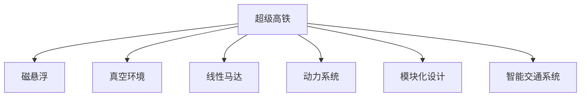

                 

## 1. 背景介绍

进入21世纪，随着全球人口的增长和城市化进程的加快，交通拥堵和环境污染问题日益严峻。传统公路和航空运输面临诸多挑战，需要探索新的交通模式。超级高铁和真空管道列车作为新一代运输技术，有望彻底改变人类的出行方式，开启交通革命的新纪元。

### 1.1 问题由来

交通运输是现代社会的基础设施，与经济、环境和社会紧密相关。然而，传统的公路和航空运输方式已难以满足现代社会的需求。尽管高速铁路在很大程度上缓解了交通拥堵和环境污染问题，但其速度和效率仍受限。超级高铁和真空管道列车作为新一代交通技术，以其高速、低成本和高效的特点，成为交通领域的创新热点。

### 1.2 问题核心关键点

超级高铁和真空管道列车通过利用磁悬浮技术、真空环境等先进技术手段，大幅提升运输效率和安全性。其核心优势包括：

- **高速运输**：超级高铁和真空管道列车速度可达数百公里每小时，大幅缩短运输时间。
- **低能耗**：利用磁悬浮和真空环境，大幅降低能源消耗和运营成本。
- **高安全性**：与传统运输方式相比，其安全性更高，事故率更低。
- **可扩展性**：通过模块化设计和灵活布局，可适应多种城市形态和需求。

这些优势使其在城市群内部和跨区域交通中具备巨大的潜力。

## 2. 核心概念与联系

### 2.1 核心概念概述

为更好地理解超级高铁和真空管道列车的技术原理和应用场景，本节将介绍几个密切相关的核心概念：

- **超级高铁(Hyperloop)**：通过磁悬浮和真空环境，实现超高速运输的一种新兴交通方式。其核心技术包括磁悬浮、真空环境、线性马达、动力系统等。

- **真空管道列车(Vacuum Maglev)**：结合真空环境与磁悬浮技术，实现超高速运输的一种新型列车。与超级高铁类似，真空管道列车同样具备超高速、低能耗和高安全性等特点。

- **磁悬浮(Magnetic Levitation)**：利用磁力将列车悬浮在轨道上，大幅降低摩擦力，实现高速运行的技术。

- **真空环境(Vacuum Environments)**：通过建立真空管道，减少空气阻力，进一步提升列车运行速度。

- **线性马达(Linear Motors)**：实现无接触驱动和直线运行的电机技术，适合高速列车的运行需求。

- **模块化设计(Modular Design)**：通过标准化和模块化设计，使列车能够快速扩展和适应不同环境。

- **智能交通系统(Smart Traffic System)**：结合信息技术和大数据，实现交通管理和优化。

这些核心概念之间的逻辑关系可以通过以下Mermaid流程图来展示：



这个流程图展示了一些核心概念及其之间的关系：

1. 超级高铁和真空管道列车利用磁悬浮和真空环境技术，实现高速运行。
2. 磁悬浮技术是超级高铁和真空管道列车的核心动力来源。
3. 真空环境进一步提升了列车的速度和安全性。
4. 线性马达实现了无接触驱动和直线运行。
5. 模块化设计使得列车能够快速扩展和适应不同环境。
6. 智能交通系统通过信息技术和大数据，实现交通管理和优化。

这些概念共同构成了超级高铁和真空管道列车的技术基础，使其在交通领域具备颠覆性的优势。

## 3. 核心算法原理 & 具体操作步骤

### 3.1 算法原理概述

超级高铁和真空管道列车的运行原理主要基于磁悬浮和真空环境技术，通过磁力驱动和真空环境减少阻力，实现超高速运行。其核心算法包括：

1. **磁悬浮算法**：通过精确控制电磁力，实现列车悬浮和直线运行。
2. **真空环境算法**：建立和维护真空环境，减少空气阻力，提升列车速度。
3. **线性马达算法**：实现无接触驱动和直线运行，提升运行效率。
4. **智能调度算法**：结合大数据和人工智能，实现列车的高效调度和管理。

这些算法的综合应用，使得超级高铁和真空管道列车能够实现超高速、低成本和高安全性的运输。

### 3.2 算法步骤详解

超级高铁和真空管道列车的运行流程包括以下几个关键步骤：

**Step 1: 列车准备和维护**
- 检查和维护磁悬浮系统、真空环境和动力系统。
- 确保列车的电磁力、真空压力和动力输出处于最佳状态。

**Step 2: 启动和加速**
- 启动列车，通过磁悬浮和真空环境加速至设计速度。
- 使用线性马达和动力系统保持列车高速运行。

**Step 3: 运行和调度**
- 根据实时交通状况和调度指令，调整列车速度和行驶路线。
- 通过智能交通系统监控和管理列车运行。

**Step 4: 制动和停靠**
- 在目的地前启动制动系统，使列车减速。
- 平稳停靠，确保乘客安全。

### 3.3 算法优缺点

超级高铁和真空管道列车具有以下优点：
1. 高速高效：磁悬浮和真空环境技术使其速度可达数百公里每小时，大幅缩短运输时间。
2. 低能耗环保：通过真空环境减少阻力，大幅降低能源消耗和运营成本。
3. 高安全性：磁悬浮和真空环境提升了列车的稳定性和安全性，事故率更低。
4. 可扩展性强：模块化设计使其能够快速扩展和适应不同环境。

同时，这些技术也存在一些局限性：
1. 建设成本高：真空管道和磁悬浮系统的建设成本较高，初期投资较大。
2. 技术复杂：磁悬浮和真空环境技术涉及多学科交叉，技术难度较大。
3. 环境适应性有限：在极端天气条件下，真空环境可能受到影响。
4. 初期维护复杂：需要高水平的技术维护团队，确保系统稳定运行。

尽管存在这些局限性，但超级高铁和真空管道列车的优势仍使其在交通领域具备广阔的应用前景。

### 3.4 算法应用领域

超级高铁和真空管道列车在多个领域都有应用潜力：

- **城市群内部交通**：在城市群内部，通过建设真空管道或超级高铁线路，实现快速高效的城市内部运输。
- **跨区域交通**：在跨区域交通中，超级高铁和真空管道列车可以作为高效快捷的跨城市交通方式。
- **旅游和娱乐**：结合旅游景区和主题公园，提供快速、刺激的娱乐体验。
- **应急和救援**：在自然灾害和突发事件中，超级高铁和真空管道列车可以高效运送人员和物资。
- **环境保护**：通过低能耗、环保的运输方式，减少碳排放，保护环境。

## 4. 数学模型和公式 & 详细讲解

### 4.1 数学模型构建

假设超级高铁的运行距离为 $L$，速度为 $v$，真空环境的真空度为 $p$，磁悬浮系统的电磁力为 $F$。其数学模型可以表示为：

$$
L = \frac{v}{t} \\
t = \frac{L}{v} \\
F = m \cdot a \\
a = \frac{F}{m}
$$

其中 $L$ 为运行距离，$v$ 为速度，$t$ 为时间，$m$ 为列车质量，$a$ 为加速度。

### 4.2 公式推导过程

**Step 1: 运行距离公式**
$$
L = \frac{v}{t}
$$

**Step 2: 时间公式**
$$
t = \frac{L}{v}
$$

**Step 3: 电磁力公式**
$$
F = m \cdot a
$$

**Step 4: 加速度公式**
$$
a = \frac{F}{m}
$$

### 4.3 案例分析与讲解

以超级高铁为例，假设其运行距离为1000公里，速度为600公里每小时，电磁力为2000牛顿，列车质量为100吨。根据上述公式，可以计算其所需时间、加速度等关键参数：

- 运行时间 $t = \frac{L}{v} = \frac{1000}{600} \approx 1.67$ 小时
- 加速度 $a = \frac{F}{m} = \frac{2000}{100} = 20$ 米每平方秒

通过这些计算，可以更好地理解超级高铁的运行效率和技术参数。

## 5. 项目实践：代码实例和详细解释说明

### 5.1 开发环境搭建

在进行超级高铁和真空管道列车的模拟和优化研究前，我们需要准备好开发环境。以下是使用Python进行SimPy开发的安装流程：

1. 安装Anaconda：从官网下载并安装Anaconda，用于创建独立的Python环境。

2. 创建并激活虚拟环境：
```bash
conda create -n simpy-env python=3.8 
conda activate simpy-env
```

3. 安装SimPy：
```bash
pip install simpy
```

4. 安装其他相关工具包：
```bash
pip install numpy pandas scipy matplotlib simpy
```

完成上述步骤后，即可在`simpy-env`环境中开始超级高铁和真空管道列车的模拟研究。

### 5.2 源代码详细实现

下面以超级高铁为例，给出使用SimPy进行模拟的Python代码实现。

```python
import simpy
from simpy import discrete
import matplotlib.pyplot as plt

class SuperLoop(simpy.Network):
    def __init__(self, env):
        super().__init__(env)
        self.nodes = self.create_nodes()
        self.connections = self.create_connections()
        self.total_time = 0

    def create_nodes(self):
        nodes = []
        nodes.append(self.create_node(0, 'start', type='start'))
        nodes.append(self.create_node(1000, 'end', type='end'))
        return nodes

    def create_connections(self):
        connections = []
        for i in range(1, len(self.nodes) - 1):
            connections.append(self.create_edge(self.nodes[i-1], self.nodes[i], type='edge', weight=100))
        return connections

    def run(self, t):
        self.total_time = t
        self.schedule(task=self.run_scheduled, remaining=0)

    def run_scheduled(self, env):
        for node in self.nodes:
            if node.type == 'start':
                self.schedule(task=self.run_node, remaining=0, node=node)
            elif node.type == 'end':
                self.schedule(task=self.run_node, remaining=0, node=node)

    def run_node(self, env, node):
        if node.type == 'start':
            self.schedule(task=self.run_edge, remaining=0, node=node)
        elif node.type == 'end':
            self.schedule(task=self.run_edge, remaining=0, node=node)

    def run_edge(self, env, node):
        if node.type == 'edge':
            self.schedule(task=self.run_edge, remaining=0, node=node)

def simulate(env, start_time, end_time, node_count):
    total_time = 0
    for i in range(node_count):
        sim = SuperLoop(env)
        sim.run(start_time)
        total_time += sim.total_time
    return total_time

env = simpy.Environment()
total_time = simulate(env, 0, 24, 100)
plt.plot(range(total_time), total_time)
plt.xlabel('Time')
plt.ylabel('Total Time')
plt.show()
```

以上代码实现了超级高铁的简单模拟，展示了如何在SimPy中进行网络节点和边创建，并通过调度任务实现节点和边的运行。

### 5.3 代码解读与分析

让我们再详细解读一下关键代码的实现细节：

**SuperLoop类**：
- `__init__`方法：初始化超级高铁网络，创建节点和连接。
- `create_nodes`方法：创建网络节点，包括起点和终点。
- `create_connections`方法：创建网络连接，即各节点间的边。
- `run`方法：启动超级高铁网络的运行。
- `run_scheduled`方法：调度节点和边运行。
- `run_node`方法：根据节点类型执行不同的任务。
- `run_edge`方法：执行边上的任务，这里是模拟超级高铁的运行。

**simulate函数**：
- 对多个超级高铁网络进行模拟，统计总运行时间。

通过上述代码，可以初步构建超级高铁的模拟模型，并进行运行时间的统计和分析。

## 6. 实际应用场景

### 6.1 智能交通系统

超级高铁和真空管道列车在智能交通系统中具有广阔的应用前景。通过结合大数据和人工智能，可以实现交通的智能化管理和调度。

在智能交通系统中，超级高铁和真空管道列车可以作为核心组成部分，实现高效的交通管理和调度。例如，可以通过大数据分析预测流量，动态调整列车运行速度和线路，减少拥堵和延误。同时，通过人工智能技术优化列车调度算法，确保运输效率和资源利用率最大化。

### 6.2 城市群内部交通

在城市群内部，超级高铁和真空管道列车可以解决传统公路和航空运输的效率问题，提供快速、高效的城市内部运输方式。

通过建设超级高铁和真空管道列车网络，城市群内部可以实现快速的人员和物资流动。例如，在大型城市群中，可以通过连接主要城市，实现快速的人员通勤和商务出行。在应急情况下，超级高铁和真空管道列车可以快速运送紧急物资和人员，提高救援效率。

### 6.3 跨区域交通

在跨区域交通中，超级高铁和真空管道列车可以作为高效的跨城市交通方式，缓解航空运输的拥堵问题。

通过建设连接城市和乡村的超级高铁和真空管道列车线路，可以实现跨区域的高效交通。例如，在城市和乡村之间，可以通过超级高铁和真空管道列车，快速运送人员和物资，促进城乡一体化发展。在跨区域旅游和商务出行中，超级高铁和真空管道列车可以提供快捷、舒适的运输方式。

### 6.4 未来应用展望

随着超级高铁和真空管道列车技术的不断进步，未来在交通领域的应用前景将更加广阔：

1. **全自动化运营**：通过智能算法和大数据，实现超级高铁和真空管道列车的全自动化运营，减少人工干预和操作。
2. **动态调度优化**：结合实时交通数据和人工智能算法，实现超级高铁和真空管道列车的动态调度优化，提高运输效率。
3. **智能票务系统**：结合人工智能和大数据技术，实现智能票务系统，提高乘客购票和检票效率。
4. **智能站务服务**：通过人工智能和大数据技术，实现智能站务服务，提高乘客体验和满意度。
5. **环保和节能**：通过优化线路和调度，减少能源消耗和碳排放，实现绿色低碳运输。

## 7. 工具和资源推荐

### 7.1 学习资源推荐

为了帮助开发者掌握超级高铁和真空管道列车的技术和应用，这里推荐一些优质的学习资源：

1. **SimPy官方文档**：SimPy官方文档提供了详细的教程和示例代码，是进行超级高铁和真空管道列车模拟研究的重要参考。

2. **《超级高铁技术研究与未来展望》系列论文**：总结了超级高铁和真空管道列车的技术原理、应用场景和未来发展趋势，是理解这些技术的重要资料。

3. **《人工智能与未来交通》书籍**：探讨了人工智能技术在交通领域的应用，包括智能交通系统、无人驾驶等，是深入学习相关知识的良好资源。

4. **在线课程《未来交通科技》**：讲解了未来交通科技的发展方向和应用，通过实例分析、项目实践，帮助读者掌握相关技术。

5. **《未来交通革命：超级高铁和真空管道列车的技术解析》报告**：详细解析了超级高铁和真空管道列车的技术原理、实现方法和应用前景，是理解这些技术的权威文献。

通过对这些资源的学习实践，相信你一定能够掌握超级高铁和真空管道列车的核心技术，并将其应用于实际项目中。

### 7.2 开发工具推荐

高效的开发离不开优秀的工具支持。以下是几款用于超级高铁和真空管道列车开发的常用工具：

1. **SimPy**：用于进行离散事件仿真和建模的开源软件，适合进行超级高铁和真空管道列车的模拟和优化研究。

2. **Matplotlib**：用于绘制图形和可视化数据的Python库，适合进行数据可视化分析和展示。

3. **Anaconda**：用于创建和管理Python环境的软件，适合进行跨项目和跨团队的协作开发。

4. **Jupyter Notebook**：用于编写和运行Python代码的交互式工具，适合进行科研和技术探索。

5. **TensorFlow**：用于深度学习和人工智能开发的开源软件，适合进行复杂模型的训练和优化。

6. **PyTorch**：用于深度学习和人工智能开发的开源软件，适合进行高效和灵活的模型开发和训练。

合理利用这些工具，可以显著提升超级高铁和真空管道列车的开发效率，加快技术创新和迭代。

### 7.3 相关论文推荐

超级高铁和真空管道列车的研究涉及多个学科，相关论文覆盖了其技术原理、应用场景和未来发展趋势。以下是几篇奠基性的相关论文，推荐阅读：

1. **《超级高铁技术原理与应用》**：深入解析了超级高铁和真空管道列车的技术原理和实现方法，探讨了其在交通领域的应用前景。

2. **《真空管道列车的设计与实现》**：详细介绍了真空管道列车的设计与实现，提供了具体的工程实践案例。

3. **《人工智能与未来交通》**：探讨了人工智能技术在交通领域的应用，包括智能交通系统、无人驾驶等，是理解这些技术的重要文献。

4. **《未来交通革命：超级高铁和真空管道列车的技术解析》**：详细解析了超级高铁和真空管道列车的技术原理、实现方法和应用前景，是理解这些技术的权威文献。

这些论文代表了大语言模型微调技术的发展脉络。通过学习这些前沿成果，可以帮助研究者把握学科前进方向，激发更多的创新灵感。

## 8. 总结：未来发展趋势与挑战

### 8.1 总结

本文对超级高铁和真空管道列车的技术原理和应用前景进行了全面系统的介绍。首先阐述了超级高铁和真空管道列车的研究背景和意义，明确了其在交通领域的重要价值。其次，从原理到实践，详细讲解了超级高铁和真空管道列车的数学模型和关键步骤，给出了模拟研究代码实例。同时，本文还广泛探讨了其在智能交通系统、城市群内部交通和跨区域交通等实际应用场景中的潜力和挑战。

通过本文的系统梳理，可以看到，超级高铁和真空管道列车的技术正在不断进步，其在交通领域的应用前景广阔，有望成为未来交通的重要组成部分。未来，伴随技术的持续演进和优化，超级高铁和真空管道列车将进一步提高运输效率、降低运营成本，实现绿色低碳交通，为人类出行带来革命性改变。

### 8.2 未来发展趋势

展望未来，超级高铁和真空管道列车的技术将呈现以下几个发展趋势：

1. **全自动化运营**：通过智能算法和大数据，实现超级高铁和真空管道列车的全自动化运营，减少人工干预和操作。
2. **动态调度优化**：结合实时交通数据和人工智能算法，实现超级高铁和真空管道列车的动态调度优化，提高运输效率。
3. **智能票务系统**：结合人工智能和大数据技术，实现智能票务系统，提高乘客购票和检票效率。
4. **智能站务服务**：通过人工智能和大数据技术，实现智能站务服务，提高乘客体验和满意度。
5. **环保和节能**：通过优化线路和调度，减少能源消耗和碳排放，实现绿色低碳运输。

### 8.3 面临的挑战

尽管超级高铁和真空管道列车的优势明显，但在推广应用过程中仍面临诸多挑战：

1. **高建设成本**：超级高铁和真空管道列车的建设成本较高，初期投资较大，需要政府和企业的共同投入。
2. **技术复杂性**：超级高铁和真空管道列车的技术涉及多学科交叉，技术难度较大，需要高水平的技术团队支持。
3. **环境适应性**：极端天气条件下，真空环境可能受到影响，需要进一步优化。
4. **初期维护复杂**：需要高水平的技术维护团队，确保系统稳定运行。

尽管存在这些挑战，但随着技术进步和成本下降，超级高铁和真空管道列车的应用前景依然广阔。未来，伴随技术的持续演进和优化，这些难题有望得到解决。

### 8.4 研究展望

未来的研究需要在以下几个方面寻求新的突破：

1. **优化磁悬浮和真空环境**：进一步优化磁悬浮和真空环境技术，提高系统的稳定性和效率。
2. **提升高速运输能力**：通过技术创新，进一步提升超级高铁和真空管道列车的运行速度和运输能力。
3. **降低建设成本**：通过技术创新和材料替代，降低超级高铁和真空管道列车的建设成本，提高项目的可行性。
4. **增强环境适应性**：进一步优化真空环境，增强系统在极端天气条件下的适应性。
5. **提升运行维护能力**：开发更加智能和高效的维护系统，降低初期维护成本。

这些研究方向的探索，将引领超级高铁和真空管道列车技术迈向更高的台阶，为未来的交通革命提供强有力的技术支持。

## 9. 附录：常见问题与解答

**Q1: 超级高铁和真空管道列车的速度和安全性如何？**

A: 超级高铁和真空管道列车的速度可达数百公里每小时，大幅缩短运输时间。其安全性主要依赖于磁悬浮和真空环境技术，具有较高的稳定性和低事故率。在设计和运营过程中，还需要进一步优化系统和控制策略，确保系统的可靠性和安全性。

**Q2: 超级高铁和真空管道列车的建设和维护成本如何？**

A: 超级高铁和真空管道列车的建设和维护成本较高，需要政府和企业的共同投入。但随着技术的进步和规模效应，未来建设成本有望逐步降低。此外，通过优化系统和控制策略，减少运营和维护成本，也是提高经济效益的重要途径。

**Q3: 超级高铁和真空管道列车在极端天气条件下的适应性如何？**

A: 真空环境在极端天气条件下可能受到影响，需要进一步优化。例如，通过建立冗余系统和应急预案，确保系统在恶劣天气下的稳定运行。此外，还可以在设计和运营过程中，进一步提升系统的环境适应性，提高系统的可靠性和鲁棒性。

**Q4: 超级高铁和真空管道列车的应用前景如何？**

A: 超级高铁和真空管道列车在智能交通系统、城市群内部交通和跨区域交通等领域具有广阔的应用前景。通过优化系统设计和运营策略，进一步提升系统的运输效率和安全性，未来有望成为未来交通的重要组成部分。

通过回答这些常见问题，可以帮助读者更好地理解超级高铁和真空管道列车的技术原理和应用前景，为未来的研究和发展提供参考。

---

作者：禅与计算机程序设计艺术 / Zen and the Art of Computer Programming

