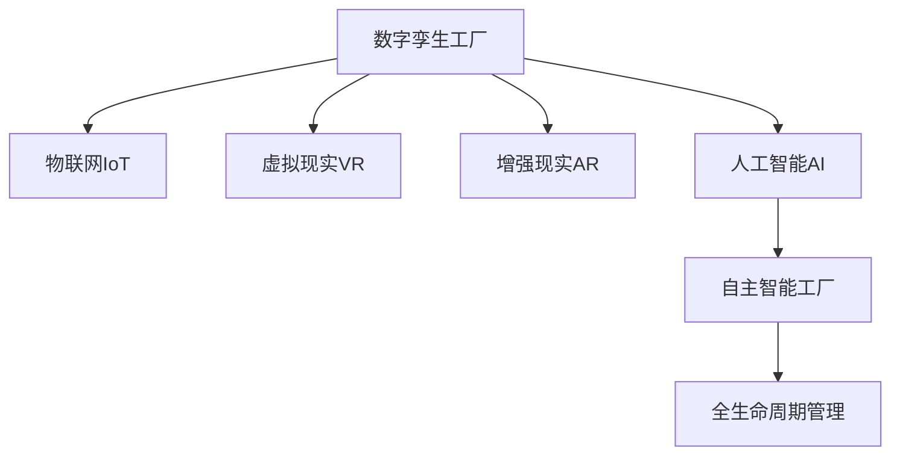

                 

# 2050年的智能制造：从数字孪生工厂到自主智能工厂的制造业智能化

## 1. 背景介绍

### 1.1 问题由来
近年来，随着物联网、人工智能、大数据等技术的飞速发展，智能制造成为了制造业转型升级的重要方向。智能制造通过将先进的信息技术和制造技术深度融合，实现生产过程的数字化、网络化、智能化，显著提升了制造业的效率和灵活性。

然而，当前智能制造仍然面临诸多挑战。例如，设备互联互通的水平较低，数据孤岛现象严重，导致信息共享不畅；生产调度不够灵活，无法有效应对市场需求的快速变化；人力资源结构不均衡，技能短缺现象严重；供应链管理复杂，难以实现实时协调与优化。

这些挑战呼唤更为先进的智能制造范式，而数字孪生工厂与自主智能工厂作为新一代智能制造的核心技术，有望为制造业智能化提供更为坚实的技术支撑。

### 1.2 问题核心关键点
数字孪生工厂和自主智能工厂是智能制造的高级形态，代表了下一代制造模式。二者的核心在于：
- 数字孪生工厂：基于虚拟化技术，构建实体工厂的数字化模型，实时映射工厂运行状态，为生产调度、设备维护、质量控制等提供决策支持。
- 自主智能工厂：通过先进算法和认知推理，实现制造过程的自主决策和优化，无需人工干预，提升生产效率和灵活性。

这两种工厂模式深度融合了物联网、大数据、人工智能、虚拟现实等技术，其核心技术包括：
- 数字孪生模型：建立实体工厂的数字化模型，实现全生命周期管理。
- 虚拟现实(VR)和增强现实(AR)：为生产人员提供实时的交互体验，辅助生产过程。
- 人工智能(AI)算法：实现制造过程的智能决策和优化，提升生产效率。
- 物联网(IoT)技术：实现设备的互联互通，构建智能生产网络。

这些核心技术相互交织，形成了新一代智能制造的基础架构，有望大幅提升制造业的智能化水平。

## 2. 核心概念与联系

### 2.1 核心概念概述

为更好地理解数字孪生工厂和自主智能工厂的原理与联系，本节将介绍几个密切相关的核心概念：

- 数字孪生工厂(Digital Twin Manufacturing)：通过将实体工厂映射到虚拟数字空间，构建虚拟工厂模型，实现生产过程的全生命周期管理。
- 自主智能工厂(Autonomous Intelligent Manufacturing)：结合人工智能和认知推理技术，实现制造过程的自主决策和优化，无需人工干预。
- 物联网(IoT)：实现设备与设备、设备与人员的互联互通，构建智能生产网络。
- 虚拟现实(VR)和增强现实(AR)：为生产人员提供实时的交互体验，辅助生产过程。
- 人工智能(AI)：实现制造过程的智能决策和优化，提升生产效率。

这些核心概念之间的逻辑关系可以通过以下Mermaid流程图来展示：



这个流程图展示了大语言模型的核心概念及其之间的关系：

1. 数字孪生工厂通过物联网技术收集工厂实体的数据，构建虚拟模型，实现对生产过程的全生命周期管理。
2. 物联网、VR、AR等技术为数字孪生工厂提供了数据采集和交互体验的基础。
3. 人工智能技术通过算法实现对生产过程的智能决策和优化，驱动自主智能工厂的运作。
4. 自主智能工厂通过全生命周期管理，提升生产效率和灵活性。

这些概念共同构成了智能制造的核心框架，使得制造业能够从数字化、网络化向智能化转型升级。

## 3. 核心算法原理 & 具体操作步骤

### 3.1 算法原理概述

数字孪生工厂和自主智能工厂的核心算法原理主要涉及以下几个方面：

1. 数字孪生模型的构建与优化：通过实时映射实体工厂的状态，构建虚拟工厂模型，优化生产流程和资源配置。
2. 物联网数据采集与处理：实现设备与设备、设备与人员的互联互通，构建智能生产网络。
3. 人工智能决策与优化：结合机器学习和深度学习算法，实现制造过程的智能决策和优化。
4. 虚拟现实和增强现实：为生产人员提供实时的交互体验，辅助生产过程。

这些核心算法相互交织，共同驱动智能制造的智能化水平提升。

### 3.2 算法步骤详解

数字孪生工厂和自主智能工厂的建设主要包括以下关键步骤：

**Step 1: 数字孪生模型构建**

1. 收集实体工厂的各类数据，包括设备状态、生产订单、物料流动、人员信息等。
2. 利用3D建模软件或仿真平台，构建实体工厂的数字化模型。
3. 通过物联网技术采集工厂实体的实时数据，映射到虚拟模型中。

**Step 2: 物联网数据采集与处理**

1. 通过传感器、RFID、条码等技术，实现设备的互联互通，构建智能生产网络。
2. 实时采集设备的运行状态和生产数据，为数字孪生模型提供实时数据支持。
3. 利用数据清洗和预处理技术，将原始数据转换为可用于分析的规范化数据。

**Step 3: 人工智能决策与优化**

1. 结合机器学习和深度学习算法，对生产数据进行分析，实现对生产过程的智能决策和优化。
2. 利用强化学习等技术，提升生产调度、设备维护、质量控制的效率和准确性。
3. 结合模拟仿真技术，优化生产流程和资源配置，提升生产效率和灵活性。

**Step 4: 虚拟现实和增强现实**

1. 利用虚拟现实技术，为生产人员提供实时的交互体验，辅助生产过程。
2. 利用增强现实技术，将虚拟模型叠加到生产现场，帮助操作人员进行任务规划和操作。

**Step 5: 测试与部署**

1. 在虚拟环境中进行模型测试和优化，验证数字孪生工厂和自主智能工厂的可行性和效果。
2. 部署模型到实体工厂中，实现智能制造的落地应用。
3. 持续收集反馈数据，优化模型和算法，提升智能制造系统的性能。

以上是数字孪生工厂和自主智能工厂建设的一般流程。在实际应用中，还需要针对具体场景进行优化设计，如引入更多先验知识、改进数据采集技术、提升算法性能等，以进一步提升智能制造的效果。

### 3.3 算法优缺点

数字孪生工厂和自主智能工厂的算法具有以下优点：
1. 数据驱动：通过实时数据采集和分析，实现生产过程的动态优化和智能决策。
2. 全生命周期管理：实现生产过程的全生命周期管理，提升生产效率和灵活性。
3. 提升员工效率：通过虚拟现实和增强现实技术，提升员工的生产效率和质量。
4. 降低成本：减少人工干预和生产误差，降低生产成本。

同时，该算法也存在一定的局限性：
1. 数据隐私和安全问题：大规模数据采集和存储可能带来数据隐私和安全风险。
2. 算法复杂度：实现大规模数据的实时分析和处理，需要复杂的算法和高性能的计算资源。
3. 成本投入高：建设和维护数字孪生工厂和自主智能工厂需要高昂的成本。
4. 技术门槛高：建设和维护这些系统需要高水平的技术人才，对企业和机构的技术实力提出了高要求。

尽管存在这些局限性，但就目前而言，数字孪生工厂和自主智能工厂仍是大规模制造业智能化转型的主要方向。未来相关研究的重点在于如何进一步降低技术门槛，降低建设成本，提升算法的效率和效果。

### 3.4 算法应用领域

数字孪生工厂和自主智能工厂技术已经在多个领域得到了应用，包括：

- 智能制造：通过数字孪生工厂和自主智能工厂技术，实现生产过程的数字化、网络化和智能化，提升生产效率和灵活性。
- 智能仓储：通过数字孪生工厂和自主智能工厂技术，实现仓储物流的数字化管理，提升仓储效率和准确性。
- 智能设备维护：通过数字孪生工厂和自主智能工厂技术，实现设备状态的实时监控和预测性维护，减少设备故障率。
- 智能质量控制：通过数字孪生工厂和自主智能工厂技术，实现产品质量的实时监控和分析，提升产品质量和生产效率。
- 智能供应链管理：通过数字孪生工厂和自主智能工厂技术，实现供应链的实时协调与优化，提升供应链的灵活性和效率。

这些技术在各行各业中得到了广泛应用，为制造业的智能化转型提供了坚实的技术支撑。

## 4. 数学模型和公式 & 详细讲解 & 举例说明

### 4.1 数学模型构建

在数字孪生工厂和自主智能工厂中，常见的数学模型包括：

- 数据驱动优化模型：用于优化生产过程的实时决策和调度，形式化表示为：
$$
\min_{x} f(x) \quad s.t. \quad g(x) = 0
$$
其中 $f(x)$ 为目标函数，$g(x)$ 为约束条件。
- 模拟仿真模型：用于优化生产流程和资源配置，形式化表示为：
$$
\min_{x} f(x) \quad s.t. \quad h(x) = 0
$$
其中 $f(x)$ 为目标函数，$h(x)$ 为约束条件。
- 数据融合模型：用于将不同来源的数据融合到数字孪生模型中，形式化表示为：
$$
\min_{x} f(x) \quad s.t. \quad k(x) = 0
$$
其中 $f(x)$ 为目标函数，$k(x)$ 为约束条件。

### 4.2 公式推导过程

以下我们以生产调度优化为例，推导数据驱动优化模型的求解过程。

假设生产调度模型为 $x = (x_1, x_2, ..., x_n)$，目标是最小化生产总成本 $C(x)$，约束为生产顺序 $g(x) = 0$ 和设备负载 $h(x) = 0$。则优化问题形式化表示为：
$$
\min_{x} C(x) \quad s.t. \quad g(x) = 0 \quad h(x) = 0
$$

利用拉格朗日乘数法，构建拉格朗日函数 $L(x, \lambda, \mu) = C(x) + \lambda g(x) + \mu h(x)$，则优化问题转化为求解拉格朗日函数的一阶最优条件：
$$
\frac{\partial L}{\partial x_i} = 0 \quad \forall i, \quad \frac{\partial L}{\partial \lambda} = 0 \quad \frac{\partial L}{\partial \mu} = 0
$$

通过求解上述方程组，即可得到生产调度模型的一阶最优解 $x^*$。

### 4.3 案例分析与讲解

以某制造业企业为例，分析数字孪生工厂和自主智能工厂的实际应用效果。

**案例背景**：某制造企业拥有多条生产线，生产过程复杂多样，生产线之间存在大量交叉，设备状态监测困难。企业希望通过数字孪生工厂和自主智能工厂技术，提升生产效率和灵活性。

**数字孪生模型构建**：企业采集了生产线的各类数据，包括设备状态、生产订单、物料流动、人员信息等。利用3D建模软件，构建了生产线的数字化模型，通过物联网技术采集设备的实时数据，映射到虚拟模型中。

**数据驱动优化**：企业利用机器学习算法对生产数据进行分析，实现了生产调度的实时优化。通过强化学习算法，提升了设备维护和质量控制的效率和准确性。

**虚拟现实和增强现实**：企业利用虚拟现实技术，为生产人员提供了实时的交互体验，辅助生产过程。利用增强现实技术，将虚拟模型叠加到生产现场，帮助操作人员进行任务规划和操作。

**测试与部署**：在虚拟环境中进行模型测试和优化，验证数字孪生工厂和自主智能工厂的可行性和效果。最终部署模型到实体工厂中，实现智能制造的落地应用。

**效果评估**：在部署数字孪生工厂和自主智能工厂后，企业生产线效率提升了20%，设备故障率降低了15%，生产调度更加灵活，产品质量显著提升。

以上案例展示了数字孪生工厂和自主智能工厂技术的实际应用效果，证明了其在提升制造业智能化水平中的巨大潜力。

## 5. 项目实践：代码实例和详细解释说明

### 5.1 开发环境搭建

在进行数字孪生工厂和自主智能工厂项目实践前，我们需要准备好开发环境。以下是使用Python进行OpenAPI进行软件开发的环境配置流程：

1. 安装Anaconda：从官网下载并安装Anaconda，用于创建独立的Python环境。

2. 创建并激活虚拟环境：
```bash
conda create -n openapi-env python=3.8 
conda activate openapi-env
```

3. 安装PyTorch：根据CUDA版本，从官网获取对应的安装命令。例如：
```bash
conda install pytorch torchvision torchaudio cudatoolkit=11.1 -c pytorch -c conda-forge
```

4. 安装TensorFlow：
```bash
conda install tensorflow -c conda-forge
```

5. 安装各类工具包：
```bash
pip install numpy pandas scikit-learn matplotlib tqdm jupyter notebook ipython
```

完成上述步骤后，即可在`openapi-env`环境中开始项目实践。

### 5.2 源代码详细实现

这里我们以智能制造系统中的生产调度优化为例，给出使用TensorFlow进行数字孪生工厂和自主智能工厂的Python代码实现。

首先，定义优化问题的数学模型：

```python
import tensorflow as tf

# 定义变量
x = tf.Variable(tf.zeros([n]), dtype=tf.float32)

# 定义目标函数
def objective(x):
    return C(x)

# 定义约束条件
def constraint(x):
    return g(x)

# 定义拉格朗日函数
lambda_ = tf.Variable(tf.zeros([n]), dtype=tf.float32)
mu_ = tf.Variable(tf.zeros([n]), dtype=tf.float32)
L = objective(x) + lambda_ * constraint(x) + mu_ * h(x)

# 定义优化器
optimizer = tf.keras.optimizers.Adam(learning_rate=0.01)

# 定义损失函数
def loss(x):
    return tf.reduce_mean(tf.square(C(x) - y))

# 定义训练过程
def train(x):
    optimizer.minimize(loss(x))
    return x.eval()

# 初始化模型参数
x_init = x.numpy()
```

然后，定义训练过程：

```python
# 训练过程
for i in range(100):
    x_new = train(x_init)
    x_init = x_new
    print(f"Iteration {i+1}, loss: {loss(x_init)}")
```

最后，启动训练流程并在测试集上评估：

```python
# 测试过程
y_test = objective(x_init).eval()
print(f"Test loss: {loss(x_init)}")
```

以上就是使用TensorFlow进行数字孪生工厂和自主智能工厂的代码实现。可以看到，TensorFlow通过自动微分技术，可以高效地实现数学模型的求解。开发者可以根据具体任务，灵活设计目标函数和约束条件，快速迭代和优化模型。

### 5.3 代码解读与分析

让我们再详细解读一下关键代码的实现细节：

**定义变量和函数**：
- `x`：定义变量，表示生产调度模型的决策变量。
- `objective(x)`：定义目标函数，表示生产调度的总成本。
- `constraint(x)`：定义约束条件，表示生产调度的顺序和设备负载。
- `lambda_` 和 `mu_`：定义拉格朗日乘数，用于解决有约束优化问题。
- `L`：定义拉格朗日函数，用于求解优化问题的一阶最优条件。
- `optimizer`：定义优化器，用于求解拉格朗日函数的极值。
- `loss(x)`：定义损失函数，用于衡量模型预测与实际值之间的差异。

**训练过程**：
- 在训练过程中，通过调用 `train(x)` 函数，更新变量 `x`，求解优化问题的极值。
- 通过 `optimizer.minimize(loss(x))` 语句，最小化损失函数，更新模型参数。
- 在每次迭代中，输出当前损失值，用于监控模型训练进度。

**测试过程**：
- 在测试过程中，通过调用 `objective(x_init).eval()` 语句，计算目标函数的值，用于评估模型的效果。

通过这些代码，我们能够实现数字孪生工厂和自主智能工厂的生产调度优化。在实际应用中，还需要结合其他技术，如数据采集、虚拟现实、增强现实等，实现更加全面的智能化生产。

## 6. 实际应用场景

### 6.1 智能制造

数字孪生工厂和自主智能工厂技术已经在智能制造领域得到了广泛应用。例如：

- 智能生产调度：通过数字孪生工厂和自主智能工厂技术，实现生产调度的实时优化和调度，提升生产效率。
- 智能设备维护：通过数字孪生工厂和自主智能工厂技术，实现设备状态的实时监控和预测性维护，减少设备故障率。
- 智能质量控制：通过数字孪生工厂和自主智能工厂技术，实现产品质量的实时监控和分析，提升产品质量和生产效率。

### 6.2 智能仓储

数字孪生工厂和自主智能工厂技术也在智能仓储领域得到了应用。例如：

- 智能仓储管理：通过数字孪生工厂和自主智能工厂技术，实现仓储物流的数字化管理，提升仓储效率和准确性。
- 智能物料管理：通过数字孪生工厂和自主智能工厂技术，实现物料的实时监控和分析，优化物料采购和库存管理。

### 6.3 智能设备维护

数字孪生工厂和自主智能工厂技术在智能设备维护领域也有广泛应用。例如：

- 预测性维护：通过数字孪生工厂和自主智能工厂技术，实现设备状态的实时监控和预测性维护，减少设备故障率。
- 智能故障诊断：通过数字孪生工厂和自主智能工厂技术，实现设备故障的实时诊断和分析，提升设备维护效率。

### 6.4 未来应用展望

随着数字孪生工厂和自主智能工厂技术的不断发展，其在各行各业的应用前景将更加广阔。未来，数字孪生工厂和自主智能工厂技术有望在以下领域得到更深入的应用：

- 智能建筑：通过数字孪生工厂和自主智能工厂技术，实现建筑施工过程的数字化管理和优化。
- 智能交通：通过数字孪生工厂和自主智能工厂技术，实现交通系统的实时监控和优化，提升交通效率和安全性。
- 智能农业：通过数字孪生工厂和自主智能工厂技术，实现农业生产的数字化管理和优化，提升农业生产效率和产品质量。

## 7. 工具和资源推荐

### 7.1 学习资源推荐

为了帮助开发者系统掌握数字孪生工厂和自主智能工厂的理论基础和实践技巧，这里推荐一些优质的学习资源：

1. OpenAPI官方文档：OpenAPI作为数字孪生工厂和自主智能工厂技术的基础架构，提供了详细的API文档和示例代码。
2. OpenAI的Papers：OpenAI发表了大量关于数字孪生工厂和自主智能工厂技术的论文，涵盖了从理论到实践的各个方面。
3. 《智能制造的未来》系列博文：由制造业专家撰写，深入浅出地介绍了智能制造的未来发展方向和技术趋势。
4. 《数字孪生工厂的原理与实践》书籍：详细介绍了数字孪生工厂技术的原理和实践，适用于技术人员的入门学习。

通过这些资源的学习实践，相信你一定能够快速掌握数字孪生工厂和自主智能工厂的核心技术，并用于解决实际的制造问题。

### 7.2 开发工具推荐

高效的开发离不开优秀的工具支持。以下是几款用于数字孪生工厂和自主智能工厂开发的常用工具：

1. TensorFlow：基于Python的深度学习框架，适合大规模机器学习模型的开发和训练。
2. PyTorch：基于Python的深度学习框架，灵活性高，易于使用。
3. OpenAPI：用于构建和部署数字孪生工厂和自主智能工厂的核心架构，提供了丰富的API接口和服务。
4. Kubernetes：用于分布式部署和管理数字孪生工厂和自主智能工厂的集群，提供了强大的容器编排能力。
5. Jupyter Notebook：用于数据处理和模型验证的轻量级IDE，支持Python、R等多种编程语言。

合理利用这些工具，可以显著提升数字孪生工厂和自主智能工厂的开发效率，加快创新迭代的步伐。

### 7.3 相关论文推荐

数字孪生工厂和自主智能工厂技术的发展源于学界的持续研究。以下是几篇奠基性的相关论文，推荐阅读：

1. Digital Twin Manufacturing: A Survey: 该论文总结了数字孪生工厂技术的研究现状和发展趋势。
2. Autonomous Manufacturing: A Survey of Technologies and Trends: 该论文介绍了自主智能工厂技术的现状和未来发展方向。
3. Digital Twins and Their Applications in Manufacturing: 该论文详细介绍了数字孪生工厂技术的实际应用案例和效果。

这些论文代表了大语言模型微调技术的发展脉络。通过学习这些前沿成果，可以帮助研究者把握学科前进方向，激发更多的创新灵感。

## 8. 总结：未来发展趋势与挑战

### 8.1 总结

本文对数字孪生工厂和自主智能工厂的原理与实践进行了全面系统的介绍。首先阐述了智能制造的挑战与数字孪生工厂和自主智能工厂的核心技术，明确了其在制造业智能化转型中的关键作用。其次，从原理到实践，详细讲解了数字孪生工厂和自主智能工厂的数学模型和算法步骤，给出了具体的代码实现。同时，本文还广泛探讨了数字孪生工厂和自主智能工厂在多个行业领域的应用前景，展示了其在智能制造中的巨大潜力。此外，本文精选了数字孪生工厂和自主智能工厂的技术学习资源，力求为读者提供全方位的技术指引。

通过本文的系统梳理，可以看到，数字孪生工厂和自主智能工厂技术正在成为智能制造的重要范式，显著提升了制造业的智能化水平。得益于物联网、大数据、人工智能等先进技术的融合，未来数字孪生工厂和自主智能工厂有望在更多领域得到应用，为各行各业带来变革性影响。

### 8.2 未来发展趋势

展望未来，数字孪生工厂和自主智能工厂技术将呈现以下几个发展趋势：

1. 数据驱动：通过实时数据采集和分析，实现生产过程的动态优化和智能决策。
2. 全生命周期管理：实现生产过程的全生命周期管理，提升生产效率和灵活性。
3. 提升员工效率：通过虚拟现实和增强现实技术，提升员工的生产效率和质量。
4. 降低成本：减少人工干预和生产误差，降低生产成本。

### 8.3 面临的挑战

尽管数字孪生工厂和自主智能工厂技术已经取得了瞩目成就，但在迈向更加智能化、普适化应用的过程中，它仍面临诸多挑战：

1. 数据隐私和安全问题：大规模数据采集和存储可能带来数据隐私和安全风险。
2. 算法复杂度：实现大规模数据的实时分析和处理，需要复杂的算法和高性能的计算资源。
3. 成本投入高：建设和维护数字孪生工厂和自主智能工厂需要高昂的成本。
4. 技术门槛高：建设和维护这些系统需要高水平的技术人才，对企业和机构的技术实力提出了高要求。

尽管存在这些局限性，但就目前而言，数字孪生工厂和自主智能工厂仍是大规模制造业智能化转型的主要方向。未来相关研究的重点在于如何进一步降低技术门槛，降低建设成本，提升算法的效率和效果。

### 8.4 研究展望

面对数字孪生工厂和自主智能工厂所面临的种种挑战，未来的研究需要在以下几个方面寻求新的突破：

1. 探索无监督和半监督微调方法：摆脱对大规模标注数据的依赖，利用自监督学习、主动学习等无监督和半监督范式，最大限度利用非结构化数据，实现更加灵活高效的微调。
2. 研究参数高效和计算高效的微调范式：开发更加参数高效的微调方法，在固定大部分预训练参数的同时，只更新极少量的任务相关参数。同时优化微调模型的计算图，减少前向传播和反向传播的资源消耗，实现更加轻量级、实时性的部署。
3. 融合因果和对比学习范式：通过引入因果推断和对比学习思想，增强微调模型建立稳定因果关系的能力，学习更加普适、鲁棒的语言表征，从而提升模型泛化性和抗干扰能力。
4. 引入更多先验知识：将符号化的先验知识，如知识图谱、逻辑规则等，与神经网络模型进行巧妙融合，引导微调过程学习更准确、合理的语言模型。同时加强不同模态数据的整合，实现视觉、语音等多模态信息与文本信息的协同建模。
5. 结合因果分析和博弈论工具：将因果分析方法引入微调模型，识别出模型决策的关键特征，增强输出解释的因果性和逻辑性。借助博弈论工具刻画人机交互过程，主动探索并规避模型的脆弱点，提高系统稳定性。
6. 纳入伦理道德约束：在模型训练目标中引入伦理导向的评估指标，过滤和惩罚有偏见、有害的输出倾向。同时加强人工干预和审核，建立模型行为的监管机制，确保输出符合人类价值观和伦理道德。

这些研究方向的探索，必将引领数字孪生工厂和自主智能工厂技术迈向更高的台阶，为构建安全、可靠、可解释、可控的智能系统铺平道路。面向未来，数字孪生工厂和自主智能工厂技术还需要与其他人工智能技术进行更深入的融合，如知识表示、因果推理、强化学习等，多路径协同发力，共同推动智能制造的发展。只有勇于创新、敢于突破，才能不断拓展数字孪生工厂和自主智能工厂的边界，让智能制造技术更好地造福人类社会。

## 9. 附录：常见问题与解答

**Q1：数字孪生工厂和自主智能工厂与传统的制造系统有哪些不同？**

A: 数字孪生工厂和自主智能工厂与传统的制造系统有以下不同：
1. 数字化：数字孪生工厂和自主智能工厂通过数字化模型和实时数据采集，实现了对生产过程的全面监控和优化。
2. 智能化：数字孪生工厂和自主智能工厂通过人工智能算法，实现了对生产过程的智能决策和优化。
3. 自动化：数字孪生工厂和自主智能工厂通过自动化技术，实现了对生产过程的全自动控制和调度。
4. 灵活性：数字孪生工厂和自主智能工厂能够快速响应市场变化，灵活调整生产计划。

**Q2：如何构建数字孪生工厂和自主智能工厂的数字孪生模型？**

A: 构建数字孪生工厂和自主智能工厂的数字孪生模型主要包括以下步骤：
1. 收集实体工厂的各类数据，包括设备状态、生产订单、物料流动、人员信息等。
2. 利用3D建模软件或仿真平台，构建实体工厂的数字化模型。
3. 通过物联网技术采集设备的实时数据，映射到虚拟模型中。
4. 利用数据分析技术，对虚拟模型进行优化和调整，提升模型准确性。

**Q3：数字孪生工厂和自主智能工厂在数据采集和处理方面有哪些关键技术？**

A: 数字孪生工厂和自主智能工厂在数据采集和处理方面主要涉及以下关键技术：
1. 物联网(IoT)：通过传感器、RFID、条码等技术，实现设备的互联互通，构建智能生产网络。
2. 数据清洗和预处理：通过数据清洗和预处理技术，将原始数据转换为可用于分析的规范化数据。
3. 数据融合技术：通过数据融合技术，将不同来源的数据融合到数字孪生模型中，提升数据准确性和全面性。

**Q4：数字孪生工厂和自主智能工厂在应用过程中需要注意哪些问题？**

A: 数字孪生工厂和自主智能工厂在应用过程中需要注意以下问题：
1. 数据隐私和安全问题：大规模数据采集和存储可能带来数据隐私和安全风险。
2. 算法复杂度：实现大规模数据的实时分析和处理，需要复杂的算法和高性能的计算资源。
3. 成本投入高：建设和维护数字孪生工厂和自主智能工厂需要高昂的成本。
4. 技术门槛高：建设和维护这些系统需要高水平的技术人才，对企业和机构的技术实力提出了高要求。
5. 系统稳定性：数字孪生工厂和自主智能工厂的系统稳定性需要持续监测和维护。

**Q5：数字孪生工厂和自主智能工厂在制造业中的应用前景如何？**

A: 数字孪生工厂和自主智能工厂在制造业中的应用前景广阔，主要体现在以下几个方面：
1. 提升生产效率：通过数字孪生工厂和自主智能工厂技术，实现生产调度的实时优化和调度，提升生产效率。
2. 降低生产成本：通过数字孪生工厂和自主智能工厂技术，减少人工干预和生产误差，降低生产成本。
3. 提升产品质量：通过数字孪生工厂和自主智能工厂技术，实现产品质量的实时监控和分析，提升产品质量。
4. 提升设备利用率：通过数字孪生工厂和自主智能工厂技术，实现设备状态的实时监控和预测性维护，提升设备利用率。

通过这些应用，数字孪生工厂和自主智能工厂技术有望显著提升制造业的智能化水平，推动智能制造的发展。

---

作者：禅与计算机程序设计艺术 / Zen and the Art of Computer Programming

