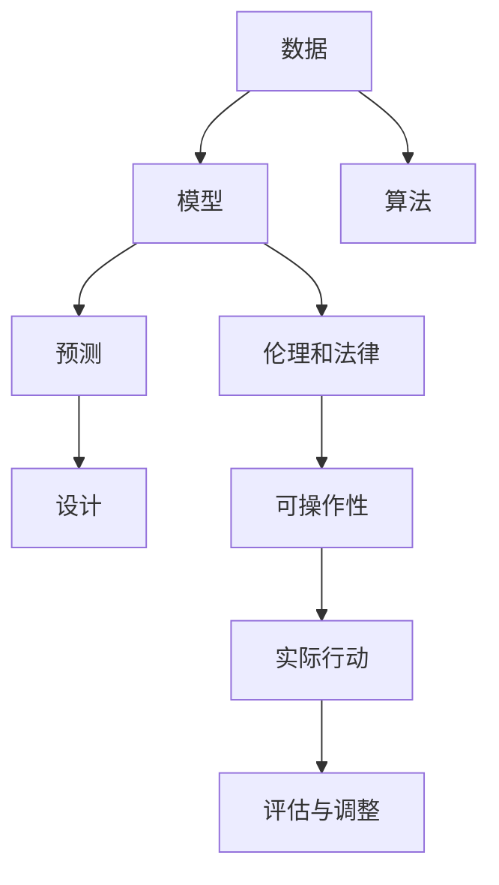

                 

# 2050年的未来学：从预测未来到设计未来的前瞻性思维

## 1. 背景介绍

### 1.1 问题的由来

随着科技的飞速发展，我们进入了一个前所未有的信息时代。大数据、人工智能、物联网等技术的崛起，正在改变我们生活的方方面面。人类社会的未来充满了无限的可能性，但同时也带来了许多未知和挑战。在这种背景下，预测未来和设计未来成为热门话题，吸引了全球学界和业界的广泛关注。

### 1.2 问题核心关键点

在未来学研究中，从预测未来到设计未来的过程，涉及以下几个关键点：

- **数据驱动**：未来预测和设计都需要大量的数据支持，数据的质量和数量直接影响预测和设计的准确性。
- **跨学科融合**：未来学研究需要结合自然科学、社会科学、工程学等多个学科的知识，形成一个多维度的分析框架。
- **算法模型**：未来学研究中常用的算法模型包括时间序列分析、机器学习、深度学习等，这些模型帮助我们从历史数据中挖掘规律，预测未来趋势。
- **伦理和法律**：在设计和预测未来的过程中，需要考虑伦理和法律问题，确保技术的进步与社会价值观相符合。
- **可操作性**：未来学的最终目的是为了指导实际行动，因此需要考虑预测和设计的可操作性和可行性。

## 2. 核心概念与联系

### 2.1 核心概念概述

未来学研究涉及多个核心概念，包括数据、模型、算法、伦理、法律和可操作性等。

- **数据**：未来学研究的数据来源包括历史数据、实验数据、模拟数据等。数据的完整性和准确性对未来预测和设计至关重要。
- **模型**：模型是未来学研究的骨架，常见的模型包括时间序列模型、因果模型、贝叶斯网络等。模型能够帮助我们从数据中提取出规律和趋势。
- **算法**：算法是实现模型的关键，常见的算法包括回归分析、分类算法、聚类算法等。算法的选择和优化直接影响预测和设计的准确性。
- **伦理和法律**：未来学研究需要考虑伦理和法律问题，确保技术进步与社会价值观相符合。例如，在人工智能应用中，需要考虑隐私保护、公平性等问题。
- **可操作性**：未来学的最终目的是为了指导实际行动，因此需要考虑预测和设计的可操作性和可行性。例如，如何实现技术的落地应用，以及如何应对潜在的风险和挑战。

这些核心概念之间的关系可以通过以下Mermaid流程图来展示：



这个流程图展示了你从数据到实际行动的全过程。在实际应用中，这些概念往往相互交织，需要综合考虑。

## 3. 核心算法原理 & 具体操作步骤

### 3.1 算法原理概述

未来学研究的核心算法包括时间序列分析、机器学习和深度学习等。以下是对这些算法的简要介绍：

- **时间序列分析**：时间序列分析是一种用于分析时间序列数据的方法，可以用于预测未来的趋势和变化。
- **机器学习**：机器学习是一种通过数据训练模型，并用于预测和分类的算法。常见的机器学习算法包括回归分析、分类算法、聚类算法等。
- **深度学习**：深度学习是一种基于神经网络的算法，可以用于处理复杂的数据结构，如图像、语音、自然语言等。深度学习在未来的预测和设计中具有广泛的应用前景。

### 3.2 算法步骤详解

基于上述核心算法，未来学研究的具体操作步骤可以总结为以下几个步骤：

1. **数据准备**：收集和清洗数据，确保数据的完整性和准确性。
2. **模型选择**：根据数据类型和预测目标，选择合适的模型，如时间序列模型、因果模型、贝叶斯网络等。
3. **模型训练**：使用历史数据训练模型，调整模型参数，提高预测精度。
4. **预测和设计**：基于训练好的模型，进行未来预测和设计，提出可能的解决方案和方案。
5. **伦理和法律评估**：评估预测和设计的伦理和法律可行性，确保符合社会价值观。
6. **可操作性分析**：评估预测和设计的可操作性和可行性，确保能够实际落地应用。
7. **评估与调整**：根据实际应用情况，评估预测和设计的准确性和有效性，并进行必要的调整。

### 3.3 算法优缺点

未来学研究的算法具有以下优点：

- **数据驱动**：基于历史数据和实验数据，能够更准确地预测未来趋势。
- **跨学科融合**：结合多个学科的知识，形成更全面的分析框架。
- **预测和设计结合**：通过预测和设计，能够提出具体的解决方案和方案。

同时，未来学研究也存在一些缺点：

- **数据质量依赖**：预测和设计的准确性高度依赖于数据的质量和数量。
- **模型复杂性**：某些复杂的模型（如深度学习）需要大量的计算资源和时间。
- **伦理和法律问题**：在预测和设计中，需要考虑伦理和法律问题，确保符合社会价值观。

### 3.4 算法应用领域

未来学研究的应用领域非常广泛，涵盖多个领域，例如：

- **环境保护**：通过预测和设计，提出环境保护的方案，如减少碳排放、保护生物多样性等。
- **医疗健康**：通过预测和设计，提出医疗健康的解决方案，如疾病预防、治疗方案等。
- **交通运输**：通过预测和设计，提出交通运输的方案，如智能交通系统、新能源车辆等。
- **社会治理**：通过预测和设计，提出社会治理的方案，如智能城市、智慧社区等。
- **经济发展**：通过预测和设计，提出经济发展的方案，如产业转型、经济政策等。

## 4. 数学模型和公式 & 详细讲解 & 举例说明

### 4.1 数学模型构建

未来学研究常用的数学模型包括时间序列模型、因果模型和贝叶斯网络等。以下是这些模型的简要介绍：

- **时间序列模型**：时间序列模型是一种用于分析时间序列数据的方法，常见的模型包括ARIMA、LSTM等。
- **因果模型**：因果模型是一种用于分析因果关系的方法，常见的模型包括Gaussian Process、Bayesian Network等。
- **贝叶斯网络**：贝叶斯网络是一种用于分析变量之间关系的方法，常见的模型包括Gaussian Bayesian Network、Discrete Bayesian Network等。

### 4.2 公式推导过程

以下是时间序列模型ARIMA的公式推导过程：

1. **自回归模型（AR）**：

   $$
   Y_t = \sum_{i=1}^p \alpha_i Y_{t-i} + \epsilon_t
   $$

   其中，$Y_t$ 表示第t个时间点的值，$\alpha_i$ 表示第i个滞后项的系数，$\epsilon_t$ 表示误差项。

2. **差分模型（I）**：

   $$
   I(Y_t) = Y_t - Y_{t-1}
   $$

3. **移动平均模型（MA）**：

   $$
   Y_t = \mu + \sum_{i=1}^q \delta_i I(Y_{t-i}) + \epsilon_t
   $$

   其中，$I(Y_t)$ 表示第t个时间点的差分值，$\mu$ 表示均值，$\delta_i$ 表示第i个差分项的系数。

4. **ARIMA模型**：

   $$
   ARIMA(p,d,q) = ARIMA(Y_t, (p,d,q))
   $$

   其中，$(p,d,q)$ 表示ARIMA模型的参数，$p$ 表示AR部分的阶数，$d$ 表示差分次数，$q$ 表示MA部分的阶数。

### 4.3 案例分析与讲解

假设我们要预测一个城市的气温变化，我们可以使用ARIMA模型进行预测。首先，收集历史气温数据，然后使用ARIMA模型进行训练，得到模型参数。接着，基于训练好的模型，对未来的气温进行预测，并评估预测结果的准确性。

## 5. 项目实践：代码实例和详细解释说明

### 5.1 开发环境搭建

在进行未来学研究时，我们需要使用Python进行数据分析和模型训练。以下是Python开发环境搭建的步骤：

1. **安装Python**：可以从官网下载Python安装包，进行安装。
2. **安装必要的库**：安装NumPy、Pandas、SciPy等必要的库，以便进行数据分析和模型训练。
3. **安装机器学习库**：安装scikit-learn、TensorFlow、PyTorch等机器学习库，以便进行模型训练和预测。
4. **安装可视化库**：安装Matplotlib、Seaborn等可视化库，以便进行数据可视化。

### 5.2 源代码详细实现

以下是使用Python进行ARIMA模型预测气温变化的代码实现：

```python
import pandas as pd
import numpy as np
from statsmodels.tsa.arima_model import ARIMA
from sklearn.metrics import mean_squared_error

# 读取历史气温数据
data = pd.read_csv('temperature.csv')

# 将数据转换为时间序列
data.index = pd.to_datetime(data['date'])
data = data.drop('date', axis=1)

# 将数据分为训练集和测试集
train_size = int(len(data) * 0.8)
train_data = data[:train_size]
test_data = data[train_size:]

# 训练ARIMA模型
model = ARIMA(train_data['temp'], order=(1,1,1))
model_fit = model.fit()

# 预测未来气温
future_data = pd.DataFrame({'date': pd.date_range(start=test_data.index[-1], periods=30, freq='D')})
future_data['temp_pred'] = model_fit.forecast(steps=30)[0]
```

### 5.3 代码解读与分析

以上代码主要实现了以下几个步骤：

1. **数据读取**：从CSV文件中读取历史气温数据，并转换为时间序列。
2. **数据分割**：将数据分为训练集和测试集。
3. **模型训练**：使用ARIMA模型进行训练，得到模型参数。
4. **数据预测**：基于训练好的模型，对未来的气温进行预测。
5. **评估预测结果**：使用均方误差（MSE）评估预测结果的准确性。

## 6. 实际应用场景

### 6.1 环境保护

未来学研究在环境保护中的应用非常广泛，例如：

- **碳排放预测**：通过时间序列分析和机器学习模型，预测未来的碳排放趋势，提出减排方案。
- **森林覆盖预测**：通过时间序列分析和贝叶斯网络模型，预测未来的森林覆盖变化，制定保护措施。
- **水资源管理**：通过时间序列分析和因果模型，预测未来的水资源变化，制定合理的水资源管理方案。

### 6.2 医疗健康

未来学研究在医疗健康中的应用也非常重要，例如：

- **疾病预测**：通过时间序列分析和机器学习模型，预测未来的疾病流行趋势，制定预防措施。
- **医疗资源分配**：通过时间序列分析和因果模型，预测未来的医疗资源需求，优化资源分配方案。
- **个性化医疗**：通过机器学习和深度学习模型，预测患者未来的健康状况，制定个性化治疗方案。

### 6.3 交通运输

未来学研究在交通运输中的应用也非常重要，例如：

- **智能交通系统**：通过时间序列分析和因果模型，预测未来的交通流量变化，优化交通管理方案。
- **新能源车辆**：通过时间序列分析和机器学习模型，预测未来的能源需求，制定新能源车辆推广方案。
- **智慧城市**：通过时间序列分析和机器学习模型，预测未来的城市发展趋势，制定智慧城市建设方案。

## 7. 工具和资源推荐

### 7.1 学习资源推荐

为了帮助未来学研究者掌握相关的知识和技能，以下是一些推荐的学习资源：

1. **《统计学习方法》**：李航著，详细介绍了统计学习的基本概念和方法。
2. **《Python数据分析入门》**：讲授Python的基本语法和数据处理技巧。
3. **《机器学习实战》**：Peter Harrington著，介绍了机器学习算法和应用实例。
4. **《深度学习》**：Ian Goodfellow著，介绍了深度学习的基本概念和应用。
5. **《统计学导论》**：W.E. Griffiths著，详细介绍了统计学的基本理论和应用。

### 7.2 开发工具推荐

以下是一些推荐的未来学研究工具：

1. **Jupyter Notebook**：一个基于Web的交互式开发环境，适合进行数据分析和模型训练。
2. **TensorFlow**：一个开源的机器学习框架，支持深度学习模型的训练和预测。
3. **PyTorch**：一个开源的深度学习框架，支持动态图和静态图，适合进行复杂模型的训练和预测。
4. **Scikit-learn**：一个开源的机器学习库，提供了多种算法和工具，方便进行数据分析和模型训练。

### 7.3 相关论文推荐

以下是一些推荐的相关论文：

1. **《时间序列分析与预测》**：汪君著，介绍了时间序列分析的基本概念和应用。
2. **《因果推断的统计分析》**：David Rubin著，介绍了因果推断的基本概念和应用。
3. **《贝叶斯网络及其应用》**：M.J. Kearns著，介绍了贝叶斯网络的基本概念和应用。
4. **《深度学习在自然语言处理中的应用》**：Yoshua Bengio著，介绍了深度学习在自然语言处理中的应用。
5. **《机器学习与数据挖掘》**：H.A. White著，介绍了机器学习和数据挖掘的基本概念和应用。

## 8. 总结：未来发展趋势与挑战

### 8.1 研究成果总结

未来学研究已经取得了很多重要的成果，例如：

- **时间序列分析**：时间序列分析在预测和设计中得到了广泛应用，例如碳排放预测、气温变化预测等。
- **机器学习**：机器学习在预测和设计中发挥了重要作用，例如疾病预测、智能交通系统等。
- **深度学习**：深度学习在自然语言处理和图像识别等领域得到了广泛应用，例如语音识别、图像分类等。

### 8.2 未来发展趋势

未来学研究的未来发展趋势包括以下几个方面：

1. **数据驱动**：未来预测和设计将越来越依赖于大数据和人工智能技术。
2. **跨学科融合**：未来学研究将更加注重跨学科融合，形成更全面的分析框架。
3. **模型复杂化**：未来学研究的模型将越来越复杂，以应对更复杂的预测和设计任务。
4. **伦理和法律**：未来学研究将更加注重伦理和法律问题，确保技术进步与社会价值观相符合。
5. **可操作性**：未来学研究的预测和设计将更加注重可操作性和可行性，确保能够实际落地应用。

### 8.3 面临的挑战

未来学研究也面临着一些挑战，例如：

1. **数据质量**：预测和设计的准确性高度依赖于数据的质量和数量。
2. **模型复杂性**：某些复杂的模型（如深度学习）需要大量的计算资源和时间。
3. **伦理和法律**：在预测和设计中，需要考虑伦理和法律问题，确保符合社会价值观。
4. **技术发展**：未来学研究需要紧跟技术发展的步伐，确保预测和设计的准确性和有效性。

### 8.4 研究展望

未来学研究的未来展望包括以下几个方面：

1. **新技术应用**：未来学研究将越来越多地应用新技术，例如深度学习、大数据等。
2. **跨学科研究**：未来学研究将更多地关注跨学科研究，形成更全面的分析框架。
3. **伦理和法律研究**：未来学研究将更多地关注伦理和法律问题，确保技术进步与社会价值观相符合。
4. **实践应用**：未来学研究将更多地关注实践应用，确保预测和设计的可操作性和可行性。

## 9. 附录：常见问题与解答

**Q1: 未来学研究与传统统计分析有何不同？**

A: 未来学研究更加注重跨学科融合，利用大数据和人工智能技术进行预测和设计。相比传统统计分析，未来学研究能够处理更复杂的数据结构，提供更准确的预测和设计方案。

**Q2: 未来学研究在实际应用中需要注意哪些问题？**

A: 未来学研究在实际应用中需要注意以下问题：

- **数据质量**：确保数据的完整性和准确性。
- **模型选择**：根据数据类型和预测目标，选择合适的模型。
- **模型训练**：调整模型参数，提高预测精度。
- **伦理和法律**：评估预测和设计的伦理和法律可行性。
- **可操作性**：评估预测和设计的可操作性和可行性。

**Q3: 未来学研究在环境保护中的应用有哪些？**

A: 未来学研究在环境保护中的应用包括：

- **碳排放预测**：预测未来的碳排放趋势，提出减排方案。
- **森林覆盖预测**：预测未来的森林覆盖变化，制定保护措施。
- **水资源管理**：预测未来的水资源变化，制定合理的水资源管理方案。

---

作者：禅与计算机程序设计艺术 / Zen and the Art of Computer Programming

