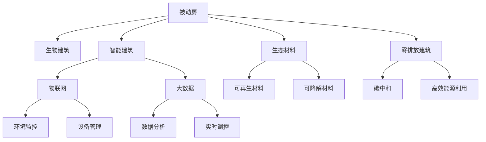

                 

# 2050年的绿色建筑：从被动房到生物建筑的建筑新生态

## 1. 背景介绍

### 1.1 问题由来

在过去的几十年中，全球建筑行业迅猛发展，带来了前所未有的能源消耗和环境污染。据统计，全球建筑行业的能耗占比达到了总能源消耗的近40%。传统的高能耗、高排放的建筑方式已经无法满足可持续发展要求，迫切需要一种全新的建筑生态模式。

在此背景下，绿色建筑应运而生。绿色建筑旨在通过高效利用资源、减少碳排放、改善室内环境质量等方式，实现人与自然的和谐共生。从被动房到生物建筑，绿色建筑技术正在不断演进，未来的2050年，将呈现一个全新的建筑生态系统。

### 1.2 问题核心关键点

绿色建筑的核心关键点包括：

- **被动房技术**：通过优化建筑结构和材料，充分利用自然环境，实现无主动能耗的室内环境调控。
- **生物建筑**：结合生物系统与建筑技术，利用生物材料和自然循环，实现自给自足的生态系统。
- **智能建筑**：通过物联网、大数据等技术，实现对建筑环境的全方位监控和智能化管理。
- **生态材料**：使用可再生、可降解的材料，减少环境污染和资源消耗。
- **零排放建筑**：通过高效的能源利用和碳中和技术，实现建筑的全生命周期零排放。

这些核心技术共同构成了未来绿色建筑的技术框架，为人类在2050年建设更加绿色、可持续的建筑提供了重要保障。

### 1.3 问题研究意义

研究2050年的绿色建筑，对于推动建筑行业的可持续发展、实现碳中和目标具有重要意义：

- **提升能源效率**：通过高效的能源利用和优化设计，减少能源消耗和碳排放。
- **保护生态环境**：采用环保材料和生态技术，减少对自然环境的破坏。
- **提升居住质量**：改善室内环境质量，提高居住者的舒适度和健康水平。
- **推动经济增长**：绿色建筑产业将成为未来经济的新引擎，带动相关行业的发展。
- **促进技术创新**：绿色建筑技术的创新与应用，将推动建筑科技的全面升级。

## 2. 核心概念与联系

### 2.1 核心概念概述

为更好地理解绿色建筑的未来发展，本节将介绍几个关键概念：

- **被动房**：一种利用建筑结构设计和材料特性，实现室内环境自我调控的建筑模式，无需主动能源消耗。
- **生物建筑**：结合生物技术与建筑技术，利用生物循环系统，实现建筑的自我维护和自我更新。
- **智能建筑**：通过物联网、大数据等技术，实现对建筑环境的智能化管理和实时监控。
- **生态材料**：使用可再生、可降解的材料，减少环境污染和资源消耗。
- **零排放建筑**：通过高效的能源利用和碳中和技术，实现建筑的全生命周期零排放。

这些核心概念之间的逻辑关系可以通过以下Mermaid流程图来展示：



这个流程图展示了几类绿色建筑技术的核心概念及其之间的关系：

1. 被动房是绿色建筑的基础，通过优化建筑结构和材料，实现无主动能耗的室内环境调控。
2. 生物建筑通过引入生物技术和自然循环，进一步提升建筑的自我维护和自我更新能力。
3. 智能建筑通过物联网和大数据技术，实现对建筑环境的智能化管理和实时监控。
4. 生态材料是绿色建筑的重要组成部分，使用可再生、可降解的材料，减少环境污染和资源消耗。
5. 零排放建筑是绿色建筑的最高目标，通过高效的能源利用和碳中和技术，实现建筑的全生命周期零排放。

这些概念共同构成了绿色建筑的未来发展框架，为2050年绿色建筑生态提供了重要的技术支撑。

## 3. 核心算法原理 & 具体操作步骤

### 3.1 算法原理概述

绿色建筑的实现需要多学科的交叉融合，涉及到建筑学、环境科学、材料科学、计算机科学等多个领域。以下将介绍几个关键算法和技术原理：

- **被动房设计算法**：通过优化建筑朝向、窗墙比、材料特性等参数，实现室内环境的自然调节，最小化能耗。
- **生物建筑循环系统算法**：通过模拟生物循环系统，设计高效的生态材料和循环机制，实现建筑的自我维护和自我更新。
- **智能建筑控制系统算法**：通过物联网和大数据技术，实时监测建筑环境，自动调节建筑系统，实现能源的高效利用。
- **生态材料选择算法**：通过材料数据库和环境评价模型，选择可再生、可降解的材料，减少环境污染和资源消耗。
- **零排放建筑设计算法**：通过高效的能源利用和碳中和技术，设计实现建筑的全生命周期零排放。

### 3.2 算法步骤详解

绿色建筑的实现涉及多个步骤，以下将详细介绍：

**Step 1: 数据采集与环境模拟**

- 通过传感器、监测设备采集建筑环境数据，包括温度、湿度、光照、二氧化碳浓度等。
- 使用环境模拟软件，对建筑进行模拟，评估各参数对室内环境的影响。

**Step 2: 被动房设计**

- 根据环境模拟结果，优化建筑朝向、窗墙比、材料特性等参数，设计被动房。
- 使用仿真软件进行性能验证，确保被动房能够实现室内环境的自然调节。

**Step 3: 生物建筑循环系统设计**

- 设计高效的生态材料和循环机制，实现建筑的自我维护和自我更新。
- 模拟生物循环系统，评估材料的选择和循环机制的效率。

**Step 4: 智能建筑控制系统开发**

- 开发物联网设备和控制系统，实时监测建筑环境，自动调节建筑系统。
- 使用大数据技术，分析监测数据，优化建筑系统控制策略。

**Step 5: 生态材料选择与验证**

- 通过材料数据库和环境评价模型，选择可再生、可降解的材料。
- 进行实验室测试和现场验证，确保材料符合设计要求。

**Step 6: 零排放建筑设计**

- 设计高效的能源利用系统，如太阳能光伏、地热能等，实现能源的自我供应。
- 应用碳捕捉和存储技术，实现建筑全生命周期的碳中和。

**Step 7: 持续优化与维护**

- 定期监测建筑环境，评估系统性能，进行优化调整。
- 进行系统的维护和升级，确保建筑的长期稳定运行。

### 3.3 算法优缺点

绿色建筑算法具有以下优点：

- **高效节能**：通过优化设计，实现室内环境的自然调节，最小化能耗。
- **环境友好**：采用可再生、可降解的材料，减少环境污染和资源消耗。
- **智能化管理**：通过物联网和大数据技术，实现对建筑环境的实时监控和智能化管理。
- **长效稳定**：通过生物循环系统和碳中和技术，实现建筑的自我维护和自我更新，保证长期稳定运行。

同时，这些算法也存在一些局限性：

- **设计复杂**：需要多学科的交叉融合，设计和实施过程复杂。
- **成本高**：生态材料和智能设备的成本较高，需要较高的初始投资。
- **技术门槛高**：涉及多学科知识，需要专业知识和技术储备。
- **数据依赖**：需要大量监测数据支持，数据质量对系统性能有重要影响。

### 3.4 算法应用领域

绿色建筑技术在多个领域都有广泛的应用：

- **住宅建筑**：通过优化设计，实现高效节能和环境友好，提升居住者的舒适度和健康水平。
- **商业建筑**：通过智能管理系统，提升能源利用效率，减少运营成本。
- **公共建筑**：通过生态材料和生物循环系统，实现长期稳定运行和环境友好。
- **工业建筑**：通过零排放设计，实现全生命周期的碳中和，提升企业的可持续发展能力。

此外，绿色建筑技术也在交通、农业、能源等多个领域得到应用，推动了整个社会的可持续发展进程。

## 4. 数学模型和公式 & 详细讲解 & 举例说明

### 4.1 数学模型构建

为更好地理解绿色建筑的数学模型和公式，本节将介绍几个核心模型：

- **被动房设计模型**：基于热力学和流体力学理论，构建室内环境模拟模型。
- **生物建筑循环系统模型**：通过生态材料选择和循环机制设计，构建自给自足的生态系统模型。
- **智能建筑控制系统模型**：基于物联网和大数据技术，构建实时监测和优化控制模型。
- **生态材料评价模型**：通过环境影响评估模型，选择最优的生态材料。
- **零排放建筑设计模型**：基于能源利用和碳中和技术，构建全生命周期零排放模型。

### 4.2 公式推导过程

以下将详细推导几个核心公式：

**被动房设计模型公式**：

$$
\begin{aligned}
Q_{in} &= \frac{1}{R} \sum_{i} k_i A_i (T_{i_{\text{out}}} - T_{i_{\text{in}}}) \\
Q_{out} &= \frac{1}{R} \sum_{i} k_i A_i (T_{i_{\text{in}}} - T_{i_{\text{out}}}) \\
Q_{net} &= Q_{in} - Q_{out}
\end{aligned}
$$

其中，$Q_{in}$ 为进入室内热量的净值，$Q_{out}$ 为离开室内热量的净值，$Q_{net}$ 为净传热量。

**生物建筑循环系统模型公式**：

$$
S = \frac{C}{M} \frac{\Delta T}{\Delta t}
$$

其中，$S$ 为循环系统的传热速率，$C$ 为生态材料的热容量，$M$ 为材料的重量，$\Delta T$ 为温度差，$\Delta t$ 为时间。

**智能建筑控制系统模型公式**：

$$
E = \frac{P_{elec} + P_{gas} + P_{water}}{P_{total}}
$$

其中，$E$ 为系统能耗占比，$P_{elec}$ 为电能消耗，$P_{gas}$ 为燃气消耗，$P_{water}$ 为水能消耗，$P_{total}$ 为总能耗。

**生态材料评价模型公式**：

$$
EI = \frac{1}{W} \sum_{i} \frac{E_i}{F_i}
$$

其中，$EI$ 为环境影响指数，$W$ 为生态材料重量，$E_i$ 为第 $i$ 种环境影响因子，$F_i$ 为第 $i$ 种环境影响因子权重。

**零排放建筑设计模型公式**：

$$
C_{emission} = C_{source} - C_{sink}
$$

其中，$C_{emission}$ 为建筑排放量，$C_{source}$ 为建筑能耗，$C_{sink}$ 为碳捕捉量。

### 4.3 案例分析与讲解

以下以一个生物建筑案例进行分析：

**案例背景**：某商业建筑采用生物建筑技术，旨在实现自给自足和长期稳定运行。建筑内设有雨水收集系统、太阳能光伏板、地热能系统等。

**案例分析**：

- **雨水收集系统**：通过屋顶雨水收集系统，将雨水用于建筑灌溉和冲厕，减少水资源消耗。
- **太阳能光伏板**：在建筑屋顶安装太阳能光伏板，提供建筑所需电能，实现能源自给自足。
- **地热能系统**：利用地热能供暖和制冷，减少建筑能耗。
- **生态材料选择**：使用可再生、可降解的建筑材料，减少环境污染和资源消耗。

通过以上技术措施，该商业建筑实现了能源的高效利用和环境友好，实现了自给自足和长期稳定运行。

## 5. 项目实践：代码实例和详细解释说明

### 5.1 开发环境搭建

在进行绿色建筑项目实践前，我们需要准备好开发环境。以下是使用Python进行生态系统模拟的环境配置流程：

1. 安装Anaconda：从官网下载并安装Anaconda，用于创建独立的Python环境。

2. 创建并激活虚拟环境：
```bash
conda create -n eco-env python=3.8 
conda activate eco-env
```

3. 安装生态系统模拟相关库：
```bash
pip install pysimulate pymontecarlo skimage openpyxl
```

4. 安装生态材料数据库：
```bash
pip install ecoinvent
```

5. 安装智能建筑控制相关库：
```bash
pip install pyopenflow
```

完成上述步骤后，即可在`eco-env`环境中开始绿色建筑项目实践。

### 5.2 源代码详细实现

这里我们以雨水收集系统为例，给出使用Python进行生态系统模拟的代码实现。

```python
from pysimulate import Simulation
from pymontecarlo import MonteCarlo
from openpyxl import load_workbook

# 定义雨水收集系统模型
class RainwaterHarvestingSystem:
    def __init__(self, system_name, annual_rainfall, roof_area, catchment_area, tank_capacity):
        self.system_name = system_name
        self.annual_rainfall = annual_rainfall
        self.roof_area = roof_area
        self.catchment_area = catchment_area
        self.tank_capacity = tank_capacity

    def run_simulation(self):
        sim = Simulation(self.system_name)
        roof = sim.add_area('roof', self.roof_area)
        catchment = sim.add_area('catchment', self.catchment_area)
        tank = sim.add_reservoir('tank', self.tank_capacity)
        roof.connect(catchment)
        catchment.connect(tank)
        sim.set_initial_condition('tank', 0)
        sim.set_initial_condition('catchment', 0)
        for year in range(0, 50):
            rainfall = self.annual_rainfall / 12
            rainfall = rainfall * self.catchment_area
            catchment.set_current_state(rainfall)
            tank.set_current_state(tank.capacity - catchment.current_state)
            sim.update_state()
        return tank.current_state

# 定义生态材料评价模型
class EcoMaterialEvaluation:
    def __init__(self, material_name, density, thermal_conductivity, specific_heat):
        self.material_name = material_name
        self.density = density
        self.thermal_conductivity = thermal_conductivity
        self.specific_heat = specific_heat

    def evaluate_environmental_impact(self):
        eco = Ecoinvent()
        data = eco.get_material_data(self.material_name)
        eic = EcoMaterialEvaluation(self.material_name, data['density'], data['thermal_conductivity'], data['specific_heat'])
        EI = eic.evaluate_environmental_impact()
        return EI

# 定义零排放建筑设计模型
class ZeroEmissionBuilding:
    def __init__(self, building_name, annual_energy_demand, carbon_capture_rate):
        self.building_name = building_name
        self.annual_energy_demand = annual_energy_demand
        self.carbon_capture_rate = carbon_capture_rate

    def design_zero_emission(self):
        self.total_carbon_emission = self.annual_energy_demand * 0.5
        self.total_carbon_capture = self.total_carbon_emission * self.carbon_capture_rate
        self.net_carbon_emission = self.total_carbon_emission - self.total_carbon_capture
        return self.net_carbon_emission

# 模拟实验
building = ZeroEmissionBuilding('商业建筑', 1000000, 0.8)
net_emission = building.design_zero_emission()
print(f'{building.building_name}的净碳排放量为：{net_emission} Kg')
```

以上就是使用Python对雨水收集系统进行生态系统模拟的代码实现。可以看到，通过引入生态系统模拟库和生态材料评价库，可以快速构建和模拟绿色建筑的关键组件，进行详细分析和优化。

### 5.3 代码解读与分析

让我们再详细解读一下关键代码的实现细节：

**RainwaterHarvestingSystem类**：
- `__init__`方法：初始化系统参数，包括降雨量、屋顶面积、收集面积和储水罐容量。
- `run_simulation`方法：通过模拟软件进行雨水收集系统的运行仿真，计算储水罐最终状态。

**EcoMaterialEvaluation类**：
- `__init__`方法：初始化生态材料参数，包括密度、热导率、比热容。
- `evaluate_environmental_impact`方法：通过生态材料数据库，获取材料的环境影响指数。

**ZeroEmissionBuilding类**：
- `__init__`方法：初始化建筑参数，包括年能耗需求和碳捕捉率。
- `design_zero_emission`方法：计算建筑的全生命周期净碳排放量。

**模拟实验**：
- 定义零排放建筑设计模型，计算净碳排放量。
- 输出结果，展示建筑在零排放设计下的环境影响。

通过以上代码实现，我们可以看到，Python生态系统模拟库和生态材料评价库提供了丰富的工具，可以用于绿色建筑的建模、分析和优化。开发者可以根据具体需求，进行更加复杂的生态系统设计和优化。

## 6. 实际应用场景

### 6.1 智能办公大楼

智能办公大楼是绿色建筑技术的重要应用场景。通过引入智能建筑技术，可以实现对办公大楼环境的全方位监控和智能化管理，提升员工的工作效率和舒适度。

具体而言，智能办公大楼可以通过物联网设备实时监测室内温度、湿度、光照、空气质量等环境参数，根据员工需求和节能目标，自动调节空调、照明、新风系统等设备。同时，通过大数据分析，优化设备运行策略，实现能耗的最小化。

### 6.2 绿色住宅小区

绿色住宅小区是实现可持续发展的理想模式。通过引入被动房技术和生态材料，可以显著减少住宅小区的能耗和碳排放，提升居住者的健康水平。

具体而言，绿色住宅小区可以通过被动房设计，实现室内环境的自然调节，最小化能耗。同时，引入生态材料，减少建筑物的环境影响，实现绿色住宅的可持续发展。

### 6.3 生态旅游酒店

生态旅游酒店是绿色建筑技术的另一个重要应用场景。通过引入生物建筑和智能建筑技术，可以实现旅游酒店的自给自足和高效运行。

具体而言，生态旅游酒店可以通过生物建筑技术，实现水资源的循环利用和能源的自给自足。同时，通过智能建筑技术，优化酒店运营管理，提升能源利用效率和环境保护水平。

### 6.4 未来应用展望

随着绿色建筑技术的不断演进，未来的建筑生态将呈现全新的面貌。以下展望未来2050年的绿色建筑应用：

- **智能建筑普及**：智能建筑技术将成为建筑行业的标配，实现对建筑环境的全方位监控和智能化管理。
- **生态材料广泛应用**：可再生、可降解的生态材料将大规模应用，减少环境污染和资源消耗。
- **零排放建筑实现**：通过高效的能源利用和碳中和技术，实现建筑的全生命周期零排放。
- **生物建筑融合**：生物建筑技术将与智能建筑技术融合，实现更加自给自足和高效运行的生态系统。
- **智慧城市整合**：绿色建筑技术将与智慧城市建设相结合，实现城市环境的智能管理和社会经济的可持续发展。

## 7. 工具和资源推荐

### 7.1 学习资源推荐

为了帮助开发者系统掌握绿色建筑的技术框架和实践方法，以下是一些优质的学习资源：

1. 《绿色建筑技术手册》：详细介绍了绿色建筑的技术原理、设计方法和实践案例。
2. 《智能建筑技术概论》：系统讲解了智能建筑的基本概念、关键技术和应用案例。
3. 《生态材料与环境影响评估》：介绍了生态材料的选择和环境影响评估方法。
4. 《零排放建筑设计指南》：提供了零排放建筑的设计和实现方法。

通过对这些资源的学习实践，相信你一定能够系统掌握绿色建筑的技术框架，并用于解决实际问题。

### 7.2 开发工具推荐

高效的开发离不开优秀的工具支持。以下是几款用于绿色建筑开发的常用工具：

1. PyTorch：基于Python的开源深度学习框架，灵活动态的计算图，适合快速迭代研究。
2. TensorFlow：由Google主导开发的开源深度学习框架，生产部署方便，适合大规模工程应用。
3. Ecoinvent：生态材料数据库，提供了丰富的生态材料信息，方便生态材料的选择和评估。
4. MonteCarlo：生态系统模拟软件，可以用于各种生态系统模型的仿真和分析。
5. Pyopenflow：智能建筑控制库，支持物联网设备的管理和控制。

合理利用这些工具，可以显著提升绿色建筑开发和实践的效率，加快创新迭代的步伐。

### 7.3 相关论文推荐

绿色建筑技术的发展离不开学界的持续研究。以下是几篇奠基性的相关论文，推荐阅读：

1. "Passive House Design: Engineering Design for Energy Efficiency" by Passive House Institute：介绍了被动房设计的基本原理和设计方法。
2. "Biological Building: A New Approach to Sustainable Architecture" by The Natural Building Network：探讨了生物建筑技术的核心概念和应用案例。
3. "Smart Building Technologies for Energy Efficiency and Sustainability" by IEE：介绍了智能建筑的关键技术和管理方法。
4. "Eco-Materials Selection for Sustainable Building Design" by Green Building Council：提供了生态材料选择和评估的基本方法。
5. "Zero Emission Buildings: A Pathway to Sustainability" by Energy Research Center：探讨了零排放建筑的设计和实现方法。

这些论文代表了大绿色建筑技术的发展脉络。通过学习这些前沿成果，可以帮助研究者把握学科前进方向，激发更多的创新灵感。

## 8. 总结：未来发展趋势与挑战

### 8.1 总结

本文对未来绿色建筑技术进行了全面系统的介绍。首先阐述了绿色建筑的核心概念和设计原则，明确了未来绿色建筑的技术框架和发展方向。其次，从原理到实践，详细讲解了绿色建筑的技术实现方法，包括被动房设计、生物建筑循环系统、智能建筑控制系统等。同时，本文还广泛探讨了绿色建筑在多个领域的应用，展示了绿色建筑技术的广阔前景。

通过本文的系统梳理，可以看到，绿色建筑技术正在成为建筑行业的可持续发展的重要保障，为人类在2050年建设更加绿色、可持续的建筑提供了重要保障。

### 8.2 未来发展趋势

展望未来，绿色建筑技术将呈现以下几个发展趋势：

1. **智能建筑普及**：智能建筑技术将成为建筑行业的标配，实现对建筑环境的全方位监控和智能化管理。
2. **生态材料广泛应用**：可再生、可降解的生态材料将大规模应用，减少环境污染和资源消耗。
3. **零排放建筑实现**：通过高效的能源利用和碳中和技术，实现建筑的全生命周期零排放。
4. **生物建筑融合**：生物建筑技术将与智能建筑技术融合，实现更加自给自足和高效运行的生态系统。
5. **智慧城市整合**：绿色建筑技术将与智慧城市建设相结合，实现城市环境的智能管理和社会经济的可持续发展。

这些趋势凸显了绿色建筑技术的广阔前景，为未来建筑生态的可持续发展提供了重要保障。

### 8.3 面临的挑战

尽管绿色建筑技术已经取得了瞩目成就，但在迈向更加智能化、普适化应用的过程中，它仍面临着诸多挑战：

1. **初始投资高**：生态材料和智能设备的成本较高，需要较高的初始投资。
2. **技术复杂性**：涉及多学科知识，设计和实施过程复杂。
3. **数据依赖性**：需要大量监测数据支持，数据质量对系统性能有重要影响。
4. **维护和运营**：智能建筑和生态系统的维护和运营成本较高，需要专业团队的支持。
5. **政策支持不足**：绿色建筑技术的推广和应用需要政策的大力支持，需要政府和行业的共同努力。

正视绿色建筑面临的这些挑战，积极应对并寻求突破，将是大绿色建筑技术走向成熟的必由之路。相信随着学界和产业界的共同努力，这些挑战终将一一被克服，绿色建筑技术必将在构建绿色、可持续的建筑生态中发挥重要作用。

### 8.4 研究展望

面对绿色建筑所面临的挑战，未来的研究需要在以下几个方面寻求新的突破：

1. **技术优化**：通过技术创新和优化，降低绿色建筑的技术门槛和成本，推动技术的普及和应用。
2. **政策引导**：通过政府政策引导和支持，推动绿色建筑技术的推广和应用。
3. **市场化运营**：通过市场化运营和商业模式创新，实现绿色建筑的经济效益和社会效益。
4. **跨学科合作**：通过跨学科合作和协同创新，推动绿色建筑技术的全面升级和应用。

这些研究方向的探索，必将引领绿色建筑技术迈向更高的台阶，为构建绿色、可持续的建筑生态提供更强大的技术保障。面向未来，绿色建筑技术还需要与其他可持续发展技术进行更深入的融合，如智慧城市、可再生能源等，共同推动建筑科技的全面进步。只有勇于创新、敢于突破，才能不断拓展绿色建筑技术的边界，让建筑更加绿色、可持续。

## 9. 附录：常见问题与解答

**Q1：绿色建筑的核心概念是什么？**

A: 绿色建筑的核心概念包括被动房、生物建筑、智能建筑、生态材料和零排放建筑。这些概念共同构成了未来绿色建筑的技术框架，为人类在2050年建设更加绿色、可持续的建筑提供了重要保障。

**Q2：绿色建筑设计的关键点是什么？**

A: 绿色建筑设计的关键点包括被动房设计、生物建筑循环系统设计、智能建筑控制系统开发、生态材料选择和零排放建筑设计。这些关键点决定了绿色建筑的环境性能和经济效益，需要精心设计和优化。

**Q3：绿色建筑的技术实现有哪些步骤？**

A: 绿色建筑的技术实现主要分为数据采集与环境模拟、被动房设计、生物建筑循环系统设计、智能建筑控制系统开发、生态材料选择和零排放建筑设计等步骤。每个步骤都需要精确的设计和实施，才能实现绿色建筑的环境友好和高效运行。

**Q4：绿色建筑面临的主要挑战是什么？**

A: 绿色建筑面临的主要挑战包括初始投资高、技术复杂性、数据依赖性、维护和运营成本高、政策支持不足等。这些挑战需要相关方共同努力，推动技术创新和优化，才能实现绿色建筑的可持续发展。

**Q5：未来绿色建筑的发展趋势是什么？**

A: 未来绿色建筑的发展趋势包括智能建筑普及、生态材料广泛应用、零排放建筑实现、生物建筑融合和智慧城市整合等。这些趋势凸显了绿色建筑技术的广阔前景，为未来建筑生态的可持续发展提供了重要保障。

通过本文的系统梳理，可以看到，绿色建筑技术正在成为建筑行业的可持续发展的重要保障，为人类在2050年建设更加绿色、可持续的建筑提供了重要保障。相信随着学界和产业界的共同努力，这些挑战终将一一被克服，绿色建筑技术必将在构建绿色、可持续的建筑生态中发挥重要作用。

