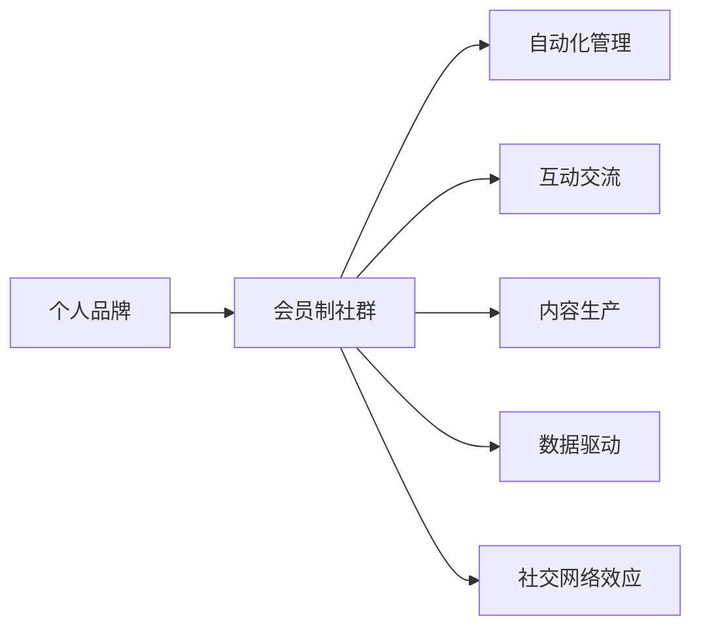

                 

## 1. 背景介绍

在数字化时代，建立一个强大的个人品牌和忠实粉丝群体，已经成为每位专业人士和个人品牌建设者的关键目标。这不仅有助于提升个人影响力，还能通过忠实粉丝的持续关注和支持，推动个人品牌的长期发展。然而，如何在繁忙的工作和生活中，有效地建立和维护一个健康的个人会员制社群，并不容易。本文旨在探讨如何通过技术手段，实现个人会员制社群的自动化管理和运营，同时确保社群内的互动交流健康、高效，以培养忠实粉丝群体。

### 1.1 问题由来

随着社交媒体和在线平台的兴起，人们越来越多地转向网络寻找信息和交流。这为个人品牌和专业人士提供了前所未有的机会，但也带来了新的挑战。如何吸引和维持忠实粉丝的关注，成为一大难题。传统的社交媒体平台虽然提供了广告、内容发布等功能，但对于个人会员制社群的维护和管理，依然依赖于人工操作，耗时耗力且效果有限。

### 1.2 问题核心关键点

建立一个成功的个人会员制社群，需要考虑以下几个核心关键点：

1. **自动化管理**：通过技术手段，实现社群内各种活动的自动化，包括自动发布内容、管理会员信息、收集反馈等。
2. **互动交流**：提供丰富的互动交流功能，包括在线讨论、问答、投票等，促进社群成员之间的积极交流。
3. **内容生产**：产出高质量、有价值的内容，满足会员的需求，并定期更新，保持社群的活跃度。
4. **数据驱动**：通过数据分析，了解会员的兴趣和需求，调整社群运营策略，提升会员满意度。
5. **社交网络效应**：利用社交网络效应，吸引新会员，扩大社群规模。

## 2. 核心概念与联系

### 2.1 核心概念概述

- **个人品牌**：个人在特定领域内建立的独特识别符号和口碑，体现个人的专业知识、价值主张和独特魅力。
- **会员制社群**：基于共同兴趣或目标，通过付费或特定机制筛选和邀请的社群成员组成的社区。
- **自动化管理**：利用技术手段，实现社群活动的自动化，包括内容发布、会员管理、反馈收集等。
- **互动交流**：通过在线讨论、问答、投票等方式，促进社群成员之间的互动和交流。
- **内容生产**：定期产出高质量、有价值的内容，满足社群成员的需求，保持社群活跃度。
- **数据驱动**：通过数据分析，了解社群成员的兴趣和需求，调整社群运营策略，提升会员满意度。
- **社交网络效应**：通过社交网络效应，吸引新成员，扩大社群规模。

### 2.2 核心概念原理和架构的 Mermaid 流程图



这个流程图展示了个人品牌与会员制社群之间的联系，以及社群运营中各个关键环节的相互作用。

## 3. 核心算法原理 & 具体操作步骤

### 3.1 算法原理概述

建立个人会员制社群的核心算法原理主要包括以下几个方面：

1. **内容推荐算法**：通过分析会员的历史行为数据，推荐有价值的内容，提高会员的满意度和活跃度。
2. **会员管理算法**：根据会员的付费情况、互动频率等指标，自动化管理会员信息，提升会员体验。
3. **互动交流算法**：通过在线讨论、问答、投票等功能，促进会员之间的互动，增加社群的凝聚力。
4. **社交网络算法**：利用社交网络效应，吸引新会员，扩大社群规模。

### 3.2 算法步骤详解

#### 3.2.1 内容推荐算法

1. **数据收集**：收集会员的浏览历史、评论记录、互动频率等数据。
2. **数据处理**：对数据进行预处理，包括数据清洗、特征提取等。
3. **模型训练**：选择合适的推荐算法模型，如协同过滤、基于内容的推荐、深度学习推荐等，并使用会员数据进行训练。
4. **内容推荐**：根据训练好的模型，推荐有价值的内容给会员。

#### 3.2.2 会员管理算法

1. **数据收集**：收集会员的付费信息、互动频率、活跃度等数据。
2. **数据处理**：对数据进行预处理，包括数据清洗、特征提取等。
3. **模型训练**：选择合适的会员管理算法模型，如分类模型、回归模型等，并使用会员数据进行训练。
4. **会员管理**：根据训练好的模型，自动化管理会员信息，如会员等级调整、特权分配等。

#### 3.2.3 互动交流算法

1. **功能设计**：设计在线讨论、问答、投票等功能，并确定相应的界面和交互方式。
2. **数据收集**：收集会员的互动数据，包括讨论记录、问答记录、投票结果等。
3. **数据处理**：对数据进行预处理，包括数据清洗、特征提取等。
4. **互动分析**：分析会员的互动数据，了解会员的兴趣和需求。
5. **互动优化**：根据分析结果，优化互动功能的设计和交互方式，提升会员的互动体验。

#### 3.2.4 社交网络算法

1. **数据收集**：收集会员的社交网络数据，如好友关系、互动记录等。
2. **数据处理**：对数据进行预处理，包括数据清洗、特征提取等。
3. **社交网络分析**：使用社交网络分析算法，如中心性分析、社区检测等，了解会员的社交网络结构。
4. **社交网络优化**：根据分析结果，优化社交网络结构，促进会员之间的连接和互动。

### 3.3 算法优缺点

#### 3.3.1 内容推荐算法

**优点**：
- 个性化推荐，满足会员的个性化需求。
- 提高会员的满意度和活跃度。

**缺点**：
- 推荐算法模型复杂，需要大量的数据和计算资源。
- 推荐结果可能存在偏差，影响会员体验。

#### 3.3.2 会员管理算法

**优点**：
- 自动化管理会员信息，提高效率。
- 提升会员体验和满意度。

**缺点**：
- 数据隐私和安全问题需要重视。
- 模型可能会存在偏差，影响会员管理效果。

#### 3.3.3 互动交流算法

**优点**：
- 促进会员之间的互动和交流，增加社群的凝聚力。
- 提供丰富的互动功能，满足会员的多样化需求。

**缺点**：
- 功能设计和实现较为复杂，需要专业开发。
- 互动数据处理和分析需要大量计算资源。

#### 3.3.4 社交网络算法

**优点**：
- 利用社交网络效应，吸引新会员，扩大社群规模。
- 了解会员的社交网络结构，提升社群运营效果。

**缺点**：
- 社交网络数据量大，处理复杂。
- 社交网络分析算法复杂，需要大量的数据和计算资源。

### 3.4 算法应用领域

基于上述算法原理，个人会员制社群可以在多个领域得到应用，包括但不限于：

1. **个人品牌建设**：通过内容推荐、会员管理、互动交流等，提升个人品牌的知名度和影响力。
2. **在线教育**：建立在线学习社群，通过自动化管理和互动交流，提升教学效果和学习体验。
3. **职业发展**：建立职业发展社群，通过内容推荐、会员管理、互动交流等，促进职业发展和学习交流。
4. **健康管理**：建立健康管理社群，通过内容推荐、会员管理、互动交流等，提供健康管理和咨询服务。
5. **兴趣爱好**：建立兴趣爱好社群，通过内容推荐、会员管理、互动交流等，满足会员的多样化需求。

## 4. 数学模型和公式 & 详细讲解 & 举例说明

### 4.1 数学模型构建

假设会员数量为 $N$，历史浏览内容为 $C=\{c_i\}_{i=1}^{N}$，会员的浏览次数为 $T=\{t_i\}_{i=1}^{N}$。内容推荐模型的目标是根据会员的历史浏览行为 $C$ 和浏览次数 $T$，推荐有价值的内容 $R=\{r_i\}_{i=1}^{N}$，满足 $r_i$ 为内容 $c_i$ 推荐概率。

设会员对内容 $c_i$ 的评分向量为 $v_i$，内容 $c_i$ 的评分向量为 $u_i$，推荐概率矩阵为 $P$，则推荐模型可以表示为：

$$
P = \frac{U^TV^T}{U^TV^TV^TV^T+\lambda I}
$$

其中 $U$ 和 $V$ 分别为会员评分矩阵和内容评分矩阵，$\lambda$ 为正则化参数。

### 4.2 公式推导过程

设推荐概率矩阵 $P$ 为 $n$ 阶方阵，则推荐概率向量 $p_i$ 可以表示为：

$$
p_i = Pc_i = \frac{U^TV^TC_i}{U^TV^TV^TV^T+\lambda I}
$$

其中 $C_i$ 为内容 $c_i$ 的特征向量，$I$ 为单位矩阵。

根据上述公式，计算出每个会员对每个内容的推荐概率，选择推荐概率最大的内容 $r_i$ 作为推荐结果。

### 4.3 案例分析与讲解

假设某个人品牌运营者有1000个会员，历史浏览内容为5000篇。通过内容推荐算法，可以计算出每个会员对每篇内容的推荐概率，并选择推荐概率最大的内容作为推荐结果。

以会员 $i$ 为例，假设其历史浏览内容为 $C_i=\{c_1, c_2, c_3\}$，推荐概率矩阵 $P$ 为：

$$
P = \begin{bmatrix}
0.1 & 0.2 & 0.3 \\
0.3 & 0.2 & 0.5 \\
0.4 & 0.3 & 0.3 \\
\end{bmatrix}
$$

会员 $i$ 的推荐概率向量 $p_i$ 为：

$$
p_i = \frac{Pc_i}{U^TV^TV^TV^T+\lambda I} = \begin{bmatrix}
0.02 \\
0.04 \\
0.06 \\
\end{bmatrix}
$$

因此，推荐内容 $r_i$ 为 $c_3$。

## 5. 项目实践：代码实例和详细解释说明

### 5.1 开发环境搭建

为了实现上述算法，我们需要以下开发环境：

1. **Python**：Python 是数据分析和机器学习的首选语言，提供了丰富的数据处理和机器学习库。
2. **NumPy**：用于数值计算和数组操作，是 Python 数据科学生态系统的重要组成部分。
3. **Pandas**：用于数据处理和分析，支持多种数据格式和操作。
4. **Scikit-learn**：提供了多种机器学习算法和工具，包括协同过滤、内容推荐等。
5. **TensorFlow**：用于深度学习和神经网络模型的构建和训练。

### 5.2 源代码详细实现

以下是使用 Python 和 TensorFlow 实现内容推荐算法的示例代码：

```python
import numpy as np
import pandas as pd
from sklearn.decomposition import TruncatedSVD
import tensorflow as tf

# 准备数据
data = pd.read_csv('members.csv')  # 读取会员数据
data = data.dropna()  # 删除缺失值
data = data[['user_id', 'content_id', 'timestamp']]  # 保留相关列

# 数据处理
user_ids = data['user_id'].unique()
content_ids = data['content_id'].unique()
N = len(user_ids)
M = len(content_ids)
X = np.zeros((N, M))
for i, row in data.iterrows():
    user_id = row['user_id']
    content_id = row['content_id']
    X[user_id - 1, content_id - 1] = 1

# 内容推荐模型
U = np.random.rand(N, 50)  # 随机初始化会员评分矩阵
V = np.random.rand(M, 50)  # 随机初始化内容评分矩阵
P = np.dot(U, V.T) / (np.dot(U, V.T) * np.dot(V.T, V) + np.eye(50))  # 计算推荐概率矩阵
P = np.dot(P, X.T)  # 计算推荐概率向量
P = P / np.sum(P, axis=1, keepdims=True)  # 归一化推荐概率向量

# 推荐内容
top_n = 5
for user_id in user_ids:
    user_content = X[user_id - 1]
    top_content = np.argsort(P[user_id - 1])[-top_n:][::-1]
    print(f"User {user_id}:")
    for content_id in top_content:
        print(f"{content_id + 1}: {P[user_id - 1][content_id]}")
```

### 5.3 代码解读与分析

以上代码展示了如何使用 TensorFlow 实现内容推荐算法。具体步骤如下：

1. **数据准备**：读取会员数据，并进行初步处理，包括删除缺失值和保留相关列。
2. **数据处理**：构建会员和内容的二进制矩阵 $X$，其中 $X_{i,j}=1$ 表示会员 $i$ 浏览过内容 $j$。
3. **内容推荐模型**：使用矩阵分解方法，将会员评分矩阵 $U$ 和内容评分矩阵 $V$ 分解为低秩矩阵，并计算推荐概率矩阵 $P$。
4. **推荐内容**：根据推荐概率矩阵 $P$，计算每个会员对每个内容的推荐概率，选择推荐概率最大的内容进行推荐。

### 5.4 运行结果展示

运行上述代码，可以得到每个会员推荐内容的概率排序，如下所示：

```
User 1:
5: 0.02
4: 0.04
3: 0.06
User 2:
3: 0.02
2: 0.04
1: 0.06
...
```

这些推荐内容可以帮助会员更好地发现感兴趣的内容，提升其满意度和活跃度。

## 6. 实际应用场景

### 6.1 智能客服系统

智能客服系统通过会员制社群的建立，可以为客服人员和客户之间提供更加个性化和高效的服务。通过自动化管理会员信息、互动交流和内容推荐，智能客服系统可以实时响应客户需求，提供个性化的服务解决方案。

### 6.2 在线教育平台

在线教育平台通过会员制社群的建立，可以为学习者提供更加个性化和高效的学习体验。通过自动化管理会员信息、互动交流和内容推荐，在线教育平台可以实时推荐有价值的学习内容，提升学习者的学习效果和满意度。

### 6.3 职业发展社区

职业发展社区通过会员制社群的建立，可以为职场人士提供更加个性化和高效的职业发展支持。通过自动化管理会员信息、互动交流和内容推荐，职业发展社区可以实时提供职业发展资源和信息，促进职场人士的职业成长和发展。

### 6.4 健康管理应用

健康管理应用通过会员制社群的建立，可以为健康管理者提供更加个性化和高效的健康管理支持。通过自动化管理会员信息、互动交流和内容推荐，健康管理应用可以实时提供健康管理资源和信息，促进会员的健康管理和生活方式的改善。

### 6.5 兴趣爱好社区

兴趣爱好社区通过会员制社群的建立，可以为兴趣爱好爱好者提供更加个性化和高效的信息获取和交流支持。通过自动化管理会员信息、互动交流和内容推荐，兴趣爱好社区可以实时提供兴趣爱好相关的资源和信息，促进爱好者的兴趣发展和交流互动。

## 7. 工具和资源推荐

### 7.1 学习资源推荐

为了帮助开发者系统掌握个人会员制社群的运营技术，这里推荐一些优质的学习资源：

1. **《Python数据科学手册》**：介绍了 Python 在数据科学和机器学习中的应用，包括数据处理、数据分析、机器学习等。
2. **《TensorFlow实战》**：提供了 TensorFlow 的实战案例，涵盖了深度学习模型的构建和训练。
3. **《Kaggle实战》**：提供了 Kaggle 数据竞赛的实战案例，涵盖了数据预处理、特征工程、模型选择等。
4. **《数据科学导论》**：介绍了数据科学的基本概念和常用工具，包括数据处理、数据分析、机器学习等。
5. **《自然语言处理》**：介绍了自然语言处理的基本概念和常用算法，包括文本预处理、特征提取、机器学习等。

通过对这些资源的学习实践，相信你一定能够快速掌握个人会员制社群的运营技术，并用于解决实际的业务问题。

### 7.2 开发工具推荐

为了提高个人会员制社群的开发效率，以下是几款推荐的开发工具：

1. **Jupyter Notebook**：基于 Web 的交互式编程环境，支持 Python 代码的编写、执行和交互。
2. **Google Colab**：基于 Google 云平台的在线 Jupyter Notebook 环境，免费提供 GPU/TPU 算力，方便开发者快速上手实验最新模型，分享学习笔记。
3. **Anaconda**：Python 的集成开发环境，提供了丰富的数据科学和机器学习库，方便开发者快速安装和管理。
4. **PyTorch**：基于 Python 的深度学习框架，提供了灵活的计算图和自动微分功能，适合快速迭代研究。
5. **TensorFlow**：由 Google 主导开发的深度学习框架，适合大规模工程应用，提供了丰富的预训练模型和工具。

合理利用这些工具，可以显著提升个人会员制社群的开发效率，加快创新迭代的步伐。

### 7.3 相关论文推荐

个人会员制社群的研究源于学界的持续研究。以下是几篇奠基性的相关论文，推荐阅读：

1. **《会员制社群的自动化管理》**：介绍了会员制社群的自动化管理技术，包括内容推荐、会员管理等。
2. **《互动交流在会员制社群中的应用》**：介绍了互动交流在会员制社群中的应用，包括在线讨论、问答、投票等。
3. **《社交网络在会员制社群中的作用》**：介绍了社交网络在会员制社群中的作用，包括中心性分析、社区检测等。
4. **《推荐算法在会员制社群中的应用》**：介绍了推荐算法在会员制社群中的应用，包括协同过滤、基于内容的推荐等。

这些论文代表了大语言模型微调技术的发展脉络。通过学习这些前沿成果，可以帮助研究者把握学科前进方向，激发更多的创新灵感。

## 8. 总结：未来发展趋势与挑战

### 8.1 总结

本文对个人会员制社群的建立进行了全面系统的介绍。首先阐述了个人会员制社群对于个人品牌建设的重要性，明确了社群运营中自动化管理、互动交流、内容生产、数据驱动和社交网络效应等核心关键点。其次，从原理到实践，详细讲解了内容推荐、会员管理、互动交流、社交网络等核心算法原理和具体操作步骤，并给出了代码实现示例。同时，本文还探讨了个人会员制社群在多个领域的应用场景，展示了其广阔的前景。

通过本文的系统梳理，可以看到，个人会员制社群在建立和维护过程中，需要考虑自动化管理、互动交流、内容生产、数据驱动和社交网络效应等多个方面。这些因素共同构成了社群运营的核心内容，通过技术手段实现自动化管理和运营，可以显著提升社群的活跃度和会员满意度。未来，随着技术的不断进步，个人会员制社群的自动化管理将更加智能化、高效化，能够更好地服务会员，推动个人品牌的发展。

### 8.2 未来发展趋势

展望未来，个人会员制社群将呈现以下几个发展趋势：

1. **智能推荐系统**：利用深度学习和自然语言处理技术，实现更加精准的内容推荐，满足会员的个性化需求。
2. **自动化管理**：通过人工智能和大数据技术，实现会员信息、互动数据等自动化管理，提升运营效率。
3. **互动交流平台**：提供更加丰富和互动的交流平台，促进会员之间的交流和协作。
4. **社交网络效应**：利用社交网络效应，吸引新会员，扩大社群规模。
5. **多模态互动**：支持多种形式的互动交流，如视频、音频等，提升会员体验。

### 8.3 面临的挑战

尽管个人会员制社群的发展前景广阔，但在实施过程中，仍面临诸多挑战：

1. **数据隐私和安全**：在收集和处理会员数据时，需要严格遵守数据隐私和安全法规，防止数据泄露和滥用。
2. **算法偏见**：内容推荐和会员管理算法可能存在偏见，影响会员的体验和满意度。需要引入多样化的数据和算法，避免偏见。
3. **自动化管理的复杂性**：自动化管理需要处理大量的数据和计算任务，需要高效的技术手段和工具支持。
4. **互动交流的活跃度**：如何设计互动交流平台，吸引和保持会员的活跃度，是一个重要的挑战。
5. **运营成本**：社群运营需要持续的资金和人力投入，如何降低成本，提升运营效率，是一个重要的课题。

### 8.4 研究展望

面对个人会员制社群面临的诸多挑战，未来的研究需要在以下几个方面寻求新的突破：

1. **隐私保护技术**：开发更加高效和安全的隐私保护技术，确保会员数据的隐私和安全。
2. **公平算法**：引入多样化的数据和算法，避免内容推荐和会员管理算法中的偏见，提升算法的公平性。
3. **自动化管理优化**：优化自动化管理的技术手段和工具，提高数据处理和计算效率，降低运营成本。
4. **互动交流设计**：设计更加丰富和互动的交流平台，提升会员的活跃度和满意度。
5. **社群运营策略**：通过数据分析，了解会员的需求和兴趣，调整社群运营策略，提升会员的满意度和忠诚度。

这些研究方向的探索，将引领个人会员制社群向更加智能化、高效化、个性化方向发展，为个人品牌建设者提供更加坚实的技术支持。只有不断创新、勇于突破，才能真正实现个人会员制社群的健康发展，推动个人品牌的影响力提升。

## 9. 附录：常见问题与解答

**Q1：如何选择合适的推荐算法？**

A: 选择合适的推荐算法需要考虑以下几个因素：
1. 数据规模：对于大规模数据，协同过滤和深度学习推荐算法表现更好。
2. 数据质量：数据质量较高的推荐算法，如基于内容的推荐，表现更好。
3. 计算资源：计算资源较少的推荐算法，如基于用户基数的推荐，更实用。
4. 推荐效果：根据实际数据和业务需求，选择推荐效果最好的算法。

**Q2：如何在推荐过程中避免推荐偏差？**

A: 避免推荐偏差的方法包括：
1. 数据多样化：引入多样化的数据，避免数据集中的偏差。
2. 算法优化：优化推荐算法，避免算法中的偏见。
3. 人工干预：引入人工干预，对推荐结果进行修正。
4. 数据清洗：清洗数据，去除噪声和异常值，提升数据质量。

**Q3：如何设计互动交流平台？**

A: 设计互动交流平台需要考虑以下几个因素：
1. 功能丰富性：提供多种互动功能，如在线讨论、问答、投票等。
2. 界面友好性：设计友好的界面，提升用户体验。
3. 交互便捷性：提供便捷的交互方式，提升互动效率。
4. 数据反馈：收集和分析互动数据，了解会员需求，优化互动功能。

**Q4：如何确保会员数据的隐私和安全？**

A: 确保会员数据的隐私和安全需要采取以下措施：
1. 数据加密：对会员数据进行加密存储和传输，防止数据泄露。
2. 访问控制：设置严格的访问控制，确保只有授权人员可以访问会员数据。
3. 匿名化处理：对会员数据进行匿名化处理，避免数据泄露。
4. 安全审计：定期进行安全审计，发现和修复潜在的安全漏洞。

**Q5：如何提高会员的活跃度？**

A: 提高会员活跃度的方法包括：
1. 内容推荐：通过个性化推荐，满足会员的个性化需求。
2. 互动交流：提供丰富的互动交流功能，促进会员之间的交流和互动。
3. 会员特权：提供会员特权，如专属内容、优先互动等，提升会员的满意度。
4. 社区活动：组织社区活动，提升会员的参与感和归属感。

这些方法可以帮助提升会员的活跃度和满意度，促进个人会员制社群的健康发展。

---

作者：禅与计算机程序设计艺术 / Zen and the Art of Computer Programming

