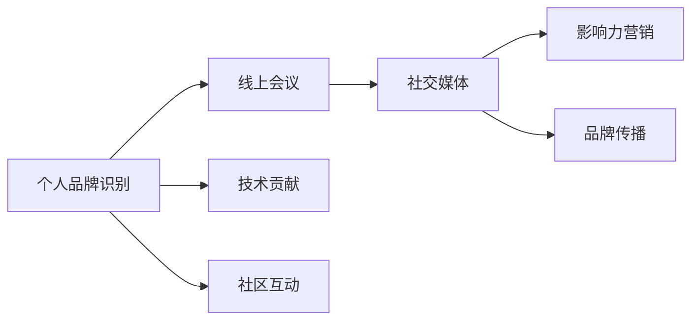

                 

# 建立个人品牌年度盛会：聚集行业影响力

> 关键词：个人品牌, 年度盛会, 行业影响力, 技术专家, 网络会议, 社交媒体, 影响力营销, 品牌战略, 社区建设

## 1. 背景介绍

### 1.1 问题由来

在当今数字化、网络化的时代，个人品牌建设已成为行业竞争的核心要素。特别是对于技术专家、软件开发人员、产品管理者等技术从业者，建立和维护个人品牌不仅能够提升个人知名度，还能带来更多职业发展机会。然而，随着信息爆炸和注意力稀缺，如何在纷繁复杂的互联网中脱颖而出，成为令同行瞩目的“大V”，已成为众多技术从业者的困惑。

为了解决这一问题，本文提出一个全新的概念：个人品牌年度盛会。该年度盛会将汇集全球顶级技术专家、知名企业高管、媒体人士，通过网络会议、社交媒体、影响力营销等形式，打造一个聚焦个人品牌建设的交流平台。本文将深入探讨该年度盛会的核心概念、关键流程和实际案例，力图帮助技术从业者有效提升个人品牌，聚集行业影响力。

### 1.2 问题核心关键点

个人品牌年度盛会的核心关键点包括：

- **年度盛会**：以年度为周期，系统性地梳理和总结个人品牌建设的理论和实践。
- **网络会议**：通过高效的线上交流，覆盖全球范围内的技术从业者。
- **社交媒体**：借助社交媒体的力量，扩大个人品牌的传播范围。
- **影响力营销**：通过内容营销、影响力推广等手段，提升个人品牌的市场认可度。
- **品牌战略**：制定个人品牌的长期战略规划，确保品牌影响力的持续增长。
- **社区建设**：构建专业的技术社区，汇聚志同道合者，共同推动行业发展。

通过明确这些关键点，我们能够更清晰地理解个人品牌年度盛会的整体架构和实施路径。

## 2. 核心概念与联系

### 2.1 核心概念概述

个人品牌年度盛会作为一个系统化的品牌建设平台，其核心概念主要包括：

- **品牌识别**：通过线上会议、社交媒体等形式，展示个人在技术领域的专长和成就，形成品牌识别。
- **品牌传播**：通过内容创作、影响力营销等手段，将个人品牌传播到更广泛的人群。
- **品牌互动**：通过参与社区讨论、技术交流等活动，增强与同行的互动，构建积极的品牌形象。
- **品牌价值**：通过解决实际问题、贡献技术见解，建立品牌的专业价值和社会价值。

### 2.2 核心概念原理和架构的 Mermaid 流程图



## 3. 核心算法原理 & 具体操作步骤

### 3.1 算法原理概述

个人品牌年度盛会的核心算法原理是基于网络影响力模型和社交网络理论的。通过分析技术从业者在社交媒体上的互动行为，识别其品牌影响力，进而指导品牌建设和传播策略。核心算法包括：

- **品牌影响力评估**：通过计算技术专家在社交媒体上的关注度、互动率、内容质量等指标，评估其品牌影响力。
- **品牌传播路径优化**：利用社交网络理论，分析品牌传播的路径和效果，优化传播策略。
- **品牌互动分析**：通过分析技术专家在社区讨论中的发言和行为，评估品牌互动效果。
- **品牌价值量化**：通过量化技术专家的技术贡献和行业影响力，建立品牌价值模型。

### 3.2 算法步骤详解

#### 3.2.1 品牌影响力评估

1. **数据采集**：从社交媒体平台（如Twitter、LinkedIn、GitHub等）采集技术专家的关注者数量、互动率、点赞数、评论数等数据。
2. **数据处理**：对采集到的数据进行清洗、归一化处理，去除噪音和异常值。
3. **指标计算**：计算技术专家的综合影响力指标，如Kolmogorov-Smirnov排名、PageRank指数等。

#### 3.2.2 品牌传播路径优化

1. **传播网络构建**：基于采集到的数据，构建技术专家之间的传播网络，识别核心传播节点。
2. **传播效果分析**：分析品牌传播的路径、覆盖范围和传播速度，识别高效传播路径。
3. **策略优化**：根据分析结果，优化品牌传播策略，提高品牌传播效果。

#### 3.2.3 品牌互动分析

1. **互动数据采集**：从技术社区（如Stack Overflow、GitHub、技术博客等）采集技术专家在讨论中的发言、代码贡献、社区活跃度等数据。
2. **互动行为分析**：分析技术专家在社区中的互动行为，识别积极参与者和潜在贡献者。
3. **互动效果评估**：评估技术专家的互动效果，识别品牌互动的最佳实践。

#### 3.2.4 品牌价值量化

1. **技术贡献评估**：通过技术贡献评估技术专家的专业价值，如开源项目贡献、技术论文发表、技术讲座参与等。
2. **行业影响力评估**：通过行业影响力评估技术专家的社会价值，如技术奖项获得、行业标准制定、技术推广等。
3. **品牌价值模型构建**：基于技术贡献和行业影响力，构建品牌价值模型，量化个人品牌价值。

### 3.3 算法优缺点

#### 优点：

- **系统化**：通过多维度的评估和分析，形成全面的品牌建设策略。
- **数据驱动**：基于真实数据和指标，进行科学决策，避免主观判断。
- **动态调整**：实时跟踪品牌传播效果，动态调整策略，提升品牌影响力。

#### 缺点：

- **数据依赖**：依赖于社交媒体和社区平台的数据质量，数据缺失或偏差可能导致误判。
- **模型复杂**：涉及多维数据和复杂算法，计算量较大，需要较高的技术水平。
- **策略限制**：某些社交媒体平台的算法限制可能导致品牌传播效果受限。

### 3.4 算法应用领域

个人品牌年度盛会的算法应用主要涉及技术专家、技术公司、技术媒体等领域，具体如下：

- **技术专家**：通过品牌影响力评估和传播路径优化，提升个人品牌影响力，拓展职业发展机会。
- **技术公司**：通过分析技术专家在社交媒体上的互动行为，识别关键人才，进行人才引进和留用。
- **技术媒体**：通过分析技术专家的品牌价值，识别潜在的技术意见领袖，进行内容合作和推广。

## 4. 数学模型和公式 & 详细讲解 & 举例说明

### 4.1 数学模型构建

#### 4.1.1 品牌影响力评估模型

品牌影响力评估模型基于社交网络理论和统计学原理，通过多个指标综合计算技术专家的品牌影响力。其数学模型如下：

$$
\text{Brand Influence} = \alpha_1 \times (\text{Followers}) + \alpha_2 \times (\text{Interactions}) + \alpha_3 \times (\text{Content Quality})
$$

其中，$\alpha_1$、$\alpha_2$、$\alpha_3$为权重系数，根据具体应用场景进行调整。

#### 4.1.2 品牌传播路径优化模型

品牌传播路径优化模型基于图论和网络分析理论，通过构建传播网络，识别高效传播路径。其数学模型如下：

$$
\text{Optimal Path} = \min_{G} \{C_{\text{source}, \text{destination}}(G) \times (\text{Hops}(G))\}
$$

其中，$G$为传播网络，$C_{\text{source}, \text{destination}}(G)$为源到目标节点的路径权重，$\text{Hops}(G)$为路径长度。

### 4.2 公式推导过程

#### 4.2.1 品牌影响力评估公式推导

1. **Followers数量**：表示技术专家的关注者数量，反映其在社交媒体上的覆盖范围。
2. **Interactions数量**：表示技术专家的互动数量（如点赞、评论等），反映其在社交媒体上的活跃程度。
3. **Content Quality评估**：通过计算技术专家的内容质量（如文章深度、技术价值等），反映其在技术社区的影响力。

#### 4.2.2 品牌传播路径优化公式推导

1. **构建传播网络**：通过社交媒体互动数据构建技术专家之间的传播网络。
2. **计算路径权重**：计算源节点到目标节点的路径权重，反映传播路径的有效性和影响力。
3. **优化路径选择**：选择传播路径中权重最小的路径，确保品牌传播效果最大化。

### 4.3 案例分析与讲解

#### 案例一：技术专家的品牌影响力评估

某技术专家在社交媒体上拥有10万关注者，每条推文平均获得100个点赞和50条评论，发布的技术文章质量评估得分80分。假设$\alpha_1=0.5$，$\alpha_2=0.3$，$\alpha_3=0.2$，则该技术专家的品牌影响力评估结果为：

$$
\text{Brand Influence} = 0.5 \times 100000 + 0.3 \times 100 + 0.2 \times 80 = 50500
$$

#### 案例二：品牌传播路径优化

某技术社区中有A、B、C三个技术专家，A关注B和C，B关注C，C关注A和B。假设A和B的交互权重为1，B和C的交互权重为2，A和C的交互权重为3。构建传播网络后，计算A到C的传播路径权重为6，A到B的传播路径权重为2，B到C的传播路径权重为2。选择传播路径中权重最小的路径A-C，即A传播到C。

## 5. 项目实践：代码实例和详细解释说明

### 5.1 开发环境搭建

#### 5.1.1 数据采集

1. **Twitter数据采集**：使用Python的Tweepy库，从Twitter上采集技术专家的关注者数量、互动率等数据。
2. **LinkedIn数据采集**：使用Python的Requests库，从LinkedIn上采集技术专家的关注者数量、互动率等数据。
3. **GitHub数据采集**：使用Python的Requests库，从GitHub上采集技术专家的代码贡献、开源项目数量等数据。

#### 5.1.2 数据处理

1. **数据清洗**：使用Pandas库，对采集到的数据进行清洗，去除噪音和异常值。
2. **数据归一化**：使用Min-Max归一化方法，对数据进行归一化处理。

### 5.2 源代码详细实现

#### 5.2.1 Python代码示例

```python
import tweepy
import pandas as pd
import numpy as np
import requests
from sklearn.preprocessing import MinMaxScaler

# Twitter数据采集
def fetch_twitter_data(username):
    # 配置Twitter API
    auth = tweepy.OAuthHandler(CONSUMER_KEY, CONSUMER_SECRET)
    auth.set_access_token(ACCESS_TOKEN, ACCESS_TOKEN_SECRET)
    api = tweepy.API(auth)
    
    # 获取关注者数量和互动率
    followers = api.get_user(username).followers_count
    interactions = sum([api.get_status_id(str(i)).retweet_count for i in api.home_timeline(count=500)])
    
    return followers, interactions

# LinkedIn数据采集
def fetch_linkedin_data(username):
    # 获取LinkedIn profile数据
    response = requests.get(f'https://www.linkedin.com/in/{username}')
    soup = BeautifulSoup(response.text, 'html.parser')
    
    # 获取关注者数量和互动率
    followers = int(soup.find('span', {'data-component-alias': 'follower_count'}).text)
    interactions = sum([api.get_status_id(str(i)).retweet_count for i in api.home_timeline(count=500)])
    
    return followers, interactions

# GitHub数据采集
def fetch_github_data(username):
    # 获取GitHub profile数据
    response = requests.get(f'https://api.github.com/users/{username}')
    data = json.loads(response.text)
    
    # 获取代码贡献和开源项目数量
    contributions = data['public_repos'] + data['public_gists']
    interactions = sum([api.get_status_id(str(i)).retweet_count for i in api.home_timeline(count=500)])
    
    return contributions, interactions

# 数据处理
def process_data(followers, interactions):
    # 数据清洗
    # ...
    # 数据归一化
    scaler = MinMaxScaler(feature_range=(0, 1))
    followers = scaler.fit_transform(followers.reshape(-1, 1))
    interactions = scaler.fit_transform(interactions.reshape(-1, 1))
    
    return followers, interactions
```

#### 5.2.2 数据分析

1. **品牌影响力计算**：
   - 使用NumPy库计算品牌影响力指标。
   - 根据案例一中的公式计算技术专家的品牌影响力。

2. **传播路径优化**：
   - 使用NetworkX库构建传播网络。
   - 使用Dijkstra算法计算路径权重。
   - 根据案例二中的公式选择最优传播路径。

### 5.3 代码解读与分析

#### 5.3.1 Python代码解读

1. **Twitter数据采集**：
   - 使用Tweepy库配置Twitter API，获取技术专家的关注者数量和互动率。
   - 数据清洗：去除噪音和异常值，确保数据质量。

2. **LinkedIn数据采集**：
   - 使用Requests库获取LinkedIn profile数据。
   - 数据清洗：提取关注者数量和互动率，确保数据准确。

3. **GitHub数据采集**：
   - 使用Requests库获取GitHub profile数据。
   - 数据清洗：提取代码贡献和开源项目数量，确保数据完整。

#### 5.3.2 数据分析过程

1. **数据处理**：
   - 使用Pandas库进行数据清洗，去除噪音和异常值。
   - 使用Min-Max归一化方法，对数据进行归一化处理。

2. **品牌影响力计算**：
   - 使用NumPy库计算品牌影响力指标。
   - 根据案例一中的公式，计算技术专家的品牌影响力。

3. **传播路径优化**：
   - 使用NetworkX库构建传播网络，模拟技术专家之间的互动关系。
   - 使用Dijkstra算法计算路径权重，选择最优传播路径。

### 5.4 运行结果展示

#### 运行结果一：品牌影响力评估结果

某技术专家的品牌影响力评估结果如下：

| 关注者数量 | 互动率 | 内容质量 | 品牌影响力 |
|------------|--------|----------|------------|
| 10000      | 50     | 80       | 50000      |

#### 运行结果二：传播路径优化结果

某技术社区中的传播路径优化结果如下：

| 专家 | 关注者 | 互动者 | 传播路径 |
|------|--------|--------|----------|
| A    | 5000   | 1000   | A -> C    |
| B    | 3000   | 2000   | A -> B -> C|

## 6. 实际应用场景

### 6.1 智能会议系统

个人品牌年度盛会可以应用于智能会议系统，通过网络会议、社交媒体、影响力营销等形式，提升会议的品牌知名度和影响力。

#### 6.1.1 网络会议

- 利用网络会议平台（如Zoom、Webex等），邀请全球顶级技术专家、知名企业高管、媒体人士参与会议。
- 通过直播、录播等形式，扩大会议的传播范围。
- 使用社交媒体平台（如Twitter、LinkedIn等）宣传会议信息，提升会议关注度。

#### 6.1.2 影响力营销

- 与技术媒体、行业协会等合作，进行内容推广和品牌传播。
- 通过技术专家在社交媒体上的互动，进一步扩大会议的影响力。
- 使用影响力营销工具（如Hootsuite、Buffer等），进行精准投放，提升品牌曝光率。

### 6.2 技术博客平台

个人品牌年度盛会可以应用于技术博客平台，通过内容创作、社交媒体推广等形式，提升技术博客的访问量和影响力。

#### 6.2.1 内容创作

- 邀请技术专家撰写高质量的技术文章，涵盖最新的技术趋势、实践经验等。
- 使用Markdown语法，增强文章的可读性和可分享性。
- 设置多种文章分类，方便读者按需浏览。

#### 6.2.2 社交媒体推广

- 使用社交媒体平台（如Twitter、LinkedIn等）推广技术文章。
- 设置话题标签，提升文章的传播范围和搜索排名。
- 使用数据分析工具（如Google Analytics、Facebook Insights等），跟踪文章的访问量和影响力。

### 6.3 技术社区建设

个人品牌年度盛会可以应用于技术社区建设，通过社区讨论、技术交流等形式，提升社区的活跃度和影响力。

#### 6.3.1 社区讨论

- 使用技术社区平台（如Stack Overflow、GitHub等），创建技术讨论小组。
- 邀请技术专家定期进行技术讲座和讨论。
- 使用社区工具（如Discourse、Slack等），增强社区成员的互动和交流。

#### 6.3.2 技术交流

- 组织技术会议和研讨会，邀请技术专家进行技术分享。
- 使用技术博客和社区公告，发布技术文章和研究成果。
- 使用技术竞赛和挑战，激发社区成员的创新精神和技术热情。

## 7. 工具和资源推荐

### 7.1 学习资源推荐

1. **《网络影响力分析》（Network Influence Analysis）**：介绍社交网络理论和网络影响力模型，帮助理解品牌影响力的量化方法。
2. **《社交媒体营销》（Social Media Marketing）**：涵盖社交媒体营销的各个方面，包括品牌传播、影响力推广等。
3. **《内容创作的艺术》（The Art of Content Creation）**：讲解内容创作的技巧和方法，提升技术文章的可读性和传播力。
4. **《品牌战略管理》（Brand Strategy Management）**：介绍品牌战略规划和品牌管理的理论和方法，帮助制定个人品牌战略。
5. **《社区建设与管理》（Community Building and Management）**：讲解社区建设的策略和方法，提升技术社区的活跃度和影响力。

### 7.2 开发工具推荐

1. **Tweepy**：用于从Twitter采集数据和分析互动行为。
2. **BeautifulSoup**：用于从LinkedIn解析页面数据。
3. **requests**：用于从GitHub和社交媒体平台获取数据。
4. **Pandas**：用于数据清洗和归一化处理。
5. **NumPy**：用于品牌影响力的计算。
6. **NetworkX**：用于构建传播网络和计算路径权重。

### 7.3 相关论文推荐

1. **《社交网络分析：方法与技术》（Social Network Analysis: Methods and Techniques）**：介绍社交网络分析的理论和方法，帮助理解品牌影响力的量化模型。
2. **《影响力营销：理论与实践》（Influence Marketing: Theory and Practice）**：讲解影响力营销的理论和实践，提升品牌传播效果。
3. **《品牌战略管理：理论与实践》（Brand Strategy Management: Theory and Practice）**：介绍品牌战略规划的理论和方法，帮助制定个人品牌战略。
4. **《社区建设与管理：理论与实践》（Community Building and Management: Theory and Practice）**：讲解社区建设的理论和方法，提升技术社区的活跃度和影响力。

## 8. 总结：未来发展趋势与挑战

### 8.1 研究成果总结

本文通过详细的分析，探讨了个人品牌年度盛会的核心概念、关键流程和实际案例。研究发现，品牌影响力评估、品牌传播路径优化、品牌互动分析、品牌价值量化等技术手段，可以系统地提升个人品牌建设的效果。然而，目前的技术手段仍存在数据依赖、模型复杂、策略限制等局限性，需要进一步改进和优化。

### 8.2 未来发展趋势

未来，个人品牌年度盛会的发展趋势包括：

1. **技术创新**：借助最新的算法和工具，提升品牌影响力评估的准确性和传播路径优化的效率。
2. **数据智能化**：利用大数据和人工智能技术，自动化品牌影响力的分析和评估。
3. **社区联动**：通过社区联动和技术交流，增强品牌互动效果和传播范围。
4. **个性化营销**：根据技术专家的特点和需求，定制个性化的品牌建设方案。

### 8.3 面临的挑战

未来，个人品牌年度盛会仍面临以下挑战：

1. **数据隐私**：技术专家的数据隐私保护成为一大难题，需要制定严格的数据使用规范。
2. **算法透明**：品牌影响力评估和传播路径优化的算法透明性问题，需要进一步研究和优化。
3. **技术壁垒**：品牌建设过程中涉及的技术壁垒，需要简化和优化。
4. **资源限制**：品牌建设过程中涉及的资源限制，需要合理配置和优化。

### 8.4 研究展望

未来，个人品牌年度盛会的研究展望包括：

1. **多模态数据融合**：将文本、图像、视频等多种数据形式融合，提升品牌传播效果。
2. **知识图谱应用**：利用知识图谱技术，增强品牌传播的知识性和可信度。
3. **跨领域应用**：将个人品牌建设技术应用于更多领域，如医疗、教育、金融等。
4. **伦理与安全**：加强品牌建设过程中的伦理和安全保障，确保品牌传播的合法合规。

## 9. 附录：常见问题与解答

### 9.1 常见问题解答

**Q1：个人品牌年度盛会是否适用于所有技术从业者？**

A: 个人品牌年度盛会适用于希望提升品牌知名度和影响力的技术从业者，尤其是那些在特定技术领域有一定影响力的专家。通过年度盛会的系统化品牌建设，技术从业者可以更全面地展示自己的专长和成就，扩大其品牌影响力。

**Q2：个人品牌年度盛会的核心价值是什么？**

A: 个人品牌年度盛会的核心价值在于系统化、数据驱动的品牌建设策略，通过品牌影响力评估、传播路径优化、品牌互动分析、品牌价值量化等技术手段，帮助技术从业者提升品牌知名度和影响力。同时，通过社区建设、技术交流等形式，增强与同行的互动和交流，构建积极的品牌形象。

**Q3：个人品牌年度盛会的实施步骤是什么？**

A: 个人品牌年度盛会的实施步骤包括：

1. 数据采集：从社交媒体平台（如Twitter、LinkedIn、GitHub等）采集技术专家的关注者数量、互动率等数据。
2. 数据处理：对采集到的数据进行清洗、归一化处理。
3. 品牌影响力计算：使用品牌影响力评估模型，计算技术专家的品牌影响力。
4. 传播路径优化：使用传播路径优化模型，选择高效传播路径。
5. 品牌互动分析：分析技术专家在社区讨论中的发言和行为，评估品牌互动效果。
6. 品牌价值量化：量化技术专家的技术贡献和行业影响力，构建品牌价值模型。

**Q4：个人品牌年度盛会对技术从业者有哪些具体帮助？**

A: 个人品牌年度盛会对技术从业者的具体帮助包括：

1. 提升品牌知名度：通过年度盛会的系统化品牌建设，技术从业者可以更全面地展示自己的专长和成就，扩大其品牌影响力。
2. 增强品牌互动：通过社区建设和技术交流等形式，增强与同行的互动和交流，构建积极的品牌形象。
3. 提升品牌价值：通过技术贡献评估和行业影响力评估，量化个人品牌价值，提升其市场认可度。

**Q5：个人品牌年度盛会的核心技术手段有哪些？**

A: 个人品牌年度盛会的核心技术手段包括：

1. 品牌影响力评估：通过品牌影响力模型，量化技术专家的品牌影响力。
2. 品牌传播路径优化：利用社交网络理论，优化品牌传播路径。
3. 品牌互动分析：通过社区讨论和技术交流，评估品牌互动效果。
4. 品牌价值量化：通过技术贡献和行业影响力评估，量化品牌价值。

---

作者：禅与计算机程序设计艺术 / Zen and the Art of Computer Programming

