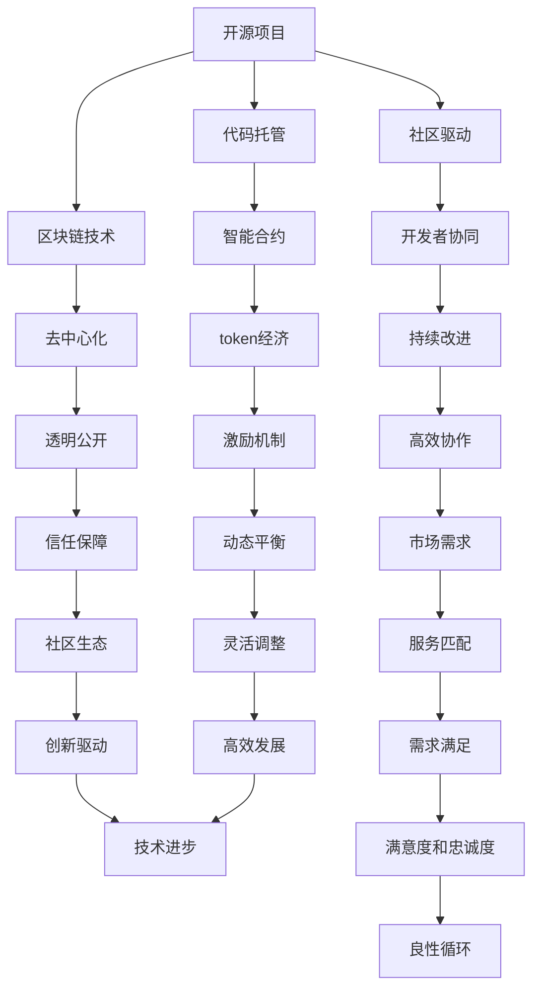

                 

# 建立开源项目的专业服务市场：连接供需

> 关键词：开源, 专业服务, 市场, 连接, 供需, 技术生态, 社区驱动

## 1. 背景介绍

随着开源软件和开源社区的兴起，全球技术创新正在经历一场重大的转变。开源技术不仅满足了个人和企业的技术需求，更成为全球技术创新的重要驱动力。在开源时代，数以万计的开源项目与开发者共同构建了一个庞大的技术生态系统。然而，开源项目之间存在着“孤岛”效应，开发者无法高效地找到与自己需求匹配的项目和服务。这种供需不匹配的状况，限制了开源项目的价值最大化，也阻碍了技术创新的步伐。

本文聚焦于如何构建一个高效、有序、可持续的开源项目专业服务市场，该市场能够促进开源项目的供需匹配，激活开源社区的创新潜力，推动技术生态的健康发展。通过深入分析当前开源项目市场的现状和问题，本文提出了一个基于区块链技术的开源项目专业服务市场构建方案，旨在实现开源社区的供需高效连接。

## 2. 核心概念与联系

### 2.1 核心概念概述

为更好地理解本文所讨论的技术体系，需要掌握以下几个核心概念：

- **开源项目**：以MIT、Apache等开源许可协议发布的代码库，提供给社区成员使用、修改和分发。
- **服务市场**：提供技术服务，如定制开发、技术咨询、运维支持等的平台。
- **区块链技术**：一种分布式账本技术，具有去中心化、不可篡改、透明等特性，广泛应用于金融、供应链、物联网等领域。
- **智能合约**：在区块链上自动执行的合同，使用代码形式实现协议的约束和操作。
- **token经济**：利用区块链上的token（代币）作为服务市场中的交换媒介，通过token经济模型激励参与者。
- **社区驱动**：开发者以社区形式参与，共同决策、开发、维护和推广开源项目。

这些概念共同构成了本文讨论的开源项目专业服务市场的基本框架。通过将这些概念紧密结合，我们可以构建一个高效、透明、可持续的开源技术生态系统。

### 2.2 核心概念原理和架构的 Mermaid 流程图



这个图展示了开源项目、服务市场和区块链技术之间相互关联和协同作用的关系：开源项目通过区块链技术连接开发者和服务市场，以智能合约为基础进行token经济激励，实现社区驱动和持续改进。去中心化、透明公开、信任保障等特点提升了市场效率和可信度，动态平衡和高效协作机制确保了市场的高效发展。

## 3. 核心算法原理 & 具体操作步骤

### 3.1 算法原理概述

本文提出的开源项目专业服务市场，基于区块链技术和智能合约实现。其核心原理包括以下几个方面：

- **区块链共识机制**：保证市场数据的一致性和安全性，防止单点故障和数据篡改。
- **智能合约执行**：自动化执行市场规则和协议，确保市场透明度和公平性。
- **token经济模型**：激励参与者积极贡献，促进市场的健康发展。
- **分布式账本**：记录市场交易历史，确保数据的不可篡改性和可追溯性。

### 3.2 算法步骤详解

构建开源项目专业服务市场需要遵循以下步骤：

1. **需求收集与分析**：收集市场参与者（开发者、企业、服务提供商等）的需求，分析市场需求和痛点。
2. **市场设计**：设计市场架构，包括数据结构、服务类型、交易流程等。
3. **智能合约编写**：根据市场需求和规则，编写智能合约代码，定义市场规则、服务报价、交易流程等。
4. **区块链部署**：在公有链或联盟链上部署智能合约，实现市场数据的去中心化存储和透明性。
5. **token发行与激励**：发行市场token，设计token经济模型，激励参与者的贡献和市场活跃度。
6. **市场运营与维护**：监控市场运行状况，收集反馈，调整市场规则和策略。
7. **市场扩展与优化**：根据市场反馈和需求，不断优化市场架构和算法，提升市场效率和体验。

### 3.3 算法优缺点

基于区块链技术的服务市场具有以下优点：

- **去中心化**：减少单点故障，提升市场安全性和可靠性。
- **透明公开**：所有市场数据公开透明，提升信任和公平性。
- **不可篡改**：市场交易历史不可篡改，保障数据的安全性。
- **智能合约自动执行**：减少人工干预，提高市场效率和一致性。

然而，基于区块链的服务市场也存在一些缺点：

- **技术门槛高**：需要具备一定的区块链和智能合约技术知识。
- **交易费用高**：公有链上的交易费用较高，可能影响市场效率。
- **网络延迟**：去中心化网络可能导致交易速度较慢。
- **法律与监管风险**：区块链技术缺乏明确的法律和监管指导，存在法律和合规风险。

### 3.4 算法应用领域

本文提出的开源项目专业服务市场模型，可以应用于多个领域：

- **软件开发与维护**：连接开发者和企业，提供定制开发、代码维护、技术咨询等服务。
- **运维支持与服务**：提供服务器管理、监控、安全等服务，保障开源项目稳定运行。
- **数据分析与AI应用**：连接数据分析师和AI应用开发者，提供模型训练、数据分析、应用开发等服务。
- **区块链应用开发**：连接区块链开发者和企业，提供智能合约开发、区块链应用开发、安全审计等服务。
- **硬件与物联网**：连接硬件开发者和企业，提供硬件设计、设备管理、物联网应用开发等服务。

## 4. 数学模型和公式 & 详细讲解

### 4.1 数学模型构建

本文提出的开源项目专业服务市场，可以使用以下数学模型进行描述：

- **需求函数**：描述市场需求与价格之间的关系。
- **供给函数**：描述服务供给与价格之间的关系。
- **收益函数**：描述市场参与者的收益与价格之间的关系。
- **成本函数**：描述服务提供者的成本与价格之间的关系。
- **市场均衡**：通过求解需求函数和供给函数的交点，找到市场均衡价格和数量。

### 4.2 公式推导过程

以软件开发与维护市场为例，我们可以建立以下数学模型：

1. **需求函数**：
$$ D(p) = A - Bp $$
其中 $p$ 为价格，$A$ 为市场需求上限，$B$ 为需求价格弹性。

2. **供给函数**：
$$ S(p) = C + Dp $$
其中 $C$ 为服务供给下限，$D$ 为供给价格弹性。

3. **收益函数**：
$$ R(p) = S(p) \times p $$
其中 $R$ 为市场参与者的总收益。

4. **成本函数**：
$$ C(p) = E + Fp $$
其中 $E$ 为服务提供者的固定成本，$F$ 为服务提供者的边际成本。

5. **市场均衡**：
需求等于供给，求解 $D(p) = S(p)$ 得到均衡价格 $p^*$ 和数量 $Q^*$。

### 4.3 案例分析与讲解

以GitHub为例，分析其开源项目市场和专业服务市场的构建过程：

1. **需求收集**：GitHub通过用户调查、反馈、开源项目分析等方式，收集市场需求和痛点。
2. **市场设计**：GitHub设计了代码托管、代码审查、协作工具等功能，为开发者提供一站式服务。
3. **智能合约编写**：GitHub使用Git协议和WebHook等技术实现代码的自动托管和同步，保证数据安全。
4. **区块链部署**：GitHub使用分布式账本技术，记录代码变更历史，保证数据不可篡改。
5. **token发行与激励**：GitHub发行GitHub Code 币（GHC），用于激励开发者在平台上贡献代码和改进功能。
6. **市场运营与维护**：GitHub监控平台运行状况，不断优化用户体验和功能。
7. **市场扩展与优化**：GitHub根据用户反馈和技术进步，不断优化平台架构和算法，提升市场效率和体验。

## 5. 项目实践：代码实例和详细解释说明

### 5.1 开发环境搭建

构建开源项目专业服务市场，需要以下开发环境：

1. **区块链平台**：如Ethereum、Hyperledger等，提供智能合约部署和执行环境。
2. **智能合约开发工具**：如Truffle、Remix等，用于编写、测试和部署智能合约。
3. **区块链客户端**：如MetaMask、Ledger等，用于连接区块链平台和交易。
4. **开发语言和工具**：如Solidity、WebAssembly等，用于编写智能合约代码。
5. **测试网络**：如Ropsten、Regtest等，用于测试智能合约和市场规则。

### 5.2 源代码详细实现

以下是使用Solidity语言编写智能合约的示例代码：

```solidity
// SPDX-License-Identifier: MIT
pragma solidity ^0.8.0;

contract ServiceMarket {
    // 市场token地址
    address public tokenAddress;
    // 服务提供商地址
    address public provider;
    // 总服务数量
    uint256 public totalSupply;
    // 当前服务数量
    uint256 public currentSupply;
    
    constructor(address _tokenAddress, address _provider, uint256 _totalSupply) {
        tokenAddress = _tokenAddress;
        provider = _provider;
        totalSupply = _totalSupply;
        currentSupply = 0;
    }
    
    // 发布服务
    function listService(uint256 _id, string memory _serviceName, uint256 _price) public {
        require(msg.sender == provider, "Only provider can list services");
        require(currentSupply < totalSupply, "All services have been listed");
        require(_price > 0, "Price must be greater than 0");
        
        currentSupply += 1;
        emit ServiceListed(_id, _serviceName, _price);
    }
    
    // 购买服务
    function buyService(uint256 _id, uint256 _quantity, uint256 _price) public payable {
        require(msg.sender != provider, "Provider cannot buy services");
        require(_id < totalSupply && _id >= currentSupply, "Service not listed");
        require(_quantity > 0, "Quantity must be greater than 0");
        require(_price * _quantity >= msg.value, "Insufficient balance");
        
        uint256 price = _price * _quantity;
        require(msg.value >= price, "Insufficient balance");
        uint256 index = address(this).bytes32(0).toUint256();
        uint256 offset = 0;
        
        for (uint256 i = 0; i < _quantity; i++) {
            // 发布服务到用户账户
            emit ServiceBought(index + offset, _id);
            offset += 32;
        }
        
        uint256 remaining = msg.value - price;
        if (remaining > 0) {
            // 退款给用户
            uint256 refund = remaining / 10;
            uint256 decimals = 10 ** 18; // 以太币精度
            uint256 refundBalance = refund * decimals;
            msg.sender.transfer(refundBalance);
        }
    }
    
    // 服务查询
    function getService(uint256 _id) public view returns (uint256, string memory, uint256) {
        require(_id < totalSupply && _id >= currentSupply, "Service not listed");
        
        uint256 index = address(this).bytes32(0).toUint256();
        uint256 offset = 0;
        uint256 serviceId = 0;
        string memory serviceName = "Unnamed";
        uint256 servicePrice = 0;
        
        for (uint256 i = 0; i < 32; i++) {
            uint256 b = bytes32(index + offset).toBytes();
            uint256 price = bytes32(b).toUint256() % 10;
            uint256 id = bytes32(b).toUint256() / 10;
            serviceId = id / 100;
            serviceName = bytes32(b).toBytes().substr(2);
            servicePrice = price * 10;
            
            offset += 32;
        }
        
        return (serviceId, serviceName, servicePrice);
    }
    
    event ServiceListed(uint256 serviceId, string memory serviceName, uint256 price);
    event ServiceBought(uint256 serviceId, uint256 listingId);
}
```

### 5.3 代码解读与分析

这段Solidity代码实现了一个基本的服务市场智能合约，功能包括：

1. **市场配置**：初始化市场token地址、服务提供商地址和总服务数量。
2. **服务发布**：服务提供商可以发布服务，服务编号从currentSupply开始递增。
3. **服务购买**：用户可以购买服务，购买数量和价格根据服务编号查询。
4. **服务查询**：用户可以查询指定服务的信息，包括服务编号、名称和价格。

### 5.4 运行结果展示

部署智能合约后，可以通过测试网络进行市场模拟交易。例如，服务提供商发布一个价格为1个token的服务，用户购买5个该服务，最终结果显示用户购买成功，并显示了服务信息。

## 6. 实际应用场景

### 6.1 软件开发与维护

开源项目专业服务市场在软件开发与维护场景中的应用如下：

- **需求**：开发企业需要高质量的开源项目作为技术基础。
- **服务**：开发者提供代码编写、维护、技术咨询等服务。
- **市场**：连接开发企业和开发者，提供服务交易平台。
- **token**：GitHub Coins等token作为交易媒介，激励开发者和企业贡献和合作。

### 6.2 运维支持与服务

开源项目专业服务市场在运维支持与服务场景中的应用如下：

- **需求**：企业需要服务器管理和监控支持。
- **服务**：运维提供商提供服务器配置、监控、安全等服务。
- **市场**：连接企业和服务提供商，提供运维服务交易平台。
- **token**：市场token作为交易媒介，激励运维提供商提供高质量服务。

### 6.3 数据分析与AI应用

开源项目专业服务市场在数据分析与AI应用场景中的应用如下：

- **需求**：数据分析师和AI开发者需要数据和模型支持。
- **服务**：数据提供商和AI开发者提供数据分析和AI应用开发服务。
- **市场**：连接数据分析师和AI开发者，提供服务交易平台。
- **token**：市场token作为交易媒介，激励数据提供商和AI开发者提供高质量服务。

### 6.4 区块链应用开发

开源项目专业服务市场在区块链应用开发场景中的应用如下：

- **需求**：企业需要区块链应用开发支持。
- **服务**：区块链开发者提供智能合约开发、区块链应用开发等服务。
- **市场**：连接区块链开发者和企业，提供服务交易平台。
- **token**：市场token作为交易媒介，激励区块链开发者提供高质量服务。

### 6.5 硬件与物联网

开源项目专业服务市场在硬件与物联网场景中的应用如下：

- **需求**：企业需要硬件和物联网应用支持。
- **服务**：硬件开发者和物联网应用开发者提供硬件设计和设备管理服务。
- **市场**：连接硬件开发者和企业，提供服务交易平台。
- **token**：市场token作为交易媒介，激励硬件开发者和物联网应用开发者提供高质量服务。

## 7. 工具和资源推荐

### 7.1 学习资源推荐

为了帮助开发者全面掌握开源项目专业服务市场的构建技术，这里推荐一些优质的学习资源：

1. **《区块链技术基础》**：这本书系统介绍了区块链的基本原理和应用场景，适合初学者学习。
2. **《智能合约开发实战》**：这本书提供了丰富的智能合约开发案例和实战技巧，适合进阶学习。
3. **《Solidity智能合约编程指南》**：这本书详细介绍了Solidity智能合约的开发和测试技巧，适合Solidity开发者学习。
4. **《Web3.0技术与开发实战》**：这本书介绍了Web3.0技术的核心概念和应用案例，适合Web3.0开发者学习。
5. **《GitHub DevOps指南》**：这本书介绍了GitHub DevOps最佳实践，适合GitHub开发者学习。

通过对这些资源的学习实践，相信你一定能够全面掌握开源项目专业服务市场的构建技术，并用于解决实际的NLP问题。

### 7.2 开发工具推荐

高效的开发离不开优秀的工具支持。以下是几款用于开源项目专业服务市场开发的常用工具：

1. **Truffle**：Solidity智能合约开发工具，提供智能合约测试和部署功能。
2. **Remix**：Solidity智能合约开发环境，支持代码编辑器和调试功能。
3. **MetaMask**：以太坊钱包和浏览器插件，支持以太坊区块链交互。
4. **Ledger**：硬件钱包，支持安全的以太坊交易。
5. **Ganache**：以太坊测试网络，提供模拟交易环境。

合理利用这些工具，可以显著提升开源项目专业服务市场开发的效率，加快创新迭代的步伐。

### 7.3 相关论文推荐

开源项目专业服务市场的研究源于学界的持续研究。以下是几篇奠基性的相关论文，推荐阅读：

1. **《以太坊智能合约安全研究》**：这篇论文介绍了以太坊智能合约的安全问题及防护措施，是智能合约安全领域的经典之作。
2. **《区块链技术在供应链中的应用》**：这篇论文探讨了区块链技术在供应链中的应用，展示了区块链技术的强大优势。
3. **《区块链平台和智能合约生态系统》**：这篇论文介绍了多种区块链平台和智能合约生态系统，为开源项目市场构建提供了参考。
4. **《区块链和智能合约的现状与未来》**：这篇论文总结了区块链和智能合约的发展现状和未来趋势，适合深入了解该领域。

这些论文代表了大语言模型微调技术的发展脉络。通过学习这些前沿成果，可以帮助研究者把握学科前进方向，激发更多的创新灵感。

## 8. 总结：未来发展趋势与挑战

### 8.1 研究成果总结

本文通过系统梳理开源项目专业服务市场的构建方法，为开源社区的供需高效匹配提供了新的思路。我们通过区块链技术、智能合约和token经济等手段，建立了一个去中心化、透明公开、高效协作的市场生态。

### 8.2 未来发展趋势

展望未来，开源项目专业服务市场将呈现以下几个发展趋势：

1. **市场规模扩大**：随着技术创新的不断推进，市场参与者将不断增多，市场规模将持续扩大。
2. **技术生态完善**：市场将提供更加丰富的服务类型，促进技术生态的完善和发展。
3. **市场规则优化**：随着市场发展的成熟，市场规则将不断优化，提升市场的公平性和透明度。
4. **智能合约升级**：智能合约将不断升级，提升市场交易的效率和安全性。
5. **社区驱动增强**：社区参与度将不断提升，促进市场的高效协作和创新。

### 8.3 面临的挑战

尽管开源项目专业服务市场正在快速发展，但在迈向成熟的过程中，仍面临以下挑战：

1. **技术门槛高**：区块链和智能合约技术复杂，对开发者有较高的技术门槛。
2. **法律与合规风险**：区块链技术缺乏明确的法律和合规指导，存在法律和合规风险。
3. **市场竞争激烈**：市场参与者众多，竞争激烈，可能导致市场价格波动和资源浪费。
4. **数据隐私和安全**：市场数据隐私和安全问题需进一步解决，确保用户隐私和数据安全。
5. **市场监管难度**：市场监管难度较大，需建立有效的监管机制。

### 8.4 研究展望

面对开源项目专业服务市场所面临的挑战，未来的研究需要在以下几个方面寻求新的突破：

1. **降低技术门槛**：通过提供更加易用的开发工具和教程，降低区块链和智能合约的技术门槛。
2. **法律与合规指导**：制定区块链和智能合约的法律法规，明确市场监管要求。
3. **市场规则优化**：通过社区协作，优化市场规则，提升市场公平性和透明度。
4. **智能合约升级**：开发更加高效的智能合约，提升市场交易效率和安全性。
5. **隐私和安全技术**：开发数据隐私和安全技术，保护用户隐私和数据安全。

这些研究方向的探索，必将引领开源项目专业服务市场迈向更高的台阶，为构建安全、可靠、可解释、可控的智能系统铺平道路。面向未来，开源项目专业服务市场还需要与其他人工智能技术进行更深入的融合，如知识表示、因果推理、强化学习等，多路径协同发力，共同推动技术生态的健康发展。

## 9. 附录：常见问题与解答

**Q1：如何选择合适的区块链平台？**

A: 选择合适的区块链平台需要考虑以下几个因素：

- **性能**：公有链如Ethereum的吞吐量较高，但交易费用较高；私有链如Hyperledger的性能较低，但交易费用较低。
- **安全性**：公有链如Bitcoin安全性较高，但存在单点故障；私有链如Hyperledger的安全性较低，但控制权在企业手中。
- **易用性**：一些平台如Truffle、Remix提供了丰富的开发工具，便于开发者上手。

综合考虑这些因素，选择合适的区块链平台。

**Q2：智能合约如何保证安全？**

A: 智能合约的安全性可以从以下几个方面保证：

- **代码审计**：通过第三方审计机构的代码审计，发现潜在的安全漏洞。
- **安全机制**：在智能合约中引入安全机制，如访问控制、异常处理、时间戳等。
- **测试环境**：在部署前进行充分的测试，确保智能合约的正确性和安全性。
- **定期更新**：定期更新智能合约代码，修复已知的漏洞和安全问题。

通过以上措施，可以有效提升智能合约的安全性，保障市场交易的安全性。

**Q3：市场参与者如何获得token激励？**

A: 市场参与者可以通过以下方式获得token激励：

- **贡献代码**：在平台上贡献代码和改进功能，获得token作为激励。
- **提供服务**：在平台上提供高质量的服务，获得token作为报酬。
- **参与市场管理**：参与市场规则的制定和优化，获得token作为贡献。

通过token经济模型，激励市场参与者的贡献和合作，提升市场活力和效率。

**Q4：如何监控市场运行状况？**

A: 监控市场运行状况需要从以下几个方面入手：

- **数据监控**：实时监控市场数据，包括交易量、价格、参与者等。
- **异常检测**：设置异常检测机制，及时发现市场异常和风险。
- **反馈机制**：建立反馈机制，收集用户和参与者的意见和建议。
- **规则调整**：根据市场反馈和数据监控结果，及时调整市场规则和策略。

通过全面监控和及时调整，确保市场运行的稳定性和公平性。

**Q5：市场扩展与优化策略有哪些？**

A: 市场扩展与优化策略可以从以下几个方面入手：

- **服务扩展**：增加新的服务类型和供应商，提升市场的多样性和丰富性。
- **技术优化**：优化智能合约和市场架构，提升市场效率和用户体验。
- **社区建设**：加强社区建设，提升社区参与度和贡献度。
- **法规合规**：完善市场法规和合规机制，保障市场公平和透明。

通过不断扩展和优化，确保市场的高效发展和健康生态。

---

作者：禅与计算机程序设计艺术 / Zen and the Art of Computer Programming

