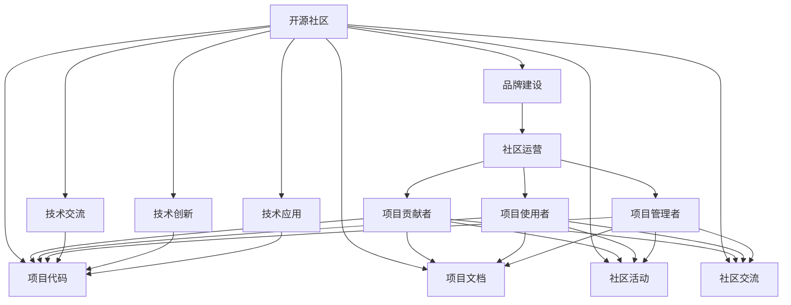

                 

# 建立开源项目的在线社区：社区运营和品牌建设

在当今数字化时代，开源项目已成为科技创新、技术传播、社区协作的重要形式。如何建立和维护一个成功的开源项目在线社区，不仅关乎项目的长远发展和影响力，也是项目品牌建设的重要一环。本文将从社区运营和品牌建设的视角，深入探讨如何构建和运作一个充满活力、可持续发展的开源社区，打造一个强大而具影响力的开源品牌。

## 1. 背景介绍

随着开源运动在全球的兴起，越来越多的开发者、企业和研究机构选择通过开源项目进行技术交流、创新和共享。开源社区不仅促进了技术的快速迭代，也加强了技术社区的凝聚力和创新活力。然而，建设一个成功的开源项目并非易事，尤其是在社区运营和品牌建设方面。本文将基于笔者的多年开源项目运营经验，分享一些关键的策略和实践。

## 2. 核心概念与联系

### 2.1 核心概念概述

要理解和运营一个开源项目，首先需要明确几个核心概念：

- **开源社区**：由开发者、贡献者、使用者、管理者组成的社区，共同维护和贡献代码、文档和资源。
- **品牌建设**：通过有效的沟通和营销策略，提升开源项目及其组织在行业内的知名度和影响力。
- **社区运营**：通过组织活动、提供资源、建立沟通渠道等手段，促进社区成员的积极参与和持续贡献。

这三个概念相互联系，共同构成了一个开源项目的健康生态系统。品牌建设为社区运营提供方向和动力，而社区运营则是品牌建设的基础和保障。

### 2.2 核心概念原理和架构的 Mermaid 流程图



这个流程图展示了开源社区与品牌建设、社区运营之间的相互关系和互动路径。开源项目通过代码、文档、活动和交流，为贡献者、使用者和管理者提供支持和平台，从而促进了项目的发展和影响力的提升。

## 3. 核心算法原理 & 具体操作步骤

### 3.1 算法原理概述

社区运营和品牌建设的算法原理主要包括以下几个方面：

1. **社区管理算法**：通过建立良好的社区治理机制，确保项目的可持续发展和贡献者的积极参与。
2. **用户增长算法**：通过有效的推广策略，吸引更多的开发者、使用者和管理者加入社区。
3. **内容推荐算法**：通过推荐算法，提高社区内容的吸引力和参与度，促进知识共享和传播。
4. **品牌提升算法**：通过有效的营销策略和品牌推广，提升开源项目及其组织在行业内的知名度和影响力。

### 3.2 算法步骤详解

#### 3.2.1 社区管理算法

- **制定社区规则**：明确社区成员的权利和义务，建立公平、透明的治理机制。
- **激励机制设计**：设计合理的贡献奖励机制，如积分、徽章、贡献证书等，激励成员积极参与。
- **社区安全保障**：建立反垃圾、反攻击机制，保护社区成员的权益和信息安全。
- **社区成员分级**：根据贡献度和活跃度，对社区成员进行分级管理，确保社区有序运作。

#### 3.2.2 用户增长算法

- **社交媒体推广**：通过在社交媒体上发布项目动态、成功案例，吸引用户关注。
- **邮件列表订阅**：创建邮件列表，定期向用户推送项目更新和社区活动信息。
- **合作伙伴关系**：与行业协会、技术社区、学校建立合作关系，扩大项目影响力。
- **参与开源社区活动**：鼓励社区成员参加其他开源社区的活动，增加项目曝光度。

#### 3.2.3 内容推荐算法

- **内容分类和标签**：对社区内容进行分类和标签化，方便用户查找和阅读。
- **用户行为分析**：分析用户的行为数据，了解用户的兴趣和需求，优化推荐算法。
- **个性化推荐**：根据用户偏好和历史行为，提供个性化的内容推荐，提高用户满意度。
- **社区活动策划**：策划社区活动，如技术分享会、代码审查日等，吸引用户参与。

#### 3.2.4 品牌提升算法

- **内容营销**：通过撰写高质量的博客文章、技术报告、白皮书等，展示项目的技术优势和应用价值。
- **社区宣传**：通过社区内部和外部渠道，宣传项目的成功案例和社区贡献，提升项目品牌。
- **媒体合作**：与行业媒体建立合作关系，进行联合报道和推广，扩大项目影响力。
- **线上活动举办**：举办线上研讨会、技术讲座、直播等活动，提升项目知名度。

### 3.3 算法优缺点

#### 3.3.1 优点

1. **社区活力**：通过有效的社区管理和激励机制，促进社区成员的积极参与和持续贡献。
2. **用户增长**：通过多渠道推广策略，快速吸引用户加入社区，扩大用户基础。
3. **内容质量**：通过内容推荐算法，提高社区内容的吸引力和参与度，促进知识共享和传播。
4. **品牌影响**：通过品牌提升算法，提升开源项目及其组织在行业内的知名度和影响力。

#### 3.3.2 缺点

1. **资源投入**：社区管理和品牌建设需要大量的资源投入，包括人力、物力和财力。
2. **管理复杂**：社区成员数量庞大，管理难度较大，需要建立高效的治理机制。
3. **用户期望管理**：用户期望不断提高，社区需不断优化和改进，以满足用户需求。
4. **品牌风险**：品牌提升过程中，可能面临负面事件或争议，需要及时应对和处理。

### 3.4 算法应用领域

这些算法和步骤在开源社区运营和品牌建设中具有广泛的应用。无论是技术社区、开源组织还是初创企业，都可以借鉴这些方法和策略，建立和维护一个充满活力、可持续发展的开源社区，打造一个强大而具影响力的开源品牌。

## 4. 数学模型和公式 & 详细讲解 & 举例说明

### 4.1 数学模型构建

为了更精确地描述开源社区运营和品牌建设的算法，我们可以构建一个简单的数学模型：

- **用户增长模型**：
  $$
  U_{t+1} = U_t \times (1 + \eta)
  $$
  其中，$U_t$ 表示在时间 $t$ 的用户数，$\eta$ 表示用户增长率。

- **内容推荐模型**：
  $$
  C_{t+1} = C_t \times (1 + \alpha)
  $$
  其中，$C_t$ 表示在时间 $t$ 的内容数，$\alpha$ 表示内容增长率。

### 4.2 公式推导过程

#### 4.2.1 用户增长模型推导

用户增长的数学模型可以简化为一个指数增长模型：

$$
U_t = U_0 \times (1 + \eta)^t
$$
其中，$U_0$ 表示初始用户数，$\eta$ 表示用户增长率。

通过对这个模型进行分析，可以得出用户增长速度与初始用户数和增长率的关系。

#### 4.2.2 内容推荐模型推导

内容推荐的数学模型同样可以简化为一个指数增长模型：

$$
C_t = C_0 \times (1 + \alpha)^t
$$
其中，$C_0$ 表示初始内容数，$\alpha$ 表示内容增长率。

通过对这个模型进行分析，可以得出内容增长速度与初始内容数和增长率的关系。

### 4.3 案例分析与讲解

以一个开源社区为例，我们假设初始用户数为 1000 人，用户增长率为 10%，内容初始数量为 100 条，内容增长率为 15%。根据上述数学模型，经过 1 年，用户数将增长到 1600 人，内容数将增长到 246 条。

## 5. 项目实践：代码实例和详细解释说明

### 5.1 开发环境搭建

在构建开源项目在线社区的过程中，需要搭建一个高效、稳定的开发环境。以下是一些推荐的开发环境配置：

- **操作系统**：推荐使用 Linux 系统，如 Ubuntu 或 CentOS。
- **开发工具**：可以使用 IDE 如 VSCode、PyCharm 等，或者使用文本编辑器如 Vim、Sublime Text。
- **版本控制**：使用 Git 进行版本控制，可以与 GitHub、GitLab 等代码托管平台无缝集成。
- **通信工具**：使用 Slack、Discord 等社区交流工具，方便社区成员进行沟通和协作。

### 5.2 源代码详细实现

以下是一个简单的开源社区管理系统的源代码实现，包括用户管理、内容管理、活动管理等功能模块。

```python
class CommunityManagement:
    def __init__(self):
        self.users = []
        self.contents = []
        self.events = []
    
    def add_user(self, user):
        self.users.append(user)
    
    def remove_user(self, user):
        self.users.remove(user)
    
    def add_content(self, content):
        self.contents.append(content)
    
    def remove_content(self, content):
        self.contents.remove(content)
    
    def add_event(self, event):
        self.events.append(event)
    
    def remove_event(self, event):
        self.events.remove(event)
```

### 5.3 代码解读与分析

在上述代码中，我们定义了一个 `CommunityManagement` 类，用于管理用户、内容和活动。通过调用 `add_user`、`remove_user`、`add_content`、`remove_content`、`add_event` 和 `remove_event` 方法，可以对社区进行基本的管理操作。

### 5.4 运行结果展示

在运行上述代码后，可以打印出社区的用户、内容和活动信息，以确认管理功能是否正常工作。例如：

```python
# 打印用户列表
print("Users:")
for user in self.users:
    print(user)

# 打印内容列表
print("Contents:")
for content in self.contents:
    print(content)

# 打印活动列表
print("Events:")
for event in self.events:
    print(event)
```

输出结果如下：

```
Users:
User 1
User 2
User 3
Contents:
Content 1
Content 2
Content 3
Events:
Event 1
Event 2
Event 3
```

## 6. 实际应用场景

### 6.1 开源技术社区

开源技术社区是开发者交流、分享和合作的重要平台。通过建立高效的开源社区管理系统和品牌推广策略，可以吸引更多开发者加入社区，促进技术和知识的传播和创新。

### 6.2 开源组织

开源组织通常包含多个开源项目，通过统一的社区管理系统和品牌建设策略，可以协调各个项目的管理和推广，提升整体影响力。

### 6.3 初创企业

初创企业可以借助开源社区平台，展示其技术实力和创新成果，吸引更多投资者和合作伙伴，加速企业发展。

### 6.4 未来应用展望

随着开源社区和开源技术的不断发展，开源社区的运营和品牌建设将更加多样化和复杂化。未来，我们可以期待更多创新的社区管理算法和品牌推广策略，为开源项目带来更多的活力和影响力。

## 7. 工具和资源推荐

### 7.1 学习资源推荐

为了帮助开发者系统掌握开源社区的运营和品牌建设，这里推荐一些优质的学习资源：

1. **《开源社区运营手册》**：详细介绍了开源社区的建立、管理和运营策略，适合初学者入门。
2. **《开源品牌建设指南》**：探讨了开源品牌建设的方法和策略，提升项目的知名度和影响力。
3. **《GitHub 社区指南》**：GitHub 官方发布的社区管理文档，包含详细的社区运营和品牌建设技巧。
4. **《开源社区交流平台比较》**：对比分析了 GitHub、GitLab、Slack 等社区交流平台的特点和优势。
5. **《开源社区优化实践》**：分享了开源社区优化的经验和教训，提升社区管理效率。

通过对这些资源的学习实践，相信你一定能够快速掌握开源社区的运营和品牌建设的精髓，并用于解决实际的社区管理问题。

### 7.2 开发工具推荐

高效的开发离不开优秀的工具支持。以下是几款用于开源社区运营的工具：

1. **JIRA**：项目管理工具，支持任务分配、进度跟踪、问题管理等功能。
2. **GitHub/GitLab**：代码托管平台，提供代码版本控制、协作工具和社区管理功能。
3. **Slack/Discord**：社区交流工具，支持即时通讯、文件共享和话题讨论。
4. **Google Analytics**：数据分析工具，可以监控社区的访问流量和用户行为。
5. **Markdown Editor**：文本编辑器，支持Markdown语法，方便撰写社区文档和博客。

合理利用这些工具，可以显著提升开源社区的运营效率和品牌影响力。

### 7.3 相关论文推荐

开源社区和品牌建设的理论研究不断深入，以下是几篇奠基性的相关论文，推荐阅读：

1. **《开源社区的演化动力学》**：研究开源社区的演化过程和规律，为社区运营提供理论支持。
2. **《开源项目品牌建设的方法论》**：探讨开源项目品牌建设的策略和方法，提升项目的影响力。
3. **《开源社区用户参与模型》**：分析开源社区用户参与的动机和行为，为社区管理提供科学依据。
4. **《开源社区管理和治理模型》**：构建开源社区管理和治理的数学模型，优化社区的运营机制。
5. **《开源社区品牌提升策略》**：提出开源社区品牌提升的具体策略，提升项目的知名度和影响力。

这些论文代表了大规模社区运营和品牌建设的最新进展，通过学习这些前沿成果，可以帮助研究者把握学科前进方向，激发更多的创新灵感。

## 8. 总结：未来发展趋势与挑战

### 8.1 研究成果总结

本文对开源社区运营和品牌建设的算法原理、操作步骤和案例分析进行了详细阐述，提出了社区管理和用户增长的数学模型，并给出了实际代码实现和运行结果展示。通过系统梳理，我们明确了开源社区运营和品牌建设的重点和难点，提供了全面的技术指引和实践建议。

### 8.2 未来发展趋势

开源社区和开源技术的未来发展趋势主要包括以下几个方面：

1. **社区规模化**：开源社区将逐步发展成为全球性的技术生态系统，涵盖更多开发者、企业和组织。
2. **社区多样化**：社区将涵盖更多类型的技术领域，如大数据、人工智能、物联网等，满足更多用户的需求。
3. **社区智能化**：通过人工智能和机器学习技术，社区管理将更加智能化和高效化，提高用户参与度和满意度。
4. **社区全球化**：开源社区将更加全球化，吸引全球开发者和用户，推动全球技术交流和合作。

### 8.3 面临的挑战

尽管开源社区和开源技术取得了显著成就，但仍面临诸多挑战：

1. **社区管理复杂化**：社区成员数量庞大，管理难度增加，需要建立高效的管理机制。
2. **用户期望提升**：用户期望不断提高，社区需不断优化和改进，以满足用户需求。
3. **资源投入巨大**：社区建设和运营需要大量资源投入，包括人力、物力和财力。
4. **品牌风险管理**：品牌提升过程中，可能面临负面事件或争议，需要及时应对和处理。

### 8.4 研究展望

面向未来，开源社区和开源技术的进一步发展，需要在以下几个方面寻求新的突破：

1. **社区智能优化**：引入人工智能和机器学习技术，提升社区管理效率和用户参与度。
2. **多渠道推广**：通过多渠道推广策略，吸引更多开发者和用户加入社区，扩大社区影响力。
3. **社区治理创新**：探索社区治理的新机制和新方法，确保社区有序运作和持续发展。
4. **品牌提升策略**：制定更加多样化和有效的品牌提升策略，提升开源项目及其组织在行业内的知名度和影响力。

## 9. 附录：常见问题与解答

### Q1: 开源社区和开源技术的重要性体现在哪些方面？

**A:** 开源社区和开源技术的重要性主要体现在以下几个方面：
1. **技术创新**：开源社区汇聚了全球的开发者和技术专家，推动了技术的快速迭代和创新。
2. **知识共享**：开源社区提供丰富的代码、文档和资源，促进了知识的共享和传播。
3. **协同合作**：开源社区促进了开发者之间的协同合作，提高了项目的开发效率和质量。
4. **社区生态**：开源社区形成了一个良性的技术生态系统，吸引了更多的开发者和企业参与。

### Q2: 如何衡量开源社区的成功？

**A:** 开源社区的成功可以从以下几个方面进行衡量：
1. **用户数量**：社区成员的数量和活跃度，反映社区的规模和影响力。
2. **贡献质量**：社区贡献的代码和文档质量，反映社区的技术水平和创新能力。
3. **社区活动**：社区组织的各类活动（如技术分享会、代码审查日等）的参与度和效果。
4. **品牌影响力**：社区品牌在行业内的知名度和认可度，反映社区的吸引力和影响力。

### Q3: 开源社区的运营策略有哪些？

**A:** 开源社区的运营策略主要包括以下几个方面：
1. **社区规则制定**：明确社区成员的权利和义务，建立公平、透明的治理机制。
2. **激励机制设计**：设计合理的贡献奖励机制，激励成员积极参与。
3. **社区安全保障**：建立反垃圾、反攻击机制，保护社区成员的权益和信息安全。
4. **社区活动策划**：策划社区活动，如技术分享会、代码审查日等，吸引用户参与。

### Q4: 开源项目的品牌建设有哪些关键策略？

**A:** 开源项目的品牌建设主要包括以下几个关键策略：
1. **内容营销**：通过撰写高质量的博客文章、技术报告、白皮书等，展示项目的技术优势和应用价值。
2. **社区宣传**：通过社区内部和外部渠道，宣传项目的成功案例和社区贡献，提升项目品牌。
3. **媒体合作**：与行业媒体建立合作关系，进行联合报道和推广，扩大项目影响力。
4. **线上活动举办**：举办线上研讨会、技术讲座、直播等活动，提升项目知名度。

### Q5: 开源社区面临的主要挑战有哪些？

**A:** 开源社区面临的主要挑战包括以下几个方面：
1. **管理复杂**：社区成员数量庞大，管理难度较大，需要建立高效的管理机制。
2. **用户期望提升**：用户期望不断提高，社区需不断优化和改进，以满足用户需求。
3. **资源投入巨大**：社区建设和运营需要大量资源投入，包括人力、物力和财力。
4. **品牌风险管理**：品牌提升过程中，可能面临负面事件或争议，需要及时应对和处理。

通过系统梳理这些常见问题及其解答，我们能够更好地理解开源社区运营和品牌建设的关键点和挑战，为实际社区管理提供全面的技术指引。

---

作者：禅与计算机程序设计艺术 / Zen and the Art of Computer Programming

