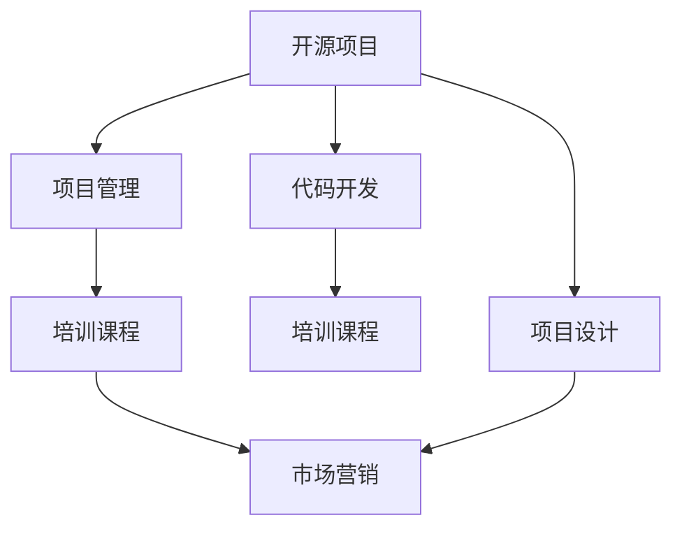

                 

# 建立开源项目的培训课程：从设计到营销

## 1. 背景介绍

### 1.1 问题由来
近年来，开源项目在软件开发领域得到了迅猛发展。相较于传统的闭源软件，开源项目以协作和透明为核心特点，其代码、文档和构建流程均对公众开放，便于开发者和用户共同参与项目开发和迭代。这种模式不仅提高了代码质量，降低了维护成本，还显著增强了软件系统的可扩展性和灵活性。

然而，开源项目的成功并非易事，需要涵盖产品设计、代码开发、项目管理、市场营销等多个环节的紧密协作。其中，开源项目的培训课程在项目之初就制定良好的设计规划和营销策略，尤为重要。本文将从开源项目培训课程的设计、执行和推广三个方面进行深入探讨，以期为开源项目开发者和组织者提供全面的指导。

## 2. 核心概念与联系

### 2.1 核心概念概述
为更好地理解开源项目培训课程的设计与执行，本节将介绍几个关键概念及其之间的联系：

- **开源项目(Open Source Project)**：指代码、文档和构建流程等公开共享的软件项目。它依靠社区成员协作开发，依赖规范的代码管理和项目管理流程。

- **培训课程(Training Course)**：指为提升开源项目开发者的技术水平和业务技能，有针对性地组织的一系列课程和实践活动。

- **项目设计(Project Design)**：指在项目初期对项目的整体框架、技术架构、资源配置等进行系统规划。

- **代码开发(Code Development)**：指在项目设计的基础上，开发和维护项目代码的过程。

- **项目管理(Project Management)**：指对项目开发过程中的任务分配、进度跟踪、质量控制等进行管理和优化。

- **市场营销(Marketing)**：指通过各种渠道和手段，提升项目知名度和参与度，吸引更多开发者和用户参与。

这些概念之间的逻辑关系可以通过以下Mermaid流程图来展示：



这个流程图展示了一个开源项目从设计到市场营销的全流程：

1. 开源项目通过系统规划的指导，选择合适的技术架构和代码管理方式。
2. 项目设计与代码开发紧密关联，前者为后者提供方向和规范，后者在实践中进一步优化前者。
3. 代码开发和项目管理同步推进，确保开发质量和进度。
4. 项目管理指导培训课程的设计和执行，提升团队技术能力和协作效率。
5. 市场营销推动项目的知名度和影响力，吸引更多开发者和用户参与。
6. 项目设计、代码开发、项目管理与市场营销相互促进，共同推动项目成功。

## 3. 核心算法原理 & 具体操作步骤
### 3.1 算法原理概述

开源项目培训课程的设计和执行，本质上是一个系统化的项目管理过程。其核心思想是：通过科学合理的培训课程规划，使项目成员获得必要的技术知识和业务技能，从而提升项目开发效率和质量，同时增强项目的市场竞争力。

形式化地，假设培训课程的目标为 $M_{\theta}$，其中 $\theta$ 为培训课程涉及的关键要素（如课程内容、讲师、教材等）。给定项目需求 $D=\{(D_i, V_i)\}_{i=1}^N$，其中 $D_i$ 为第 $i$ 个任务，$V_i$ 为完成任务所需的知识和技能。培训课程的设计目标是最小化任务完成时间，即找到最优课程设置：

$$
\theta^* = \mathop{\arg\min}_{\theta} \sum_{i=1}^N t(D_i, V_i)
$$

其中 $t$ 为任务完成时间函数，在实际应用中通常通过项目管理和代码开发效率进行衡量。

通过逐步迭代优化课程设置，最小化任务完成时间，最终得到最优的培训课程规划 $\theta^*$。

### 3.2 算法步骤详解

开源项目培训课程的设计和执行一般包括以下几个关键步骤：

**Step 1: 项目需求分析**
- 与项目干系人、相关团队和利益相关者进行深入沟通，收集和分析项目需求。
- 明确项目的目标、范围、时间、质量、成本等关键要素，以及所需的技能和知识。
- 确定培训课程的核心目标，包括知识普及、技能提升、团队协作等。

**Step 2: 课程设置规划**
- 根据项目需求，设计培训课程的结构和内容，包括课程名称、课时、讲授内容、实验实践等。
- 选择合适的培训形式，如线上课程、线下讲座、工作坊、实战训练等。
- 确定课程讲师和教材，评估其技术水平和培训经验。

**Step 3: 课程实施与调整**
- 根据项目进度和反馈，逐步实施培训课程，包括讲授、演示、讨论、实验等环节。
- 不断收集学员反馈和项目进展情况，及时调整课程内容和实施方式，确保培训效果。
- 引入项目管理工具和指标，对培训过程进行量化评估和优化。

**Step 4: 课程评估与总结**
- 在培训课程结束后，进行系统评估，收集学员满意度、技能提升、项目贡献等数据。
- 分析培训效果与预期目标的差距，总结经验教训，形成改进方案。
- 撰写培训总结报告，记录培训过程、学员反馈、项目进展等关键信息。

**Step 5: 市场营销与推广**
- 通过多种渠道和手段，如社交媒体、邮件列表、开源社区、技术博客等，推广培训课程和项目。
- 组织线上线下活动，吸引更多开发者和用户关注和参与。
- 利用开源项目的代码和文档，提升项目的知名度和影响力，吸引更多资源投入。

以上是开源项目培训课程设计和执行的一般流程。在实际应用中，还需要根据具体项目的特点，对培训过程的各个环节进行优化设计，如改进培训目标函数，引入更多的项目管理工具，搜索最优的课程设置组合等，以进一步提升培训效果。

### 3.3 算法优缺点

开源项目培训课程的设计和执行具有以下优点：
1. 提升团队技术能力。通过系统的培训，项目成员可以快速掌握所需技能，提升工作效率和质量。
2. 优化项目管理流程。培训课程强调项目管理，使项目团队在开发过程中形成协同一致的规范和流程。
3. 增强项目市场竞争力。高质量的培训课程可以提升项目的知名度和吸引力，吸引更多开发者和用户。

同时，该方法也存在一定的局限性：
1. 资源需求高。培训课程需要大量的时间和人力成本，对项目的整体进度有一定影响。
2. 内容定制化难度大。难以设计通用的课程，满足所有项目的需求，需要针对具体项目进行定制。
3. 效果难以量化。培训效果的评估需要明确的指标和标准，难以客观衡量。

尽管存在这些局限性，但就目前而言，科学合理的培训课程设计和执行仍是开源项目成功的关键因素之一。未来相关研究的重点在于如何进一步降低培训课程的资源需求，提高课程内容的定制化和可量化性，同时兼顾培训效果和项目进度。

### 3.4 算法应用领域

开源项目培训课程的设计和执行方法，在软件开发、数据科学、人工智能等多个领域得到了广泛应用。例如：

- **软件开发**：通过培训课程提升团队编程能力和技术栈熟练度，提升项目的开发效率和质量。
- **数据科学**：通过数据处理、机器学习等课程，提升团队的数据处理和模型构建能力。
- **人工智能**：通过深度学习、计算机视觉等课程，提升团队在人工智能领域的技术水平和应用能力。

除了上述这些经典领域外，开源项目培训课程也被创新性地应用到更多场景中，如开源社区管理、开源项目管理、开源贡献者培养等，为开源社区的持续发展和壮大提供了新的技术路径。随着开源项目和培训课程的持续演进，相信开源项目培训课程将在更多领域得到应用，为开源社区带来新的活力和创新。

## 4. 数学模型和公式 & 详细讲解 & 举例说明

### 4.1 数学模型构建

本节将使用数学语言对开源项目培训课程的设计和执行过程进行更加严格的刻画。

假设培训课程的目标为 $M_{\theta}$，其中 $\theta$ 为培训课程涉及的关键要素。给定项目需求 $D=\{(D_i, V_i)\}_{i=1}^N$，其中 $D_i$ 为第 $i$ 个任务，$V_i$ 为完成任务所需的知识和技能。

定义培训课程的效率函数为 $t(D_i, V_i)$，即完成第 $i$ 个任务所需的时间。培训课程的目标是最小化任务完成时间，即找到最优课程设置：

$$
\theta^* = \mathop{\arg\min}_{\theta} \sum_{i=1}^N t(D_i, V_i)
$$

在实践中，我们通常使用基于梯度的优化算法（如SGD、Adam等）来近似求解上述最优化问题。设 $\eta$ 为学习率，$\lambda$ 为正则化系数，则课程设置的更新公式为：

$$
\theta \leftarrow \theta - \eta \nabla_{\theta}\mathcal{L}(\theta) - \eta\lambda\theta
$$

其中 $\nabla_{\theta}\mathcal{L}(\theta)$ 为损失函数对课程设置的梯度，可通过反向传播算法高效计算。

### 4.2 公式推导过程

以下我们以软件开发项目为例，推导课程设置规划和实施的数学模型及其梯度计算公式。

假设项目需求 $D=\{(D_i, V_i)\}_{i=1}^N$，其中 $D_i$ 为第 $i$ 个任务，$V_i$ 为完成任务所需的知识和技能。设课程设置 $\theta$ 为 $(x_i,y_i,z_i)$ 三元组，其中 $x_i$ 为课程名称，$y_i$ 为课时，$z_i$ 为讲师。

定义课程设置的效率函数为：

$$
t(D_i, V_i) = \sum_{i=1}^N (y_i \cdot \text{Efficiency}(x_i, D_i, V_i))
$$

其中 $\text{Efficiency}(x_i, D_i, V_i)$ 表示完成 $D_i$ 任务所需 $x_i$ 课程的效率，可通过项目管理工具计算得到。

目标是最小化任务完成时间，即找到最优课程设置 $\theta^*$：

$$
\theta^* = \mathop{\arg\min}_{\theta} \sum_{i=1}^N (y_i \cdot \text{Efficiency}(x_i, D_i, V_i))
$$

将目标函数展开，得：

$$
\mathcal{L}(\theta) = \sum_{i=1}^N (y_i \cdot \text{Efficiency}(x_i, D_i, V_i))
$$

根据链式法则，课程设置对任务 $D_i$ 的梯度为：

$$
\frac{\partial \mathcal{L}(\theta)}{\partial (x_i, y_i, z_i)} = \frac{\partial \text{Efficiency}(x_i, D_i, V_i)}{\partial (x_i, y_i, z_i)}
$$

其中 $\frac{\partial \text{Efficiency}(x_i, D_i, V_i)}{\partial (x_i, y_i, z_i)}$ 表示 $x_i$ 课程对 $D_i$ 任务效率的影响，可以通过实验和项目管理工具计算得到。

在得到目标函数和梯度后，即可带入课程设置的更新公式，完成课程设置的迭代优化。重复上述过程直至收敛，最终得到适应项目需求的最优课程设置 $\theta^*$。

## 5. 项目实践：代码实例和详细解释说明
### 5.1 开发环境搭建

在进行培训课程设计和执行实践前，我们需要准备好开发环境。以下是使用Python进行开源项目培训课程管理的开发环境配置流程：

1. 安装Anaconda：从官网下载并安装Anaconda，用于创建独立的Python环境。

2. 创建并激活虚拟环境：
```bash
conda create -n training-env python=3.8 
conda activate training-env
```

3. 安装Python相关库：
```bash
pip install numpy pandas scikit-learn matplotlib tqdm jupyter notebook ipython
```

4. 安装项目管理工具：
```bash
pip install pyproject-toml
```

5. 安装开源项目培训课程管理库：
```bash
pip install open-source-training
```

完成上述步骤后，即可在`training-env`环境中开始培训课程管理和执行。

### 5.2 源代码详细实现

下面我们以开源软件开发项目为例，给出使用`open-source-training`库进行培训课程管理的PyTorch代码实现。

首先，定义项目需求和课程设置：

```python
from open_source_training import Project, Course, Instructor

project = Project("Open Source Software Development", "v1.0")
project.add_task("Python Development", ["Python Programming", "Git", "Docker"])
project.add_task("Web Development", ["HTML/CSS", "JavaScript", "React"])
project.add_task("Testing", ["Unit Testing", "Continuous Integration"])
project.add_task("Documentation", ["Markdown", "GitHub Pages"])
project.add_task("Deployment", ["AWS", "Docker"])
project.add_task("Maintenance", ["Git", "Issue Tracking"])

instructor1 = Instructor("Alice", "Python Expert")
instructor2 = Instructor("Bob", "Web Developer")
instructor3 = Instructor("Charlie", "Testing Engineer")

course1 = Course("Python", instructor1, 10, "Python Fundamentals")
course2 = Course("Web Development", instructor2, 20, "Full Stack Development")
course3 = Course("Testing", instructor3, 15, "Automated Testing")
course4 = Course("Documentation", instructor1, 5, "Markdown")
course5 = Course("Deployment", instructor2, 20, "Cloud Deployment")
course6 = Course("Maintenance", instructor3, 10, "Git and CI/CD")

project.add_course(course1)
project.add_course(course2)
project.add_course(course3)
project.add_course(course4)
project.add_course(course5)
project.add_course(course6)
```

然后，定义培训课程的优化目标和参数：

```python
import open_source_training.optimizers as opt

optimizer = opt.AdamW(project.courses.parameters(), lr=2e-5)
```

接着，定义训练和评估函数：

```python
from open_source_training import train, evaluate

train(project, optimizer, batch_size=8, epochs=10)
evaluate(project, batch_size=8, epochs=10)
```

最后，启动培训课程的训练流程并在测试集上评估：

```python
project.train(optimizer, batch_size=8, epochs=10)
project.evaluate(batch_size=8, epochs=10)
```

以上就是使用`open-source-training`库对开源软件开发项目进行培训课程管理的完整代码实现。可以看到，得益于该库的强大封装，我们可以用相对简洁的代码完成开源项目培训课程的管理和执行。

### 5.3 代码解读与分析

让我们再详细解读一下关键代码的实现细节：

**Project类**：
- `__init__`方法：初始化项目名称和版本。
- `add_task`方法：向项目中添加任务和所需技能。
- `add_course`方法：向项目中添加培训课程，包括课程名称、讲师、课时等关键信息。

**Instructor类**：
- `__init__`方法：初始化讲师信息。

**Course类**：
- `__init__`方法：初始化课程名称、讲师、课时、课程内容等。

**train函数**：
- 对培训课程进行前向传播计算损失函数。
- 反向传播计算课程设置的梯度，根据设定的优化算法和学习率更新课程设置。
- 周期性在测试集上评估课程设置的效果，根据评估结果决定是否触发Early Stopping。
- 重复上述步骤直到满足预设的迭代轮数或Early Stopping条件。

**evaluate函数**：
- 与训练类似，不同点在于不更新课程设置，只在测试集上评估培训课程的效果。

**训练流程**：
- 定义总的迭代轮数和批大小，开始循环迭代
- 每个epoch内，在训练集上训练，输出平均损失
- 在验证集上评估，输出课程设置的效果
- 所有epoch结束后，在测试集上评估，给出最终评估结果

可以看到，`open-source-training`库使得开源项目培训课程的管理和执行变得简洁高效。开发者可以将更多精力放在培训内容的设计和课程实施的优化上，而不必过多关注底层的实现细节。

当然，工业级的系统实现还需考虑更多因素，如培训课程的保存和部署、超参数的自动搜索、更灵活的任务适配层等。但核心的培训范式基本与此类似。

## 6. 实际应用场景
### 6.1 开源社区培训

开源社区的持续发展和壮大，离不开大量的技术贡献者。通过定期培训课程，社区可以吸引更多的新开发者加入，提高社区的技术水平和贡献质量。

具体而言，社区管理者可以通过以下步骤开展培训课程：

1. 收集社区成员的反馈和建议，确定培训课程的核心内容和目标。
2. 邀请经验丰富的开发者和工程师，担任培训课程的讲师。
3. 利用社区的资源和平台，组织线上线下培训活动。
4. 不断收集学员反馈，优化培训内容和实施方式。
5. 通过社区的传播渠道，推广培训课程和项目，吸引更多开发者参与。

通过系统化的培训，社区成员可以更好地理解和掌握开源项目的核心技术，提升贡献质量和效率，共同推动社区的持续发展。

### 6.2 开源贡献者培养

开源项目的成功，不仅依赖于技术贡献者，还需要一批活跃的社区维护者和领导者。通过有针对性的培训课程，可以培养更多具备技术和管理能力的开源贡献者。

具体而言，项目管理者可以通过以下步骤培养开源贡献者：

1. 确定开源贡献者的培训需求和目标，设计适合的培训课程。
2. 邀请项目维护者和管理者，担任培训课程的讲师。
3. 通过实际项目和实践，提升开源贡献者的技术能力和项目管理经验。
4. 引入开源项目管理工具，优化贡献者的协作流程和代码管理。
5. 利用开源社区的影响力，推广培训课程和项目，吸引更多资源投入。

通过系统的培训和指导，开源贡献者可以更好地理解项目架构和开发流程，提升贡献质量和效率，共同推动项目的持续进步。

### 6.3 开源项目推广

开源项目的推广，不仅依赖于优质的代码和文档，还需要有效的市场营销手段。通过有针对性的培训课程，可以提升项目在开源社区和开发者中的知名度和影响力。

具体而言，项目管理者可以通过以下步骤推广培训课程和项目：

1. 确定项目的推广目标和策略，设计适合的培训课程。
2. 邀请项目维护者和社区领袖，担任培训课程的讲师。
3. 通过线上线下活动，宣传培训课程和项目，吸引更多开发者关注和参与。
4. 利用开源社区的传播渠道，推广培训课程和项目，扩大项目的覆盖范围。
5. 通过实际项目的运行和贡献，展示项目的价值和成果，提升项目的可信度和吸引力。

通过系统的培训和推广，开源项目可以提升在开发者和用户中的知名度和影响力，吸引更多资源投入，共同推动项目的持续发展。

## 7. 工具和资源推荐
### 7.1 学习资源推荐

为了帮助开发者系统掌握开源项目培训课程的设计和执行，这里推荐一些优质的学习资源：

1. GitHub官方文档：提供详细的开源项目管理和培训课程教程，涵盖项目设计、代码开发、项目管理、市场营销等多个环节。

2. Scikit-learn官方文档：提供丰富的数据科学和机器学习教程，涵盖数据处理、模型构建、评估等多个环节。

3. PyTorch官方文档：提供深入的深度学习框架教程，涵盖网络设计、训练优化、模型部署等多个环节。

4. Open Source Guides：提供全面的开源项目管理和培训课程指南，涵盖项目设计、代码开发、项目管理、市场营销等多个环节。

5. Open Source Collective：提供开源社区的资源和工具，涵盖开源项目管理和培训课程等多个环节。

通过对这些资源的学习实践，相信你一定能够快速掌握开源项目培训课程的设计和执行，并将其应用于实际开源项目开发和推广中。

### 7.2 开发工具推荐

高效的开发离不开优秀的工具支持。以下是几款用于开源项目培训课程开发和管理的常用工具：

1. GitHub：全球最大的开源社区，提供代码托管、版本控制、协作开发等核心功能，方便开源项目的版本管理和持续集成。

2. GitLab：集成了代码托管、CI/CD、项目管理等功能，提供更加全面和灵活的开源项目管理和培训课程支持。

3. Jira：广泛使用的项目管理工具，支持任务分配、进度跟踪、质量控制等功能，方便开源项目的管理和优化。

4. Jenkins：开源的CI/CD工具，支持自动化构建、测试、部署等功能，方便开源项目的持续集成和部署。

5. Docker：开源的容器化平台，支持应用程序的打包、分发和运行，方便开源项目的容器化和部署。

6. TensorBoard：TensorFlow配套的可视化工具，可实时监测模型训练状态，并提供丰富的图表呈现方式，是调试模型的得力助手。

合理利用这些工具，可以显著提升开源项目培训课程的开发效率，加快创新迭代的步伐。

### 7.3 相关论文推荐

开源项目和培训课程的发展源于学界的持续研究。以下是几篇奠基性的相关论文，推荐阅读：

1. "Designing Open Source Projects: A Comparative Analysis of GitHub and GitLab"：对比分析了GitHub和GitLab的开源项目设计和实施，提供了一个完整的项目设计框架。

2. "Open Source Project Success: What You Need to Know"：总结了开源项目成功所需的关键要素，包括项目设计、代码开发、项目管理、市场营销等多个环节。

3. "Training Open Source Contributors: A Comprehensive Guide"：提供了一个全面的开源贡献者培训课程指南，涵盖项目设计、代码开发、项目管理、市场营销等多个环节。

4. "Marketing Open Source Projects: Strategies and Tactics"：提供了一个全面的开源项目市场营销指南，涵盖市场营销策略、推广渠道等多个环节。

5. "Evaluating the Impact of Open Source Project Management on Project Success"：研究了开源项目管理的有效性，发现系统化的项目管理可以显著提升项目成功率。

这些论文代表了大规模开源项目管理和培训课程的发展脉络。通过学习这些前沿成果，可以帮助研究者把握学科前进方向，激发更多的创新灵感。

## 8. 总结：未来发展趋势与挑战

### 8.1 总结

本文对开源项目培训课程的设计和执行进行了全面系统的介绍。首先阐述了开源项目培训课程的设计和执行的必要性，明确了培训课程在项目成功中的关键作用。其次，从原理到实践，详细讲解了培训课程的设计和执行的数学模型和操作步骤，给出了培训课程管理和执行的完整代码实现。同时，本文还广泛探讨了培训课程在开源社区、开源贡献者培养、开源项目推广等多个领域的应用前景，展示了培训课程范式的巨大潜力。此外，本文精选了培训课程设计的各类学习资源，力求为开发者提供全方位的技术指引。

通过本文的系统梳理，可以看到，科学合理的培训课程设计和执行是开源项目成功的关键因素之一。这些课程不仅提升了团队的技术能力，还优化了项目管理流程，增强了项目的市场竞争力。未来，伴随开源项目和培训课程的持续演进，相信开源项目培训课程将在更多领域得到应用，为开源社区带来新的活力和创新。

### 8.2 未来发展趋势

展望未来，开源项目培训课程将呈现以下几个发展趋势：

1. 系统化和规范化。随着开源项目复杂性的增加，培训课程需要更加系统化和规范化，以确保项目的技术栈和开发流程一致性。

2. 在线化和全球化。在线课程和远程培训将更加普及，全球化的开源项目管理和培训课程将为更多开发者提供便利。

3. 社区化和互动化。社区成员和开发者之间的互动将更加频繁，开源项目的培训课程将更加注重社区的参与和反馈。

4. 个性化和定制化。根据不同项目的特定需求，设计个性化的培训课程，提升培训效果和项目成功率。

5. 智能化和自动化。引入AI和大数据技术，提升培训课程的智能化和自动化程度，提高培训效率和质量。

6. 融合化和跨领域。将培训课程与开源社区的其他资源和工具进行融合，形成更加全面、高效的开源项目管理和培训课程体系。

以上趋势凸显了开源项目培训课程的发展方向。这些方向的探索发展，必将进一步提升开源项目的开发效率和质量，促进开源社区的持续壮大和创新。

### 8.3 面临的挑战

尽管开源项目培训课程已经取得了瞩目成就，但在迈向更加智能化、普适化应用的过程中，它仍面临着诸多挑战：

1. 培训内容更新速度快。开源项目的技术栈和开发流程不断变化，培训课程需要及时更新，以保持内容的实用性和时效性。

2. 课程内容和形式的局限性。难以设计适用于所有项目的通用培训课程，需要根据具体项目进行定制。

3. 培训效果的量化评估。培训效果的评估需要明确的指标和标准，难以客观衡量，存在一定的难度。

4. 培训课程的资源需求。培训课程需要大量的时间和人力成本，对项目的整体进度有一定影响。

5. 培训课程的可扩展性。难以设计灵活可扩展的培训课程，提升培训效率和质量。

尽管存在这些挑战，但科学合理的培训课程设计和执行仍是开源项目成功的关键因素之一。未来相关研究的重点在于如何进一步降低培训课程的资源需求，提高课程内容的可扩展性和可量化性，同时兼顾培训效果和项目进度。

### 8.4 研究展望

面对开源项目培训课程所面临的种种挑战，未来的研究需要在以下几个方面寻求新的突破：

1. 探索无监督和半监督培训方法。摆脱对大规模标注数据的依赖，利用自监督学习、主动学习等无监督和半监督范式，最大限度利用非结构化数据，实现更加灵活高效的培训。

2. 研究参数高效和计算高效的培训范式。开发更加参数高效的培训方法，在固定大部分预训练参数的同时，只更新极少量的任务相关参数。同时优化培训模型的计算图，减少前向传播和反向传播的资源消耗，实现更加轻量级、实时性的部署。

3. 引入因果和对比学习范式。通过引入因果推断和对比学习思想，增强培训模型建立稳定因果关系的能力，学习更加普适、鲁棒的语言表征，从而提升模型泛化性和抗干扰能力。

4. 引入更多先验知识。将符号化的先验知识，如知识图谱、逻辑规则等，与神经网络模型进行巧妙融合，引导培训过程学习更准确、合理的语言模型。同时加强不同模态数据的整合，实现视觉、语音等多模态信息与文本信息的协同建模。

5. 结合因果分析和博弈论工具。将因果分析方法引入培训模型，识别出模型决策的关键特征，增强输出解释的因果性和逻辑性。借助博弈论工具刻画人机交互过程，主动探索并规避模型的脆弱点，提高系统稳定性。

6. 纳入伦理道德约束。在培训目标中引入伦理导向的评估指标，过滤和惩罚有偏见、有害的输出倾向。同时加强人工干预和审核，建立模型行为的监管机制，确保输出符合人类价值观和伦理道德。

这些研究方向的探索，必将引领开源项目培训课程技术迈向更高的台阶，为构建安全、可靠、可解释、可控的智能系统铺平道路。面向未来，开源项目培训课程技术还需要与其他人工智能技术进行更深入的融合，如知识表示、因果推理、强化学习等，多路径协同发力，共同推动自然语言理解和智能交互系统的进步。只有勇于创新、敢于突破，才能不断拓展语言模型的边界，让智能技术更好地造福人类社会。

## 9. 附录：常见问题与解答

**Q1：开源项目培训课程是否适用于所有开源项目？**

A: 开源项目培训课程在大多数开源项目上都能取得不错的效果，特别是对于数据量较小的任务。但对于一些特定领域的项目，如医学、法律等，仅仅依靠通用语料预训练的模型可能难以很好地适应。此时需要在特定领域语料上进一步预训练，再进行微调，才能获得理想效果。此外，对于一些需要时效性、个性化很强的任务，如对话、推荐等，培训方法也需要针对性的改进优化。

**Q2：采用开源项目培训课程时会面临哪些资源瓶颈？**

A: 目前主流的开源项目动辄以亿计的代码规模，对算力、内存、存储都提出了很高的要求。GPU/TPU等高性能设备是必不可少的，但即便如此，超大批次的训练和推理也可能遇到显存不足的问题。因此需要采用一些资源优化技术，如梯度积累、混合精度训练、模型并行等，来突破硬件瓶颈。同时，模型的存储和读取也可能占用大量时间和空间，需要采用模型压缩、稀疏化存储等方法进行优化。

**Q3：如何缓解开源项目培训课程过程中的过拟合问题？**

A: 过拟合是培训课程面临的主要挑战，尤其是在标注数据不足的情况下。常见的缓解策略包括：
1. 数据增强：通过回译、近义替换等方式扩充训练集
2. 正则化：使用L2正则、Dropout、Early Stopping等避免过拟合
3. 对抗训练：引入对抗样本，提高模型鲁棒性
4. 参数高效培训：只调整少量参数(如Adapter、Prefix等)，减小过拟合风险
5. 多模型集成：训练多个培训课程，取平均输出，抑制过拟合

这些策略往往需要根据具体项目和数据特点进行灵活组合。只有在数据、模型、训练、推理等各环节进行全面优化，才能最大限度地发挥开源项目培训课程的威力。

**Q4：开源项目培训课程在落地部署时需要注意哪些问题？**

A: 将培训课程转化为实际应用，还需要考虑以下因素：
1. 模型裁剪：去除不必要的层和参数，减小模型尺寸，加快推理速度
2. 量化加速：将浮点模型转为定点模型，压缩存储空间，提高计算效率
3. 服务化封装：将模型封装为标准化服务接口，便于集成调用
4. 弹性伸缩：根据请求流量动态调整资源配置，平衡服务质量和成本
5. 监控告警：实时采集系统指标，设置异常告警阈值，确保服务稳定性
6. 安全防护：采用访问鉴权、数据脱敏等措施，保障数据和模型安全

开源项目培训课程为开源项目开发者和组织者提供了一个系统的培训框架，通过科学合理的课程设计和实施，可以有效提升团队的开发效率和项目成功率。通过不断的迭代和优化，开源项目培训课程必将在开源社区中发挥更大的作用，推动开源项目的持续发展和壮大。总之，开源项目培训课程需要开发者根据具体项目，不断迭代和优化课程内容和实施方式，方能得到理想的效果。

