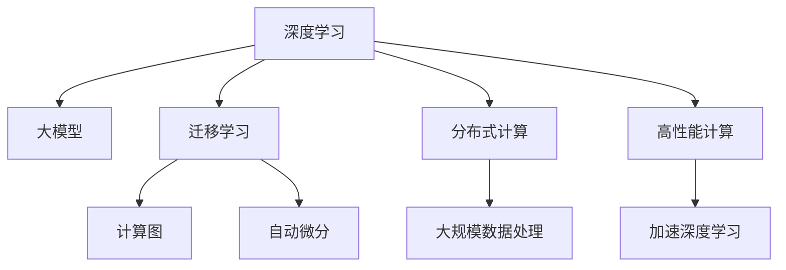

                 

## 1. 背景介绍

### 1.1 问题由来

在人工智能(AI)和计算科学发展的历史长河中，计算模式经历了从经典计算到分布式计算，再到量子计算的演变。每一次计算模式的变革，都极大地拓展了计算的能力和应用场景，推动了科技进步和人类社会的进步。

当前，深度学习和机器学习技术的兴起，开启了计算科学的新篇章。特别是大模型的出现，极大提升了计算效率和应用效果，并改变了各行各业的工作方式。从自然语言处理、图像识别，到自动驾驶、药物发现，大模型的应用遍及多个领域，展现了强大的潜力和价值。

### 1.2 问题核心关键点

面对这种新型的计算模式，我们需要重新审视和理解计算的原理、方法和应用。本文聚焦于深度学习和计算科学的新范式，探讨其原理和应用，旨在通过学习和思考，为读者提供深入的技术见解和未来展望。

## 2. 核心概念与联系

### 2.1 核心概念概述

为更好地理解深度学习和计算科学的新范式，本节将介绍几个关键概念：

- **深度学习(Deep Learning)**：利用多层神经网络模型进行复杂数据分析和预测的技术。其核心思想是通过多层抽象，从原始数据中提取出高级特征，从而实现更为精确的预测和分类。

- **大模型(Large Model)**：以自回归模型(如GPT)或自编码模型(如BERT)为代表的超大规模预训练模型。通过在海量数据上进行预训练，学习到丰富的语言、图像或信号表示，具备强大的通用学习能力和泛化能力。

- **迁移学习(Transfer Learning)**：利用在不同任务间共享的知识，以减少新任务所需标注数据量的学习范式。大模型的预训练过程本身就是一个典型的迁移学习过程。

- **计算图(Computation Graph)**：深度学习模型的核心组成部分，描述模型中各个层和节点之间的数据流动关系。通过计算图，可以高效地实现模型的前向传播和反向传播。

- **自动微分(Automatic Differentiation)**：深度学习中用于计算模型参数梯度的技术。自动微分可以极大地降低手动计算梯度的复杂度，使得模型训练和优化变得更加高效。

- **分布式计算(Distributed Computing)**：将计算任务分布在多个计算节点上进行并行处理的技术。分布式计算大大提高了计算速度和处理能力，可以处理大规模数据集和复杂任务。

这些核心概念之间的逻辑关系可以通过以下Mermaid流程图来展示：



这个流程图展示了深度学习和计算科学中几个核心概念及其之间的关系：

1. 深度学习利用大模型进行复杂数据分析和预测。
2. 大模型通过迁移学习在多个任务间共享知识。
3. 计算图和自动微分是深度学习模型的核心。
4. 分布式计算提高了深度学习模型的处理能力。
5. 高性能计算和大规模数据处理进一步加速了深度学习的发展。

这些概念共同构成了深度学习和计算科学的理论基础，为模型的构建、训练和应用提供了重要支撑。通过理解这些核心概念，我们可以更好地把握深度学习和大模型的发展脉络。

## 3. 核心算法原理 & 具体操作步骤
### 3.1 算法原理概述

深度学习的核心在于构建多层神经网络模型，通过反向传播算法优化模型参数，从而实现对输入数据的高级抽象和预测。其核心思想是通过多层非线性映射，从原始数据中学习出复杂的表示，从而提升模型的泛化能力和预测精度。

形式化地，设一个深度学习模型为 $M(\mathbf{x}; \theta)$，其中 $\mathbf{x}$ 为输入数据，$\theta$ 为模型参数。模型的损失函数为 $L(M(\mathbf{x}; \theta), y)$，其中 $y$ 为模型预测输出与真实标签之间的差异。深度学习的目标是找到最优参数 $\theta^*$，使得损失函数最小化：

$$
\theta^* = \arg\min_{\theta} \mathbb{E}_{\mathbf{x},y} [L(M(\mathbf{x}; \theta), y)]
$$

通过反向传播算法，模型参数 $\theta$ 的更新公式为：

$$
\theta \leftarrow \theta - \eta \nabla_{\theta}L(M(\mathbf{x}; \theta), y)
$$

其中 $\eta$ 为学习率，$\nabla_{\theta}L(M(\mathbf{x}; \theta), y)$ 为损失函数对参数 $\theta$ 的梯度，可通过自动微分技术高效计算。

### 3.2 算法步骤详解

深度学习模型的构建和训练一般包括以下关键步骤：

**Step 1: 设计模型结构**
- 选择适当的神经网络结构，如卷积神经网络(CNN)、循环神经网络(RNN)、Transformer等。
- 确定网络层数、每层神经元数等超参数。

**Step 2: 数据准备**
- 收集和预处理训练数据集，划分为训练集、验证集和测试集。
- 对数据进行归一化、标准化等预处理，确保模型训练的稳定性。

**Step 3: 初始化参数**
- 使用随机或预定义的方法初始化模型参数。

**Step 4: 前向传播**
- 将输入数据 $\mathbf{x}$ 输入模型，进行前向传播计算。

**Step 5: 计算损失**
- 将模型的预测输出与真实标签 $y$ 进行对比，计算损失函数 $L(M(\mathbf{x}; \theta), y)$。

**Step 6: 反向传播**
- 使用反向传播算法计算损失函数对模型参数的梯度，更新参数。

**Step 7: 模型评估**
- 在验证集上评估模型的性能，调整超参数。
- 在测试集上评估模型的最终性能。

### 3.3 算法优缺点

深度学习的优点包括：

- 强大的数据处理能力：深度学习模型可以高效处理大规模、高维度的数据。
- 出色的泛化能力：通过多层的抽象映射，深度学习模型能够学习出更加复杂的特征表示。
- 广泛的适用性：深度学习模型可以应用于图像识别、自然语言处理、语音识别等多个领域。

同时，深度学习也存在一些缺点：

- 计算资源需求高：深度学习模型通常需要大量的计算资源和时间进行训练。
- 参数调节复杂：深度学习模型的训练过程涉及大量超参数调节，需要经验和经验积累。
- 可解释性差：深度学习模型往往是"黑盒"系统，难以解释其内部工作机制和决策逻辑。

尽管存在这些缺点，但深度学习在多个领域的成功应用，证明了其强大的潜力和应用价值。未来，随着计算资源和技术的进步，深度学习将进一步拓展其应用边界，推动人类计算进入新的发展阶段。

### 3.4 算法应用领域

深度学习的应用领域十分广泛，涵盖了以下主要领域：

- **自然语言处理(NLP)**：包括机器翻译、语音识别、文本分类、情感分析等。深度学习模型如BERT、GPT-3在NLP领域取得了诸多突破。
- **计算机视觉(CV)**：包括图像分类、目标检测、图像生成等。深度学习模型如ResNet、Inception等在CV领域表现出色。
- **语音处理(AI)**：包括语音识别、语音合成、情感识别等。深度学习模型如Tacotron、WaveNet等在语音处理中应用广泛。
- **自动驾驶(Autonomous Driving)**：包括车辆控制、路径规划、交通预测等。深度学习模型如LaneNet、POSL等在自动驾驶中发挥作用。
- **医疗诊断(Medical Diagnosis)**：包括医学影像分析、基因组学分析等。深度学习模型如NetSurgeon、MGB等在医疗领域展现了潜力。
- **金融分析(Financial Analysis)**：包括股票预测、信用评估等。深度学习模型如LSTM、GAN等在金融分析中有所应用。

除此之外，深度学习还在游戏AI、推荐系统、个性化推荐等领域取得了显著成效，进一步拓展了其应用场景。

## 4. 数学模型和公式 & 详细讲解  
### 4.1 数学模型构建

设一个深度学习模型为 $M(\mathbf{x}; \theta)$，其中 $\mathbf{x}$ 为输入数据，$\theta$ 为模型参数。假设模型为三层神经网络，其结构和超参数如下：

$$
M(\mathbf{x}; \theta) = W_3 \sigma(W_2 x + b_2) + b_3
$$

其中 $W_2, b_2, W_3, b_3$ 为模型参数，$\sigma$ 为激活函数。

模型的损失函数为交叉熵损失函数：

$$
L(M(\mathbf{x}; \theta), y) = -\frac{1}{N} \sum_{i=1}^N \log P(y_i|\mathbf{x}_i)
$$

其中 $P(y_i|\mathbf{x}_i)$ 为模型对输入 $\mathbf{x}_i$ 进行分类预测的概率分布。

### 4.2 公式推导过程

假设模型的训练集为 $D=\{(\mathbf{x}_i, y_i)\}_{i=1}^N$，其中 $\mathbf{x}_i \in \mathbb{R}^d$，$y_i \in \{0,1\}$。模型的梯度更新公式为：

$$
\theta \leftarrow \theta - \eta \nabla_{\theta}L(M(\mathbf{x}; \theta), y)
$$

其中 $\eta$ 为学习率。

假设模型为三层神经网络，其前向传播计算公式为：

$$
h_1 = \sigma(W_1 x + b_1)
$$

$$
h_2 = \sigma(W_2 h_1 + b_2)
$$

$$
y = W_3 h_2 + b_3
$$

其中 $x \in \mathbb{R}^d$，$h_1, h_2 \in \mathbb{R}^n$，$y \in \mathbb{R}$。

模型的交叉熵损失函数为：

$$
L = -\frac{1}{N} \sum_{i=1}^N \log P(y_i|\mathbf{x}_i)
$$

其中 $P(y_i|\mathbf{x}_i) = \sigma(W_3 h_2 + b_3)$。

### 4.3 案例分析与讲解

以手写数字识别为例，展示深度学习模型的应用。假设我们有一个手写数字数据集，其中包含5000张28x28的图像，标签为0-9之间的整数。我们可以使用卷积神经网络(CNN)对数据进行分类。

首先，对图像进行预处理，将其归一化到[0, 1]之间。然后，构建一个包含两个卷积层和两个全连接层的CNN模型：

```python
import torch.nn as nn
import torch.nn.functional as F
import torch

class CNN(nn.Module):
    def __init__(self):
        super(CNN, self).__init__()
        self.conv1 = nn.Conv2d(1, 32, kernel_size=3, padding=1)
        self.conv2 = nn.Conv2d(32, 64, kernel_size=3, padding=1)
        self.fc1 = nn.Linear(64*7*7, 128)
        self.fc2 = nn.Linear(128, 10)

    def forward(self, x):
        x = F.relu(self.conv1(x))
        x = F.max_pool2d(x, 2)
        x = F.relu(self.conv2(x))
        x = F.max_pool2d(x, 2)
        x = x.view(-1, 64*7*7)
        x = F.relu(self.fc1(x))
        x = self.fc2(x)
        return F.log_softmax(x, dim=1)
```

然后，使用SGD优化器进行训练：

```python
import torch.optim as optim

model = CNN()
criterion = nn.CrossEntropyLoss()
optimizer = optim.SGD(model.parameters(), lr=0.01)

for epoch in range(10):
    running_loss = 0.0
    for i, (inputs, labels) in enumerate(train_loader, 0):
        optimizer.zero_grad()
        outputs = model(inputs)
        loss = criterion(outputs, labels)
        loss.backward()
        optimizer.step()
        running_loss += loss.item()
    print(f"Epoch {epoch+1}, loss: {running_loss/len(train_loader):.4f}")
```

最后，在测试集上进行评估：

```python
correct = 0
total = 0
with torch.no_grad():
    for inputs, labels in test_loader:
        outputs = model(inputs)
        _, predicted = torch.max(outputs.data, 1)
        total += labels.size(0)
        correct += (predicted == labels).sum().item()

print(f"Accuracy of the network on the test images: {100 * correct / total}%")
```

以上代码展示了深度学习模型在手写数字识别任务中的应用。通过构建卷积神经网络，对图像数据进行特征提取和分类，我们可以在少量标注数据的情况下，实现较高的分类精度。

## 5. 项目实践：代码实例和详细解释说明
### 5.1 开发环境搭建

在进行深度学习项目实践前，我们需要准备好开发环境。以下是使用Python进行PyTorch开发的环境配置流程：

1. 安装Anaconda：从官网下载并安装Anaconda，用于创建独立的Python环境。

2. 创建并激活虚拟环境：
```bash
conda create -n pytorch-env python=3.8 
conda activate pytorch-env
```

3. 安装PyTorch：根据CUDA版本，从官网获取对应的安装命令。例如：
```bash
conda install pytorch torchvision torchaudio cudatoolkit=11.1 -c pytorch -c conda-forge
```

4. 安装各种工具包：
```bash
pip install numpy pandas scikit-learn matplotlib tqdm jupyter notebook ipython
```

完成上述步骤后，即可在`pytorch-env`环境中开始深度学习项目实践。

### 5.2 源代码详细实现

这里我们以图像分类任务为例，展示使用PyTorch对LeNet模型进行深度学习的代码实现。

首先，定义图像分类任务的数据处理函数：

```python
from torch.utils.data import Dataset
import torch
from PIL import Image

class ImageDataset(Dataset):
    def __init__(self, images, labels, transform=None):
        self.images = images
        self.labels = labels
        self.transform = transform

    def __len__(self):
        return len(self.images)

    def __getitem__(self, index):
        img_path = self.images[index]
        img = Image.open(img_path).convert('RGB')
        if self.transform:
            img = self.transform(img)
        label = self.labels[index]
        return img, label
```

然后，定义模型和优化器：

```python
from torch import nn
from torchvision import models, transforms

model = models.LeNet()

optimizer = torch.optim.SGD(model.parameters(), lr=0.01)
```

接着，定义训练和评估函数：

```python
from torch.utils.data import DataLoader
from tqdm import tqdm

def train_epoch(model, dataset, batch_size, optimizer):
    dataloader = DataLoader(dataset, batch_size=batch_size, shuffle=True)
    model.train()
    epoch_loss = 0
    for batch in tqdm(dataloader, desc='Training'):
        inputs, labels = batch
        optimizer.zero_grad()
        outputs = model(inputs)
        loss = nn.CrossEntropyLoss()(outputs, labels)
        epoch_loss += loss.item()
        loss.backward()
        optimizer.step()
    return epoch_loss / len(dataloader)

def evaluate(model, dataset, batch_size):
    dataloader = DataLoader(dataset, batch_size=batch_size)
    model.eval()
    correct = 0
    total = 0
    with torch.no_grad():
        for batch in tqdm(dataloader, desc='Evaluating'):
            inputs, labels = batch
            outputs = model(inputs)
            _, predicted = torch.max(outputs.data, 1)
            total += labels.size(0)
            correct += (predicted == labels).sum().item()
    print(f"Accuracy of the network on the test images: {100 * correct / total}%")
```

最后，启动训练流程并在测试集上评估：

```python
epochs = 5
batch_size = 64

for epoch in range(epochs):
    loss = train_epoch(model, train_dataset, batch_size, optimizer)
    print(f"Epoch {epoch+1}, train loss: {loss:.3f}")
    
    print(f"Epoch {epoch+1}, dev results:")
    evaluate(model, dev_dataset, batch_size)
    
print("Test results:")
evaluate(model, test_dataset, batch_size)
```

以上就是使用PyTorch对LeNet模型进行图像分类任务深度学习的完整代码实现。可以看到，得益于PyTorch的强大封装，我们可以用相对简洁的代码完成模型的构建和训练。

### 5.3 代码解读与分析

让我们再详细解读一下关键代码的实现细节：

**ImageDataset类**：
- `__init__`方法：初始化图像、标签、数据增强等组件。
- `__len__`方法：返回数据集的样本数量。
- `__getitem__`方法：对单个样本进行处理，将图像转化为Tensor格式，并应用数据增强。

**训练和评估函数**：
- 使用PyTorch的DataLoader对数据集进行批次化加载，供模型训练和推理使用。
- 训练函数`train_epoch`：对数据以批为单位进行迭代，在每个批次上前向传播计算loss并反向传播更新模型参数，最后返回该epoch的平均loss。
- 评估函数`evaluate`：与训练类似，不同点在于不更新模型参数，并在每个batch结束后将预测和标签结果存储下来，最后使用`torch.no_grad()`进行无梯度推理，输出分类指标。

**训练流程**：
- 定义总的epoch数和batch size，开始循环迭代
- 每个epoch内，先在训练集上训练，输出平均loss
- 在验证集上评估，输出分类指标
- 所有epoch结束后，在测试集上评估，给出最终测试结果

可以看到，PyTorch配合TensorFlow库使得深度学习模型的代码实现变得简洁高效。开发者可以将更多精力放在数据处理、模型改进等高层逻辑上，而不必过多关注底层的实现细节。

当然，工业级的系统实现还需考虑更多因素，如模型的保存和部署、超参数的自动搜索、更灵活的任务适配层等。但核心的深度学习模型构建和训练范式基本与此类似。

## 6. 实际应用场景
### 6.1 自动驾驶

深度学习在自动驾驶领域的应用日益广泛。自动驾驶系统需要实时处理复杂的图像和传感器数据，以实现车辆控制和路径规划。通过深度学习模型对图像和传感器数据进行处理，自动驾驶系统可以实现更精准的感知和决策。

在实践中，我们可以使用卷积神经网络(CNN)对传感器数据进行特征提取，并使用RNN等模型对时间序列数据进行建模，从而实现对环境的感知和理解。通过与环境交互，自动驾驶系统可以实现更智能、更安全的驾驶行为。

### 6.2 医疗影像诊断

深度学习在医疗影像诊断中的应用也颇具前景。医疗影像数据通常包含大量噪声，传统方法难以准确提取关键特征。通过深度学习模型对医学影像进行自动分析和标注，可以提升医生的工作效率和诊断精度。

例如，我们可以使用卷积神经网络对医学影像进行分类和分割，提取出病变区域和正常区域。同时，通过迁移学习，我们可以在大规模医学影像数据上进行预训练，以提升模型在特定疾病诊断中的表现。

### 6.3 金融预测

深度学习在金融预测中的应用也备受关注。金融市场数据通常具有高维、高噪声的特点，传统方法难以有效处理。通过深度学习模型对金融市场数据进行分析和预测，可以实现更精准的市场预测和投资策略优化。

例如，我们可以使用LSTM等序列模型对历史金融数据进行建模，预测未来的股票价格和交易量。同时，通过迁移学习，我们可以在大规模金融数据上进行预训练，以提升模型在特定金融任务中的表现。

### 6.4 未来应用展望

随着深度学习技术的发展，其在更多领域的探索和应用也将不断深入。未来，深度学习技术有望在以下领域取得更多的突破：

- **智能制造**：通过深度学习对生产数据进行分析，实现生产过程的优化和自动化。
- **智慧农业**：通过深度学习对农业数据进行建模，实现精准农业和智能管理。
- **环境监测**：通过深度学习对环境数据进行分析和预测，实现智能环境监测和污染治理。
- **交通管理**：通过深度学习对交通数据进行分析和建模，实现智能交通管理和交通流优化。

此外，深度学习与人工智能、大数据、物联网等技术的深度融合，将进一步拓展其应用边界，推动人类计算进入新的发展阶段。未来，深度学习技术将在更多领域发挥重要作用，带来更多的创新和变革。

## 7. 工具和资源推荐
### 7.1 学习资源推荐

为了帮助开发者系统掌握深度学习和计算科学的新范式，这里推荐一些优质的学习资源：

1. **Deep Learning Specialization**：由Andrew Ng教授开设的深度学习专项课程，涵盖深度学习的理论和实践，是入门深度学习的优质资源。

2. **CS231n: Convolutional Neural Networks for Visual Recognition**：斯坦福大学开设的计算机视觉课程，全面介绍了卷积神经网络的原理和应用，是学习计算机视觉的必选课程。

3. **Natural Language Processing with Transformers**：HuggingFace出版的书籍，系统介绍了基于Transformer的深度学习模型在NLP领域的应用，是学习NLP技术的必备资源。

4. **AI Superpower**：吴恩达和李开复合作的AI科普书籍，从历史、技术、伦理等多个角度，全面介绍了人工智能的发展和应用，适合广大读者。

5. **TensorFlow官方文档**：TensorFlow的官方文档，提供了海量的教程和样例代码，是学习TensorFlow的必备资料。

6. **PyTorch官方文档**：PyTorch的官方文档，提供了丰富的教程和样例代码，是学习PyTorch的必备资料。

通过对这些资源的学习实践，相信你一定能够快速掌握深度学习和计算科学的新范式，并用于解决实际的深度学习问题。

### 7.2 开发工具推荐

高效的开发离不开优秀的工具支持。以下是几款用于深度学习和计算科学开发的常用工具：

1. **TensorFlow**：由Google主导开发的深度学习框架，生产部署方便，适合大规模工程应用。

2. **PyTorch**：由Facebook主导开发的深度学习框架，灵活动态的计算图，适合快速迭代研究。

3. **MXNet**：由Apache主导开发的深度学习框架，支持多种编程语言，适合跨平台开发。

4. **Keras**：一个高层深度学习框架，易于使用，适合快速原型开发和实验。

5. **Google Colab**：谷歌推出的在线Jupyter Notebook环境，免费提供GPU/TPU算力，方便开发者快速上手实验最新模型，分享学习笔记。

6. **Jupyter Notebook**：一个强大的交互式编程环境，支持多语言混合编程，适合深度学习和科学研究。

合理利用这些工具，可以显著提升深度学习和计算科学项目的开发效率，加快创新迭代的步伐。

### 7.3 相关论文推荐

深度学习的发展离不开学界的持续研究。以下是几篇奠基性的相关论文，推荐阅读：

1. **ImageNet Classification with Deep Convolutional Neural Networks**：AlexNet论文，展示了深度学习在图像分类任务上的突破性应用。

2. **Deep Residual Learning for Image Recognition**：ResNet论文，提出了残差连接的网络结构，使得深度神经网络能够更深、更稳定。

3. **Attention is All You Need**：Transformer论文，展示了自注意力机制在深度学习中的出色表现，开启了NLP领域的预训练大模型时代。

4. **Deep Learning with Temporal Anomalies**：LSTM论文，展示了长短期记忆网络在时间序列数据建模中的潜力。

5. **Human TensorFlow**：吴恩达等人提出的开放平台，致力于将深度学习技术普及到全球各地，推动深度学习技术的发展和应用。

这些论文代表了大规模深度学习技术的发展脉络。通过学习这些前沿成果，可以帮助研究者把握深度学习技术的发展方向，激发更多的创新灵感。

## 8. 总结：未来发展趋势与挑战

### 8.1 总结

本文对深度学习和计算科学的新范式进行了全面系统的介绍。首先阐述了深度学习和计算科学的研究背景和意义，明确了深度学习在多个领域的应用价值。其次，从原理到实践，详细讲解了深度学习的数学模型和算法步骤，给出了深度学习项目开发的完整代码实例。同时，本文还广泛探讨了深度学习在自动驾驶、医疗影像、金融预测等多个行业领域的应用前景，展示了深度学习技术在实际场景中的巨大潜力。最后，本文精选了深度学习技术的各类学习资源，力求为读者提供全方位的技术指引。

通过本文的系统梳理，可以看到，深度学习和计算科学的新范式正在引领科技前沿，为各行各业带来了深远的影响。未来，随着计算资源的不断进步和技术的进一步发展，深度学习技术将进一步拓展其应用边界，推动人类计算进入新的发展阶段。

### 8.2 未来发展趋势

展望未来，深度学习和计算科学的发展趋势将呈现以下几个方面：

1. **大规模模型**：超大规模深度学习模型的出现，将进一步提升模型的泛化能力和预测精度。未来的深度学习模型将具备更高的参数量和更大的计算规模。

2. **混合模型**：深度学习和传统方法的混合应用，将进一步提升系统的性能和可靠性。未来的深度学习系统将更加注重模型的可解释性和鲁棒性。

3. **迁移学习**：迁移学习将成为深度学习的重要发展方向。未来的深度学习模型将更加注重迁移学习能力的提升，以适应更多的应用场景和数据分布。

4. **联邦学习**：联邦学习技术将进一步提升深度学习的安全性和隐私保护能力。未来的深度学习模型将更加注重联邦学习的应用，以应对数据分布不均和隐私保护的需求。

5. **边缘计算**：边缘计算技术将进一步提升深度学习的实时性和响应速度。未来的深度学习系统将更加注重边缘计算的应用，以应对大规模数据处理的挑战。

6. **跨模态学习**：跨模态学习技术将进一步提升深度学习的多模态处理能力。未来的深度学习系统将更加注重跨模态数据的融合和处理。

这些趋势凸显了深度学习和计算科学的广阔前景。这些方向的探索发展，必将进一步提升深度学习技术的应用效果和安全性，推动深度学习技术的进一步普及和应用。

### 8.3 面临的挑战

尽管深度学习和计算科学已经取得了显著的成果，但在迈向更加智能化、普适化应用的过程中，仍面临诸多挑战：

1. **数据需求高**：深度学习模型需要大量的标注数据进行训练，而标注数据的获取成本较高，获取难度较大。未来需要在数据获取和数据生成上进一步优化，降低数据需求。

2. **模型复杂度高**：深度学习模型的复杂度较高，模型训练和优化过程需要大量的计算资源和时间。未来需要在模型简化和模型压缩上进一步优化，降低模型复杂度。

3. **可解释性差**：深度学习模型往往是"黑盒"系统，难以解释其内部工作机制和决策逻辑。未来需要在模型可解释性和可解释性工具上进一步优化，提高模型的透明度和可信度。

4. **安全性不足**：深度学习模型可能存在模型攻击和数据泄露的风险，导致安全隐患。未来需要在模型安全性和隐私保护上进一步优化，提高模型的安全性和可靠性。

5. **泛化能力不足**：深度学习模型在特定场景下的泛化能力可能不足，导致在实际应用中表现不佳。未来需要在模型泛化能力和跨领域迁移上进一步优化，提高模型的适应性和鲁棒性。

6. **计算资源限制**：深度学习模型的计算资源需求较高，计算资源的限制将影响深度学习模型的应用。未来需要在计算资源优化和计算资源共享上进一步优化，提高计算资源的利用效率。

这些挑战凸显了深度学习和计算科学的复杂性和不确定性。未来需要不断探索和创新，克服这些挑战，推动深度学习技术的进一步发展和应用。

### 8.4 研究展望

面对深度学习和计算科学的发展挑战，未来的研究需要在以下几个方面寻求新的突破：

1. **无监督学习和半监督学习**：探索无监督学习和半监督学习的深度学习范式，减少对标注数据的依赖，提高模型的泛化能力和适应性。

2. **参数高效学习**：开发参数高效的深度学习模型，减少模型复杂度，降低计算资源的需求。

3. **混合学习**：探索混合深度学习和传统方法的学习范式，提高模型的可解释性和鲁棒性。

4. **联邦学习**：研究联邦学习技术，提升深度学习的安全性和隐私保护能力。

5. **跨模态学习**：研究跨模态数据的融合和处理技术，提升深度学习的多模态处理能力。

6. **边缘计算**：研究边缘计算技术，提升深度学习的实时性和响应速度。

这些研究方向的探索，必将引领深度学习和计算科学技术的发展，推动深度学习技术在更广泛的领域中得到应用。相信在学界和产业界的共同努力下，深度学习和计算科学将进一步拓展其应用边界，推动人类计算进入新的发展阶段。

## 9. 附录：常见问题与解答

**Q1：深度学习与机器学习的区别是什么？**

A: 深度学习是机器学习的一种，它使用多层神经网络对数据进行建模和预测。深度学习通过多层非线性映射，从原始数据中学习出高级特征，从而实现更精准的预测和分类。而传统机器学习方法如决策树、逻辑回归等，通常使用简单的模型进行数据建模。

**Q2：深度学习模型中的激活函数有哪些？**

A: 深度学习模型中的激活函数主要包括ReLU、Sigmoid、Tanh、Leaky ReLU等。其中，ReLU是最常用的激活函数，具有较好的非线性特性和收敛速度。

**Q3：深度学习模型中如何处理过拟合？**

A: 深度学习模型中常见的过拟合处理方式包括数据增强、正则化、早停等。数据增强可以通过旋转、平移、缩放等方式扩充训练集，防止模型过拟合。正则化可以通过L2正则、Dropout等方式限制模型的复杂度，防止过拟合。早停可以在模型在验证集上的性能不再提升时停止训练，防止过拟合。

**Q4：深度学习模型中的优化器有哪些？**

A: 深度学习模型中常见的优化器包括SGD、Adam、RMSprop等。Adam优化器通过计算梯度的一阶矩和二阶矩估计，实现了高效的自适应学习率调整。

**Q5：深度学习模型中的损失函数有哪些？**

A: 深度学习模型中常见的损失函数包括交叉熵损失、均方误差损失、KL散度损失等。交叉熵损失常用于分类任务，均方误差损失常用于回归任务，KL散度损失常用于生成模型和变分自编码器等。

这些常见问题的解答，可以帮助读者更深入地理解深度学习和计算科学的技术细节，为未来的研究和应用打下坚实的基础。

---

作者：禅与计算机程序设计艺术 / Zen and the Art of Computer Programming

