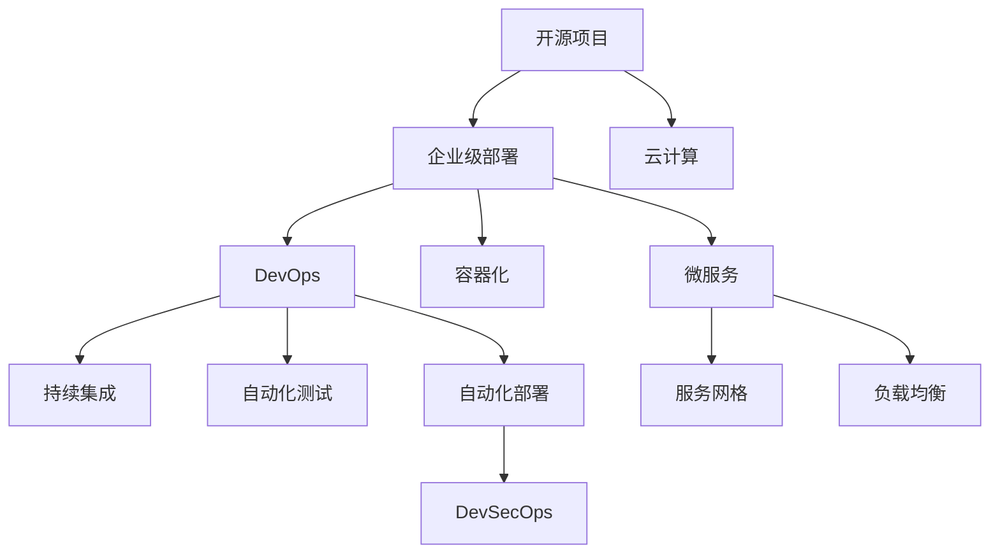

                 

# 开源项目的企业级部署服务：创造高价值机会

> 关键词：开源项目,企业级部署,云计算,DevOps,容器化,微服务,DevSecOps

## 1. 背景介绍

随着技术的发展和市场的竞争加剧，越来越多的企业开始重视开源项目的应用，以期通过开源技术降低成本，提升效率，实现业务创新。然而，企业级的开源项目部署服务不仅仅是一个技术问题，更是一个复杂的组织和流程问题。传统企业的IT架构往往存在孤岛现象，跨部门协作难度大，技术栈复杂，不易维护。因此，如何将开源项目高效、安全、可扩展地部署到企业级环境中，成为企业IT部门面临的重要挑战。

## 2. 核心概念与联系

为了更好地理解开源项目的企业级部署服务，本节将介绍几个关键概念及其相互联系。

- **开源项目(Open Source Project)**：指源代码公开、可以自由使用和修改的软件项目。开源项目能够迅速迭代，汇聚社区力量，推动技术进步。
- **企业级部署(Enterprise Deployment)**：指将开源项目部署到企业内部网络、数据中心或云平台中，为企业提供稳定可靠的服务。企业级部署要求高度的可靠性和安全性，以及高效的运维和扩展能力。
- **云计算(Cloud Computing)**：指通过互联网提供计算资源和服务的商业模式。云计算支持弹性伸缩、按需付费等特性，为企业提供了灵活的IT基础设施。
- **DevOps(Development Operations)**：指将软件开发与运维紧密结合的实践。DevOps能够加快软件的交付速度，提升软件质量，降低运维成本。
- **容器化(Containerization)**：指将应用程序及其依赖打包在容器中的技术。容器化实现了“应用即服务”的目标，简化了应用的部署、管理和扩展。
- **微服务(Microservice)**：指将大型应用拆分成多个小服务，每个服务独立部署和维护，通过轻量级的通信机制进行协同。微服务提高了系统的可扩展性和可维护性。
- **DevSecOps(Development Security Operations)**：指将安全融入DevOps实践，实现安全与开发的协同。DevSecOps能够提前发现并修复安全漏洞，提升系统的安全性和可靠性。

这些概念之间的逻辑关系可以通过以下Mermaid流程图来展示：



这个流程图展示了一些关键概念之间的联系：

1. 开源项目是云计算、DevOps、容器化和微服务的起点。
2. 云计算提供了灵活的IT基础设施，支持DevOps的持续集成和自动化部署。
3. 容器化和微服务使得应用的部署、管理和扩展更加便捷。
4. DevSecOps将安全融入DevOps，提升了系统的安全性和可靠性。

这些概念共同构成了开源项目的企业级部署服务的核心框架，帮助企业实现开源技术的广泛应用和价值最大化。

## 3. 核心算法原理 & 具体操作步骤
### 3.1 算法原理概述

企业级部署服务的核心算法原理主要基于DevOps和微服务两大技术范式。DevOps通过持续集成、自动化测试、自动化部署等技术，提升了软件的交付效率和质量，使得企业能够快速响应市场变化。微服务通过拆分应用，提高了系统的可扩展性和可维护性，适应企业不断变化的需求。

### 3.2 算法步骤详解

企业级部署服务的算法步骤主要包括以下几个关键环节：

1. **需求分析与设计**：对企业的业务需求进行详细分析，设计合适的IT架构和技术栈，选择适合的云平台和容器化方案。

2. **软件开发与持续集成**：在DevOps框架下，利用持续集成工具如Jenkins、GitLab CI等，对软件进行自动化的构建、测试和集成。

3. **容器化与微服务拆分**：将应用打包为容器，采用Docker、Kubernetes等容器化技术，将应用拆分为多个微服务，每个服务独立部署和维护。

4. **自动化部署与监控**：利用自动化部署工具如Ansible、Terraform等，将微服务部署到云平台，利用监控工具如Prometheus、Grafana等，实时监控系统状态和性能。

5. **DevSecOps安全集成**：在DevOps流程中引入DevSecOps实践，利用SAST、DAST等工具对代码和应用进行安全扫描，提前发现并修复安全漏洞。

6. **性能优化与扩展**：利用负载均衡、服务网格等技术，优化系统性能，支持水平扩展和垂直扩展。

### 3.3 算法优缺点

企业级部署服务具有以下优点：

1. **提升交付速度**：通过持续集成和自动化部署，快速响应市场变化，提升交付速度。
2. **提高系统可扩展性**：采用微服务架构，实现应用的水平扩展和垂直扩展，适应企业业务发展需求。
3. **降低运维成本**：自动化部署和监控，减少人工干预，降低运维成本。
4. **提升系统安全性**：引入DevSecOps安全集成，提前发现并修复安全漏洞，提升系统的安全性。

然而，该方法也存在以下局限性：

1. **技术复杂度高**：需要深入理解DevOps、微服务、容器化等技术，对技术栈要求高。
2. **初期投入大**：在初期需要投入大量时间和人力进行需求分析、架构设计、工具选择等。
3. **系统复杂度高**：微服务拆分和容器化增加了系统复杂度，可能带来额外的调试和维护成本。
4. **依赖云计算平台**：依赖云平台的高可用性和扩展能力，可能带来一定的技术风险。

尽管存在这些局限性，企业级部署服务仍是大规模、复杂系统的最佳实践，为企业提供了快速响应市场变化、提升系统性能和安全性等优势。

### 3.4 算法应用领域

企业级部署服务在企业级应用场景中广泛应用，例如：

1. **电商平台**：通过容器化和微服务架构，提升电商系统的可扩展性和可用性，支持用户流量的高峰期和促销活动。

2. **金融系统**：利用云计算平台的高可用性和扩展能力，保障金融系统的稳定性和安全性，支持高频交易和大数据处理。

3. **医疗系统**：采用DevOps和DevSecOps实践，提升医疗系统的交付效率和安全性，支持实时数据处理和患者信息的保护。

4. **工业制造**：利用容器化和微服务，实现工业设备的远程监控和控制，支持工业物联网和智能制造。

## 4. 数学模型和公式 & 详细讲解  
### 4.1 数学模型构建

企业级部署服务的数学模型主要基于系统监控和性能优化两个维度。假设企业级系统由$N$个微服务组成，每个服务$i$的性能指标$P_i$可以表示为一个随机变量。定义系统性能指标$P$为所有服务性能指标的加权平均：

$$
P = \sum_{i=1}^N \alpha_i P_i
$$

其中$\alpha_i$为服务$i$的权重，表示其在系统中的重要性。

定义系统状态$S_t$为$t$时刻的系统状态，包括系统负载、网络延迟、错误率等指标。系统状态的变化可以表示为：

$$
S_{t+1} = f(S_t, P, \Delta t)
$$

其中$\Delta t$为时间步长。

### 4.2 公式推导过程

对于系统性能优化问题，我们需要最大化系统性能指标$P$。假设每个服务的性能指标$P_i$服从正态分布$N(\mu_i, \sigma_i^2)$，即：

$$
P_i \sim N(\mu_i, \sigma_i^2)
$$

系统性能指标$P$的方差为：

$$
\sigma_P^2 = \sum_{i=1}^N \alpha_i \sigma_i^2
$$

假设系统状态$S_t$满足一阶自回归模型，即：

$$
S_{t+1} = a_0 + a_1 S_t + b_1 P + \epsilon_t
$$

其中$\epsilon_t$为随机扰动项。根据最小二乘法，可以求解系统状态的变化规律。

### 4.3 案例分析与讲解

假设一个电商系统的用户请求率为$P_1$，支付请求率为$P_2$，系统负载为$S$，网络延迟为$S$。通过持续监控和性能优化，可以逐步调整$P_1$和$P_2$的权重，使得系统性能$P$最大化。例如，在节假日促销活动期间，可以适当增加支付请求率$P_2$的权重，提升系统对高频支付请求的处理能力。

## 5. 项目实践：代码实例和详细解释说明
### 5.1 开发环境搭建

在企业级部署服务实践中，我们需要搭建一个完整的开发环境。以下是使用Python和Docker搭建开发环境的流程：

1. 安装Docker：从官网下载并安装Docker引擎。

2. 安装Docker Compose：使用以下命令安装Docker Compose工具：

```bash
sudo apt-get install docker-compose
```

3. 安装GitLab CI：使用以下命令安装GitLab CI/CD工具：

```bash
sudo apt-get install gitlab-ci-cd
```

4. 创建容器和应用：使用以下命令创建Docker容器，并启动应用：

```bash
docker run -d -p 8080:80 <image_name>
```

5. 配置自动化部署：使用Docker Compose配置自动化部署流程，例如：

```yaml
version: '3'
services:
  app:
    image: app_image
    ports:
      - "8080:80"
    deploy:
      replicas: 3
      restart_policy:
        condition: on-failure
  db:
    image: db_image
    environment:
      - MYSQL_ROOT_PASSWORD=password
    deploy:
      replicas: 1
      restart_policy:
        condition: on-failure
```

### 5.2 源代码详细实现

以电商系统的容器化和微服务部署为例，给出完整的Docker容器化配置和应用部署的代码实现。

1. 创建Dockerfile：

```Dockerfile
FROM ubuntu:latest
RUN apt-get update && apt-get install -y curl gnupg
RUN curl -fsSL https://download.docker.com/linux/ubuntu/gpg | sudo apt-key add -
RUN add-apt-repository "deb [arch=amd64] https://download.docker.com/linux/ubuntu $(lsb_release -cs) stable"
RUN apt-get update && apt-get install -y docker-ce docker-compose
```

2. 创建Docker Compose文件：

```yaml
version: '3'
services:
  app:
    image: app_image
    ports:
      - "8080:80"
    deploy:
      replicas: 3
      restart_policy:
        condition: on-failure
  db:
    image: db_image
    environment:
      - MYSQL_ROOT_PASSWORD=password
    deploy:
      replicas: 1
      restart_policy:
        condition: on-failure
```

3. 启动Docker容器：

```bash
docker-compose up -d
```

### 5.3 代码解读与分析

在容器化和微服务部署中，Docker和Docker Compose起到了关键作用。

- **Dockerfile**：定义了Docker镜像的构建过程，从基础镜像开始安装必要的工具和依赖，最终构建出应用镜像。
- **Docker Compose**：定义了Docker容器的编排和管理过程，包括容器的启动、停止、扩展等操作，支持多容器之间的协作。

通过Docker和Docker Compose，我们可以将应用打包为容器，在云平台上灵活部署和管理，提高了应用的可靠性和可扩展性。

## 6. 实际应用场景
### 6.1 电商系统

电商系统是企业级部署服务的典型应用场景之一。电商系统具有用户流量高峰期、促销活动频繁等特点，需要高度可靠和高可扩展的IT基础设施。通过容器化和微服务架构，电商系统可以实现快速部署和弹性扩展，支持用户流量的高峰期和促销活动。

例如，在双11促销期间，电商平台需要大幅提升支付系统的处理能力。通过微服务拆分和容器化，支付系统可以独立部署和扩展，支持高频交易和高并发请求。同时，利用Docker Compose和Docker Swarm，可以灵活调整容器的数量和资源配置，保障系统的稳定性和可用性。

### 6.2 金融系统

金融系统对系统的稳定性和安全性要求极高，需要高度可靠和高扩展性的IT基础设施。通过企业级部署服务，金融系统可以实现快速部署和弹性扩展，支持高频交易和大数据处理。

例如，在股票交易系统中，交易指令需要在毫秒级别内处理并返回结果。通过容器化和微服务架构，交易系统可以独立部署和扩展，支持高频交易和高并发请求。同时，利用Docker Compose和Docker Swarm，可以灵活调整容器的数量和资源配置，保障系统的稳定性和可用性。

### 6.3 医疗系统

医疗系统对系统的稳定性和安全性要求极高，需要高度可靠和高扩展性的IT基础设施。通过企业级部署服务，医疗系统可以实现快速部署和弹性扩展，支持实时数据处理和患者信息的保护。

例如，在HIS系统中，患者的诊疗记录需要实时存储和查询。通过容器化和微服务架构，HIS系统可以独立部署和扩展，支持高并发和实时数据处理。同时，利用Docker Compose和Docker Swarm，可以灵活调整容器的数量和资源配置，保障系统的稳定性和可用性。

## 7. 工具和资源推荐
### 7.1 学习资源推荐

为了帮助开发者系统掌握企业级部署服务的理论基础和实践技巧，这里推荐一些优质的学习资源：

1. **《Kubernetes: Up and Running》**：Kubernetes的官方文档，详细介绍了Kubernetes的架构、部署和管理。

2. **《Docker: Up and Running》**：Docker的官方文档，详细介绍了Docker的架构、部署和管理。

3. **《DevOps: The Definitive Guide》**：DevOps领域的经典著作，介绍了DevOps的最佳实践和工具栈。

4. **《Docker and Kubernetes: DevOps in Action》**：DevOps领域的经典著作，介绍了Docker和Kubernetes的集成实践。

5. **《Microservices: Practical Strategies for Designing Highly Reliable and Flexible Distributed Systems》**：微服务领域的经典著作，介绍了微服务的架构设计和实践经验。

通过这些资源的学习实践，相信你一定能够快速掌握企业级部署服务的精髓，并用于解决实际的IT问题。

### 7.2 开发工具推荐

高效的开发离不开优秀的工具支持。以下是几款用于企业级部署服务的常用工具：

1. **Jenkins**：开源持续集成工具，支持CI/CD管道的构建和自动化执行。

2. **Docker Compose**：Docker容器的编排工具，支持多容器之间的协作和扩展。

3. **Ansible**：自动化运维工具，支持云平台资源的部署和管理。

4. **Kubernetes**：容器编排工具，支持容器的部署、扩展和管理。

5. **Prometheus**：开源监控系统，支持系统的实时监控和告警。

6. **Grafana**：开源可视化工具，支持监控数据的可视化和分析。

合理利用这些工具，可以显著提升企业级部署服务的开发效率，加快创新迭代的步伐。

### 7.3 相关论文推荐

企业级部署服务的研究源于学界的持续探索。以下是几篇奠基性的相关论文，推荐阅读：

1. **《The Google Kubernetes Engine: The Secure and Scalable Production of Hundreds of Millions of Pods per Year》**：介绍Google Kubernetes Engine的架构和部署实践。

2. **《Cryo: A Caching Mechanism for Globally Distributed Ephemeral Storage》**：介绍Cryo缓存机制，支持容器化应用的高可用性和扩展性。

3. **《Kubernetes: Container Orchestration in the Cloud》**：介绍Kubernetes的架构和部署实践，支持云平台资源的部署和管理。

4. **《Docker and DevOps》**：介绍Docker在DevOps中的集成实践，支持应用的快速部署和运维。

5. **《Microservices in Practice: Lessons Learned from a Journey》**：介绍微服务的架构设计和实践经验，支持系统的可扩展性和可维护性。

这些论文代表了大规模企业级部署服务的发展脉络。通过学习这些前沿成果，可以帮助研究者把握学科前进方向，激发更多的创新灵感。

## 8. 总结：未来发展趋势与挑战
### 8.1 研究成果总结

本文对企业级部署服务的理论和实践进行了全面系统的介绍。通过分析开源项目、云计算、DevOps、容器化、微服务等关键概念，展示了企业级部署服务的核心框架和实施过程。

### 8.2 未来发展趋势

展望未来，企业级部署服务将呈现以下几个发展趋势：

1. **云计算与边缘计算结合**：企业级部署服务将更多地结合边缘计算，支持离线计算和本地化处理，提升系统的响应速度和用户体验。

2. **人工智能与自动化运维结合**：企业级部署服务将更多地结合人工智能技术，实现自动化的运维和监控，提升系统的智能性和可靠性。

3. **微服务与 Serverless 结合**：企业级部署服务将更多地结合 Serverless 技术，实现按需付费和弹性扩展，提升系统的灵活性和成本效益。

4. **DevSecOps与DevOps结合**：企业级部署服务将更多地结合 DevSecOps 实践，提升系统的安全性和可靠性，保障数据和系统的安全。

5. **容器化与平台即服务结合**：企业级部署服务将更多地结合平台即服务技术，支持快速部署和扩展，提升系统的灵活性和可维护性。

这些趋势将进一步推动企业级部署服务的发展，为企业的数字化转型提供更强大的技术支撑。

### 8.3 面临的挑战

尽管企业级部署服务已经取得了瞩目成就，但在迈向更加智能化、普适化应用的过程中，它仍面临诸多挑战：

1. **技术复杂度高**：企业级部署服务涉及DevOps、微服务、容器化、云计算等复杂技术，对技术栈要求高。

2. **初期投入大**：在初期需要投入大量时间和人力进行需求分析、架构设计、工具选择等。

3. **系统复杂度高**：微服务拆分和容器化增加了系统复杂度，可能带来额外的调试和维护成本。

4. **依赖云计算平台**：依赖云平台的高可用性和扩展能力，可能带来一定的技术风险。

5. **安全性问题**：企业级部署服务涉及大量的数据和业务逻辑，可能面临数据泄露和攻击的风险。

6. **运维成本高**：企业级部署服务需要持续的运维和监控，运维成本高。

7. **技能缺口**：缺乏具备DevOps、微服务、容器化等技能的专业人才。

### 8.4 研究展望

面对企业级部署服务所面临的挑战，未来的研究需要在以下几个方面寻求新的突破：

1. **降低技术门槛**：开发更多易于使用的工具和框架，降低技术复杂度和初期投入，支持中小企业的快速部署。

2. **提升系统可维护性**：通过微服务拆分和容器化，提升系统的可维护性和扩展性，减少调试和维护成本。

3. **结合人工智能技术**：结合人工智能技术，实现自动化的运维和监控，提升系统的智能性和可靠性。

4. **提升安全性**：结合DevSecOps实践，提升系统的安全性和可靠性，保障数据和系统的安全。

5. **结合边缘计算技术**：结合边缘计算技术，支持离线计算和本地化处理，提升系统的响应速度和用户体验。

6. **结合 Serverless 技术**：结合 Serverless 技术，实现按需付费和弹性扩展，提升系统的灵活性和成本效益。

7. **培养更多专业人才**：培养更多具备DevOps、微服务、容器化等技能的专业人才，支持企业级部署服务的广泛应用。

这些研究方向的探索，必将引领企业级部署服务的发展，为企业的数字化转型提供更强大的技术支撑。相信随着技术不断进步和实践不断积累，企业级部署服务必将成为企业数字化转型的重要引擎，推动企业的持续创新和快速发展。

## 9. 附录：常见问题与解答

**Q1：企业级部署服务是否适用于所有IT项目？**

A: 企业级部署服务适用于大多数IT项目，特别是需要高度可靠和高可扩展性的系统。然而，对于简单的单点应用或者数据量较小的系统，可能不需要复杂的部署服务。

**Q2：企业级部署服务需要哪些技术栈？**

A: 企业级部署服务需要以下技术栈：

1. **DevOps**：持续集成、自动化测试、自动化部署等技术。

2. **微服务**：应用程序拆分、服务发现、负载均衡、故障转移等技术。

3. **容器化**：Docker、Kubernetes等容器化技术。

4. **云计算**：云平台资源管理、弹性伸缩、高可用性等技术。

5. **自动化运维**：监控、告警、日志管理等技术。

6. **DevSecOps**：安全集成、安全扫描、安全策略等技术。

**Q3：企业级部署服务需要多长时间才能搭建完成？**

A: 企业级部署服务的搭建时间因项目规模和复杂度而异。一般而言，从需求分析到系统部署需要数周到数月的时间。

**Q4：企业级部署服务是否需要高水平的IT团队？**

A: 企业级部署服务需要具备DevOps、微服务、容器化等技能的IT团队，对技术栈要求高。如果企业内部缺乏相关人才，可以考虑外包或者引入第三方服务。

**Q5：企业级部署服务是否适合中小企业？**

A: 企业级部署服务适合中小企业的数字化转型，能够降低IT成本，提升系统效率和性能。中小企业可以结合自身需求，选择适合的架构和工具进行部署。

---

作者：禅与计算机程序设计艺术 / Zen and the Art of Computer Programming

