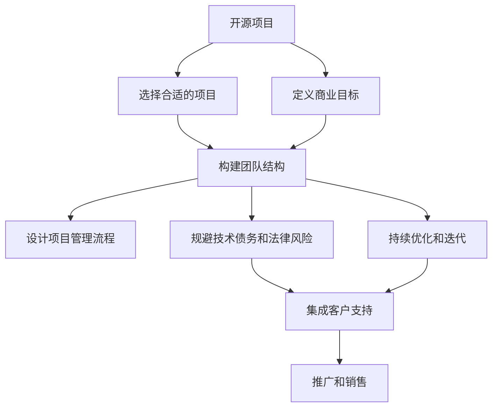

                 

# 开源项目的商业化团队构建：角色与职责

> 关键词：开源项目,商业化,团队构建,角色与职责,敏捷开发,项目管理,技术债务

## 1. 背景介绍

### 1.1 问题由来
随着开源软件和技术的广泛应用，越来越多的企业认识到利用开源资源加速产品开发的重要性。然而，开源项目的商业化并非易事。如何高效整合开源资源，发挥其优势，同时避免常见的陷阱，是摆在企业面前的一大难题。

本文章将通过具体案例和数据，详细阐述开源项目商业化团队的角色与职责分配，提出有效的团队构建和项目管理方法，帮助企业成功落地开源项目。

### 1.2 问题核心关键点
开源项目商业化涉及众多环节，包括但不限于：

- 选择合适的开源项目。
- 定义清晰的商业目标。
- 构建合适的团队结构。
- 设计合理的项目管理流程。
- 规避技术债务和法律风险。
- 持续优化和迭代项目。

本文将围绕这些关键点，给出深入的分析和实践建议。

## 2. 核心概念与联系

### 2.1 核心概念概述

为更好地理解开源项目商业化，首先需要明确几个关键概念：

- **开源项目（Open Source Project）**：是指以源代码形式公开、任何人都可以免费使用的软件项目，通常具有开源许可证（如Apache、MIT等）。
- **商业化（Commercialization）**：将开源项目转化成商业产品或服务的过程，包括但不限于产品集成、品牌推广、客户支持、销售和市场运作等。
- **团队构建（Team Building）**：指根据项目需求和目标，构建合适的团队结构和角色分配。
- **角色与职责（Roles and Responsibilities）**：明确团队中不同角色成员的职责和权限，确保每个成员充分发挥其专长。
- **敏捷开发（Agile Development）**：一种迭代、增量的软件开发方法，强调客户反馈和持续交付。
- **项目管理（Project Management）**：对项目从启动到交付的全过程进行规划、执行和监控。
- **技术债务（Technical Debt）**：在项目开发中积累的问题、bug和不完整功能，影响产品质量和进度。
- **法律风险（Legal Risk）**：开源项目商业化过程中可能面临的法律问题，如版权纠纷、许可证合规等。

这些核心概念之间的逻辑关系可以通过以下Mermaid流程图来展示：



这个流程图展示了一些核心概念之间的联系：

1. 开源项目的选择和商业目标的确定，是商业化的基础。
2. 团队结构和项目管理流程的设计，是商业化的保障。
3. 规避技术债务和法律风险，是商业化的必要条件。
4. 持续优化和迭代，是商业化的核心目标。

## 3. 核心算法原理 & 具体操作步骤

### 3.1 算法原理概述

开源项目商业化的核心在于如何将开源资源有效地转化为商业价值。这包括选择合适的开源项目，定义清晰的商业目标，构建合适的团队结构，设计合理的项目管理流程，规避技术债务和法律风险，持续优化和迭代项目。

这些步骤共同构成了一个闭环，每一个环节都至关重要。通过精心设计和优化，可以实现开源项目的商业化和最大化价值转化。

### 3.2 算法步骤详解

开源项目商业化包括以下详细步骤：

**Step 1: 选择合适的开源项目**
- 需求分析：明确项目需求和目标，选择与需求匹配的开源项目。
- 评估成本与收益：评估开源项目的成本和收益，包括开发难度、维护成本、功能模块等。
- 试用与评估：试用开源项目，评估其适用性、性能和稳定性。

**Step 2: 定义清晰的商业目标**
- 确定商业模型：选择自研、集成、合作或开放平台等不同的商业模型。
- 制定里程碑：根据商业目标，制定关键里程碑和交付时间表。
- 量化指标：定义关键指标，如市场份额、收入、用户增长等。

**Step 3: 构建合适的团队结构**
- 角色分配：根据项目需求，分配不同的角色，如架构师、开发工程师、测试工程师、项目经理等。
- 技能矩阵：根据角色需求，构建技能矩阵，明确团队成员的技能要求。
- 培训与认证：为团队成员提供必要的培训和认证，提升技术水平。

**Step 4: 设计合理的项目管理流程**
- 敏捷开发：采用敏捷开发方法，进行迭代、增量的软件开发。
- 项目管理：使用Scrum或Kanban等敏捷框架，进行任务分配和进度跟踪。
- 持续集成：使用CI/CD工具，进行自动化测试和部署。

**Step 5: 规避技术债务和法律风险**
- 技术评审：定期进行技术评审，识别和修复潜在问题。
- 代码规范：制定代码规范和标准，提升代码质量。
- 许可证合规：确保开源项目的使用符合相应的许可证要求，避免法律风险。

**Step 6: 持续优化和迭代**
- 用户反馈：收集用户反馈，识别和解决问题。
- 版本迭代：定期发布版本更新，改进功能和性能。
- 版本管理：使用版本控制工具，管理代码版本和历史。

### 3.3 算法优缺点

开源项目商业化具有以下优点：

1. 高效开发：开源社区贡献了大量高质量代码，可以快速加速项目开发。
2. 灵活创新：开源社区持续活跃，能够不断引入新技术和最佳实践。
3. 成本效益：利用开源资源，降低开发和维护成本。

但同时也存在一些缺点：

1. 管理复杂：开源项目多样性大，管理复杂度较高。
2. 技术债务：开源项目缺乏统一的维护标准，可能存在技术债务。
3. 法律风险：开源许可证和合规问题复杂，容易引发法律风险。
4. 社区依赖：对开源社区的依赖可能导致项目不稳定性。

尽管存在这些局限性，开源项目商业化依然具有巨大的潜力和优势。企业需要合理应对这些挑战，才能成功实现商业化。

### 3.4 算法应用领域

开源项目商业化在多个领域得到了广泛应用，如：

- 软件即服务（SaaS）：利用开源项目构建SaaS平台，实现快速扩展和市场布局。
- 应用即服务（PaaS）：利用开源项目构建PaaS平台，提供云服务解决方案。
- 基础设施即服务（IaaS）：利用开源项目构建IaaS平台，提供计算、存储等基础设施。
- 商业智能（BI）：利用开源项目构建商业智能系统，提升数据分析能力。
- 区块链技术：利用开源项目构建区块链应用，探索新兴商业模式。

这些领域的应用案例展示了开源项目商业化的广泛性和多样性。

## 4. 数学模型和公式 & 详细讲解 & 举例说明（备注：数学公式请使用latex格式，latex嵌入文中独立段落使用 $$，段落内使用 $)
### 4.1 数学模型构建

为了方便后续的数学推导，假设开源项目商业化的过程由五个阶段构成，分别为项目选择、商业目标设定、团队构建、项目管理、持续优化。

- 项目选择：$P_{\text{select}} = f(\text{需求}, \text{成本}, \text{收益})$
- 商业目标设定：$G_{\text{set}} = g(P_{\text{select}}, \text{技术}, \text{市场})$
- 团队构建：$T_{\text{build}} = t(G_{\text{set}}, \text{技能}, \text{文化})$
- 项目管理：$M_{\text{manage}} = m(T_{\text{build}}, \text{资源}, \text{风险})$
- 持续优化：$C_{\text{optimize}} = c(M_{\text{manage}}, \text{反馈}, \text{技术})$

这些函数关系帮助我们理解开源项目商业化过程的关键因素和交互关系。

### 4.2 公式推导过程

以下是这些函数关系的具体推导过程：

**Step 1: 项目选择**
$P_{\text{select}} = f(\text{需求}, \text{成本}, \text{收益})$

其中，$\text{需求}$表示项目需求，$\text{成本}$表示开发和维护成本，$\text{收益}$表示商业收益。通过量化这些因素，可以评估项目的可行性。

**Step 2: 商业目标设定**
$G_{\text{set}} = g(P_{\text{select}}, \text{技术}, \text{市场})$

$\text{技术}$表示开源项目的技术特点和成熟度，$\text{市场}$表示目标市场的规模和需求。根据项目选择的结果，设定合理的商业目标。

**Step 3: 团队构建**
$T_{\text{build}} = t(G_{\text{set}}, \text{技能}, \text{文化})$

$\text{技能}$表示团队成员的技能水平，$\text{文化}$表示团队文化和协作方式。根据商业目标，分配合适的角色和技能，构建高效的团队结构。

**Step 4: 项目管理**
$M_{\text{manage}} = m(T_{\text{build}}, \text{资源}, \text{风险})$

$\text{资源}$表示项目所需的各种资源，包括人力、财力、物力等。$\text{风险}$表示项目实施过程中可能面临的各种风险，如技术风险、法律风险等。

**Step 5: 持续优化**
$C_{\text{optimize}} = c(M_{\text{manage}}, \text{反馈}, \text{技术})$

$\text{反馈}$表示用户和团队的反馈信息，$\text{技术}$表示技术进步和创新。通过持续优化，提升开源项目的商业价值。

### 4.3 案例分析与讲解

以下以一个开源云服务项目为例，说明开源项目商业化的具体步骤和过程。

1. **项目选择**
   - 需求分析：公司需要构建一个云服务平台，支持资源管理和调度。
   - 评估成本与收益：初步评估开源项目如Kubernetes、OpenStack等的成本和收益。
   - 试用与评估：通过试用Kubernetes，发现其功能完善、社区活跃，适合构建云服务平台。

2. **商业目标设定**
   - 确定商业模型：选择自研集成开源项目，构建SaaS平台。
   - 制定里程碑：设定三个里程碑，分别实现云平台功能、提供服务、市场推广。
   - 量化指标：设定用户数、服务收入、市场份额等关键指标。

3. **团队构建**
   - 角色分配：分配架构师、开发工程师、测试工程师、项目经理等角色。
   - 技能矩阵：根据项目需求，制定技能矩阵，明确团队成员的技能要求。
   - 培训与认证：为团队成员提供必要的培训和认证，提升技术水平。

4. **项目管理**
   - 敏捷开发：采用Scrum框架，进行迭代、增量的软件开发。
   - 项目管理：使用JIRA进行任务分配和进度跟踪。
   - 持续集成：使用Jenkins进行自动化测试和部署。

5. **规避技术债务和法律风险**
   - 技术评审：定期进行技术评审，识别和修复潜在问题。
   - 代码规范：制定代码规范和标准，提升代码质量。
   - 许可证合规：确保开源项目的使用符合相应的许可证要求，避免法律风险。

6. **持续优化和迭代**
   - 用户反馈：收集用户反馈，识别和解决问题。
   - 版本迭代：定期发布版本更新，改进功能和性能。
   - 版本管理：使用Git进行版本控制，管理代码版本和历史。

通过以上步骤，成功将开源云服务平台项目商业化，实现了良好的商业回报和用户满意度。

## 5. 项目实践：代码实例和详细解释说明
### 5.1 开发环境搭建

为了支持开源项目商业化，需要先搭建一个开发环境。以下是具体的步骤：

1. 安装开发环境：
```bash
sudo apt-get update
sudo apt-get install git python3 python3-pip python3-virtualenv
sudo pip3 install virtualenv
```

2. 创建虚拟环境：
```bash
virtualenv venv
source venv/bin/activate
```

3. 安装依赖包：
```bash
pip3 install django flask django-rest-framework djangorestframework-cors-headers
```

4. 搭建项目：
```bash
cd myproject
git clone https://github.com/mycompany/myproject.git
cd myproject
python3 manage.py runserver
```

5. 部署项目：
```bash
gunicorn myproject.wsgi:application
```

### 5.2 源代码详细实现

以下是一个简单的Python Flask项目，用于演示开源项目商业化的具体实现。

```python
from flask import Flask, jsonify, request

app = Flask(__name__)

@app.route('/api/hello', methods=['GET'])
def hello():
    return jsonify({'message': 'Hello, World!'})

@app.route('/api/user', methods=['POST'])
def user():
    data = request.json
    name = data.get('name')
    return jsonify({'message': f'Hello, {name}!'})

if __name__ == '__main__':
    app.run(debug=True)
```

**代码解读与分析**：

1. 首先创建一个Flask应用程序，定义两个路由函数。
2. `/api/hello`路由返回欢迎消息。
3. `/api/user`路由接收POST请求，并根据请求中的name参数返回欢迎消息。
4. 启动应用程序，监听端口5000。

### 5.3 运行结果展示

启动应用程序后，可以通过浏览器访问`http://localhost:5000/api/hello`和`http://localhost:5000/api/user`，分别看到返回的欢迎消息。

## 6. 实际应用场景

### 6.1 开源云服务平台

开源云服务平台是开源项目商业化的一个重要应用场景。企业可以通过集成开源项目，构建自己的云平台，提供计算、存储、网络等基础设施服务。

**实际应用示例**：某公司利用OpenStack构建云服务平台，实现了资源管理和调度。该平台支持弹性计算、负载均衡、分布式存储等功能，帮助企业降低IT成本，提高资源利用率。

### 6.2 开源商业智能平台

开源商业智能平台是另一个常见的应用场景。企业可以通过集成开源项目，构建自己的BI平台，提升数据分析和决策支持能力。

**实际应用示例**：某公司利用Apache Superset构建商业智能平台，实现数据可视化、报表生成、指标分析等功能。该平台帮助企业快速理解业务数据，优化决策流程，提升运营效率。

### 6.3 开源区块链平台

开源区块链平台是新兴技术的重要应用场景。企业可以通过集成开源项目，构建自己的区块链应用，探索新型的商业模式。

**实际应用示例**：某公司利用Hyperledger Fabric构建区块链平台，实现供应链管理、智能合约等功能。该平台帮助企业提高供应链透明度，优化业务流程，降低运营成本。

## 7. 工具和资源推荐

### 7.1 学习资源推荐

为了帮助开发者掌握开源项目商业化的知识和技能，以下是一些推荐的学习资源：

1. **《开源软件开发最佳实践》**：由著名的开源项目贡献者撰写，涵盖开源项目的选择、评估和管理等方方面面。
2. **《Agile项目管理：实践指南》**：介绍敏捷开发和项目管理的方法和工具，帮助团队高效协作。
3. **《软件工程：构建可维护的系统》**：介绍软件开发的系统方法，涵盖需求分析、设计、编码和测试等环节。
4. **《Python Web开发实战》**：介绍Python Flask和Django等Web框架的使用，帮助开发者构建Web应用。
5. **《开源项目管理：理论与实践》**：介绍开源项目管理的理论和方法，涵盖项目管理、团队协作和风险管理等。

### 7.2 开发工具推荐

以下是一些用于开源项目商业化的常用开发工具：

1. **Git**：版本控制工具，帮助开发者管理代码版本和历史。
2. **Jenkins**：持续集成工具，支持自动化测试和部署。
3. **JIRA**：项目管理工具，支持任务分配和进度跟踪。
4. **Docker**：容器化技术，帮助开发者构建和管理应用。
5. **Django**：Web框架，帮助开发者快速构建Web应用。
6. **Flask**：轻量级Web框架，适合快速开发原型和API服务。

### 7.3 相关论文推荐

开源项目商业化涉及多个学科领域的交叉，以下是一些相关论文的推荐：

1. **《开源项目评估与管理：一项文献综述》**：综述了开源项目的评估和管理方法，探讨了开源项目的优势和挑战。
2. **《开源项目商业化：路径与策略》**：介绍了开源项目商业化的主要路径和策略，帮助企业制定商业化方案。
3. **《敏捷开发与项目管理：实践与经验》**：介绍了敏捷开发和项目管理的实践经验，帮助团队高效协作。
4. **《开源项目与商业化：案例分析》**：通过多个成功案例，展示了开源项目商业化的具体方法和流程。
5. **《开源项目法律合规性：风险与对策》**：介绍了开源项目法律合规性的风险和应对措施，帮助企业规避法律风险。

## 8. 总结：未来发展趋势与挑战

### 8.1 总结

本文对开源项目商业化的核心概念和操作步骤进行了详细阐述，通过具体案例和数据，展示了开源项目商业化的全流程。开源项目商业化通过选择合适的开源项目，定义清晰的商业目标，构建合适的团队结构，设计合理的项目管理流程，规避技术债务和法律风险，持续优化和迭代项目，实现高效、灵活、低成本的商业化过程。

### 8.2 未来发展趋势

开源项目商业化未来的发展趋势包括：

1. **技术进步**：随着开源社区的持续发展和新技术的不断涌现，开源项目商业化的技术和方法将不断进步，满足更广泛的应用需求。
2. **业务拓展**：开源项目商业化将逐渐拓展到更多行业领域，如金融、医疗、教育等，形成多行业应用的生态系统。
3. **标准制定**：开源项目商业化将推动相关标准的制定和推广，提升开源项目的规范化和可互操作性。
4. **社区协作**：开源项目商业化将促进企业与开源社区的深度协作，形成更加开放和可持续的创新模式。
5. **法律合规**：开源项目商业化将更加重视法律合规性，规避各种法律风险，保障商业化过程的合规性。

### 8.3 面临的挑战

尽管开源项目商业化具有巨大潜力，但在实施过程中仍面临诸多挑战：

1. **技术债务**：开源项目缺乏统一的维护标准，可能存在技术债务，影响项目质量和稳定性。
2. **法律风险**：开源项目商业化可能面临复杂的法律问题，如版权纠纷、许可证合规等，需要严格遵守相关法规。
3. **管理复杂性**：开源项目多样性大，管理复杂度较高，需要高效的团队结构和项目管理流程。
4. **资源投入**：开源项目商业化需要大量的资源投入，包括人力、财力和时间等，需要合理的成本管理。
5. **用户需求变化**：用户需求和技术环境不断变化，开源项目商业化需要持续优化和迭代，以保持竞争力。

### 8.4 研究展望

面对开源项目商业化面临的挑战，未来的研究需要在以下几个方面寻求新的突破：

1. **自动化工具**：开发更多的自动化工具，提升开源项目的开发效率和管理效率。
2. **标准化**：推动开源项目的标准化和规范化，提升其可互操作性和兼容性。
3. **法律保障**：研究开源项目商业化相关的法律问题，提供有效的法律保障。
4. **社区协作**：加强企业与开源社区的深度协作，形成更加开放和可持续的创新模式。
5. **技术债务管理**：研究技术债务管理的方法和工具，提升开源项目的质量和稳定性。

总之，开源项目商业化是一个复杂而系统的过程，需要企业在技术、管理和法律等多方面进行全面优化和提升。只有不断创新、积极应对，才能实现开源项目的商业化，创造更大的商业价值。

## 9. 附录：常见问题与解答

**Q1：开源项目选择有哪些关键因素？**

A: 开源项目选择的关键因素包括：

1. **需求匹配**：选择与项目需求匹配的开源项目，确保其功能满足业务要求。
2. **技术成熟度**：选择技术成熟、稳定性高的开源项目，降低开发和维护风险。
3. **社区活跃度**：选择社区活跃、贡献频繁的开源项目，确保获取及时的技术支持和资源。
4. **许可证合规**：选择符合公司法律合规要求的开源项目，避免法律风险。
5. **成本效益**：选择成本低、效益高的开源项目，确保商业化过程的经济可行性。

**Q2：如何评估开源项目的成本与收益？**

A: 评估开源项目的成本与收益，可以从以下几个方面入手：

1. **开发成本**：评估开源项目的开发难度、开发周期和开发成本。
2. **维护成本**：评估开源项目的维护难度、维护成本和维护周期。
3. **功能模块**：评估开源项目提供的功能模块是否满足业务需求。
4. **扩展性**：评估开源项目的扩展性和可定制性。
5. **市场竞争力**：评估开源项目在目标市场中的竞争力和市场份额。

**Q3：如何规避开源项目的技术债务？**

A: 规避开源项目的技术债务，可以从以下几个方面入手：

1. **代码审查**：定期进行代码审查，识别和修复潜在问题。
2. **版本管理**：使用版本控制工具，管理代码版本和历史。
3. **技术评估**：定期评估开源项目的稳定性和性能，识别技术债务。
4. **持续优化**：定期优化和改进开源项目，提升其质量和技术水平。
5. **文档完善**：完善开源项目的文档和规范，提升其可读性和可维护性。

**Q4：如何规避开源项目的法律风险？**

A: 规避开源项目的法律风险，可以从以下几个方面入手：

1. **许可证合规**：选择符合公司法律合规要求的开源项目，确保其许可证合规。
2. **版权声明**：确保开源项目使用符合版权要求，避免版权纠纷。
3. **合规审计**：定期进行法律合规审计，确保项目符合法律要求。
4. **法律咨询**：聘请法律顾问，提供法律咨询和支持。
5. **文档规范**：完善开源项目的文档和规范，明确法律责任和义务。

**Q5：开源项目商业化中如何平衡成本与效益？**

A: 开源项目商业化中平衡成本与效益，可以从以下几个方面入手：

1. **成本优化**：优化开源项目的开发和维护成本，提高效率。
2. **效益提升**：提升开源项目的商业价值，增加收入和市场份额。
3. **资源配置**：合理配置资源，确保项目的高效运行和持续发展。
4. **市场调研**：进行市场调研，了解目标市场需求和趋势。
5. **持续优化**：持续优化开源项目，提升其商业价值和经济效益。

---

作者：禅与计算机程序设计艺术 / Zen and the Art of Computer Programming

