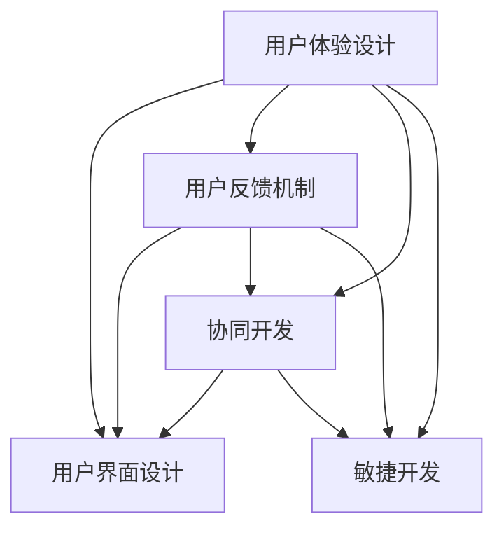

                 

# 开源项目的用户体验设计服务：扩展专业领域

## 1. 背景介绍

随着开源社区的蓬勃发展，越来越多的开发者参与到开源项目中，共建共享、协同创新。但与此同时，随着项目规模和复杂性的增加，用户体验（User Experience, UX）设计成为了一个日益严峻的挑战。尽管开源项目通常以技术和功能优先，但用户体验的良好与否，直接影响项目的吸引力和社区活力。良好的用户体验设计，不仅能吸引更多的贡献者和用户，还能提高项目的稳定性和可用性。

### 1.1 问题由来

开源项目的用户体验设计面临诸多挑战：

1. **多样化的需求**：开源项目通常服务于广泛的社区，用户背景各异，对功能和界面的需求也大相径庭。
2. **资源限制**：开源项目的开发资源有限，全职UX设计师难以覆盖所有功能模块。
3. **协作障碍**：开源项目的开发者通常是分布式协作，缺乏系统化的沟通和反馈机制。
4. **工具缺乏**：现有的UX设计工具和标准大多针对商业软件，难以适配开源项目的特殊需求。

为应对这些挑战，本文将详细介绍如何通过专业化的用户体验设计服务，帮助开源项目提升用户体验，扩展专业领域。

## 2. 核心概念与联系

### 2.1 核心概念概述

为更好地理解用户体验设计在开源项目中的应用，本节将介绍几个密切相关的核心概念：

- **用户体验设计（User Experience Design, UX Design）**：以用户为中心的设计，通过研究用户行为和心理，设计符合用户需求的界面和交互方式，提升用户满意度和使用体验。
- **用户界面设计（User Interface Design, UI Design）**：关注用户界面的美观和易用性，包括布局、颜色、字体、图标等视觉元素的合理配置。
- **用户反馈机制（User Feedback Mechanism）**：通过定期的用户调研和数据收集，了解用户需求和意见，为持续改进提供依据。
- **协同开发（Collaborative Development）**：开源项目中常见的开发模式，开发者分布式合作，通过代码审查和迭代迭代来共同实现项目目标。
- **敏捷开发（Agile Development）**：一种迭代、增量的开发方法，注重快速交付和用户反馈，支持灵活的变更和调整。

这些核心概念之间的逻辑关系可以通过以下Mermaid流程图来展示：



这个流程图展示了用户体验设计与其他设计、开发、反馈机制之间的联系，突出了用户体验在项目中的核心地位和重要价值。

## 3. 核心算法原理 & 具体操作步骤
### 3.1 算法原理概述

开源项目的用户体验设计，本质上是将用户需求转化为界面和交互方式的过程。其核心算法包括：

- **用户研究**：通过调查问卷、用户访谈等方式，收集用户需求和行为数据，为设计提供数据支持。
- **原型设计**：构建低保真或高保真的原型，以视觉化和交互化的方式展示设计方案，验证用户需求和设计思路。
- **可用性测试**：通过用户测试，评估原型和设计方案的可用性和易用性，指导设计迭代和优化。
- **迭代改进**：基于用户反馈和测试结果，不断优化设计方案，直至达到用户满意度和项目需求。

### 3.2 算法步骤详解

开源项目的用户体验设计一般包括以下几个关键步骤：

**Step 1: 用户研究**
- 通过调查问卷、用户访谈、用户行为分析等方式，收集目标用户群体的基本情况、需求、痛点等信息。
- 使用数据可视化工具（如Tableau、Power BI等）对用户数据进行分析，提炼关键需求和特征。

**Step 2: 界面设计**
- 根据用户研究结果，设计初步的用户界面方案。
- 使用设计工具（如Sketch、Figma等）绘制界面原型，并添加详细注释和说明。
- 与UI设计师沟通，共同调整界面布局、颜色、字体、图标等视觉元素，确保设计符合用户习惯和品牌调性。

**Step 3: 可用性测试**
- 在真实环境中招募用户，对原型进行可用性测试，记录用户操作行为和反馈意见。
- 使用可用性测试工具（如UsabilityHub、Lookback等）记录用户测试过程，分析用户的使用流程和瓶颈。
- 根据测试结果，调整设计方案，优化用户操作路径和交互体验。

**Step 4: 迭代改进**
- 基于用户反馈和可用性测试结果，进行多轮设计迭代，不断优化设计方案。
- 通过代码审查和功能评估，验证设计方案的可行性和用户体验的提升。
- 与项目团队沟通，确保设计方案能够融入项目的整体架构和技术栈。

### 3.3 算法优缺点

用户体验设计的优点在于：

1. **提升用户满意度**：通过精准的用户研究，设计符合用户需求的界面和交互方式，提升用户的使用体验和满意度。
2. **优化用户体验**：通过多轮的可用性测试和迭代改进，不断优化设计方案，提高项目的易用性和稳定性。
3. **增强社区活力**：良好的用户体验能够吸引更多的贡献者和用户，促进项目的繁荣发展。

同时，用户体验设计也存在一定的局限性：

1. **资源消耗**：设计过程需要大量时间和人力资源，尤其是在初期需求不明确的情况下，可能面临反复改动的风险。
2. **流程复杂**：设计过程涉及用户研究、界面设计、可用性测试等多个环节，流程复杂，协调成本较高。
3. **需求不确定**：开源项目的需求和目标用户群体的多样性，可能导致需求不明确，设计难度增加。

尽管如此，用户体验设计仍然是开源项目不可或缺的一部分，通过专业化的服务，可以最大程度提升项目的用户体验和开发效率。

### 3.4 算法应用领域

用户体验设计在开源项目中的应用非常广泛，涵盖各种不同的项目类型，例如：

- **Web应用**：构建符合用户习惯的Web界面，提升页面加载速度和响应速度。
- **桌面应用**：设计简洁直观的界面，优化用户操作流程，提高应用的易用性和稳定性。
- **移动应用**：针对不同移动设备，设计适配的界面布局和交互方式，提升用户操作体验。
- **文档和手册**：设计直观易读的文档和手册，帮助用户快速上手和使用项目功能。
- **社区界面**：设计简洁美观的社区界面，提升用户参与度和贡献度。

除此之外，用户体验设计还可以应用到更多领域，如数据可视化、交互设计、交互动画等，为开源项目提供更全面的支持。

## 4. 数学模型和公式 & 详细讲解 & 举例说明
### 4.1 数学模型构建

为了更好地理解用户体验设计的数学模型，本文将简要介绍一些常用的设计和评估指标：

- **点击率（Click-Through Rate, CTR）**：用户点击目标操作的比率，衡量用户对界面元素的操作意愿。
- **转化率（Conversion Rate, CR）**：用户在完成目标操作后的比率，衡量界面设计对用户行为的引导效果。
- **可用性指数（Usability Index, UI）**：通过定量评估用户界面和操作流程，计算出可用性指数，评估界面设计的整体质量。
- **任务完成时间（Task Completion Time, TCT）**：用户完成目标任务所需的时间，衡量界面设计的效率和易用性。

这些指标的计算公式如下：

$$ \text{CTR} = \frac{\text{点击数}}{\text{展示数}} $$
$$ \text{CR} = \frac{\text{转化数}}{\text{操作数}} $$
$$ \text{UI} = \text{使用率} \times \text{任务成功率} \times \text{满意度} $$
$$ \text{TCT} = \text{完成时间} $$

### 4.2 公式推导过程

以可用性指数为例，其计算公式为：

$$ \text{UI} = \text{使用率} \times \text{任务成功率} \times \text{满意度} $$

其中，使用率表示用户对界面元素的点击或使用频率，任务成功率表示用户完成目标任务的正确率和完整度，满意度表示用户对界面的总体满意度。

### 4.3 案例分析与讲解

以一个开源项目的用户体验设计为例，设计团队对用户进行了详细的调查问卷和访谈，发现用户主要使用项目进行文档编辑和代码编写。根据用户反馈，设计团队提出了以下设计方案：

1. **界面布局**：左侧为文档编辑区域，右侧为代码编辑区域，中间为工具栏和快捷菜单。
2. **颜色和字体**：使用深色背景，白色字体，增加代码编辑区域的高亮显示，提高阅读和编辑效率。
3. **交互元素**：增加全屏显示和分屏显示选项，支持代码片段的快速查看和编辑。
4. **用户反馈机制**：引入在线反馈表单和邮件反馈渠道，收集用户使用过程中的意见和建议。

设计团队通过Sketch等工具绘制了初步的设计原型，并进行可用性测试，记录用户的使用行为和反馈意见。测试结果显示，用户对新界面整体较为满意，但在使用高频操作（如代码片段编辑）时仍存在效率瓶颈。

基于测试结果，设计团队进行了多轮迭代改进，最终设计出了符合用户需求和操作习惯的界面方案。通过后续的代码审查和功能评估，项目团队确认了设计方案的可行性和用户体验的提升。

## 5. 项目实践：代码实例和详细解释说明
### 5.1 开发环境搭建

在进行用户体验设计项目实践前，我们需要准备好开发环境。以下是使用Sketch进行用户体验设计的环境配置流程：

1. 安装Sketch：从官网下载并安装Sketch。
2. 安装插件：安装必要的插件，如Icon Designer、Inspector、Macaron等。
3. 配置环境：调整Sketch的界面设置，如显示工具、布局、颜色等，确保设计环境符合用户习惯。

### 5.2 源代码详细实现

下面我们以一个开源项目的用户体验设计为例，给出使用Sketch进行界面设计的代码实现。

首先，定义界面设计的关键组件：

```python
from sketch import Sketch, Color, Text, Button, Group

# 创建Sketch画布
canvas = Sketch.new_canvas("Interface Design", width=1200, height=800)

# 创建画布背景
background = canvas.add_shape(Rectangle)
background.fill_color = Color(0xFAFAFA)

# 创建工具栏
toolbar_group = canvas.add_group()
toolbar_group.position = (10, 10)

# 添加工具栏按钮
add_button = toolbar_group.add_button("Add")
add_button.label = "Add"
add_button.on_click = self.add_button_clicked

# 创建文档编辑区域
document_group = canvas.add_group()
document_group.position = (100, 50)

# 添加文本输入框
text_input = document_group.add_text_box("Enter text here")
text_input.size = (400, 300)

# 添加代码编辑区域
code_group = canvas.add_group()
code_group.position = (500, 50)

# 添加代码高亮
code_group.add_code_highlight("Python code", "text", "import random")
```

然后，定义界面设计的关键函数：

```python
class InterfaceDesign:
    def add_button_clicked(self):
        print("Add button clicked")

# 实例化设计类并开始设计
design = InterfaceDesign()
design.add_button_clicked()
```

### 5.3 代码解读与分析

让我们再详细解读一下关键代码的实现细节：

**Sketch画布**：
- `canvas`：定义画布的基本属性，包括名称、宽度和高度。
- `add_shape`：添加画布背景，使用`Rectangle`绘制矩形。

**工具栏**：
- `toolbar_group`：创建一个组，用于放置工具栏元素。
- `add_button`：添加工具栏按钮，通过`on_click`事件捕获按钮点击事件。

**文本输入框**：
- `text_input`：添加一个文本输入框，设置大小和位置。

**代码编辑区域**：
- `code_group`：创建一个组，用于放置代码编辑区域。
- `add_code_highlight`：添加代码高亮，设置代码类型和内容。

**事件处理**：
- `add_button_clicked`：定义按钮点击事件的回调函数。

**实例化设计类**：
- `InterfaceDesign`：创建一个设计类，实例化并调用事件处理函数。

通过Sketch工具，我们可以快速原型化和迭代改进界面设计，验证用户需求和设计思路。设计团队可以使用Sketch与UI设计师和前端开发者紧密协作，高效推进项目开发。

## 6. 实际应用场景
### 6.1 开源项目的UI设计

开源项目的UI设计可以帮助项目提升用户体验，扩展专业领域。以一个开源项目的代码编辑器为例，设计团队通过以下步骤进行UI设计：

**Step 1: 用户研究**
- 通过调查问卷和用户访谈，了解目标用户群体的基本情况、需求、痛点。
- 使用数据可视化工具（如Tableau、Power BI等）对用户数据进行分析，提炼关键需求和特征。

**Step 2: 界面设计**
- 根据用户研究结果，设计初步的用户界面方案。
- 使用Sketch等工具绘制界面原型，并添加详细注释和说明。
- 与UI设计师沟通，共同调整界面布局、颜色、字体、图标等视觉元素，确保设计符合用户习惯和品牌调性。

**Step 3: 可用性测试**
- 在真实环境中招募用户，对原型进行可用性测试，记录用户操作行为和反馈意见。
- 使用可用性测试工具（如UsabilityHub、Lookback等）记录用户测试过程，分析用户的使用流程和瓶颈。
- 根据测试结果，调整设计方案，优化用户操作路径和交互体验。

**Step 4: 迭代改进**
- 基于用户反馈和可用性测试结果，进行多轮设计迭代，不断优化设计方案。
- 通过代码审查和功能评估，验证设计方案的可行性和用户体验的提升。
- 与项目团队沟通，确保设计方案能够融入项目的整体架构和技术栈。

通过以上步骤，设计团队可以高效地进行UI设计，提升开源项目的用户体验和开发效率。

### 6.2 开源项目的UX设计

用户体验设计是开源项目成功的关键因素之一。以一个开源的CRM系统为例，设计团队通过以下步骤进行UX设计：

**Step 1: 用户研究**
- 通过调查问卷和用户访谈，了解目标用户群体的基本情况、需求、痛点。
- 使用数据可视化工具（如Tableau、Power BI等）对用户数据进行分析，提炼关键需求和特征。

**Step 2: 界面设计**
- 根据用户研究结果，设计初步的用户界面方案。
- 使用Sketch等工具绘制界面原型，并添加详细注释和说明。
- 与UI设计师沟通，共同调整界面布局、颜色、字体、图标等视觉元素，确保设计符合用户习惯和品牌调性。

**Step 3: 可用性测试**
- 在真实环境中招募用户，对原型进行可用性测试，记录用户操作行为和反馈意见。
- 使用可用性测试工具（如UsabilityHub、Lookback等）记录用户测试过程，分析用户的使用流程和瓶颈。
- 根据测试结果，调整设计方案，优化用户操作路径和交互体验。

**Step 4: 迭代改进**
- 基于用户反馈和可用性测试结果，进行多轮设计迭代，不断优化设计方案。
- 通过代码审查和功能评估，验证设计方案的可行性和用户体验的提升。
- 与项目团队沟通，确保设计方案能够融入项目的整体架构和技术栈。

通过以上步骤，设计团队可以高效地进行UX设计，提升开源项目的用户体验和开发效率。

## 7. 工具和资源推荐
### 7.1 学习资源推荐

为了帮助开发者系统掌握用户体验设计理论基础和实践技巧，这里推荐一些优质的学习资源：

1. **《用户体验设计基础》课程**：由UX专家开设的在线课程，涵盖用户体验设计的各个方面，从用户研究到设计实现，深入浅出地讲解设计方法和工具。
2. **《UX设计手册》书籍**：全面介绍用户体验设计的方法和案例，包括用户研究、界面设计、可用性测试等各个环节，是设计入门的必备书籍。
3. **Nielsen Norman Group网站**：提供大量的用户体验设计资源和研究报告，涵盖设计原则、用户研究、可用性测试等内容，是设计师日常参考的权威网站。
4. **Nielsen's Designing for the Digital Age**：UX设计领域的经典著作，深入探讨用户体验设计的原理和方法，帮助设计思维的提升。
5. **Adobe XD网站**：提供大量UX设计工具和资源，包括设计教程、案例分析、设计模板等，是设计实践的重要参考。

通过这些资源的学习，相信你一定能够快速掌握用户体验设计的精髓，并将其应用于开源项目中，提升用户体验和开发效率。

### 7.2 开发工具推荐

高效的开发离不开优秀的工具支持。以下是几款用于用户体验设计开发的常用工具：

1. **Sketch**：业界领先的UI/UX设计工具，支持矢量图形和响应式设计，快速原型化和迭代改进。
2. **Figma**：云端设计工具，支持实时协作和共享，适合团队设计协作和快速迭代。
3. **Adobe XD**：集成设计、原型和共享的综合性工具，适用于大型项目的设计和迭代。
4. **InVision Studio**：提供设计、原型和协作的全面支持，支持团队协同设计和快速迭代。
5. **Designlab**：提供数据驱动的设计，支持用户研究和原型测试，帮助设计团队优化设计方案。

合理利用这些工具，可以显著提升用户体验设计任务的开发效率，加快创新迭代的步伐。

### 7.3 相关论文推荐

用户体验设计的研究源于学界的持续研究。以下是几篇奠基性的相关论文，推荐阅读：

1. **《A Survey of Usability Evaluation Techniques》**：总结了常用的可用性测试方法，包括用户测试、专家评估等，为设计提供科学依据。
2. **《Designing User Interfaces》**：经典著作，涵盖用户界面设计的各个方面，从设计原则到具体实现，是设计入门的必备读物。
3. **《Human-Computer Interaction》**：人类计算机交互领域的权威教材，深入探讨用户体验设计的方法和案例，帮助设计思维的提升。
4. **《Designing with the Mind in Mind》**：用户体验设计的经典著作，深入探讨用户体验设计的方法和案例，帮助设计思维的提升。
5. **《The Elements of User Experience》**：用户体验设计的综合指南，涵盖设计原则、方法、案例等各个方面，是设计实践的重要参考。

这些论文代表了大语言模型微调技术的发展脉络。通过学习这些前沿成果，可以帮助研究者把握学科前进方向，激发更多的创新灵感。

## 8. 总结：未来发展趋势与挑战
### 8.1 总结

本文对开源项目的用户体验设计服务进行了全面系统的介绍。首先阐述了用户体验设计在开源项目中的应用背景和意义，明确了用户体验设计在项目中的核心地位和重要价值。其次，从原理到实践，详细讲解了用户体验设计的数学模型和关键步骤，给出了用户体验设计任务开发的完整代码实例。同时，本文还广泛探讨了用户体验设计在开源项目中的应用场景，展示了用户体验设计的巨大潜力。

通过本文的系统梳理，可以看到，用户体验设计在开源项目中发挥着越来越重要的作用，通过专业化的服务，可以最大程度提升项目的用户体验和开发效率。未来，伴随用户体验设计工具和标准的不断进步，用户体验设计必将在开源项目中发挥更大的作用。

### 8.2 未来发展趋势

展望未来，用户体验设计在开源项目中的应用将呈现以下几个发展趋势：

1. **技术进步**：随着技术的不断发展，用户体验设计工具将更加智能化和自动化，设计过程将更加高效和便捷。
2. **数据驱动**：设计过程将更加依赖数据和分析，通过科学的数据驱动设计，提升设计的精准性和效果。
3. **多学科融合**：用户体验设计将与心理学、人类学等多学科深度融合，提升设计的科学性和实用性。
4. **跨平台支持**：设计工具将支持跨平台和跨设备的开发和测试，提升设计的灵活性和适应性。
5. **用户共创**：设计过程中将更加注重用户参与和共创，通过用户反馈和迭代改进，提升设计的用户满意度和实用性。

以上趋势凸显了用户体验设计技术的广阔前景。这些方向的探索发展，必将进一步提升用户体验设计的效率和效果，为开源项目带来更好的用户体验。

### 8.3 面临的挑战

尽管用户体验设计已经取得了一定的成就，但在迈向更加智能化、普适化应用的过程中，它仍面临着诸多挑战：

1. **需求不确定**：开源项目的需求和目标用户群体的多样性，可能导致需求不明确，设计难度增加。
2. **资源消耗**：设计过程需要大量时间和人力资源，尤其是在初期需求不明确的情况下，可能面临反复改动的风险。
3. **协作障碍**：开源项目的开发者通常是分布式协作，缺乏系统化的沟通和反馈机制。
4. **工具缺乏**：现有的UX设计工具和标准大多针对商业软件，难以适配开源项目的特殊需求。
5. **数据隐私**：用户体验设计需要大量的用户数据，如何保护用户隐私和数据安全，将是重要的挑战。

尽管如此，用户体验设计仍然是开源项目不可或缺的一部分，通过专业化的服务，可以最大程度提升项目的用户体验和开发效率。

### 8.4 未来突破

面对用户体验设计所面临的挑战，未来的研究需要在以下几个方面寻求新的突破：

1. **用户共创设计**：引入用户共创设计的方法，让用户参与到设计过程中，提升设计的用户满意度和实用性。
2. **数据驱动设计**：通过数据驱动设计，科学地分析用户行为和需求，提升设计的精准性和效果。
3. **多学科融合**：与心理学、人类学等多学科深度融合，提升设计的科学性和实用性。
4. **跨平台支持**：设计工具将支持跨平台和跨设备的开发和测试，提升设计的灵活性和适应性。
5. **隐私保护**：在设计过程中注重用户隐私和数据安全，确保用户体验设计过程的合法合规。

这些研究方向的探索，必将引领用户体验设计技术迈向更高的台阶，为开源项目带来更好的用户体验和开发效率。面向未来，用户体验设计需要与其他技术进行更深入的融合，多路径协同发力，共同推动开源项目的进步。只有勇于创新、敢于突破，才能不断拓展用户体验设计的边界，让用户体验设计技术更好地造福开源项目。

## 9. 附录：常见问题与解答
----------------------------------------------------------------

**Q1: 开源项目进行用户体验设计时，如何平衡技术和设计？**

A: 开源项目进行用户体验设计时，应注重技术实现的可行性和用户体验的优化。设计过程中，需要与技术团队紧密沟通，了解技术实现的可能性和限制，同时考虑用户的实际需求和体验。可以通过以下步骤进行平衡：

1. **技术调研**：了解现有技术实现的可能性，评估设计的技术可行性和效率。
2. **用户研究**：通过调查问卷、用户访谈等手段，收集用户需求和痛点，确保设计方案符合用户需求。
3. **原型设计**：快速设计低保真或高保真的原型，验证设计方案的技术可行性和用户体验。
4. **迭代改进**：根据用户反馈和测试结果，进行多轮设计迭代，不断优化设计方案，确保技术实现和用户体验的平衡。

通过以上步骤，可以有效地平衡技术和设计，确保设计方案的可行性和用户体验的优化。

**Q2: 如何选择合适的用户体验设计工具？**

A: 选择合适的用户体验设计工具需要考虑以下因素：

1. **功能需求**：根据设计任务的需求选择合适的工具。例如，Sketch适合原型设计，Figma适合团队协作和共享，Adobe XD适合综合设计、原型和共享。
2. **使用习惯**：根据设计团队和开发团队的使用习惯选择工具。例如，Sketch和Figma在界面设计上有不同的侧重点，需要选择符合团队习惯的工具。
3. **成本和资源**：根据项目的预算和资源选择工具。例如，Sketch和Adobe XD需要付费，而Figma和Designlab提供免费版本，可根据资源情况选择。
4. **跨平台支持**：根据项目的跨平台需求选择工具。例如，Figma和Designlab支持跨平台和跨设备的开发和测试，适合跨平台项目。

通过综合考虑以上因素，选择适合项目的用户体验设计工具，可以提升设计效率和设计质量。

**Q3: 如何评估用户体验设计的效果？**

A: 评估用户体验设计的效果需要考虑以下指标：

1. **点击率（CTR）**：衡量用户对界面元素的操作意愿，高点击率表示用户对界面元素感兴趣。
2. **转化率（CR）**：衡量用户完成目标操作后的比率，高转化率表示界面设计对用户行为的引导效果。
3. **可用性指数（UI）**：通过定量评估用户界面和操作流程，计算出可用性指数，评估界面设计的整体质量。
4. **任务完成时间（TCT）**：衡量用户完成目标任务所需的时间，短任务完成时间表示界面设计的效率和易用性。

可以通过用户体验测试和数据分析，评估设计方案的效果，不断优化设计方案，提升用户体验。

**Q4: 如何提升用户体验设计的效率？**

A: 提升用户体验设计的效率可以通过以下方法：

1. **工具使用**：选择合适的用户体验设计工具，提高设计效率。例如，使用Sketch和Figma可以快速原型化和迭代改进，提高设计效率。
2. **用户共创**：引入用户共创设计的方法，让用户参与到设计过程中，提升设计的用户满意度和实用性。
3. **数据驱动**：通过数据驱动设计，科学地分析用户行为和需求，提升设计的精准性和效果。
4. **多学科融合**：与心理学、人类学等多学科深度融合，提升设计的科学性和实用性。
5. **跨平台支持**：设计工具将支持跨平台和跨设备的开发和测试，提升设计的灵活性和适应性。

通过以上方法，可以提升用户体验设计的效率，加快设计迭代的步伐，提升项目的用户体验和开发效率。

**Q5: 如何进行用户体验设计的迭代改进？**

A: 用户体验设计的迭代改进需要考虑以下步骤：

1. **用户反馈**：收集用户对设计方案的反馈意见，了解用户需求和痛点。
2. **可用性测试**：在真实环境中招募用户，对原型进行可用性测试，记录用户操作行为和反馈意见。
3. **数据分析**：通过数据分析工具，如UsabilityHub、Lookback等，记录用户测试过程，分析用户的使用流程和瓶颈。
4. **设计优化**：根据测试结果和数据分析，调整设计方案，优化用户操作路径和交互体验。
5. **多轮迭代**：进行多轮设计迭代，不断优化设计方案，确保设计方案符合用户需求和项目目标。
6. **代码审查**：通过代码审查和功能评估，验证设计方案的可行性和用户体验的提升。
7. **沟通协作**：与项目团队沟通，确保设计方案能够融入项目的整体架构和技术栈。

通过以上步骤，可以有效地进行用户体验设计的迭代改进，提升设计方案的质量和用户体验。

---

作者：禅与计算机程序设计艺术 / Zen and the Art of Computer Programming

