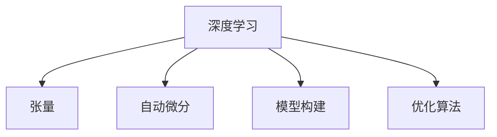

                 

# 张量形状和连续性：深度学习的基础

> 关键词：深度学习, 张量形状, 连续性, 模型构建, 优化算法, 自动微分

## 1. 背景介绍

### 1.1 问题由来
深度学习(Deep Learning, DL)已经成为当前人工智能领域最热门的技术之一，广泛应用于图像识别、语音识别、自然语言处理、推荐系统等多个领域。然而，深度学习的核心原理却常常被忽略。本文将系统介绍深度学习的基础，从最基本的概念开始，逐步深入讲解深度学习的核心原理和应用。

## 2. 核心概念与联系

### 2.1 核心概念概述

为更好地理解深度学习的核心原理，本节将介绍几个关键概念：

- **深度学习**：一种通过构建多层神经网络来模拟人脑处理复杂信息的技术。
- **张量(Tensor)**：深度学习中最基本的数学表示形式，是包含多个维度的数据结构。
- **自动微分**：通过链式法则自动计算梯度的一种技术，是深度学习模型训练的基础。
- **模型构建**：定义深度学习模型的架构、层数、激活函数、损失函数等关键参数。
- **优化算法**：如梯度下降、Adam、RMSprop等，用于调整模型参数，最小化损失函数。

这些概念构成了深度学习的核心框架，使我们能够通过构建、训练、优化深度学习模型来解决各种复杂问题。

### 2.2 核心概念原理和架构的 Mermaid 流程图



这个流程图展示了深度学习各个核心概念之间的逻辑关系：

1. 深度学习模型通过张量表示数据和模型参数。
2. 自动微分技术计算梯度，使模型参数能够被优化。
3. 模型构建决定了模型结构和参数。
4. 优化算法调整模型参数，最小化损失函数。

这些概念共同构成了深度学习的基本框架，使得我们能够构建和训练复杂的深度学习模型，解决各种复杂问题。

## 3. 核心算法原理 & 具体操作步骤
### 3.1 算法原理概述

深度学习模型的训练过程主要分为两个步骤：模型构建和优化。下面将分别介绍这两个步骤的原理。

### 3.2 算法步骤详解

#### 3.2.1 模型构建

深度学习模型通常由多个层组成，每一层接收上一层的输出，并产生新的输出。模型中的每一层都可以看作是一个线性变换，加上一个非线性激活函数。以最简单的全连接神经网络为例，其架构如下：

$$
y = \sigma(Wx + b)
$$

其中，$x$ 是输入向量，$y$ 是输出向量，$W$ 和 $b$ 分别是权重矩阵和偏置向量，$\sigma$ 是激活函数。激活函数的作用是将线性变换的结果映射到非线性空间，使模型具有更强的表达能力。

#### 3.2.2 优化算法

优化算法的目标是通过调整模型参数，最小化损失函数。常见的优化算法包括：

- **梯度下降**：通过反向传播算法计算梯度，按梯度的反方向更新模型参数。
- **Adam**：一种自适应学习率的优化算法，通过动态调整学习率来提高优化效率。
- **RMSprop**：通过平滑梯度的方差来加速收敛。

以梯度下降为例，其更新公式如下：

$$
\theta \leftarrow \theta - \eta \nabla_{\theta}L
$$

其中，$\theta$ 为模型参数，$\eta$ 为学习率，$\nabla_{\theta}L$ 为损失函数对参数的梯度。

### 3.3 算法优缺点

深度学习的优点包括：

- **强大的表达能力**：通过构建多层网络，深度学习能够处理复杂的数据结构，如图像、语音、文本等。
- **自动学习特征**：深度学习通过反向传播算法自动学习数据中的特征，无需手工设计特征工程。
- **可扩展性强**：深度学习模型可以通过增加层数或神经元数目来提高模型复杂度，增强模型性能。

然而，深度学习也存在一些缺点：

- **计算资源需求高**：深度学习模型通常具有大量参数，训练和推理需要大量计算资源。
- **过拟合风险**：深度学习模型容易过拟合，尤其是数据量不足的情况下。
- **解释性差**：深度学习模型通常被视为"黑盒"，难以解释其内部决策过程。

### 3.4 算法应用领域

深度学习的应用领域非常广泛，主要包括：

- **计算机视觉**：图像识别、物体检测、图像生成等。
- **自然语言处理**：文本分类、机器翻译、问答系统等。
- **语音识别**：语音识别、语音合成等。
- **推荐系统**：商品推荐、用户画像等。
- **游戏AI**：强化学习、游戏策略等。

## 4. 数学模型和公式 & 详细讲解 & 举例说明

### 4.1 数学模型构建

深度学习模型通常由多个层组成，每一层都可以看作是一个线性变换，加上一个非线性激活函数。以最简单的全连接神经网络为例，其架构如下：

$$
y = \sigma(Wx + b)
$$

其中，$x$ 是输入向量，$y$ 是输出向量，$W$ 和 $b$ 分别是权重矩阵和偏置向量，$\sigma$ 是激活函数。

### 4.2 公式推导过程

以一个简单的二分类问题为例，假设模型已经给出输入 $x$，通过 $W$ 和 $b$ 计算得到输出 $y$，损失函数为交叉熵损失，优化算法为梯度下降，求得梯度后进行参数更新。

$$
L = -\frac{1}{N} \sum_{i=1}^N [y_i \log(\sigma(x_i)) + (1-y_i) \log(1-\sigma(x_i))]
$$

$$
\nabla_{\theta}L = -\frac{1}{N} \sum_{i=1}^N [(\sigma(x_i)-y_i)x_i]
$$

$$
\theta \leftarrow \theta - \eta \nabla_{\theta}L
$$

其中，$\theta$ 为模型参数，$\eta$ 为学习率，$\nabla_{\theta}L$ 为损失函数对参数的梯度。

### 4.3 案例分析与讲解

假设我们有一个简单的二分类问题，输入为2维向量 $x$，输出为1维向量 $y$，激活函数为sigmoid。

$$
x = \begin{bmatrix} 1 \\ 2 \end{bmatrix}, y = 1
$$

$$
W = \begin{bmatrix} 0.5 & -0.5 \\ 0.5 & 0.5 \end{bmatrix}, b = \begin{bmatrix} 0 \\ 0 \end{bmatrix}
$$

$$
y = \sigma(Wx + b) = \sigma\left(\begin{bmatrix} 0.5 & -0.5 \\ 0.5 & 0.5 \end{bmatrix} \begin{bmatrix} 1 \\ 2 \end{bmatrix} + \begin{bmatrix} 0 \\ 0 \end{bmatrix}\right) = 0.9
$$

损失函数为：

$$
L = -\frac{1}{2} (1 \cdot \log(0.9) + 1 \cdot \log(0.1)) = -1.11
$$

梯度为：

$$
\nabla_{\theta}L = -\frac{1}{2} \begin{bmatrix} 0.1 \\ 0.1 \end{bmatrix}
$$

更新模型参数：

$$
W \leftarrow W - \eta \nabla_{\theta}L = \begin{bmatrix} 0.5 - 0.05 & -0.5 \\ 0.5 & 0.5 \end{bmatrix}, b \leftarrow b
$$

经过几次迭代后，模型参数和损失函数不断优化，最终达到收敛。

## 5. 项目实践：代码实例和详细解释说明

### 5.1 开发环境搭建

在进行深度学习项目开发前，我们需要准备好开发环境。以下是使用Python进行TensorFlow开发的环境配置流程：

1. 安装Anaconda：从官网下载并安装Anaconda，用于创建独立的Python环境。

2. 创建并激活虚拟环境：
```bash
conda create -n tf-env python=3.8
conda activate tf-env
```

3. 安装TensorFlow：根据CUDA版本，从官网获取对应的安装命令。例如：
```bash
conda install tensorflow tensorflow-gpu=2.5 -c conda-forge
```

4. 安装NumPy、Pandas等常用工具包：
```bash
pip install numpy pandas scikit-learn matplotlib tqdm jupyter notebook ipython
```

完成上述步骤后，即可在`tf-env`环境中开始深度学习项目开发。

### 5.2 源代码详细实现

下面以一个简单的全连接神经网络为例，使用TensorFlow实现深度学习模型的构建和训练。

```python
import tensorflow as tf
import numpy as np

# 定义模型参数
np.random.seed(1)
W = np.random.randn(2, 1)
b = np.random.randn(1)
learning_rate = 0.1

# 定义输入和输出
x = np.array([[1, 2], [3, 4], [5, 6], [7, 8]])
y = np.array([[1], [1], [0], [0]])

# 定义模型函数
def model(x):
    return tf.nn.sigmoid(tf.matmul(x, W) + b)

# 定义损失函数
def loss(y_pred, y_true):
    return tf.reduce_mean(-tf.reduce_sum(y_true * tf.log(y_pred) + (1 - y_true) * tf.log(1 - y_pred)))

# 定义优化器
optimizer = tf.optimizers.Adam(learning_rate)

# 定义训练函数
def train():
    with tf.GradientTape() as tape:
        y_pred = model(x)
        loss_val = loss(y_pred, y)
    gradients = tape.gradient(loss_val, [W, b])
    optimizer.apply_gradients(zip(gradients, [W, b]))
    return loss_val

# 训练模型
for i in range(1000):
    loss_val = train()
    if i % 100 == 0:
        print("Epoch {}, Loss: {:.4f}".format(i, loss_val))

# 测试模型
x_test = np.array([[9, 10], [11, 12]])
y_test = np.array([[1], [1]])
y_pred = model(x_test)
print("Prediction: {:.4f}".format(y_pred.numpy()[0][0]))
```

### 5.3 代码解读与分析

让我们再详细解读一下关键代码的实现细节：

**模型函数**：
- `model(x)`：定义模型，通过输入向量 $x$ 和权重 $W$、偏置 $b$ 计算输出。

**损失函数**：
- `loss(y_pred, y_true)`：定义交叉熵损失函数，用于衡量模型预测输出与真实标签之间的差异。

**优化器**：
- `optimizer = tf.optimizers.Adam(learning_rate)`：定义Adam优化器，学习率为 $0.1$。

**训练函数**：
- `train()`：定义训练函数，通过梯度下降优化模型参数。
- `with tf.GradientTape() as tape:`：定义梯度计算上下文，自动记录模型的前向传播和梯度计算过程。
- `gradients = tape.gradient(loss_val, [W, b])`：计算损失函数对模型参数的梯度。
- `optimizer.apply_gradients(zip(gradients, [W, b]))`：根据梯度更新模型参数。

**训练过程**：
- 在循环中，对模型进行多次迭代训练，每次迭代计算损失函数并更新模型参数。
- 每100个epoch打印一次损失函数值。
- 最终在测试集上评估模型预测结果。

可以看到，TensorFlow提供了便捷的API接口，使得深度学习模型的构建和训练变得简单易行。

## 6. 实际应用场景

### 6.1 计算机视觉

计算机视觉是深度学习的重要应用领域之一，深度学习模型被广泛应用于图像识别、物体检测、图像生成等任务。以图像分类为例，通过在图像数据集上预训练大模型，然后在特定类别上微调，可以显著提升模型在特定类别上的性能。

### 6.2 自然语言处理

自然语言处理(NLP)是深度学习的另一个重要应用领域，深度学习模型被广泛应用于文本分类、机器翻译、问答系统等任务。以文本分类为例，通过在文本数据集上预训练大模型，然后在特定类别上微调，可以显著提升模型在特定类别上的性能。

### 6.3 语音识别

语音识别是深度学习的另一个重要应用领域，深度学习模型被广泛应用于语音识别、语音合成等任务。以语音识别为例，通过在语音数据集上预训练大模型，然后在特定任务上微调，可以显著提升模型在特定任务上的性能。

### 6.4 推荐系统

推荐系统是深度学习的重要应用领域之一，深度学习模型被广泛应用于商品推荐、用户画像等任务。以商品推荐为例，通过在商品数据集上预训练大模型，然后在特定用户画像上微调，可以显著提升模型在特定用户画像上的性能。

### 6.5 未来应用展望

随着深度学习技术的不断发展，深度学习模型将在更多领域得到应用，为各行各业带来变革性影响。

在智慧医疗领域，深度学习模型被广泛应用于医学影像分析、疾病预测等任务，辅助医生诊断和治疗。

在智能制造领域，深度学习模型被广泛应用于质量检测、故障诊断等任务，提高生产效率和产品质量。

在自动驾驶领域，深度学习模型被广泛应用于图像识别、路径规划等任务，提升驾驶安全性和舒适性。

在金融领域，深度学习模型被广泛应用于信用评估、风险控制等任务，提高金融机构的决策效率和准确性。

## 7. 工具和资源推荐

### 7.1 学习资源推荐

为了帮助开发者系统掌握深度学习的理论基础和实践技巧，这里推荐一些优质的学习资源：

1. 《深度学习》系列书籍：由Ian Goodfellow、Yoshua Bengio、Aaron Courville合著，全面介绍了深度学习的理论基础和实践技巧。
2. 《Python深度学习》系列书籍：由Francois Chollet合著，详细介绍了使用Keras实现深度学习模型的方法。
3. Coursera深度学习课程：由Andrew Ng主讲的深度学习课程，系统讲解了深度学习的理论基础和实践技巧。
4. TensorFlow官方文档：TensorFlow的官方文档，提供了丰富的深度学习模型和API接口，是学习深度学习的必备资料。
5. PyTorch官方文档：PyTorch的官方文档，提供了丰富的深度学习模型和API接口，是学习深度学习的另一重要资源。

通过对这些资源的学习实践，相信你一定能够快速掌握深度学习的精髓，并用于解决实际的复杂问题。

### 7.2 开发工具推荐

高效的开发离不开优秀的工具支持。以下是几款用于深度学习开发的常用工具：

1. TensorFlow：由Google主导开发的开源深度学习框架，生产部署方便，适合大规模工程应用。
2. PyTorch：由Facebook主导开发的开源深度学习框架，灵活动态的计算图，适合快速迭代研究。
3. Keras：一个高层API接口，基于TensorFlow和Theano实现，适合快速搭建深度学习模型。
4. Jupyter Notebook：一个交互式的开发环境，支持Python、R等语言，适合研究性开发。
5. Colab：谷歌推出的在线Jupyter Notebook环境，免费提供GPU/TPU算力，方便开发者快速上手实验最新模型。

合理利用这些工具，可以显著提升深度学习项目的开发效率，加快创新迭代的步伐。

### 7.3 相关论文推荐

深度学习的研究进展迅速，以下是几篇奠基性的相关论文，推荐阅读：

1. "ImageNet Classification with Deep Convolutional Neural Networks"（AlexNet）：提出了卷积神经网络(CNN)，用于图像分类任务，取得了突破性成果。
2. "Rethinking the Inception Architecture for Computer Vision"：提出了Inception架构，通过多尺度卷积增强模型性能。
3. "Google's Neural Machine Translation System"：提出了基于Transformer的机器翻译模型，取得了突破性成果。
4. "Attention Is All You Need"：提出了Transformer架构，用于自然语言处理任务，取得了突破性成果。
5. "Self-Attentive Image Segmentation with Deep Residual Networks"：提出了ResNet架构，通过残差连接增强深度学习模型的表达能力。

这些论文代表了深度学习领域的重大突破，通过学习这些前沿成果，可以帮助研究者把握学科前进方向，激发更多的创新灵感。

## 8. 总结：未来发展趋势与挑战

### 8.1 总结

本文对深度学习的基础原理进行了全面系统的介绍，从最基本的概念开始，逐步深入讲解深度学习的核心原理和应用。首先介绍了深度学习的基本概念和架构，然后详细讲解了深度学习模型的构建、优化和训练过程。通过这些内容的学习，相信你一定能够系统掌握深度学习的理论基础和实践技巧。

### 8.2 未来发展趋势

展望未来，深度学习的发展趋势主要包括以下几个方向：

1. 深度学习模型的规模将进一步扩大。随着计算能力的提升和数据量的增长，深度学习模型的规模将不断扩大，使得模型能够处理更加复杂和多样化的数据。
2. 深度学习模型的可解释性将得到提升。通过引入可解释性技术，如可视化、解释模型等，深度学习模型将变得更加透明和可信。
3. 深度学习模型的实时性将得到提升。通过模型压缩、量化、剪枝等技术，深度学习模型将变得更加轻量级，能够实时处理大规模数据。
4. 深度学习模型的应用将进一步扩展。深度学习模型将被广泛应用于更多领域，如智慧城市、自动驾驶、医疗等。

### 8.3 面临的挑战

尽管深度学习技术已经取得了瞩目成就，但在迈向更加智能化、普适化应用的过程中，它仍面临着诸多挑战：

1. 计算资源需求高。深度学习模型通常具有大量参数，训练和推理需要大量计算资源。
2. 模型过拟合风险。深度学习模型容易过拟合，尤其是在数据量不足的情况下。
3. 模型解释性差。深度学习模型通常被视为"黑盒"，难以解释其内部决策过程。
4. 数据隐私和安全问题。深度学习模型通常需要大量数据进行训练，数据隐私和安全问题不容忽视。
5. 模型偏见和歧视问题。深度学习模型可能学习到有偏见、有害的信息，给实际应用带来安全隐患。

### 8.4 研究展望

面对深度学习面临的挑战，未来的研究需要在以下几个方面寻求新的突破：

1. 探索无监督和半监督深度学习模型。摆脱对大规模标注数据的依赖，利用自监督学习、主动学习等无监督和半监督范式，最大限度利用非结构化数据。
2. 研究深度学习模型的可解释性和鲁棒性。通过引入可解释性技术，提升模型的透明度和可信度；通过对抗训练等技术，提高模型的鲁棒性和抗干扰能力。
3. 开发更加高效的深度学习模型。通过模型压缩、量化、剪枝等技术，降低模型的计算复杂度和存储开销，提高模型的实时性和资源利用率。
4. 探索深度学习模型的应用扩展。将深度学习模型应用于更多领域，如智慧城市、自动驾驶、医疗等，解决现实世界中的复杂问题。

总之，深度学习技术正处于快速发展阶段，未来的研究需要在理论和应用两个层面不断深入，才能更好地应对复杂问题，推动人工智能技术的发展。

## 9. 附录：常见问题与解答

**Q1：什么是深度学习？**

A: 深度学习是一种通过构建多层神经网络来模拟人脑处理复杂信息的技术。它通过自动学习数据中的特征，进行分类、回归、生成等任务。

**Q2：深度学习模型的构建和优化过程中，如何进行参数更新？**

A: 深度学习模型的构建和优化主要依赖于梯度下降等优化算法。通过反向传播算法计算梯度，按梯度的反方向更新模型参数。

**Q3：深度学习模型在实际应用中，如何处理大规模数据？**

A: 深度学习模型通常需要大量数据进行训练和推理。为了处理大规模数据，可以使用分布式计算、模型压缩、量化等技术，提高模型的效率和资源利用率。

**Q4：深度学习模型在实际应用中，如何防止过拟合？**

A: 防止深度学习模型过拟合，可以通过数据增强、正则化、Dropout等技术，提高模型的泛化能力和鲁棒性。

**Q5：深度学习模型在实际应用中，如何提高模型的可解释性？**

A: 提高深度学习模型的可解释性，可以通过引入可解释性技术，如可视化、解释模型等，使模型更加透明和可信。

---

作者：禅与计算机程序设计艺术 / Zen and the Art of Computer Programming

