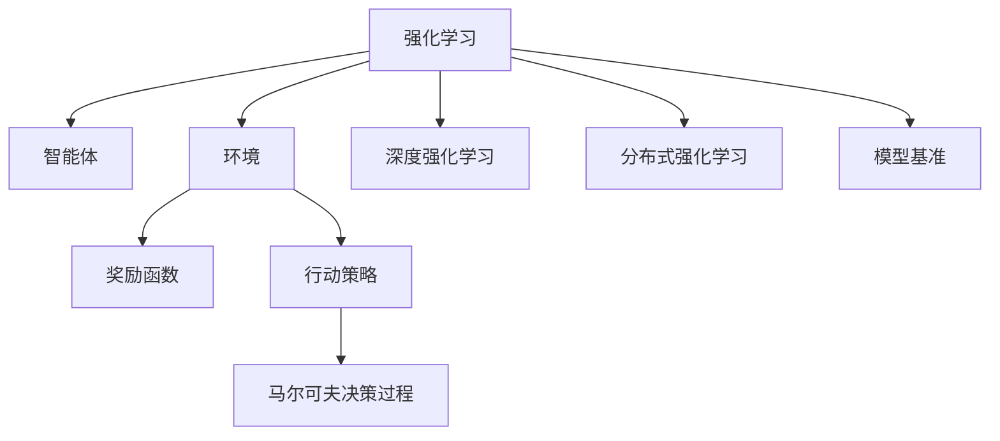

                 

# 强化学习：AI代理的决策与控制

> 关键词：强化学习,AI代理,决策理论,环境模型,行动策略,奖励函数,马尔可夫决策过程,深度强化学习,分布式强化学习,模型基准

## 1. 背景介绍

### 1.1 问题由来
随着人工智能(AI)技术的发展，智能体(Agent)在复杂环境中进行智能决策和控制的需求日益迫切。强化学习(Reinforcement Learning, RL)作为一门研究智能体与环境互动中智能决策的科学，为实现这一目标提供了强有力的工具。通过不断的试错学习，智能体可以自主地调整行动策略，优化决策性能。

### 1.2 问题核心关键点
强化学习主要关注如何在无监督的环境中，使智能体学习到最优决策策略。核心问题可以概括为：

- 如何构建环境模型？如何更精确地理解环境特征？
- 如何设计奖励函数？如何评估决策的质量？
- 如何设计行动策略？如何最大化长期回报？
- 如何应对高维状态空间和高频决策问题？
- 如何实现复杂决策空间的探索与利用？
- 如何处理策略优化中的收敛性和稳定性的问题？

本文将聚焦于强化学习的基本原理和核心算法，详细介绍其决策与控制过程。

## 2. 核心概念与联系

### 2.1 核心概念概述

为更好地理解强化学习的决策与控制机制，本节将介绍几个关键概念：

- 强化学习(RL)：通过与环境互动，智能体学习最优决策策略的过程。在每次交互中，智能体观察环境状态，选择行动，接收环境反馈，不断迭代优化策略。

- 智能体(Agent)：在环境中进行行动决策的实体，可以是人或机器。智能体的目标是通过学习优化决策过程。

- 环境(Environment)：智能体进行决策的动态系统，具有明确的输入输出关系，反馈给智能体奖励信号。

- 行动策略(Policy)：智能体在给定状态下选择行动的概率分布，是学习的核心对象。

- 奖励函数(Reward Function)：环境对智能体行动的即时反馈，指导智能体朝着有利于最终目标的方向行动。

- 马尔可夫决策过程(Markov Decision Process, MDP)：一种描述环境动态和智能体行动决策的数学模型，是强化学习的基础。

- 深度强化学习(Deep RL)：利用神经网络模型对高维状态空间和高频决策进行建模和优化。

- 分布式强化学习(Distributed RL)：通过多智能体的协同行动，提升决策效率和性能。

- 模型基准(Model Benchmark)：用于评估和比较强化学习算法性能的标准测试集，如OpenAI Gym环境等。

这些核心概念之间的逻辑关系可以通过以下Mermaid流程图来展示：



这个流程图展示了强化学习及其相关概念之间的联系：

1. 强化学习通过智能体与环境交互，优化行动策略。
2. 环境通过奖励函数反馈智能体的决策效果。
3. 智能体使用行动策略选择行动，模型使用马尔可夫决策过程进行决策建模。
4. 深度强化学习和分布式强化学习通过神经网络和多智能体协同，提升决策性能。
5. 模型基准为评估和比较不同强化学习算法提供了基准环境。

## 3. 核心算法原理 & 具体操作步骤
### 3.1 算法原理概述

强化学习的核心原理可以概括为智能体与环境的动态交互过程，具体步骤包括：

1. 智能体根据当前环境状态，选择一组行动，传递给环境。
2. 环境根据行动和当前状态，计算出下一个状态和即时奖励，返回给智能体。
3. 智能体根据新的状态和奖励，评估行动策略的效果。
4. 智能体使用评估结果，更新行动策略，优化决策性能。

这一过程不断迭代，直到智能体找到一个最优策略，最大化长期回报。核心思想是通过奖励函数引导智能体学习到最优决策策略，利用模型准确理解环境特征，不断优化行动策略，从而实现高效决策。

### 3.2 算法步骤详解

强化学习算法的具体步骤包括：

**Step 1: 定义环境和行动空间**

- 定义环境的状态空间和行动空间，确定智能体的可能选择。
- 选择合适的方法表示状态和行动，如向量、图像、序列等。

**Step 2: 定义奖励函数**

- 定义环境对智能体行动的即时反馈，即奖励函数。
- 设计合理的奖励函数，使智能体学习到有利于长期目标的决策。

**Step 3: 初始化模型参数**

- 初始化智能体的行动策略参数，如神经网络权重、参数等。
- 初始化模型的环境模型参数，如状态转移概率、奖励计算等。

**Step 4: 迭代训练**

- 在每个时间步，智能体选择行动，观察环境反馈。
- 使用强化学习算法更新策略参数，调整行动决策。
- 迭代训练，直到达到预设的训练轮数或性能指标。

**Step 5: 策略评估和部署**

- 在训练结束后，评估训练得到的行动策略性能。
- 将训练得到的策略应用于实际环境，进行策略部署和优化。

### 3.3 算法优缺点

强化学习算法具有以下优点：

1. 自主学习：智能体可以通过与环境的交互自主学习，无需人工干预。
2. 动态适应：智能体能够实时调整行动策略，适应环境变化。
3. 多模态决策：可以处理复杂的多模态数据，适用于多种决策场景。
4. 泛化性强：经过训练的智能体在类似环境中表现良好。

同时，强化学习算法也存在一些局限：

1. 环境建模困难：需要准确的环境模型，否则决策可能出现偏差。
2. 奖励设计复杂：设计合理的奖励函数困难，容易陷入局部最优。
3. 训练过程耗时：训练过程复杂，往往需要大量计算资源和时间。
4. 探索与利用矛盾：如何在探索新行动和利用已有知识之间取得平衡，是一个重要难题。

### 3.4 算法应用领域

强化学习算法在多个领域得到了广泛应用，例如：

- 游戏AI：AlphaGo、AlphaStar等通过强化学习实现复杂决策。
- 机器人控制：ROS-Industrial等开源项目通过强化学习优化机器人操作。
- 自适应系统：推荐系统、交通管理等通过强化学习优化系统运行。
- 金融交易：通过强化学习实现自动化交易和风险管理。
- 资源优化：电网调度和供应链管理等通过强化学习优化资源分配。

这些应用场景展示了强化学习的强大决策能力和控制能力，为各行业的智能化发展提供了新的思路。

## 4. 数学模型和公式 & 详细讲解 & 举例说明

### 4.1 数学模型构建

强化学习的核心数学模型是马尔可夫决策过程(MDP)，其基本结构可以表示为：

$$
\begin{aligned}
S &\in \mathcal{S} \\
A &\in \mathcal{A} \\
P(s'|s,a) &\in [0,1] \\
R(s,a) &\in \mathbb{R} \\
\end{aligned}
$$

其中，$S$ 为状态空间，$A$ 为行动空间，$P(s'|s,a)$ 表示在状态$s$和行动$a$下，环境转移到下一个状态$s'$的概率，$R(s,a)$ 表示在状态$s$和行动$a$下的即时奖励。

### 4.2 公式推导过程

我们以深度Q网络(DQN)算法为例，推导强化学习中Q值的更新公式。

- **Q值定义**：
  $$
  Q(s,a) = \mathbb{E}[R + \gamma \max_{a'} Q(s',a') | s,a]
  $$
  其中，$Q(s,a)$ 表示在状态$s$和行动$a$下的长期累积奖励。

- **Q值更新公式**：
  $$
  Q(s,a) \leftarrow Q(s,a) + \eta [r + \gamma \max_{a'} Q(s',a') - Q(s,a)]
  $$
  其中，$r$ 为即时奖励，$\gamma$ 为折扣因子，$\eta$ 为学习率。

在DQN中，我们通过神经网络模型$f_{\theta}(s,a)$来近似Q值，并使用最小化Q值误差进行训练：

- **神经网络模型**：
  $$
  Q(s,a) \approx f_{\theta}(s,a)
  $$

- **目标函数**：
  $$
  \min_{\theta} \mathbb{E}[(Q(s,a) - f_{\theta}(s,a))^2]
  $$

- **目标更新公式**：
  $$
  f_{\theta}(s,a) \leftarrow f_{\theta}(s,a) + \eta [r + \gamma \max_{a'} f_{\theta}(s',a') - f_{\theta}(s,a)]
  $$

通过反向传播算法，我们可以高效地计算神经网络参数的梯度，并使用梯度下降法更新模型权重。

### 4.3 案例分析与讲解

以下是一个简单的强化学习案例，通过训练智能体在迷宫中寻找终点。

**环境定义**：

- 状态空间：每个网格点作为状态。
- 行动空间：上、下、左、右四个方向。
- 奖励函数：每走到终点获得10分，否则得0分。

**智能体策略**：

- 使用Q值模型预测每个状态-行动对的长期累积奖励。
- 选择行动$a$满足$f_{\theta}(s,a) = \max_{a'} f_{\theta}(s,a')$。

**训练过程**：

- 初始化Q值模型，随机选择行动。
- 根据行动和环境反馈，更新Q值和模型参数。
- 重复训练，直到智能体找到终点。

## 5. 项目实践：代码实例和详细解释说明
### 5.1 开发环境搭建

在进行强化学习实践前，我们需要准备好开发环境。以下是使用Python进行TensorFlow开发的环境配置流程：

1. 安装Anaconda：从官网下载并安装Anaconda，用于创建独立的Python环境。

2. 创建并激活虚拟环境：
```bash
conda create -n reinforcement-env python=3.8 
conda activate reinforcement-env
```

3. 安装TensorFlow：根据CUDA版本，从官网获取对应的安装命令。例如：
```bash
conda install tensorflow tensorflow-gpu=cudatoolkit=11.1 -c pytorch -c conda-forge
```

4. 安装OpenAI Gym：
```bash
pip install gym
```

5. 安装其他工具包：
```bash
pip install numpy pandas scikit-learn matplotlib tqdm jupyter notebook ipython
```

完成上述步骤后，即可在`reinforcement-env`环境中开始强化学习实践。

### 5.2 源代码详细实现

下面我们以迷宫寻找终点为例，给出使用TensorFlow进行强化学习的PyTorch代码实现。

首先，定义迷宫环境和智能体策略：

```python
import gym
import numpy as np
import tensorflow as tf

env = gym.make('Gridworld-v0')

def get_action(s):
    q_values = tf.keras.layers.Dense(4)(state) + tf.Variable(tf.zeros_like(state))
    action_probs = tf.nn.softmax(q_values)
    return np.random.choice(np.arange(4), p=action_probs.numpy()[s])

state = np.zeros(2)  # 当前状态
done = False
while not done:
    action = get_action(state)
    next_state, reward, done, _ = env.step(action)
    state = next_state
```

然后，定义Q值模型和优化器：

```python
q_model = tf.keras.Sequential([
    tf.keras.layers.Dense(16, activation='relu', input_shape=(2,)),
    tf.keras.layers.Dense(4)
])

optimizer = tf.keras.optimizers.Adam(learning_rate=0.01)
```

接着，定义训练过程：

```python
epochs = 1000
batch_size = 32
for _ in range(epochs):
    state = np.zeros(2)  # 初始化状态
    while not done:
        action = get_action(state)
        next_state, reward, done, _ = env.step(action)
        state = next_state
        
        q_values = q_model.predict(state)
        action_q = q_values[0][action]
        target_q = reward + 0.9 * np.max(q_model.predict(next_state))
        q_model.train_on_batch(state, [action_q - target_q])
```

最后，启动训练流程：

```python
with tf.Session() as sess:
    sess.run(tf.global_variables_initializer())
    sess.run(tf.keras.backend.set_value(q_model.trainable, True))
    sess.run(q_model.compile(optimizer, loss='mse'))
    
    for _ in range(epochs):
        state = np.zeros(2)  # 初始化状态
        while not done:
            action = get_action(state)
            next_state, reward, done, _ = env.step(action)
            state = next_state
        
            q_values = sess.run(q_model.predict(state))
            action_q = q_values[0][action]
            target_q = reward + 0.9 * np.max(sess.run(q_model.predict(next_state)))
            sess.run(q_model.train_on_batch, state, [action_q - target_q])
```

以上就是使用TensorFlow进行强化学习的完整代码实现。可以看到，TensorFlow提供了一站式强化学习开发框架，可以高效地实现Q值模型的训练和优化。

### 5.3 代码解读与分析

让我们再详细解读一下关键代码的实现细节：

**迷宫环境定义**：
- `gym.make('Gridworld-v0')`：创建一个2x2的迷宫环境，智能体通过观察网格点的状态，选择四个方向中的任意一个进行移动。

**智能体策略**：
- `get_action(s)`：使用Q值模型预测当前状态$s$下每个行动$a$的Q值，选择Q值最大的行动。

**Q值模型定义**：
- `tf.keras.Sequential`：使用TensorFlow的Keras API定义Q值模型，包含一个ReLU激活的隐藏层和一个全连接层。

**训练过程**：
- 使用`tf.keras.optimizers.Adam`优化器，设置学习率为0.01。
- 在每个epoch内，通过随机选择行动，观察环境反馈，更新Q值和模型参数。

**训练流程**：
- 在TensorFlow会话中初始化模型参数。
- 使用`tf.keras.backend.set_value`设置模型可训练为True。
- 使用`tf.keras.compile`编译模型，定义损失函数和优化器。
- 在每个epoch内，通过随机选择行动，观察环境反馈，更新Q值和模型参数。

可以看到，TensorFlow的Keras API为强化学习模型的训练和优化提供了高效的接口，使得开发过程更加便捷。

当然，工业级的系统实现还需考虑更多因素，如模型的保存和部署、超参数的自动搜索、多智能体的协同等。但核心的强化学习算法基本与此类似。

## 6. 实际应用场景
### 6.1 智能交通管理

强化学习在智能交通管理中的应用，可以通过训练智能体优化交通信号灯的控制策略，实现更高效的交通流量管理。具体而言，通过实时监测交通状况，智能体可以学习到最佳的信号灯控制策略，提高交通效率，降低交通事故率。

在技术实现上，智能体可以基于历史交通数据，使用深度强化学习算法进行训练。训练后，智能体可以实时接收传感器反馈，自动调整信号灯状态，实现自适应的交通控制。

### 6.2 智能机器人导航

强化学习在智能机器人导航中的应用，可以通过训练机器人自主地在高动态、不确定环境中进行路径规划和避障。具体而言，通过构建虚拟或实际环境，训练机器人学习最优行动策略，使得机器人能够在复杂场景下自主导航，达到任务目标。

在技术实现上，可以使用DQN算法训练机器人行动策略。训练后，机器人可以在实际环境中自主导航，避开障碍物，到达目标地点。

### 6.3 自动化交易

强化学习在自动化交易中的应用，可以通过训练智能体进行股票交易，实现更精准的买卖决策。具体而言，通过历史交易数据和实时市场信息，智能体可以学习到最优的交易策略，最大化投资回报。

在技术实现上，可以使用强化学习算法训练交易策略。训练后，智能体可以实时监控市场动态，自主进行买卖决策，优化投资回报。

### 6.4 未来应用展望

随着强化学习技术的发展，其在更多领域的应用前景将进一步拓展。

- 在智慧城市中，智能体可以优化城市资源配置，提升城市运行效率和居民生活质量。
- 在医疗领域，智能体可以辅助医生进行疾病诊断和治疗方案推荐，提高医疗服务水平。
- 在教育领域，智能体可以辅助教师进行个性化教学，提升教学效果和学生学习体验。
- 在金融领域，智能体可以进行风险评估和自动化投资管理，提升金融服务质量。

强化学习技术的不断进步，将推动其在更多场景中的广泛应用，为各行各业带来新的突破和发展机遇。

## 7. 工具和资源推荐
### 7.1 学习资源推荐

为了帮助开发者系统掌握强化学习的理论基础和实践技巧，这里推荐一些优质的学习资源：

1. 《Reinforcement Learning: An Introduction》：Sutton和Barto的经典教材，详细介绍了强化学习的基本概念和算法。

2. 《Deep Reinforcement Learning with TensorFlow 2》：Zaremba等人的开源书籍，结合TensorFlow 2深度学习框架，介绍了强化学习的深度学习应用。

3. 《Hands-On Reinforcement Learning with TensorFlow 2》：Hasselt等人的教材，结合TensorFlow 2，介绍了强化学习的实战技巧和应用案例。

4. OpenAI Gym：Python环境的强化学习模拟环境，包含多种经典环境，用于训练和测试强化学习算法。

5. RLlib：OpenAI开发的强化学习库，支持多种强化学习算法和并行训练。

6. Gym-Atari：OpenAI Gym扩展环境，支持训练和测试Atari游戏，用于研究强化学习在复杂环境中的应用。

通过对这些资源的学习实践，相信你一定能够快速掌握强化学习的精髓，并用于解决实际的决策问题。

### 7.2 开发工具推荐

高效的开发离不开优秀的工具支持。以下是几款用于强化学习开发的常用工具：

1. TensorFlow：由Google主导开发的深度学习框架，支持强化学习算法的实现和优化。

2. PyTorch：Facebook开发的深度学习框架，提供高效的计算图和动态图功能，适合强化学习模型的开发。

3. OpenAI Gym：Python环境的强化学习模拟环境，提供多种经典环境，方便模型训练和测试。

4. RLlib：OpenAI开发的强化学习库，支持多种强化学习算法和并行训练。

5. TensorBoard：TensorFlow配套的可视化工具，可以实时监测模型训练状态，并提供丰富的图表呈现方式。

6. Weights & Biases：模型训练的实验跟踪工具，可以记录和可视化模型训练过程中的各项指标，方便对比和调优。

合理利用这些工具，可以显著提升强化学习模型的开发效率，加快创新迭代的步伐。

### 7.3 相关论文推荐

强化学习技术的发展离不开学界的持续研究。以下是几篇奠基性的相关论文，推荐阅读：

1. Q-Learning：Watkins的论文，提出Q-Learning算法，奠定了强化学习的基础。

2. Policy Gradient Methods for General Reinforcement Learning：Sutton的论文，提出政策梯度方法，使强化学习可以处理复杂决策问题。

3. Trust-Region Policy Optimization (TRPO)：Schulman等人的论文，提出TRPO算法，提升强化学习算法的稳定性和收敛性。

4. Proximal Policy Optimization (PPO)：Schmidhuber等人的论文，提出PPO算法，进一步提升强化学习算法的稳定性和收敛性。

5. Distributional Reinforcement Learning：Hessel等人的论文，提出分布式强化学习算法，使强化学习可以处理不确定性的决策问题。

这些论文代表了大强化学习的发展脉络。通过学习这些前沿成果，可以帮助研究者把握学科前进方向，激发更多的创新灵感。

## 8. 总结：未来发展趋势与挑战

### 8.1 总结

本文对强化学习的基本原理和核心算法进行了全面系统的介绍。首先阐述了强化学习的基本概念和决策与控制过程，明确了强化学习在复杂环境中的智能决策能力。其次，从原理到实践，详细讲解了强化学习的数学模型和关键步骤，给出了强化学习任务开发的完整代码实例。同时，本文还广泛探讨了强化学习在智能交通、智能机器人、自动化交易等多个行业领域的应用前景，展示了强化学习技术的强大决策能力和控制能力。

通过本文的系统梳理，可以看到，强化学习在多模态决策、复杂环境适应、高维状态空间优化等方面具有独特的优势。其自主学习和动态适应的能力，使其成为构建智能系统的有力工具。未来，伴随强化学习技术的发展，其在各领域的广泛应用将进一步拓展，为经济社会发展注入新的动力。

### 8.2 未来发展趋势

展望未来，强化学习技术将呈现以下几个发展趋势：

1. 多智能体协同学习：利用多智能体的协作，提升决策性能和效率，应对复杂多变的环境。

2. 深度强化学习与深度学习结合：深度强化学习与深度学习技术融合，提升决策模型的复杂性和泛化能力。

3. 分布式强化学习：利用分布式计算和并行化技术，提高强化学习算法的训练速度和性能。

4. 强化学习与优化问题结合：利用强化学习优化资源配置、供应链管理等复杂优化问题，提升系统效率。

5. 强化学习与强化博弈结合：利用强化学习进行复杂博弈问题建模，优化策略设计。

6. 强化学习与机器人控制结合：利用强化学习优化机器人行为，提升机器人自主决策能力。

这些趋势凸显了强化学习技术的广阔前景。这些方向的探索发展，必将进一步提升强化学习的决策性能和控制能力，为复杂环境中的智能决策提供新的思路。

### 8.3 面临的挑战

尽管强化学习技术已经取得了瞩目成就，但在迈向更加智能化、普适化应用的过程中，它仍面临着诸多挑战：

1. 环境建模困难：需要准确的环境模型，否则决策可能出现偏差。
2. 奖励设计复杂：设计合理的奖励函数困难，容易陷入局部最优。
3. 训练过程耗时：训练过程复杂，往往需要大量计算资源和时间。
4. 探索与利用矛盾：如何在探索新行动和利用已有知识之间取得平衡，是一个重要难题。
5. 可解释性不足：强化学习模型通常难以解释决策过程，缺乏透明性和可解释性。

### 8.4 研究展望

面对强化学习面临的这些挑战，未来的研究需要在以下几个方面寻求新的突破：

1. 探索更高效的环境建模方法：利用深度学习、模型基准等技术，提升环境建模的准确性和效率。

2. 研究更灵活的奖励设计方法：利用多目标优化、偏好学习等方法，设计更加合理的奖励函数。

3. 开发更高效的训练算法：利用并行化、分布式化技术，提升强化学习算法的训练速度和性能。

4. 加强决策过程的可解释性：利用符号化方法、因果推断等技术，提升强化学习模型的透明性和可解释性。

5. 结合多模态数据融合：利用深度学习、多模态数据融合等技术，提升决策模型的复杂性和泛化能力。

6. 探索更灵活的策略设计方法：利用符号化方法、模型基准等技术，提升策略设计的灵活性和鲁棒性。

这些研究方向的探索，必将引领强化学习技术迈向更高的台阶，为构建安全、可靠、可解释、可控的智能系统铺平道路。面向未来，强化学习技术还需要与其他人工智能技术进行更深入的融合，如知识表示、因果推理、强化博弈等，多路径协同发力，共同推动智能系统的进步。只有勇于创新、敢于突破，才能不断拓展强化学习的边界，让智能技术更好地造福人类社会。

## 9. 附录：常见问题与解答

**Q1：强化学习算法的收敛性如何保证？**

A: 强化学习算法的收敛性主要依赖于策略梯度估计的准确性和稳定性能。常见的收敛性保证方法包括：

- 使用改进的优化器，如Trust Region Policy Optimization (TRPO)、Proximal Policy Optimization (PPO)等，提升收敛速度和稳定性。
- 引入正则化技术，如权重衰减、Dropout等，抑制过拟合和噪声影响。
- 使用对抗训练技术，如生成对抗网络(GAN)，增强模型的鲁棒性和泛化能力。
- 设计合理的目标函数，避免在奖励函数设计中的局部最优陷阱。

**Q2：强化学习算法如何处理高维状态空间？**

A: 处理高维状态空间的主要方法包括：

- 利用卷积神经网络(CNN)、递归神经网络(RNN)等深度学习模型，提取状态特征。
- 使用多维嵌入表示，如状态向量、状态树等，降低状态空间的维度。
- 设计稀疏化状态表示方法，如状态表示压缩、状态划分等，减少模型复杂度。

**Q3：强化学习算法如何处理稀疏奖励问题？**

A: 处理稀疏奖励问题的主要方法包括：

- 使用稀疏奖励增强技术，如奖励堆叠(Reward Shaping)、奖励变换(Reward Transformation)等，提升奖励信号的密度。
- 使用蒙特卡罗方法，如Q-Learning、SARSA等，通过模拟遍历状态空间，利用样本来估计Q值和策略梯度。
- 使用模型预测奖励函数，如深度Q网络(DQN)、策略梯度方法等，利用模型预测奖励信号，提升学习的稳定性和效率。

**Q4：强化学习算法如何处理环境建模问题？**

A: 处理环境建模问题的主要方法包括：

- 利用模拟环境进行训练，如使用OpenAI Gym等模拟环境，模拟真实环境中的决策过程。
- 设计合理的奖励函数，利用模型预测奖励信号，提升学习的稳定性和效率。
- 使用环境建模技术，如动态系统模型、马尔可夫决策过程(MDP)等，提升对环境的理解和建模能力。

**Q5：强化学习算法如何处理探索与利用矛盾？**

A: 处理探索与利用矛盾的主要方法包括：

- 利用$\epsilon$-贪心策略，通过引入随机性，平衡探索与利用。
- 使用上下文感知方法，如上下文记忆、信息瓶颈等，提升决策的稳定性和效率。
- 设计多目标优化算法，如强化学习与信息瓶颈优化相结合，平衡探索与利用。

这些方法可以针对具体的决策问题，灵活组合使用，以解决探索与利用之间的矛盾，提升决策性能。

---

作者：禅与计算机程序设计艺术 / Zen and the Art of Computer Programming

