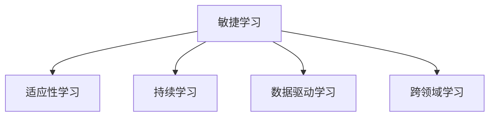

                 

# 快速学习: VUCA时代的制胜法宝

在当今的快速变化、复杂、动荡且不确定性(VUCA)日益加剧的商业环境中，如何快速高效地学习、适应和应对变化，成为了企业和个人成败的关键。本文旨在探讨快速学习的核心概念、方法和应用，为VUCA时代的决策者和学习者提供一套实用的工具和框架。

## 1. 背景介绍

### 1.1 问题由来

全球化、数字化、自动化、个性化、网络化等趋势的持续深入，使得VUCA时代的特征更加显著。在这个复杂多变的商业环境中，企业需要快速适应市场的变化，捕捉商机，避免失败。而快速学习的能力，成为了企业的核心竞争力。

### 1.2 问题核心关键点

快速学习不仅仅是快速获取知识，更重要的是能迅速应用这些知识，对市场变化做出敏捷反应。其核心关键点在于：

- **敏捷性**：能够迅速适应变化，快速响应市场。
- **适应性**：灵活调整策略，以适应不同环境和情境。
- **变革性**：通过学习实现突破性创新，推动企业进步。

在VUCA时代，快速学习的能力成为了企业竞争力的重要组成部分，是企业能否持续发展的关键因素。

### 1.3 问题研究意义

快速学习对于企业来说是提高效率、降低成本、增强市场竞争力的有效途径。具体而言：

1. **提高效率**：快速学习可以迅速获取和应用新知识，缩短从研究到应用的时间。
2. **降低成本**：快速学习可以减少因适应变化而产生的试错成本。
3. **增强竞争力**：快速学习能帮助企业快速捕捉商机，避免市场竞争中落后。

通过深入研究快速学习，掌握其方法和技术，将有助于企业应对VUCA时代的挑战，实现持续发展。

## 2. 核心概念与联系

### 2.1 核心概念概述

为了更好地理解快速学习，本节将介绍几个密切相关的核心概念：

- **敏捷学习(Agile Learning)**：一种快速、迭代、适应性强的学习方法，强调在复杂多变的环境中快速获取和应用知识。
- **适应性学习(Adaptive Learning)**：一种灵活、可调整的学习方式，能够根据环境变化调整学习策略和方向。
- **持续学习(Continuous Learning)**：一种不断更新知识和技能的学习方式，强调在实践中持续学习和改进。
- **数据驱动学习(Data-Driven Learning)**：一种基于数据和事实的学习方法，强调通过数据分析和优化决策。
- **跨领域学习(Cross-Disciplinary Learning)**：一种跨学科、多领域的学习方式，强调知识整合和创新应用。

这些核心概念之间的逻辑关系可以通过以下Mermaid流程图来展示：



这个流程图展示了这个快速学习框架的各个要素及其相互关系：

1. 敏捷学习是快速学习的核心，强调快速响应市场变化。
2. 适应性学习在敏捷学习的基础上，强调灵活调整学习策略。
3. 持续学习进一步强调了学习的持续性和实践性。
4. 数据驱动学习引入了数据的定量分析，提高了学习的精准度。
5. 跨领域学习则拓宽了学习的视野，强化了知识的综合应用。

这些概念共同构成了快速学习的学习框架，为VUCA时代的快速学习提供了全面的指导。

## 3. 核心算法原理 & 具体操作步骤

### 3.1 算法原理概述

快速学习基于敏捷迭代的方法，强调在实际应用中通过不断反馈和调整，快速掌握新知识和技能。其核心原理在于：

- **迭代优化**：通过不断的实验和反馈，优化学习过程和结果。
- **数据分析**：利用数据进行量化分析，指导学习方向。
- **知识迁移**：将已有知识和技能应用到新情境中，实现知识迁移。

快速学习的方法主要包括以下几个步骤：

1. **确定目标**：明确学习的目标和方向。
2. **获取信息**：通过多种渠道获取相关知识和信息。
3. **应用实践**：将所学知识应用于实际问题，进行迭代优化。
4. **持续反馈**：收集实践中的反馈信息，调整学习策略。
5. **知识整合**：将不同领域和学科的知识整合，形成综合应用。

### 3.2 算法步骤详解

快速学习的具体操作步骤如下：

**Step 1: 确定学习目标**

明确学习的具体目标和方向。例如，学习新的管理方法、掌握新技术、提升产品竞争力等。

**Step 2: 收集相关数据**

通过各种渠道获取与目标相关的数据和信息，包括文献、案例、市场数据等。

**Step 3: 选择合适的学习模型**

根据目标和数据特点选择合适的学习模型。例如，回归模型、分类模型、聚类模型等。

**Step 4: 数据预处理和特征工程**

对数据进行清洗、归一化、特征提取等预处理工作，以便更好地进行模型训练。

**Step 5: 模型训练与优化**

利用数据训练模型，通过交叉验证等方法优化模型参数。

**Step 6: 应用实践与迭代优化**

将模型应用于实际问题中，收集反馈信息，进行迭代优化。

**Step 7: 知识整合与扩展**

将所学知识整合到已有知识体系中，形成综合应用。同时，不断扩展新知识，提升学习效果。

### 3.3 算法优缺点

快速学习具有以下优点：

1. **快速响应**：能够迅速适应市场变化，快速获取和应用新知识。
2. **灵活调整**：根据反馈信息灵活调整学习策略，提高学习效果。
3. **成本效益**：通过迭代优化，减少试错成本，提高投资回报率。

但快速学习也存在一些局限性：

1. **数据依赖**：对数据的准确性和全面性要求较高。
2. **资源消耗**：可能需要大量计算资源和时间。
3. **风险控制**：需要有效控制学习的风险，避免因误导性信息导致决策错误。

尽管存在这些局限性，快速学习仍然是一种高效的、实用的学习方式，在VUCA时代具有重要应用价值。

### 3.4 算法应用领域

快速学习技术已经在多个领域得到了广泛应用，具体如下：

- **企业管理**：通过敏捷学习、跨领域学习，提升企业决策效率和市场响应速度。
- **金融投资**：利用数据驱动学习，快速捕捉市场动态，做出投资决策。
- **医疗健康**：通过持续学习、知识整合，提升医疗服务质量和健康管理水平。
- **教育培训**：通过适应性学习、数据驱动学习，提供个性化、高效的学习体验。
- **智能制造**：利用敏捷学习、跨领域学习，提升生产效率和产品质量。

此外，快速学习还广泛应用于研发、市场营销、供应链管理等多个领域，为VUCA时代的企业提供了强大的竞争优势。

## 4. 数学模型和公式 & 详细讲解 & 举例说明

### 4.1 数学模型构建

本节将使用数学语言对快速学习的核心算法进行详细解释。

假设有一个问题 $P$，目标是在有限时间 $t$ 内通过学习模型 $M$ 来解决 $P$。我们可以将学习过程建模为以下优化问题：

$$
\min_{M} \mathcal{L}(M)
$$

其中，$\mathcal{L}(M)$ 表示模型的损失函数，用于衡量模型在特定任务上的性能。

### 4.2 公式推导过程

对于具体的损失函数 $\mathcal{L}(M)$，常见的优化目标包括：

- **均方误差**：$\mathcal{L}(M) = \frac{1}{N} \sum_{i=1}^N (y_i - M(x_i))^2$
- **交叉熵**：$\mathcal{L}(M) = -\frac{1}{N} \sum_{i=1}^N y_i \log M(x_i) + (1 - y_i) \log (1 - M(x_i))$
- **对数损失**：$\mathcal{L}(M) = -\frac{1}{N} \sum_{i=1}^N y_i \log M(x_i)$

推导这些损失函数的优化问题时，可以使用梯度下降等优化算法，不断调整模型参数 $M$，最小化损失函数 $\mathcal{L}(M)$。

### 4.3 案例分析与讲解

以机器学习为例，分析快速学习的数学模型构建和公式推导。

假设有一组训练数据 $D = \{(x_i, y_i)\}_{i=1}^N$，其中 $x_i$ 为输入特征，$y_i$ 为标签。目标是训练一个线性回归模型 $M(x) = \theta_0 + \theta_1 x_1 + \theta_2 x_2 + ... + \theta_n x_n$，使得模型能够最小化损失函数 $\mathcal{L}(M)$。

首先，我们定义损失函数：

$$
\mathcal{L}(M) = \frac{1}{N} \sum_{i=1}^N (y_i - M(x_i))^2
$$

然后，使用梯度下降算法更新模型参数：

$$
\theta_k \leftarrow \theta_k - \eta \frac{\partial \mathcal{L}(M)}{\partial \theta_k}
$$

其中，$\eta$ 为学习率，$\partial \mathcal{L}(M) / \partial \theta_k$ 为损失函数对参数 $k$ 的偏导数。

通过迭代优化，模型逐步接近最优解，最终可以用于解决实际问题。

## 5. 项目实践：代码实例和详细解释说明

### 5.1 开发环境搭建

在进行快速学习实践前，我们需要准备好开发环境。以下是使用Python进行TensorFlow开发的第一步：

1. 安装Anaconda：从官网下载并安装Anaconda，用于创建独立的Python环境。

2. 创建并激活虚拟环境：
```bash
conda create -n tf-env python=3.8 
conda activate tf-env
```

3. 安装TensorFlow：
```bash
conda install tensorflow -c conda-forge
```

4. 安装各类工具包：
```bash
pip install numpy pandas scikit-learn matplotlib tqdm jupyter notebook ipython
```

完成上述步骤后，即可在`tf-env`环境中开始快速学习实践。

### 5.2 源代码详细实现

这里我们以线性回归为例，展示快速学习的代码实现。

首先，定义训练数据：

```python
import numpy as np

# 生成随机数据
x_train = np.random.randn(1000, 2)
y_train = np.dot(x_train, [1.5, -1]) + np.random.randn(1000) * 0.1

# 分割训练集和验证集
split_idx = int(0.7 * len(x_train))
x_val, x_train = x_train[:split_idx], x_train[split_idx:]
y_val, y_train = y_train[:split_idx], y_train[split_idx:]

# 输出数据形状
print("训练集形状：", x_train.shape, y_train.shape)
print("验证集形状：", x_val.shape, y_val.shape)
```

然后，定义线性回归模型：

```python
from tensorflow.keras import layers, models

# 定义模型结构
model = models.Sequential([
    layers.Dense(10, input_shape=(2,), activation='relu'),
    layers.Dense(1)
])

# 编译模型
model.compile(optimizer='adam', loss='mse', metrics=['mae'])

# 输出模型结构
model.summary()
```

接着，训练模型并进行验证：

```python
from tensorflow.keras.callbacks import EarlyStopping

# 设置训练参数
batch_size = 32
epochs = 50

# 训练模型
history = model.fit(x_train, y_train, batch_size=batch_size, epochs=epochs, validation_data=(x_val, y_val))

# 输出训练结果
print("训练完成，模型评估结果：", model.evaluate(x_val, y_val))
```

最后，使用训练好的模型进行预测：

```python
# 预测新数据
x_new = np.array([[1, 2]])
y_pred = model.predict(x_new)

# 输出预测结果
print("预测结果：", y_pred)
```

### 5.3 代码解读与分析

这里我们详细解读代码实现中的关键步骤：

- **数据生成**：使用numpy生成随机数据作为训练集和验证集。
- **模型结构**：使用Keras定义一个包含两个全连接层的线性回归模型。
- **模型编译**：使用adam优化器和均方误差损失函数编译模型。
- **模型训练**：通过fit方法训练模型，并使用EarlyStopping回调控制训练过程。
- **模型评估**：在验证集上评估模型性能，使用evaluate方法得到模型损失和MAE指标。
- **模型预测**：使用训练好的模型对新数据进行预测。

通过代码实现，我们能够直观理解快速学习的关键步骤和方法。

## 6. 实际应用场景

### 6.1 企业敏捷管理

在企业敏捷管理中，快速学习可以用于敏捷项目管理、敏捷团队构建和敏捷文化建设。通过持续学习和适应性学习，企业能够迅速响应市场变化，提升项目成功率和团队效率。

例如，某科技公司通过敏捷学习，引入Scrum敏捷框架，对产品开发流程进行快速迭代和优化。通过定期回顾和改进，团队不断提升产品交付效率和质量，迅速占领市场。

### 6.2 金融投资

在金融投资领域，快速学习可以用于市场趋势预测、投资组合优化和风险管理。通过数据驱动学习和跨领域学习，投资者能够快速捕捉市场动态，做出准确决策。

例如，某投资公司通过数据驱动学习，使用机器学习模型预测市场趋势，调整投资组合，在多次市场波动中实现稳健收益。

### 6.3 医疗健康

在医疗健康领域，快速学习可以用于疾病预测、患者管理和健康监测。通过持续学习和跨领域学习，医疗机构能够提升诊疗效果和健康管理水平。

例如，某医院通过持续学习，引入智能诊断系统，对患者进行实时监测和分析，提供个性化治疗方案，提升患者满意度。

### 6.4 教育培训

在教育培训领域，快速学习可以用于个性化学习、教学管理和在线课程开发。通过适应性学习和数据驱动学习，教师和学生能够获得高效的学习体验。

例如，某在线教育平台通过数据驱动学习，开发个性化学习路径，根据学生表现进行动态调整，提升学习效果。

## 7. 工具和资源推荐

### 7.1 学习资源推荐

为了帮助开发者系统掌握快速学习理论基础和实践技巧，这里推荐一些优质的学习资源：

1. **《敏捷开发原则、实践与模式》**：书中详细介绍了敏捷开发的核心原理和实践方法，是敏捷学习的入门必读。
2. **《数据驱动的决策制定》**：介绍了如何使用数据驱动的方法进行决策制定，提升决策的科学性和准确性。
3. **《人工智能与机器学习：从理论到实践》**：书中介绍了机器学习的基本原理和实践应用，是快速学习的重要参考。
4. **Coursera《数据科学与机器学习》课程**：由斯坦福大学开设，涵盖数据科学和机器学习的核心内容，是学习快速学习的优秀资源。
5. **Kaggle竞赛**：通过参与Kaggle竞赛，积累实战经验，提升快速学习技能。

通过对这些资源的学习实践，相信你一定能够快速掌握快速学习的精髓，并用于解决实际的业务问题。

### 7.2 开发工具推荐

高效的开发离不开优秀的工具支持。以下是几款用于快速学习开发的常用工具：

1. **Jupyter Notebook**：免费的交互式编程环境，支持Python、R等多种编程语言，适合快速迭代开发和共享学习笔记。
2. **TensorFlow**：由Google主导开发的深度学习框架，支持分布式计算和模型优化，适合大规模数据分析和模型训练。
3. **Scikit-learn**：开源机器学习库，提供丰富的算法和工具，适合快速实现常见的机器学习模型。
4. **Python**：广泛使用的编程语言，拥有丰富的第三方库和社区支持，适合快速开发和部署。
5. **Git/GitHub**：版本控制工具，支持团队协作和代码管理，适合快速迭代和版本控制。

合理利用这些工具，可以显著提升快速学习任务的开发效率，加快创新迭代的步伐。

### 7.3 相关论文推荐

快速学习技术的发展源于学界的持续研究。以下是几篇奠基性的相关论文，推荐阅读：

1. **《敏捷软件开发：原则、模式与实践》**：本书详细介绍了敏捷开发的核心原理和实践方法，是敏捷学习的经典之作。
2. **《数据驱动的决策制定》**：该书介绍了如何通过数据驱动的方法进行决策制定，提升决策的科学性和准确性。
3. **《人工智能与机器学习：从理论到实践》**：该书介绍了机器学习的基本原理和实践应用，是快速学习的重要参考。
4. **《深度学习中的数据增强》**：文章详细介绍了数据增强技术在深度学习中的应用，提升了模型的鲁棒性和泛化能力。
5. **《基于深度学习的医疗图像诊断》**：文章展示了深度学习在医疗图像诊断中的应用，提升了诊断的准确性和效率。

这些论文代表了大语言模型微调技术的发展脉络。通过学习这些前沿成果，可以帮助研究者把握学科前进方向，激发更多的创新灵感。

## 8. 总结：未来发展趋势与挑战

### 8.1 总结

本文对快速学习的核心概念、方法论和实践应用进行了全面系统的介绍。首先阐述了快速学习在VUCA时代的核心价值和重要性，明确了快速学习的关键要素和应用场景。其次，从原理到实践，详细讲解了快速学习的数学模型和算法步骤，提供了完整的代码实现和案例分析。最后，本文还广泛探讨了快速学习在多个行业领域的应用前景，展示了快速学习的广泛应用潜力。

通过本文的系统梳理，可以看到，快速学习在VUCA时代具有重要应用价值，能够帮助企业和个人快速适应变化，抓住机遇，应对挑战。

### 8.2 未来发展趋势

展望未来，快速学习技术将呈现以下几个发展趋势：

1. **智能化程度提升**：随着AI技术的不断进步，快速学习将更加智能化，能够自主学习、自主调整，实现更高效的决策制定。
2. **跨领域融合**：快速学习将与其他AI技术进行更深入的融合，如自然语言处理、计算机视觉、智能推荐等，提升跨领域应用能力。
3. **数据驱动深入**：数据驱动学习将成为快速学习的主流，通过大规模数据积累和分析，提升决策的科学性和准确性。
4. **人机协同增强**：快速学习将更加注重人机协同，通过智能系统辅助决策，提升人类决策的效率和质量。
5. **个性化定制化**：快速学习将更加注重个性化和定制化，根据不同用户和情境进行动态调整，提供更加定制化的解决方案。

以上趋势凸显了快速学习技术的广阔前景。这些方向的探索发展，必将进一步提升快速学习的性能和应用范围，为VUCA时代的企业和个人提供更强大的决策支持。

### 8.3 面临的挑战

尽管快速学习技术已经取得了显著成果，但在迈向更加智能化、普适化应用的过程中，它仍面临诸多挑战：

1. **数据质量问题**：快速学习对数据的准确性和全面性要求较高，数据质量问题将影响学习效果。
2. **计算资源限制**：大规模数据和复杂模型的计算需求较高，计算资源限制将影响学习效率。
3. **模型复杂性**：快速学习模型复杂度较高，需要有效的模型压缩和优化技术。
4. **用户接受度**：智能系统的复杂性和不确定性可能影响用户接受度，需要提升系统的可解释性和可控性。
5. **伦理道德问题**：智能系统的决策过程可能涉及伦理道德问题，需要建立系统的伦理监管机制。

尽管存在这些挑战，快速学习仍然是一种高效的、实用的学习方式，在VUCA时代具有重要应用价值。未来，通过不断的技术创新和优化，这些挑战有望逐步得到解决，快速学习技术将迎来更大的发展机遇。

### 8.4 研究展望

面对快速学习面临的挑战，未来的研究需要在以下几个方面寻求新的突破：

1. **数据增强技术**：通过数据增强技术提升数据的多样性和质量，增强模型的鲁棒性和泛化能力。
2. **模型压缩技术**：开发高效的模型压缩技术，降低计算资源消耗，提高学习效率。
3. **可解释性研究**：研究如何提升模型的可解释性，增强用户信任和接受度。
4. **伦理道德研究**：建立系统的伦理道德监管机制，确保系统的公正性和安全性。
5. **跨领域融合**：探索跨领域融合技术，提升快速学习的综合应用能力。

这些研究方向将引领快速学习技术迈向更高的台阶，为构建人机协同的智能系统提供更强大的支持。只有不断创新、持续优化，才能真正实现快速学习技术的广泛应用，提升企业的竞争力和社会效益。

## 9. 附录：常见问题与解答

**Q1：快速学习是否适用于所有行业？**

A: 快速学习在大多数行业中都有广泛应用。例如，金融、医疗、教育、制造等行业，都可以通过快速学习提升决策效率和效果。但需要注意的是，不同的行业和企业可能需要根据自身特点进行定制化应用。

**Q2：如何快速选择合适的学习模型？**

A: 选择合适的学习模型需要考虑多方面因素，包括数据类型、问题类型、性能要求等。一般建议先进行模型选择实验，比较不同模型的性能，选择最优模型。同时，也可以借助专业工具和平台，如Scikit-learn、TensorBoard等，辅助模型选择。

**Q3：快速学习需要多少数据？**

A: 快速学习对数据的需求因任务而异。一般而言，数据量越大，模型的性能越好。但在实际应用中，数据量不一定越大越好，过多的数据可能会增加计算负担和噪音。需要根据具体问题进行数据量评估和选择。

**Q4：快速学习是否需要不断优化模型？**

A: 是的，快速学习是一个持续优化的过程。通过不断的迭代和优化，模型性能不断提升，适应性和鲁棒性也会增强。在实际应用中，需要定期评估模型性能，根据反馈进行模型调整。

**Q5：如何提高快速学习的效率？**

A: 提高快速学习效率可以从以下几个方面入手：1) 数据预处理和特征工程，提升数据质量和特征提取效果；2) 选择合适的优化算法和超参数，加速模型训练；3) 利用并行计算和多任务学习，提高计算效率。

这些问题的解答和建议，希望能够帮助读者更好地理解和应用快速学习，提升VUCA时代的决策能力和竞争力。

