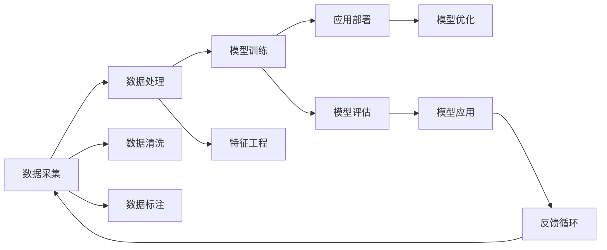

                 

## 1. 背景介绍

### 1.1 问题由来

21世纪进入了一个高度变化（VUCA）的时代：全球政治经济环境动荡多变（Volatile），不确定性（Uncertain）无处不在，多样化（Varied）且复杂（Complex）的业务场景比比皆是，这一时代对企业和组织提出了极高的适应性和灵活性要求。在这样的背景下，快速学习（Rapid Learning）成为了企业和组织应对挑战、实现可持续发展的关键。

### 1.2 问题核心关键点

在快速变化的时代，企业需要能够快速适应并响应市场变化，实现持续创新。快速学习能力则是实现这一目标的核心：

1. **数据驱动决策**：能够迅速从海量数据中提取有价值的信息，进行科学决策。
2. **持续优化流程**：能够持续优化业务流程，提高效率。
3. **灵活应对市场**：能够灵活调整战略和策略，适应市场变化。
4. **快速迭代产品**：能够快速推出新产品或服务，抢占市场先机。

要实现这些目标，企业需要构建一套完整的快速学习体系，包括数据采集、数据处理、模型训练和应用部署等各个环节。本文将重点介绍如何利用现代数据科学技术和算法，构建快速学习体系，帮助企业在VUCA时代立于不败之地。

### 1.3 问题研究意义

快速学习能力的提升，对于提升企业竞争力、实现持续发展具有重要意义：

1. **提升决策质量**：通过快速学习，企业能够从海量数据中提取有用的信息，制定更加科学合理的决策。
2. **优化业务流程**：通过快速学习，企业能够持续优化业务流程，提高效率和质量。
3. **灵活应对市场**：通过快速学习，企业能够灵活调整策略，适应市场变化。
4. **加速产品迭代**：通过快速学习，企业能够快速推出新产品或服务，抢占市场先机。

## 2. 核心概念与联系

### 2.1 核心概念概述

为了更好地理解快速学习能力，我们首先介绍几个核心概念：

- **快速学习（Rapid Learning）**：在VUCA时代，企业需要具备快速适应和响应市场变化的能力，能够迅速从数据中提取有用的信息，制定科学决策，优化流程，快速迭代产品。

- **数据科学（Data Science）**：利用数据和技术手段，提取、分析和应用数据的过程。

- **机器学习（Machine Learning）**：一种通过算法从数据中自动学习规律，以优化决策的学科。

- **深度学习（Deep Learning）**：一种特殊的机器学习，通过多层神经网络进行特征提取和规律学习。

- **增强学习（Reinforcement Learning）**：通过与环境的互动，学习最优策略的过程。

这些概念相互关联，共同构成了快速学习体系的基础。通过深入理解和应用这些技术，企业可以构建高效的数据科学团队，形成强大的数据驱动决策能力。

### 2.2 核心概念原理和架构的 Mermaid 流程图



### 2.3 核心概念之间的联系

快速学习的核心流程可以概括为“数据采集、数据处理、模型训练和应用部署”四个环节。这些环节之间互相依赖，共同构成了快速学习的全流程：

- **数据采集**：通过传感器、日志、社交媒体等方式，收集海量数据。
- **数据处理**：对收集到的数据进行清洗、标注、特征工程等处理，形成可用于模型训练的数据集。
- **模型训练**：利用处理后的数据，通过机器学习或深度学习算法，训练模型。
- **应用部署**：将训练好的模型应用到实际业务场景中，进行决策支持或业务优化。

这些环节通过反馈循环不断迭代，形成快速学习的闭环系统。

## 3. 核心算法原理 & 具体操作步骤

### 3.1 算法原理概述

快速学习体系的核心算法包括数据采集与清洗、特征工程、模型训练和优化、应用部署等。这些算法共同构成了快速学习的基础。

### 3.2 算法步骤详解

以下是快速学习体系中的核心算法步骤：

1. **数据采集与清洗**：
   - 利用传感器、日志、社交媒体等方式，收集海量数据。
   - 对数据进行清洗、去重、异常值处理等，确保数据质量。

2. **特征工程**：
   - 利用领域知识，选择合适的特征，构建特征集合。
   - 对特征进行编码、归一化等预处理，以便于模型训练。

3. **模型训练与优化**：
   - 选择合适的模型，利用训练数据进行模型训练。
   - 对模型进行评估，选择最优模型。
   - 对模型进行优化，提升模型性能。

4. **应用部署与反馈循环**：
   - 将训练好的模型应用到实际业务场景中，进行决策支持或业务优化。
   - 收集反馈数据，进行模型迭代优化，形成持续改进的闭环系统。

### 3.3 算法优缺点

快速学习体系的优势在于能够快速适应市场变化，提升决策质量和业务效率。其缺点在于对数据质量、特征工程和模型选择的要求较高，且需要持续的资源投入和人力支持。

### 3.4 算法应用领域

快速学习体系广泛应用于各行各业，包括：

- **金融**：通过快速学习，预测市场趋势，优化交易策略。
- **医疗**：通过快速学习，预测疾病发展，优化治疗方案。
- **零售**：通过快速学习，优化库存管理，提升销售额。
- **制造**：通过快速学习，优化生产流程，提高生产效率。
- **物流**：通过快速学习，优化配送路线，提升物流效率。

## 4. 数学模型和公式 & 详细讲解

### 4.1 数学模型构建

快速学习的数学模型可以简单地概括为：

$$
\text{模型} = \text{特征工程} \times \text{训练数据} \rightarrow \text{模型评估} \rightarrow \text{优化与调整}
$$

其中，特征工程是核心环节，它决定了模型的表现。训练数据的质量和数量也直接影响模型的效果。

### 4.2 公式推导过程

以线性回归为例，其数学模型为：

$$
y = \theta_0 + \theta_1 x_1 + \theta_2 x_2 + \ldots + \theta_n x_n
$$

其中，$y$为因变量，$\theta_0$为截距，$\theta_1, \theta_2, \ldots, \theta_n$为回归系数，$x_1, x_2, \ldots, x_n$为自变量。

### 4.3 案例分析与讲解

以金融风控为例，我们可以构建以下模型：

1. **特征工程**：选择历史交易金额、交易频率、用户行为等特征，进行归一化处理。
2. **模型训练**：利用历史交易数据，训练线性回归模型。
3. **模型优化**：利用交叉验证等方法，对模型进行评估和优化。
4. **应用部署**：将训练好的模型应用到新交易的预测中，进行风险控制。

## 5. 项目实践：代码实例和详细解释说明

### 5.1 开发环境搭建

快速学习的项目实践需要强大的计算能力和丰富的数据资源。以下是开发环境搭建的步骤：

1. **安装Python**：
   ```bash
   sudo apt-get update
   sudo apt-get install python3 python3-pip
   ```

2. **安装必要的库**：
   ```bash
   pip install numpy pandas scikit-learn scikit-optimize
   ```

3. **配置开发环境**：
   ```bash
   conda create --name rapid_learning python=3.7
   conda activate rapid_learning
   ```

### 5.2 源代码详细实现

以下是一个简单的线性回归模型实现的代码示例：

```python
import numpy as np
from sklearn.linear_model import LinearRegression
from sklearn.metrics import mean_squared_error

# 数据集
X = np.array([[1, 2, 3], [4, 5, 6], [7, 8, 9]])
y = np.array([2, 4, 6])

# 训练模型
model = LinearRegression()
model.fit(X, y)

# 预测
y_pred = model.predict([[10, 11, 12]])

# 评估
mse = mean_squared_error(y, y_pred)
print("MSE:", mse)
```

### 5.3 代码解读与分析

代码中，我们首先定义了数据集X和y，然后使用线性回归模型进行训练和预测，最后计算模型预测值与真实值之间的均方误差（MSE）。

## 6. 实际应用场景

### 6.1 金融风险管理

金融行业面临高度不确定性和高风险，通过快速学习，企业可以构建高效的金融风险管理系统：

1. **数据采集**：通过日志、交易记录等方式，收集海量数据。
2. **数据处理**：对数据进行清洗、归一化等处理，形成可用于模型训练的数据集。
3. **模型训练**：利用处理后的数据，训练风险预测模型。
4. **应用部署**：将训练好的模型应用到交易审批中，进行风险控制。

### 6.2 医疗诊断

医疗行业对快速学习的需求同样迫切：

1. **数据采集**：通过医院、体检中心等方式，收集患者数据。
2. **数据处理**：对数据进行清洗、标注等处理，形成可用于模型训练的数据集。
3. **模型训练**：利用处理后的数据，训练疾病预测模型。
4. **应用部署**：将训练好的模型应用到患者诊断中，进行早期预警。

### 6.3 零售推荐系统

在零售行业，快速学习可以帮助企业构建高效的推荐系统：

1. **数据采集**：通过线上交易、社交媒体等方式，收集用户数据。
2. **数据处理**：对数据进行清洗、特征工程等处理，形成可用于模型训练的数据集。
3. **模型训练**：利用处理后的数据，训练推荐模型。
4. **应用部署**：将训练好的模型应用到商品推荐中，提升销售额。

### 6.4 未来应用展望

快速学习在未来的应用前景广阔，可以进一步拓展到更多的行业和领域，如制造、物流、交通等，带来更深层次的影响：

1. **制造**：通过快速学习，优化生产流程，提高生产效率。
2. **物流**：通过快速学习，优化配送路线，提升物流效率。
3. **交通**：通过快速学习，优化交通路线，减少拥堵。

## 7. 工具和资源推荐

### 7.1 学习资源推荐

1. **《Python数据科学手册》**：介绍Python数据科学库，包括NumPy、Pandas、Scikit-Learn等。
2. **《机器学习实战》**：涵盖机器学习基础知识和实战案例，适合初学者。
3. **《深度学习入门》**：介绍深度学习基础知识和常用模型，适合有一定基础的读者。
4. **Coursera《数据科学专业认证》**：由世界知名大学提供的系统课程，涵盖数据科学全流程。
5. **Kaggle竞赛平台**：通过参加数据科学竞赛，提升实战能力。

### 7.2 开发工具推荐

1. **Jupyter Notebook**：免费的交互式编程环境，支持Python等多种语言。
2. **Google Colab**：基于Jupyter Notebook的云服务，支持GPU等高性能计算资源。
3. **TensorBoard**：用于可视化模型训练过程和结果的工具。
4. **Weights & Biases**：用于跟踪和管理模型训练的库。

### 7.3 相关论文推荐

1. **《深度学习》（Ian Goodfellow等著）**：深度学习领域的经典之作，涵盖深度学习基础和应用。
2. **《强化学习》（Richard S. Sutton等著）**：强化学习领域的经典之作，涵盖强化学习基础和应用。
3. **《数据科学实战》（Joel Grus等著）**：介绍数据科学全流程，包括数据采集、处理、分析和应用。

## 8. 总结：未来发展趋势与挑战

### 8.1 研究成果总结

快速学习体系在数据科学和人工智能领域得到了广泛应用，其核心算法和思想已经相对成熟，但仍需进一步提升数据处理效率、优化模型性能和提高应用效果。

### 8.2 未来发展趋势

1. **自动化数据处理**：自动化数据清洗、标注等处理技术将得到进一步发展，提升数据质量。
2. **模型优化算法**：更高效的模型优化算法将出现，提升模型性能。
3. **跨领域融合**：跨领域数据融合技术将得到广泛应用，拓展应用范围。
4. **联邦学习**：联邦学习等分布式学习技术将得到应用，提高数据隐私和安全。

### 8.3 面临的挑战

1. **数据隐私与安全**：如何在保障数据隐私和安全的前提下，进行数据处理和模型训练。
2. **模型复杂度**：如何设计高效、轻量化的模型，提升模型训练和推理效率。
3. **数据质量**：如何保证数据的准确性和完备性，避免因数据质量问题影响模型效果。

### 8.4 研究展望

未来，快速学习体系将不断创新和进步，推动更多行业实现智能化转型：

1. **工业4.0**：通过快速学习，优化生产流程，提升生产效率。
2. **智慧城市**：通过快速学习，优化城市管理，提升城市运行效率。
3. **智能交通**：通过快速学习，优化交通系统，减少拥堵。

## 9. 附录：常见问题与解答

**Q1: 数据采集和清洗的重要性是什么？**

A: 数据采集和清洗是快速学习体系的基础，高质量的数据是保证模型性能的前提。

**Q2: 特征工程如何影响模型效果？**

A: 特征工程决定了模型的输入特征，选择合适的特征、进行合适的预处理，能够提升模型的性能。

**Q3: 机器学习算法有哪些优缺点？**

A: 机器学习算法具有适应性强的优点，但需要大量数据进行训练，对特征工程要求较高。

**Q4: 深度学习算法与传统机器学习算法有何不同？**

A: 深度学习算法能够处理高维数据，具有较强的非线性建模能力，但需要更多的计算资源和时间。

**Q5: 快速学习在实际应用中需要注意哪些问题？**

A: 在实际应用中，需要注意数据隐私和安全、模型复杂度和数据质量等问题。

---

作者：禅与计算机程序设计艺术 / Zen and the Art of Computer Programming

