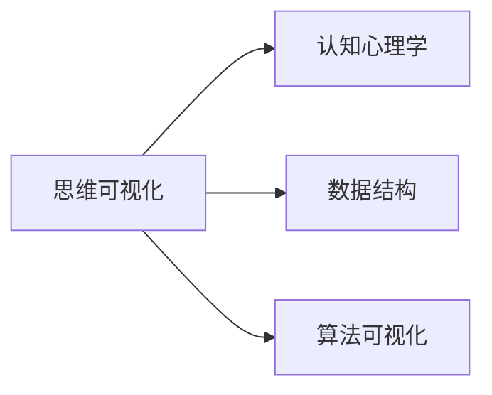

                 

# 思维可视化：复杂概念的图形表达

> 关键词：思维可视化, 复杂概念, 图形表达, 认知心理学, 数据结构, 算法可视化

## 1. 背景介绍

### 1.1 问题由来

随着信息时代的到来，人类获取和处理的信息量呈爆炸式增长。这种信息过载不仅增加了理解复杂概念的难度，也加剧了认知负荷，使得人们难以在短时间内高效地进行决策和创新。为了解决这一问题，思维可视化应运而生。

### 1.2 问题核心关键点

思维可视化是一种将复杂概念和数据图形化展示的技术，旨在通过图形表达和视觉化工具，帮助人们更直观、更快速地理解抽象概念和复杂问题。该技术应用广泛，从科学研究、工程设计到日常决策，都可以借助图形化的表达方式，减轻认知负担，提升理解效率。

## 2. 核心概念与联系

### 2.1 核心概念概述

为了更好地理解思维可视化的原理和应用，本节将介绍几个核心的概念：

- 思维可视化：通过图形、图表、动画等视觉化手段，将复杂概念、数据和过程进行直观展示，辅助理解和决策。
- 认知心理学：研究人类信息加工和认知过程的心理学分支，为思维可视化的设计提供了理论依据。
- 数据结构：用于组织、存储和操作数据的基本结构，是思维可视化的重要基础。
- 算法可视化：将复杂算法和计算过程进行图形化展示，帮助理解算法工作原理和优化空间。

这些核心概念之间的逻辑关系可以通过以下Mermaid流程图来展示：



这个流程图展示了一些核心概念之间的关系：

1. 思维可视化受到认知心理学的指导，以更好地满足人类的认知需求。
2. 数据结构是思维可视化的基础，提供数据组织和存储的方法。
3. 算法可视化是思维可视化的一个重要子集，旨在展示算法和计算过程。

## 3. 核心算法原理 & 具体操作步骤

### 3.1 算法原理概述

思维可视化的基本原理是将复杂概念和数据映射为图形，通过图形化的表达方式，使得信息处理和理解变得更加直观和高效。其核心步骤包括：

1. 概念抽象：将复杂概念或数据抽象成基本的图形元素（如节点、边、颜色等）。
2. 信息编码：将抽象后的概念和数据转化为图形表达，如节点连接、颜色标记等。
3. 视觉化展示：使用图形工具（如Graphviz、D3.js等）生成可视化的图形展示。
4. 互动反馈：在可视化图形的基础上，通过互动和反馈机制，增强理解深度。

### 3.2 算法步骤详解

思维可视化的具体实施可以分为以下关键步骤：

**Step 1: 抽象概念和数据**

- 确定需要可视化的概念或数据，进行抽象和归类。例如，将一个复杂的算法过程抽象成步骤和运算符。
- 使用图形化的符号和表示方式，将抽象后的概念和数据编码成基本的图形元素。

**Step 2: 设计可视化结构**

- 设计合理的可视化结构，如树形结构、网络图、流图等，确保图形表达的清晰性和逻辑性。
- 确定图形中的节点、边、颜色等视觉元素，使用统一的标准和规则进行表达。

**Step 3: 创建可视化图形**

- 选择合适的可视化工具，如Graphviz、D3.js、Raphael.js等，创建可视化的图形。
- 根据设计好的结构，将抽象后的概念和数据映射到图形上，生成最终的可视化图形。

**Step 4: 交互和反馈**

- 设计互动机制，如鼠标悬停、点击、拖拽等，增强用户与图形的互动性。
- 提供反馈机制，如提示信息、动态效果等，帮助用户更好地理解和操作图形。

**Step 5: 评估和优化**

- 通过用户反馈和实际应用，评估可视化效果和可用性，发现并解决设计中的不足。
- 持续优化设计，改进图形的清晰度和互动性，提升用户理解深度。

### 3.3 算法优缺点

思维可视化具有以下优点：

1. 直观性强：通过图形化的表达方式，使得复杂概念和数据变得直观、易懂，降低了理解难度。
2. 信息量大：可以同时展示大量信息，方便快速查看和比较。
3. 交互性好：通过互动和反馈机制，用户可以主动探索和理解图形内容，提升学习效率。

同时，该方法也存在一些局限性：

1. 适应性有限：对于某些抽象或复杂度极高的概念，难以直接映射为图形，导致可视化效果不佳。
2. 实现复杂：设计和实现一个高质量的可视化工具，需要丰富的经验和技能，技术门槛较高。
3. 空间限制：对于海量数据，图形展示可能存在空间限制，难以全面呈现。
4. 静态性不足：对于动态变化的数据，静态的图形展示可能无法及时反映最新的变化。

### 3.4 算法应用领域

思维可视化技术广泛应用于各个领域，以下是几个典型的应用场景：

- 科学研究：在物理学、化学、生物学等领域，思维可视化用于展示复杂的实验过程、数据结果和模型结构。
- 工程设计：在机械设计、电路设计等领域，思维可视化用于展示组件关系、工作流程和交互效果。
- 项目管理：在项目规划、资源调度等领域，思维可视化用于展示任务依赖关系、进度和成本等关键指标。
- 教育培训：在教学、培训等领域，思维可视化用于展示学习内容、逻辑结构和解题思路。
- 金融分析：在金融市场分析、投资决策等领域，思维可视化用于展示市场数据、交易关系和风险模型。

## 4. 数学模型和公式 & 详细讲解 & 举例说明

### 4.1 数学模型构建

在思维可视化中，数学模型和公式的表达是其重要基础。例如，在展示数学问题解决过程时，可以使用图形化的符号和表达式，清晰地表示问题定义和求解步骤。

### 4.2 公式推导过程

以二叉树为例，展示如何通过图形化表达二叉树的结构和性质。二叉树是一种树形结构，具有明确的节点和边关系。其数学表示可以定义为：

$$
T = (N, E)
$$

其中，$N$ 表示节点集合，$E$ 表示边集合。对于节点 $n$，有左右子树 $n.l$ 和 $n.r$，即：

$$
n = (n.v, n.l, n.r)
$$

其中，$n.v$ 表示节点的值，$n.l$ 表示左子树，$n.r$ 表示右子树。二叉树的图形化表达如图 1 所示：

```plaintext
     5
    / \
   3   7
  / \   \
 2   4   6
```

通过图形化的表达，可以直观地看出二叉树的层次结构、节点值和子树关系。

### 4.3 案例分析与讲解

以 Dijkstra 算法为例，展示如何在图形中表示算法的执行过程。Dijkstra 算法是一种用于求解带权图最短路径的算法，其基本步骤包括：

1. 初始化起点，令起点距离为0，其他节点距离为无穷大。
2. 每次选取距离起点最近的未处理节点，更新其邻居节点的距离。
3. 重复步骤2，直到所有节点都被处理完毕。

使用图形化的方式展示 Dijkstra 算法的执行过程如图 2 所示：

```plaintext
     4
   /   \
  2     6
 / \     \
1   3     5
      / \
     4   7
```

从图 2 中可以看出，每次选取距离起点最近的未处理节点（红色节点），更新其邻居节点的距离（蓝色节点）。通过这种图形化的方式，可以清晰地理解算法的执行步骤和计算过程。

## 5. 项目实践：代码实例和详细解释说明

### 5.1 开发环境搭建

在进行思维可视化实践前，我们需要准备好开发环境。以下是使用Python进行PyTorch开发的环境配置流程：

1. 安装Anaconda：从官网下载并安装Anaconda，用于创建独立的Python环境。

2. 创建并激活虚拟环境：
```bash
conda create -n pytorch-env python=3.8 
conda activate pytorch-env
```

3. 安装PyTorch：根据CUDA版本，从官网获取对应的安装命令。例如：
```bash
conda install pytorch torchvision torchaudio cudatoolkit=11.1 -c pytorch -c conda-forge
```

4. 安装Matplotlib：用于生成可视化图形。
```bash
pip install matplotlib
```

5. 安装D3.js：用于创建交互式Web图表。
```bash
npm install d3 --save
```

6. 安装Graphviz：用于生成图形表示和布局。
```bash
conda install graphviz -c conda-forge
```

完成上述步骤后，即可在`pytorch-env`环境中开始思维可视化实践。

### 5.2 源代码详细实现

下面我们以二叉树展示为例，给出使用Python和D3.js实现思维可视化的代码。

首先，定义二叉树类：

```python
class BinaryTree:
    def __init__(self, value):
        self.value = value
        self.left = None
        self.right = None

    def insert_left(self, value):
        self.left = BinaryTree(value)
        return self.left

    def insert_right(self, value):
        self.right = BinaryTree(value)
        return self.right
```

然后，创建二叉树并绘制图形：

```python
import d3
import graphviz

# 创建二叉树
root = BinaryTree(5)
root.insert_left(3)
root.insert_right(7)
root.left.insert_left(2)
root.left.insert_right(4)
root.right.insert_left(6)
root.right.insert_right(8)

# 将二叉树转换为Graphviz格式
dot = graphviz.Digraph()
dot.attr(rankdir='LR')
dot.node('5', '5')
dot.node('3', '3')
dot.node('7', '7')
dot.node('2', '2')
dot.node('4', '4')
dot.node('6', '6')
dot.node('8', '8')
dot.edge('5', '3')
dot.edge('5', '7')
dot.edge('3', '2')
dot.edge('3', '4')
dot.edge('7', '6')
dot.edge('7', '8')

# 生成图形并保存
dot.render('binary_tree', format='png')
```

最后，使用D3.js创建交互式图表：

```html
<!DOCTYPE html>
<html>
<head>
    <title>Binary Tree Visualization</title>
    <script src="https://d3js.org/d3.v7.min.js"></script>
</head>
<body>
    <svg width="600" height="400"></svg>
    <script>
        d3.select('svg')
            .append('g')
            .attr('transform', 'translate(100, 100)');

        var nodes = d3.select('svg').selectAll('g.node')
            .data(root)
            .enter()
            .append('g')
            .attr('class', 'node')
            .attr('transform', 'translate(' + d.x + ',' + d.y + ')');

        nodes.append('circle')
            .attr('r', 10)
            .style('fill', function (d) {
                return d.value === 5 ? 'red' : 'green';
            })
            .call(d3.drag()
                .on('start', dragstarted)
                .on('drag', dragged)
                .on('end', dragended));

        nodes.append('text')
            .text(function (d) {
                return d.value;
            });

        function dragstarted(d) {
            if (!d3.event.active) d3.select('body').style('cursor', 'grabbing');
            d.fx = d.x;
            d.fy = d.y;
        }

        function dragged(d) {
            d.fx = d3.event.x;
            d.fy = d3.event.y;
        }

        function dragended(d) {
            if (!d3.event.active) d3.select('body').style('cursor', 'default');
            d.fx = null;
            d.fy = null;
        }
    </script>
</body>
</html>
```

通过上述代码，我们可以看到，思维可视化的实现可以分为两个主要步骤：

1. 使用Graphviz将二叉树转化为图形表示。
2. 使用D3.js创建交互式Web图表，并支持拖拽操作。

### 5.3 代码解读与分析

让我们再详细解读一下关键代码的实现细节：

**BinaryTree类**：
- `__init__`方法：初始化节点值和左右子树。
- `insert_left`方法：插入左子树节点。
- `insert_right`方法：插入右子树节点。

**Graphviz库**：
- `graphviz.Digraph()`：创建Graphviz图对象。
- `dot.node()`：添加节点。
- `dot.edge()`：添加边。
- `dot.render()`：将图对象保存为文件。

**D3.js库**：
- `d3.select('svg').selectAll('g')`：选择SVG元素和g元素。
- `d3.select('svg').selectAll('g')`：数据绑定和节点创建。
- `d3.drag()`：添加拖拽行为。

在二叉树的可视化实现中，我们使用了Graphviz库进行图形表示，D3.js库创建了交互式的Web图表。Graphviz库提供了丰富的图形表示和布局算法，可以自动生成美观的图形。D3.js库则提供了交互式的可视化能力，使得用户可以通过拖拽等操作与图形进行互动。

当然，实际应用中，还需要进一步优化和完善，如增加鼠标悬停效果、动画过渡等，以提升用户体验。

## 6. 实际应用场景

### 6.1 数据结构可视化

在数据结构教学中，思维可视化可以用于展示二叉树、图、堆等复杂数据结构，帮助学生更好地理解和掌握其工作原理。例如，在展示二叉树时，可以动态展示节点插入、删除和遍历过程，增强学习体验。

### 6.2 算法可视化

在算法学习中，思维可视化可以用于展示算法的执行过程和计算结果。例如，在展示Dijkstra算法时，可以动态展示节点距离的更新过程，帮助学生理解算法的执行步骤和计算过程。

### 6.3 项目管理

在项目管理中，思维可视化可以用于展示任务依赖关系、进度和成本等关键指标。例如，可以使用网络图展示项目进度和任务依赖关系，方便项目管理人员进行调度和优化。

### 6.4 金融分析

在金融市场分析中，思维可视化可以用于展示市场数据、交易关系和风险模型。例如，可以使用树状图展示股票市场的树形结构，展示股票之间的层级关系和交易关系。

## 7. 工具和资源推荐

### 7.1 学习资源推荐

为了帮助开发者系统掌握思维可视化的理论基础和实践技巧，这里推荐一些优质的学习资源：

1. 《计算机图形学：原理与实践》：由清华大学出版社出版的经典教材，详细介绍了计算机图形学的基本概念和算法。
2. 《可视化设计与实现》：一本关于可视化设计和实现的综合性书籍，涵盖从理论到实践的各个方面。
3. 《Python数据科学手册》：一本开源书籍，介绍了Python在数据科学和可视化中的应用。
4. D3.js官方文档：D3.js库的官方文档，提供了大量的示例代码和API参考。
5. Graphviz官方文档：Graphviz库的官方文档，提供了丰富的图形表示和布局算法。

通过对这些资源的学习实践，相信你一定能够快速掌握思维可视化的精髓，并用于解决实际的可视化问题。

### 7.2 开发工具推荐

高效的开发离不开优秀的工具支持。以下是几款用于思维可视化开发的常用工具：

1. Python：强大的编程语言，支持数据分析和图形表示。
2. R语言：专门用于统计分析和可视化开发的语言，提供了丰富的图形库和数据分析工具。
3. D3.js：专门用于Web数据可视化的库，提供了丰富的可视化组件和API。
4. Graphviz：专门用于生成图形表示和布局的库，支持多种图形格式和布局算法。

合理利用这些工具，可以显著提升思维可视化的开发效率，加快创新迭代的步伐。

### 7.3 相关论文推荐

思维可视化技术的发展源于学界的持续研究。以下是几篇奠基性的相关论文，推荐阅读：

1. "A Comparison of Graphviz vs. Visio"：比较了Graphviz和Visio在图形表示和布局上的优劣，提供了大量实例和分析。
2. "Visualizing Complex Information Using Multivariate Data Analysis"：探讨了使用多变量数据分析方法进行可视化的方法和实践。
3. "Interaction Design for Interactive Visualizations"：介绍了交互式可视化设计的方法和策略，提供了大量实例和分析。

这些论文代表了大语言模型微调技术的发展脉络。通过学习这些前沿成果，可以帮助研究者把握学科前进方向，激发更多的创新灵感。

## 8. 总结：未来发展趋势与挑战

### 8.1 总结

本文对思维可视化技术进行了全面系统的介绍。首先阐述了思维可视化的背景和意义，明确了其在辅助理解和决策方面的独特价值。其次，从原理到实践，详细讲解了思维可视化的数学原理和关键步骤，给出了思维可视化任务开发的完整代码实例。同时，本文还广泛探讨了思维可视化在多个领域的应用前景，展示了其巨大的潜力。此外，本文精选了思维可视化的各类学习资源，力求为读者提供全方位的技术指引。

通过本文的系统梳理，可以看到，思维可视化技术正成为信息时代的重要工具，助力人们更高效、直观地理解复杂概念和数据。未来，随着技术的不断发展，思维可视化将会在更多场景中得到应用，为人类认知智能的进化带来深远影响。

### 8.2 未来发展趋势

展望未来，思维可视化技术将呈现以下几个发展趋势：

1. 互动性增强：通过增加交互和反馈机制，使得用户可以更加主动地探索和理解图形内容，提升学习效率。
2. 可视化数据规模扩大：随着数据量的增加，可视化技术需要处理的数据规模也将不断扩大，需要更加高效和灵活的算法和工具。
3. 多模态数据融合：在实际应用中，可能需要同时展示多种类型的数据，如文本、图像、视频等，需要多模态数据融合技术。
4. 自适应可视化：根据用户需求和反馈，动态调整图形表示和布局，提升可视化的个性化和适应性。
5. 移动端和可穿戴设备支持：随着移动端和可穿戴设备的普及，可视化技术也需要支持这些设备的显示和交互需求。

以上趋势凸显了思维可视化技术的广阔前景。这些方向的探索发展，必将进一步提升可视化工具的功能和应用范围，为人类认知智能的进化带来新的动力。

### 8.3 面临的挑战

尽管思维可视化技术已经取得了瞩目成就，但在迈向更加智能化、普适化应用的过程中，它仍面临着诸多挑战：

1. 设计复杂性：思维可视化的设计需要考虑多方面的因素，如数据类型、用户需求、图形表达等，设计复杂度较高。
2. 技术门槛：可视化工具和算法的选择、配置和优化需要一定的技术积累，对开发者的技术水平提出了较高的要求。
3. 信息过载：可视化图表展示的信息量较大，用户可能面临信息过载的问题，需要有效的信息筛选和展示策略。
4. 交互体验：交互式可视化需要良好的用户体验，如响应速度、拖拽流畅度等，需要不断优化。
5. 可扩展性：随着数据规模的扩大，可视化工具和算法需要具备良好的可扩展性和适应性，以支持大规模数据的处理。

这些挑战需要我们在实践中不断探索和解决，以提升思维可视化工具的性能和用户体验。

### 8.4 研究展望

面对思维可视化面临的挑战，未来的研究需要在以下几个方面寻求新的突破：

1. 自动化设计：开发自动化思维可视化设计工具，根据数据和用户需求自动生成可视化方案。
2. 自适应算法：研究自适应算法，根据用户反馈和数据特征动态调整图形表示和布局。
3. 多模态融合：开发多模态数据融合技术，支持文本、图像、视频等不同类型数据的可视化展示。
4. 用户体验优化：研究用户体验设计方法，提升交互式可视化的响应速度和流畅度。
5. 数据压缩与重构：研究数据压缩和重构技术，提升可视化工具的可扩展性和适应性。

这些研究方向的探索，必将引领思维可视化技术迈向更高的台阶，为构建更加智能、直观和高效的信息展示工具铺平道路。面向未来，思维可视化技术还需要与其他人工智能技术进行更深入的融合，如机器学习、自然语言处理等，多路径协同发力，共同推动信息智能的进化。

## 9. 附录：常见问题与解答

**Q1：思维可视化是否适用于所有复杂概念？**

A: 思维可视化适用于大多数复杂概念和数据的展示，但对于某些抽象或高度复杂的问题，如哲学、社会科学等，可能需要结合其他工具和方法进行辅助理解。

**Q2：如何在思维可视化中处理大规模数据？**

A: 对于大规模数据的可视化，可以使用数据压缩和分块技术，将数据分批次展示，提高可视化的效率和可扩展性。例如，使用分页和滚动的方式展示大数据集。

**Q3：如何设计交互式可视化的用户界面？**

A: 设计交互式可视化用户界面需要考虑以下几个方面：
1. 响应速度：确保用户界面的响应速度流畅，避免卡顿和延迟。
2. 拖拽操作：提供灵活的拖拽和缩放功能，方便用户进行数据探索和分析。
3. 反馈机制：通过提示信息、动态效果等，增强用户的理解和操作体验。

**Q4：思维可视化在哪些场景下效果最佳？**

A: 思维可视化在以下场景中效果最佳：
1. 教学和培训：辅助学生和培训人员理解复杂概念和数据。
2. 科学研究和工程设计：展示实验过程、数据结果和组件关系。
3. 项目管理：展示任务依赖关系、进度和成本等关键指标。
4. 金融分析：展示市场数据、交易关系和风险模型。

总之，思维可视化需要根据具体场景和需求，选择合适的工具和方法，进行全面设计和优化。

---

作者：禅与计算机程序设计艺术 / Zen and the Art of Computer Programming

