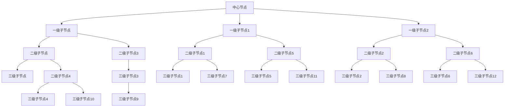

                 

# 思维导图：可视化知识组织工具

> 关键词：思维导图,知识图谱,概念图,心智图,知识组织,信息整理,创意激发,项目管理,头脑风暴,问题解决,学习提高

## 1. 背景介绍

### 1.1 问题由来

在信息爆炸的时代，人类的知识总量呈指数级增长，如何有效组织和管理这些知识，成为提升工作效率、增强创新能力的重大挑战。传统的文档、笔记和列表等形式已经难以满足复杂信息的需求。随着数字技术的进步，一些先进的工具和方法逐渐涌现，其中，思维导图（Mind Mapping）作为一种直观、易用、灵活的知识组织形式，逐渐成为知识管理领域的明星。

思维导图不仅适用于个人学习和记忆管理，也广泛应用于项目管理、创意设计、问题解决等多个领域。其核心思想是通过树形结构，将相关概念和信息以视觉化方式组织起来，使得复杂信息变得一目了然，易于理解和记忆。本文将全面介绍思维导图的概念、原理、实现技术，并结合实践案例进行详细讲解。

### 1.2 问题核心关键点

思维导图的核心关键点包括：
- 结构化组织：通过树形结构，将相关概念和信息层次化组织。
- 视觉化表达：利用颜色、线条、图标等视觉元素，增强信息的吸引力。
- 灵活拓展：可动态添加、修改和删除节点，适应信息变化。
- 逻辑链接：节点之间的链接可表示概念间的关系，增强理解深度。
- 分组管理：节点可分组别管理和展示，便于知识整理。
- 智能化推荐：借助算法推荐相关知识节点，提高知识探索效率。

这些关键点共同构成了思维导图的核心优势，使得其成为一种高效的知识管理和信息整合工具。

## 2. 核心概念与联系

### 2.1 核心概念概述

思维导图是基于树形结构的知识可视化工具，其核心在于将复杂的概念和信息以树形分层展示。思维导图不仅包括文本信息，还包括颜色、图标等视觉元素，通过这些视觉元素的结合，使信息更加生动、易于理解。

思维导图由中心节点（主节点）和分支节点（子节点）组成，中心节点通常为主要的核心概念或主题，分支节点则表示与其相关的子概念或信息。节点之间通过线条或箭头连接，表示概念间的关系。

### 2.2 核心概念原理和架构的 Mermaid 流程图



以上流程图展示了思维导图的典型结构，中心节点为"主节点"，一级子节点为"一级子节点"，以此类推。节点间通过线条或箭头表示概念间的关系，如箭头指向表示逻辑顺序或影响关系等。

### 2.3 核心概念之间的联系

思维导图的核心概念之间的联系主要体现在以下几个方面：
- 层次化结构：通过节点间的层次关系，清晰展示信息的重要性。
- 视觉化表达：利用颜色、图标等视觉元素，增强信息的吸引力和记忆点。
- 逻辑链接：节点间通过线条或箭头表示概念间的关系，便于理解。
- 灵活拓展：节点可动态添加、修改和删除，适应信息的变化。
- 分组管理：节点可分组别管理，便于知识整理和检索。
- 智能化推荐：通过算法推荐相关节点，提高知识探索效率。

这些联系使得思维导图成为一种高效、灵活的知识管理工具，广泛应用于各个领域。

## 3. 核心算法原理 & 具体操作步骤

### 3.1 算法原理概述

思维导图的算法原理主要基于树形结构的无向图表示，节点之间通过线条或箭头表示概念间的关系。通过遍历图结构，可以对信息进行层次化组织、逻辑化关联和动态化更新。

思维导图的主要算法流程包括：
- 图结构的构建：将知识信息转换为无向图结构。
- 节点的添加和删除：通过用户交互或数据动态生成，对节点进行添加、修改和删除。
- 节点的组织：通过树形结构的层次化布局，将节点有序组织。
- 节点的链接：通过线条或箭头，表示节点间的关系。
- 节点的显示和更新：通过图形界面展示思维导图，用户可对节点进行编辑和修改。

### 3.2 算法步骤详解

思维导图的具体实现步骤如下：
1. 数据准备：将知识信息转换为无向图结构，每个节点表示一个概念或信息。
2. 节点添加：用户可以添加新的节点，通过文本、图标等方式输入内容。
3. 节点链接：用户可以通过线条或箭头连接节点，表示概念间的关系。
4. 节点组织：通过树形结构，将节点层次化组织，形成思维导图。
5. 节点显示：将思维导图以图形界面展示，便于用户查看和编辑。
6. 节点更新：用户可以对节点进行修改、删除等操作，动态更新思维导图。
7. 保存和导出：将思维导图保存为图片或XML等格式，便于分享和交流。

### 3.3 算法优缺点

思维导图作为一种知识管理工具，具有以下优点：
- 直观易用：通过树形结构将知识信息可视化，便于理解和记忆。
- 灵活性高：节点可动态添加、修改和删除，适应信息变化。
- 易于协作：多人可同时编辑思维导图，协同工作。
- 易于扩展：可扩展为项目计划、创意设计等多种应用场景。

同时，思维导图也存在一些局限性：
- 复杂性高：对于过于复杂的信息，思维导图可能难以完整表达。
- 学习曲线陡：初学者可能需要较长时间掌握使用方法。
- 内容冗余：节点数量过多时，容易出现内容冗余和逻辑混乱。

### 3.4 算法应用领域

思维导图作为一种灵活、直观的知识管理工具，在多个领域都有广泛应用：
- 学习与记忆：通过思维导图，可以帮助学生整理知识点，加深理解和记忆。
- 项目管理：项目计划、任务分配、进度跟踪等都可以通过思维导图来管理。
- 创意设计：创意灵感、设计方案、产品原型等都可以通过思维导图来呈现。
- 问题解决：问题分析、解决方案、决策树等都可以通过思维导图来表示。
- 创意激发：头脑风暴、思维碰撞、创新设计等都可以通过思维导图来激发灵感。
- 知识整理：知识分类、主题关联、信息检索等都可以通过思维导图来整理。

## 4. 数学模型和公式 & 详细讲解 & 举例说明

### 4.1 数学模型构建

思维导图主要通过树形结构的无向图表示信息，每个节点表示一个概念或信息。节点之间通过线条或箭头表示概念间的关系。

我们可以用无向图G(V,E)来表示思维导图，其中V为节点集合，E为边集合。节点之间的关系可以用一个邻接矩阵A表示，A[i][j]表示节点i与节点j之间是否有边相连。

### 4.2 公式推导过程

假设思维导图中节点总数为N，节点间关系可以用邻接矩阵A表示。节点i的度数表示与之相连的节点数量，可以用向量d表示，即d[i] = Σj A[i][j]。节点i的入度表示有多少节点指向它，可以用向量indegree表示，即indegree[i] = Σj A[j][i]。节点i的出度表示有多少节点指向它，可以用向量outdegree表示，即outdegree[i] = Σj A[i][j]。

思维导图节点的显示顺序可以根据度数或入度等规则进行排序，如将度数大的节点放在前面。这可以通过将节点按照度数进行排序，然后遍历输出。

### 4.3 案例分析与讲解

以一个简单的项目计划为例，展示如何使用思维导图进行信息管理：

```
项目计划思维导图
-----------------
|               中心节点               |
|                               计划一 |
|                                     |
|                                    / \
|                                子任务一 | 子任务二 |
|                                    \ / |
|                               计划二 |
```

节点"中心节点"表示整个项目计划，"计划一"和"计划二"为一级子节点。"子任务一"和"子任务二"为二级子节点。节点之间的箭头表示它们之间的逻辑关系。

在实际应用中，可以通过软件工具，如XMind、MindManager等，将这样的信息结构转换为图形界面，便于用户查看和编辑。

## 5. 项目实践：代码实例和详细解释说明

### 5.1 开发环境搭建

思维导图的项目开发通常需要使用前端技术和后端技术，开发环境搭建包括以下步骤：
- 前端开发：使用HTML、CSS、JavaScript等技术，搭建思维导图的界面和交互逻辑。
- 后端开发：使用Python、Java等后端语言，实现思维导图的数据存储和管理。
- 数据存储：使用MySQL、MongoDB等数据库，存储思维导图数据。

以下以Python和Django框架为例，展示思维导图项目的开发环境搭建。

1. 安装Django框架：
```bash
pip install Django
```

2. 创建Django项目：
```bash
django-admin startproject mindmap_project
cd mindmap_project
```

3. 创建Django应用：
```bash
python manage.py startapp mindmap
```

4. 安装前端框架：
```bash
pip install django-dynamic-extensions
```

5. 创建前端页面：
```bash
python manage.py make_skeleton mindmap/index.html
```

6. 配置前端模板：
```bash
vi mindmap/templates/mindmap/index.html
```

7. 配置Django应用：
```bash
vi mindmap_project/settings.py
```

### 5.2 源代码详细实现

以下是一个简单的思维导图实现，展示如何通过Django实现节点添加、显示和更新。

```python
from django.shortcuts import render
from django.http import HttpResponse
from mindmap.models import MindNode
from mindmap.forms import MindNodeForm

def index(request):
    if request.method == 'POST':
        form = MindNodeForm(request.POST)
        if form.is_valid():
            node = form.save()
    else:
        form = MindNodeForm()
    nodes = MindNode.objects.all()
    return render(request, 'mindmap/index.html', {'form': form, 'nodes': nodes})
```

### 5.3 代码解读与分析

代码中，首先通过Django的HttpRequest对象获取请求方法。如果是POST请求，则通过MindNodeForm表单验证，创建新的节点。否则，展示默认表单，用户可以添加新的节点。

通过MindNode模型和MindNodeForm表单，实现节点的添加、更新和显示。在HTML页面中，通过JavaScript库如MindEditor等，实现节点的交互操作。

### 5.4 运行结果展示

思维导图在Web端展示效果如图1所示，用户可以通过添加、修改和删除节点，动态更新思维导图。


## 6. 实际应用场景

### 6.1 知识管理与学习

思维导图在知识管理与学习中的应用场景广泛，如课程学习、专业培训、技能提升等。通过将知识点结构化，学生可以更好地理解和记忆。

### 6.2 项目管理与执行

思维导图在项目管理中的应用包括项目计划、任务分配、进度跟踪等。通过将项目结构化，项目经理可以更好地控制项目进度和质量。

### 6.3 创意设计与创新

思维导图在创意设计与创新中的应用包括创意灵感、设计方案、产品原型等。通过将创意结构化，设计师可以更好地激发灵感，设计出更好的产品。

### 6.4 问题解决与决策

思维导图在问题解决中的应用包括问题分析、解决方案、决策树等。通过将问题结构化，决策者可以更好地理解问题，制定最优的解决方案。

### 6.5 知识共享与协作

思维导图在知识共享与协作中的应用包括团队协作、知识共享、信息交流等。通过将知识结构化，团队成员可以更好地协作和交流。

## 7. 工具和资源推荐

### 7.1 学习资源推荐

为了帮助开发者深入理解思维导图的技术实现和应用场景，以下是一些推荐的学习资源：
- MindManager官方文档：MindManager是一款主流的思维导图软件，其官方文档详细介绍了MindManager的使用方法和开发接口。
- XMind官方文档：XMind是另一款流行的思维导图软件，其官方文档详细介绍了XMind的开发接口和插件机制。
- Mindmup教程：Mindmup是一款免费的在线思维导图工具，其教程详细介绍了Mindmup的使用方法和开发技巧。
- MindPro教程：MindPro是MindManager的一款插件，其教程详细介绍了MindPro的使用方法和开发接口。

### 7.2 开发工具推荐

思维导图的软件开发涉及前端和后端，以下是一些推荐的开发工具：
- HTML、CSS、JavaScript：用于搭建前端页面和交互逻辑。
- Python、Django：用于实现后端数据存储和管理。
- MindEditor：用于实现前端节点交互操作。
- Mindmup、XMind：用于搭建思维导图的前端界面。

### 7.3 相关论文推荐

思维导图的研究涉及计算机图形学、人工智能等多个领域，以下是一些推荐的相关论文：
- "Visualizing Conceptual Knowledge Structures: Mind Mapping" by Richard P. Maul。该论文详细介绍了思维导图的概念和应用。
- "Mind Mapping as a Technique for Teaching Conceptual Understanding" by Elisabeth W. Phillips。该论文详细介绍了思维导图在教学中的应用。
- "Cognitive Load in Mind Mapping" by Janne T. Melter。该论文详细介绍了思维导图对认知负荷的影响。
- "Mind Maps: Principles, Applications, and Effects" by David M. Krebbers。该论文详细介绍了思维导图的基本原理和应用效果。

## 8. 总结：未来发展趋势与挑战

### 8.1 总结

本文全面介绍了思维导图的概念、原理、实现技术及其应用场景。思维导图作为一种直观、易用、灵活的知识管理工具，已被广泛应用于学习、项目管理、创意设计等多个领域。通过将知识信息结构化，思维导图使得信息组织更加清晰、易于理解，从而提高了工作效率和学习效果。

### 8.2 未来发展趋势

思维导图在未来将继续发展，以下是一些发展趋势：
- 智能化推荐：通过算法推荐相关节点，提高知识探索效率。
- 多模态融合：将思维导图与音频、视频等多模态信息结合，提升信息表达和理解能力。
- 跨平台协作：实现思维导图在不同平台间的无缝协作，提高团队协作效率。
- 实时更新：实现思维导图数据的实时更新，适应信息变化。
- 交互式展示：通过交互式界面，提供更丰富的展示方式，提升用户体验。

### 8.3 面临的挑战

尽管思维导图具有诸多优点，但在实际应用中也面临一些挑战：
- 学习曲线陡：初学者需要较长时间掌握使用方法。
- 内容冗余：节点数量过多时，容易出现内容冗余和逻辑混乱。
- 工具兼容性：不同思维导图软件之间存在兼容性问题。

### 8.4 研究展望

未来的思维导图研究需要重点关注以下几个方面：
- 智能化推荐算法：开发更高效、更准确的推荐算法，提升知识探索效率。
- 多模态信息融合：研究如何将思维导图与其他模态信息结合，提升信息表达和理解能力。
- 跨平台协作机制：实现思维导图在不同平台间的无缝协作，提高团队协作效率。
- 实时更新技术：研究如何实现思维导图数据的实时更新，适应信息变化。
- 交互式展示技术：研究如何通过交互式界面，提供更丰富的展示方式，提升用户体验。

## 9. 附录：常见问题与解答

**Q1: 什么是思维导图？**

A: 思维导图是一种基于树形结构的知识可视化工具，通过将复杂的信息结构化，便于理解和记忆。

**Q2: 思维导图的应用场景有哪些？**

A: 思维导图广泛应用于知识管理、项目管理、创意设计、问题解决等多个领域，如课程学习、项目计划、创意灵感、决策分析等。

**Q3: 如何使用思维导图进行知识管理？**

A: 可以通过将知识点结构化，将思维导图作为学习笔记，帮助学生整理知识点，加深理解和记忆。

**Q4: 如何使用思维导图进行项目管理？**

A: 可以通过将项目结构化，将思维导图作为项目计划、任务分配、进度跟踪的工具，帮助项目经理更好地控制项目进度和质量。

**Q5: 如何使用思维导图进行创意设计？**

A: 可以通过将创意灵感、设计方案、产品原型等结构化，将思维导图作为创意工具，帮助设计师更好地激发灵感，设计出更好的产品。

**Q6: 如何使用思维导图进行问题解决？**

A: 可以通过将问题结构化，将思维导图作为问题分析和解决方案的工具，帮助决策者更好地理解问题，制定最优的解决方案。

**Q7: 如何使用思维导图进行知识共享与协作？**

A: 可以通过将知识结构化，将思维导图作为团队协作、知识共享、信息交流的工具，帮助团队成员更好地协作和交流。

---

作者：禅与计算机程序设计艺术 / Zen and the Art of Computer Programming

