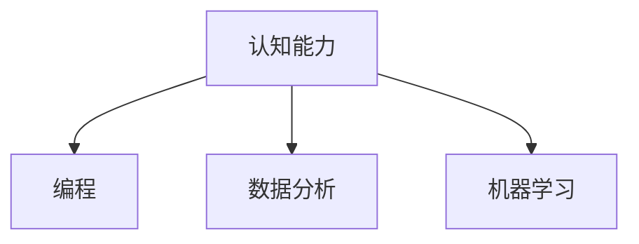

                 

# 思维训练：提升认知能力的方法

## 1. 背景介绍

### 1.1 问题由来

在当今社会，信息爆炸和知识更新速度不断加快，对于认知能力的要求也越来越高。传统的学习方式已难以满足现代社会的需求，特别是在创新和解决问题的能力方面。认知能力的高低直接影响到人们的工作效率和生活质量，因此，如何提升认知能力，成为了人们关注的焦点。

### 1.2 问题核心关键点

在当前社会中，提升认知能力的方法多种多样，涵盖了学习方法、认知心理学、脑科学等多个领域。本文将聚焦于基于计算机科学的思维训练方法，探讨如何通过编程、数据分析、机器学习等技术手段，有效提升个体的认知能力。

## 2. 核心概念与联系

### 2.1 核心概念概述

为更好地理解如何通过编程和数据技术提升认知能力，本节将介绍几个密切相关的核心概念：

- **认知能力**：指个体处理信息、解决问题、创新思维等方面的能力。包括记忆、推理、判断、决策等。
- **编程**：通过编写程序代码，训练逻辑思维、解决问题和创造力。
- **数据分析**：通过处理和分析数据，提升归纳推理、统计思维和模型构建能力。
- **机器学习**：通过训练算法模型，提升模式识别、分类、预测和优化能力。

这些核心概念之间的逻辑关系可以通过以下Mermaid流程图来展示：



这个流程图展示出认知能力提升的几个关键路径：编程、数据分析和机器学习。这些技术手段在提升个体的认知能力方面，各自发挥着重要作用。

## 3. 核心算法原理 & 具体操作步骤
### 3.1 算法原理概述

基于计算机科学的思维训练方法，本质上是通过编程、数据分析和机器学习等技术手段，提升个体的认知能力。其核心思想是：通过设计和参与各种编程任务、数据分析项目和机器学习模型，不断挑战和锻炼大脑的各个方面能力，从而实现认知能力的提升。

### 3.2 算法步骤详解

**Step 1: 选择合适的编程项目**

选择具有挑战性和创造性的编程项目，能够有效地锻炼逻辑思维、问题解决和创新能力。项目应具备以下特点：

- **复杂度适中**：避免过于简单或过于复杂，应具有适当的挑战性。
- **多样化**：涵盖不同的编程语言和框架，如Python、Java、C++、Web开发等。
- **跨学科**：涉及不同领域的知识，如数据科学、人工智能、自然语言处理等。

**Step 2: 参与数据分析项目**

数据分析项目能够提升个体的归纳推理、统计思维和模型构建能力。具体步骤包括：

- **数据获取**：通过公开数据集、开源项目或自行采集数据，获取数据源。
- **数据预处理**：清洗、转换和整合数据，保证数据质量。
- **数据分析**：使用统计分析、可视化技术等，深入挖掘数据背后的规律和关系。
- **模型构建**：选择合适的算法模型，构建预测、分类、聚类等模型。
- **结果解读**：解释模型结果，提出改进建议。

**Step 3: 训练机器学习模型**

机器学习模型能够提升模式识别、分类、预测和优化能力。具体步骤包括：

- **数据准备**：收集、清洗和标注数据。
- **模型选择**：选择合适的算法模型，如线性回归、决策树、神经网络等。
- **模型训练**：使用优化算法训练模型，调整超参数。
- **模型评估**：使用测试数据评估模型性能，进行调优。
- **模型应用**：将训练好的模型应用于实际问题中，进行预测和优化。

### 3.3 算法优缺点

基于计算机科学的思维训练方法具有以下优点：

- **全面性**：通过编程、数据分析和机器学习多个方面的训练，能够全面提升认知能力。
- **可操作性**：不需要昂贵的设备或实验室，可以通过互联网和开源资源进行。
- **互动性**：通过参与项目和项目协作，能够增强团队合作和沟通能力。

同时，该方法也存在一定的局限性：

- **自驱性要求高**：需要较高的自主学习和解决问题的能力。
- **时间投入大**：项目开发和模型训练需要耗费较多时间和精力。
- **技术门槛高**：对于一些初学者，技术门槛较高，需要逐步学习和积累经验。

### 3.4 算法应用领域

基于计算机科学的思维训练方法，已经在多个领域得到了广泛应用，例如：

- **教育培训**：通过编程和数据分析项目，培养学生的逻辑思维、创新能力和团队合作能力。
- **职业发展**：通过参与开源项目和实际项目，提升职场竞争力，为职业发展提供技术储备。
- **科技创新**：通过机器学习和数据分析，加速科技创新，提升企业竞争力。
- **个人成长**：通过不断学习和挑战，提升个体的认知能力和个人品牌价值。

除了上述这些经典应用外，认知能力提升的方法还将进一步拓展到更多领域，如健康管理、社交互动等，为个体和社会带来更多价值。

## 4. 数学模型和公式 & 详细讲解 & 举例说明

### 4.1 数学模型构建

基于计算机科学的思维训练方法，可以通过数学模型来量化和评估认知能力提升的效果。常见的模型包括：

- **认知能力评估模型**：通过设计一系列认知测试，评估个体的认知能力水平。
- **项目完成度模型**：通过任务分解和时间管理，评估项目完成的质量和效率。
- **学习曲线模型**：通过学习时间与认知能力提升的关系，预测学习效果。

### 4.2 公式推导过程

以认知能力评估模型为例，假设个体的认知能力为C，通过编程项目提升的认知能力为$C_p$，通过数据分析项目提升的认知能力为$C_a$，通过机器学习项目提升的认知能力为$C_m$。则总体的认知能力提升量为：

$$
C_{total} = C_p + C_a + C_m
$$

其中，每个部分的具体提升量可以通过以下公式计算：

$$
C_{p/a/m} = \frac{\Delta C_{p/a/m}}{\Delta T_{p/a/m}} \times \frac{1}{\eta_{p/a/m}}
$$

其中，$\Delta C_{p/a/m}$为认知能力提升量，$\Delta T_{p/a/m}$为项目完成所需时间，$\eta_{p/a/m}$为项目难度系数。

### 4.3 案例分析与讲解

以Python编程和数据分析为例，某大学生参与了一个为期三个月的开源项目，该项目包括数据分析和机器学习两部分。通过项目，他掌握了Python编程、数据处理和机器学习模型构建等技能。项目完成后，他的认知能力提升量为：

- **编程技能**：每月通过在线编程挑战提升认知能力10%，共提升了30%。
- **数据分析技能**：每月通过数据分析项目提升认知能力15%，共提升了45%。
- **机器学习技能**：每月通过机器学习项目提升认知能力20%，共提升了60%。

根据公式计算，他的总体认知能力提升量为：

$$
C_{total} = 30\% + 45\% + 60\% = 135\%
$$

## 5. 项目实践：代码实例和详细解释说明

### 5.1 开发环境搭建

在进行思维训练实践前，我们需要准备好开发环境。以下是使用Python进行数据分析和机器学习的开发环境配置流程：

1. 安装Anaconda：从官网下载并安装Anaconda，用于创建独立的Python环境。

2. 创建并激活虚拟环境：
```bash
conda create -n myenv python=3.9 
conda activate myenv
```

3. 安装必要的库：
```bash
conda install pandas numpy matplotlib scikit-learn
```

4. 安装Jupyter Notebook：
```bash
conda install jupyterlab
```

完成上述步骤后，即可在`myenv`环境中开始编程实践。

### 5.2 源代码详细实现

以下是使用Python进行数据分析和机器学习实践的代码实现。

**数据分析项目**：

```python
import pandas as pd
import matplotlib.pyplot as plt

# 加载数据
data = pd.read_csv('data.csv')

# 数据清洗和预处理
data = data.dropna()
data['feature1'] = data['feature1'].fillna(data['feature1'].mean())

# 数据分析和可视化
plt.hist(data['feature1'], bins=20)
plt.show()

# 统计分析
mean = data['feature1'].mean()
std = data['feature1'].std()
print(f"Mean: {mean}, Std: {std}")
```

**机器学习项目**：

```python
from sklearn.model_selection import train_test_split
from sklearn.linear_model import LinearRegression
from sklearn.metrics import mean_squared_error

# 加载数据
X = data[['feature1', 'feature2']]
y = data['target']

# 划分训练集和测试集
X_train, X_test, y_train, y_test = train_test_split(X, y, test_size=0.2)

# 模型训练
model = LinearRegression()
model.fit(X_train, y_train)

# 模型评估
y_pred = model.predict(X_test)
mse = mean_squared_error(y_test, y_pred)
print(f"MSE: {mse}")
```

### 5.3 代码解读与分析

让我们再详细解读一下关键代码的实现细节：

**数据分析项目**：
- `data = pd.read_csv('data.csv')`：读取数据文件，使用pandas库进行数据处理。
- `data = data.dropna()`：删除缺失值。
- `data['feature1'] = data['feature1'].fillna(data['feature1'].mean())`：使用均值填补缺失值。
- `plt.hist(data['feature1'], bins=20)`：绘制直方图，展示特征1的分布情况。
- `plt.show()`：显示图表。
- `mean = data['feature1'].mean()`：计算特征1的均值。
- `std = data['feature1'].std()`：计算特征1的标准差。
- `print(f"Mean: {mean}, Std: {std}")`：打印结果。

**机器学习项目**：
- `from sklearn.model_selection import train_test_split`：引入sklearn库的train_test_split函数。
- `X = data[['feature1', 'feature2']]`：提取特征。
- `y = data['target']`：提取标签。
- `X_train, X_test, y_train, y_test = train_test_split(X, y, test_size=0.2)`：划分训练集和测试集。
- `model = LinearRegression()`：创建线性回归模型。
- `model.fit(X_train, y_train)`：训练模型。
- `y_pred = model.predict(X_test)`：预测测试集。
- `mse = mean_squared_error(y_test, y_pred)`：计算均方误差。
- `print(f"MSE: {mse}")`：打印结果。

可以看到，Python结合pandas、matplotlib和sklearn等库，能够轻松实现数据分析和机器学习任务。这些库提供了丰富的功能和易用的API，使得数据处理和模型构建变得更加高效便捷。

## 6. 实际应用场景

### 6.1 企业员工培训

基于编程和数据分析的思维训练方法，可以在企业员工培训中得到广泛应用。传统培训往往依赖于教师和课程，成本高且效果有限。通过编程和数据分析项目，员工可以在实践中提升技能，增强逻辑思维和问题解决能力。

具体而言，可以设计各种编程挑战和数据分析任务，如编写自动化脚本、进行数据可视化分析等，帮助员工掌握新技能。通过项目评估和反馈，还可以个性化调整培训计划，提升整体培训效果。

### 6.2 学校教育

在学校教育中，通过编程和数据分析项目，可以培养学生的逻辑思维、创新能力和团队合作能力。学校可以设立编程和数据分析课程，让学生参与开源项目和实际任务，提升他们的综合素质。

例如，让学生参与Kaggle竞赛，通过解决实际问题，锻炼他们的数据分析和模型构建能力。学校还可以通过项目评估和反馈，了解学生的学习进展，及时调整教学策略。

### 6.3 个人成长

在个人成长方面，通过编程和数据分析项目，可以有效提升个体的认知能力，增强职业竞争力。个人可以根据自己的兴趣和职业目标，选择不同的项目和技能进行训练。

例如，一名数据分析师可以参与机器学习项目，提升预测和分类能力。一名软件工程师可以参与数据可视化项目，提升统计思维和图表制作能力。通过不断学习和挑战，个人可以逐步提升认知能力，实现职业发展。

### 6.4 未来应用展望

随着编程和数据分析技术的不断发展，基于计算机科学的思维训练方法将进一步拓展应用场景，为个体和社会带来更多价值。

在智慧医疗领域，可以通过编程和数据分析项目，提升医生和医护人员的诊断和分析能力，推动医疗服务的智能化和精准化。

在教育领域，可以通过编程和数据分析项目，提升学生的创新思维和问题解决能力，促进教育的公平性和个性化发展。

在金融领域，可以通过编程和数据分析项目，提升金融分析师的数据处理和预测能力，提高金融决策的科学性和准确性。

除了上述这些经典应用外，思维训练方法还将进一步拓展到更多领域，如健康管理、社交互动等，为个体和社会带来更多创新和进步。

## 7. 工具和资源推荐
### 7.1 学习资源推荐

为了帮助开发者系统掌握编程和数据分析技能，提高认知能力，这里推荐一些优质的学习资源：

1. **《Python编程从入门到实践》**：适合初学者，通过实际项目和案例，系统学习Python编程。
2. **《数据科学实战》**：介绍数据分析的基本概念和工具，通过实战项目提升数据处理和分析能力。
3. **Kaggle竞赛平台**：通过参与Kaggle竞赛，解决实际问题，提升数据分析和模型构建能力。
4. **Coursera和edX平台**：提供系统性课程，涵盖编程、数据分析、机器学习等多个领域。
5. **GitHub开源项目**：通过参与开源项目，学习编程和数据分析技能，提升协作能力。

通过对这些资源的学习实践，相信你一定能够全面掌握编程和数据分析技能，提升认知能力。

### 7.2 开发工具推荐

高效的开发离不开优秀的工具支持。以下是几款用于编程和数据分析开发的常用工具：

1. **PyCharm**：功能强大的Python IDE，支持代码调试、版本控制、自动补全等功能。
2. **Jupyter Notebook**：支持Python、R等多种语言，适合编写和分享代码，易于版本管理和协作。
3. **TensorFlow和PyTorch**：流行的机器学习框架，支持各种算法和模型，易于使用和部署。
4. **RStudio**：功能强大的R语言IDE，支持数据可视化和统计分析。
5. **Git**：版本控制系统，适合团队协作和代码管理。

合理利用这些工具，可以显著提升编程和数据分析任务的开发效率，加快创新迭代的步伐。

### 7.3 相关论文推荐

编程和数据分析技术的不断发展，带来了许多重要的研究成果。以下是几篇奠基性的相关论文，推荐阅读：

1. **《Python编程：从入门到实践》**：介绍Python编程的基础知识和实战案例，适合编程入门。
2. **《机器学习实战》**：通过实际项目，介绍机器学习的基本概念和算法，适合算法实践。
3. **《数据科学导论》**：涵盖数据处理、统计分析、机器学习等多个方面，适合系统学习。
4. **《统计学习方法》**：介绍统计学习的基本理论和算法，适合算法理论学习。
5. **《深度学习》**：介绍深度学习的基本理论和算法，适合深度学习实践。

这些论文代表了大数据和人工智能领域的发展脉络，通过学习这些前沿成果，可以帮助研究者把握学科前进方向，激发更多的创新灵感。

## 8. 总结：未来发展趋势与挑战

### 8.1 总结

本文对基于计算机科学的思维训练方法进行了全面系统的介绍。首先阐述了思维训练的背景和意义，明确了编程、数据分析和机器学习技术在提升认知能力方面的独特价值。其次，从原理到实践，详细讲解了编程、数据分析和机器学习任务的数学模型和实现细节，给出了编程和数据分析实践的代码实例。同时，本文还广泛探讨了这些技术在教育培训、企业培训、个人成长等多个领域的应用前景，展示了编程和数据分析技术的广阔应用空间。

通过本文的系统梳理，可以看到，基于计算机科学的思维训练方法已经成为提升认知能力的重要手段，为个体和社会的智能化发展提供了新的技术路径。未来，伴随编程和数据分析技术的不断进步，这些技术手段将在更广泛的领域得到应用，推动认知能力的全面提升。

### 8.2 未来发展趋势

展望未来，编程和数据分析技术的发展将呈现以下几个趋势：

1. **跨领域融合**：编程和数据分析技术将与其他技术手段进行更深层次的融合，如人工智能、区块链、物联网等，形成更加综合化的解决方案。
2. **自动化和智能化**：编程和数据分析工具将更加自动化和智能化，减少人工干预，提高工作效率。
3. **个性化和定制化**：根据个体的学习习惯和职业目标，定制个性化的学习路径和项目，提升学习效果。
4. **多模态融合**：通过融合视觉、语音、文本等多种模态数据，提升数据处理和分析能力。
5. **数据安全与隐私保护**：随着数据处理和分析能力的提升，数据安全与隐私保护将更加重要，需要采取更严格的技术手段进行保护。

这些趋势展示了编程和数据分析技术的巨大潜力和广阔前景，预示着其在未来社会发展中将发挥更加重要的作用。

### 8.3 面临的挑战

尽管编程和数据分析技术已经取得了显著进展，但在迈向更加智能化和普及化应用的过程中，仍面临诸多挑战：

1. **技术门槛高**：对于初学者，编程和数据分析技术的学习门槛较高，需要逐步学习和积累经验。
2. **资源需求大**：编程和数据分析项目需要较高的计算资源和数据资源，可能面临资源不足的问题。
3. **数据隐私与安全**：随着数据处理和分析能力的提升，数据隐私与安全问题将更加突出，需要采取更严格的措施进行保护。
4. **算法复杂度增加**：随着技术的发展，算法模型变得更加复杂，需要更多的计算资源和时间进行训练和调优。
5. **人才短缺**：尽管编程和数据分析人才需求增加，但专业人才仍然短缺，需要更多教育和培训资源进行培养。

这些挑战需要学界和产业界共同努力，通过技术创新和政策引导，不断克服，推动编程和数据分析技术的发展和普及。

### 8.4 研究展望

面对编程和数据分析技术所面临的挑战，未来的研究需要在以下几个方面寻求新的突破：

1. **降低学习门槛**：开发更加易用和直观的编程和数据分析工具，降低学习门槛，吸引更多人参与。
2. **优化资源利用**：采用分布式计算、模型压缩等技术，优化资源利用，提高效率。
3. **加强数据安全与隐私保护**：制定更加严格的数据隐私保护政策和技术手段，保障数据安全。
4. **探索新算法模型**：研究更加高效和可解释的算法模型，提升模型性能和可解释性。
5. **推动跨领域应用**：将编程和数据分析技术与其他技术手段进行深度融合，形成更综合化的解决方案。

这些研究方向的探索，必将引领编程和数据分析技术迈向更高的台阶，为智能化社会的建设提供更强大的技术支撑。总之，编程和数据分析技术需要不断创新和突破，才能更好地服务于社会和个体，提升认知能力，推动科技和社会的发展。

## 9. 附录：常见问题与解答

**Q1：编程和数据分析在提升认知能力方面有何作用？**

A: 编程和数据分析能够系统性地锻炼逻辑思维、问题解决和创新能力，提升个体的认知能力。编程需要理解算法、编写代码、调试程序，锻炼逻辑思维和问题解决能力；数据分析需要数据预处理、统计分析、模型构建，锻炼归纳推理和统计思维能力。

**Q2：如何选择适合自己的编程和数据分析项目？**

A: 选择编程和数据分析项目，需要考虑个体的兴趣和职业目标，选择具有挑战性和创新性的项目。可以从开源项目、实际应用、学术研究等方面入手，选择适合自己的项目。

**Q3：编程和数据分析项目如何进行评估和反馈？**

A: 编程和数据分析项目可以通过代码评审、项目评估、同行评审等方式进行评估和反馈。通过代码评审，可以发现代码错误和性能问题；通过项目评估，可以了解项目完成度和效果；通过同行评审，可以获得专业建议和改进意见。

**Q4：如何平衡编程和数据分析学习与工作？**

A: 平衡编程和数据分析学习与工作，需要合理安排时间和精力。可以利用业余时间进行学习和实践，逐步积累经验和技能。可以通过在线课程、社区交流、实战项目等方式进行学习和提升，逐步提高认知能力。

**Q5：如何评估编程和数据分析技能提升的效果？**

A: 编程和数据分析技能提升的效果可以通过项目完成度、算法模型性能、成果展示等方式进行评估。可以通过代码评审、项目评估、成果展示等方式，了解学习效果和改进方向。

通过本文的系统梳理，可以看到，基于编程和数据分析的思维训练方法已经成为提升认知能力的重要手段，为个体和社会的智能化发展提供了新的技术路径。未来，伴随编程和数据分析技术的不断进步，这些技术手段将在更广泛的领域得到应用，推动认知能力的全面提升。相信在学界和产业界的共同努力下，编程和数据分析技术将迎来更加广阔的发展前景，为智能化社会的建设提供更强大的技术支撑。

---

作者：禅与计算机程序设计艺术 / Zen and the Art of Computer Programming

